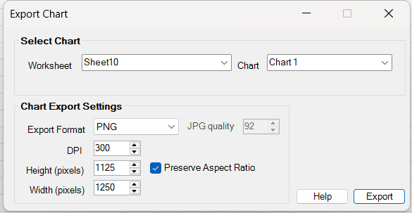

# Export Chart

BESHStatNG can export **Excel charts** as image files for reports, presentations, manuscripts, or sharing.

The exporter is optimized for **high-quality output**: it captures the chart as a vector **metafile** internally and then renders the final image at the **pixel size** and (where applicable) **DPI** you choose. This keeps text and lines crisp at higher resolutions.

## Open the Export Chart dialog

1. Create or select a chart in Excel.
2. Open **BESH Stat NG → Export chart** (button name may vary slightly depending on your ribbon layout).

If the active workbook contains no charts, BESHStatNG shows a message and the dialog does not open.

## Select chart

In the **Select Chart** section:

- **Worksheet**: Lists sheets in the active workbook that contain at least one chart (either an embedded chart on a worksheet or a chart sheet).
- **Chart**: Lists the charts on the selected worksheet (or the chart sheet itself).

!!! tip
    If you had a chart selected/active when you opened the dialog, BESHStatNG tries to pre-select that chart automatically.

## Chart export settings

### Export format

Choose an output format in **Export format**. The available formats are the items shown in the drop-down.

Recommended choices:

- **PNG** – best default for charts (**lossless**, crisp text and lines).
- **TIFF** – useful for print workflows and some journal submissions.
- **JPG** – smaller files, but **lossy** (can blur text and thin lines).
- **GIF** – mainly for web/legacy use; **palette-based** (8‑bit).
- **EMF** - Enhanced Metafile format is a 32-bit Microsoft Windows vector graphics format designed for high-quality, scalable images

!!! note "Vector formats"
    BESHStatNG internally captures charts as a vector metafile before rendering. If your build offers an **EMF** export option, it is a true vector output and does not use DPI/pixel sizing.

### DPI

**DPI** controls the intended print density of the exported image (**dots per inch**). BESHStatNG supports **72–1200 DPI**.

How DPI relates to pixel size:

- **Physical size (inches) = pixels / DPI**
- Example: 3000 px wide at 300 DPI → **10 inches** wide.

!!! note "GIF and DPI"
    GIF does not have a widely respected DPI concept (most software treats GIF purely as pixel dimensions). Therefore, the **DPI controls may be disabled** when GIF is selected.

### Width and Height (pixels)

**Width (pixels)** and **Height (pixels)** define the final pixel dimensions of the exported image.

- Larger pixel dimensions → more detail (and more memory required during export).
- Smaller pixel dimensions → smaller files and faster exports.

### Preserve Aspect Ratio

When enabled, changing **Width** automatically adjusts **Height** (and vice versa) to preserve the chart’s aspect ratio. This helps avoid stretched or squashed charts.

### JPG quality

When **JPG** is selected, **JPG quality** becomes available.

- Typical useful values are **75–95**.
- For charts, **90+** is strongly recommended to reduce artifacts around text and thin lines.
- Higher quality increases file size but reduces compression artifacts.

## Export

1. Choose the **format**, **DPI** (if applicable), and **pixel size**.
2. Click **Export**.
3. Choose a file name and location.

BESHStatNG creates the image file and confirms success. If export fails, you will see an error message (and details may also be written to the log file).

## Troubleshooting

### Output looks blurry

- Prefer **PNG** (lossless).
- Increase pixel size and/or DPI (for print, **300–600 DPI** is typical).
- Avoid low JPG quality values for charts.

### “Please select a chart …”

Select a chart (embedded chart or chart sheet) and reopen the dialog, or choose a sheet/chart from the drop-down lists.

### Out of memory / very large images

Exporting very large images can fail even if the final PNG/JPG file is small, because the exporter must build an **uncompressed bitmap** in memory during rendering.

If export fails:

- Reduce **Width/Height (pixels)**, or
- Reduce **DPI**, or
- use **BMP**, which supports tiled export (see below) or 
- Prefer **PNG** for best chart fidelity.

!!! tip "32-bit Excel"
    32‑bit Excel has a smaller address space and may fail on large exports sooner than 64‑bit Excel.

## Out-of-memory protection and internal limits

When exporting large images, the limiting factor is **not** the final file size (for example, PNG can compress extremely well), but the **temporary in-memory bitmaps** required during rendering and encoding. If these allocations fail inside Excel, you may see an `OutOfMemoryException`.

BESHStatNG includes internal safeguards to reduce the risk of memory-related failures.

### How memory usage is estimated

Before allocating a full bitmap, the exporter estimates the required working memory:

- Rendering uses **32-bit ARGB** (`Format32bppArgb`), roughly **4 bytes per pixel** (plus row/stride alignment).
- The raw bitmap size is estimated from `widthPx × heightPx × 4` with **4-byte stride alignment**.
- A **safety factor** is applied (currently **2.0**) to account for additional memory used by:
  - GDI+ during `Graphics.DrawImage(...)`
  - encoder working memory (especially for PNG/TIFF/JPEG)

In code terms, the check is based on:

- `EstimateWorkingBytes(widthPx, heightPx, bytesPerPixel:=4, safetyFactor:=2.0)`
- compared against `maxWorkingSetMB × 1024 × 1024`

### Default limits for 32-bit vs 64-bit Excel

If no explicit limit is configured, the exporter uses `DefaultMaxWorkingSetMB()`:

- **64-bit Excel:** `900 MB`
- **32-bit Excel:** `250 MB`

These defaults are conservative. Large contiguous allocations are much more likely to fail in **32-bit Excel** due to limited address space and fragmentation.

### What happens if the estimate exceeds the limit

- For **PNG/TIFF/JPG/GIF**, export is aborted with a message suggesting to:
  - reduce DPI or pixel dimensions, or
  - use **BMP**, which supports tiled export (see below)
- For **BMP**, the exporter automatically switches to **tiled streaming** mode when the estimate exceeds the limit.

!!! tip
    If you export very large figures, prefer **BMP (tiled)** or reduce pixel size/DPI. The on-disk PNG size is not a good indicator of whether export will succeed.

## BMP format and tiled export for very large images

BMP is supported as an export format and is the **only format** in BESHStatNG that currently supports **true tiled exporting** without third-party image libraries.

### Why only BMP supports tiling (currently)

The built-in .NET `System.Drawing` encoders for **PNG/JPG/TIFF/GIF** generally require the entire image to exist as a full bitmap in memory before encoding. BMP can be written as a straightforward raster stream, which makes tile-by-tile output possible.

!!! note
    If you need very large **PNG/TIFF/JPG** output, export to **BMP** and use an external converter that supports streaming/tiled conversion.
