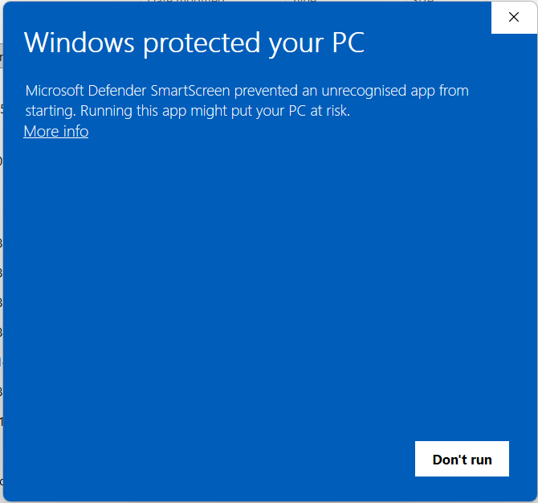
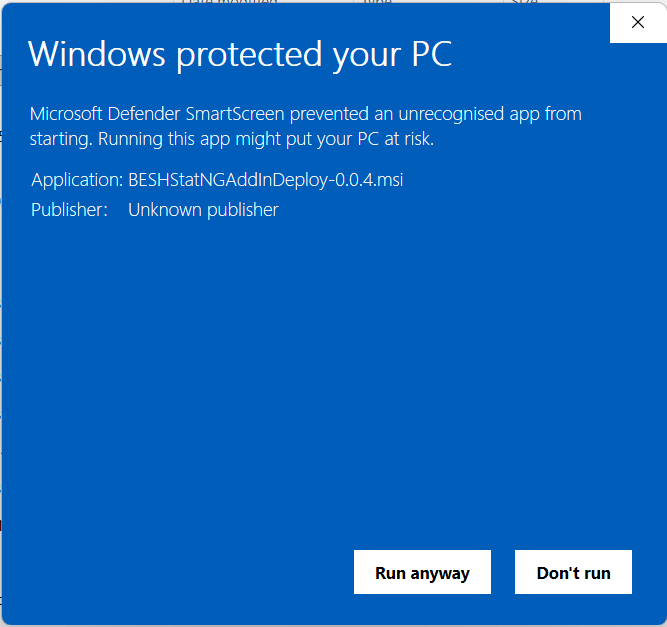

# Getting started

This page covers installation and the first things to check when **BESHStatNG** does not show up in Excel.

!!! tip
    Need to report a bug or suggest an improvement? Please use the [GitHub issue tracker](https://github.com/PeterSlezak/BESHstatNG/issues) so the problem can be tracked, reproduced, and linked to fixes.

## Install the add-in (MSI)

1. **Close Excel** (and any other Office apps).
2. Run the **BESHStatNG** `.msi` installer.
3. Start Excel and look for the **BESH Stat NG** tab on the ribbon.

!!! warning "Unsigned installer (Windows SmartScreen)"
    The installer is **not code-signed**, so Windows may show a blue *“Windows protected your PC”* (SmartScreen) or an *Unknown publisher* warning.

    - If you trust the file (downloaded from `beshstat.eu`), choose **More info → Run anyway**.
    - In managed/corporate environments, your IT policies may block unsigned installers.

### Unsigned installer (Windows SmartScreen)

### Unsigned installer (Windows SmartScreen - More info → Run anyway)

!!! tip "Downloaded file blocked (Mark of the Web)"
    If Windows blocks execution after download, right‑click the `.msi` → **Properties** → check **Unblock** (if present) → OK.

## Confirm the add-in loaded

If you don’t see the **BESH Stat NG** ribbon tab:

1. In Excel go to **File → Options → Add-ins**.
2. Check **Active Application Add-ins** for an entry that looks like BESHStatNG.
3. If you see it under **Disabled Application Add-ins**:

    - At the bottom, choose **Manage: Disabled Items → Go…**
    - Re-enable BESHStatNG.

## Excel Trust Center (common reasons add-ins are blocked)

Excel can block add-ins from locations it doesn’t trust.

- **Trusted Locations**: in **File → Options → Trust Center → Trust Center Settings → Trusted Locations**, add the folder where BESHStatNG is installed.
- **Protected View**: if your workbook opens in Protected View, click **Enable Editing** before running analysis.

!!! note
    BESHStatNG is an **Excel-DNA** `.xll` add-in installed by an MSI. How/where it’s installed depends on your MSI configuration.

## Updating / uninstalling

- To update, typically install the newer MSI **over** the existing version.
- To uninstall, use Windows **Apps & Features / Programs and Features**.

## Logs and error messages

When something fails, BESHStatNG writes a log file and may show an error dialog.

- The main log file is stored next to the add-in in:

    `...\ExtraFiles\Logs\all.log`

If you report an issue, include:

- what method you ran (e.g. *Kruskal‑Wallis*, *Cox regression*)
- what inputs you selected
- the relevant part of `all.log`

