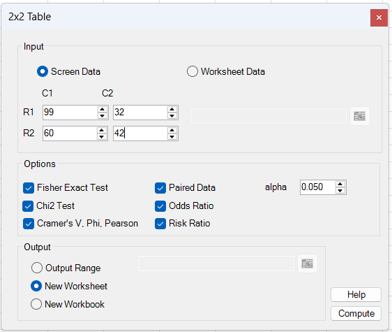
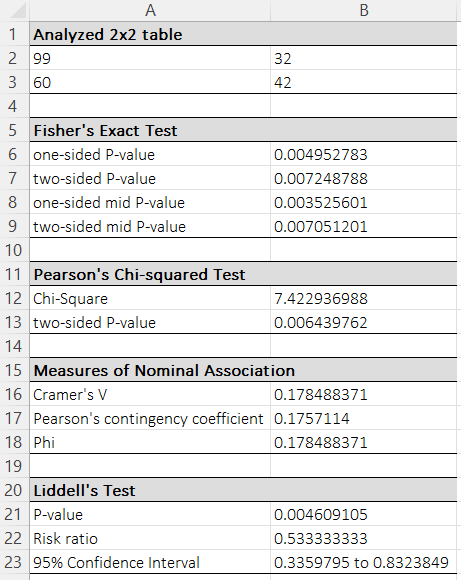
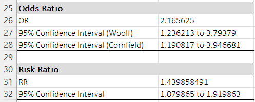

# 2x2 Table

**Includes:** Pearson chi-square, Fisher's exact (two-sided, one-sided, mid-p), measures of nominal association (Cramer's V, Phi, Pearson's contingency coefficient), odds ratio (OR) with Woolf and Cornfield confidence intervals, risk ratio (RR) with confidence interval at the selected level, and Liddell's exact test for paired (matched) 2x2 tables with exact odds-ratio confidence interval at the selected level.  
**Purpose:** Analyze a 2x2 contingency table with both significance tests and effect-size estimates.

## Overview

A 2x2 contingency table summarizes the joint counts of two binary variables (e.g., exposure yes/no by outcome yes/no). BESHStatNG can run both **asymptotic tests** (Pearson chi-square) and **exact tests** (Fisher), and reports common association measures and effect sizes (OR and RR).
If your data are **matched pairs** (paired binary outcomes on the same subjects), enable **Paired Data** to run **Liddell's exact test** (an exact McNemar-type test based on discordant pairs).
Depending on the options you select, BESHStatNG reports tests of association (Fisher’s exact and/or Pearson chi-square), effect sizes (OR, RR, Phi/Cramér’s V), and confidence intervals.

## Example table used in screenshots
The screenshots use the following counts:

\[
\begin{array}{c|cc}
 & C1 & C2 \\\hline
R1 & 99 & 32 \\
R2 & 60 & 42
\end{array}
\]

## Screenshots

### Input tab


### Results (tests and association measures)


### Results (odds ratio and risk ratio)


---

## When to use it

Use this tool when you have a **2x2 table of counts** and want to test whether the row and column variables are associated.

- Use **Pearson chi-square** when expected counts are reasonably large (rule of thumb: most expected counts >= 5).
- Use **Fisher's exact test** when counts are small or the table is sparse.
- Use **Odds ratio (OR)** and/or **Risk ratio (RR)** to report effect size.
- Use **Paired Data** when the 2x2 table summarizes **matched pairs** (e.g., before/after, paired diagnostic test outcomes). In that case the relevant information is in the **discordant cells**.

Typical examples:

- treatment (yes/no) × outcome (success/failure)
- exposure (yes/no) × disease (present/absent)
- before/after (paired) responses classified as yes/no

## Data entry (Screen data vs Worksheet data)

The 2x2 Table dialog supports two data entry modes:

### Screen Data (manual entry)

Enter the four cell counts directly into the dialog:

- \(a\) = R1–C1
- \(b\) = R1–C2
- \(c\) = R2–C1
- \(d\) = R2–C2

This is convenient for quick analyses.

### Worksheet Data

Select a 2×2 range in the worksheet that contains the four **counts** (no totals). The order in the selected range must match the displayed R1/R2 and C1/C2 layout.

### Output destination

- Output range (current sheet)
- New worksheet
- New workbook

---

## Options

- **Fisher Exact Test**  
  Adds Fisher’s exact test (one-sided and two-sided) and (optionally) mid-p values.
- **Chi2 Test**  
  Adds Pearson’s chi-squared test of independence (no continuity correction).
- **Cramer's V, Phi, Pearson**  
  Adds nominal association measures derived from Pearson’s chi-squared statistic.
- **Odds Ratio**  
  Adds \(OR\) with Woolf (log Wald) and Cornfield (exact/conditional) confidence intervals at the selected level.
- **Risk Ratio**  
  Adds \(RR\) with a log-scale (Wald) confidence interval at the selected level.
- **Paired Data**  
  Treats the 2×2 table as matched-pairs data and reports **Liddell’s exact test** (exact McNemar), a matched-pairs odds-ratio estimate based on discordant pairs, and an exact confidence interval at the selected level.
- **Alpha**  
  Two-sided significance level used for the OR, RR, and Liddell confidence intervals.  
  Default: **0.05** (95% confidence interval).

---

## Steps in the add-in
1. In Excel ribbon: **BESH Stat NG -> Analyse -> Contingency Table Analysis -> 2x2 Table**
2. Choose **Screen Data** (manual entry) or **Worksheet Data** (select a 2x2 range).
3. Select the desired options (tests and effect sizes).
4. Set **Alpha** for confidence intervals.  
   Default: **0.05** (95% confidence interval).
5. Choose an output location (new worksheet / workbook / range).
6. Click **Compute**.

---

## Output (how to read it)

### Analyzed 2×2 table
The four counts \(a,b,c,d\) are echoed in the output to confirm the analyzed data.

### Fisher’s Exact Test
Reports:

- **one-sided p-value** (reported as the smaller of the two one-sided tails)
- **two-sided p-value** (probability-ordering definition; see below)
- **one-sided mid-p** and **two-sided mid-p** (if enabled)

### Pearson’s Chi-squared Test
Reports the Pearson chi-squared statistic (df = 1) and its two-sided p-value.

### Measures of Nominal Association
Reports effect sizes derived from \(\chi^2\): Phi, Cramér’s V, and Pearson’s contingency coefficient.

### Liddell’s Test (paired data)
If **Paired Data** is checked, BESHStatNG reports Liddell’s exact test p-value (exact McNemar), a matched-pairs odds-ratio estimate based on discordant pairs, and an exact confidence interval at the selected level.

### Odds Ratio / Risk Ratio
If selected, BESHStatNG reports:

- **OR** with confidence intervals at the selected level (Woolf and Cornfield)
- **RR** with confidence interval at the selected level (log-scale Wald CI, reported on the RR scale)

---

## Notation

Let the 2×2 table be:

\[
\begin{array}{c|cc}
 & C1 & C2\\\hline
R1 & a & b\\
R2 & c & d
\end{array}
\qquad N=a+b+c+d
\]

Row totals: \(n_{1\cdot}=a+b\), \(n_{2\cdot}=c+d\)  
Column totals: \(n_{\cdot1}=a+c\), \(n_{\cdot2}=b+d\)

---

## Methods and formulas

### 1) Pearson’s chi-squared test (independence)

Expected counts under independence:

\[
E_{ij}=\frac{n_{i\cdot}n_{\cdot j}}{N}
\]

Pearson statistic:

\[
\chi^2 = \sum_{i=1}^{2}\sum_{j=1}^{2}\frac{(O_{ij}-E_{ij})^2}{E_{ij}}
\]

Degrees of freedom: \(df=(2-1)(2-1)=1\).  
Two-sided p-value: \(p = 1 - F_{\chi^2_1}(\chi^2)\).

> Note: BESHStatNG reports the **uncorrected** Pearson chi-square (equivalent to `chisq.test(tab, correct=FALSE)` in R).

---

### 2) Nominal association measures

Using \(N\) and \(\chi^2\) from Pearson’s test:

**Phi**

$$
\phi = \sqrt{\frac{\chi^2}{N}}
$$

**Cramér’s V** (general \(r\times c\))

$$
V = \sqrt{\frac{\chi^2}{N\,\min(r-1,\,c-1)}}
$$

For a 2×2 table, \(\min(r-1,c-1)=1\), so \(V=\phi\).

**Pearson’s contingency coefficient**

$$
C = \sqrt{\frac{\chi^2}{\chi^2 + N}}
$$

---

### 3) Fisher’s exact test (independence)

Conditioning on fixed margins \((n_{1\cdot},n_{2\cdot},n_{\cdot1},n_{\cdot2})\), the random table is determined by \(A=a\). Under \(H_0\) (independence), \(A\) has a hypergeometric distribution:

\[
P(A=a)=\frac{\binom{n_{\cdot1}}{a}\binom{n_{\cdot2}}{n_{1\cdot}-a}}{\binom{N}{n_{1\cdot}}}
\]

BESHStatNG reports:

**One-sided p-value** (reported as the smaller of the two tail probabilities)

$$
p_{\mathrm{one}}=\min\left\{\Pr(A\le a_{\mathrm{obs}}),\;\Pr(A\ge a_{\mathrm{obs}})\right\}.
$$

**Two-sided p-value (probability ordering)** (sum probabilities of all tables with probability less than or equal to the observed table)

$$
p_{\mathrm{two}}=\sum_{a:\,\Pr(A=a)\le \Pr\!\left(A=a_{\mathrm{obs}}\right)} \Pr(A=a).
$$

**Mid-p (optional)** (subtract half of the observed-table probability from the corresponding tail)

$$
p_{\mathrm{mid,one}} = p_{\mathrm{one}} - \frac{1}{2}\Pr\!\left(A=a_{\mathrm{obs}}\right),\qquad
p_{\mathrm{mid,two}} = 2\,p_{\mathrm{mid,one}}.
$$

> Notes on differences vs. R: `fisher.test()` uses the same probability-ordering definition for the two-sided p-value. One-sided p-values in R depend on the chosen `alternative`; BESHStatNG reports the **minimum** of the two one-sided tails.

---

### 4) Odds ratio (OR) and confidence intervals

**Estimate**

\[
\widehat{OR}=\frac{ad}{bc}
\]

#### Woolf confidence interval at level \(1-\alpha\) (log Wald)

\[
SE\big(\log(\widehat{OR})\big)=\sqrt{\frac{1}{a}+\frac{1}{b}+\frac{1}{c}+\frac{1}{d}}
\]

\[
\log(\widehat{OR}) \pm z_{1-\alpha/2}\,SE\big(\log(\widehat{OR})\big)
\quad\Rightarrow\quad
\left[\exp(L),\exp(U)\right]
\]

#### Cornfield confidence interval at level \(1-\alpha\) (exact/conditional)

BESHStatNG also reports a Cornfield-type CI obtained by inverting the conditional (fixed-margins) distribution. In R, this is closely matched by:

- `fisher.test(tab, conf.int=TRUE)$conf.int`

Small differences can occur due to tail definitions and rounding.

---

### 5) Risk ratio (RR) and confidence interval

Define the risk in each row as \(p_1=a/(a+c)\) and \(p_2=b/(b+d)\). Then

\[
\widehat{RR}=\frac{p_1}{p_2}=\frac{a/(a+c)}{b/(b+d)}
\]

Log-scale (Wald) standard error:

\[
SE\big(\log(\widehat{RR})\big)=\sqrt{\left(\frac{1}{a}-\frac{1}{a+c}\right)+\left(\frac{1}{b}-\frac{1}{b+d}\right)}
\]

Confidence interval on the RR scale at level \(1-\alpha\):

\[
\log(\widehat{RR}) \pm z_{1-\alpha/2}\,SE\big(\log(\widehat{RR})\big)
\quad\Rightarrow\quad
\left[\exp(L),\exp(U)\right]
\]

---

### 6) Paired data: Liddell’s exact test (exact McNemar)

When the 2×2 table represents matched pairs, the test uses only the **discordant** cells \(b\) and \(c\). Under \(H_0\) (no marginal difference), the number of discordant pairs in one direction follows:

\[
X \sim \mathrm{Binomial}(b+c,\;0.5)
\]

Two-sided exact p-value (Liddell / exact McNemar):

\[
p = 2\min\{P(X\le \min(b,c)),\;P(X\ge \max(b,c))\}
\]

BESHStatNG also reports a **paired ratio estimate** based on discordant pairs:

\[
\widehat{\theta}=\frac{b}{c}
\]

BESHStatNG computes an exact confidence interval for the matched-pairs odds ratio using
F-distribution quantiles with \(\alpha/2\), following the Liddell-style exact matched-pairs formulation.

The default is \(\alpha=0.05\), which gives a 95% exact confidence interval.

---

## R reference code

The code below reproduces the results shown in the screenshots for the example table \(a=99,b=32,c=60,d=42\). (Install packages once with `install.packages(...)`.)

```r
# Example table (rows R1/R2, columns C1/C2)
a <- 99; b <- 32; c <- 60; d <- 42
tab <- matrix(c(a, b, c, d), nrow = 2, byrow = TRUE,
              dimnames = list(R = c("R1","R2"), C = c("C1","C2")))
tab

# --- Pearson chi-square (no Yates) ---
chisq.test(tab, correct = FALSE)

# --- Fisher exact test ---
ft_two <- fisher.test(tab, alternative = "two.sided")  # probability ordering
ft_less <- fisher.test(tab, alternative = "less")
ft_greater <- fisher.test(tab, alternative = "greater")

p_one  <- min(ft_less$p.value, ft_greater$p.value)     # BESHStatNG one-sided
p_two  <- ft_two$p.value

# mid-p (computed by enumeration under fixed margins)
# This matches the definition used in the help text:
#   mid-one = one-sided - 0.5 * P(observed table); mid-two = 2 * mid-one
n1  <- sum(tab[1,]); n2 <- sum(tab[2,])
m1  <- sum(tab[,1]); m2 <- sum(tab[,2])
N   <- sum(tab)

# feasible range for A (= a)
amin <- max(0, n1 - m2)
amax <- min(n1, m1)
avec <- amin:amax

# hypergeometric probabilities for each feasible a
pA <- dhyper(avec, m1, m2, n1)
p_obs <- dhyper(a, m1, m2, n1)

# one-sided tail as minimum of tails
p_less_enum <- sum(pA[avec <= a])
p_great_enum <- sum(pA[avec >= a])
p_one_enum <- min(p_less_enum, p_great_enum)

p_mid_one <- p_one_enum - 0.5 * p_obs
p_mid_two <- 2 * p_mid_one

c(p_one = p_one, p_two = p_two, mid_one = p_mid_one, mid_two = p_mid_two)

# --- Odds ratio + CIs ---
OR <- (a*d)/(b*c)

# Woolf CI
alpha <- 0.05
z <- qnorm(1 - alpha/2)
se_or <- sqrt(1/a + 1/b + 1/c + 1/d)
ci_or_woolf <- exp(log(OR) + c(-1,1) * z * se_or)

# Cornfield / exact conditional CI (very close to BESHStatNG Cornfield CI)
ci_or_exact <- fisher.test(tab)$conf.int

list(OR = OR, woolf = ci_or_woolf, exact = ci_or_exact)

# --- Risk ratio + CI (RR scale) ---
RR <- (a/(a+c)) / (b/(b+d))
se_rr <- sqrt((1/a - 1/(a+c)) + (1/b - 1/(b+d)))
ci_rr <- exp(log(RR) + c(-1,1) * z * se_rr)

list(RR = RR, CI = ci_rr)

# --- Paired data: exact McNemar / Liddell p-value (uses discordants b and c) ---
# If tab is a matched-pairs table, use:
# b = off-diagonal (R1,C2), c = off-diagonal (R2,C1)
binom.test(x = min(b, c), n = b + c, p = 0.5, alternative = "two.sided")$p.value

# Paired ratio estimate and CI via Clopper–Pearson on p=b/(b+c)
p_hat <- b/(b+c)
ci_p <- binom.test(b, b+c)$conf.int
ci_ratio <- ci_p / (1 - ci_p)  # transform p -> p/(1-p)
list(ratio = b/c, CI = ci_ratio)
```

### Expected differences vs. R

- **One-sided Fisher p-value:** BESHStatNG reports the *minimum* of the two one-sided tails. In R, `fisher.test(..., alternative=...)` returns one specific tail.
- **Mid-p:** Base R does not report mid-p by default; the code above computes it by enumeration.
- **Cornfield CI:** `fisher.test(tab)$conf.int` typically matches closely; tiny differences can occur due to rounding and method details.

## See also

- [R×C Table](rxc-table.md)
- [Mantel-Haenszel Test](mantel-haenszel-test.md)
- [Home](../index.md)