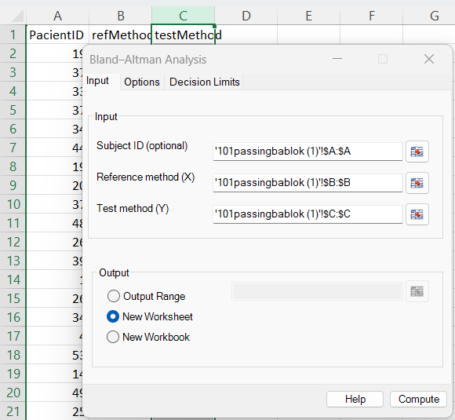
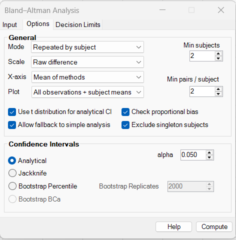
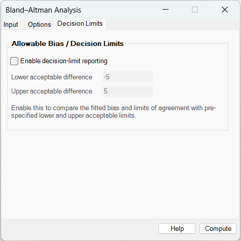
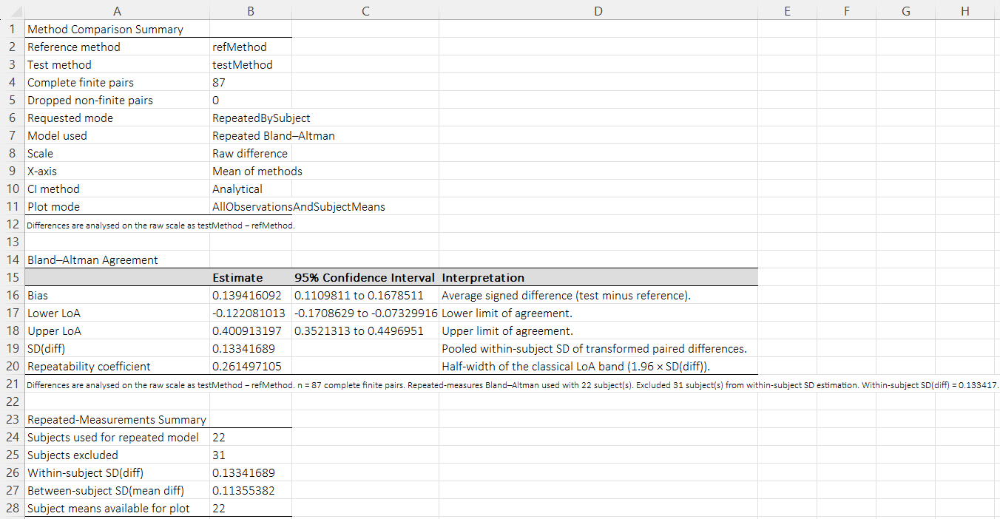
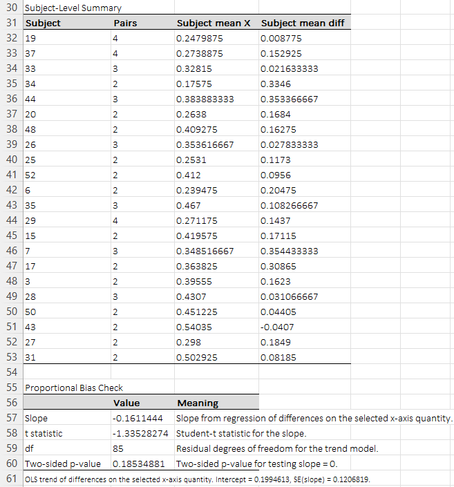
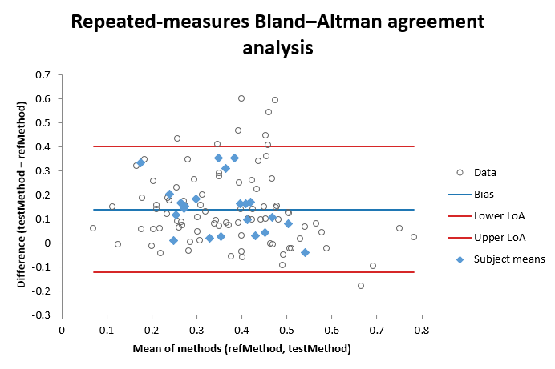

# Bland–Altman Analysis

**Includes:** simple paired Bland–Altman analysis, repeated-measures Bland–Altman by subject, raw / percentage / log-ratio scales, multiple x-axis conventions, analytical / jackknife / bootstrap confidence intervals, optional proportional-bias check, and optional **allowable-bias / decision-limit reporting**.  
**Purpose:** assess **agreement between two paired measurement methods** and quantify the expected size of their differences in practical units.

---

## Overview

Bland–Altman analysis is a method-comparison technique designed to answer a practical question:

> **How far apart are two methods likely to be when they are used on the same subject / sample?**

For paired measurements \((x_i, y_i)\), the analysis studies:

- the **difference** between methods,
- the **average level** of the methods,
- whether the difference changes with the magnitude of measurement,
- and, optionally, whether the fitted **bias** and **limits of agreement (LoA)** stay inside pre-specified acceptable limits.

For the classical raw-difference version:

$$
d_i = y_i - x_i
$$

$$
m_i = \frac{x_i + y_i}{2}
$$

where:

- \(x_i\) = reference method,
- \(y_i\) = test method,
- \(d_i\) = signed paired difference,
- \(m_i\) = mean of the two methods.

The main outputs are:

- **Bias** (mean difference),
- **SD(diff)**,
- **Lower and upper LoA**,
- **confidence intervals** for bias and LoA,
- optional **proportional-bias regression**,
- optional **allowable-bias / decision-limit assessment**.

Unlike Pearson correlation or ordinary linear regression, Bland–Altman is focused on **agreement in measurement units**, which is often the central practical question in clinical chemistry, assay validation, device comparison, and biomedical method-comparison work.

---

## Input

### Subject ID (optional)

Optional subject/sample identifier used for **repeated-measures Bland–Altman**.

Use this when:

- the same subject/sample appears in multiple rows,
- repeated paired measurements exist for the same subject,
- you want the repeated-measures option to estimate a pooled within-subject SD of the differences.

If this field is left empty, the analysis is treated as an ordinary paired Bland–Altman analysis.

### Reference method (X)

Select the range containing the reference method measurements.

### Test method (Y)

Select the range containing the test method measurements.

Requirements:

- both ranges must contain the same number of rows,
- matching rows must represent paired observations from the same subject / sample / item,
- any pair containing a non-finite value is removed before fitting, and the number of dropped pairs is reported in the output.

---

## Screenshots (BESHStatNG)

### Input tab



### Options tab



### Decision Limits tab



### Results







---

## When to use it

Use Bland–Altman analysis when:

- the same items / subjects are measured by **two methods**,
- the main interest is **agreement**, not just association,
- you want results on a practically interpretable scale,
- you may need to judge whether disagreement is **acceptably small**.

Typical use cases:

- comparing a new device with a reference device,
- comparing two laboratory assays,
- checking agreement between manual and automated measurement,
- method validation in clinical and biomedical studies,
- repeated-measures agreement studies with more than one paired result per subject.

---

## Options

The **Options** tab controls the analysis mode, scale, x-axis, plotting style, repeated-measures behavior, and confidence-interval method.

### General

#### Mode

The current GUI supports these modes:

##### Auto

The analysis attempts to use repeated-measures Bland–Altman when the available subject structure supports it; otherwise it can fall back to simple paired analysis if fallback is enabled.

##### Simple pairs

This is the classical Bland–Altman setting for **one paired observation per subject/item**.

Use when:

- each row is a unique paired observation,
- there are no repeated observations per subject,
- or repeated structure is not relevant for the current analysis.

##### Repeated by subject

This mode is designed for **multiple paired observations per subject**.

Instead of using the ordinary SD of all differences directly, the method estimates a **pooled within-subject SD of the differences**, and uses that pooled SD to compute repeated-measures limits of agreement.

Use when:

- the same subject/sample has more than one paired measurement,
- repeated observations should not be treated as fully independent,
- you want LoA to reflect **within-subject repeatability of differences**.

---

#### Scale

The add-in supports several difference scales.

##### 1) Raw difference

$$
d_i = y_i - x_i
$$

Use when:

- absolute disagreement in the original measurement unit matters,
- interpretation in the original scale is most natural,
- measurement variability is approximately additive across the range.

##### 2) Percent of mean

$$
d_i^{(\%)} = 100 \cdot \frac{y_i - x_i}{(x_i + y_i)/2}
$$

Use when:

- relative disagreement is more meaningful than absolute disagreement,
- neither method is clearly privileged as the denominator.

##### 3) Percent of reference

$$
d_i^{(\%ref)} = 100 \cdot \frac{y_i - x_i}{x_i}
$$

Use when:

- X is the natural baseline or comparator,
- the interpretation should be “percent difference relative to the reference method”.

##### 4) Percent of test

$$
d_i^{(\%test)} = 100 \cdot \frac{y_i - x_i}{y_i}
$$

Use when:

- Y is the more natural denominator for practical reasons,
- you want the percent difference relative to the test method.

##### 5) Log ratio

$$
d_i^{(\log)} = \ln\left(\frac{y_i}{x_i}\right)
$$

Use when:

- disagreement is multiplicative rather than additive,
- variability increases with measurement magnitude,
- ratios are more natural than raw differences,
- all paired values are strictly positive.

On the log-ratio scale, exponentiation converts results back into ratio interpretation.

---

#### X-axis

The add-in supports three x-axis conventions.

##### Mean of methods

$$
m_i = \frac{x_i + y_i}{2}
$$

This is the classical Bland–Altman choice.

##### Reference method

$$
m_i = x_i
$$

Use when X is the natural standard or comparator.

##### Test method

$$
m_i = y_i
$$

Use when the test method itself is the operational scale of interest.

---

#### Plot

For repeated-measures mode, the plot can show:

- **All observations**,
- **Subject means only**,
- **All observations + subject means**.

The third option is often useful because it shows both:

- the raw paired-difference cloud,
- the subject-level central tendency.

---

#### Use t distribution for analytical CI

When enabled, analytical confidence intervals are based on Student’s \(t\) distribution rather than the standard normal approximation.

Use when:

- the sample is not very large,
- you want a slightly more conservative analytical CI.

---

#### Check proportional bias

If selected, the add-in fits a regression of differences on the selected x-axis quantity.

For the mean-of-methods x-axis:

$$
d_i = \alpha + \beta m_i + \varepsilon_i
$$

Interpretation:

- \(\beta = 0\): no evidence of proportional bias,
- \(\beta > 0\): difference tends to increase with measurement magnitude,
- \(\beta < 0\): difference tends to decrease with measurement magnitude.

This is reported in the **Proportional Bias Check** table.

---

#### Allow fallback to simple analysis

Relevant mainly for repeated-measures mode.

Use this when you want the add-in to continue with a simple paired Bland–Altman analysis if the repeated structure is insufficient after filtering.

Examples:

- too few subjects remain with repeated observations,
- too many subjects are removed by the minimum-pairs rule.

If disabled, the analysis stops instead of silently falling back.

---

#### Exclude singleton subjects

Relevant for repeated-measures mode.

If enabled, subjects with only one valid paired observation are excluded from the repeated-measures pooled within-subject SD calculation.

This is usually the appropriate choice when the goal is a genuine repeated-measures estimate of within-subject variability.

---

#### Min subjects

Minimum number of subjects required for the repeated-measures model.

Use this to avoid unstable repeated-measures estimates based on too few subjects.

#### Min pairs / subject

Minimum number of valid paired observations a subject must contribute to be included in the repeated-measures SD estimation.

Use this to require that each contributing subject provides enough within-subject information.

---

### Confidence intervals

#### Analytical

This option uses formula-based confidence intervals.

For the ordinary paired Bland–Altman model:

- the bias CI is based on the estimated standard error of the mean difference,
- the LoA CIs use the standard large-sample approximation for the standard error of each LoA.

For the bias:

$$
SE(\bar d) = \frac{s_d}{\sqrt{n}}
$$

and the analytical CI is:

$$
\bar d \pm c \cdot SE(\bar d)
$$

where \(c\) is either a \(t\) or \(z\) critical value depending on the selected option.

For the classical LoA:

$$
\text{LoA} = \bar d \pm 1.96 s_d
$$

with approximate standard error:

$$
SE(\text{LoA}) \approx s_d \sqrt{\frac{1}{n} + \frac{1.96^2}{2(n-1)}}
$$

Use **Analytical** when:

- sample size is moderate to large,
- a fast formula-based interval is preferred,
- the difference distribution is not severely non-normal.

#### Jackknife

The current implementation supports **true jackknife confidence intervals**:

- **simple Bland–Altman:** leave-one-pair-out jackknife,
- **repeated-measures Bland–Altman:** leave-one-subject-out jackknife.

These jackknife replicates are used to estimate the standard error and construct confidence intervals around the full-sample estimates.

Use this when:

- you want a method less tied to a specific parametric standard-error formula,
- you want a stability check relative to the analytical interval.

#### Bootstrap Percentile

Bootstrap resamples paired rows with replacement and forms percentile confidence intervals from the empirical bootstrap distribution.

Use this when:

- sample size is modest,
- distributional assumptions are uncertain,
- you want a more empirically driven interval.

#### Bootstrap BCa

The GUI exposes **Bootstrap BCa**. Use it when you want a bias-corrected and accelerated bootstrap confidence interval rather than a simple percentile interval.

#### alpha

The two-sided significance level used for confidence intervals.

Examples:

- `0.05` → 95% CI,
- `0.01` → 99% CI.

#### Bootstrap seed and reproducibility

The Bland–Altman dialog does not expose a seed box directly.

When a bootstrap method is used, the calculation uses:

1. the **Global Settings → Default Random Seed**, if defined,
2. otherwise a **time-based seed**.

When bootstrap is used, the output notes report the concrete seed that was used so the analysis can be reproduced.

---

## Decision Limits tab

The **Decision Limits** tab adds optional reporting that compares the fitted Bland–Altman results with pre-specified acceptable limits.

### Enable decision-limit reporting

When checked, the add-in appends two extra result tables:

1. **Allowable-bias assessment**
2. **Bland–Altman decision-limit assessment**

If not checked, the standard Bland–Altman analysis is performed without those additional tables.

### Lower acceptable difference / Upper acceptable difference

Enter the acceptable lower and upper limits on the **currently selected Bland–Altman analysis scale**.

This is important:

- if **Scale = Raw difference**, enter limits in the original measurement unit,
- if **Scale = Percent of mean / reference / test**, enter limits on that percent scale,
- if **Scale = Log ratio**, enter limits on the log-ratio scale.

### What the extra reporting does

#### Allowable-bias assessment

This compares the fitted **bias estimate** and its confidence interval with the acceptable lower and upper limits.

The output reports whether:

- the **point estimate** of bias is within the acceptable limits,
- the **bias confidence interval** is entirely within the acceptable limits,
- the fitted bias supports a **lower-bound** or **upper-bound noninferiority-style** conclusion relative to the specified limits.

#### Bland–Altman decision-limit assessment

This compares the fitted:

- **bias**,
- **lower LoA**,
- **upper LoA**,
- and the corresponding confidence intervals

with the acceptable lower and upper limits.

The output reports whether:

- the **observed LoA** lie inside the acceptable region,
- the **LoA confidence intervals** also lie inside the acceptable region.

This is the stronger and more practically conservative agreement criterion.

### Repeated-measures and transformed-scale behavior

Decision-limit reporting follows the **current Bland–Altman analysis settings**.

So if you run:

- **Repeated by subject**, the decision-limit assessment uses the repeated-measures fit,
- **Percent** or **Log ratio** scale, the acceptable limits are interpreted on that selected scale.

---

## Steps in the add-in

1. Ribbon: **BESH Stat NG → Analyse → Agreement → Bland–Altman**
2. On the **Input** tab:
   - optionally select **Subject ID**,
   - select **Reference method (X)** and **Test method (Y)**,
   - choose output destination.
3. On the **Options** tab:
   - choose **Mode**,
   - choose **Scale**,
   - choose **X-axis**,
   - choose **Plot** mode,
   - set CI method and **alpha**,
   - enable or disable proportional-bias and repeated-measures options as needed.
4. Optionally, on the **Decision Limits** tab:
   - enable decision-limit reporting,
   - enter lower and upper acceptable limits on the current analysis scale.
5. Click **Compute**.

---

## Method and mathematics

## Classical paired Bland–Altman

For paired differences \(d_i\):

$$
\bar d = \frac{1}{n}\sum_{i=1}^{n} d_i
$$

$$
s_d = \sqrt{\frac{1}{n-1}\sum_{i=1}^{n}(d_i - \bar d)^2}
$$

The classical limits of agreement are:

$$
\text{Lower LoA} = \bar d - 1.96 s_d
$$

$$
\text{Upper LoA} = \bar d + 1.96 s_d
$$

The **repeatability coefficient** reported by the add-in is:

$$
RC = 1.96 s_d
$$

which is the half-width of the classical LoA band.

---

## Repeated-measures Bland–Altman

When multiple paired observations exist for the same subject, the add-in can estimate a **pooled within-subject SD of the differences**.

Let subject \(j\) contribute \(n_j\) valid paired differences \(d_{ij}\). The subject mean difference is:

$$
\bar d_j = \frac{1}{n_j}\sum_{i=1}^{n_j} d_{ij}
$$

The pooled within-subject variance of the differences is:

$$
s_w^2 = \frac{\sum_j \sum_i (d_{ij} - \bar d_j)^2}{\sum_j (n_j - 1)}
$$

and the repeated-measures LoA use:

$$
\text{LoA} = \bar d \pm 1.96 s_w
$$

where \(\bar d\) is the overall mean difference across all valid pairs.

The add-in also reports:

- **Within-subject SD(diff)**,
- **Between-subject SD(mean diff)**,
- subject-level means for plotting and diagnostics.

---

## Proportional-bias regression

If enabled, the add-in reports an OLS regression of differences on the selected x-axis quantity.

For mean-of-methods x-axis:

$$
d_i = \alpha + \beta m_i + \varepsilon_i
$$

Reported output includes:

- slope,
- t statistic,
- degrees of freedom,
- two-sided p-value.

This is useful as a screening tool for trend in disagreement across the measurement range.

---

## Allowable-bias and decision-limit reporting

Suppose the acceptable region on the active analysis scale is

$$
[L, U]
$$

where \(L\) is the lower acceptable limit and \(U\) is the upper acceptable limit.

### Allowable-bias assessment

Let the fitted bias estimate have confidence interval

$$
CI_{bias} = [L_{bias}, U_{bias}]
$$

The add-in reports whether:

- the **point estimate** lies in \([L,U]\),
- the entire **bias CI** lies in \([L,U]\),
- the lower bound of the bias CI supports a lower-bound noninferiority-style interpretation,
- the upper bound of the bias CI supports an upper-bound noninferiority-style interpretation.

### Bland–Altman decision-limit assessment

Let the fitted limits of agreement be

$$
LoA_L, \quad LoA_U
$$

with their confidence intervals.

The add-in reports whether:

- the **observed LoA band** is contained in the acceptable region,
- the **LoA confidence intervals** are also contained in the acceptable region.

The latter is the more conservative criterion because it asks not only whether the fitted LoA are acceptable, but also whether their uncertainty stays inside the acceptable region.

---

## Output and interpretation

The results worksheet can contain:

- **Method Comparison Summary**,
- selected mode and actual mode used,
- scale and x-axis definition,
- CI method,
- **Bland–Altman Agreement** table,
- optional **Repeated-Measurements Summary**,
- optional **Subject-Level Summary**,
- optional **Proportional Bias Check**,
- optional **Allowable-bias assessment**,
- optional **Bland–Altman decision-limit assessment**,
- Bland–Altman plot,
- bootstrap seed in the notes when a bootstrap CI method is used.

### Main quantities

#### Bias

Average signed difference between methods.

- positive bias: test method tends to read higher than reference,
- negative bias: test method tends to read lower than reference.

#### Lower and Upper LoA

The interval in which most paired differences are expected to fall.

The narrower the LoA, the better the agreement in practical units.

#### SD(diff)

- in simple mode: SD of all paired differences,
- in repeated mode: pooled within-subject SD used for the repeated-measures LoA.

#### Repeatability coefficient

Half-width of the LoA band:

$$
1.96 \times SD(diff)
$$

#### Repeated-Measurements Summary

In repeated mode, this provides additional structure-specific diagnostics:

- subjects used for repeated model,
- subjects excluded,
- within-subject SD(diff),
- between-subject SD(mean diff),
- subject means available for plot.

#### Proportional Bias Check

If the slope is near zero and the p-value is not small, there is little evidence that disagreement changes with magnitude.

#### Allowable-bias assessment

Use this table when the main question is:

> Is the estimated **average bias** acceptably small?

A conservative interpretation usually requires the **bias confidence interval** to stay within the acceptable region.

#### Bland–Altman decision-limit assessment

Use this table when the main question is:

> Are the **limits of agreement** acceptably narrow and acceptably located?

A conservative interpretation usually requires the **LoA confidence intervals** to stay within the acceptable region.

---

## Worked example using the attached dataset

Using:

- **Subject ID:** `PacientID`
- **Reference method:** `refMethod`
- **Test method:** `testMethod`
- **Mode:** Repeated by subject
- **Scale:** Raw difference
- **X-axis:** Mean of methods
- **Plot:** All observations + subject means
- **Use t distribution for analytical CI:** checked
- **Check proportional bias:** checked
- **Allow fallback to simple analysis:** checked
- **Exclude singleton subjects:** checked
- **Min subjects:** 2
- **Min pairs / subject:** 2
- **CI method:** Analytical
- **alpha:** 0.05

The add-in reports:

- complete finite pairs: **87**,
- dropped non-finite pairs: **0**,
- requested mode: **RepeatedBySubject**,
- mode used: **Repeated Bland–Altman**,
- subjects used for repeated model: **22**,
- subjects excluded: **31**.

Main agreement results:

- **Bias:** 0.139416092,
- **Lower LoA:** -0.122081013,
- **Upper LoA:** 0.400913197,
- **Within-subject SD(diff):** 0.133416890,
- **Between-subject SD(mean diff):** 0.113553820,
- **Repeatability coefficient:** 0.261497105.

Proportional-bias output:

- slope: **-0.1611444**,
- t statistic: **-1.33528274**,
- df: **85**,
- two-sided p-value: **0.18534881**.

Interpretation:

- the test method is on average about **0.139 units higher** than the reference,
- the repeated-measures LoA suggest that the difference is typically expected to lie between about **-0.122 and 0.401**, 
- the proportional-bias check is **not statistically significant** at the 5% level, so there is no strong evidence that disagreement changes systematically with measurement magnitude in this dataset.

If you also enable **Decision Limits**, the acceptable lower and upper limits would be compared with this fitted bias and LoA on the currently selected scale.

---

## R code to reproduce the main example

The following code reproduces the main repeated-measures Bland–Altman quantities used in the example above.

```r
# Example data
# file: 101passingbablok.csv

d <- read.csv("101passingbablok.csv")

subject <- d$PacientID
x <- d$refMethod
y <- d$testMethod

diff <- y - x
mean_xy <- (x + y) / 2

# Overall bias across all valid pairs
bias <- mean(diff)

# Repeated-measures settings used in the example
min_pairs_per_subject <- 2

# Keep only subjects with >= 2 pairs for repeated-measures SD estimation
subject_counts <- table(subject)
used_subjects <- names(subject_counts[subject_counts >= min_pairs_per_subject])

idx_used <- subject %in% used_subjects
subject_used <- subject[idx_used]
diff_used <- diff[idx_used]
mean_used <- mean_xy[idx_used]

# Pooled within-subject SD of differences
subject_mean_diff <- tapply(diff_used, subject_used, mean)

num <- 0
Den <- 0
for (sid in names(subject_mean_diff)) {
  di <- diff_used[subject_used == sid]
  num <- num + sum((di - mean(di))^2)
  Den <- Den + (length(di) - 1)
}

within_sd <- sqrt(num / Den)

# Repeated-measures LoA using pooled within-subject SD
loa_lower <- bias - 1.96 * within_sd
loa_upper <- bias + 1.96 * within_sd
repeatability_coefficient <- 1.96 * within_sd

# Between-subject SD of subject mean differences
between_subject_sd_mean_diff <- sd(subject_mean_diff)

# Subject-level x-axis means (for plotting)
subject_mean_x <- tapply(mean_used, subject_used, mean)

# Proportional bias check: difference ~ mean of methods
prop_bias_model <- summary(lm(diff ~ mean_xy))
```

For ordinary (non-repeated) Bland–Altman, the classical computations are:

```r
bias_simple <- mean(diff)
sd_diff_simple <- sd(diff)
loa_lower_simple <- bias_simple - 1.96 * sd_diff_simple
loa_upper_simple <- bias_simple + 1.96 * sd_diff_simple
```

---

## What options should I use, and why?

### Use **Repeated by subject** when:

- the same subject/sample appears on multiple rows,
- you want LoA based on within-subject variability,
- repeated observations should not be treated as fully independent.

### Use **Simple pairs** when:

- there is only one pair per subject,
- or repeated structure is not relevant for the current question.

### Use **Raw difference** when:

- the original measurement unit is the most important practical scale,
- absolute disagreement is the main concern.

### Use **Percent** or **Log ratio** scales when:

- relative disagreement matters more than absolute disagreement,
- variability increases with magnitude,
- ratios are more interpretable than raw differences.

### Use **Analytical CI** when:

- you want fast output,
- sample size is moderate or large,
- distributional assumptions are acceptable.

### Use **Bootstrap Percentile** or **Bootstrap BCa** when:

- you want fewer parametric assumptions,
- sample size is modest,
- you are comfortable with longer computation time.

### Enable **Check proportional bias** when:

- you want to assess whether disagreement changes with measurement magnitude,
- method bias may depend on analyte level or signal strength.

### Enable **Decision-limit reporting** when:

- you have pre-specified acceptable lower and upper limits,
- you want to judge whether the estimated bias and/or LoA are practically acceptable,
- you want a formal link between agreement analysis and allowable-bias style reporting.

---

## Limitations

- Bland–Altman assumes that paired differences are reasonably well behaved; severe skewness or heavy tails can affect LoA interpretation.
- The classical LoA formula is approximate and is most natural when the difference distribution is not strongly non-normal.
- Repeated-measures Bland–Altman requires enough repeated information per subject to estimate pooled within-subject variability reliably.
- The proportional-bias check is a useful screen, but it is not a substitute for a full method-comparison regression model when a structured relationship is the main target.
- Log-ratio Bland–Altman requires strictly positive paired values.
- Percentage-based scales become unstable when denominators are very close to zero.
- Decision-limit conclusions depend strongly on whether the acceptable limits were specified on the correct analysis scale.

---

## Expected differences compared with other software

Small differences from other software are normal and may arise because of:

- different definitions of analytical LoA confidence intervals,
- choice of \(t\) vs \(z\) critical values,
- different treatment of repeated measures,
- different subject-inclusion rules in repeated-measures mode,
- different default x-axis convention,
- different treatment of singleton subjects,
- different bootstrap seeds or bootstrap interpolation conventions,
- different implementations of allowable-bias / decision-limit summaries.

In particular:

- some packages use only the classical simple-pair Bland–Altman formulas,
- some repeated-measures implementations use mixed-model-based variance components rather than the pooled within-subject SD approach,
- some software reports ratio-based LoA by back-transforming log-scale limits, whereas others report them directly on the transformed scale.

So modest discrepancies are expected even when the high-level method is the same.

---

## References

### Foundational Bland–Altman papers

- Bland, J. M., & Altman, D. G. (1986). *Statistical methods for assessing agreement between two methods of clinical measurement.* The Lancet, 1(8476), 307–310.
- Bland, J. M., & Altman, D. G. (1999). *Measuring agreement in method comparison studies.* Statistical Methods in Medical Research, 8(2), 135–160.

### Repeated-measures and extended agreement methods

- Carstensen, B. (2010). *Comparing Clinical Measurement Methods: A Practical Guide.* Wiley.
- Zou, G. Y. (2013). *Confidence interval estimation for the Bland–Altman limits of agreement with multiple observations per individual.* Statistical Methods in Medical Research, 22(6), 630–642.
- Parker, R. A., & Weir, C. J. (2000). *Non-parametric methods for Bland–Altman analysis.* Statistics in Medicine, 19(2), 151–164.

### Practical interpretation and clinical use

- Giavarina, D. (2015). *Understanding Bland Altman analysis.* Biochemia Medica, 25(2), 141–151.
- Krouwer, J. S. (2008). *Why Bland–Altman plots should use X, not (Y+X)/2 when X is a reference method.* Statistics in Medicine, 27(5), 778–780.
- CLSI. *Measurement Procedure Comparison and Bias Estimation Using Patient Samples* (EP09, current edition). Clinical and Laboratory Standards Institute.

---

## See also

- [Deming Regression](deming-regression.md)
- [Passing–Bablok Regression](passing-bablok-regression.md)
- [Lin's Concordance Correlation Coefficient](lins-ccc.md)
- [Intraclass Correlation Coefficients](intraclass-correlation-coefficients.md)
- [Cohen's / Weighted Kappa](cohens-kappa.md)
- [Sample Size – Agreement (Bland–Altman)](sample-size-bland-altman.md)
