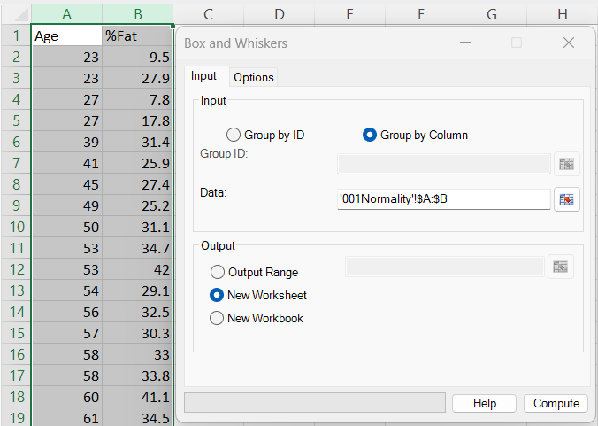
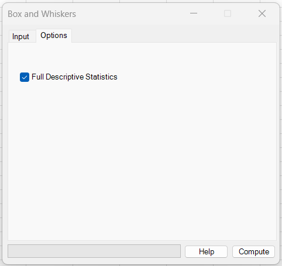
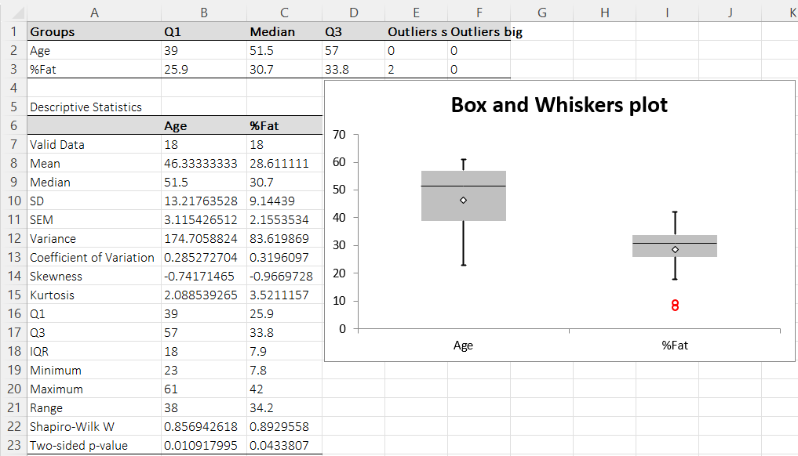

# Box and Whiskers

**Includes:** Tukey boxplot (median, quartiles, whiskers), Outliers via 1.5×IQR rule.  
**Purpose:** Visualize distribution shape and spread per variable/group (median, quartiles, whiskers) and flag potential outliers.

---

## Overview

A box-and-whiskers plot summarizes a numeric dataset using:

- **Median** (central line inside the box)
- **Quartiles** \(Q_1\) and \(Q_3\) (box limits)
- **Interquartile range** \(\mathrm{IQR}=Q_3-Q_1\)
- **Whiskers** (typical range excluding outliers)
- **Outliers** (points beyond whisker limits)

> Note: This chart was implemented in BESHStatNG **before** boxplots were included as a standard chart type in newer Excel versions. The add-in generates the plot using standard Excel chart primitives (series + markers + error bars / shape elements), so it works even on older Excel installations.

---

## Dialog

### Input tab

Use **Group by Column** when each selected column represents one dataset (recommended for most workflows).  
Use **Group by ID** when you have an identifier column (group labels) and a value column.

### Options tab

- **Full Descriptive Statistics** — adds the descriptive-statistics table for each dataset below the plot output.

---

## Output

The output worksheet contains:

1. A small **boxplot summary table** (one row per dataset):
   - \(Q_1\), Median, \(Q_3\)
   - number of **small (lower)** outliers
   - number of **big (upper)** outliers

2. The **Box and Whiskers plot** chart.

3. (Optional) a **Full Descriptive Statistics** table for each dataset.

---

## Mathematical details

### Quartiles used by BESHStatNG

Quartiles are computed using the **CDF method (SAS Method 5)** as implemented in:

- `src/BaseStat/StatFunc.vb` → `QuartilesComp(...)`
- and used via `src/BaseStat/StatFunc.vb` → `DescriptiveStat.compute(...)`

Let the sorted sample be \(x_{(1)} \le \dots \le x_{(n)}\).

- **Median**
  - if \(n\) is even: \(\mathrm{Median} = \frac{x_{(n/2)} + x_{(n/2+1)}}{2}\)
  - if \(n\) is odd: \(\mathrm{Median} = x_{((n+1)/2)}\)

- **Quartiles** for \(p \in \{0.25, 0.75\}\)

Let \(r = p \, n\).

If \(r\) is an integer:
\[
Q_p = \frac{x_{(r)} + x_{(r+1)}}{2}
\]

If \(r\) is not an integer, let \(k = \lceil r \rceil\) (the smallest integer \(\ge r\)) and take:
\[
Q_p = x_{(k)}
\]

Then \(Q_1 = Q_{0.25}\), \(Q_3 = Q_{0.75}\) and:
\[
\mathrm{IQR} = Q_3 - Q_1
\]

!!! tip "R comparison for quartiles"
    R’s default `quantile()` uses `type = 7`. To match BESHStatNG quartiles, use `quantile(x, probs=c(0.25,0.5,0.75), type=5)`.

### Outliers (Tukey 1.5×IQR rule)

Outliers are detected using Tukey’s rule (implemented in `src/Graphics/BoxPlot.vb` → `Calculate()`):

\[
L = Q_1 - 1.5 \, \mathrm{IQR}
\qquad
U = Q_3 + 1.5 \, \mathrm{IQR}
\]

- **Small (lower) outliers:** \(x < L\)
- **Big (upper) outliers:** \(x > U\)

### Whiskers

Whiskers are computed in `src/Graphics/BoxPlot.vb` → `CalcForPlotting()`.

- If **no outliers** exist on a side, the whisker extends to the sample min/max:
  - upper whisker endpoint = \(\max(x)\)
  - lower whisker endpoint = \(\min(x)\)

- If **outliers exist**, the whisker extends to the most extreme **non-outlier** value:
  - upper whisker endpoint = \(\max\{x : x \le U\}\)
  - lower whisker endpoint = \(\min\{x : x \ge L\}\)

This matches the conventional Tukey boxplot behavior and what R uses in `boxplot()` / `boxplot.stats(..., coef=1.5)`.

---

## Implementation details (how the chart is built)

BESHStatNG generates the boxplot chart programmatically in Excel using the [**Peltier stacked-column technique**](https://peltiertech.com/excel-box-and-whisker-diagrams-box-plots/) (see class documentation in `src/Graphics/BoxPlot.vb`).

### Data preparation and statistics

1. `BoxPlot.Calculate()`:
   - creates a `DescriptiveStat` object for each dataset
   - computes \(Q_1\), Median, \(Q_3\), IQR, mean, min, max
   - identifies outliers using the 1.5×IQR rule and stores them in two matrices:
     - `pArOutliersSmall(,)` (lower outliers)
     - `pArOutliersBig(,)` (upper outliers)

2. `BoxPlot.CalcForPlotting()`:
   - prepares the stacked-column components that visually form the box
   - handles **negative data** by using additional “minus” segments so the stacked columns still build correctly around 0
   - computes whisker *lengths* as distances from \(Q_1\) and \(Q_3\) to the whisker endpoints

### Excel chart construction

`BoxPlot.AddBoxPlot()` creates an Excel chart with these key pieces:

- **Stacked columns**:
  - a “blank” invisible offset series (`PlotBlanks`) to position each box at \(Q_1\) (or around 0 when negative values are present)
  - stacked grey series to represent:
    - \(Q_1 \rightarrow \mathrm{Median}\)
    - \(\mathrm{Median} \rightarrow Q_3\)
  - additional “Minus” series are used when quartiles/median fall below 0

- **Whiskers**:
  - implemented as **custom error bars** on invisible line series located at \(Q_1\) and \(Q_3\)
  - upper whisker uses `xlPlusValues` with per-group lengths
  - lower whisker uses `xlMinusValues` with per-group lengths

- **Median mark**:
  - added as an `xlXYScatter` series with a short **horizontal error bar** (a small line segment) to draw the median across the box

- **Mean marker**:
  - added as a diamond marker (`xlMarkerStyleDiamond`) on an invisible line series

- **Outliers**:
  - each outlier point is added as its own `xlXYScatter` series
  - styled as a small **red open circle**

This approach works across Excel versions because it uses standard chart types and formatting primitives, not the modern built-in boxplot chart type.

---

## Example (001Normality.csv)

Example dataset:

- [001Normality.csv](../assets/data/001normality/001Normality.csv)

Steps:

1. Ribbon: **BESH Stat NG → Graphics → Box and Whiskers**
2. Input tab:
   - **Group by Column**
   - select: `001Normality!$A$1:$B$19`
   - Output: **New Worksheet**
3. Options tab:
   - enable **Full Descriptive Statistics** (optional)
4. Click **Compute**

### Brief interpretation (from the example output)

- The **Age** dataset shows no outliers under Tukey’s 1.5×IQR rule.
- The **%Fat** dataset shows **two small (lower) outliers** (visible as red points below the lower whisker), which matches the summary row (`Outliers small`).

---

## See also

- [Descriptive Statistics](descriptive-statistics.md)
- [Univariate Outliers](univariate-outliers.md)
- [Homogeneity of Variance](homogeneity-of-variance.md)
