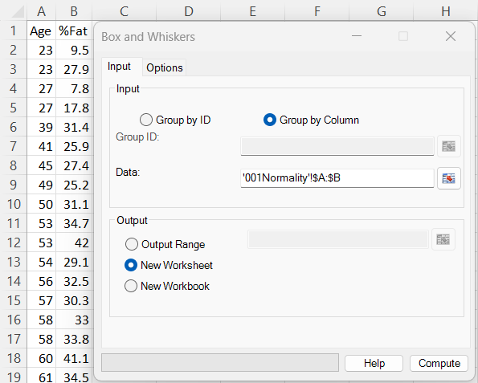
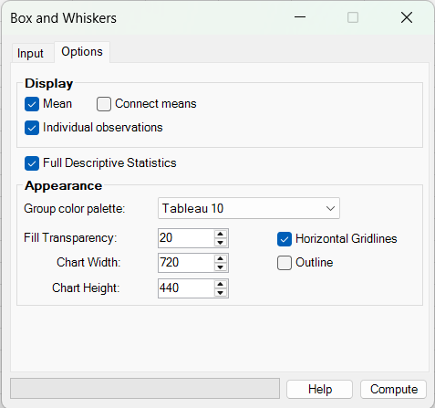
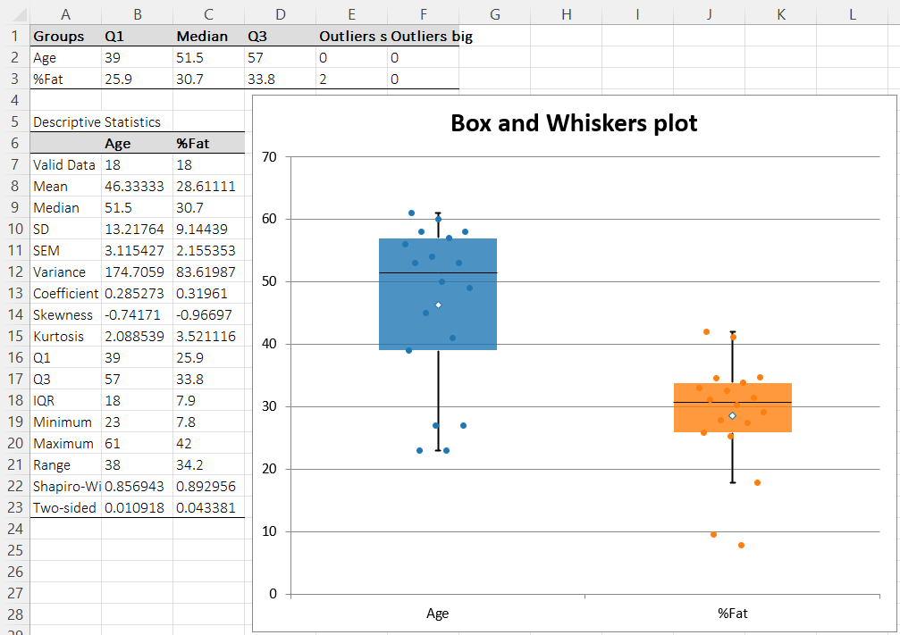

# Box and Whiskers

**Includes:** Tukey box plots (median, quartiles and 1.5-IQR whiskers), outlier detection, optional group means and connected means, jittered individual observations, group-specific colour palettes, transparency, outlines, gridlines, configurable chart size, and the legacy BESHStat box-plot appearance.  
**Purpose:** Compare the centre, spread, skewness and potential outliers of one or more numeric datasets or groups.

---

## Overview

A **box-and-whiskers plot** (box plot) summarizes a numeric distribution using a small set of robust descriptive statistics. For each dataset or group, BESHStatNG shows:

- the **median** as a horizontal line inside the box;
- the first and third quartiles, **Q1** and **Q3**, as the lower and upper limits of the box;
- the **interquartile range**, \(\mathrm{IQR}=Q_3-Q_1\);
- **whiskers** extending to the most extreme observations that are not Tukey outliers;
- observations beyond \(1.5\times\mathrm{IQR}\) as potential **outliers**;
- optionally, the **mean** as a diamond marker;
- optionally, the original **individual observations** with a small horizontal jitter;
- optionally, a line **connecting the group means**.

The chart supports two worksheet layouts:

- **Group by Column** — wide format, with each selected numeric column representing one dataset or group;
- **Group by ID** — long format, with one group-identification column and one numeric data column.

BESHStatNG calculates the box-plot statistics itself and constructs the chart from standard Excel chart elements. It does not depend on Excel's newer built-in Box & Whisker chart type, so the same BESHStatNG definitions are used consistently across supported Excel versions.

!!! note
    A box plot is primarily a **descriptive** display. Differences between boxes do not by themselves establish a statistically significant difference between groups. Use an appropriate inferential method when formal group comparison is required.

---

## When to use it

A box plot is useful when you want a compact comparison of one or more quantitative distributions, for example:

- laboratory measurements by treatment group;
- biomarker values by diagnosis or study arm;
- examination scores by class;
- process measurements by batch, machine or operator;
- measurements at several ordered time points;
- several numeric worksheet columns that need a quick distributional comparison.

Box plots are particularly useful for comparing:

- medians;
- interquartile ranges;
- overall non-outlier ranges;
- skewness or asymmetry;
- potential extreme observations.

If the detailed distribution shape is important, consider a [Violin Plot](violin-plot.md) or [Categorical Histogram](categorical-histogram.md) as a complementary display.

---

## Dialog

### Input tab

Choose the input layout that matches the worksheet.

### Group by Column

Use **Group by Column** when each selected column represents a separate dataset or group. This is convenient for wide-format data such as:

| Group A | Group B | Group C |
|---:|---:|---:|
| 12.4 | 11.8 | 13.1 |
| 13.0 | 12.2 | 14.0 |
| 11.7 | 13.4 | 12.8 |

Select the required columns in **Data**. Column headings are used as group names when available. The groups do not need to contain the same number of valid observations; missing values are handled within each column during import.

### Group by ID

Use **Group by ID** for long-format data, where one column identifies the group and another contains the numeric observation:

| Group ID | Data |
|---|---:|
| A | 12.4 |
| A | 13.0 |
| B | 11.8 |
| B | 12.2 |
| C | 13.1 |

The group and data ranges are interpreted row by row.

### Output

The result can be sent to:

- an **Output Range**;
- a **New Worksheet**;
- a **New Workbook**.

---

## Options tab

The standalone **Box and Whiskers** command has dedicated display and appearance controls.

### Display

| Option | Description |
|---|---|
| **Mean** | Shows the arithmetic mean of each group as a diamond marker. |
| **Connect means** | Connects the group-mean diamonds with a line. This option is available only when **Mean** is selected. |
| **Individual observations** | Adds every original observation to the chart as a small group-coloured point with deterministic horizontal jitter. |
| **Full Descriptive Statistics** | Adds the full descriptive-statistics table for each dataset below the box-plot summary. |

#### Mean and connected means

The black horizontal line inside each box is the **median**. When **Mean** is selected, the additional diamond represents the arithmetic mean.

**Connect means** draws a line through the mean diamonds. This can be useful for ordered groups such as increasing dose levels or successive visits.

!!! caution "Do not imply an order that is not present"
    A connecting line visually suggests progression from one group to the next. Use **Connect means** only when the group order has a meaningful interpretation. For unrelated nominal categories, separate mean markers are usually preferable.

#### Individual observations

When **Individual observations** is selected, BESHStatNG overlays the original values on the box plot. A small deterministic horizontal jitter is used so coincident or very similar observations are easier to see.

The horizontal displacement has **no quantitative meaning**. The vertical coordinate is the original measured value.

When all individual observations are shown, BESHStatNG does not add a second outlier-marker layer. Tukey outliers are therefore still present among the displayed observations, but they are not plotted twice.

### Appearance

| Option | Description |
|---|---|
| **Group color palette** | Selects a colour sequence used for the groups. |
| **Fill Transparency** | Controls box-fill transparency from opaque to transparent. |
| **Horizontal Gridlines** | Shows or hides horizontal major gridlines. |
| **Outline** | Shows or hides the dark outline around the coloured boxes. |
| **Chart Width** | Sets the chart width in Excel points. |
| **Chart Height** | Sets the chart height in Excel points. |

Available colour palettes are:

- **Tableau 10**;
- **Okabe-Ito**;
- **ColorBrewer Set1**;
- **Grayscale**;
- **Legacy BESHStat box plot**.

For the first four palettes, each group receives a separate colour from the selected palette. If there are more groups than colours in the palette, the colour sequence is reused.

The boxes and, when enabled, individual observations use the corresponding group colour. The mean diamonds and optional connecting line use a common mean-series colour so that they remain visually distinct from the boxes.

### Legacy BESHStat box plot

**Legacy BESHStat box plot** is a complete compatibility preset rather than simply another grey palette. Selecting it reproduces the historical BESHStatNG box-plot renderer:

- grey box fills;
- original box formatting;
- original black-and-white mean diamonds;
- red open-circle Tukey outliers;
- no connected mean line;
- no individual-observation layer;
- no horizontal gridlines;
- historical chart dimensions.

Display and appearance controls that do not apply to this preset are temporarily disabled. Their values are preserved, so switching back to one of the modern palettes restores the previously selected settings.

!!! important "Compatibility with box plots produced by other analyses"
    The new appearance options apply to the standalone **Graphics → Box and Whiskers** command. Box plots requested as optional output from other statistical procedures continue to use the historical rendering, so existing analysis output is not unexpectedly restyled.

---

## Output

The output contains:

1. a compact **box-plot summary table** with one row per dataset/group;
2. the **Box and Whiskers plot**;
3. optionally, the **Full Descriptive Statistics** table.

### Box-plot summary table

The compact summary contains:

- **Q1**;
- **Median**;
- **Q3**;
- **Outliers small** — number of observations below the lower Tukey fence;
- **Outliers big** — number of observations above the upper Tukey fence.

### Reading the chart

For each group:

- the **bottom of the box** is \(Q_1\);
- the **top of the box** is \(Q_3\);
- the **horizontal line inside the box** is the median;
- the **whiskers** extend to the most extreme non-outlier observations;
- the **diamond**, when enabled, is the mean;
- the **jittered dots**, when enabled, are the original observations.

Potential Tukey outliers lie beyond the whisker endpoints. If individual observations are not displayed, they are drawn separately as open-circle markers. With a modern group-colour palette the outlier marker uses the group's colour; the legacy preset uses red open circles.

---

## Mathematical details

### Quartiles used by BESHStatNG

Quartiles are computed using the **CDF method (SAS Method 5)** implemented through `DescriptiveStat` and `QuartilesComp(...)`.

Let the sorted sample be

\[
x_{(1)} \le x_{(2)} \le \cdots \le x_{(n)}.
\]

For the median:

- if \(n\) is even,

\[
\operatorname{Median}=\frac{x_{(n/2)}+x_{(n/2+1)}}{2};
\]

- if \(n\) is odd,

\[
\operatorname{Median}=x_{((n+1)/2)}.
\]

For quartiles, let \(p\in\{0.25,0.75\}\) and

\[
r=pn.
\]

If \(r\) is an integer,

\[
Q_p=\frac{x_{(r)}+x_{(r+1)}}{2}.
\]

If \(r\) is not an integer, let \(k=\lceil r\rceil\), then

\[
Q_p=x_{(k)}.
\]

Thus,

\[
Q_1=Q_{0.25}, \qquad Q_3=Q_{0.75},
\]

and

\[
\mathrm{IQR}=Q_3-Q_1.
\]

!!! tip "R comparison for quartiles"
    R's default `quantile()` uses `type = 7`. To reproduce the BESHStatNG quartiles, use `quantile(x, probs=c(0.25,0.5,0.75), type=5)`.

### Tukey outliers

BESHStatNG uses Tukey's \(1.5\times\mathrm{IQR}\) rule. The lower and upper fences are

\[
L=Q_1-1.5\,\mathrm{IQR}
\]

and

\[
U=Q_3+1.5\,\mathrm{IQR}.
\]

An observation is classified as:

- a **small (lower) outlier** if \(x<L\);
- a **big (upper) outlier** if \(x>U\).

These points are potential outliers in the descriptive Tukey sense. They are not automatically errors and should not be removed merely because they fall outside the fences.

### Whiskers

The whiskers extend to observed data values rather than directly to the theoretical fences.

If no outlier exists on a side, the whisker reaches the sample minimum or maximum. If outliers are present, the whisker reaches the most extreme observation that remains inside the Tukey fence:

\[
\text{upper whisker}=\max\{x:x\le U\},
\]

\[
\text{lower whisker}=\min\{x:x\ge L\}.
\]

This is the conventional Tukey box-plot definition and corresponds to the behaviour of R's `boxplot()` / `boxplot.stats(..., coef=1.5)`.

### Mean

When requested, the arithmetic mean is

\[
\bar{x}=\frac{1}{n}\sum_{i=1}^{n}x_i.
\]

It is displayed as a diamond and is separate from the median line. A noticeable separation between mean and median can be a useful descriptive indication of asymmetry or the influence of extreme values.

---

## Worked example: `001Normality.csv`

Example dataset:

- [001Normality.csv](../assets/data/001normality/001Normality.csv)

The example contains the two numeric variables **Age** and **%Fat**.

### Input

Open the dataset in Excel and select the two columns using **Group by Column**.

The screenshot uses:

| Setting | Value |
|---|---|
| Group by | **Group by Column** |
| Data | columns **Age** and **%Fat** |
| Output | **New Worksheet** |

### Options

The illustrated run uses:

| Setting | Value |
|---|---|
| Mean | Selected |
| Connect means | Cleared |
| Individual observations | Selected |
| Full Descriptive Statistics | Selected |
| Group color palette | **Tableau 10** |
| Fill Transparency | `20` |
| Horizontal Gridlines | Selected |
| Outline | Cleared |
| Chart Width | `720` points |
| Chart Height | `440` points |

### Result

The compact box-plot table reports:

| Variable | Q1 | Median | Q3 | Lower outliers | Upper outliers |
|---|---:|---:|---:|---:|---:|
| Age | 39.0 | 51.5 | 57.0 | 0 | 0 |
| %Fat | 25.9 | 30.7 | 33.8 | 2 | 0 |

The full descriptive-statistics table gives means of approximately **46.33** for Age and **28.61** for %Fat. In both groups the mean lies below the median, which is also visible from the position of the mean diamond relative to the median line.

For **Age**, no observation is classified as a Tukey outlier. For **%Fat**, two observations are below the lower Tukey fence. Because **Individual observations** is selected, these lower outliers appear as ordinary orange observations below the lower whisker rather than as an additional duplicate outlier layer.

The raw points also make the sample size and the locations of individual observations visible, while the boxes retain the compact quartile-based summary.

---

## Implementation details

BESHStatNG builds the chart programmatically using the [**Peltier stacked-column technique**](https://peltiertech.com/excel-box-and-whisker-diagrams-box-plots/) together with Excel line, scatter and error-bar series.

### Jittered observations

Each raw-observation group is added as an XY-scatter series. Its X coordinate is the group position plus a small **deterministic** offset. Consequently:

- the chart is reproducible when regenerated;
- overlapping observations become easier to distinguish;
- the points remain tied to the chart axes when the chart is resized.

### Legacy rendering

The standalone **Legacy BESHStat box plot** preset uses the historical rendering logic, and optional box plots created by other BESHStatNG analyses continue to use it as well.

This preserves backward visual compatibility while allowing the standalone box-plot command to offer the newer display controls.

---

## Practical interpretation tips

- Compare the **median lines** first when interested in differences in typical values.
- Compare **box heights** to assess the middle 50% of each distribution.
- Compare **whisker lengths** and the positions of raw points for asymmetry and tail behaviour.
- Treat points beyond the whiskers as observations that deserve attention, not automatically as data errors.
- Use **Individual observations** when sample sizes are modest or when you want to see how strongly the quartile summary compresses the original data.
- Use **Connect means** mainly for meaningfully ordered groups.
- For very small groups, remember that quartiles and whiskers can change substantially when only one or two observations change.

---

## See also

- [Descriptive Statistics](descriptive-statistics.md)
- [Violin Plot](violin-plot.md)
- [Categorical Histogram](categorical-histogram.md)
- [Univariate Outliers](univariate-outliers.md)
- [Homogeneity of Variance](homogeneity-of-variance.md)
