# Bullet Chart

**Includes:** Multi-measure horizontal bullet charts, 2–5 qualitative ranges per measure, actual-value bars, target markers, higher-is-better and lower-is-better direction, independent scales for each measure, automatic or user-supplied scale maxima and major intervals, optional value labels and tick marks, multiple qualitative-range palettes, and configurable chart size.  
**Purpose:** Compare an observed value with a target while simultaneously showing qualitative performance ranges in a compact dashboard-style display.

---

## Overview

A **bullet chart** (also called a **bullet graph**) is a compact performance display that combines three pieces of information for each measure:

- an **actual value**, drawn as a dark horizontal bar;
- a **target or reference value**, drawn as a short vertical marker;
- **qualitative ranges**, drawn as shaded background bands.

A simplified single bullet looks like this:

```text
0                 qualitative ranges                 maximum
|──────────────|──────────────|────────────────────────|
█████████████████████████████                 actual
                              │               target
```

The qualitative ranges can represent categories such as:

- poor / acceptable / good;
- low / expected / high;
- action / caution / desired;
- below target / near target / above target.

BESHStatNG supports **2 to 5 cumulative qualitative boundaries** for each measure. The resulting bands always begin at zero and extend to the resolved scale maximum.

Unlike an ordinary bar chart, every bullet row can use its **own numerical scale**. This allows a single chart to combine measures with very different units and magnitudes, such as revenue, percentages, customer counts, scores, delivery time, and defect rates.

The chart also supports measures where either:

- **Higher is better**, such as revenue or customer satisfaction; or
- **Lower is better**, such as complaint rate, delivery time, or defect rate.

The direction affects the ordering of the qualitative shading. It does **not** reverse the numerical axis: all scales still run from zero on the left to larger values on the right.

!!! note
    A Bullet Chart is a descriptive visualization. It does not perform a statistical test, calculate a confidence interval, or determine whether a target difference is statistically significant.

---

## When to use it

Use a bullet chart when you want to compare one or more current or observed values with explicit targets while retaining meaningful performance bands.

Typical applications include:

- KPI and management dashboards;
- revenue, margin, sales, and customer metrics;
- quality-control summary indicators;
- service-level targets;
- defect, complaint, or failure rates;
- delivery or turnaround time;
- customer satisfaction scores;
- study recruitment or operational targets;
- performance against predefined clinical, laboratory, or engineering reference bands;
- compact comparisons of several measures that use different units.

Bullet charts are especially useful when a conventional bar chart would require several separate panels because the measures have different scales.

Avoid a bullet chart when:

- there is no meaningful target or comparison value;
- the qualitative boundaries are arbitrary or cannot be interpreted substantively;
- negative values must be displayed, because the current Bullet Chart uses a zero baseline;
- the main objective is to show a full distribution rather than one actual value per measure;
- changes over many time points are the main focus;
- precise comparison between many similar observations is more important than target performance.

---

## Example dataset

The sample dataset used on this page is available here:

[120bulletchart.csv](../assets/data/120bulletchart/120bulletchart.csv)

It contains eight example measures with different units, target values, qualitative boundaries, desirability directions, and optional scale settings:

| Measure | Subtitle | Actual | Target | Boundary 1 | Boundary 2 | Boundary 3 | Direction | Scale maximum | Major interval |
|---|---|---:|---:|---:|---:|---:|---|---:|---:|
| Revenue | EUR, thousands | 335 | 338 | 210 | 300 | 400 | Higher is better | 400 | 50 |
| Operating margin | Percent | 28 | 32 | 20 | 30 | 40 | Higher is better |  |  |
| Average order value | EUR | 470 | 430 | 250 | 350 | 450 | Higher is better |  |  |
| New customers | Count | 1045 | 960 | 600 | 900 | 1200 | Higher is better | 1500 | 250 |
| Customer satisfaction | Score (0–5) | 4.0 | 4.5 | 2.5 | 3.5 | 4.5 | Higher is better | 5 | 0.5 |
| Complaint rate | Percent | 3.8 | 2.5 | 2.0 | 4.0 | 6.0 | Lower is better | 8 | 1 |
| Average delivery time | Days | 5.2 | 4.0 | 3.0 | 5.0 | 7.0 | Lower is better |  |  |
| Defect rate | Percent | 1.8 | 1.0 | 1.0 | 2.0 | 4.0 | Lower is better | 5 | 1 |

The dataset was deliberately constructed to demonstrate several important features:

- very different numerical scales in one chart;
- both higher-is-better and lower-is-better measures;
- automatic and explicit scale maxima;
- automatic and explicit major intervals;
- integer and decimal measurements;
- an actual value above the last qualitative boundary;
- optional subtitles that identify the measurement unit.

For **Average order value**, the actual value is 470 while the final qualitative boundary is 450. When the scale maximum is automatic, BESHStatNG therefore extends the scale beyond the final boundary so that the observed value remains fully visible.

---

## Input settings used in the examples

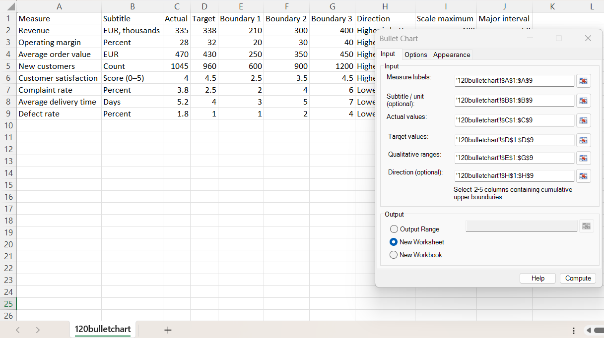

For Examples 1 and 2, the following ranges are selected:

| Setting | Value |
|---|---|
| Measure labels | `A1:A9` |
| Subtitle / unit (optional) | `B1:B9` |
| Actual values | `C1:C9` |
| Target values | `D1:D9` |
| Qualitative ranges | `E1:G9` |
| Direction (optional) | `H1:H9` |
| Output | New Worksheet |

The first worksheet row contains headings. A conventional leading header row can be selected together with the data; it is recognized and excluded from the plotted observations.

The qualitative ranges are selected as **one adjacent block of 2–5 columns**. In this example, columns E:G contain three cumulative upper boundaries.

!!! important
    Qualitative boundaries are cumulative upper limits, not band widths. For example, boundaries `210, 300, 400` define the bands `0–210`, `210–300`, and `300–400` when the resolved scale maximum is 400.

---

## Example 1: mixed KPI dashboard with automatic scales

The first example uses all eight measures and leaves the optional scale maximum and major interval inputs blank. BESHStatNG therefore resolves an independent scale for every bullet row.

### Options

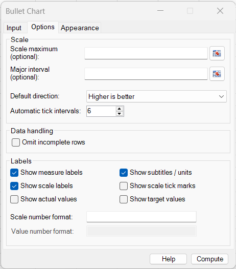

| Setting | Value |
|---|---|
| Scale maximum | Automatic |
| Major interval | Automatic |
| Default direction | Higher is better |
| Automatic tick intervals | 6 |
| Omit incomplete rows | Cleared |
| Show measure labels | Selected |
| Show subtitles / units | Selected |
| Show scale labels | Selected |
| Show scale tick marks | Cleared |
| Show actual values | Cleared |
| Show target values | Cleared |
| Scale number format | Automatic |
| Value number format | Automatic |

Because the Direction column is supplied, its row-specific values take precedence over the **Default direction** setting. Revenue, operating margin, average order value, new customers, and customer satisfaction are therefore treated as higher-is-better measures, while complaint rate, delivery time, and defect rate are treated as lower-is-better measures.

### Appearance

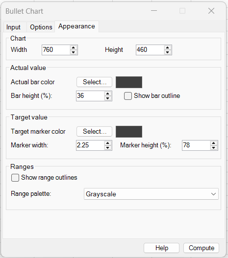

| Setting | Value |
|---|---|
| Chart width | 760 |
| Chart height | 460 |
| Actual bar height | 36% |
| Show bar outline | Cleared |
| Target marker width | 2.25 |
| Target marker height | 78% |
| Show range outlines | Cleared |
| Range palette | Grayscale |

The actual-value bar and target marker use the default dark neutral colour.

### Output

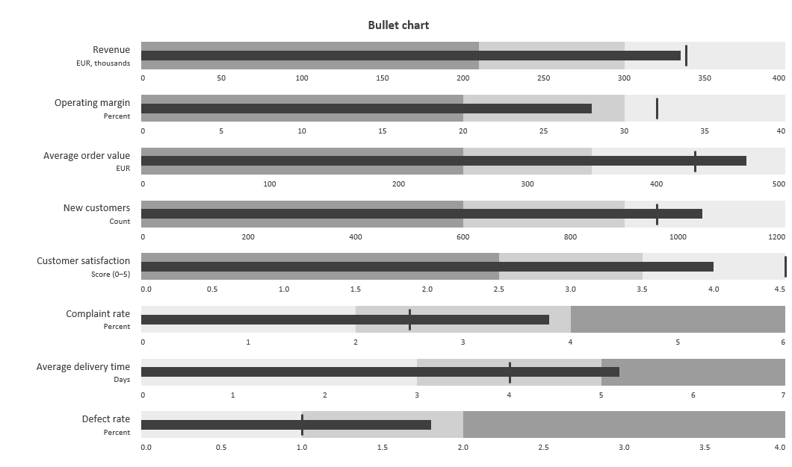

Each row has its own numerical scale. For example:

- Revenue is shown on a scale extending to 400;
- Operating margin extends to 40;
- Average order value automatically extends to 500 because its actual value of 470 is above the final qualitative boundary of 450;
- Customer satisfaction uses a decimal scale;
- Complaint rate, delivery time, and defect rate reverse the qualitative shading because lower values are preferable.

The dark horizontal bar represents the actual value. The narrow vertical line represents the target.

For a higher-is-better measure, moving farther right generally represents better performance. For a lower-is-better measure, moving farther right represents a larger numerical value but poorer performance; the background shading is reversed to reflect that interpretation.

---

## Example 2: explicit scales, value labels, and blue ranges

The second example uses the same eight measures, but also supplies the optional Scale maximum and Major interval columns.

Rows with a value in those columns use the supplied setting. Blank cells remain automatic, so manual and automatic scale control can be mixed within the same chart.

### Options

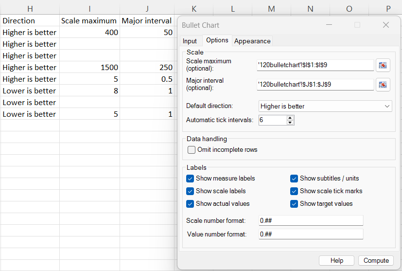

Additional selections are:

| Setting | Value |
|---|---|
| Scale maximum | `I1:I9` |
| Major interval | `J1:J9` |
| Default direction | Higher is better |
| Automatic tick intervals | 6 |
| Show scale tick marks | Selected |
| Show actual values | Selected |
| Show target values | Selected |
| Scale number format | `0.##` |
| Value number format | `0.##` |

For example:

- Revenue explicitly uses a maximum of 400 and interval of 50;
- New customers uses a maximum of 1500 and interval of 250;
- Customer satisfaction uses a maximum of 5 and interval of 0.5;
- Complaint rate uses a maximum of 8 and interval of 1;
- rows with blank scale settings continue to use automatic values.

### Appearance

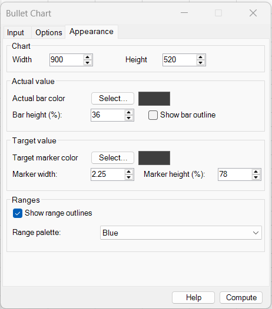

| Setting | Value |
|---|---|
| Chart width | 900 |
| Chart height | 520 |
| Actual bar height | 36% |
| Target marker width | 2.25 |
| Target marker height | 78% |
| Show range outlines | Selected |
| Range palette | Blue |

### Output

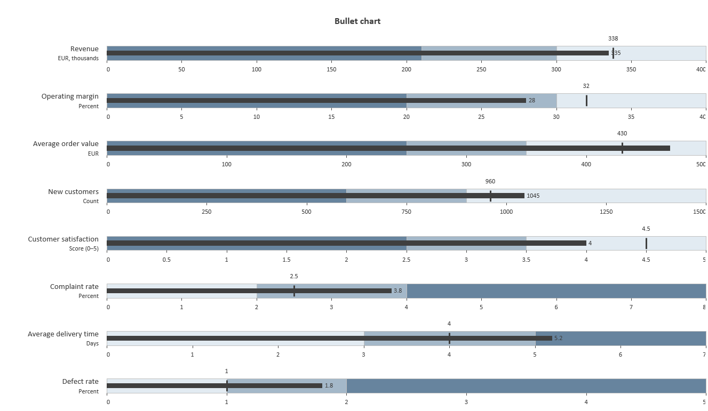

This version is useful when exact values need to be visible directly on the chart.

Actual values are printed near the end of the dark bars, and target values are printed near the target markers. Tick marks make the individual scales easier to read, while the explicit scale settings can be used to standardize selected rows when required.

The blue qualitative ranges still encode desirability. The palette is automatically ordered so that lower-is-better rows use the opposite left-to-right shading order from higher-is-better rows.

---

## Example 3: lower-is-better measures using the default direction

The third example selects only the three lower-is-better measures:

- Complaint rate;
- Average delivery time;
- Defect rate.

The Direction input is deliberately left blank. Instead, **Default direction = Lower is better** is selected.

### Input

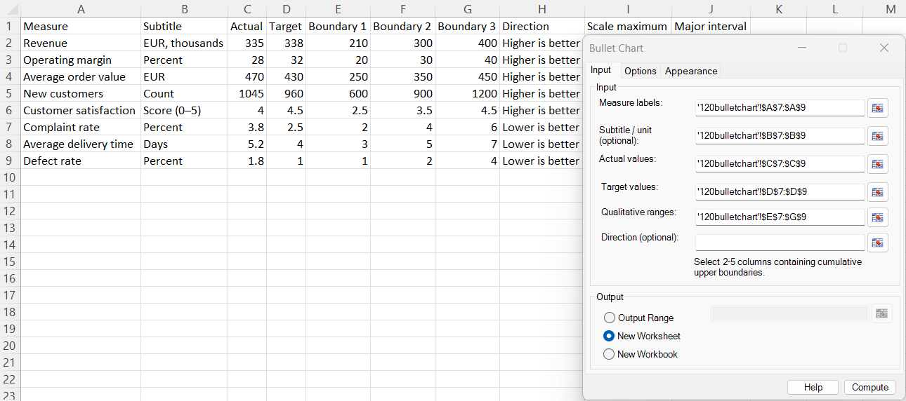

| Setting | Value |
|---|---|
| Measure labels | `A7:A9` |
| Subtitle / unit | `B7:B9` |
| Actual values | `C7:C9` |
| Target values | `D7:D9` |
| Qualitative ranges | `E7:G9` |
| Direction | Blank |
| Output | New Worksheet |

### Options

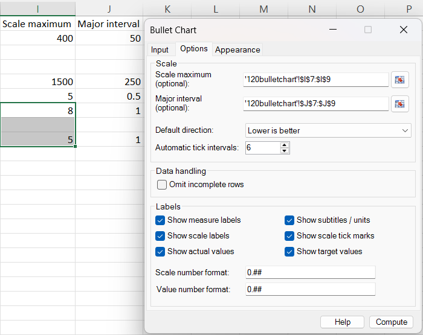

| Setting | Value |
|---|---|
| Scale maximum | `I7:I9` |
| Major interval | `J7:J9` |
| Default direction | Lower is better |
| Automatic tick intervals | 6 |
| Show scale labels | Selected |
| Show scale tick marks | Selected |
| Show actual values | Selected |
| Show target values | Selected |
| Scale number format | `0.##` |
| Value number format | `0.##` |

### Appearance

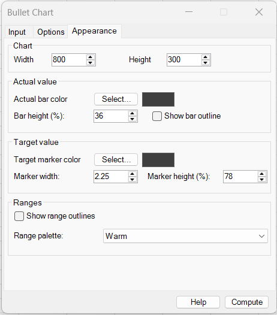

| Setting | Value |
|---|---|
| Chart width | 800 |
| Chart height | 300 |
| Actual bar height | 36% |
| Target marker width | 2.25 |
| Target marker height | 78% |
| Show range outlines | Cleared |
| Range palette | Warm |

### Output

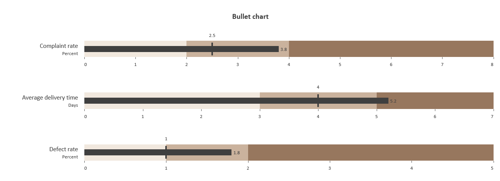

The lightest qualitative region is now at the lower-value end of each row, while less desirable high values occupy progressively stronger shading.

This is appropriate for measures where smaller values are preferred. For example, the complaint-rate target is 2.5 while the actual value is 3.8, so the actual bar extends beyond the target into a less desirable region.

!!! tip
    Use a Direction column when one chart mixes higher-is-better and lower-is-better measures. Use **Default direction** when all selected measures share the same interpretation.

---

## Required data layout

Each retained worksheet row represents one bullet-chart measure.

A typical layout is:

| Measure | Subtitle | Actual | Target | Boundary 1 | Boundary 2 | Boundary 3 | Direction | Scale maximum | Major interval |
|---|---|---:|---:|---:|---:|---:|---|---:|---:|
| Revenue | EUR, thousands | 335 | 338 | 210 | 300 | 400 | Higher is better | 400 | 50 |
| Complaint rate | Percent | 3.8 | 2.5 | 2 | 4 | 6 | Lower is better | 8 | 1 |

The main rules are:

- **Measure labels**, **Actual values**, **Target values**, and **Qualitative ranges** are required;
- Measure labels, Actual values, and Target values must each be one continuous column;
- Qualitative ranges must be one continuous block containing **2 to 5 adjacent columns**;
- all selected input ranges must be on the same worksheet;
- all selected input ranges must start on the same row and contain the same number of rows;
- Actual values and Target values must be finite non-negative numbers;
- qualitative boundaries must be finite positive values and strictly increase from left to right;
- qualitative boundaries are cumulative upper limits;
- optional Subtitle, Direction, Scale maximum, and Major interval inputs must be single columns aligned with the required inputs;
- the input row order is preserved in the chart.

### Two to five qualitative ranges

The selected qualitative-range block determines the maximum number of ranges available per row.

For example:

```text
Boundary 1   Boundary 2   Boundary 3
    20           30           40
```

creates:

```text
0–20   20–30   30–40
```

A row can use fewer ranges than the selected block by leaving only **trailing** boundary cells blank. Gaps inside a sequence are not allowed.

For example, when four range columns are selected:

```text
10   20   30   [blank]
```

is valid and creates three qualitative ranges, but:

```text
10   [blank]   30   40
```

is invalid because a missing boundary occurs before later supplied boundaries.

---

## Dialog: Input tab

### Measure labels

Select one column containing the main label for each bullet row.

Examples include:

- Revenue;
- Operating margin;
- New customers;
- Satisfaction;
- Complaint rate;
- Defect rate.

Measure labels are required for retained rows.

### Subtitle / unit (optional)

Select an optional aligned column containing secondary text shown beneath each measure label.

Typical values include:

- EUR, thousands;
- Percent;
- Count;
- Days;
- Score (0–5).

Subtitles are useful when a chart combines measures with different units.

### Actual values

Select the observed, current, or featured value for every row.

The actual value is represented by the dark horizontal bar.

Actual values must be finite numbers greater than or equal to zero.

### Target values

Select the target, benchmark, plan, reference, or comparison value for every row.

The target is represented by a short vertical marker drawn across the qualitative range area.

Target values must be finite numbers greater than or equal to zero.

### Qualitative ranges

Select **2 to 5 adjacent columns** containing cumulative upper boundaries.

If a row contains:

```text
20   30   40
```

the boundaries define the intervals:

```text
0–20
20–30
30–40
```

If the plotting scale extends beyond 40, the final qualitative band continues from 30 to the resolved scale maximum.

!!! warning
    Do not enter the width of each range. Enter the cumulative upper boundary. For three equal 10-unit bands ending at 30, use `10, 20, 30`, not `10, 10, 10`.

### Direction (optional)

Select an optional aligned column specifying whether larger or smaller values are preferable for each row.

The recommended text values are:

```text
Higher is better
Lower is better
```

When a Direction cell is blank, the **Default direction** selected on the Options tab is used.

Direction changes the desirability ordering of the qualitative-range colours. It does not reverse the numerical scale.

### Output

Choose one of:

- **Output Range** — places the chart with its upper-left corner at the selected worksheet cell;
- **New Worksheet** — creates a new worksheet in the input workbook and places the chart there;
- **New Workbook** — creates a new workbook and places the chart on its first worksheet.

The default is **New Worksheet**.

---

## Dialog: Options tab

### Scale

#### Scale maximum (optional)

Select an optional row-aligned column containing an explicit right-side maximum for each bullet scale.

A blank cell requests automatic scaling for that row.

An explicit maximum must be large enough to contain all of the following:

- the actual value;
- the target value;
- the final qualitative boundary.

For example, if the final qualitative boundary is 400 and the actual and target are below 400, a scale maximum of 400 is valid.

If the actual value is 470, a manually entered maximum of 450 is invalid because it would clip the featured measure.

#### Major interval (optional)

Select an optional row-aligned column containing the major scale interval for each measure.

A blank cell requests an automatic interval.

The interval must be greater than zero.

Examples include:

```text
50
250
1
0.5
```

The major interval controls scale-label spacing and, when enabled, the positions of scale tick marks.

#### Default direction

Choose:

- **Higher is better**; or
- **Lower is better**.

This setting is used whenever no row-specific Direction value is supplied.

If a Direction column is selected, nonblank row-specific values override the default.

#### Automatic tick intervals

Specifies the approximate number of major intervals BESHStatNG should aim for when a row does not have an explicit Major interval.

The default is **6**.

Automatic intervals use convenient human-readable steps rather than forcing exactly the requested number of intervals. Therefore, the final number of intervals can differ slightly from this setting.

The accepted setting range is 3 to 20.

### Data handling

#### Omit incomplete rows

Controls how missing required data are handled.

When cleared, an incomplete row produces an input error.

When selected, rows missing a required measure label, actual value, target value, or sufficient qualitative boundaries are omitted.

Invalid non-missing values are still rejected. For example, selecting **Omit incomplete rows** does not make a negative actual value or non-increasing qualitative boundaries valid.

### Labels

#### Show measure labels

Displays the main Measure label at the left of each bullet row.

This is selected by default.

#### Show subtitles / units

Displays the optional Subtitle / unit beneath the main measure label.

This is selected by default.

#### Show scale labels

Displays the numerical scale below each bullet row.

Because each measure can have a different scale, these labels are calculated independently for every row.

This is selected by default.

#### Show scale tick marks

Draws short tick marks at the scale positions.

This is cleared by default.

Tick marks are useful when exact reading of the individual scales matters, but can be omitted for a cleaner dashboard appearance.

#### Show actual values

Displays the actual numeric value next to the end of the actual-value bar.

This is cleared by default.

#### Show target values

Displays the target numeric value near the target marker.

This is cleared by default.

#### Scale number format

Controls the numeric formatting of scale labels.

Leave the field blank for automatic formatting based on the resolved scale interval.

Examples include:

```text
0
0.0
0.00
0.##
```

#### Value number format

Controls the formatting of displayed Actual and Target value labels.

Leave the field blank for automatic formatting.

When neither Actual nor Target labels are shown, this field is not needed.

---

## Dialog: Appearance tab

### Chart

#### Width and Height

Set the dimensions of the embedded chart in points.

The initial values are:

- **Width:** 760;
- **Height:** 460.

Increase the height when the chart contains many measures. Increase the width when long labels, many scale ticks, or value labels need additional room.

### Actual value

#### Actual bar color

Chooses the colour of the horizontal featured-measure bar.

The default is a dark neutral grey.

#### Bar height (%)

Controls the actual bar height as a percentage of the qualitative background-band height.

The default is **36%**.

A narrower actual bar keeps the qualitative ranges visible above and below it.

#### Show bar outline

Adds an outline around the actual-value bar.

This is cleared by default.

### Target value

#### Target marker color

Chooses the colour of the vertical target marker.

The default is a dark neutral grey.

#### Marker width

Controls the line weight of the target marker.

The default is **2.25**.

#### Marker height (%)

Controls the target-marker height relative to the qualitative background-band height.

The default is **78%**.

This makes the marker clearly visible above and below the narrower actual-value bar.

### Ranges

#### Show range outlines

Draws borders around qualitative background bands.

This is cleared by default.

Outlines can improve separation with some colour palettes but are usually unnecessary with the default grayscale display.

#### Range palette

Selects the colour family used for qualitative ranges.

Available palettes are:

- **Grayscale**;
- **Blue**;
- **Green**;
- **Warm**.

The colours are ordered by desirability rather than simply by left-to-right position. Therefore, the visual order automatically reverses for lower-is-better measures.

---

## Initial dialog selections

The initial settings are designed to produce a restrained dashboard-style chart without requiring additional configuration.

| Setting | Initial value |
|---|---|
| Default direction | Higher is better |
| Automatic tick intervals | 6 |
| Omit incomplete rows | Cleared |
| Show measure labels | Selected |
| Show subtitles / units | Selected |
| Show scale labels | Selected |
| Show scale tick marks | Cleared |
| Show actual values | Cleared |
| Show target values | Cleared |
| Scale number format | Automatic |
| Value number format | Automatic |
| Chart width | 760 |
| Chart height | 460 |
| Actual bar height | 36% |
| Show bar outline | Cleared |
| Target marker width | 2.25 |
| Target marker height | 78% |
| Show range outlines | Cleared |
| Range palette | Grayscale |
| Output | New Worksheet |

---

## Steps in the add-in

1. Arrange the worksheet so that every row represents one measure.
2. Open **Bullet Chart** from the BESHStatNG ribbon.
3. On the **Input** tab, select the Measure labels, Actual values, Target values, and 2–5 Qualitative range columns.
4. Optionally select Subtitle / unit and Direction columns.
5. Choose the output destination.
6. On the **Options** tab, optionally select Scale maximum and Major interval columns.
7. Select the default direction and automatic tick-interval target.
8. Choose which labels, values, and scale features should be visible.
9. On the **Appearance** tab, choose chart size, actual-bar style, target-marker style, and range palette.
10. Click **Compute**.

---

## Output

The result is an embedded Excel chart containing one horizontal bullet row per retained measure.

Each row can contain:

- a main measure label;
- an optional subtitle or unit;
- qualitative background ranges;
- an actual-value bar;
- a target marker;
- an independent numerical scale;
- optional scale tick marks;
- optional actual and target value labels.

The chart uses the title **Bullet chart**.

The chart is a single movable and resizable Excel chart object. Its visual elements are repositioned when the chart is resized so that the bullet rows remain aligned with their scales and labels.

The chart can also be exported using the standard BESHStatNG chart-export functionality.

---

## What the Bullet Chart calculation does

### 1. Validate and align the input rows

BESHStatNG first confirms that the required selections are continuous, row-aligned, and on the same worksheet.

Every retained row associates:

$$
(\text{label},\ A,\ T,\ b_1, b_2, \ldots, b_k)
$$

where:

- $A$ is the actual value;
- $T$ is the target value;
- $b_1,\ldots,b_k$ are the cumulative qualitative boundaries;
- $2 \le k \le 5$.

The boundaries must satisfy:

$$
0 < b_1 < b_2 < \cdots < b_k.
$$

### 2. Determine the desirability direction

Each row is classified as either:

- higher is better; or
- lower is better.

When a row-specific Direction value is present, it is used. Otherwise, the Default direction setting is applied.

The direction changes only the **desirability ranking of the background ranges**. The numerical axis always increases from left to right.

For three bands, a higher-is-better row has increasing desirability from left to right:

```text
least desirable   intermediate   most desirable
```

A lower-is-better row uses the opposite ordering:

```text
most desirable    intermediate   least desirable
```

### 3. Resolve the scale maximum

Every bullet row has an independent scale beginning at zero.

The minimum required maximum is:

$$
M_{\text{required}} = \max(A, T, b_k).
$$

If an explicit Scale maximum $M$ is supplied, it must satisfy:

$$
M \ge M_{\text{required}}.
$$

If the maximum is automatic, BESHStatNG chooses a convenient value large enough to contain the actual value, target, and final qualitative boundary.

This is why the Average order value example can show an actual value of 470 even though its final qualitative boundary is 450: the automatic scale extends to 500.

### 4. Resolve the major interval

If a Major interval is supplied, it is used directly.

Otherwise, BESHStatNG chooses a readable interval based on the scale maximum and the requested approximate number of automatic tick intervals.

Human-friendly steps are preferred so that scales use values such as:

```text
0.5, 1, 2, 2.5, 5, 10, 20, 50, 100, ...
```

rather than awkward arbitrary spacing.

### 5. Construct the qualitative ranges

For boundaries:

$$
b_1,b_2,\ldots,b_k,
$$

the qualitative bands are:

$$
[0,b_1],\quad [b_1,b_2],\quad \ldots,\quad [b_{k-1},M].
$$

If $M>b_k$, the final qualitative band is extended from the final supplied boundary to the plotting maximum.

This ensures that the entire displayed scale remains visually classified rather than leaving an unshaded section beyond the final boundary.

### 6. Position the actual value and target

The actual and target positions are proportional to the resolved scale maximum:

$$
x_A = \frac{A}{M},
\qquad
x_T = \frac{T}{M}.
$$

The actual value is drawn as a horizontal bar from zero to $x_A$.

The target is drawn as a vertical marker at $x_T$.

Because each row performs this transformation independently, measures with very different units can appear together without sharing one misleading common axis.

### 7. Draw scale labels and optional value labels

Each row receives its own tick positions and numeric formatting.

When Actual or Target value labels are enabled, the displayed text uses the selected Value number format, or an automatic format when the field is blank.

---

## Automatic and manual scaling

Automatic scaling is generally the easiest choice when the chart contains unrelated measures with different units.

Use explicit Scale maximum values when:

- a known meaningful upper limit exists;
- comparable charts should retain the same scale across reporting periods;
- a score has a fixed maximum, such as 5 or 100;
- a KPI dashboard standard specifies a fixed display range.

Use explicit Major intervals when:

- exact tick spacing is part of the reporting standard;
- several related charts should use identical scale labels;
- automatic intervals are visually acceptable but not the desired convention.

It is not necessary to choose between fully automatic and fully manual scaling for the whole chart. When a Scale maximum or Major interval column is selected, individual cells may remain blank to request automatic behaviour for those rows.

---

## Higher is better versus lower is better

The direction setting is important because the same numerical pattern can have opposite substantive meanings.

For example:

| Measure | Typical direction |
|---|---|
| Revenue | Higher is better |
| Customer satisfaction | Higher is better |
| Recruitment count | Higher is better |
| Complaint rate | Lower is better |
| Defect rate | Lower is better |
| Delivery time | Lower is better |

Suppose three boundaries are 2, 4, and 6.

With **Higher is better**, the range near 0 is treated as least desirable and the range near 6 as most desirable.

With **Lower is better**, the same numerical bands are retained, but their desirability ordering is reversed. Values near zero are treated as most desirable.

!!! note
    Direction changes the qualitative colour ordering only. It does not change the meaning of the Actual or Target values and does not reverse the left-to-right numerical scale.

---

## Missing and invalid values

### Required values

For every retained row, the following are required:

- Measure label;
- Actual value;
- Target value;
- at least two qualitative boundaries.

When **Omit incomplete rows** is cleared, missing required information produces an error.

When it is selected, incomplete rows are omitted. At least one usable row must remain.

### Actual and target values

Actual and Target values must be finite and non-negative.

Negative values are not supported because the current Bullet Chart scale begins at zero.

### Qualitative boundaries

Qualitative boundaries must:

- contain at least two and at most five values per retained row;
- be numeric and finite;
- be greater than zero;
- increase strictly from left to right;
- have no internal gaps before later supplied boundaries.

For example:

```text
10, 20, 30
```

is valid, while:

```text
10, 10, 30
```

is invalid because the boundaries are not strictly increasing.

### Scale maximum

A supplied Scale maximum must be greater than zero and must not be smaller than the actual value, target value, or final qualitative boundary.

Leave the cell blank when automatic scaling is preferred.

### Major interval

A supplied Major interval must be greater than zero and must not generate an excessively dense scale.

Leave the cell blank for automatic spacing.

### Subtitle

Subtitle / unit is optional. A blank subtitle does not make an otherwise complete row invalid.

### Direction

Direction is optional because the Default direction can be used.

For worksheet data, the clearest values are:

```text
Higher is better
Lower is better
```

### Headers and whole-column selections

Selections may include a conventional first-row header, as shown in Examples 1 and 2. When the leading cells in the numeric inputs clearly contain headings and the following row contains valid data, the heading row is excluded automatically.

Whole-column or to-bottom selections are trimmed to the last used input row rather than processing the unused remainder of the worksheet.

---

## How to interpret a bullet chart

### Actual-value bar

The dark horizontal bar represents the observed or featured value.

A longer bar always means a larger numerical value on that row's scale.

### Target marker

The vertical marker represents the target or benchmark.

For a higher-is-better measure:

- an actual bar ending to the right of the target indicates that the actual value exceeds the target;
- an actual bar ending to the left indicates that the target has not been reached.

For a lower-is-better measure, the substantive interpretation is reversed:

- an actual bar ending to the left of the target represents a smaller, and therefore preferable, value;
- an actual bar ending to the right represents a larger, and therefore less desirable, value.

### Qualitative ranges

The background bands provide context for the actual value.

Their meaning depends on how the boundaries were defined. They may represent performance categories, tolerance ranges, operational thresholds, or other user-defined standards.

The colour sequence is ordered by desirability. This ordering is automatically reversed when **Lower is better** is used.

### Independent scales

Do not compare the physical length of bars from different rows as though every row had the same units.

For example, a Revenue bar and a Complaint-rate bar can have similar visual lengths while representing completely different quantities and scales.

Interpret each row against:

- its own scale labels;
- its target marker;
- its qualitative boundaries.

### Actual values beyond the qualitative reference range

An Actual or Target value may be larger than the final supplied qualitative boundary.

When the scale maximum is automatic, BESHStatNG extends the plotting scale as needed and continues the final qualitative band to the new maximum.

This keeps the complete value visible rather than clipping it at the final reference boundary.

---

## Bullet chart versus related displays

| Display | Main visual encoding | Typical purpose |
|---|---|---|
| **Bullet chart** | Actual bar + target marker + qualitative ranges | Compact KPI/target performance display |
| **Bar chart** | Bar length | Compare category magnitudes |
| **Dumbbell plot** | Two points connected within each category | Compare two observed endpoints directly |
| **Ladder plot** | Paired points connected across two conditions | Show individual paired change |
| **Control chart** | Time-ordered values with control limits | Monitor process stability over time |
| **Gauge / dial** | Position on a circular scale | Display one KPI, often with substantial decorative space |
| **Box plot** | Quartiles, median, whiskers, outliers | Summarize a distribution |

Compared with a gauge or dial, a bullet chart uses space efficiently and makes it easier to place several measures in one aligned display.

Compared with a normal bar chart, it adds an explicit target and qualitative context.

Compared with a Dumbbell Plot, the Bullet Chart treats one value as the featured measure and the other as a target marker rather than presenting two equivalent endpoints.

---

## Practical guidance for readable charts

For clearer bullet charts:

- use meaningful performance boundaries rather than arbitrary cut points;
- keep Measure labels concise;
- use Subtitle / unit when rows have different units;
- use Direction explicitly when higher-is-better and lower-is-better measures are mixed;
- use the default grayscale palette when the chart must remain neutral or print well in monochrome;
- use coloured palettes sparingly and consistently across reports;
- avoid showing both Actual and Target numeric labels when the chart is already crowded;
- show scale tick marks when precise reading matters, and hide them for a cleaner dashboard-style display;
- use explicit scale maxima for fixed-score measures or repeated reports that should remain visually comparable;
- otherwise prefer automatic scales so that all actual and target values remain visible;
- increase chart width when long labels or many ticks are displayed;
- increase chart height as the number of measures grows;
- keep the actual bar narrower than the qualitative background bands so that the performance ranges remain visible;
- use range outlines only when adjacent shades are difficult to distinguish.

When preparing several charts for repeated reporting, keep the palette, direction rules, and manual scales consistent between periods. Otherwise, apparent visual changes may be caused by formatting rather than by the underlying KPI values.

---

## Implementation details and limitations

- Each plotted row represents one measure.
- The numerical scale begins at zero.
- Negative Actual and Target values are not supported.
- Between 2 and 5 qualitative ranges are supported per measure.
- Qualitative boundaries are cumulative upper limits and must increase strictly.
- Different rows may use different numerical scales and major intervals.
- Different rows may use different higher/lower-is-better directions.
- The final qualitative band extends to the plotting scale maximum when the maximum is larger than the final supplied boundary.
- Explicit scale maxima cannot clip the actual value, target, or qualitative ranges.
- Direction affects background-band desirability ordering, not the numerical axis direction.
- The chart does not calculate the qualitative boundaries from the data; they must be supplied by the user.
- The chart does not calculate targets; they must be supplied by the user.
- No statistical significance, uncertainty interval, or hypothesis test is calculated.
- The chart is created through the ribbon; it is not a worksheet formula.
- The output is intended for a moderate number of KPI-style rows. Very large numbers of measures can make labels and individual scales difficult to read.

---

## Common mistakes

- Entering qualitative **band widths** instead of cumulative upper boundaries.
- Selecting fewer than two or more than five qualitative-range columns.
- Selecting input ranges that do not start on the same worksheet row.
- Selecting inputs from different worksheets.
- Using non-increasing boundaries such as `10, 20, 20`.
- Leaving an internal gap in the boundaries and then supplying a later boundary.
- Entering a negative Actual or Target value.
- Supplying a Scale maximum smaller than the Actual value, Target value, or final qualitative boundary.
- Entering a zero or negative Major interval.
- Forgetting to set **Lower is better** for metrics such as defect rate or delivery time.
- Assuming lower-is-better reverses the numerical axis. The axis still increases from left to right; only the desirability shading is reversed.
- Comparing the physical bar length between rows without checking their individual scales.
- Treating the qualitative ranges as statistically estimated limits when they are actually user-supplied performance categories.
- Showing too many numeric labels on a chart that is intended primarily as a compact dashboard.

---

## See also

- [Dumbbell Plot](dumbbell-plot.md)
- [Ladder Plot](ladder-plot.md)
- [Control Charts](control-charts.md)
- [Histogram](histogram.md)
- [Box and Whiskers](box-and-whiskers.md)
- [Export Chart](../export-chart.md)
- [Home](../index.md)
