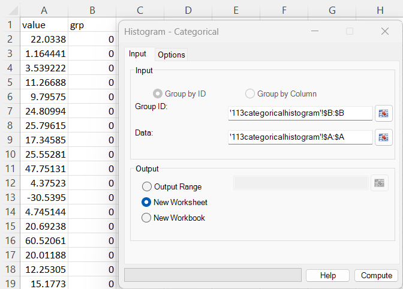
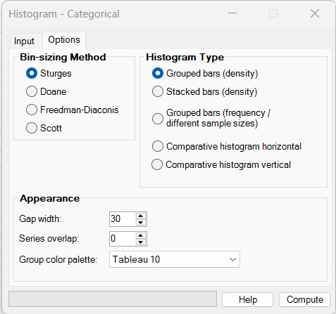
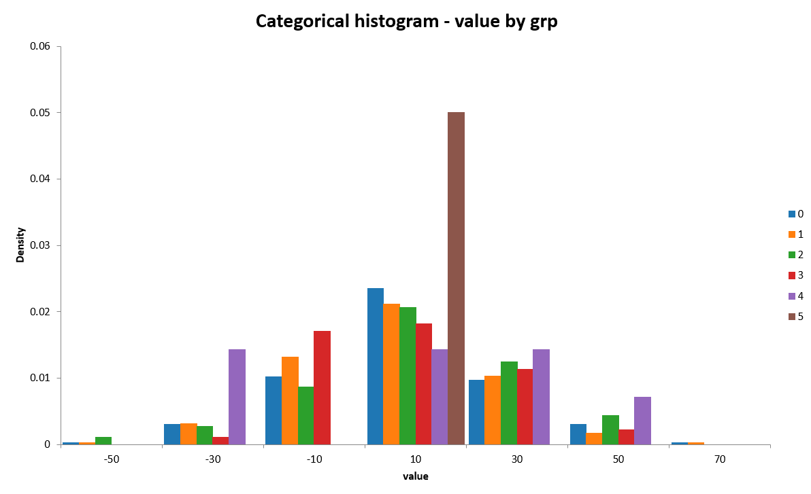
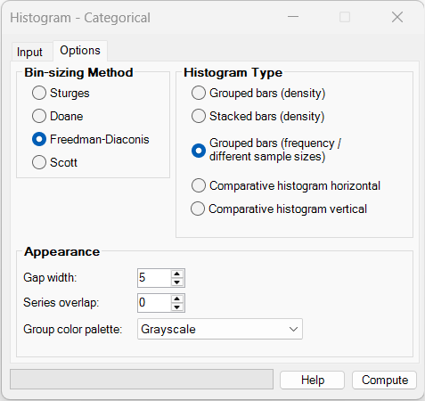
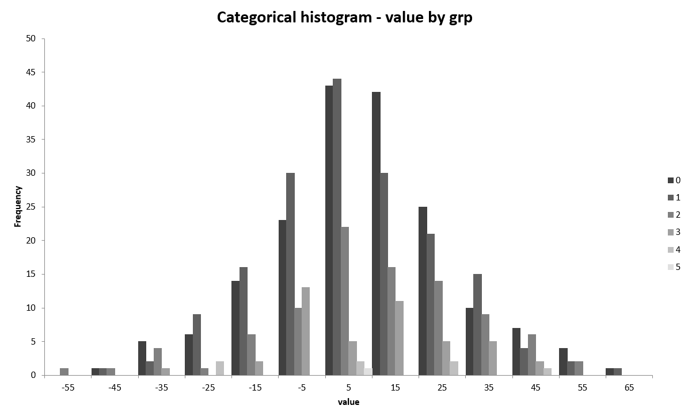
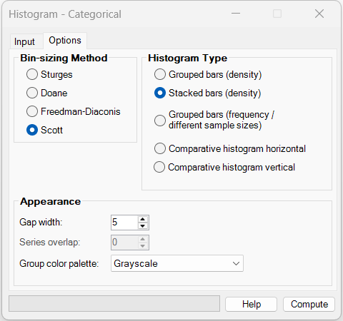
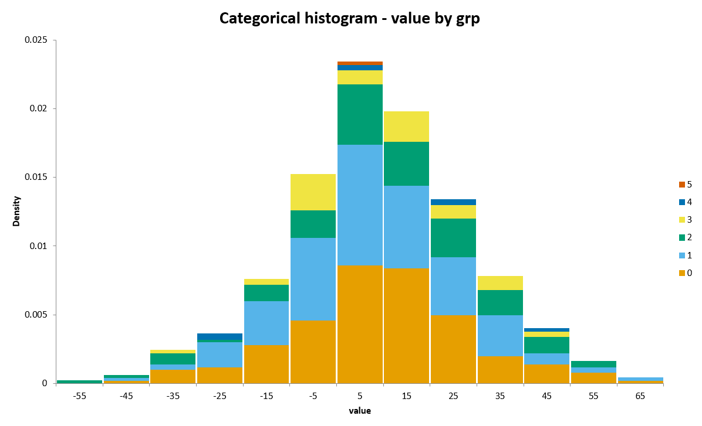
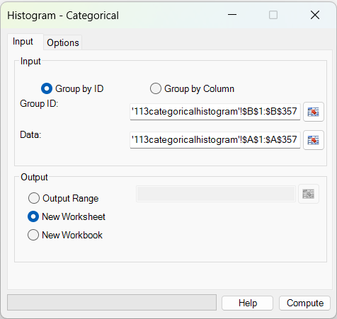
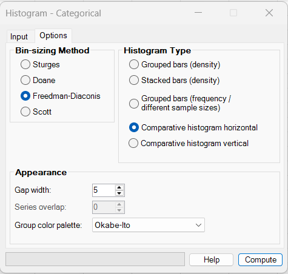
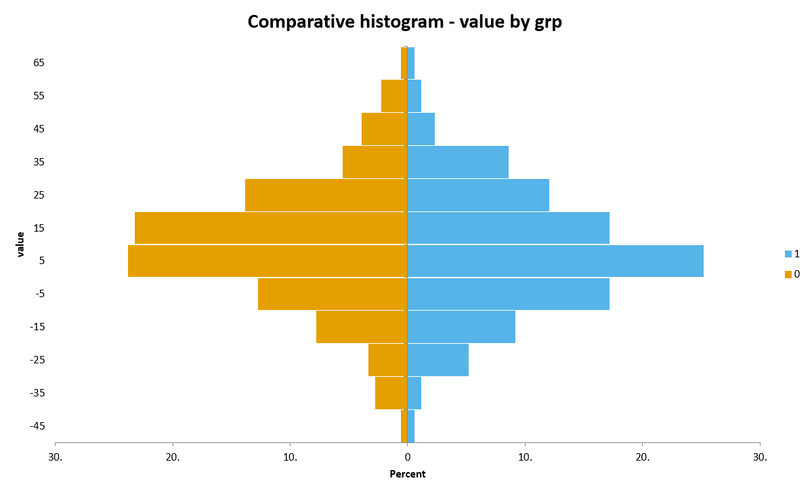

# Histogram - Categorical

**Includes:** Grouped density histograms, stacked density histograms, grouped frequency histograms for unequal sample sizes, two-group comparative histograms in horizontal or vertical orientation, long-format **Group by ID** and wide-format **Group by Column** input, text or numeric grouping variables, common pooled bins, Sturges/Doane/Scott/Freedman–Diaconis binning, adjustable gap width and series overlap, selectable group colour palettes, automatic titles and legend, and selectable chart destination.  
**Purpose:** Compare the distribution of one continuous variable across categorical groups while keeping the histogram bins aligned between groups, or compare exactly two groups with a mirrored back-to-back histogram.

---

## Overview

A **categorical histogram** displays the distribution of one continuous variable separately for categorical groups. BESHStatNG accepts two worksheet layouts:
 
- a **continuous value** to be binned on the horizontal axis; and
- a **group ID** identifying the category to which that observation belongs.

Unlike several independently calculated histograms, BESHStatNG first pools all usable continuous observations and calculates **one common set of histogram bins**. Every group is then counted using those same bin boundaries. This is essential for meaningful side-by-side, stacked, or mirrored comparisons because a particular bin always represents the same interval for every group.

Five presentations are available:

| Histogram type | Scale | Main purpose |
|---|---|---|
| **Grouped bars (density)** | Density normalized separately within each group | Compare distribution shapes while reducing the visual effect of unequal group sizes |
| **Stacked bars (density)** | Contributions to one pooled density | Show the overall distribution and how each group contributes to it |
| **Grouped bars (frequency / different sample sizes)** | Raw counts | Compare absolute numbers of observations in each bin and make unequal sample sizes visible |
| **Comparative histogram horizontal** | Percentage within each group | Compare exactly two distributions back-to-back, with the first group to the left and the second to the right |
| **Comparative histogram vertical** | Percentage within each group | Compare exactly two distributions back-to-back, with the first group above zero and the second below |

BESHStatNG creates the result directly as a standard embedded Excel column or bar chart. No worksheet helper columns are required.

!!! note
    A categorical histogram is descriptive. It does not test whether distributions, means, variances, or other population characteristics differ between groups.

---

## When to use it

Use **Histogram - Categorical** when you have a quantitative measurement observed in two or more groups and want to examine how its distribution differs between them, for example:

- laboratory measurements by treatment group;
- biomarker values by diagnosis or study arm;
- process measurements by machine, batch, site, or operator;
- examination scores by class or teaching method;
- environmental measurements by location or habitat type;
- response times by experimental condition;
- grouped continuous data stored either in long format with a group ID or in separate worksheet columns.

The chart is particularly useful for examining:

- shifts in the location of distributions;
- differences in spread;
- skewness and tail behaviour;
- multimodality;
- unusual or extreme observations;
- differences in group sample sizes;
- which groups contribute to different parts of the pooled distribution;
- direct two-group shape comparisons with a common central baseline.

Choose the histogram type according to the question you want the graph to answer. **Grouped density** is usually best for comparing shapes across several groups, **frequency** is best when absolute counts matter, and **stacked density** is best when the pooled distribution and its group composition are of interest. When there are **exactly two groups**, either comparative histogram provides a compact mirrored display using within-group percentages so unequal sample sizes do not determine the total width or height.

!!! warning "Histograms depend on the bins"
    Apparent peaks, gaps, skewness, and overlap can change when the bin width changes. Inspect more than one sensible bin-sizing rule when important conclusions depend on fine details of the histogram shape.

---

## Example dataset

Download the sample CSV used in the screenshots:

- [113categoricalhistogram.csv](../assets/data/113categoricalhistogram/113categoricalhistogram.csv)

The file contains **500 observations** in long format:

| Column | Contents | Use in the dialog |
|---|---|---|
| **value** | Continuous measurement | **Data** |
| **grp** | Numeric categorical level from 0 to 5 | **Group ID** |

The supplied CSV is in long format. The same values can also be analysed with **Group by Column** after arranging each group's observations in a separate worksheet column.

The group sizes are deliberately very unequal:

| Group | n | Percentage of all observations |
|---:|---:|---:|
| 0 | 181 | 36.2% |
| 1 | 175 | 35.0% |
| 2 | 92 | 18.4% |
| 3 | 44 | 8.8% |
| 4 | 7 | 1.4% |
| 5 | 1 | 0.2% |
| **Total** | **500** | **100.0%** |

The continuous values range from approximately **-51.58 to 60.63**. The strongly unequal group sizes make the dataset useful for demonstrating the difference between density and frequency displays.

---

## Worked examples

### Input

Open `113categoricalhistogram.csv` in Excel. Select the `grp` column as **Group ID** and the `value` column as **Data**.

Use these input settings for Examples 1–3:

| Setting | Value |
|---|---|
| Group by | **Group by ID** |
| Group ID | `B:B` (`grp`) |
| Data | `A:A` (`value`) |
| Output | **New Worksheet** |

The two ranges must refer to the same worksheet rows. BESHStatNG treats the values as row-by-row pairs: each value in column A belongs to the group on the same row in column B.

---

### Example 1: grouped density histogram

Use:

| Setting | Value |
|---|---|
| Bin-sizing Method | **Sturges** |
| Histogram Type | **Grouped bars (density)** |
| Gap width | `30` |
| Series overlap | `0` |
| Group color palette | **Tableau 10** |

Click **Compute**.

For these data, Sturges' rule followed by BESHStatNG's rounded "pretty" breaks produces seven common bins of width 20, with midpoints:

$$
-50, -30, -10, 10, 30, 50, 70.
$$

Each group is normalized independently. For group 0, for example, 85 of its 181 observations fall in the bin centred at 10, giving density

$$
\frac{85}{181\times20}\approx0.0235.
$$

Group 5 contains only one observation, at about 1.92. Its entire distribution therefore falls into the bin centred at 10 and its density there is

$$
\frac{1}{1\times20}=0.05.
$$

This explains the tall single bar for group 5. It **does not** mean that group 5 contains more observations than the other groups; it is a consequence of normalizing every group to total histogram area 1.

!!! important "Check small groups before interpreting density"
    Density normalization is useful for comparing distribution shape across unequal sample sizes, but a group with very few observations can produce visually prominent bars. In this example, group 5 has only one observation. Always consider group sample size alongside a density histogram.

---

### Example 2: grouped frequency histogram for different sample sizes

Use:

| Setting | Value |
|---|---|
| Bin-sizing Method | **Freedman-Diaconis** |
| Histogram Type | **Grouped bars (frequency / different sample sizes)** |
| Gap width | `5` |
| Series overlap | `0` |
| Group color palette | **Grayscale** |

The vertical axis now shows **Frequency**, so each bar is the actual number of observations from that group in the corresponding bin. For this dataset, the final rounded bins have width 10 and midpoints from -55 to 65.

The unequal sample sizes are immediately visible. Groups 0 and 1 have the largest bars because they contain 181 and 175 observations, whereas groups 4 and 5 contribute very few counts. In the bin centred at 5, for example, the frequencies are:

| Group | Frequency |
|---:|---:|
| 0 | 43 |
| 1 | 44 |
| 2 | 22 |
| 3 | 5 |
| 4 | 2 |
| 5 | 1 |

Use this presentation when the **number of observations** is part of the information you want the chart to communicate. Do not use raw frequency heights alone to infer that a larger group has a higher underlying probability of falling in a bin; a larger sample naturally tends to produce larger counts.

---

### Example 3: stacked density histogram

Use:

| Setting | Value |
|---|---|
| Bin-sizing Method | **Scott** |
| Histogram Type | **Stacked bars (density)** |
| Gap width | `5` |
| Series overlap | Not applicable; disabled |
| Group color palette | **Okabe-Ito** |

The groups are stacked within each common bin. Unlike **Grouped bars (density)**, the separate groups are **not** individually normalized to area 1. Instead, every segment is normalized using the pooled sample size of 500.

For the bin centred at 5, the six group frequencies sum to

$$
43+44+22+5+2+1=117.
$$

With a bin width of 10, the full stacked height is therefore

$$
\frac{117}{500\times10}=0.0234,
$$

which is the height of the pooled histogram density in that bin.

Across all bins, the total area contributed by each group equals its proportion of the complete usable sample. Group 0 therefore contributes 36.2% of the stacked area, group 1 contributes 35.0%, and group 5 contributes only 0.2%.

This presentation is useful when you want to see both the **overall distribution** and the **composition of that distribution by group**.

!!! note
    In a stacked chart, segments above the bottom series do not share a common baseline. Comparing the detailed shape of several groups is therefore usually easier with **Grouped bars (density)** or **Grouped bars (frequency)**.

---

### Example 4: horizontal comparative histogram

A comparative histogram requires **exactly two usable groups**. For this example, restrict the source data to groups 0 and 1 by selecting rows 1–357, including the headings:

Use:

| Setting | Value |
|---|---|
| Group by | **Group by ID** |
| Group ID | `B1:B357` (`grp`) |
| Data | `A1:A357` (`value`) |
| Output | **New Worksheet** |
| Bin-sizing Method | **Freedman-Diaconis** |
| Histogram Type | **Comparative histogram horizontal** |
| Gap width | `5` |
| Series overlap | Not applicable; disabled |
| Group color palette | **Okabe-Ito** |

Click **Compute**.

The two distributions use the same pooled bin boundaries, but each group is normalized independently to the **percentage of that group's own usable observations** in each bin:

$$
p_{gj}=100\frac{c_{gj}}{n_g}.
$$

Groups 0 and 1 contain \(181\) and \(175\) observations respectively. In the bin centred at 5, the counts are 43 and 44, so the displayed percentages are approximately

$$
100\frac{43}{181}=23.76\%,
\qquad
100\frac{44}{175}=25.14\%.
$$

For the **horizontal** orientation, the first group encountered in the input is drawn to the **left** of zero and the second group to the **right**. BESHStatNG uses negative plotting values internally for the left-hand series, but the axis labels are displayed as positive percentages because the sign represents direction only.

The value axis is automatically made symmetric around zero. This gives both groups the same visual scale and makes differences in distribution shape easy to compare.

The **Comparative histogram vertical** option uses the same percentages and common bins, but places the first group **above** zero and the second group **below** zero.

!!! important "Comparative histograms require two groups"
    If the cleaned input contains fewer or more than two usable groups, BESHStatNG stops with a validation error rather than silently dropping or combining groups.

---

## Required data layout

Histogram - Categorical supports both **long-format** and **wide-format** grouped continuous data.

### Group by ID: long format

Use one grouping column and one continuous data column:

| Group | Value |
|---|---:|
| Control | 12.4 |
| Control | 10.8 |
| Treatment | 15.1 |
| Treatment | 17.6 |
| Control | 9.9 |

Select:

- the categorical column as **Group ID**;
- the numeric measurement column as **Data**.

The grouping column may contain **text or numeric** category values. The data column must contain numeric values.

The two selected ranges must:

- each be one continuous single-column range;
- come from the same workbook and worksheet;
- start on the same worksheet row;
- contain the same number of selected rows;
- remain aligned so that the group and value on a worksheet row describe the same observation.

Whole-column selections such as `B:B` and `A:A` are supported, as are aligned bounded ranges such as `B1:B501` and `A1:A501`.

Headings may be included and are recommended because BESHStatNG uses them in the automatic chart and axis titles. With headings `grp` and `value`, a non-comparative chart is titled **Categorical histogram - value by grp**; a comparative chart is titled **Comparative histogram - value by grp**.

!!! important "Keep Group by ID ranges aligned"
    Long-format observations are paired row by row. Do not independently sort, filter, shorten, or offset the two selected columns. BESHStatNG rejects ranges that start on different rows or contain different numbers of rows.

### Group by Column: wide format

Select one or more numeric worksheet columns in **Data columns**. Each selected column is interpreted as one group:

| Control | Treatment A | Treatment B |
|---:|---:|---:|
| 12.4 | 15.1 | 13.7 |
| 10.8 | 17.6 | 16.2 |
| 9.9 | 14.3 |  |
| 11.6 |  | 15.4 |

Important rules are:

- each selected worksheet column becomes a separate histogram group;
- missing values are handled independently within each column;
- columns do **not** need the same number of usable observations;
- a non-blank **text value in the first selected row** is used as that group's label and is not plotted as an observation;
- numeric-looking text such as `"0"` is also treated as a text group label;
- if the first selected cell is genuinely numeric, it remains an observation and the Excel column identifier (`A`, `B`, `C`, ...) is used as the group name;
- duplicate text headings are made unique automatically, for example `Control`, `Control (2)`;
- completely empty or nonnumeric selected columns are omitted.

In **Group by Column** mode, BESHStatNG uses the generic variable names **Value** and **Group** in automatic chart titles because the selected columns themselves represent the groups.

For a comparative histogram, exactly **two usable columns** must remain after empty/nonnumeric columns are omitted.

!!! tip "Include headings in wide-format selections"
    For meaningful group labels, include the text heading row in the selected columns. If you select numeric data only, BESHStatNG falls back to Excel column letters as the group labels.

---

## Dialog: inputs and output

### Input tab

#### Group by ID

Select this option for long-format data consisting of one grouping variable and one continuous measurement variable.

##### Group ID

Select the categorical variable. Group IDs may be:

- text, such as `Control`, `Treatment A`, and `Treatment B`;
- integers, such as `0`, `1`, and `2`;
- other numeric values used as category labels.

Groups are retained in the order of their **first usable occurrence** in the selected data.

##### Data

Select the corresponding continuous numeric variable to be divided into histogram bins. The selected rows must align with the **Group ID** range.

Negative, zero, and positive finite values are valid. The numeric range does not need to begin at zero.

### Group by Column

Select this option for wide-format data where each worksheet column represents one group.

The **Group ID** selector is disabled and the second RefEdit becomes **Data columns**. Select the worksheet columns to compare. Missing values are handled independently within the columns, and a text value in the first selected row is used as the group label when present.

### Output Range

Creates the chart on the worksheet containing the selected output cell. The upper-left corner of the chart is anchored at the selected output position.

The output RefEdit is enabled only when **Output Range** is selected.

### New Worksheet

Creates a new worksheet in the source workbook and places the chart at the start of that sheet. This is the default output option used in the examples.

### New Workbook

Creates a new workbook and places the chart on its active worksheet.

---

## Dialog: options

### Bin-sizing Method

All groups use the **same bins**, and the selected bin-sizing rule is applied to the **pooled continuous observations**, not separately to each group.

Available methods are:

- **Sturges**;
- **Doane**;
- **Freedman-Diaconis**;
- **Scott**.

See [Binning rules](#binning-rules) below for the calculations.

### Histogram Type

#### Grouped bars (density)

Creates a clustered-column chart and normalizes each group independently:

$$
d_{gj}=\frac{c_{gj}}{n_g h},
$$

where:

- \(c_{gj}\) is the count for group \(g\) in bin \(j\);
- \(n_g\) is the usable sample size of group \(g\);
- \(h\) is the common bin width.

For each group,

$$
\sum_j d_{gj}h=1.
$$

Use this option primarily to compare **distribution shape** when groups have different sample sizes.

#### Stacked bars (density)

Creates a stacked-column chart. Each group contributes to one common pooled density:

$$
s_{gj}=\frac{c_{gj}}{Nh},
$$

where \(N=\sum_g n_g\) is the total number of usable observations.

The complete stack satisfies

$$
\sum_g\sum_j s_{gj}h=1.
$$

The total area belonging to group \(g\) is

$$
\sum_j s_{gj}h=\frac{n_g}{N}.
$$

Use this option to decompose the **overall pooled distribution** into its group contributions.

#### Grouped bars (frequency / different sample sizes)

Creates a clustered-column chart using the raw bin counts:

$$
f_{gj}=c_{gj}.
$$

Use this option when unequal group sample sizes are meaningful and should remain visible in the graph.

#### Comparative histogram horizontal

Creates a mirrored horizontal Excel bar chart for **exactly two groups**. Each group is normalized independently to percentages:

$$
p_{gj}=100\frac{c_{gj}}{n_g},
$$

so that, apart from floating-point round-off,

$$
\sum_j p_{gj}=100
$$

for each group.

The first group is plotted to the **left** of the central zero line and the second group to the **right**. The percentage axis is symmetric around zero and negative signs are suppressed in the displayed tick labels because the sign is used only to control plotting direction.

Use this option when two distributions should be compared directly with the continuous bins arranged vertically.

#### Comparative histogram vertical

Uses the same within-group percentages and exactly-two-group requirement as the horizontal comparative histogram, but draws a mirrored clustered-column chart:

- the first group is plotted **above** zero;
- the second group is plotted **below** zero.

Use this orientation when the conventional horizontal histogram bin axis is preferable.

!!! note "Group order in comparative histograms"
    With **Group by ID**, the first and second groups are determined by their first usable occurrence in the source data. With **Group by Column**, they follow the selected worksheet-column order.

---

### Appearance

#### Gap width

Controls Excel's chart **GapWidth** setting.

- allowed range: `0` to `500`;
- default: `30`;
- smaller values produce wider bars and smaller gaps;
- larger values produce narrower bars and larger gaps.

Gap width affects appearance only. It does not change the statistical bin width or bin boundaries.

!!! important "Chart gap width is not histogram bin width"
    **Gap width** controls the spacing of Excel columns. The numerical histogram **bin width** is determined by Sturges, Doane, Scott, or Freedman–Diaconis and the subsequent rounded breaks. Changing Gap width does not recalculate the histogram.

#### Series overlap

Controls Excel's **SeriesOverlap** setting for the ordinary clustered histogram types.

- allowed range: `-100` to `100`;
- default: `0`;
- `0` gives conventional side-by-side bars;
- positive values move group bars toward each other and can make them overlap;
- negative values separate the group series further.

This setting is disabled for **Stacked bars (density)** because the groups are already stacked. It is also disabled for both **Comparative histogram** options, where BESHStatNG automatically forces overlap to `100` so the two opposing series occupy exactly the same bin position.
 
#### Group color palette

Choose one of four automatic palettes:

| Palette | Number of colours before repeating | Typical use |
|---|---:|---|
| **Tableau 10** | 10 | General-purpose categorical display; default |
| **Okabe-Ito** | 8 | Distinct categorical colours, including a colour-vision-friendly set |
| **ColorBrewer Set1** | 9 | Strong qualitative colours |
| **Grayscale** | 6 | Monochrome output, printing, or reports where colour is undesirable |

If the number of groups exceeds the number of colours in the chosen palette, BESHStatNG cycles through the palette again.

Chart title, axis titles, legend visibility, legend position, fill, outlines, and gridline behaviour use the built-in defaults in the current Windows dialog.

---

## Steps in the add-in

1. In the Excel ribbon, select **BESH Stat NG → Analyse → Graphics → Histogram - Categorical**.
2. Choose the worksheet layout:
   - **Group by ID** for one categorical column plus one aligned continuous data column; or
   - **Group by Column** when each selected numeric column represents a group.
3. Select the required input range or ranges.
4. Choose **Output Range**, **New Worksheet**, or **New Workbook**.
5. Open the **Options** tab.
6. Choose a **Bin-sizing Method**.
7. Choose one of the five **Histogram Type** options.
8. Optionally adjust **Gap width**, **Series overlap** when enabled, and **Group color palette**.
9. Click **Compute**.

For either comparative histogram, make sure the cleaned input contains **exactly two usable groups**.

---

## Output

BESHStatNG creates one embedded Excel chart containing:

- one series for every usable categorical level;
- common bin midpoints shared by every group;
- clustered, stacked, or mirrored bars/columns according to the selected histogram type;
- automatic distinct colours from the chosen palette;
- a legend displaying the group levels;
- an automatic chart title:
  - **Categorical histogram - _data_ by _group_** for grouped/stacked/frequency types;
  - **Comparative histogram - _data_ by _group_** for either comparative type;
- the continuous-variable name on the bin/category axis;
- **Density**, **Frequency**, or **Percent** on the value axis according to the selected histogram type.

In **Group by Column** mode the generic names **Value** and **Group** are used in the automatic title.

The chart is created at approximately **720 × 440 points**. It is a standard Excel chart and can be moved, resized, formatted, copied, or exported after creation. See [Export Chart](../export-chart.md) for high-resolution image export.

The current renderer does not write a histogram-frequency table or helper data to the worksheet.

---

## What it does: calculation details

### 1. Import and clean the grouped observations

With **Group by ID**, the selected categorical and continuous ranges are imported together so that observations remain row-aligned. A row without a usable group/value pair is excluded.

With **Group by Column**, each selected numeric column is imported independently. A text value in the first selected row can supply the group label, and missing observations in one group do not remove observations from another group. The usable columns are then converted internally to the same paired continuous/group representation used by the numerical backend.

The continuous observations must be numeric and finite. Group values may be text or numeric.

### 2. Preserve group order

For **Group by ID**, BESHStatNG records each distinct group when it first appears among the usable observations. For **Group by Column**, groups follow the selected column order. This order determines series construction and colour assignment.

A comparative histogram additionally validates that exactly two usable groups remain.

### 3. Pool the continuous values for bin selection

All usable continuous observations are combined:

$$
X_{\mathrm{pool}}=\{x_1,x_2,\ldots,x_N\}.
$$

The selected bin-sizing rule is applied once to this pooled vector. The resulting common bin edges are then used for every group.

!!! important "Bins are never calculated separately by group"
    Separate group-specific bins could have different widths or boundaries, making side-by-side, stacked, or mirrored bars misleading. The categorical histogram therefore always uses one common pooled binning scheme.

### 4. Count each group in each common bin

Let the final common bin edges be

$$
b_0,b_1,\ldots,b_K,
$$

with common width

$$
h=b_{j+1}-b_j.
$$

For every group \(g\), BESHStatNG counts the observations in each bin to obtain \(c_{gj}\).

The right-most edge is included in the final bin. Values falling exactly on or beyond the calculated maximum edge because of floating-point rounding are assigned to the last bin.

### 5. Convert counts to the requested scale

The same counts are retained internally in four forms:

- raw frequency \(c_{gj}\);
- within-group density \(c_{gj}/(n_gh)\);
- pooled density contribution \(c_{gj}/(Nh)\);
- within-group percentage \(100c_{gj}/n_g\).

The selected **Histogram Type** determines which values are sent to Excel.

### 6. Create the Excel chart

BESHStatNG uses:

- an Excel **clustered column chart** for grouped density and grouped frequency;
- an Excel **stacked column chart** for stacked density;
- an Excel **clustered bar chart** for the horizontal comparative histogram;
- an Excel **clustered column chart** for the vertical comparative histogram.

For comparative charts, one series is given the opposite sign only at rendering time so the two groups extend in opposite directions from zero. Their underlying calculated percentages remain positive. Excel series overlap is forced to `100`, the percentage scale is made symmetric around zero, and negative signs are hidden from the tick labels.

Bin midpoints are supplied directly as category values and the computed counts/densities/percentages are supplied directly as the series values. No worksheet helper columns are created.

---

## Binning rules

The categorical histogram reuses the same histogram binning implementation as the ordinary BESHStatNG [Histogram](histogram.md). The difference is that the rule is applied to the **pooled continuous data** before counts are calculated separately by category.

Let:

- \(N\) be the number of usable pooled observations;
- \(x_{\min}=\min(X_{\mathrm{pool}})\);
- \(x_{\max}=\max(X_{\mathrm{pool}})\).

### Sturges

The target number of bins is

$$
k=\operatorname{round}\left(1+\log_2 N\right),
$$

with raw width

$$
h=\frac{x_{\max}-x_{\min}}{k}.
$$

Sturges is simple and often useful as a default for moderately sized, approximately regular datasets. It can produce bins that are too wide for large or strongly non-normal samples.

### Doane

Define

$$
s=\sqrt{\frac{6(N-2)}{(N+1)(N+3)}}.
$$

Then

$$
k=\operatorname{round}\left[
1+\log_2N+
\log_2\left(1+\frac{|\operatorname{Skewness}(X_{\mathrm{pool}})|}{s}\right)
\right],
$$

and

$$
h=\frac{x_{\max}-x_{\min}}{k}.
$$

The rule modifies Sturges according to skewness and can therefore request more bins for asymmetric data.

!!! note
    The current BESHStatNG implementation uses its existing population Fisher moment coefficient for `Skewness`, matching the ordinary Histogram implementation.

### Scott

Scott's rule estimates the width directly:

$$
h=\frac{3.5s_x}{N^{1/3}},
$$

where \(s_x\) is the sample standard deviation. The corresponding target bin count is

$$
k=\operatorname{round}\left(\frac{x_{\max}-x_{\min}}{h}\right).
$$

Scott is sensitive to the standard deviation and therefore to extreme values, but it is often effective for approximately normal or smooth continuous distributions.

### Freedman–Diaconis

Using

$$
IQR=Q_3-Q_1,
$$

the raw width is

$$
h=\frac{2IQR}{N^{1/3}},
$$

and the target bin count is

$$
k=\operatorname{round}\left(\frac{x_{\max}-x_{\min}}{h}\right).
$$

Because it uses the interquartile range rather than the standard deviation, Freedman–Diaconis is generally less sensitive to extreme observations.

### Rounded "pretty" breaks

The theoretical rule first produces a target bin count. BESHStatNG then snaps the range to readable equal-width breaks using a **1–2–5–10 × \(10^m\)** step pattern:

1. calculate a raw step from the data range and target bin count;
2. round upward to a convenient 1, 2, 5, or 10 multiple of a power of ten;
3. expand the minimum and maximum outward to multiples of that step;
4. generate equal-width breaks across the expanded range.

The final number of bins can therefore differ from the raw theoretical target. This behaviour is shared with the ordinary BESHStatNG histogram.

---

## How to choose the histogram type

| Question | Recommended type | Reason |
|---|---|---|
| Do several groups have similar distribution shapes? | **Grouped bars (density)** | Each group has area 1, so sample-size differences do not directly determine total area |
| Which groups account for the pooled distribution in different regions? | **Stacked bars (density)** | The full stack is the pooled density and each segment is a group's contribution |
| How many observations from each group fall in each interval? | **Grouped bars (frequency)** | Heights are raw counts |
| Are unequal group sample sizes themselves important? | **Grouped bars (frequency)** | Larger samples remain visually larger |
| Are group sizes very unequal but shape comparison is the goal? | **Grouped bars (density)** | Independent normalization reduces the direct effect of sample size |
| Do I have exactly two groups and want a direct back-to-back comparison? | **Comparative histogram horizontal** or **vertical** | Both groups use within-group percentages and a common mirrored baseline |
| Do I want the measurement/bin values running vertically? | **Comparative histogram horizontal** | Bars extend left and right while bins run from bottom to top |
| Do I want the conventional histogram bin axis running horizontally? | **Comparative histogram vertical** | Bars extend above and below while bins run left to right |
| Do I want to compare detailed group shapes with a common zero baseline across more than two groups? | **Grouped bars (density)** or **frequency** | Clustered bars share a zero baseline; stacked segments generally do not |

For very small groups, no histogram type can provide a stable picture of the underlying distribution. Report or inspect sample sizes before interpreting fine details.

---

## How to interpret density, frequency, and comparative percent

### Density is area, not count

For an independently normalized group histogram,

$$
\text{bar area}=\text{density}\times\text{bin width}.
$$

The areas across the bins sum to 1 for that group. A density height is therefore **not** a count and is not itself a probability unless it is multiplied by the bin width.

Density can also exceed 1 when the bins are sufficiently narrow; this does not violate probability rules because the **area**, not the height, is normalized.

### Frequency is count

A frequency height of 25 means that 25 usable observations from that group fall in the corresponding interval. Because frequency is not normalized, a group with twice as many observations can have approximately twice the bar heights even when its underlying distribution has the same shape.

### Stacked density combines distribution and sample composition

In the stacked density chart:

- the **total height** in a bin is the pooled density in that interval;
- the **relative segment sizes within the bin** show which groups contribute those observations;
- the **total area of a group's segments** equals that group's fraction of the complete sample.

### Comparative percent is normalized within each group

For a comparative histogram,

$$
p_{gj}=100\frac{c_{gj}}{n_g}.
$$

The bin percentages for each group sum to approximately 100%. This makes groups with different sample sizes directly comparable in terms of **distribution shape**.

One series is drawn on the negative side of the plotting axis only to create the mirrored layout. A bar extending leftward or downward does **not** represent a negative percentage or a negative measurement. BESHStatNG displays the mirrored value-axis tick labels without minus signs.

---

## Missing, invalid, and special values

- Group IDs in **Group by ID** mode may be text or numeric.
- Continuous observations must be numeric and finite.
- Negative continuous values are valid.
- Zero is a valid continuous observation.
- In **Group by ID** mode, blank or unusable rows are excluded during the paired import/cleaning process.
- In **Group by Column** mode, missing observations are handled independently within each selected column.
- Empty or nonnumeric selected columns in **Group by Column** mode are omitted.
- A non-blank text value in the first selected row of a wide-format column is treated as its group label rather than as data.
- At least one usable observation and one usable group are required for the ordinary grouped, stacked, and frequency displays.
- A comparative histogram requires exactly **two usable groups**.
- A category represented by only one observation is valid, but its density or percentage profile should be interpreted cautiously.
- Duplicate values and duplicate group IDs are expected and valid.
- Group labels are trimmed for display.
- Duplicate wide-format text headings are made unique automatically.
- With **Group by ID**, groups are retained in first-occurrence order; with **Group by Column**, they follow selected column order.

!!! tip
    If missingness differs importantly between groups, check the number of usable observations before interpreting the histogram. Different effective sample sizes can affect frequency displays and the stability of density or comparative-percentage profiles.

---

## Categorical histogram versus related graphics

| Graphic | Main encoding | Typical purpose |
|---|---|---|
| **Histogram - Categorical** | Binned density, frequency, or within-group percent by group | Compare distribution shape, pooled composition, bin counts, or two groups back-to-back |
| **Histogram** | Separate histogram for each selected variable/group | Examine one or more distributions individually, with optional descriptive statistics and normal overlay |
| **Box and Whiskers** | Median, quartiles, whiskers, and outliers | Compare group location and spread compactly without choosing histogram bins |
| **Normal Plot** | Ordered observations against expected normal quantiles | Assess departures from normality more directly |
| **Kite Chart** | Symmetric width along ordered positions | Compare nonnegative profiles over an ordered sequence rather than distributions of raw observations |

Use a box plot when a compact summary across many groups is more important than detailed distribution shape. Use the ordinary Histogram when you want separate charts, descriptive-statistics output, or a normal-curve overlay. Use Histogram - Categorical when **aligned bins on one combined chart** are the main requirement.

---

## Implementation details and limitations

- Numerical histogram calculation is separated from Excel chart rendering.
- Both **Group by ID** long-format input and **Group by Column** wide-format input are supported.
- With **Group by ID**, the categorical variable may contain text or numeric group values and the two selections are validated as aligned single-column ranges from the same worksheet.
- With **Group by Column**, columns are imported independently, may have different numbers of usable observations, and are flattened to the common grouped-data backend representation.
- A text value in the first selected wide-format row is used as the group label; otherwise the Excel column letter is used.
- All groups share one binning scheme calculated from the pooled usable continuous observations.
- Binning reuses `ChartingFunc.HistogramBinsComputation`, the same implementation used by the ordinary Histogram.
- Grouped density uses within-group normalization.
- Stacked density uses pooled normalization.
- Grouped frequency uses raw counts.
- Comparative histograms use within-group percentages \(100c_{gj}/n_g\) and require exactly two usable groups.
- The horizontal comparative renderer uses an Excel clustered-bar chart; the vertical comparative renderer uses a clustered-column chart.
- Comparative series are mirrored only during Excel rendering; the numerical result retains positive percentages.
- Comparative value axes are automatically symmetric around zero and display absolute-value tick labels.
- Excel clustered-column charts are used for grouped density and frequency.
- An Excel stacked-column chart is used for stacked density.
- Gap width and series overlap are Excel display properties; they do not alter bin calculations.
- Series overlap is not applied to stacked histograms and is automatically forced to `100` for comparative histograms.
- The current interface provides four fixed categorical colour palettes rather than individual group-colour editing.
- Palettes repeat when the number of groups exceeds their number of colours.
- The legend is displayed by default on the right.
- Horizontal major gridlines are hidden by default.
- The current dialog automatically generates chart and axis titles; title editing is left to Excel after chart creation.
- Excel limits this renderer to at most 255 data series/groups; comparative histograms are separately restricted to exactly two groups.
- No normal-curve overlay is provided for the categorical histogram.
- No descriptive-statistics table is produced by this chart dialog.
- No kernel-density smoothing is performed; the displayed shape is entirely determined by histogram bins and counts.
- The chart does not calculate confidence intervals or hypothesis tests for between-group differences.
- The plot is created through the ribbon; it is not a worksheet UDF.

---

## Common mistakes

- In **Group by ID** mode, selecting **Group ID** and **Data** ranges that start on different rows or contain different numbers of rows.
- Selecting the continuous measurement as Group ID and the categorical variable as Data.
- In **Group by Column** mode, forgetting to include text headings when meaningful group names are wanted; without them, Excel column letters are used.
- Assuming missing cells in one wide-format group remove the same worksheet row from every other group; each column is cleaned independently.
- Selecting a comparative histogram when the cleaned input contains anything other than **two groups**.
- Interpreting the leftward or downward side of a comparative histogram as a negative percentage; the sign is only used to mirror the bars around zero.
- Treating **Gap width** as the statistical histogram bin width.
- Interpreting density height as a raw count.
- Comparing density heights without checking very small group sample sizes.
- Interpreting larger frequency bars as evidence of a higher probability when the groups have different sample sizes.
- Assuming each group has its own independently chosen bin boundaries; BESHStatNG deliberately uses common pooled bins.
- Interpreting a stacked segment as though it had a common zero baseline with every other group.
- Drawing strong conclusions from one binning rule without checking whether the pattern is stable under another reasonable rule.
- Assuming histogram bars establish a statistically significant group difference.

---

## See also

- [Histogram](histogram.md)
- [Box and Whiskers](box-and-whiskers.md)
- [Normal Plot](normal-plot.md)
- [Kite Chart](kite-chart.md)
- [Export Chart](../export-chart.md)
- [Home](../index.md)
