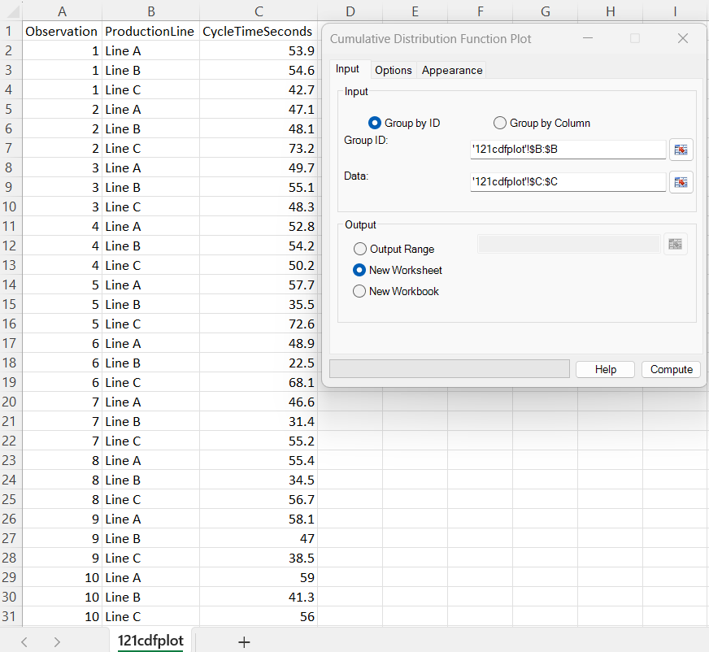
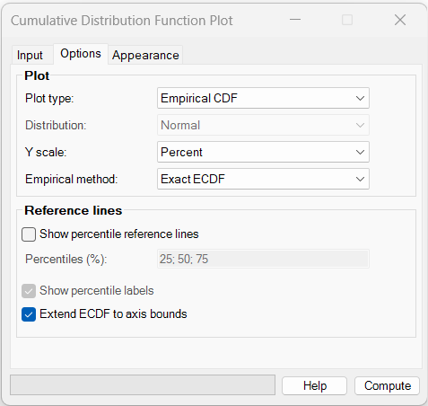
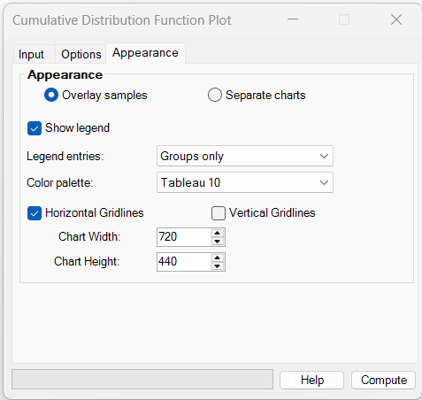
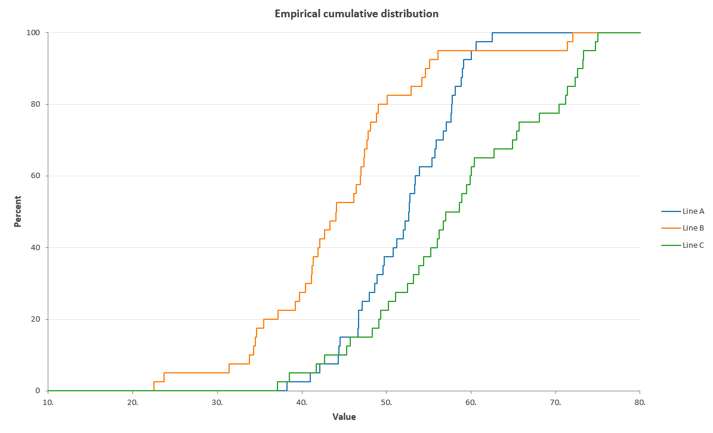
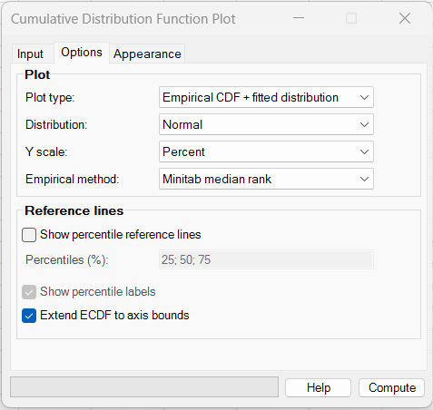
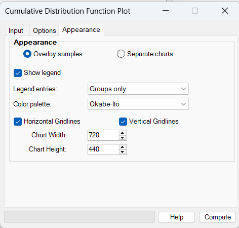
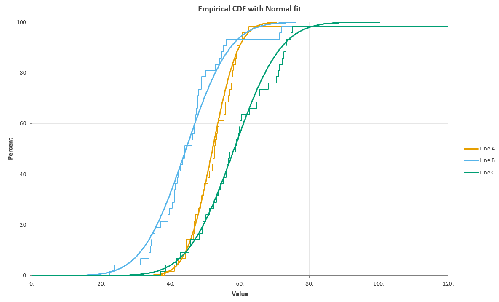

# Cumulative Distribution Function Plot

**Includes:** Empirical cumulative distribution function (ECDF) plots, empirical CDFs with fitted theoretical distributions, fitted CDF-only plots, Exact ECDF and Minitab median-rank plotting positions, probability or percent Y scales, 14 fitted continuous distributions, percentile reference lines and labels, long-format **Group by ID** and wide-format **Group by Column** input, overlaid or separate charts, selectable colour palettes, optional horizontal and vertical gridlines, legends, and configurable chart size.  
**Purpose:** Display the cumulative distribution of one or more continuous samples, compare groups across the full distribution, read empirical percentiles, and visually compare observed cumulative behaviour with a fitted theoretical distribution.

---

## Overview

A **cumulative distribution function (CDF)** describes the proportion or probability of observations that are less than or equal to a particular value.

For an observed sample \(x_1,\ldots,x_n\), the **empirical cumulative distribution function (ECDF)** is

$$
\hat F_n(x)=\frac{1}{n}\sum_{i=1}^{n} I(x_i\le x),
$$

where \(I(\cdot)\) equals 1 when the condition is true and 0 otherwise.

The ECDF is drawn as a staircase. Every upward jump corresponds to one or more observed values. If several observations have the same value, they form one larger jump rather than several separate jumps.

BESHStatNG can display:

- **Empirical CDF** — the observed cumulative distribution only;
- **Empirical CDF + fitted distribution** — the observed staircase together with a fitted theoretical CDF;
- **Fitted distribution only** — the fitted theoretical cumulative distribution without the empirical staircase.

The vertical axis can be shown as either:

- **Probability**, from 0 to 1; or
- **Percent**, from 0 to 100.

For grouped data, several samples can be drawn on the same chart or placed in separate charts.

A CDF plot answers questions such as:

- What proportion of observations are at or below a specified value?
- What value corresponds to the 25th, 50th, or 75th percentile?
- Which group tends to have smaller or larger observations?
- Do two groups differ only in location, or also in spread and shape?
- Does an observed distribution follow a selected theoretical distribution reasonably well?

!!! note
    A CDF or ECDF plot is primarily a descriptive graphical tool. Visual agreement with a fitted distribution does not replace formal goodness-of-fit tests or subject-matter assessment.

---

## When to use it

Use a CDF/ECDF plot when you want to examine the **entire cumulative distribution** rather than only a mean, median, histogram, or box plot.

Typical applications include:

- comparing continuous outcomes between treatment groups;
- comparing process or cycle times across production lines;
- examining laboratory, engineering, environmental, or clinical measurements;
- reading empirical percentiles or service-level thresholds;
- comparing the fraction of observations below a practical specification value;
- checking whether a Normal, Weibull, Gamma, Lognormal, or another supported distribution is a plausible description of the data;
- comparing distribution tails where histograms may depend strongly on bin width;
- displaying unequal-sized groups without choosing histogram bins.

CDF plots are especially useful when a threshold has a direct interpretation. For example, if an ECDF reaches 70% at 55 seconds, approximately 70% of observations are at or below 55 seconds.

Avoid relying on a CDF plot alone when:

- the main goal is to identify individual outliers;
- frequencies within local intervals are more important than cumulative proportions;
- a formal distributional hypothesis test is required;
- there are so many overlaid groups that the cumulative curves become difficult to distinguish.

---

## Example dataset

The sample dataset used on this page is available here:

[121cdfplot.csv](../assets/data/121cdfplot/121cdfplot.csv)

It contains 120 cycle-time observations from three production lines, with 40 observations per line:

| Variable | Description |
|---|---|
| `Observation` | Observation number within each production line |
| `ProductionLine` | Group ID: Line A, Line B, or Line C |
| `CycleTimeSeconds` | Continuous cycle-time measurement in seconds |

The three samples were deliberately constructed to have different cumulative patterns:

| Production line | N | Mean | SD | Median | Minimum | Maximum |
|---|---:|---:|---:|---:|---:|---:|
| Line A | 40 | 52.08 | 5.92 | 52.65 | 38.2 | 62.5 |
| Line B | 40 | 44.44 | 9.99 | 44.05 | 22.5 | 72.0 |
| Line C | 40 | 58.31 | 10.56 | 57.80 | 37.1 | 75.0 |

This makes the same file useful for demonstrating both direct ECDF comparisons and fitted-distribution overlays.

---

## Input settings used in the examples



The examples use the data in long format:

| Setting | Value |
|---|---|
| Group by | **Group by ID** |
| Group ID | `B:B` (`ProductionLine`) |
| Data | `C:C` (`CycleTimeSeconds`) |
| Output | **New Worksheet** |

The heading row is included in the selections. The group names are taken from the values in `ProductionLine`, and the numeric measurements are read from `CycleTimeSeconds`.

Column A (`Observation`) is not required for the plot.

---

## Example 1: comparing empirical cumulative distributions

The first example displays the three production lines as **Exact ECDFs** on one chart.

### Options



Use:

| Setting | Value |
|---|---|
| Plot type | **Empirical CDF** |
| Y scale | **Percent** |
| Empirical method | **Exact ECDF** |
| Show percentile reference lines | Cleared |
| Extend ECDF to axis bounds | Selected |

The Distribution selector is disabled because no theoretical distribution is needed for an empirical-only plot.

### Appearance



| Setting | Value |
|---|---|
| Multiple samples | **Overlay samples** |
| Show legend | Selected |
| Legend entries | **Groups only** |
| Color palette | **Tableau 10** |
| Horizontal Gridlines | Selected |
| Vertical Gridlines | Cleared |
| Chart Width | `720` |
| Chart Height | `440` |

### Output



The horizontal axis contains the observed cycle times, and the vertical axis gives the percentage of observations at or below each value.

The relative horizontal positions of the curves are immediately informative:

- **Line B** is generally shifted to the left, so a larger fraction of Line B observations falls below a given cycle time;
- **Line A** occupies the middle range and is comparatively concentrated;
- **Line C** is generally shifted to the right, indicating larger cycle times overall.

For example, around 50 seconds, the Line B curve is already high on the percent scale, while substantially smaller proportions of Line A and Line C observations are at or below the same value.

The different shapes also show information that would be lost if only means were compared. Line B has a broad upper tail, while Line C spans a wider range than Line A.

!!! tip
    To compare groups at a particular threshold, draw an imaginary vertical line at the threshold and read the height of each ECDF. The highest curve at that X value has the greatest proportion of observations at or below the threshold.

---

## Example 2: empirical CDF with a fitted Normal distribution

The second example adds a fitted Normal CDF for every production line.

### Options



Use:

| Setting | Value |
|---|---|
| Plot type | **Empirical CDF + fitted distribution** |
| Distribution | **Normal** |
| Y scale | **Percent** |
| Empirical method | **Minitab median rank** |
| Show percentile reference lines | Cleared |
| Extend ECDF to axis bounds | Selected |

The **Minitab median rank** option uses plotting probabilities

$$
p_i=\frac{i-0.3}{n+0.4},
$$

where \(i\) is the cumulative rank at the observation. This plotting-position convention is useful when reproducing the style of fitted empirical-CDF displays in Minitab. Unlike an Exact ECDF, the largest empirical plotting position is slightly below 1 (or 100%).

### Appearance



| Setting | Value |
|---|---|
| Multiple samples | **Overlay samples** |
| Show legend | Selected |
| Legend entries | **Groups only** |
| Color palette | **Okabe-Ito** |
| Horizontal Gridlines | Selected |
| Vertical Gridlines | Selected |
| Chart Width | `720` |
| Chart Height | `440` |

### Output



Each group is assigned one colour. The thinner staircase is the empirical cumulative distribution, while the heavier continuous curve is the fitted Normal CDF for the same sample.

The comparison should be made across the **whole curve**, not at only one point. Close tracking of the empirical staircase by the fitted curve suggests that the selected theoretical distribution provides a reasonable visual approximation. Systematic departures indicate differences in location, spread, skewness, or tail behaviour.

In this example, the fitted curve follows some samples more closely than others. Line B in particular shows visible departures in its tails, consistent with its wider and less symmetric sample distribution.

!!! note
    A fitted CDF is estimated separately for every sample. When several groups are overlaid, each fitted curve therefore has its own parameter estimates even though the same distribution family is selected for all groups.

---

## Required data layout

CDF plots support both **long-format** and **wide-format** continuous data.

### Group by ID: long format

Use one grouping column and one numeric data column:

| Group | Value |
|---|---:|
| Line A | 53.9 |
| Line B | 54.6 |
| Line C | 42.7 |
| Line A | 47.1 |
| Line B | 48.1 |

Select:

- the categorical identifier as **Group ID**;
- the corresponding numeric measurement as **Data**.

The two selections must refer to the same worksheet and describe corresponding observations row by row.

Text or numeric group IDs can be used. The group order follows the order in which groups are encountered in the selected data.

### Group by Column: wide format

Use **Group by Column** when each sample is stored in a separate worksheet column:

| Line A | Line B | Line C |
|---:|---:|---:|
| 53.9 | 54.6 | 42.7 |
| 47.1 | 48.1 | 73.2 |
| 49.7 | 55.1 | 48.3 |
| ... | ... | ... |

Select the required columns in **Data columns**. Each usable column becomes one sample.

Columns do not need to contain the same number of usable observations. Completely empty columns are omitted. Including meaningful column headings is recommended because they are used as sample names in the chart and legend.

---

## Dialog: Input tab

### Group by ID

Select this option for long-format data where one column contains sample or group identifiers and another contains continuous measurements.

#### Group ID

Select the grouping variable. Typical examples are:

- treatment group;
- site;
- machine;
- production line;
- sex;
- study arm;
- batch.

#### Data

Select the continuous numeric variable whose cumulative distribution should be plotted.

### Group by Column

Select this option when each sample is stored in its own worksheet column.

The Group ID selector is disabled and the numeric selector becomes **Data columns**.

### Output

Choose one of:

- **Output Range** — places the chart at the selected cell in the current worksheet;
- **New Worksheet** — creates a new worksheet in the source workbook and places the chart there;
- **New Workbook** — creates a new workbook and places the chart on its first worksheet.

The examples use **New Worksheet**.

---

## Dialog: Options tab

### Plot type

Three display modes are available.

#### Empirical CDF

Displays only the empirical cumulative distribution of the observed data.

This is the best choice when the objective is to compare samples without making a distributional assumption.

#### Empirical CDF + fitted distribution

Displays the empirical staircase together with a fitted theoretical CDF.

Use this mode to visually assess how closely the selected theoretical distribution follows the observed cumulative pattern.

#### Fitted distribution only

Displays only the fitted theoretical cumulative curve.

The empirical-method and ECDF-extension controls are not needed in this mode.

### Distribution

The following fitted distributions are available:

| Distribution | Typical support / comment |
|---|---|
| Normal | All real values |
| Lognormal | Positive values |
| 3-parameter Lognormal | Shifted positive distribution with an estimated threshold |
| Gamma | Positive values |
| 3-parameter Gamma | Shifted positive distribution with an estimated threshold |
| Exponential | Non-negative values |
| 2-parameter Exponential | Shifted exponential distribution with an estimated threshold |
| Smallest Extreme Value | All real values; useful for minima-type extreme-value behaviour |
| Weibull | Positive values |
| 3-parameter Weibull | Shifted Weibull distribution with an estimated threshold |
| Largest Extreme Value | All real values; useful for maxima-type extreme-value behaviour |
| Logistic | All real values |
| Loglogistic | Positive values |
| 3-parameter Loglogistic | Shifted positive distribution with an estimated threshold |

Parameters are estimated separately from each selected sample. Some distributions have direct estimates, while others require numerical maximum-likelihood estimation.

!!! important
    A fitted distribution must be compatible with the sample domain. For example, ordinary Lognormal, Gamma, Weibull, and Loglogistic fits require all observations to be greater than zero. The ordinary Exponential distribution requires non-negative observations.

### Y scale

Choose:

- **Probability** — displays cumulative probability from 0 to 1;
- **Percent** — displays cumulative percentage from 0 to 100.

The default is **Percent**.

### Empirical method

#### Exact ECDF

Uses the mathematical empirical cumulative distribution:

$$
\hat F_n(x)=\frac{\#\{x_i\le x\}}{n}.
$$

The final step reaches 1.0 or 100%. Tied observations are combined into one jump whose height equals the number of tied observations divided by the sample size.

Use **Exact ECDF** for ordinary empirical-distribution interpretation and percentile reading.

#### Minitab median rank

Uses the plotting-position convention

$$
p_i=\frac{i-0.3}{n+0.4}.
$$

This is useful when a fitted empirical-CDF display should resemble the median-rank convention used by Minitab. Because these are plotting positions rather than the mathematical ECDF, the uppermost empirical level does not reach exactly 1.0 or 100%.

### Show percentile reference lines

Adds an L-shaped reference for each requested percentile. The horizontal segment starts at the Y axis, reaches the empirical percentile value, and the vertical segment then drops to the X axis.

Enter percentiles as values strictly between 0 and 100. A semicolon-separated list is recommended, for example:

```text
25; 50; 75
```

Repeated percentile values are ignored and the requested percentiles are drawn in ascending order.

The empirical percentile is the **nearest-rank / generalized-inverse ECDF quantile**. For percentile \(p\), BESHStatNG selects observation

$$
x_{(\lceil pn\rceil)},
$$

where \(p\) is expressed as a probability between 0 and 1 and the sample has \(n\) observations.

!!! note
    These reference-line percentiles are empirical ECDF quantiles. They can differ slightly from interpolated percentile definitions used by some spreadsheet functions or descriptive-statistics packages.

### Show percentile labels

When percentile reference lines are enabled, this option adds labels such as:

```text
75% = 63.5
```

On an overlaid multi-sample chart, the group name is included so that the reference can be identified correctly.

### Extend ECDF to axis bounds

Extends the staircase horizontally to the left and right plot boundaries.

For an Exact ECDF:

- the left tail remains at 0 below the smallest observation;
- the right tail remains at 1 or 100% above the largest observation.

For Minitab median-rank plotting positions, the right tail remains at the final plotting probability, which is slightly below 1 or 100%.

This option is selected by default and produces the familiar full-width ECDF appearance.

---

## Dialog: Appearance tab

### Overlay samples

Places all selected groups or columns on one chart.

This is particularly useful for direct distribution comparisons because every sample shares the same X and Y scales.

### Separate charts

Creates one chart per sample, arranged vertically on the output worksheet.

Use separate charts when:

- there are many groups;
- fitted and empirical curves would make an overlay too crowded;
- individual sample shapes are more important than direct between-group comparison.

### Show legend

Displays the chart legend.

The legend is especially useful for overlaid grouped plots.

### Legend entries

Choose:

- **Groups only** — one legend entry per group. The empirical and fitted curves for the same group share the same colour;
- **All curves** — separate legend entries for the empirical and fitted curves.

**Groups only** is the default and is usually clearer when several samples are overlaid.

### Color palette

Available palettes are:

- **Tableau 10**;
- **Okabe-Ito**;
- **ColorBrewer Set1**;
- **Grayscale**.

The same group colour is used for that group's empirical and fitted curves.

### Horizontal Gridlines

Shows horizontal gridlines at the cumulative-probability or percent intervals.

This is selected by default.

### Vertical Gridlines

Shows vertical gridlines at the resolved X-axis major intervals.

This is cleared by default.

### Chart Width and Chart Height

Set the size of the generated Excel chart.

The defaults are:

| Setting | Default |
|---|---:|
| Chart Width | 720 |
| Chart Height | 440 |

Both dimensions can be changed in increments of 5.

---

## Initial dialog selections

When the Cumulative Distribution Function Plot dialog opens, the main defaults are:

| Setting | Default |
|---|---|
| Input layout | Group by ID |
| Plot type | Empirical CDF + fitted distribution |
| Distribution | Normal |
| Y scale | Percent |
| Empirical method | Exact ECDF |
| Show percentile reference lines | Cleared |
| Percentiles text | `25; 50; 75` |
| Show percentile labels | Selected |
| Extend ECDF to axis bounds | Selected |
| Multiple samples | Overlay samples |
| Show legend | Selected |
| Legend entries | Groups only |
| Color palette | Tableau 10 |
| Horizontal Gridlines | Selected |
| Vertical Gridlines | Cleared |
| Chart Width | 720 |
| Chart Height | 440 |
| Output | New Worksheet |

Controls that are not relevant to the selected plot type are disabled automatically. For example, Distribution is disabled for **Empirical CDF**, while Empirical method is disabled for **Fitted distribution only**.

---

## Steps in the add-in

1. Open **BESH Stat NG → Graphics → Cumulative Distribution Function Plot**.
2. On the **Input** tab, choose **Group by ID** or **Group by Column**.
3. Select the required data ranges.
4. Choose the output destination.
5. On the **Options** tab, choose the plot type, Y scale, empirical method, and fitted distribution if required.
6. Optionally enable percentile reference lines.
7. On the **Appearance** tab, choose overlay or separate charts, legend options, palette, gridlines, and chart size.
8. Click **Compute**.

---

## What the CDF/ECDF calculation does

### 1. Prepare each sample

Numeric observations are collected independently for each sample and sorted from smallest to largest.

For grouped input, each Group ID defines one sample. For wide input, each usable worksheet column defines one sample.

### 2. Construct the empirical staircase

For **Exact ECDF**, every distinct observed value receives a cumulative probability equal to the number of observations less than or equal to it divided by \(n\).

Ties are collapsed into one jump. For example, for the sample

```text
1, 1, 2, 4
```

the ECDF jumps to:

| X | ECDF |
|---:|---:|
| 1 | 0.50 |
| 2 | 0.75 |
| 4 | 1.00 |

### 3. Apply the selected Y scale

Probabilities are displayed directly on a 0–1 scale or multiplied by 100 for the Percent scale.

### 4. Estimate a fitted distribution when requested

The selected theoretical distribution is fitted separately to each sample. Its CDF is then evaluated across a dense sequence of X values so that the resulting line is visually smooth while remaining monotone.

### 5. Determine the chart range

The X range is chosen to contain the observed data and, when a fitted distribution is present, enough of the fitted cumulative curve to show its lower and upper tails clearly.

The horizontal axis is always positioned at the bottom of the chart.

### 6. Add percentile references when requested

Each requested empirical percentile is calculated from the sorted observations and displayed as an L-shaped reference line. Optional labels identify the percentile and its X value.

---

## How to interpret a CDF or ECDF plot

### Reading cumulative proportions

Choose an X value, move vertically to the curve, and then read across to the Y axis.

The Y value answers:

> What proportion of observations are less than or equal to this X value?

For example, if a curve is at 0.80, or 80%, at 60 seconds, then approximately 80% of observations are at or below 60 seconds.

### Reading percentiles

Choose a Y value and move horizontally to the curve, then down to the X axis.

For example:

- 25% gives the first empirical quartile under the ECDF nearest-rank definition;
- 50% gives the empirical median under that definition;
- 75% gives the third empirical quartile under that definition.

The percentile-reference option performs this reading automatically.

### Comparing groups

When two ECDFs are overlaid:

- a curve lying farther **left** generally corresponds to smaller observations;
- a curve lying farther **right** generally corresponds to larger observations;
- a steeper rise over a short X interval indicates a more concentrated distribution;
- a gradual rise over a wide interval indicates greater spread;
- curves that cross can indicate differences in shape rather than a simple location shift.

There is no requirement that one group's ECDF remain entirely above another group's curve.

### Comparing an empirical curve with a fitted CDF

Look for systematic departures between the staircase and fitted line.

Typical patterns include:

- good tracking through most of the range — the fitted distribution may be a useful approximation;
- systematic curvature or separation — possible distribution-shape mismatch;
- large discrepancies in one tail — the fitted distribution may underestimate or overestimate tail probability;
- isolated large empirical jumps — repeated values or a concentrated cluster of observations.

Visual fit should be interpreted together with sample size and subject-matter context.

---

## Exact ECDF versus Minitab median rank

The two empirical methods serve different purposes.

| Feature | Exact ECDF | Minitab median rank |
|---|---|---|
| Mathematical ECDF | Yes | No; plotting-position convention |
| Final empirical level | Exactly 1 / 100% | Slightly below 1 / 100% |
| Natural for empirical probability statements | Yes | Less direct |
| Useful for Minitab-style fitted CDF display | Possible | Yes |
| Treatment of ties | One cumulative jump per distinct value | One cumulative jump using the cumulative tied rank |

For descriptive questions such as *“what percentage of observations are at or below X?”*, use **Exact ECDF**.

For a visual fitted-distribution display intended to resemble Minitab's median-rank convention, use **Minitab median rank**.

---

## Choosing a fitted distribution

There is no single theoretical distribution that is appropriate for every dataset.

General considerations include:

| Distribution | Common reason to consider it |
|---|---|
| Normal | Symmetric continuous measurements without a natural lower bound |
| Lognormal | Positive measurements with right skew caused by multiplicative variation |
| Gamma | Positive right-skewed continuous outcomes |
| Exponential | Non-negative waiting-time or lifetime data with approximately constant hazard |
| Weibull | Positive lifetime, reliability, or waiting-time data with flexible tail shape |
| Extreme Value | Measurements governed by minima or maxima |
| Logistic | Symmetric data with somewhat heavier tails than the Normal distribution |
| Loglogistic | Positive right-skewed data with a relatively heavy upper tail |
| 2-/3-parameter variants | Similar shapes when the natural support begins at an estimated threshold rather than exactly zero |

Do not select a distribution solely because its fitted line looks visually smooth. Consider the measurement scale, scientific mechanism, support restrictions, and the purpose of the analysis.

---

## Percentile reference lines

Percentile reference lines are useful for service levels, specifications, and descriptive summaries.

Examples include:

```text
5; 50; 95
```

for lower-tail, median, and upper-tail summaries, or:

```text
25; 50; 75
```

for quartile-style references.

On overlaid charts, several groups can produce several reference lines at the same percentile. If this becomes crowded, switch to **Separate charts** or request fewer percentiles.

!!! important
    Percentile reference lines use the empirical sample values, not quantiles from the fitted theoretical distribution.

---

## CDF plot versus related displays

| Display | Main strength |
|---|---|
| **CDF / ECDF plot** | Reads cumulative proportions and percentiles directly; compares full distributions without binning |
| **Histogram** | Shows local frequency or density and distribution shape in bins |
| **Categorical Histogram** | Compares binned distributions across groups |
| **Box and Whiskers** | Compact summary of median, quartiles, spread, and potential outliers |
| **Violin Plot** | Displays a smoothed density shape together with group summaries |
| **Normal Plot** | Focused diagnostic for Normal-distribution agreement using expected normal scores |
| **Normality Tests** | Formal tests of departures from normality |

A CDF plot and histogram often complement one another: the histogram emphasizes local density, while the ECDF emphasizes cumulative probability.

---

## Practical guidance for readable charts

- Use **Overlay samples** when direct group comparison is the main purpose and the number of groups is modest.
- Use **Separate charts** when several empirical and fitted curves would otherwise overlap excessively.
- Use **Groups only** in the legend for compact multi-group fitted plots.
- Use **All curves** when readers need the empirical and fitted curve types identified explicitly.
- Prefer **Exact ECDF** for straightforward descriptive interpretation.
- Keep percentile references to a small set of substantively meaningful values.
- Use Percent when the audience finds percentages easier to interpret; use Probability when working directly with statistical probability notation.
- Consider a fitted distribution only when its support and scientific interpretation are appropriate for the data.

---

## Implementation details and limitations

- The empirical curve is drawn as an exact XY staircase rather than as a smoothed line.
- Fitted theoretical curves are evaluated at many X positions and connected without Excel spline smoothing, avoiding artificial overshoot that could make a CDF appear non-monotone.
- Tied observations are combined into a single ECDF jump.
- The Y axis is fixed to 0–1 for Probability or 0–100 for Percent.
- The X axis is scaled automatically to include the observed data and fitted tails when applicable.
- The horizontal X axis is always positioned at the bottom of the chart.
- The same theoretical distribution family is used for every selected group in a single run, but its parameters are estimated independently for each sample.
- A fitted distribution requires at least two usable observations and sufficient variability for its parameters to be estimated.
- Distribution-support restrictions are checked before fitting.
- Percentile reference lines are based on empirical nearest-rank quantiles, not fitted-distribution quantiles.
- Very large numbers of overlaid groups or percentile lines can reduce readability; use separate charts when necessary.

---

## Common mistakes

**Interpreting ECDF height as frequency at exactly X**  
The ECDF gives the proportion **at or below** X, not the proportion equal to X.

**Reading a left-shifted curve as having larger values**  
For an ECDF, a curve farther left generally indicates smaller values because a given cumulative percentage is reached sooner on the X axis.

**Expecting the Minitab median-rank curve to reach 100%**  
Median-rank plotting positions deliberately remain below 100% at the largest observation.

**Treating a close fitted line as proof of the distribution**  
The chart is a visual diagnostic, not proof that the population follows the selected distribution.

**Using a positive-support distribution with zero or negative data**  
Ordinary Lognormal, Gamma, Weibull, and Loglogistic fits require positive observations. Choose a compatible distribution or reconsider the data scale.

**Requesting too many percentile lines on an overlaid chart**  
Reference lines and labels can become crowded quickly. Use fewer percentiles or separate charts.

---

## See also

- [Histogram](histogram.md)
- [Histogram - Categorical](categorical-histogram.md)
- [Box and Whiskers](box-and-whiskers.md)
- [Violin Plot](violin-plot.md)
- [Normal Plot](normal-plot.md)
- [Normality Tests](normality-tests.md)
- [Descriptive Statistics](descriptive-statistics.md)
