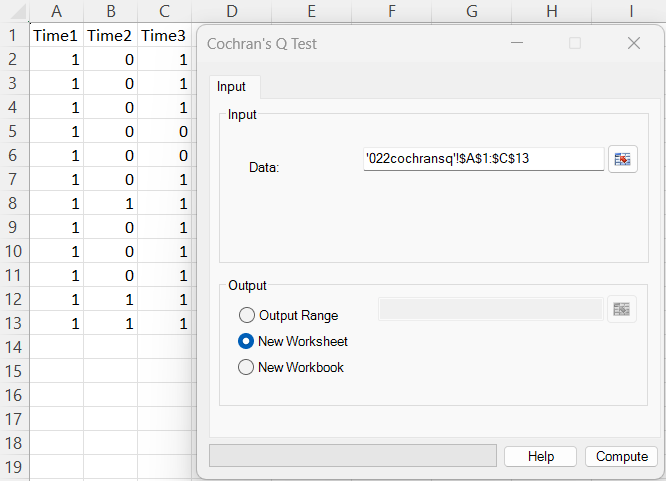
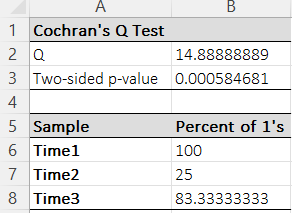

# Cochran's Q Test

**Includes:** Cochran’s Q, Percent of 1’s per condition.  
**Purpose:** Test whether **matched binary outcomes** (0/1) have the same proportion of “success” across **k ≥ 3** related conditions (an extension of **McNemar’s test**).

---

## Overview

Cochran’s Q test is the binary-outcome analogue of the Friedman test:

- **Friedman**: repeated-measures test for **ordinal/continuous** outcomes (ranks within each block).
- **Cochran’s Q**: repeated-measures test for **binary** outcomes (0/1), testing whether the success rates differ across conditions.

BESHStatNG reports:

- the **Q** test statistic,
- the **two-sided p-value** (chi-square approximation, df = k − 1),
- and the **percent of 1’s** in each column (condition).

---

## Example dataset

Download the CSV used in the screenshots:

- [022cochransq.csv](../assets/data/022cochransq/022cochransq.csv)

The dataset is in **wide format** (each column is a condition/time point):

- Time1, Time2, Time3

Each row is one subject/block with a binary response in each condition.

---

## Screenshots (BESHStatNG)

### Input


### Results


---

## When to use it

Use Cochran’s Q when:

- you have **k ≥ 3** related measurements per subject (repeated measures / matched sets),
- the response is **binary** (coded as 0/1),
- you want to test whether the **proportion of 1’s** differs across the conditions.

Key requirements / considerations:

- **Matched blocks:** rows represent subjects/blocks; the comparison is within rows.
- **Independence of blocks:** different rows (subjects) are independent.
- **Binary coding:** values should be 0/1. (If you have “Yes/No”, recode to 1/0 first.)

If your outcome is not binary, use:

- **Friedman Test** for ordinal/continuous repeated measures, or
- **Skillings–Mack Test** for incomplete block designs (missing values).

---

## Inputs in Excel

- **Data:** Select a rectangular range containing all conditions (columns) and subjects (rows).  
  Each column is one condition; each row is one subject/block.

### Missing values
Rows with missing / non-numeric cells in any condition are excluded (only complete blocks are analyzed).

### Output destination
- Output range (current sheet)
- New worksheet
- New workbook

---

## Steps in the add-in

1. In Excel ribbon: **BESH Stat NG → Analyse → Nonparametric → Cochran's Q Test**
2. Select the **Data** range (all conditions/columns).
3. Choose an output location.
4. Click **Compute**.

---

## Output and how to read it

BESHStatNG writes:

### Cochran’s Q table
- **Q**: the Cochran’s Q test statistic
- **Two-sided p-value**: chi-square approximation with df = \(k-1\)

**Example interpretation (from the screenshot):**

- \(Q = 14.8889\), p = 0.000585 (df = 2)
- Conclusion: strong evidence that at least one condition has a different success proportion than the others.

### Percent of 1’s per condition
For each column, BESHStatNG reports:

\[
\%\;1\text{s} = 100 \cdot \frac{C_j}{n}
\]

where \(C_j\) is the column total (number of 1’s) and \(n\) is the number of subjects (rows).

This is an effect-size style summary to help interpret which conditions are higher/lower.

---

## What it does (math and implementation details)

Let:

- \(n\) = number of subjects/blocks (rows)
- \(k\) = number of conditions (columns)
- \(x_{ij} \in \{0,1\}\) = response for subject \(i\) in condition \(j\)

Define:

- Column totals \(C_j = \sum_{i=1}^{n} x_{ij}\)
- Row totals \(R_i = \sum_{j=1}^{k} x_{ij}\)
- Total \(T = \sum_{j=1}^{k} C_j = \sum_{i=1}^{n} R_i\)

### Cochran’s Q statistic

\[
Q = (k-1)\,\frac{k\sum_{j=1}^{k} C_j^2 - T^2}{kT - \sum_{i=1}^{n} R_i^2}
\]

Under \(H_0\) (all conditions have the same success probability), \(Q\) is approximately chi-square distributed:

\[
Q \;\dot\sim\; \chi^2_{k-1}
\qquad\Rightarrow\qquad
p = 1 - F_{\chi^2(k-1)}(Q)
\]

---

## Relation to other nonparametric tests

- **McNemar’s test (k = 2):** Cochran’s Q reduces to McNemar’s matched-pairs test when there are exactly two conditions.
- **Friedman test:** Cochran’s Q plays a similar role for binary data as Friedman does for ordinal/continuous repeated measures.  
  If your values are not 0/1, Friedman is usually the correct choice.

---

## R code (reference using standard R functions)

### Using DescTools (direct wide-format input)

```r
# Cochran's Q example (wide format)
dat <- read.csv("022cochransq.csv")

# Ensure a numeric matrix with 0/1 values
X <- as.matrix(dat)

# DescTools provides CochranQTest()
# install.packages("DescTools")
library(DescTools)

res <- CochranQTest(X)
res
```

### Using rstatix (long-format workflow)

```r
# install.packages("rstatix")
library(rstatix)
library(tidyr)
library(dplyr)

dat <- read.csv("022cochransq.csv")

long <- dat %>%
  mutate(id = row_number()) %>%
  pivot_longer(cols = -id, names_to = "time", values_to = "y")

res <- long %>%
  cochran_qtest(y ~ time | id)
res
```

### Why R results may differ slightly from BESHStatNG

Most implementations (including `DescTools::CochranQTest`) use the same \(Q\) formula and chi-square approximation, so results typically match exactly.

If you see differences, the most common reasons are:

- **Row exclusion rules:** ensure both tools use the same set of complete rows (no missing values).
- **Coding differences:** confirm values are coded as 0/1 (not TRUE/FALSE or text).

---

## Notes

- Cochran’s Q is an **omnibus** test: a significant result indicates at least one condition differs, but it does not identify which pairs differ.
- If you need pairwise follow-up comparisons for binary repeated measures, consider:
  - pairwise **McNemar** tests with multiplicity correction, or
  - a **GEE logistic model** for a model-based approach (especially with covariates).

---

## See also

- [Friedman Test](friedman-test.md)
- [Skillings–Mack Test](skillings-mack-test.md)
- [Proportions](proportions.md)
- [Home](../index.md)
