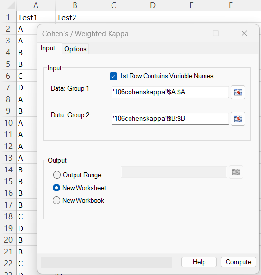
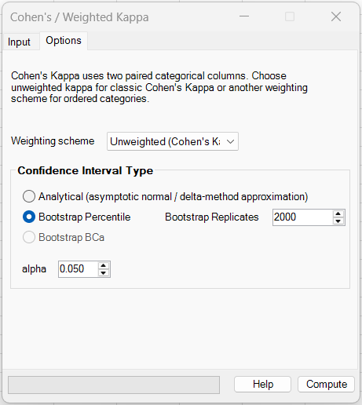
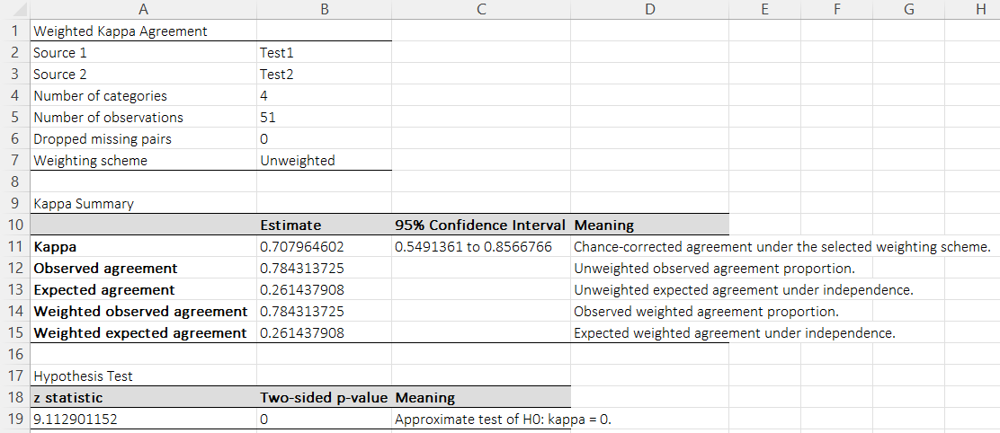
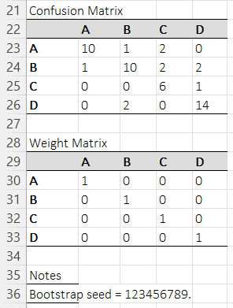

# Cohen's / Weighted Kappa

**Includes:** Unweighted Cohen's kappa, linear weighted kappa, quadratic weighted kappa, Cicchetti–Allison and Fleiss–Cohen weighting schemes, analytical, jackknife, and bootstrap confidence intervals, approximate hypothesis test of \(H_0: \kappa = 0\), confusion matrix, and weight-matrix output.  
**Purpose:** Use when **two paired categorical ratings** are assigned to the same items and you want a **chance-corrected measure of agreement**.

---

## Overview

Cohen's kappa quantifies agreement between two raters, methods, or classification systems after correcting for the agreement that would be expected **by chance** from the marginal category frequencies.

For two raters classifying the same \(n\) items into \(k\) categories, let:

- \(p_{ij}\) be the observed proportion in row \(i\), column \(j\)
- \(p_{i+}\) and \(p_{+j}\) be the row and column marginals

The **unweighted** Cohen's kappa is:

$$
\kappa = \frac{P_o - P_e}{1 - P_e}
$$

where:

$$
P_o = \sum_{i=1}^{k} p_{ii}
$$

is the observed agreement proportion, and

$$
P_e = \sum_{i=1}^{k} p_{i+} p_{+i}
$$

is the expected agreement under independence.

The **weighted** form generalizes this by rewarding near-agreement more than distant disagreement when categories are ordered:

$$
\kappa_w = \frac{P_o^{(w)} - P_e^{(w)}}{1 - P_e^{(w)}}
$$

with

$$
P_o^{(w)} = \sum_{i=1}^{k} \sum_{j=1}^{k} w_{ij} p_{ij}
$$

and

$$
P_e^{(w)} = \sum_{i=1}^{k} \sum_{j=1}^{k} w_{ij} p_{i+} p_{+j}
$$

where \(w_{ij}\) is the agreement weight assigned to the \((i,j)\) cell.

> **Important:** Correlation and kappa answer different questions. Correlation is not a substitute for agreement when data are categorical.

---

## Input

### Data: Group 1
Select the range containing ratings from the first rater, method, or classification system.

### Data: Group 2
Select the range containing ratings from the second rater, method, or classification system.

The two inputs must:

- contain the same number of rows,
- represent paired observations of the **same items**, and
- be aligned row-by-row.

### 1st Row Contains Variable Names
If checked, the first row is treated as the variable names and excluded from the analysis.

Any row with a missing value in either input is dropped before analysis. The number of dropped pairs is reported in the output.

---

## Options

### Weighting scheme

The current GUI exposes the following weighting schemes:

#### Unweighted (Cohen's Kappa)
Use when categories are **nominal** and all disagreements should be treated equally.

Agreement weights:

$$
w_{ij} = \begin{cases}
1 & i=j \\
0 & i \neq j
\end{cases}
$$

This yields the classical Cohen's kappa.

#### Linear
Use when categories are **ordered** and disagreement severity should increase linearly with distance between categories.

$$
w_{ij} = 1 - \frac{|i-j|}{k-1}
$$

#### Quadratic
Use when categories are **ordered** and large disagreements should be penalized much more strongly than adjacent disagreements.

$$
w_{ij} = 1 - \left(\frac{|i-j|}{k-1}\right)^2
$$

Quadratic weighting often gives values closer to intraclass-correlation-style agreement for ordinal scales.

#### Cicchetti–Allison
In the current BESH Stat NG implementation this is treated as a **linear weighted** scheme for ordered categories.

Use when you want a standard linear ordinal-agreement weighting convention.

#### Fleiss–Cohen
In the current BESH Stat NG implementation this is treated as a **quadratic weighted** scheme for ordered categories.

Use when you want the classic quadratic ordinal weighting convention.

> **Ordering matters for weighted kappa.**  
> The order of categories is taken from the order encountered in the data (or from an explicitly supplied category order in the back-end API). If your categories are ordinal, make sure the worksheet order reflects the intended ordinal progression.

---

### Confidence Interval Type

The current UI provides four choices.

#### 1) Analytical
This is the fastest option.

The current implementation uses an **asymptotic normal / delta-method approximation** based on the multinomial cell probabilities of the confusion matrix.

Confidence intervals are reported as:

$$
\hat\kappa \pm z_{1-\alpha/2} \cdot SE(\hat\kappa)
$$

where \(SE(\hat\kappa)\) is obtained from a first-order delta-method approximation.

Use this when:

- the sample size is moderate to large,
- speed matters,
- you want a standard asymptotic interval.

#### 2) Jackknife
The add-in:

1. leaves out one paired row at a time,
2. recomputes kappa for each leave-one-out sample,
3. estimates the jackknife standard error from the leave-one-out distribution,
4. forms a t-based confidence interval around the observed kappa estimate.

Use this when:

- you want a non-bootstrap resampling interval,
- the sample size is moderate,
- you want a resampling-based alternative to the asymptotic delta-method interval.

#### 3) Bootstrap Percentile
The add-in:

1. resamples paired rows with replacement,
2. refits the kappa statistic in each bootstrap sample,
3. forms percentile intervals from the bootstrap distribution.

Use this when:

- the sample size is not large,
- marginal distributions are uneven,
- you want an interval less dependent on asymptotic approximations.

#### 4) Bootstrap BCa
The UI exposes a BCa option.

The add-in:

1. resamples paired rows with replacement,
2. recomputes kappa in each bootstrap sample,
3. uses jackknife leave-one-out estimates to obtain the BCa acceleration term,
4. forms a **bias-corrected and accelerated (BCa)** interval.

Use this when:

- you want a bootstrap interval that adjusts for bias and skewness,
- the category distribution is uneven,
- you want a more refined bootstrap CI than the simple percentile interval.

### Bootstrap seed and reproducibility

In the Excel GUI, **Cohen’s / Weighted Kappa** does not expose a dedicated seed input for bootstrap confidence intervals.

Therefore the bootstrap seed is resolved as follows:

1. use the **Global Settings → Default Random Seed**, if it has been set;
2. otherwise use a **time-based seed**.

When bootstrap confidence intervals are used, the notes report the actual seed that was used, for example:

- `Bootstrap seed = 123456789.`

This makes the bootstrap interval reproducible when the same data, weighting scheme, and settings are used.

!!! tip
    Set **Default Random Seed** in **Global Settings** if you want reproducible bootstrap kappa intervals across sessions.

---

### Alpha
The two-sided significance level \(\alpha\) used for confidence intervals.

Default:

```text
0.050
```

which corresponds to a 95% confidence interval.

---

## Steps in the add-in

1. Ribbon: **BESH Stat NG → Analyse → Agreement → Cohen's / Weighted Kappa**
2. Select the two paired categorical columns.
3. Choose the **Weighting scheme**.
4. Choose the **Confidence Interval Type** and set \(\alpha\).  
   If you choose **Bootstrap Percentile** or **Bootstrap BCa**, also set the number of bootstrap replicates.
5. Click **Compute**.

---

## Screenshots

### Input dialog



### Options tab



### Results





---

## Method and mathematics

## Confusion matrix

Let \(n_{ij}\) denote the number of items assigned to category \(i\) by source 1 and category \(j\) by source 2.

The confusion matrix is converted to proportions:

$$
p_{ij} = \frac{n_{ij}}{n}
$$

with row and column marginals:

$$
p_{i+} = \sum_j p_{ij}, \qquad p_{+j} = \sum_i p_{ij}
$$

### Unweighted kappa

$$
P_o = \sum_i p_{ii}
$$

$$
P_e = \sum_i p_{i+}p_{+i}
$$

$$
\kappa = \frac{P_o-P_e}{1-P_e}
$$

### Weighted kappa

For an agreement weight matrix \(W = (w_{ij})\):

$$
P_o^{(w)} = \sum_i\sum_j w_{ij}p_{ij}
$$

$$
P_e^{(w)} = \sum_i\sum_j w_{ij}p_{i+}p_{+j}
$$

$$
\kappa_w = \frac{P_o^{(w)}-P_e^{(w)}}{1-P_e^{(w)}}
$$

In this add-in, the weights are **agreement weights**, where larger values mean greater agreement.

---

## Hypothesis test

The output includes an approximate two-sided test of:

$$
H_0: \kappa = 0
$$

using:

$$
z = \frac{\hat\kappa}{SE(\hat\kappa)}
$$

and the two-sided p-value from the standard normal distribution.

This is reported as an **approximate hypothesis test**.

---

## Output and interpretation

The output includes:

- weighted kappa estimate,
- confidence interval,
- observed agreement,
- expected agreement,
- weighted observed agreement,
- weighted expected agreement,
- approximate z test and p-value,
- confusion matrix,
- weight matrix,
- notes (including bootstrap or jackknife run details when resampling is used).

### Interpretation of the main quantities

#### Kappa
The kappa estimate is the primary chance-corrected agreement measure.

- \(\kappa = 1\): perfect agreement
- \(\kappa = 0\): agreement no better than chance, given the marginals
- \(\kappa < 0\): worse-than-chance agreement

#### Observed agreement
The raw proportion of exact agreement.

This is easy to understand, but it does **not** adjust for chance agreement.

#### Expected agreement
The agreement expected if the two sources were independent but preserved their marginal category frequencies.

Large marginal imbalance can substantially increase \(P_e\), which lowers kappa even when observed agreement seems high.

#### Weighted observed / expected agreement
These are the weighted analogues of observed and expected agreement.

They matter especially for ordinal categories, where a disagreement of one category should not be treated the same as a disagreement of three categories.

---

## Example data

The attached example file: [106cohenskappa.csv](../assets/data/106cohenskappa/106cohenskappa.csv)

contains two paired categorical columns:

- `Test1`
- `Test2`

with 51 paired observations and four categories: `A`, `B`, `C`, `D`.

The corresponding confusion matrix is:

| Test1 \ Test2 | A | B | C | D |
|---|---:|---:|---:|---:|
| **A** | 10 | 1 | 2 | 0 |
| **B** | 1 | 10 | 2 | 2 |
| **C** | 0 | 0 | 6 | 1 |
| **D** | 0 | 2 | 0 | 14 |

For the **unweighted** example shown in the screenshots, the main results are:

- Observed agreement:
$$
P_o = \frac{10+10+6+14}{51} = 0.7843137
$$

- Expected agreement:
$$
P_e = 0.2614379
$$

- Cohen's kappa:
$$
\kappa = \frac{0.7843137 - 0.2614379}{1 - 0.2614379} = 0.7079646
$$

This matches the worksheet output.

---

## Choosing options in practice

### When should I use unweighted kappa?
Use **unweighted** kappa when categories are **nominal** and there is no meaningful distance between them.

Examples:

- blood type categories,
- color labels,
- diagnosis categories with no ordinal structure.

### When should I use weighted kappa?
Use **weighted** kappa when categories are **ordinal**.

Examples:

- disease severity grades,
- questionnaire scores,
- staging scales,
- ordered quality categories.

### Linear vs quadratic weighting

Use **linear** weights when:

- each step away from the diagonal should reduce agreement proportionally,
- adjacent disagreements are meaningfully different from distant disagreements but not extremely so.

Use **quadratic** weights when:

- large disagreements should be penalized much more strongly,
- categories behave more like a near-continuous ordinal scale.

### Analytical vs bootstrap confidence intervals

Use **Analytical** when:

- you have a moderate or large sample,
- you want fast results,
- you want a standard asymptotic interval.

Use **Bootstrap Percentile** when:

- sample size is limited,
- category marginals are highly unbalanced,
- you want a more data-driven interval.

Use **Jackknife** when:

- you want a resampling-based interval without bootstrap sampling,
- you want the interval to depend on systematic leave-one-out perturbations of the paired ratings,
- you want a middle ground between the asymptotic analytical interval and full bootstrap resampling.

---

## Reference R code

### 1) Unweighted Cohen's kappa from paired ratings

```r
library(irr)

d <- read.csv("106cohenskappa.csv")

# Nominal ratings
irr::kappa2(d, weight = "unweighted")
```

### 2) Linear and quadratic weighted kappa

For ordinal ratings, first ensure that the category order is the intended ordinal order:

```r
library(irr)

d <- read.csv("106cohenskappa.csv")
d$Test1 <- factor(d$Test1, levels = c("A","B","C","D"), ordered = TRUE)
d$Test2 <- factor(d$Test2, levels = c("A","B","C","D"), ordered = TRUE)

# Linear / equal-spacing weights
irr::kappa2(d, weight = "equal")

# Quadratic weights
irr::kappa2(d, weight = "squared")
```

> Exact numerical agreement across packages may differ slightly because software differs in:
>
> - the weight convention used,
> - the category ordering,
> - the variance formula,
> - whether table-based or row-based calculations are used.

---

## Limitations

- Kappa depends on the marginal category distributions and can be reduced even when observed agreement is high.
- Weighted kappa requires a meaningful and correct category order.
- The analytical CI is asymptotic and may be less reliable in small samples or with sparse tables.
- Interpretation rules such as “slight / fair / moderate / substantial / almost perfect” are heuristics, not universal scientific standards.

---

## Expected discrepancies vs other software

You may see differences relative to R, SPSS, MedCalc, SAS, Stata, `irr`, `psych`, `vcd`, or other kappa implementations because of differences in:

1. **Category ordering**  
   Weighted kappa depends on the order of categories. If different software sorts factor levels differently, weighted results can change.

2. **Weight convention**  
   Some software defines weights as agreement weights, others as disagreement costs. The formulas are algebraically related but must be interpreted carefully.

3. **Linear vs Cicchetti–Allison, quadratic vs Fleiss–Cohen naming**  
   Different packages use slightly different labels for essentially the same ordinal weighting families.

4. **Variance and CI formulas**  
   Analytical intervals may differ because of the precise asymptotic variance approximation used.

5. **Bootstrap implementation details**  
   Bootstrap confidence intervals may differ slightly because of random seed handling, resampling strategy, percentile interpolation, and software-specific defaults.

6. **Missing-data handling**  
   The add-in uses pairwise complete-case filtering for paired raw ratings.

---

## Interpreting magnitude: use with caution

A common heuristic table sometimes used in applied work is:

| Kappa | Informal label |
|---:|---|
| < 0.00 | Less than chance |
| 0.00–0.20 | Slight |
| 0.21–0.40 | Fair |
| 0.41–0.60 | Moderate |
| 0.61–0.80 | Substantial |
| 0.81–1.00 | Almost perfect |

These labels are **not universally recommended**. They can be misleading when prevalence is highly unbalanced or when the scientific consequences of disagreement are context-specific.

Prefer to report:

- the confusion matrix,
- kappa,
- the confidence interval,
- the weighting scheme,
- and the study context.

---

## References

- Cohen, J. (1960). A coefficient of agreement for nominal scales. *Educational and Psychological Measurement*, 20(1), 37–46.
- Cohen, J. (1968). Weighted kappa: Nominal scale agreement with provision for scaled disagreement or partial credit. *Psychological Bulletin*, 70(4), 213–220.
- Fleiss, J. L., Cohen, J., & Everitt, B. S. (1969). Large sample standard errors of kappa and weighted kappa. *Psychological Bulletin*, 72(5), 323–327.
- Fleiss, J. L., Levin, B., & Paik, M. C. (2003). *Statistical Methods for Rates and Proportions* (3rd ed.). Wiley.
- Sim, J., & Wright, C. C. (2005). The kappa statistic in reliability studies: use, interpretation, and sample size requirements. *Physical Therapy*, 85(3), 257–268.
- Gwet, K. L. (2014). *Handbook of Inter-Rater Reliability* (4th ed.). Advanced Analytics.

---

## See also

- [2x2 Table](2x2-table.md)
- [RxC Table](rxc-table.md)
- [Intraclass Correlation Coefficients](intraclass-correlation-coefficients.md)
- [Lin's Concordance Correlation Coefficient](lins-ccc.md)
- [Bland–Altman Plot](bland-altman.md)
- [Resampling in BESH Stat NG](resampling.md)
- [Home](../index.md)
