# Control Charts

**Includes:** Individuals, moving-range, I–MR, X-bar, R, S, X-bar–R, X-bar–S, p, np, c, u, CUSUM, EWMA, and moving-average charts; Phase I and Phase II stages; historical or stage-specific limits; wide and stacked subgroup layouts; exact probability limits for attribute charts; special-cause rule presets and custom rules; explicit exclusions; specification and target lines; detailed chart data, signals, settings, and audit output.  
**Purpose:** Monitor an ordered process over time, distinguish common-cause variation from evidence of special causes, and preserve an auditable record of the data, limits, stages, exclusions, and signal rules used.

---

## Overview

A **control chart** plots an ordered process statistic together with a centre line and statistically calculated control limits. Its main purpose is to identify changes that are unlikely to be explained by the process's established common-cause variation alone.

BESHStatNG separates two related tasks:

- **Phase I — establish the model:** use an appropriate baseline period to estimate the process centre and variation, after investigating known special causes;
- **Phase II — monitor the process:** compare later observations with limits frozen from a Phase I reference stage or supplied historical parameters.

The dialog supports variable measurements, counts, rational subgroups, individual sequences, and time-weighted charts. It can also define several contiguous process stages, reuse limits from an earlier reference stage, exclude identified observations from estimation and/or rule evaluation, and report every choice in a new output workbook.

!!! important "Control limits are not specification limits"
    Control limits describe expected process behaviour under the fitted statistical model. Specification limits describe external requirements or tolerances. A stable process can fail specifications, and an unstable process can temporarily remain within specifications. BESHStatNG reports specification values separately and never uses them to calculate control limits.

---

## Choosing a chart

### Shewhart charts for variables

Use these charts for quantitative measurements such as temperature, pressure, concentration, weight, or dimension.

| Chart | Data structure | What it monitors | Typical use |
|---|---|---|---|
| **Individuals** | One ordered measurement per point | Process location | Only one observation is available at each time |
| **Moving Range** | One ordered measurement per point | Short-term variation between consecutive observations | Companion dispersion chart for individual data |
| **Individuals–Moving Range** | One ordered measurement per point | Location and short-term variation in two aligned panels | Standard choice for individual observations |
| **X-bar** | Rational subgroups | Subgroup means | Monitor process location when repeated measurements are collected under similar conditions |
| **Range** | Rational subgroups | Within-subgroup range | Simple dispersion monitoring, especially for small subgroups |
| **Standard Deviation** | Rational subgroups | Within-subgroup standard deviation | Dispersion monitoring when the subgroup standard deviation is preferred |
| **X-bar–R** | Rational subgroups | Subgroup mean and range in two aligned panels | Common location-and-dispersion chart for smaller subgroups |
| **X-bar–S** | Rational subgroups | Subgroup mean and standard deviation in two aligned panels | Common location-and-dispersion chart for moderate or larger subgroups |

The observations inside a rational subgroup should be produced close together under comparable conditions. The subgroup should represent short-term common-cause variation, not an arbitrary collection assembled only to obtain a desired sample size.

### Shewhart charts for attributes

Use these charts for counts of nonconforming items or defects.

| Chart | Plotted statistic | Required columns | Sample size or opportunity |
|---|---|---|---|
| **p** | Proportion nonconforming, \(d_i/n_i\) | Nonconforming count and sample size | May vary between samples |
| **np** | Number nonconforming, \(d_i\) | Nonconforming count and sample size | Must be constant |
| **c** | Number of defects, \(c_i\) | Defect count | Inspection area/opportunity is assumed constant |
| **u** | Defects per unit, \(c_i/e_i\) | Defect count and exposure/opportunities | May vary between samples |

An item is **nonconforming** when it fails as a unit; an item may contain more than one **defect**. Choose p/np for nonconforming items and c/u for defect counts.

### Time-weighted charts

Use these charts with one ordered numeric sequence when smaller sustained shifts are more important than isolated large shifts.

| Chart | What it accumulates | Main design settings |
|---|---|---|
| **CUSUM** | Standardized positive and negative cumulative sums | Reference value \(k\), decision interval \(h\), and optional head start |
| **EWMA** | Exponentially weighted mean of current and previous observations | Smoothing constant \(\lambda\) and optional steady-state limits |
| **Moving Average** | Arithmetic mean of the latest observations | Window span |

Time-weighted charts report their own intrinsic decision-limit signals. The Shewhart rule presets are therefore disabled for these charts.

---

## Example dataset

Download the data used in the dialog screenshots and worked examples:

- [115controlcharts.csv](../assets/data/115controlcharts/115controlcharts.csv)

The file contains **60 ordered samples**:

- points 1–30 form a stable **Baseline** stage in Phase I;
- points 31–60 form a shifted **Monitoring** stage in Phase II;
- point 18 is marked as a known temporary setup adjustment;
- alternative columns include a missing individual value at point 24 and a missing fifth subgroup measurement at point 25, so the missing-value options can be tested safely without changing the main examples.

Important columns are:

| Column(s) | Contents | Example use |
|---|---|---|
| `Point`, `Sample_Label`, `Sequence` | Point number, display label, and order | Optional chart metadata |
| `Stage`, `Phase` | Baseline/Monitoring and Phase I/II assignments | Build stages from worksheet columns |
| `Exclude`, `Exclusion_Reason` | Exclusion indicator and explanation | Exclude point 18 from estimation and rules |
| `Individual_Value` | One measurement per sample | EWMA and other individual charts |
| `Individual_Value_Missing` | Individual series with one blank | Test missing-value handling |
| `Subgroup_ID`, `Stacked_Value` | Long-format subgroup data | Stacked subgroup layout |
| `Measure_1` to `Measure_5` | Five measurements per sample | Wide subgroup layout |
| `Measure_5_With_Missing` | Alternative fifth measurement with one blank | Test subgroup missing-value handling |
| `Nonconforming_Count` | Number of nonconforming items | p or np chart count |
| `Sample_Size` | Varying sample size | p chart denominator |
| `Sample_Size_Constant` | Constant sample size | np chart denominator |
| `Exposure` | Varying inspection exposure/opportunities | u chart denominator |

The three supplied result workbooks can be downloaded here:

- [115controlcharts_output1.xlsx](../assets/data/115controlcharts/115controlcharts_output1.xlsx) — X-bar–R example
- [115controlcharts_output2.xlsx](../assets/data/115controlcharts/115controlcharts_output2.xlsx) — EWMA example
- [115controlcharts_output3.xlsx](../assets/data/115controlcharts/115controlcharts_output3.xlsx) — p-chart example

---

## Worked example 1: X-bar–R chart

This example monitors the location and dispersion of five measurements collected within every sample.

### Chart and Data

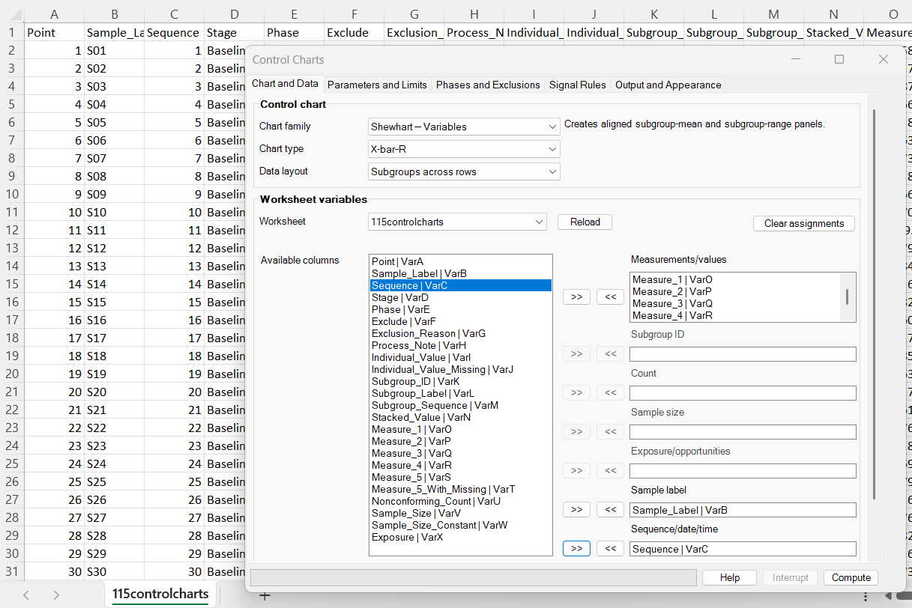

Use:

| Setting | Value |
|---|---|
| Chart family | **Shewhart — Variables** |
| Chart type | **X-bar–R** |
| Data layout | **Subgroups across rows** |
| Measurements/values | `Measure_1` through `Measure_5` |
| Sample label | `Sample_Label` |
| Sequence/date/time | `Sequence` |

Each worksheet row becomes one chart point with subgroup size \(n=5\).

### Parameters and Limits

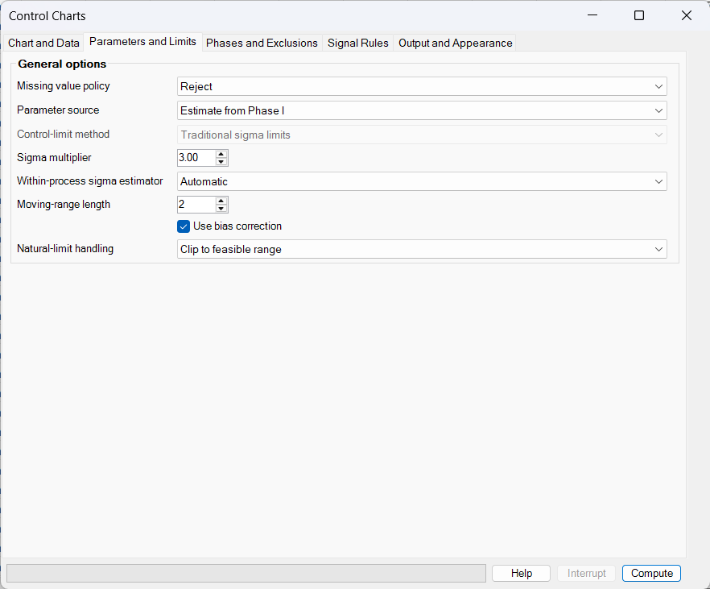

Use the settings shown in the screenshot:

| Setting | Value |
|---|---|
| Missing value policy | **Reject** |
| Parameter source | **Estimate from Phase I** |
| Sigma multiplier | `3.00` |
| Within-process sigma estimator | **Automatic** |
| Moving-range length | `2` |
| Use bias correction | Selected |
| Natural-limit handling | **Clip to feasible range** |

For X-bar–R, **Automatic** selects the average-range estimator with the appropriate \(d_2\) bias correction.

### Phases and Exclusions

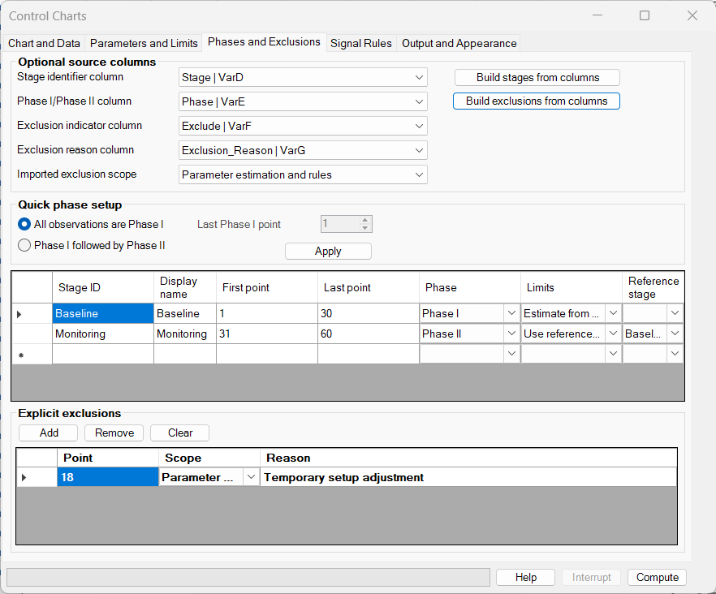

Select `Stage`, `Phase`, `Exclude`, and `Exclusion_Reason` as the optional source columns, then click **Build stages from columns** and **Build exclusions from columns**. The resulting definitions are:

| Stage | Points | Phase | Limits |
|---|---:|---|---|
| Baseline | 1–30 | Phase I | Estimate from stage data |
| Monitoring | 31–60 | Phase II | Use reference stage: Baseline |

Point 18 is excluded from **parameter estimation and rules** because it represents a known temporary setup adjustment. It remains in the chart and audit output.

### Signal Rules

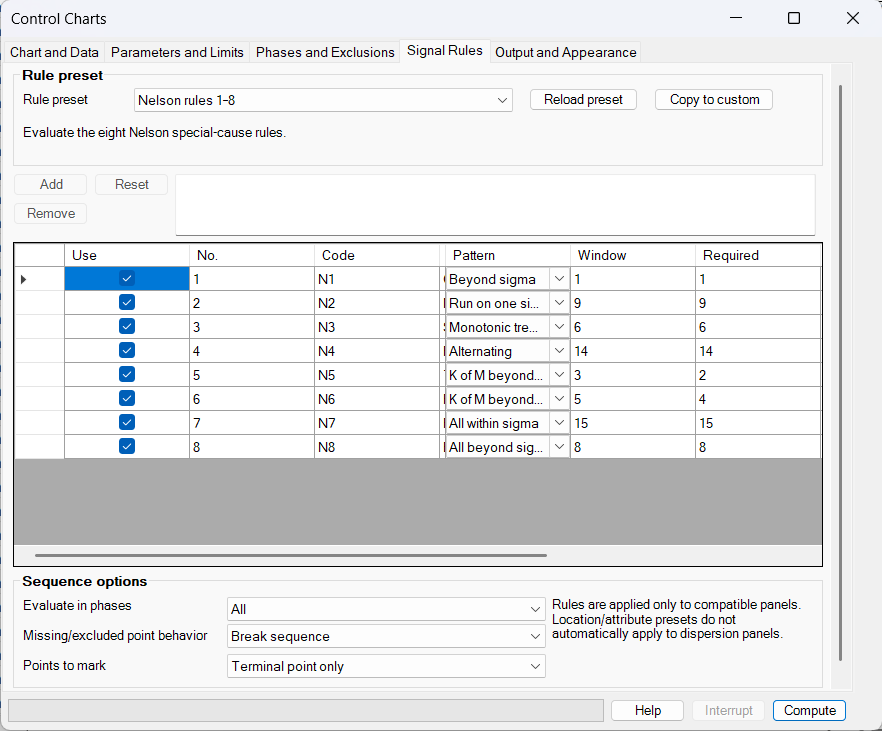

Use:

| Setting | Value |
|---|---|
| Rule preset | **Nelson rules 1–8** |
| Evaluate in phases | **All** |
| Missing/excluded point behavior | **Break sequence** |
| Points to mark | **Terminal point only** |

The Nelson location rules apply to the X-bar panel. Rule 1 also applies to the range panel, but the location-oriented run and zone rules do not automatically apply to dispersion panels.

### Output and Appearance

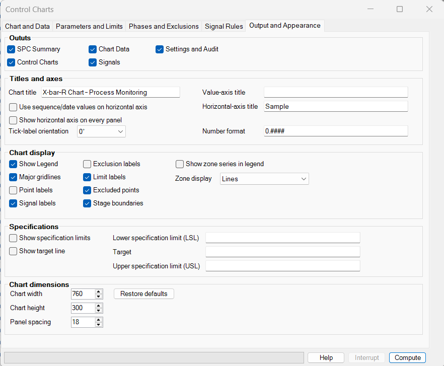

Keep all five outputs selected and enter the chart title **X-bar–R Chart – Process Monitoring**. The example uses zone lines, signal labels, limit labels, excluded points, and stage boundaries.

### Expected results

The output workbook should report:

| Result | Expected value |
|---|---:|
| Phase I subgroups used to estimate the X-bar model | 29 |
| Estimated process mean | 50.01124 |
| Estimated within-process sigma | 0.22830 |
| X-bar signalled points | 30 |
| Range signalled points | 0 |
| Total Nelson-rule occurrences | 106 |
| Warnings | 0 |

All 30 Phase II subgroup means are above the frozen baseline limits. Point 42 is the largest shift. The range panel remains stable, indicating that this example was constructed mainly as a location shift rather than an increase in within-subgroup dispersion.

The **106 occurrences** are not 106 distinct bad samples. Several Nelson rules can signal at the same terminal point, and overlapping windows generate separate occurrences. The summary therefore also reports **30 signalled panel points**.

---

## Worked example 2: EWMA chart

This example uses the individual measurement series to demonstrate detection of a sustained upward shift.

### Chart and Data

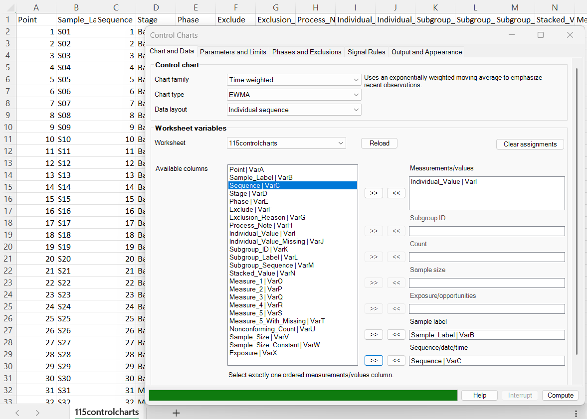

| Setting | Value |
|---|---|
| Chart family | **Time-weighted** |
| Chart type | **EWMA** |
| Data layout | **Individual sequence** |
| Measurements/values | `Individual_Value` |
| Sample label | `Sample_Label` |
| Sequence/date/time | `Sequence` |

### Parameters and Limits

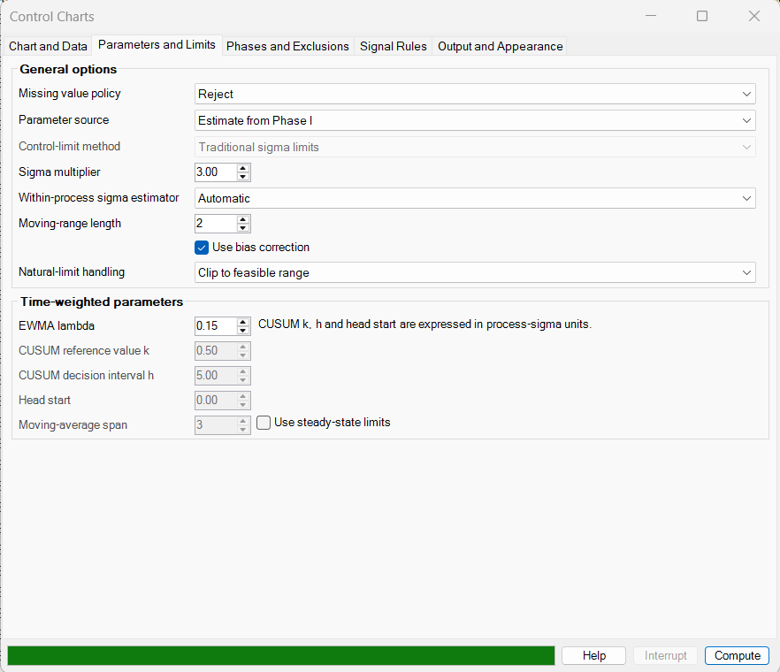

Use the general settings from example 1, change **EWMA lambda** to `0.15`, and leave **Use steady-state limits** cleared. The limits therefore widen during startup and approach their steady-state values gradually.

With \(\lambda=0.15\), each new observation receives 15% of the current EWMA weight. Smaller values of \(\lambda\) provide more smoothing and usually improve sensitivity to smaller persistent shifts, but react more slowly to isolated changes.

### Phases and Exclusions

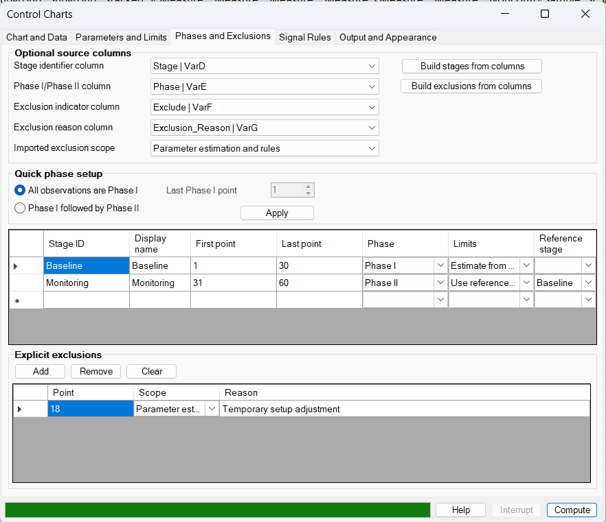

Use the same Baseline and Monitoring stages and the same point-18 exclusion as in example 1.

### Signal Rules

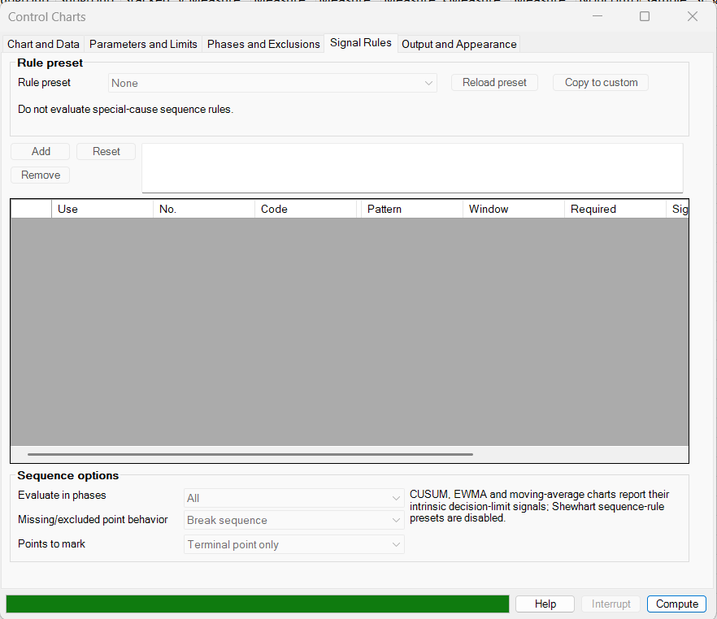

The rule preset is automatically set to **None** because EWMA uses its own control-limit signal. Keep **Break sequence** as the missing/excluded point behaviour. At a rule-excluded point, this setting resets the recursion before the next eligible point; **Skip point and continue** would retain the pre-exclusion EWMA state.

### Output and Appearance

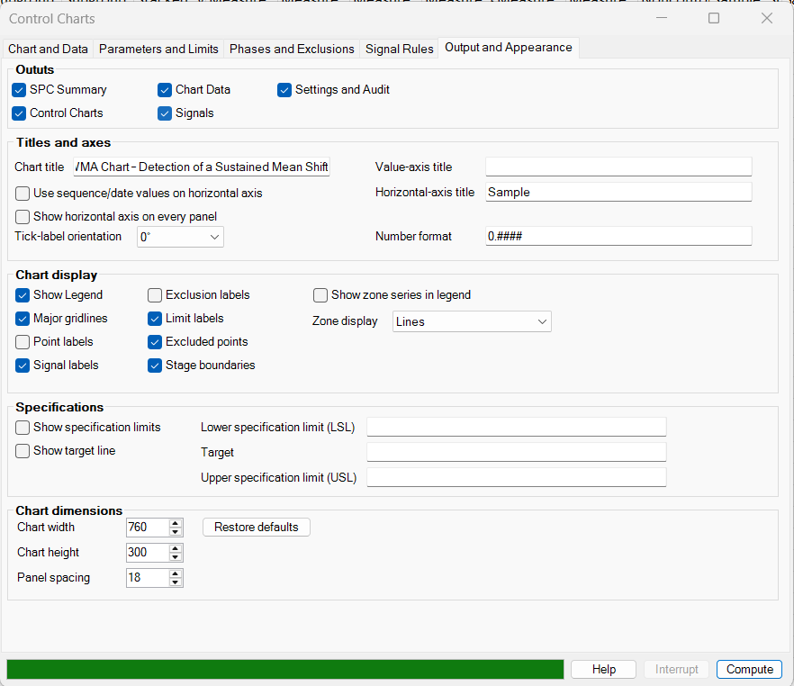

Enter the title **EWMA Chart – Detection of a Sustained Mean Shift** and keep all outputs selected.

### Expected results

| Result | Expected value |
|---|---:|
| Phase I observations used to estimate the mean | 29 |
| Estimated process mean | 50.01276 |
| Estimated within-process sigma | 0.18650 |
| EWMA lambda | 0.15 |
| First Phase II signal | Point 34 (`S34`) |
| Signalled points | 27 |
| Warnings | 0 |

The first three Phase II EWMAs remain inside their startup limits. The accumulated evidence becomes sufficient at point 34, after which points 34–60 remain above the upper limit. This illustrates why EWMA can detect a sustained shift without applying supplementary Shewhart run rules.

Point 18 has the largest isolated Phase I measurement, but it is explicitly excluded from estimation and signal evaluation. It remains visible as an excluded point and is recorded in **Settings and Audit**.

---

## Worked example 3: p chart with varying sample size

This example monitors the proportion of nonconforming items when the number inspected changes between samples.

### Chart and Data

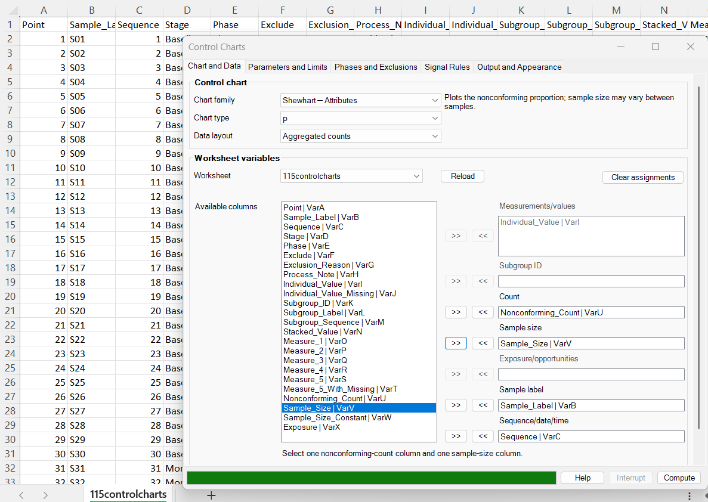

| Setting | Value |
|---|---|
| Chart family | **Shewhart — Attributes** |
| Chart type | **p** |
| Data layout | **Aggregated counts** |
| Count | `Nonconforming_Count` |
| Sample size | `Sample_Size` |
| Sample label | `Sample_Label` |
| Sequence/date/time | `Sequence` |

### Parameters and Limits

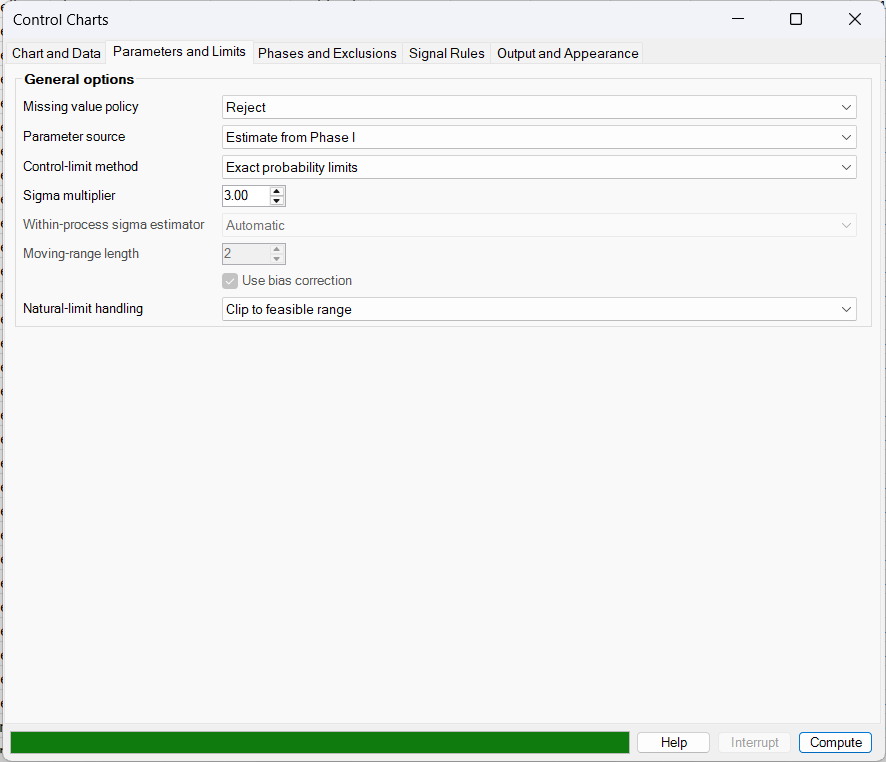

Use:

| Setting | Value |
|---|---|
| Missing value policy | **Reject** |
| Parameter source | **Estimate from Phase I** |
| Control-limit method | **Exact probability limits** |
| Sigma multiplier | `3.00` |
| Natural-limit handling | **Clip to feasible range** |

The sigma multiplier determines the two-tailed probability coverage, but the displayed limits are binomial quantiles. They therefore change in discrete steps and need not equal \(\bar p\pm3\sqrt{\bar p(1-\bar p)/n_i}\). One- and two-sigma zone lines are omitted for exact discrete limits.

### Phases and Exclusions

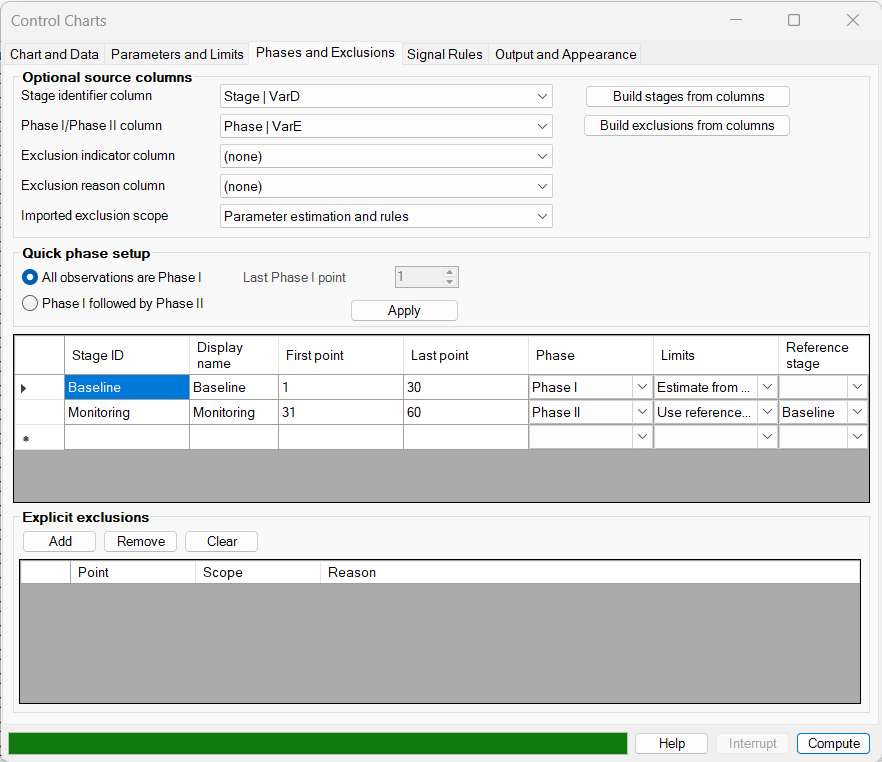

Build the two stages from `Stage` and `Phase`. Do not select an exclusion indicator or reason column for this example. The Phase II Monitoring stage uses the Baseline stage as its reference.

### Signal Rules

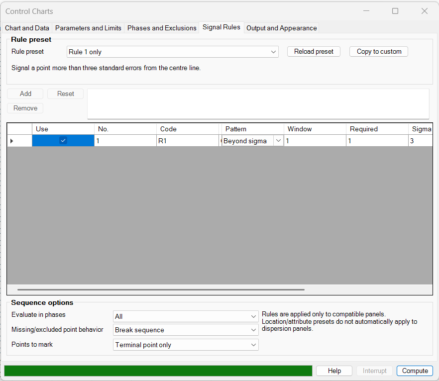

Select **Rule 1 only**, evaluate it in **All** phases, use **Break sequence**, and mark the **Terminal point only**.

### Expected results

| Result | Expected value |
|---|---:|
| Phase I samples used | 30 |
| Pooled baseline proportion, \(\bar p\) | 0.0213618 |
| Signalled points | 2 |
| Signal points | 42 (`S42`) and 57 (`S57`) |
| Warnings | 0 |

At point 42, 12 of 96 items are nonconforming, giving \(p_{42}=0.125\). At point 57, 12 of 112 are nonconforming, giving \(p_{57}=0.10714\). Both exceed their sample-specific exact upper limits.

The upper limit varies because the sample sizes vary. For example, smaller samples generally have wider proportion limits. This is expected and should not be mistaken for a changing process target.

---

## Required data layouts

### Individual sequence

Use one numeric measurement column, with one ordered observation per worksheet row. This layout is required for Individuals, Moving Range, I–MR, CUSUM, EWMA, and Moving Average charts.

Optional sample-label and numeric sequence/date/time columns must be aligned row by row. Excel dates are accepted through their numeric date serials.

### Subgroups across rows

Use one worksheet row per rational subgroup and two or more measurement columns:

| Sample | Measure 1 | Measure 2 | Measure 3 |
|---|---:|---:|---:|
| S01 | 10.1 | 10.3 | 10.2 |
| S02 | 9.9 | 10.0 | 10.1 |

The selected measurement columns form the subgroup. The sample label and sequence value, when supplied, are taken from the same row.

### Stacked observations

Use one numeric value column and one subgroup-ID column:

| Subgroup ID | Value |
|---|---:|
| G01 | 10.1 |
| G01 | 10.3 |
| G01 | 10.2 |
| G02 | 9.9 |
| G02 | 10.0 |

Rows with the same subgroup ID are combined into one chart point. Subgroup IDs are kept in first-appearance order. Stage, phase, label, and sequence metadata must be consistent within a subgroup when they are imported from columns.

### Aggregated counts

Use one row per chart point:

| Chart | Required values |
|---|---|
| p | Integer nonconforming count and positive integer sample size; count must not exceed sample size |
| np | Same as p, but sample size must be constant |
| c | Nonnegative integer defect count |
| u | Nonnegative integer defect count and positive exposure/opportunities |

Missing required attribute values can be rejected or the complete chart point can be omitted. **Use available measurements** has the same practical effect as omitting a point for aggregated counts because a count and its required denominator cannot be partially reconstructed.

---

## Dialog reference

### Chart and Data tab

Choose the chart family, chart type, and compatible data layout first. The available assignment roles change automatically.

- **Measurements/values:** one column for individual/time-weighted charts; two or more columns for wide subgroups; one value column for stacked subgroups.
- **Subgroup ID:** required only for stacked subgroup data.
- **Count:** required for p, np, c, and u charts.
- **Sample size:** required for p and np charts.
- **Exposure/opportunities:** required for u charts.
- **Sample label:** optional display label for each chart point.
- **Sequence/date/time:** optional numeric order value and optional horizontal-axis value.

The first used row is treated as a heading when the selected worksheet column has a header. Required role columns determine the last imported row; keep all optional columns aligned with those rows.

### Parameters and Limits tab

#### Missing value policy

| Option | Behaviour |
|---|---|
| **Reject** | Stop when a required value is missing |
| **Omit complete point/subgroup** | Retain an audit warning but do not construct that chart point |
| **Use available measurements** | For a subgroup, calculate from the nonmissing measurements and retain the effective subgroup size; chart-specific minimum sizes still apply |

For an individual series, a missing observation cannot be partially used and is omitted under either non-reject option. Missing or omitted points can also break signal-rule and time-weighted sequences, depending on the selected gap behaviour.

#### Parameter source

| Source | Use |
|---|---|
| **Estimate from Phase I** | Estimate parameters from eligible Phase I observations or subgroups |
| **Use historical parameters** | Supply previously established process parameters in the historical-parameter grid |
| **Defined by stage** | Use each stage's selected limit mode: estimate, reference another stage, or use historical parameters |

Historical rows can apply to all stages or to a named stage. Supply the fields relevant to the selected chart:

- process mean and process sigma for variables and time-weighted charts;
- nonconforming proportion for p and np charts;
- mean defect count for a c chart;
- mean defect rate for a u chart.

#### Control-limit method

- **Traditional sigma limits** are available for all charts in this dialog.
- **Exact probability limits** are available only for p, np, c, and u charts and use binomial or Poisson quantiles with probability coverage implied by the sigma multiplier.

#### Within-process sigma estimator

| Data type | Compatible estimators | Automatic choice |
|---|---|---|
| Individual and time-weighted | Moving range, median moving range, sample standard deviation, median absolute deviation | Moving range |
| Rational subgroups | Average range, average standard deviation, pooled standard deviation | Average range, except S and X-bar–S use average standard deviation |

**Moving-range length** applies to moving-range-based estimation and the displayed Moving Range panel. Supported lengths are 2–25. **Use bias correction** applies the appropriate normal-theory correction, such as \(d_2\), \(c_4\), or the normal MAD constant.

#### Natural-limit handling

**Clip to feasible range** prevents impossible lower limits below zero for counts, rates, ranges, and standard deviations, and constrains p-chart limits to 0–1 and np limits to 0–\(n\). **Retain calculated limits** leaves the unmodified sigma limits visible for diagnostic or methodological reasons. Exact probability limits are naturally discrete and feasible.

#### Time-weighted parameters

- **EWMA lambda:** \(0<\lambda\le1\); smaller values smooth more strongly.
- **CUSUM reference value k:** slack or allowance in process-sigma units.
- **CUSUM decision interval h:** signal threshold in process-sigma units.
- **Head start:** initial CUSUM state; it must be smaller than \(h\).
- **Moving-average span:** number of consecutive observations in the rolling window.
- **Use steady-state limits:** available for EWMA; otherwise startup limits are time-varying.

### Phases and Exclusions tab

#### Optional source columns

Select stage, phase, exclusion indicator, and exclusion-reason columns and use the build buttons to populate the editable grids. Accepted exclusion indicators include nonzero numbers, `Yes`, `True`, `Y`, `X`, `Exclude`, and `Excluded`; blank, zero, `No`, `False`, `N`, `Include`, and `Included` are treated as not excluded.

#### Quick phase setup

- **All observations are Phase I:** fit limits from the complete eligible sequence.
- **Phase I followed by Phase II:** specify the final Phase I point; Phase II automatically references the Phase I stage unless historical parameters are selected.

#### Stage limit modes

| Limit mode | Meaning |
|---|---|
| **Estimate from stage data** | Estimate the centre and variation from eligible points in that stage |
| **Use reference stage** | Reuse the frozen model from the named stage |
| **Use historical parameters** | Use the historical values supplied for that stage or the default historical row |

Stage ranges use one-based chart-point numbers in the dialog. They must not overlap, and a reference stage cannot refer to itself or form a cycle.

#### Exclusions

An exclusion can affect:

- **Parameter estimation** only;
- **Rule evaluation** only;
- **Parameter estimation and rules**.

Exclusions do not delete observations from the result. The point remains available for plotting, source-row tracing, and audit reporting. Exclude a point only when there is a documented process reason; do not remove a point merely because it crossed a control limit.

### Signal Rules tab

Available presets are:

- **None**;
- **Rule 1 only** — one point beyond three standard errors;
- **Western Electric rules 1–4**;
- **Nelson rules 1–8**;
- **Paper/Montgomery eight rules**;
- **Custom**.

Use **Copy to custom** to start from a preset and then edit rule pattern, window, required points, sigma threshold, side, and applicable panel scope.

Rules are evaluated only on compatible panels. The standard location and attribute sequence rules do not automatically apply to R or S dispersion panels. Rule 1 applies to all Shewhart panels. CUSUM, EWMA, and Moving Average use intrinsic decision-limit signals instead of a preset.

Sequence options control:

- whether rules are evaluated in Phase I, Phase II, both, or neither;
- whether a missing or rule-excluded point **breaks the sequence** or is **skipped while continuing**;
- whether only the terminal point or the entire contributing pattern is marked.

!!! caution "Multiple rules increase signal frequency"
    Applying several overlapping rules increases the chance of at least one signal even when the process is stable. Select rules deliberately, document the preset, and interpret the number of distinct signalled points separately from the number of rule occurrences.

### Output and Appearance tab

#### Output sheets

Select one or more of:

- **SPC Summary**;
- **Control Charts**;
- **Chart Data**;
- **Signals**;
- **Settings and Audit**.

All five are selected in the worked examples. Clicking **Compute** creates a new Excel workbook containing only the selected outputs.

#### Titles and axes

You can supply a chart title, a value-axis title, and a horizontal-axis title. If **Use sequence/date values on horizontal axis** is cleared, sample labels are used when available and point numbers otherwise. Tick-label orientation can be 0°, 45°, or 90°.

For a multi-panel chart, **Show horizontal axis on every panel** repeats the category labels and title; otherwise they appear on the final panel only. The number-format box accepts an Excel number-format code such as `0.####`.

#### Chart display

The dialog can show or hide the legend, major gridlines, point labels, signal labels, exclusion labels, control-limit labels, excluded points, and stage boundaries. One- and two-sigma zones can be shown as lines or shaded bands and can optionally appear in the legend.

#### Specifications

Specification and target lines are available on location-scale charts where the plotted value has the same units as the specification: Individuals, I–MR Individuals panel, X-bar, X-bar–R, X-bar–S, EWMA, and Moving Average. They are display/reference values only and do not change estimation, control limits, or signal evaluation.

#### Dimensions

The defaults are chart width `760`, panel height `300`, and panel spacing `18`. Composite charts create one aligned Excel chart per panel.

---

## Calculations

### General sigma limits

For a plotted statistic with centre \(\theta\), point-specific standard error \(SE_i\), and sigma multiplier \(K\), BESHStatNG calculates

$$
LCL_i=\theta-KSE_i,
\qquad
UCL_i=\theta+KSE_i.
$$

When \(K\ge1\) or \(K\ge2\), the corresponding one- and two-sigma zone boundaries are also retained for plotting and rules.

#### Variables charts

Let \(\mu\) and \(\sigma\) denote the fitted process mean and within-process standard deviation.

| Panel | Statistic | Centre | Standard error used for limits |
|---|---|---|---|
| Individuals | \(X_i\) | \(\mu\) | \(\sigma\) |
| X-bar | \(\bar X_i\) | \(\mu\) | \(\sigma/\sqrt{n_i}\) |
| Moving Range or R | \(R_i\) | \(d_2(n_i)\sigma\) | \(d_3(n_i)\sigma\) |
| S | \(S_i\) | \(c_4(n_i)\sigma\) | \(\sigma\sqrt{1-c_4(n_i)^2}\) |

For subgroup charts, the fitted process mean is weighted by the number of measurements in each eligible subgroup. This matters when subgroup sizes differ because of the original design or **Use available measurements**.

#### Attribute charts

The baseline centres are estimated by pooling eligible Phase I data:

$$
\bar p=\frac{\sum_i d_i}{\sum_i n_i},
\qquad
\bar c=\frac{\sum_i c_i}{m},
\qquad
\bar u=\frac{\sum_i c_i}{\sum_i e_i}.
$$

Traditional sigma-limit standard errors are:

$$
SE(p_i)=\sqrt{\frac{\bar p(1-\bar p)}{n_i}},
$$

$$
SE(np_i)=\sqrt{n\bar p(1-\bar p)},
\qquad
SE(c_i)=\sqrt{\bar c},
\qquad
SE(u_i)=\sqrt{\frac{\bar u}{e_i}}.
$$

For exact probability limits, the one-tail probability is

$$
\alpha_{tail}=1-\Phi(K).
$$

BESHStatNG uses binomial quantiles for p and np charts and Poisson quantiles for c and u charts. For a u chart, the Poisson mean at point \(i\) is \(\bar u e_i\), and the count quantiles are divided by \(e_i\).

#### EWMA

With \(Z_0=\mu\),

$$
Z_t=\lambda X_t+(1-\lambda)Z_{t-1}.
$$

For dynamic startup limits,

$$
SE(Z_t)=\sigma\sqrt{\frac{\lambda}{2-\lambda}
\left[1-(1-\lambda)^{2t}\right]}.
$$

Steady-state limits omit the term in square brackets.

#### CUSUM

For standardized observation \(z_t=(X_t-\mu)/\sigma\), reference value \(k\), and starting values equal to the head start:

$$
C_t^+=\max(0,C_{t-1}^+ + z_t-k),
$$

$$
C_t^-=\max(0,C_{t-1}^- - z_t-k).
$$

BESHStatNG plots the upper value above zero and the lower value as \(-C_t^-\). A signal occurs when \(C_t^+>h\) or \(-C_t^-<-h\).

#### Moving Average

For span \(w\), the statistic is the mean of the latest available observations in the current stage:

$$
MA_t=\frac{1}{m_t}\sum_{j=t-m_t+1}^{t}X_j,
\qquad
SE(MA_t)=\frac{\sigma}{\sqrt{m_t}},
$$

where \(m_t=\min(t,w)\) after a stage or sequence reset. The ribbon workflow therefore uses dynamic startup windows.

---

## Understanding the output workbook

### SPC Summary

Reports the chart type, family, layout, input and panel counts, selected rule preset, process status, execution audit, panel summaries, fitted parameter estimates, and warnings. **Signal occurrences** can exceed **signalled points** because several rules and overlapping windows can involve the same point.

### Control Charts

Contains standard embedded Excel charts. Composite analyses such as I–MR, X-bar–R, X-bar–S, and CUSUM produce aligned panels. The charts can be moved, resized, formatted, copied, or exported. See [Export Chart](../export-chart.md).

### Chart Data

Provides one row per panel and chart point, including source worksheet rows, labels, stage and phase, plotted value, centre line, standard error, standardized value, control and zone limits, effective sample size, estimation/rule eligibility, exclusion details, rule numbers, and signal status.

### Signals

Provides one row per rule occurrence, including the terminal point, contributing and marked points, rule code, side, window, value, standardized value, and an explanatory message. It also reproduces the selected rule definitions.

### Settings and Audit

Records the complete request, stage definitions, reference limits, exclusions and reasons, historical parameters, specification values, input counts, timestamps, execution time, and warnings. Use this sheet when reproducing or reviewing an analysis.

---

## Interpretation workflow

1. **Confirm the chart and data structure.** Check whether the observations are individuals, rational subgroups, nonconforming items, defects, or an ordered series intended for time weighting.
2. **Review the Phase I baseline.** Confirm that it represents a process state appropriate for estimating future monitoring limits.
3. **Review dispersion before location.** For I–MR, X-bar–R, and X-bar–S charts, an unstable dispersion panel can undermine the interpretation of the location limits.
4. **Investigate signals in process context.** Use labels, source rows, stage boundaries, and the Signals sheet to connect a statistical pattern to changes in material, equipment, method, environment, measurement, or personnel.
5. **Document justified exclusions.** If a known assignable cause should not define the common-cause model, record the reason and rerun the analysis. Do not exclude unexplained signals simply to obtain narrower or quieter limits.
6. **Freeze the monitoring model.** Phase II limits should come from an accepted Phase I reference stage or established historical parameters, not be continuously re-estimated from the monitoring data.
7. **Use specifications separately.** Assess process capability only after statistical stability has been considered; specification lines alone do not diagnose stability.

!!! note
    A signal indicates evidence against the fitted in-control model under the selected rule set. It does not identify the physical cause, prove that a product is defective, or quantify the practical importance of the change.

---

## Assumptions and practical considerations

- Chart points must be in meaningful process order.
- Measurements should be obtained with a stable measurement system.
- Rational subgroups should capture short-term variation and remain comparable over time.
- Classical variable-chart constants and bias corrections are based on an approximately normal within-process model; strong skewness or heavy tails can change false-signal behaviour.
- Attribute-chart binomial assumptions require meaningful inspected-item counts; Poisson defect charts assume the opportunity definition is comparable and the fitted rate is appropriate.
- Serial correlation, seasonality, drift, or autocorrelated sampling can produce signals even without a discrete assignable cause.
- Exact discrete limits generally do not have exactly the nominal continuous-normal tail probability because counts are discrete.
- Selecting several supplementary rules raises the overall false-signal probability.
- Missing-value omissions and exclusions can change both parameter estimates and the continuity of rule or time-weighted sequences.
- A process can change within a stage. Stage definitions should reflect known operational periods, not be chosen after inspecting the chart solely to improve its appearance.

---

## Steps in the add-in

1. In Excel, select **BESH Stat NG → Analyse → Statistical Process Control → Control Charts**.
2. On **Chart and Data**, choose the chart family, chart type, and data layout.
3. Assign the required worksheet columns and optional label/sequence columns.
4. On **Parameters and Limits**, choose the missing-value policy, parameter source, limit method, sigma estimator, and any time-weighted settings.
5. On **Phases and Exclusions**, apply a quick Phase I/II setup or build stages and exclusions from worksheet columns; review the generated grids.
6. On **Signal Rules**, choose a preset or define custom rules and sequence behaviour.
7. On **Output and Appearance**, choose output sheets and chart display settings.
8. Click **Compute**. BESHStatNG creates a new workbook containing the selected outputs.

---

## References

- Montgomery, D. C. (2019). Introduction to Statistical Quality Control (8th ed.). Wiley.
- Wheeler, D. J., & Chambers, D. S. (2010). Understanding Statistical Process Control (3rd ed.). SPC Press.
- Nelson, L. S. (1984). The Shewhart control chart—Tests for special causes. Journal of Quality Technology, 16(4), 237–239. <https://doi.org/10.1080/00224065.1984.11978921>
- Lucas, J. M., & Saccucci, M. S. (1990). Exponentially weighted moving average control schemes: Properties and enhancements. Technometrics, 32(1), 1–12. <https://doi.org/10.1080/00401706.1990.10484583>
- NIST/SEMATECH. e-Handbook of Statistical Methods, Section 6.3: Univariate and Multivariate Control Charts. Online handbook - <https://www.itl.nist.gov/div898/handbook/pmc/section3/pmc3.htm>

## Related methods

- **Multivariate Control Charts** — monitor several correlated measurements jointly; the companion page will be provided separately.
- [Descriptive Statistics](descriptive-statistics.md) — summarize a variable before defining a monitoring strategy.
- [Normal Plot](normal-plot.md) — examine distributional form for variable-chart planning.
- [Export Chart](../export-chart.md) — export the generated Excel charts as high-resolution images.
