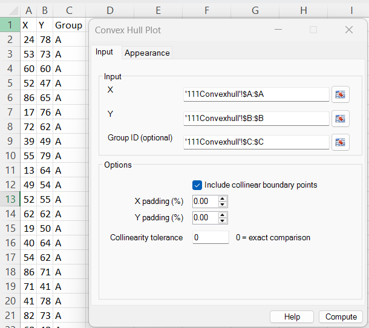
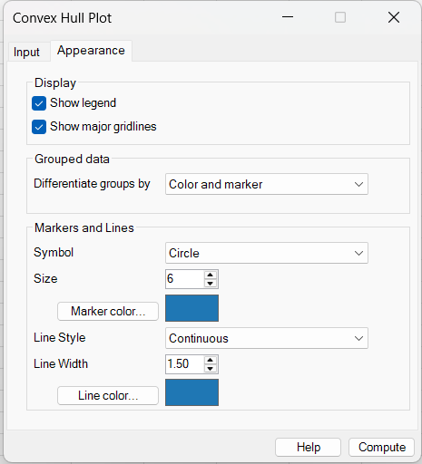
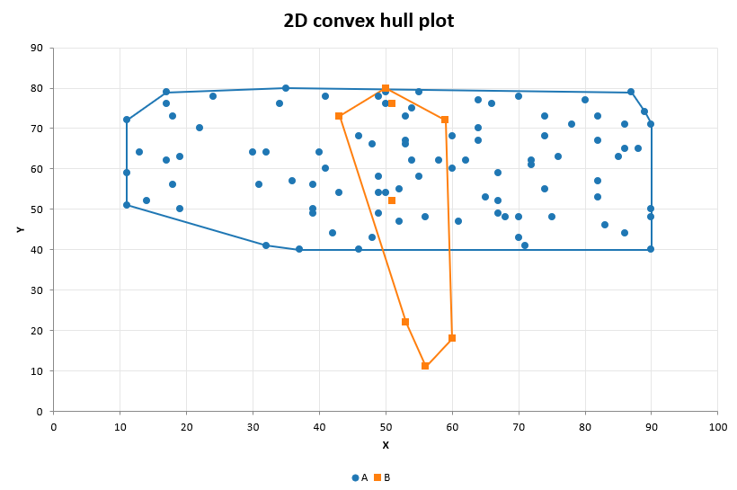

# Convex Hull Plot

**Includes:** Two-dimensional X–Y convex hulls, optional text or numeric grouping, retention or removal of collinear boundary points, independent X/Y padding, configurable numerical tolerance, grouped colours and symbols, marker and line formatting, legend control, and major gridlines.  
**Purpose:** Display a point cloud together with the smallest convex boundary containing all observations, either for the complete dataset or separately for each group.

---

## Overview

A **convex hull** is the smallest convex set that contains a collection of points. In two dimensions, it can be visualized as the polygon formed by stretching a rubber band around the outside of the observations and allowing it to contract until it becomes taut.

BESHStatNG creates an embedded Excel **XY scatter chart** containing:

- a marker for every valid X–Y observation;
- a closed convex-hull boundary around the observations;
- a separate hull for every grouping level when **Group ID** is supplied;
- configurable colours, marker symbols, line styles, marker size, and line width.

Interior observations remain visible as markers but do not change the boundary. Only observations on the outer envelope determine the tight hull.

Mathematically, for points \(p_1,\ldots,p_n\), the convex hull is

$$
\operatorname{conv}(S)=
\left\{
\sum_{i=1}^{n}\lambda_i p_i
\;\middle|\;
\lambda_i\geq 0,\quad
\sum_{i=1}^{n}\lambda_i=1
\right\}.
$$

The plot is descriptive. It does not estimate a confidence region, test whether groups differ, or describe the density of observations inside the hull.

---

## When to use it

Use a convex hull plot when you want to:

- show the overall two-dimensional extent of a point cloud;
- compare the observed X–Y envelopes of two or more groups;
- identify observations that define the outer boundary;
- summarize spatial, morphometric, multivariate-score, or measurement data on two numeric axes;
- highlight whether one group's observed range is contained within, overlaps, or extends beyond another group's range;
- add an easily interpreted boundary to an ordinary scatter plot.

Typical examples include PCA score plots, ecological or geographical coordinates, laboratory measurements, shape descriptors, process data, and paired quantitative variables.

!!! warning "A hull is strongly affected by extreme observations"
    A single distant observation can enlarge or rotate the hull substantially. Always inspect the markers and verify unusual boundary points before drawing substantive conclusions.

---

## Example dataset

Download the sample CSV used in the screenshots:

- [111convexhull.csv](../assets/data/111convexhull/111convexhull.csv)

The file contains 102 observations:

| Column | Contents | Use in the dialog |
|---|---|---|
| **X** | Horizontal coordinate | **X** |
| **Y** | Vertical coordinate | **Y** |
| **Group** | Text grouping variable with levels A and B | **Group ID (optional)** |

Group A contains 94 observations and Group B contains 8 observations. The unequal group sizes are deliberate: they demonstrate why hull size should be interpreted descriptively and not as a sample-size-independent measure of dispersion.

After opening the CSV in Excel, select:

- column `A:A` as **X**;
- column `B:B` as **Y**;
- column `C:C` as **Group ID (optional)**.

The headings may be included in the selected ranges. BESHStatNG uses the X and Y headings as the axis titles.

---

## Worked example: grouped convex hulls

### Input and calculation options

Use these settings:

| Setting | Value |
|---|---|
| X | **X** (`A:A`) |
| Y | **Y** (`B:B`) |
| Group ID | **Group** (`C:C`) |
| Include collinear boundary points | Selected |
| X padding (%) | `0.00` |
| Y padding (%) | `0.00` |
| Collinearity tolerance | `0` |

With zero padding, the displayed boundaries are tight hulls that pass through the extreme observations. A tolerance of zero requests exact floating-point orientation comparisons.

### Appearance options

Use these settings:

| Setting | Value |
|---|---|
| Show legend | Selected |
| Show major gridlines | Selected |
| Differentiate groups by | **Color and marker** |
| Symbol | **Circle** |
| Size | `6` |
| Marker color | Default blue |
| Line style | **Continuous** |
| Line width | `1.50` |
| Line color | Default blue |

Because **Color and marker** is selected, the automatic group palette overrides the single base colour and marker symbol where necessary. Group A uses the first colour and symbol in the palettes, while Group B uses the second.

### Output

The resulting chart shows:

- every observation as a marker;
- Group A as blue circles with a blue hull;
- Group B as orange squares with an orange hull;
- one legend entry for each group;
- automatic X and Y axis limits and major gridlines.

Group A occupies a broad horizontal envelope. Group B has a much narrower X range but extends substantially lower on the Y axis. The upper limits of the two groups are similar. These statements describe the observed sample only; the plot does not test whether the underlying populations differ.

With the settings shown, the backend retains 14 boundary coordinates for Group A and 6 for Group B. Some retained coordinates lie on straight boundary segments because **Include collinear boundary points** is selected.

!!! important "Do not compare hull areas without considering sample size"
    A larger sample has more opportunities to contain extreme observations and therefore often produces a larger hull. In this example, Group A has far more observations than Group B, so direct comparison of hull size would be misleading without additional analysis.

---

## Required data layout

Select two continuous, single-column ranges from the **same worksheet**, plus an optional aligned grouping range:

| Input | Meaning | Required |
|---|---|---:|
| **X** | Horizontal coordinate for each observation | Yes |
| **Y** | Vertical coordinate paired with X on the same row | Yes |
| **Group ID** | Text or numeric grouping level | No |

All selected ranges must:

- start on the same worksheet row;
- contain the same number of rows;
- consist of one continuous column each;
- belong to the same worksheet;
- preserve row-by-row alignment between X, Y, and Group ID.

X and Y must contain numeric data apart from an optional heading and missing cells. Group IDs may be text or numeric. Whole-column references and bounded ranges are both supported when their rows are aligned.

Example:

| X | Y | Group |
|---:|---:|---|
| 24 | 78 | A |
| 53 | 73 | A |
| 60 | 18 | B |
| 59 | 72 | B |

!!! important "Keep paired observations aligned"
    Do not sort, filter, or clean the selected columns independently. Every worksheet row represents one X–Y observation and, when supplied, one group membership.

---

## Dialog: inputs and options

### Input tab

#### Inputs

- **X** — select the numeric horizontal-coordinate column.
- **Y** — select the paired numeric vertical-coordinate column.
- **Group ID (optional)** — select a row-aligned text or numeric grouping column to calculate and display one hull per level.

The chart is inserted on the input worksheet, normally two columns to the right of the right-most selected input range.

#### Include collinear boundary points

Controls whether observations that lie on a straight hull edge are retained as hull vertices.

- **Selected** — retain all unique points on the boundary, including intermediate points on straight edges.
- **Cleared** — retain only the extreme corners or endpoints needed to define the same convex boundary.

For a typical non-collinear dataset, this option often changes the number of hull vertices without visibly changing the outer outline.

When all unique points in a group are collinear:

- selecting the option retains all unique points along the line;
- clearing it reduces the hull to the two extreme endpoints.

#### X padding (%) and Y padding (%)

Padding expands the displayed hull beyond the observed boundary. The two percentages are calculated independently within each group:

$$
\Delta_x=(x_{\max}-x_{\min})\frac{p_x}{100},
\qquad
\Delta_y=(y_{\max}-y_{\min})\frac{p_y}{100},
$$

where \(p_x\) and \(p_y\) are the requested X and Y padding percentages.

For every tight-hull vertex \((x,y)\), BESHStatNG generates potential expanded vertices at

$$
(x+\Delta_x,y),\quad
(x-\Delta_x,y),\quad
(x,y+\Delta_y),\quad
(x,y-\Delta_y),
$$

and then calculates a new convex hull from the original and generated points.

Consequently:

- `0` produces the tight observed hull;
- positive X padding expands the hull horizontally;
- positive Y padding expands the hull vertically;
- grouped plots use each group's own X and Y ranges;
- the expanded boundary may contain synthetic vertices that are not observations.

Markers always represent the original observations. Synthetic padding points are used only to draw the expanded boundary.

!!! note "Padding is not a confidence interval"
    Padding is a graphical enlargement based on the observed coordinate ranges. It has no probability interpretation and should not be described as uncertainty around the data.

#### Collinearity tolerance

The hull algorithm uses cross products to determine whether three points form a clockwise turn, a counterclockwise turn, or a straight line. Leave the value at `0` for exact floating-point comparison.

A small positive tolerance may be useful when X or Y coordinates were produced by earlier numerical calculations and points that should be collinear differ by tiny rounding errors.

The entered tolerance is scaled to the coordinate magnitude. If

$$
s=\max\left(1,\max_i|x_i|,\max_i|y_i|\right),
$$

then the effective cross-product tolerance is

$$
\tau_{\mathrm{effective}}=\tau s^2.
$$

The value must be finite and nonnegative.

!!! warning
    An unnecessarily large tolerance can treat genuinely curved or angled boundary points as collinear and alter the hull. Use `0` unless you have a specific numerical reason to change it.

---

### Appearance tab

#### Display

**Show legend**

- **Selected** — display one legend entry per group, or a single **Data** entry for an ungrouped plot.
- **Cleared** — hide the legend.

Although each group is rendered using separate marker and hull-line series, BESHStatNG keeps only one legend entry per group.

**Show major gridlines**

- **Selected** — display major gridlines for both axes.
- **Cleared** — hide major gridlines.

Axis limits and tick spacing remain controlled by Excel's automatic chart scaling.

#### Grouped data: Differentiate groups by

This setting controls which visual attributes change automatically between grouping levels.

| Option | Colour varies | Marker varies | Line style varies |
|---|:---:|:---:|:---:|
| **Same style** | No | No | No |
| **Color** | Yes | No | No |
| **Marker symbol** | No | Yes | No |
| **Line style** | No | No | Yes |
| **Color and marker** | Yes | Yes | No |
| **Color and line style** | Yes | No | Yes |
| **Marker and line style** | No | Yes | Yes |
| **Color, marker and line style** | Yes | Yes | Yes |

The default is **Color and marker**.

Groups are ordered by their first usable occurrence in the worksheet. The built-in palettes contain:

- 10 colours;
- 8 marker symbols;
- 5 line styles.

A palette repeats when the number of groups exceeds the number of available styles.

!!! note
    In an ungrouped plot, this setting has no effect. The selected base marker and line formatting is used directly.

#### Markers and lines

**Symbol**

Choose the base marker symbol:

- Circle;
- Square;
- Triangle;
- Diamond;
- X;
- Plus;
- Star;
- Dash.

When group differentiation includes **Marker**, this is the first symbol in the sequence and later groups use the remaining automatic marker palette.

**Size**

Sets the marker size from 2 to 72 points. The default is `6`.

**Marker color**

Opens the Windows colour selector and sets the base marker foreground and fill colour.

When group differentiation includes **Color**, the automatic group colour palette overrides the base marker colour. Otherwise all groups use the selected marker colour.

**Line style**

Choose the base hull-line style:

- Continuous;
- Dash;
- Dot;
- Dash-dot;
- Dash-dot-dot.

When group differentiation includes **Line style**, later groups use the remaining automatic line-style palette.

**Line width**

Sets the hull-line width from 0.25 to 10 points. The default is `1.50`.

**Line color**

Opens the Windows colour selector and sets the base hull-line colour.

When group differentiation includes **Color**, the automatic group colour palette overrides the base line colour so that markers and hull lines match within each group. Otherwise all hulls use the selected line colour.

#### Initial dialog selections

The current dialog opens with:

| Setting | Default |
|---|---|
| Include collinear boundary points | Selected |
| X padding | `0.00` |
| Y padding | `0.00` |
| Collinearity tolerance | `0` |
| Show legend | Selected |
| Show major gridlines | Selected |
| Differentiate groups by | **Color and marker** |
| Marker symbol | **Circle** |
| Marker size | `6` |
| Hull line style | **Continuous** |
| Hull line width | `1.50` |

The current Windows dialog does not expose separate switches for observations and hull lines. Both are displayed using their backend defaults.

---

## Grouped convex hull plots

When **Group ID** is supplied:

- each distinct nonmissing text or numeric ID becomes a separate group;
- a hull is calculated independently for each group;
- padding percentages are based on each group's own coordinate range;
- groups appear in the order of their first usable worksheet observation;
- group names are displayed in the legend when the legend is enabled;
- the chosen differentiation mode controls colour, marker, and line-style variation.

Grouping does not pool observations, calculate group centroids, standardize the variables, or adjust for unequal group sizes.

Rows with valid X and Y values but a missing Group ID are omitted from a grouped plot.

!!! tip
    Use both colour and another visual attribute when charts may be printed in grayscale or viewed by readers with colour-vision deficiencies.

---

## Steps in the add-in

1. In the Excel ribbon, select **BESH Stat NG → Analyse → Graphics → Convex Hull Plot**.
2. Select the **X** range.
3. Select the row-aligned **Y** range.
4. Optionally select a row-aligned **Group ID** range.
5. Choose whether to include collinear boundary points.
6. Enter optional X and Y padding percentages.
7. Leave **Collinearity tolerance** at `0`, or enter a justified small positive value.
8. Open the **Appearance** tab and select the legend, gridlines, group differentiation, marker, and line settings.
9. Click **Compute**.

---

## Output

BESHStatNG creates an embedded Excel XY scatter chart on the input worksheet. The default output contains:

- one marker series and one hull-line series for every group;
- all valid source observations as markers;
- a tight or padded convex boundary for each group;
- a chart title of **2D convex hull plot**;
- X and Y axis titles obtained from the selected column headings;
- automatic Excel axis limits;
- optional major gridlines and legend entries.

The chart is created at approximately 620 × 420 points and is normally anchored two worksheet columns to the right of the selected data.

The result is a standard Excel chart and can be moved, resized, formatted, copied, or exported after creation. See [Export Chart](../export-chart.md) for high-resolution image export.

The numerical backend also calculates hull area and perimeter for each group, but the current ribbon dialog displays only the chart and does not write those values to the worksheet.

---

## What it does: hull calculation

### 1. Retain complete observations and form groups

For observation \(i\), BESHStatNG requires a finite pair

$$
p_i=(x_i,y_i).
$$

If grouping is present, the observation must also have a usable text or numeric Group ID. Hulls are then calculated independently within each group.

Duplicate coordinates are retained in the marker series so that all source rows remain represented. Exact duplicate coordinates are removed only from the geometric hull calculation because repeated copies cannot change the boundary.

### 2. Sort the unique coordinates

Within each group, unique points are sorted lexicographically:

1. ascending X;
2. ascending Y when X values are equal.

This ordered list is used to construct the lower and upper parts of the hull.

### 3. Determine turn direction

For three consecutive points \(O\), \(A\), and \(B\), the two-dimensional cross product is

$$
\operatorname{cross}(O,A,B)=
(A_x-O_x)(B_y-O_y)-
(A_y-O_y)(B_x-O_x).
$$

Its sign indicates the turn direction:

| Cross product | Geometric interpretation |
|---:|---|
| Positive | Counterclockwise turn |
| Negative | Clockwise turn |
| Zero, within tolerance | Collinear points |

### 4. Construct lower and upper chains

BESHStatNG uses Andrew's monotone-chain method:

1. scan the sorted points from left to right to form the lower chain;
2. scan them from right to left to form the upper chain;
3. remove turns that cannot belong to the convex boundary;
4. combine both chains into a counterclockwise sequence of hull vertices.

For \(n\) observations, sorting dominates the calculation, giving a time complexity of \(O(n\log n)\) per group.

### 5. Apply optional padding

When either padding percentage is positive, BESHStatNG first calculates the tight hull, creates the shifted synthetic points described earlier, and calculates a second hull around the expanded set.

Padding therefore changes the boundary coordinates but does not move or duplicate the displayed observation markers.

### 6. Close and render the boundary

For a hull with at least three vertices, the first hull coordinate is repeated at the end so Excel draws a closed polygonal boundary. Straight line segments are used; the hull is not smoothed.

---

## Missing, invalid, repeated, and degenerate data

- A missing X or Y value omits that observation.
- X and Y should otherwise be numeric; nonnumeric content in a numeric input can prevent import.
- A missing or blank Group ID omits the observation from a grouped plot.
- Infinite coordinates or grouping values are rejected.
- At least one complete usable X–Y observation is required.
- Duplicate X–Y coordinates are displayed as overlapping markers but are used only once in the hull geometry.
- One unique point cannot define a polygon; the point is displayed without a hull line.
- Two unique points produce a line segment rather than a polygon.
- A fully collinear group has zero enclosed area and produces a line-like boundary.
- The hull is independent of worksheet row order; row order affects only group discovery and legend order.

---

## How to interpret the plot

Interpret the markers and hull separately:

- **Markers** show the individual observed X–Y combinations.
- **Hull lines** show the outer convex envelope of those observations.
- **Colour, symbol, line style, and legend labels** indicate group membership.

Patterns to examine include:

- the horizontal and vertical extent of each group;
- directions in which one group extends beyond another;
- complete or partial overlap between observed envelopes;
- narrow, elongated, or approximately compact shapes;
- individual observations that create large changes in the boundary;
- regions inside a hull that contain few or no observations.

!!! important "Empty space inside a convex hull is still enclosed"
    The convex hull fills across concavities. A large empty region inside the polygon does not imply that observations occurred there or that the point cloud is dense throughout the enclosed area.

Do not interpret hull overlap as a formal test of equality. Likewise, non-overlapping observed hulls do not by themselves establish a statistically significant difference between populations.

---

## Convex hull plot versus related graphics

| Graphic | Boundary or summary | Typical purpose |
|---|---|---|
| **Scatter plot** | No boundary | Display all paired observations directly |
| **Convex hull plot** | Smallest convex polygon containing all observations | Show the complete observed outer envelope |
| **Confidence ellipse** | Model-based elliptical region | Summarize estimated location and covariance or statistical uncertainty |
| **Concave hull / alpha shape** | Boundary that may follow inward indentations | Represent a non-convex point-cloud outline |
| **Bounding rectangle** | Axis-aligned minimum and maximum limits | Show simple X and Y ranges |

Use a convex hull when enclosing every observation is important and a convex outer envelope is appropriate. Use a different method when you need a probability region, a robust summary, or a boundary that follows concavities.

---

## Implementation details and limitations

- Geometry is calculated independently of Excel chart creation.
- The backend uses Andrew's monotone-chain algorithm separately for each group.
- All original observations are passed directly to Excel marker series; no worksheet helper columns are written.
- The hull boundary is rendered as straight Excel XY-scatter line segments without polygon fill.
- The current dialog always displays both markers and hull lines.
- Chart title, background, axis limits, and axis scaling are currently controlled by backend defaults rather than dialog controls.
- The chart title is fixed at **2D convex hull plot** in the current form.
- Axis titles are taken from the selected X and Y column headings.
- Area and perimeter are available in the backend result object but are not currently reported in the graphical user interface.
- Hulls are not robust to outliers and are sensitive to sample size.
- Positive padding is a visual expansion, not a statistical interval.
- The method does not calculate confidence ellipses, concave hulls, alpha shapes, density contours, centroids, or group-comparison tests.
- Palettes repeat after 10 colours, 8 markers, or 5 line styles.
- Very large numbers of groups can encounter Excel chart-series limitations because each group uses separate marker and hull series.
- The plot is created through the ribbon; it is not a worksheet UDF.
- Overlapping observations at identical or very similar coordinates can be difficult to distinguish.

---

## Common mistakes

- Reversing the X and Y selections.
- Selecting ranges from different worksheets.
- Selecting ranges that start on different rows or contain different numbers of rows.
- Supplying a Group ID range that is not aligned with X and Y.
- Interpreting the hull as a confidence region or tolerance region.
- Comparing hull areas from groups with very different sample sizes without qualification.
- Assuming the hull follows gaps or inward curves in the point cloud.
- Using excessive padding and then interpreting the expanded boundary as observed data.
- Entering a large collinearity tolerance without checking its effect.
- Expecting interior observations to affect the hull.
- Forgetting that an extreme or erroneous observation may determine a large part of the boundary.
- Choosing **Same style** for many groups and then relying only on the legend to distinguish overlapping hulls.

---

## See also

- [Scatter Plot Matrix](scatter-plot-matrix.md)
- [XYZ 3D Scatterplot](xyz-3d-scatterplot.md)
- [Principal Component Analysis](principal-component-analysis.md)
- [Export Chart](../export-chart.md)
- [Convex hull – Wikipedia](https://en.wikipedia.org/wiki/Convex_hull)
- [Home](../index.md)
