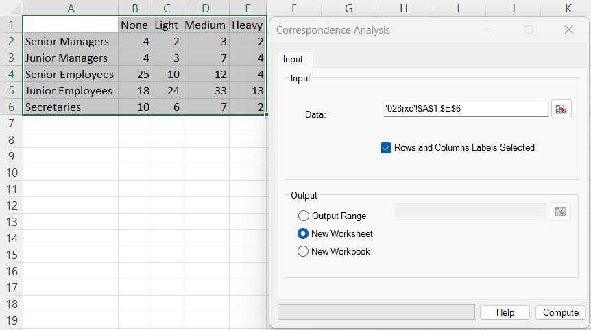
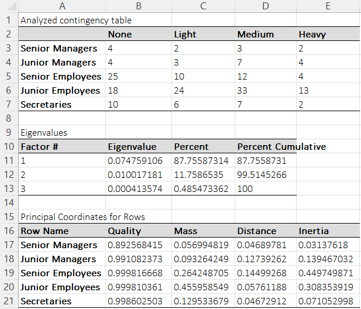
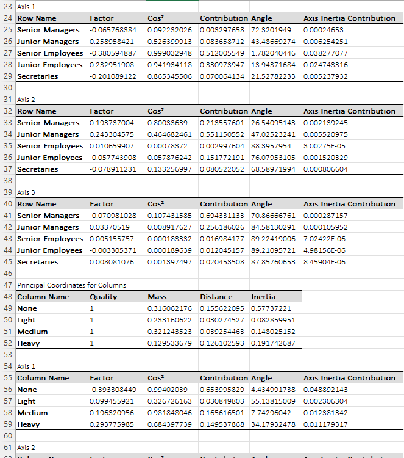
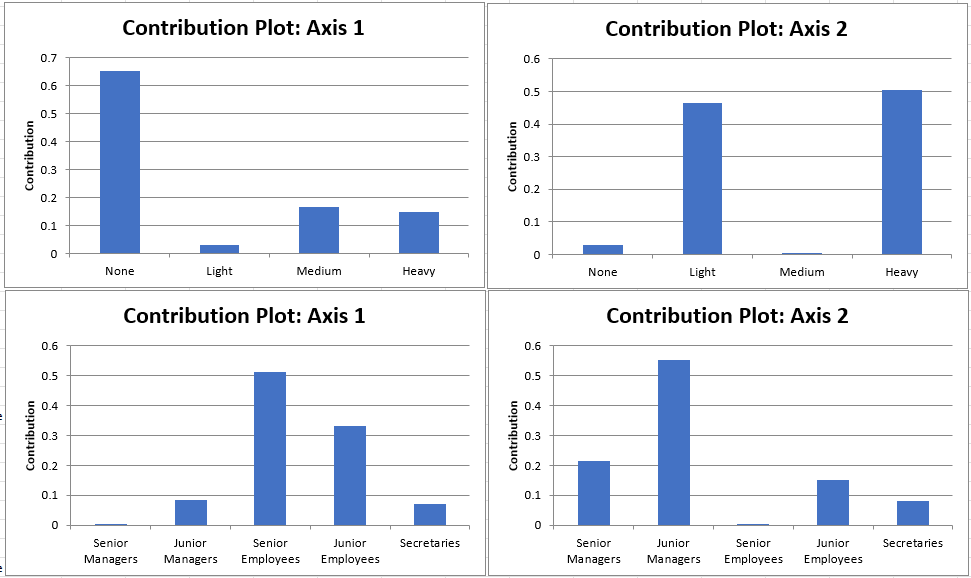
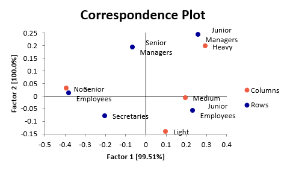

# Correspondence Analysis

**Includes:** Correspondence analysis (CA), Row/column contribution plots, Biplot.  
**Purpose:** Explore association patterns in a contingency table by mapping **rows** and **columns** into a low-dimensional space using the **chi-square** metric.

---

## Overview

Correspondence Analysis (CA) is a multivariate technique for an \(R \times C\) table of **non-negative counts**. CA summarizes how the observed counts depart from what would be expected under **independence**, and represents the row and column categories as points in a low-dimensional map (typically 2D).

Key ideas:

- Each row is represented by its **row profile** (row proportions across columns).
- Each column is represented by its **column profile** (column proportions across rows).
- Distances are measured using the **chi-square distance**.
- The first few axes (often 1–2) usually capture most of the association, although the full solution may contain additional axes.

BESHStatNG reports:

- Eigenvalues (inertia) and percent explained
- Principal coordinates for rows and columns (with mass, distance, inertia, quality)
- Axis-by-axis tables for all available axes with factor scores, cos², contributions, angles, and axis inertia contributions
- Contribution plots for the leading axes (typically Axis 1 and Axis 2)
- A correspondence plot (rows and columns together)

---

## Example dataset

This page uses the dataset shown in the screenshots:

- [028rxc.csv](../assets/data/028rxc/028rxc.csv) (contingency table with row/column labels)

In the example:

- **Rows** are job groups (Senior Managers, Junior Managers, Senior Employees, Junior Employees, Secretaries)
- **Columns** are coffee consumption (None, Light, Medium, Heavy)

From the example output, the first two eigenvalues are:

- Axis 1: \(\lambda_1 = 0.074759106\)
- Axis 2: \(\lambda_2 = 0.010017181\)

These explain about 87.76% and 11.76% of the total inertia, respectively.

---

## Screenshots

### Input



### Output (eigenvalues and row principal coordinates)



### Output (row axis tables and column principal coordinates)



### Output (contribution plots)



### Output (correspondence plot)



---

## Inputs in Excel

### Data range

Select a rectangular block containing the contingency table.

- If **Rows and Columns Labels Selected** is checked, the selection must include:
  - the row labels in the first column, and
  - the column labels in the first row.
- Otherwise, select only the numeric counts.

Counts must be non-negative. Remove empty rows/columns (all zeros) before running CA.

### Output

Choose one of:

- **Output Range** (write to a specific worksheet location)
- **New Worksheet** (recommended)
- **New Workbook**

---

## Output and interpretation

### 1) Eigenvalues table

The eigenvalues (principal inertias) summarize how much association is captured by each axis.

- **Eigenvalue**: inertia of the axis
- **Percent**: eigenvalue divided by total inertia
- **Percent Cumulative**: cumulative percent across axes

Typically, interpret the first 1–2 axes if they explain most of the inertia.

### 2) Principal coordinates for rows and columns

For each row and each column, BESHStatNG reports:

- **Mass**: marginal proportion (row/column weight)
- **Distance**: squared distance from the origin in factor space
- **Inertia**: share of total inertia attributable to that row/column
- **Quality**: how well the available axes represent the point

Interpretation tips:

- **High Quality** means the point is well represented in the 2D map.
- **High Inertia** points contribute more to the overall association.

### 3) Axis tables (Axis 1, Axis 2, ...)

For each axis and each point (row/column), BESHStatNG reports:

- **Factor**: principal coordinate on that axis
- **Cos²**: squared cosine, proportion of the point’s distance explained by that axis
- **Contribution**: contribution of the point to that axis inertia
- **Angle**: angle (degrees) between the point vector and the axis
- **Axis Inertia Contribution**: point inertia on that axis (`mass × factor²`)

Interpretation tips:

- Large absolute **Factor** values indicate points far from the origin on that axis.
- Large **Contribution** values indicate points that strongly define the axis.
- High **Cos²** indicates the axis explains most of the point’s position.

!!! note "GUI tables vs UDF tables"
    In the worksheet UDFs, the same diagnostics are split across separate outputs such as row/column coordinates, cos² tables, and contribution tables.  
    The dialog output presents them together in axis-by-axis tables for easier reading.

### 4) Charts

- **Contribution plots** usually focus on the leading axes, especially Axis 1 and Axis 2.
- **Correspondence plot** shows rows and columns in the same 2D plane, typically Factor 1 vs Factor 2.

In the correspondence plot:

- Points far from the origin are more distinctive.
- A row point near a column point suggests a relative association (compared with independence).
- Axis signs can be flipped without changing the CA solution; some software may mirror the plot.

---

## Mathematical details

Let the count table be an \(R \times C\) matrix \(\mathbf{N} = (n_{ij})\), with total count

$$
N = \sum_{i=1}^{R} \sum_{j=1}^{C} n_{ij}.
$$

Define the matrix of relative frequencies

$$
\mathbf{P} = \frac{1}{N} \mathbf{N}.
$$

Row and column masses (marginal proportions) are

$$
\mathbf{r} = \mathbf{P} \mathbf{1},
\qquad
\mathbf{c} = \mathbf{P}^{T} \mathbf{1},
$$

where \(\mathbf{1}\) is a vector of ones. Let \(\mathbf{D}_r = \mathrm{diag}(\mathbf{r})\) and \(\mathbf{D}_c = \mathrm{diag}(\mathbf{c})\).

### Independence model and standardized residual matrix

Under independence, the expected relative frequencies are \(\mathbf{r}\mathbf{c}^{T}\).

CA is based on the standardized residual matrix

$$
\mathbf{S} = \mathbf{D}_r^{-1/2} (\mathbf{P} - \mathbf{r}\mathbf{c}^{T}) \mathbf{D}_c^{-1/2}.
$$

Compute the singular value decomposition (SVD)

$$
\mathbf{S} = \mathbf{U} \mathbf{\Delta} \mathbf{V}^{T},
$$

where \(\mathbf{\Delta} = \mathrm{diag}(\sigma_1, \sigma_2, ...)\) contains singular values. The CA eigenvalues (principal inertias) are

$$
\lambda_k = \sigma_k^{2}.
$$

Total inertia is

$$
I = \sum_k \lambda_k.
$$

Percent explained by axis \(k\) is \(100 \times \lambda_k / I\).

### Chi-square distances

Row profiles are \(p_{j|i} = p_{ij}/r_i\) and column profiles are \(p_{i|j} = p_{ij}/c_j\).

The chi-square distance between two row profiles \(i\) and \(i'\) is

$$
d^{2}(i,i') = \sum_{j=1}^{C} \frac{1}{c_j} (p_{j|i} - p_{j|i'})^{2}.
$$

The squared distance of row \(i\) from the average profile is

$$
d_i^{2} = \sum_{j=1}^{C} \frac{1}{c_j} (p_{j|i} - c_j)^{2}.
$$

(Analogous formulas hold for columns.)

### Principal coordinates

BESHStatNG reports **principal coordinates** (factor scores).

Row principal coordinates:

$$
\mathbf{F} = \mathbf{D}_r^{-1/2} \mathbf{U} \mathbf{\Delta},
$$

Column principal coordinates:

$$
\mathbf{G} = \mathbf{D}_c^{-1/2} \mathbf{V} \mathbf{\Delta}.
$$

The coordinate (factor score) for row \(i\) on axis \(k\) is \(f_{ik}\), and for column \(j\) on axis \(k\) is \(g_{jk}\).

A useful identity:

$$
d_i^{2} = \sum_k f_{ik}^{2},
\qquad
d_j^{2} = \sum_k g_{jk}^{2}.
$$

### Contributions, cos², inertia, quality, angles

**Contribution** of row \(i\) to axis \(k\) inertia:

$$
ctr_{ik} = \frac{r_i f_{ik}^{2}}{\lambda_k}.
$$

(For columns: \(ctr_{jk} = c_j g_{jk}^{2} / \lambda_k\).)

**Correlation (cos2)** of row \(i\) with axis \(k\):

$$
cos^{2}_{ik} = \frac{f_{ik}^{2}}{d_i^{2}}.
$$

**Quality** is the sum of cos² across the available axes included in the solution:

$$
\mathrm{Quality}_i = \sum_{k\in\mathcal{K}} \cos^2_{ik}.
$$

When interpreting a 2D map, Axis 1 + Axis 2 still provide the most important low-dimensional visual summary, but the stored quality measure itself is not restricted to only two axes.

**Point inertia share** (as shown in the principal coordinates table) is:

$$
inertia_i = \frac{r_i d_i^{2}}{I}.
$$

In the axis tables, the per-point **Axis Inertia Contribution** column corresponds to:

$$
eig_{ik} = r_i f_{ik}^{2}
$$

(and similarly \(c_j g_{jk}^{2}\) for columns).

**Angle** (degrees) used in the output tables is derived from cos2:

$$
angle_{ik} = \arccos(\sqrt{cos^{2}_{ik}}) \times \frac{180}{\pi}.
$$

---

## R code (reference)

The CA solution can be reproduced in R using common packages such as `FactoMineR` or `ca`. Axis signs may differ (mirrored plots) because CA is invariant to multiplying an axis by \(-1\).

### Using FactoMineR

```r
library(FactoMineR)
library(factoextra)

raw <- read.csv("028rxc.csv", header = FALSE, stringsAsFactors = FALSE)
X <- as.matrix(raw[2:6, 2:5])
rownames(X) <- raw[2:6, 1]
colnames(X) <- c("None","Light","Medium","Heavy")

res <- CA(X, graph = FALSE)

# Eigenvalues (inertia)
res$eig

# Principal coordinates
res$row$coord
res$col$coord

# Masses, distances, cos2, contributions
res$row$mass
res$row$dist
res$row$cos2
res$row$contrib / 100   # FactoMineR reports contributions in percent

res$col$mass
res$col$dist
res$col$cos2
res$col$contrib / 100

# Angles in degrees (to match BESHStatNG 'Angle' column)
row_angle1 <- acos(sqrt(res$row$cos2[,1])) * 180/pi
col_angle1 <- acos(sqrt(res$col$cos2[,1])) * 180/pi

# Plots similar to BESHStatNG
fviz_ca_biplot(res, repel = TRUE)

fviz_contrib(res, choice = "row", axes = 1)
fviz_contrib(res, choice = "row", axes = 2)

fviz_contrib(res, choice = "col", axes = 1)
fviz_contrib(res, choice = "col", axes = 2)
```

### Using the ca package

```r
library(ca)
raw <- read.csv("028rxc.csv", header = FALSE, stringsAsFactors = FALSE)
X <- as.matrix(raw[2:6, 2:5])
rownames(X) <- raw[2:6, 1]
colnames(X) <- c("None","Light","Medium","Heavy")

fit <- ca(X)

# Singular values (sv) and inertias (sv^2)
fit$sv
fit$sv^2

# Principal coordinates (rows/cols)
fit$rowcoord
fit$colcoord
```

### Expected differences vs BESHStatNG

- **Axis sign:** coordinates can be multiplied by \(-1\) without changing the solution. This mirrors plots.
- **Contribution scale:** some R functions report contributions as percent; BESHStatNG reports proportions (0–1).
- **Rounding:** small differences may occur from rounding and display formatting.

---

## Related methods

- For hypothesis testing of independence in an \(R \times C\) table, see **RxC Table** (chi-square, exact tests, ordinal measures).
- For a 2x2 table and exact/mid-p p-values, see **2x2 Table**.

## See also

- [R×C Table](rxc-table.md)
- [2×2 Table](2x2-table.md)
- [Home](../index.md)
