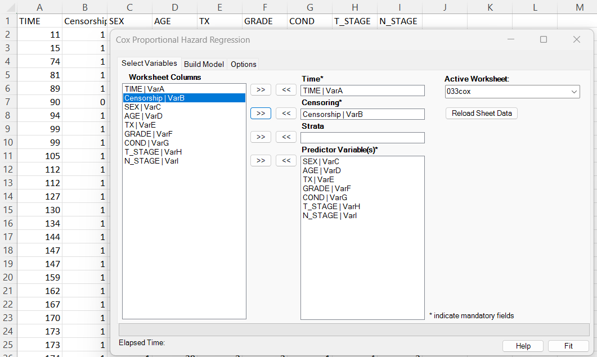
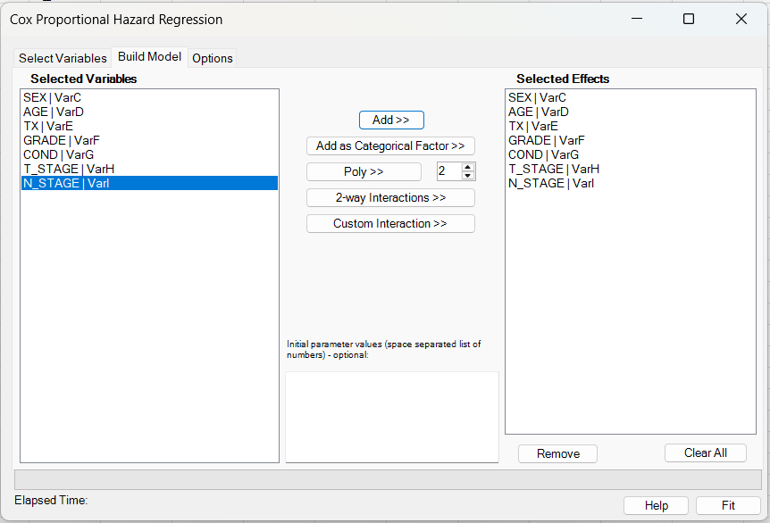
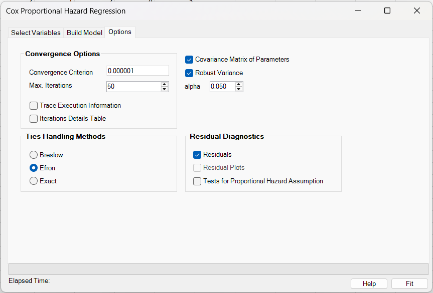
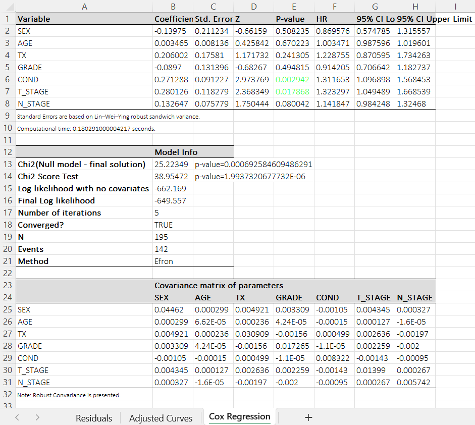
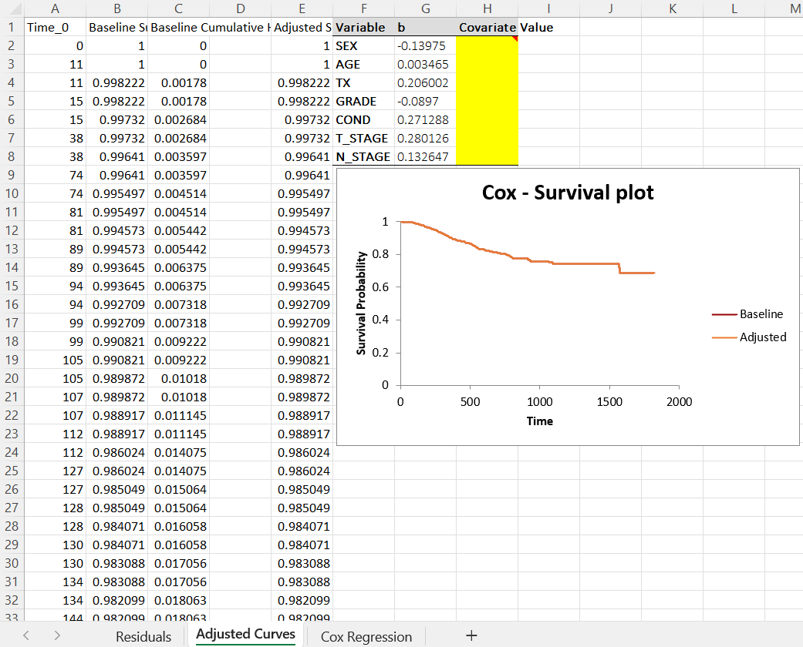

# Cox Regression

**Includes:** Cox proportional hazards model, tie handling (Breslow, Efron, Exact), categorical factors, polynomial terms, continuous-variable interactions, user-selected hazard-ratio confidence level (default 95%), optional starting values for the optimizer, robust variance (optional), residuals + PH score test (optional), baseline + adjusted survival curves.  
**Purpose:** Fit a proportional hazards model to time-to-event data and report hazard ratios with diagnostics.

---

## Overview

The Cox proportional hazards (PH) regression model relates a subject’s time-to-event outcome to one or more predictors without requiring a parametric form for the baseline hazard. It is widely used for survival analysis when follow-up times vary and observations may be right-censored.

Let \(T\) be the event time and \(x\) a vector of covariates. The Cox model is:

\[
h(t \mid x)=h_0(t)\exp(\beta^\top x),
\]

where \(h(t\mid x)\) is the hazard at time \(t\), \(h_0(t)\) is an unspecified baseline hazard, and \(\beta\) are regression coefficients estimated by maximizing the partial likelihood.

**Interpretation:** For a one-unit increase in covariate \(x_j\) (holding others constant), the hazard is multiplied by the hazard ratio (HR)

\[
\text{HR}_j=\exp(\beta_j).
\]

- \(\text{HR}>1\): higher instantaneous risk (shorter expected survival)
- \(\text{HR}<1\): lower instantaneous risk (longer expected survival)

This add-in fits Cox PH models with configurable tie handling (Breslow, Efron, Exact), optional robust (sandwich) variance, residual diagnostics (Martingale, Deviance, Schoenfeld, score, influence measures), proportional-hazards tests, and baseline/adjusted survival curve output for user-specified covariate profiles.

---

## User interface

### Select Variables



1. **Worksheet Columns**: select the columns that contain your time, event indicator, optional stratum, and predictors.
2. **Time**: time-to-event variable.
3. **Censoring**: event indicator (see note below).
4. **Strata** (optional): stratum identifier for stratified Cox models.
5. **Predictor Variable(s)**: covariates for the linear predictor.

!!! note "Event coding"
    In BESHStatNG Cox regression, the **Censoring** variable must be coded **1 = event occurred** and **0 = censored**.

### Build Model



- **Add >>** adds the selected variable(s) as continuous main effects.
- **Add as Categorical Factor >>** marks the selected variable(s) as categorical main effects. Internally, BESHStatNG expands each selected factor into reference-coded indicator columns.
- **Poly >>** creates polynomial terms for the selected variable(s). The degree is taken from the numeric box next to the button.
- **2-way Interactions >>** creates all pairwise interactions among the currently selected variables.
- **Custom Interaction >>** creates one multi-way interaction term spanning all currently selected variables.

Current limitations:

- Polynomial terms are supported only for **continuous** predictors.
- Interaction terms are currently supported only for **continuous × continuous** combinations.
- Interactions involving categorical predictors are **not implemented yet**.

**Initial parameter values**

- If provided, the values are now used as the **starting point** for the Cox Newton–Raphson optimizer.
- The number of supplied values must match the number of **expanded** Cox coefficients.
- For categorical predictors, one selected factor may expand to multiple fitted coefficients because BESHStatNG uses **reference-level coding**.

!!! note
    The **Selected Effects** list shows the authored terms, while the fitted coefficient table may contain more columns after expansion (for example, one coefficient per non-reference factor level).

### Options



**Convergence options**

- **Convergence Criterion**: tolerance \(\varepsilon\) used to stop the Newton--Raphson iterations (based on the absolute change in log partial likelihood).
- **Max. Iterations**: maximum Newton--Raphson iterations.
- **Trace Execution Information**: when enabled, writes iteration tracing to the log.
- **Iterations Details Table**: outputs a per-iteration table of coefficients and log-likelihood.

**Ties handling methods**

- **Breslow**: standard approximation.
- **Efron**: improved approximation (recommended when ties are common; this is the default in many packages).
- **Exact**: exact partial likelihood for ties (uses dynamic programming; can be slower).

**Model output / diagnostics**

- **Alpha**: significance level used for hazard-ratio confidence intervals in the coefficient table.  
  Default: **0.05** (95% confidence interval).
- **Covariance Matrix of Parameters**: prints \(\widehat{\mathrm{Var}}(\hat\beta)\) (model-based; plus robust if selected).
- **Robust Variance**: additionally computes the Lin--Wei--Ying sandwich estimator and uses it for the coefficient table.
- **Residuals**: outputs residual diagnostics to a separate worksheet.
- **Tests for Proportional Hazard Assumption**: runs PH score tests based on scaled Schoenfeld residuals.

!!! note
    **Residual Plots** is currently disabled in the UI. Residuals are exported so you can plot them in Excel.

---

## Example dataset

Download the example dataset used here: [033cox.csv](../assets/data/033cox/033cox.csv)

The dataset contains:

- `TIME`: observed time.
- `Censorship`: event indicator (1 = event, 0 = censored).
- Covariates: `SEX`, `AGE`, `TX`, `GRADE`, `COND`, `T_STAGE`, `N_STAGE`.

The residual output for the example is provided as: [033cox_residuals.csv](../assets/data/033cox/033cox_residuals.csv)

---

## Model

Let \(T_i\) be the observed time for subject \(i\), \(\delta_i\in\{0,1\}\) the event indicator (1 = event), and \(\mathbf{x}_i\in\mathbb{R}^p\) the covariate vector.

The Cox proportional hazards (PH) model is

\[
\lambda_i(t \mid \mathbf{x}_i) = \lambda_{0,s}(t)\,\exp(\mathbf{x}_i^\top\beta),
\]

where \(\lambda_{0,s}(t)\) is the (possibly stratum-specific) baseline hazard, and \(\beta\) is the vector of log hazard ratios.

### Stratification

If a **Strata** variable is supplied, BESHStatNG fits a **stratified Cox model**:

- the regression coefficients \(\beta\) are shared across strata;
- each stratum \(s\) has its own baseline hazard \(\lambda_{0,s}(t)\);
- risk sets and likelihood contributions are computed **within each stratum**.

---

## Estimation

### Risk sets

BESHStatNG uses left-continuous risk sets (matching the convention in R's `survival::coxph`):

\[
R_s(t) = \{ i\in s : T_i \ge t \}.
\]

### Partial log-likelihood

Let \(t\) be a distinct event time in stratum \(s\), with \(d\) events at that time and event set \(D_s(t)\). Write \(\eta_i=\mathbf{x}_i^\top\beta\) and \(w_i=\exp(\eta_i)\).

**Breslow** (for a tied block at time \(t\)):

\[
\ell(\beta)\;+=\;\sum_{i\in D_s(t)} \eta_i\; -\; d\,\log\Big(\sum_{j\in R_s(t)} w_j\Big).
\]

**Efron** (averages denominators across \(d\) pseudo-steps):

\[
\ell(\beta)\;+=\;\sum_{i\in D_s(t)} \eta_i\; -\;\sum_{l=0}^{d-1}\log\Big(\sum_{j\in R_s(t)} w_j - \frac{l}{d}\sum_{i\in D_s(t)} w_i\Big).
\]

**Exact** (exact partial likelihood for tied failures):

\[
\ell(\beta)\;+=\;\sum_{i\in D_s(t)} \eta_i\; -\;\log\Big(\sum_{S\subseteq R_s(t),\;|S|=d} \exp\big(\sum_{i\in S} \eta_i\big)\Big).
\]

The exact method is evaluated using dynamic programming (Therneau-style), rather than enumerating all combinations.

### Optimization algorithm

BESHStatNG fits the model by **Newton-Raphson** on \(\ell(\beta)\):

\[
\beta_{new} = \beta - H(\beta)^{-1} U(\beta),
\]

where:

- \(U(\beta)\) is the score vector (first derivative of \(\ell\));
- \(H(\beta)\) is the observed information (negative Hessian of \(\ell\)).

Implementation details:

- The linear system \(H\,\Delta = U\) is solved using a **QR-based solver**.
- If **Initial parameter values** are supplied in the dialog, they are used as the optimizer starting point; otherwise fitting starts at \(\beta=0\).
- A **step-halving line search** is applied if \(\ell(\beta_{new})\) decreases.
- Convergence is declared when the absolute change in log-likelihood is \(\le \varepsilon\), or when the maximum iteration count is reached.

---

## Inference and reported statistics

### Coefficients table

BESHStatNG reports for each covariate \(j\):

- **Coefficient**: \(\hat\beta_j\)
- **Std. Error**: \(\widehat{\mathrm{SE}}(\hat\beta_j)\) (model-based or robust; see below)
- **Z**: \(z_j = \hat\beta_j / \widehat{\mathrm{SE}}(\hat\beta_j)\)
- **P-value**: two-sided normal approximation, \(2\Phi(-|z_j|)\)
- **HR**: hazard ratio \(\exp(\hat\beta_j)\)
- **Confidence interval at level \(1-\alpha\)**: \(\exp\!\big(\hat\beta_j \pm z_{1-\alpha/2}\,\widehat{\mathrm{SE}}(\hat\beta_j)\big)\)

In the dialog, **Alpha** is user-selectable. The default is \(\alpha=0.05\), which gives a 95% confidence interval.

### Model information

- **Chi2 (Null model - final solution)**: likelihood ratio statistic

\[
\chi^2_{LR}= -2\,(\ell_0-\ell_{fit})\;\sim\;\chi^2_{p},
\]

where \(\ell_0\) is the log-likelihood at \(\beta=0\) and \(p\) is the number of covariates.

- **Chi2 Score Test**: the Cox score test evaluated at \(\beta=0\)

\[
\chi^2_{Score} = U(0)^\top I(0)^{-1} U(0)\;\sim\;\chi^2_{p}.
\]

- **Log likelihood with no covariates**: \(\ell_0\)
- **Final Log likelihood**: \(\ell_{fit}\)
- **Number of iterations**, **Converged?**, **N**, **Events**, **Method** (tie handling).

---

## Variance estimation

BESHStatNG maintains **two** covariance matrices:

- **Model-based**: \(\widehat{\mathrm{Var}}(\hat\beta)=(-H(\hat\beta))^{-1}\)
- **Robust (optional)**: Lin--Wei--Ying sandwich (see below)

The **main coefficient table** uses:

- model-based SEs when **Robust Variance** is **unchecked**;
- robust SEs when **Robust Variance** is **checked**.

!!! important
    Residual scaling and proportional-hazards (PH) tests in this add-in are based on the **model-based (information) covariance**, even when the coefficient table reports **robust (sandwich) standard errors**. This is a valid and widely used convention: robust SEs primarily target inference for \(\hat\beta\), while many residual-based diagnostics (e.g., scaled Schoenfeld residuals and score-process PH tests) are traditionally derived and implemented using the model-based information matrix. As a result, when comparing to software that propagates the robust covariance into residual scaling, some residual-based quantities may differ slightly under R with `robust=TRUE`, even though the fitted coefficients and overall conclusions are typically consistent.

### Model-based covariance

Let \(H(\hat\beta)\) be the observed information matrix accumulated during fitting (negative Hessian). The model-based covariance is

\[
\widehat{\mathrm{Var}}(\hat\beta) = \big(-H(\hat\beta)\big)^{-1}.
\]

### Negative Hessian (observed information)

Let \(\eta_i=\beta^\top x_i\) and define the risk set at time \(t\) as \(R(t)=\{j: t_j \ge t\}\).
For any event time \(t\), define the weighted sums over the risk set:

\[
S^{(0)}(t)=\sum_{j\in R(t)} e^{\eta_j},\quad
S^{(1)}(t)=\sum_{j\in R(t)} x_j e^{\eta_j},\quad
S^{(2)}(t)=\sum_{j\in R(t)} x_j x_j^\top e^{\eta_j}.
\]

Then the **negative Hessian** of the Cox partial log-likelihood (i.e., the observed information matrix) under **Breslow** ties is:

\[
-\,\frac{\partial^2 \ell(\beta)}{\partial\beta\,\partial\beta^\top}
=\sum_{t \in \mathcal{T}} d(t)\left[
\frac{S^{(2)}(t)}{S^{(0)}(t)}
-\frac{S^{(1)}(t)}{S^{(0)}(t)}\left(\frac{S^{(1)}(t)}{S^{(0)}(t)}\right)^\top
\right],
\]

where \(\mathcal{T}\) is the set of distinct event times and \(d(t)\) is the number of events at time \(t\). For Efron and Exact ties, the information uses the corresponding tie-adjusted denominators; the expression above is the standard Breslow form.

Equivalently, using the weighted mean \(\bar x(t)=S^{(1)}(t)/S^{(0)}(t)\),

\[
I(\beta)=\sum_{t \in \mathcal{T}} d(t)\sum_{j\in R(t)} w_j(t)\,
\bigl(x_j-\bar x(t)\bigr)\bigl(x_j-\bar x(t)\bigr)^\top,
\quad
w_j(t)=\frac{e^{\eta_j}}{S^{(0)}(t)}.
\]

### Robust (sandwich) covariance (Lin--Wei--Ying)

If **Robust Variance** is checked, BESHStatNG additionally computes

\[
\widehat{\mathrm{Var}}_{rob} = H^{-1}\,\Big(\sum_{i=1}^n U_i U_i^\top\Big)\,(H^{-1})^\top,
\]

where \(U_i\) is the **per-subject score residual vector** and \(H^{-1}=\big(-H(\hat\beta)\big)^{-1}\).

When robust variance is selected, the coefficient table uses \(\sqrt{\mathrm{diag}(\widehat{\mathrm{Var}}_{rob})}\) as standard errors and the results sheet includes the footnote:

> Standard Errors are based on Lin--Wei--Ying robust sandwich variance.

---

## Baseline and adjusted survival curves

BESHStatNG creates an **Adjusted Curves** worksheet with:

- baseline survival \(S_0(t)\) and cumulative hazard \(H_0(t)\) by stratum;
- an **Adjusted Survival** column based on user-entered covariate values.

### Baseline hazard / survival

For each stratum and each distinct event time \(t\), the baseline cumulative hazard is incremented as:

- **Breslow** (and used for baseline even when the fit uses **Exact**, matching common software behavior):

\[
\Delta H_0(t) = \frac{d}{\sum_{j\in R(t)} \exp(\eta_j)}.
\]

- **Efron**:

\[
\Delta H_0(t) = \sum_{l=0}^{d-1} \frac{1}{\sum_{j\in R(t)} \exp(\eta_j) - (l/d)\sum_{i\in D(t)}\exp(\eta_i)}.
\]

Baseline survival is then

\[
S_0(t)=\exp\big(-H_0(t)\big).
\]

### Adjusted survival in this add-in

In the **Adjusted Curves** sheet, BESHStatNG computes the displayed baseline from the **fitted model** (i.e., using the fitted coefficients \(\hat\beta\) in the risk scores when estimating \(\hat H_0(t)\)). The adjusted survival for a covariate profile \(\mathbf{z}\) is then:

\[
S_{adj}(t\mid \mathbf{z}) = S_{0,\text{fit}}(t)^{\exp(\mathbf{z}^\top\hat\beta)}
= \exp\!\left(-\hat H_{0,\text{fit}}(t)\,\exp(\mathbf{z}^\top\hat\beta)\right).
\]

This is implemented directly in Excel as `BaselineSurvival ^ exp(b1*z1 + ... + bp*zp)`.

!!! note "Consistency with standard Cox prediction"
    This is the standard Cox prediction formula and should closely match R's `survfit(fit, newdata=...)` when the same tie method and covariate coding are used. For the closest match to the **baseline columns** shown in the sheet (baseline at \(x=0\)), use R's `basehaz(fit, centered=FALSE)`.

!!! note "Stratified models"
    The default adjusted curve formula references the **first stratum's** baseline. If you fit a stratified model, you can change the formula (and chart X-axis range) to use the baseline columns for the desired stratum.

---

## Residuals and influence diagnostics

If **Residuals** is checked, BESHStatNG outputs a **Residuals** worksheet containing the original data plus these diagnostics.

### Residual output columns

The residual export uses grouped headers. The second header row contains the actual column names, in this order:

- **Data**: `Row ID`, `Time`, `Censorship`, covariates
- **Score Residuals**: `Row ID`, then one column per covariate
- Scalar residuals: `Martingale Residuals`, `Deviance Residuals`, `Cox-Snell Residuals`, `Likelihood Displacement`
- **Schoenfeld Residuals**: one column per covariate (events only)
- **Scaled Schoenfeld Residuals**: one column per covariate (events only)
- **Scaled Score Residuals (delta-betas)**: one column per covariate (dfbeta)
- **Standardized (delta-betas) Residuals**: one column per covariate (dfbetas)

See the provided file for exact formatting: [033cox_residuals.csv](../assets/data/033cox/033cox_residuals.csv)

### Score residuals (per-subject score contributions)

For subject \(i\), the score residual is a \(p\)-vector \(U_i\) such that

\[
U(\hat\beta)=\sum_{i=1}^n U_i.
\]

BESHStatNG computes score residuals using counting-process notation:

\[
\Delta U_i(t) = \big(\mathbf{x}_i-\bar{\mathbf{x}}(t)\big)\,\Delta M_i(t),\quad
\Delta M_i(t)=\Delta N_i(t)-Y_i(t)\exp(\eta_i)\,\Delta H_0(t),
\]

summed over event times within each stratum.

### Martingale residuals

Martingale residuals are

\[
M_i = \delta_i - \hat\Lambda_i(T_i),\qquad \hat\Lambda_i(t)=\exp(\eta_i)\,\hat H_{0,\,\text{fit}}(t),
\]

where \(\hat H_{0,\,\text{fit}}\) is computed using the **fitted** coefficients (this matches R's `basehaz(fit)` convention).

### Deviance residuals

Deviance residuals symmetrize martingale residuals:

\[
D_i = \mathrm{sign}(M_i)\,\sqrt{\max\{0,-2\,[M_i+\delta_i\log(\delta_i-M_i)]\}}.
\]

For \(\delta_i=1\), this is \(\mathrm{sign}(M_i)\sqrt{-2\,[M_i+\log(1-M_i)]}\). For \(\delta_i=0\), it reduces to \(\mathrm{sign}(M_i)\sqrt{-2M_i}\).

### Cox--Snell residuals (implementation note)

In this add-in, **Cox--Snell residuals use the fitted-model baseline cumulative hazard** (the same baseline used on the **Adjusted Curves** sheet):

\[
\text{CS}_i = \exp(\eta_i)\,\hat H_{0,\,\text{fit}}(T_i),
\qquad \eta_i=\mathbf{x}_i^\top\hat\beta.
\]

With this definition, the martingale residual satisfies the usual identity

\[
M_i = \delta_i - \text{CS}_i
\]

(up to floating-point rounding), because both quantities use the same fitted baseline cumulative hazard.

### Schoenfeld residuals

For events only (\(\delta_i=1\)) at time \(t\):

\[
r_i^{Sch} = \mathbf{x}_i - \bar{\mathbf{x}}(t),
\]

where \(\bar{\mathbf{x}}(t)\) is the risk-set weighted mean. Under **Efron** ties, BESHStatNG uses the usual fractional risk-set adjustment across tied failures. Censored observations have `NaN`/blank Schoenfeld residuals.

### Scaled Schoenfeld residuals

BESHStatNG scales Schoenfeld residuals as

\[
r_i^{Scaled} = m\,\widehat{\mathrm{Var}}_{\text{model}}(\hat\beta)\, r_i^{Sch},
\]

where \(m\) is the number of events and \(\widehat{\mathrm{Var}}_{\text{model}}\) is the **model-based** covariance matrix.

### Dfbeta and dfbetas

BESHStatNG computes these using the **model-based** covariance matrix.

- **Dfbeta** (delta-betas): approximate change in coefficients due to case \(i\)

\[
\mathrm{dfbeta}_i \approx \widehat{\mathrm{Var}}_{\text{model}}(\hat\beta)\,U_i.
\]

- **Dfbetas**: standardized dfbeta in SE units

\[
\mathrm{dfbetas}_{ij}=\frac{\mathrm{dfbeta}_{ij}}{\sqrt{\widehat{\mathrm{Var}}_{\text{model}}(\hat\beta)_{jj}}}.
\]

### Likelihood displacement (influence)

BESHStatNG outputs an approximate likelihood displacement:

\[
LD_i \approx U_i^\top\,\widehat{\mathrm{Var}}_{\text{model}}(\hat\beta)\,U_i.
\]

Large values can indicate influential observations (analogous to `ldcase` in R).

---

## PH assumption tests

If **Tests for Proportional Hazard Assumption** is checked, BESHStatNG performs score tests based on **scaled Schoenfeld residuals**, similar in spirit to `survival::cox.zph`.

### Time transforms

Let \(g(t)\) be one of:

- **identity**: \(g(t)=t\)
- **log**: \(g(t)=\log(t)\)
- **rank** (default): ranks of event times within the dataset

BESHStatNG centers the transformed times: \(g_c(t_i)=g(t_i)-\overline{g(t)}\).

### Test statistic

For covariate \(k\), with scaled residuals \(r^*_{ik}\) over the \(m\) events:

\[
\chi^2_k = \frac{\left(\sum_{i=1}^m g_c(t_i)\,r^*_{ik}\right)^2}{\left(\sum_{i=1}^m g_c(t_i)^2\right)\,\widehat{\mathrm{Var}}_{\text{model}}(\hat\beta)_{kk}\,m}
\quad\sim\chi^2_1.
\]

A **global test** is formed by summing \(\chi^2_k\) across covariates (df = \(p\)).

!!! note "Expected differences vs R"
    R's `cox.zph` uses additional options (notably `transform="km"` by default) and a slightly different covariance treatment. Small numerical differences in PH tests are expected even when coefficients match closely.

---

## Output worksheets

### Cox Regression (main results)



The main results include:

1. Coefficients table (Coefficient, SE, Z, P-value, HR, confidence interval at the selected level).
2. Model info (LR chi-square, score test, log-likelihoods, iterations, N, events, tie method).
3. Optional covariance matrix (model-based and/or robust, depending on options).
4. Optional PH score tests.
5. Optional iteration details table.

### Adjusted Curves (baseline + adjusted survival)



This sheet contains baseline survival and cumulative hazard (by stratum), the **Adjusted Survival** column, and a small table where you enter covariate values (highlighted in yellow).

### Residuals

If residuals are requested, BESHStatNG writes a **Residuals** sheet containing:

- Row ID, time, event indicator, covariates, then
- blocks for: score residuals, Schoenfeld residuals, scaled Schoenfeld residuals, dfbeta, dfbetas, martingale, deviance, Cox--Snell, likelihood displacement.

The residual output produced from the example dataset is provided here: [033cox_residuals.csv](../assets/data/033cox/033cox_residuals.csv)

---

## Brief interpretation of the example output

From the example results (Efron ties, robust SEs):

- `COND` shows a statistically significant association with the hazard (HR > 1, p < 0.01).
- `T_STAGE` is also significant (HR > 1, p < 0.05).
- Other covariates are not significant at the 0.05 level in this example.

Interpretation reminder: an HR of \(\exp(\hat\beta_j)\) is the multiplicative change in hazard for a one-unit increase in \(x_j\), holding other covariates constant.

---

## R code reference (to reproduce results)

The add-in is designed to closely match `survival::coxph` when you use the same tie method and risk set definition.

### Fit the model (coefficients + robust SEs)

```r
library(survival)

dat <- read.csv("033cox.csv")

# BESHStatNG uses: 1 = event, 0 = censored
fit <- coxph(
  Surv(TIME, Censorship) ~ SEX + AGE + TX + GRADE + COND + T_STAGE + N_STAGE,
  data = dat,
  ties = "efron",
  robust = TRUE,   # Lin-Wei-Ying sandwich SEs
  x = TRUE
)

summary(fit)
exp(coef(fit))
exp(confint(fit))

# Variance matrices
vcov_robust <- vcov(fit)        # robust when robust=TRUE
vcov_model  <- fit$naive.var    # model-based (needed to match BESHStatNG residual scaling)
```

### Residuals

```r
# Most residuals correspond directly to BESHStatNG outputs
score      <- residuals(fit, type = "score")
martingale <- residuals(fit, type = "martingale")
dev        <- residuals(fit, type = "deviance")
sch        <- residuals(fit, type = "schoenfeld")

# Note: R's scaledsch uses its own variance handling; to match the add-in,
# scale Schoenfeld residuals using the model-based covariance and m events.
#
# In R, `type="schoenfeld"` returns rows for events only;
# BESHStatNG outputs `NaN` for censored rows.

m <- sum(dat$Censorship == 1)
sc_sch_addin <- t(m * vcov_model %*% t(sch))

# Dfbeta / dfbetas (add-in uses model-based covariance)
score_mat <- as.matrix(score)
dfbeta_addin  <- t(vcov_model %*% t(score_mat))
dfbetas_addin <- sweep(dfbeta_addin, 2, sqrt(diag(vcov_model)), "/")

# Likelihood displacement (add-in uses model-based covariance)
ldcase_addin <- rowSums((score_mat %*% vcov_model) * score_mat)
```

### PH tests (cox.zph)

```r
# Closest analog to the add-in's PH tests
zph_rank <- cox.zph(fit, transform = "rank")
zph_id   <- cox.zph(fit, transform = "identity")
zph_log  <- cox.zph(fit, transform = "log")

print(zph_rank)
```

### Baseline + adjusted survival curve (matching the add-in)

BESHStatNG's **Adjusted Curves** uses the baseline estimated from the **fitted** Cox model and then applies
\(S_{adj}(t)=S_0(t)^{\exp(\mathbf{z}^\top\hat\beta)}\).
To match the baseline columns produced by the add-in (baseline at \(x=0\)), use `basehaz(fit, centered=FALSE)`.

```r
# Baseline cumulative hazard from fitted model (baseline at x=0)
bh <- basehaz(fit, centered = FALSE)     # columns: time, hazard (cumhaz)
S0 <- exp(-bh$hazard)

# Example covariate pattern z (fill with your values)
z_df <- data.frame(SEX=1, AGE=60, TX=2, GRADE=1, COND=2, T_STAGE=4, N_STAGE=3)

# Linear predictor (no centering)
lp <- as.numeric(predict(fit, newdata = z_df, type = "lp"))

# Adjusted survival (matches add-in formula)
S_adj <- S0 ^ exp(lp)

plot(bh$time, S_adj, type = "s", xlab = "Time", ylab = "Survival")

# Direct R prediction (should be very close)
sf <- survfit(fit, newdata = z_df)
lines(sf$time, sf$surv, type = "s")
```

### Cox--Snell residuals

The add-in uses \(\text{CS}_i = \exp(\eta_i)\,H_{0,\text{fit}}(T_i)\), i.e., fitted-model baseline cumulative hazard.

```r
eta <- predict(fit, type = "lp")

# Fitted baseline cumulative hazard (baseline at x=0)
bh <- basehaz(fit, centered = FALSE)

# helper: fitted H0 at each subject's time (last value with time <= TIME)
H0_at_time <- function(t) {
  ii <- max(which(bh$time <= t))
  if (is.finite(ii)) bh$hazard[ii] else 0
}

H0_fit <- vapply(dat$TIME, H0_at_time, numeric(1))
coxsnell_addin <- H0_fit * exp(eta)
```

### Expected differences vs R

- The **Adjusted Curves** output is now based on the **fitted-model baseline** and should closely match `survfit(fit, newdata=...)` when the same tie method and covariate coding are used. Small differences can still occur due to rounding and minor implementation details (e.g., baseline centering conventions).
- With `robust=TRUE`, R may propagate robust covariance into some derived quantities; BESHStatNG uses robust SEs for the coefficient table but uses the **model-based** covariance for residual scaling and PH tests.
- PH tests can differ slightly due to different default transforms/covariance handling (e.g., R's `cox.zph` defaults).
- The **Exact** ties option can be slow in both environments for large tie blocks.

---

## References

- Cox, D. R. (1972). Regression models and life-tables. *Journal of the Royal Statistical Society: Series B*.
- Breslow, N. (1974). Covariance analysis of censored survival data. *Biometrics*.
- Efron, B. (1977). The efficiency of Cox's likelihood function for censored data. *Journal of the American Statistical Association*.
- Grambsch, P. M., & Therneau, T. M. (1994). Proportional hazards tests and diagnostics based on weighted residuals. *Biometrika*.
- Therneau, T. M., & Grambsch, P. M. (2000). *Modeling Survival Data: Extending the Cox Model*. Springer.

## See also
- [Kaplan–Meier Plot](kaplan-meier-plot.md)
- [Logrank Test](logrank-test.md)
- [Home](../index.md)
