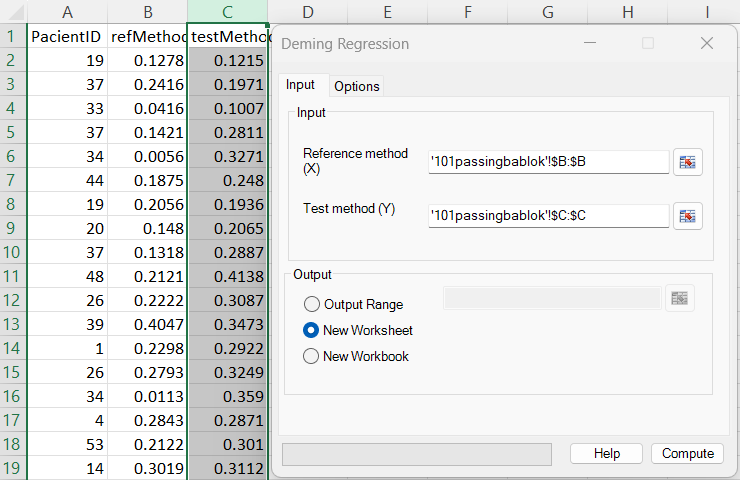
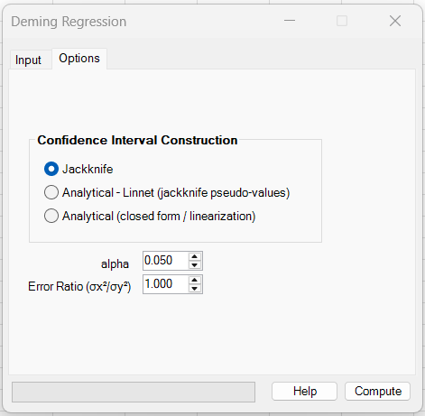
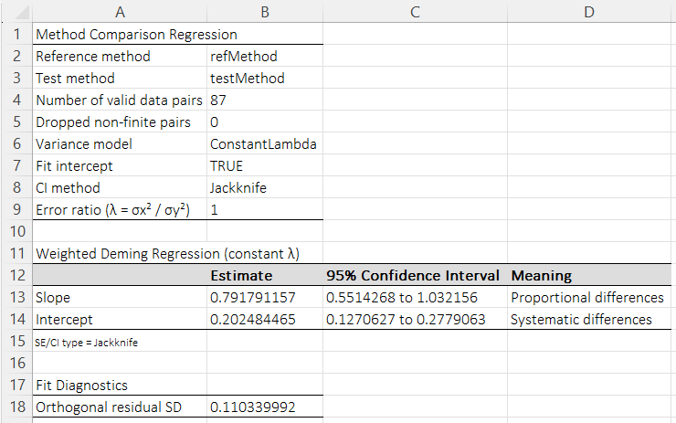
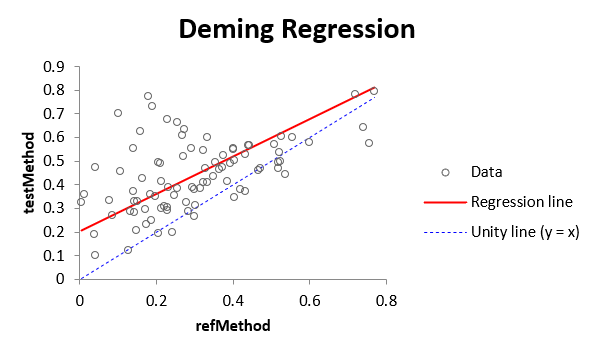

# Deming Regression

**Includes:** Classical Deming regression (constant error ratio), orthogonal regression as a special case when the error ratio is 1, and generalized weighted Deming regression with **constant lambda**, **constant CV**, or **known pointwise SD** variance models; confidence intervals via **Jackknife**, **Analytical – Linnet (jackknife pseudo-values)**, **Analytical (closed form / linearization)**, **Bootstrap Percentile**, or **Bootstrap BCa**; regression plot with unity line.  
**Purpose:** Use when **both X and Y have measurement error** and you want a symmetric method-comparison regression.

---

## Overview

Deming regression is a linear **errors-in-variables** model used for **method comparison** when both axes are measured with error.  
When the error ratio is 1, the classical Deming fit reduces to **orthogonal regression**.

Let the unobserved (“true”) values satisfy a linear relationship:

$$
Y^* = \alpha + \beta X^*
$$

Observed values include measurement errors:

$$
x = X^* + \varepsilon_x, \qquad y = Y^* + \varepsilon_y
$$

The Deming model assumes:

- measurement errors have mean 0,
- measurement errors are independent of the true values,
- the relative error structure is known or chosen,
- paired rows represent paired measurements of the same sample/item.

The add-in supports three variance-model formulations:

1. **Constant lambda** – the classical Deming model with a fixed variance ratio
2. **Constant CV** – measurement error proportional to magnitude using constant coefficients of variation
3. **Known pointwise SD** – user-supplied observation-level standard deviations for X and Y

---

## Error-ratio convention used in the add-in

For the classical Deming model, the add-in uses:

$$
\lambda = \frac{\sigma_x^2}{\sigma_y^2}
$$

where:

- \(\sigma_x^2\) is the measurement error variance of the **reference method (X)**
- \(\sigma_y^2\) is the measurement error variance of the **test method (Y)**

> **Important:** Some software uses the inverse definition  
> \(\delta = \sigma_y^2 / \sigma_x^2\).  
> In this add-in, the **Error Ratio** is **\(\lambda = \sigma_x^2 / \sigma_y^2\)**.  
> If you have \(\delta\), use \(\lambda = 1 / \delta\).

Interpretation for the **Constant lambda** model:

- **\(\lambda = 1\)** → equal measurement error in X and Y → orthogonal regression
- **\(\lambda > 1\)** → X is noisier than Y
- **\(\lambda < 1\)** → Y is noisier than X

---

## Input

### Reference method (X)
Select the range containing the reference method measurements.

### Test method (Y)
Select the range containing the test method measurements.

Both ranges must:

- contain the same number of rows,
- represent paired observations,
- align row-by-row.

Any pair containing a non-finite value is removed before fitting, and the number of dropped pairs is reported in the results table.

---

## Options

The **Options** tab now controls both the confidence-interval method and the variance model.

### Confidence Interval Type

The current UI provides five choices.

#### 1) Jackknife

This is the default and most general option.

For a parameter \(\hat\theta\) (intercept or slope), let \(\hat\theta_{(i)}\) be the leave-one-out estimate. The delete-1 jackknife standard error is:

$$
SE(\hat\theta) = \sqrt{\frac{n-1}{n}\sum_{i=1}^{n}\left(\hat\theta_{(i)} - \bar\theta\right)^2}
$$

with:

$$
\bar\theta = \frac{1}{n}\sum_{i=1}^{n}\hat\theta_{(i)}
$$

Confidence intervals are reported as:

$$
\hat\theta \pm t_{1-\alpha/2,\,df}\;SE(\hat\theta)
$$

using \(df = n - 2\) by default.

This method is available for:

- Constant lambda
- Constant CV
- Known pointwise SD
- Fit intercept = on/off

The results footnote reports:

- **SE / CI type = Jackknife**

#### 2) Analytical – Linnet (jackknife pseudo-values)

This analytical option is intended for the **classical constant-lambda Deming model with intercept** and follows the Linnet / method-comparison style used in software such as **mcr**.

Let \(\hat\theta\) be the full-sample estimate and \(\hat\theta_{(i)}\) the leave-one-out estimate. The pseudo-values are:

$$
p_i = n\,\hat\theta - (n-1)\,\hat\theta_{(i)}
$$

and the standard error is:

$$
SE(\hat\theta) = \frac{sd(p_1,\dots,p_n)}{\sqrt{n}}
$$

Confidence intervals are then formed as Wald/t intervals using \(df = n - 2\).

The results footnote reports:

- **SE / CI type = Analytical – Linnet (jackknife pseudo-values)**

#### 3) Analytical (closed form / linearization)

This analytical option is also intended for the **classical constant-lambda Deming model with intercept**.

The point estimates \((\hat\alpha, \hat\beta)\) are computed in closed form, and standard errors are obtained from a **linearization / observed-information approximation**.

Define residuals:

$$
r_i = y_i - \hat\alpha - \hat\beta x_i
$$

and let:

$$
\delta = \frac{\sigma_y^2}{\sigma_x^2} = \frac{1}{\lambda},
\qquad
D = \delta + \hat\beta^2
$$

A normalized residual form is:

$$
u_i = \frac{r_i}{\sqrt{D}}
$$

The covariance matrix of \((\hat\alpha, \hat\beta)\) is then approximated from the Jacobian / information matrix.

Confidence intervals are reported as Wald/t intervals with \(df = n - 2\).

The results footnote reports:

- **SE / CI type = Analytical (closed form / linearization)**

#### 4) Bootstrap Percentile

Bootstrap percentile intervals are available for all currently exposed variance models.

The add-in:

1. resamples paired observations with replacement,
2. refits the Deming model in each bootstrap sample,
3. forms percentile intervals from the bootstrap distribution of intercept and slope.

The number of resamples is controlled by **Bootstrap Replicates**.

The results footnote reports:

- **SE / CI type = Bootstrap percentile**

#### 5) Bootstrap BCa

The add-in:

1. resamples paired observations with replacement,
2. refits the Deming model in each bootstrap sample,
3. uses jackknife leave-one-out estimates to obtain the BCa acceleration term,
4. forms **bias-corrected and accelerated (BCa)** intervals for intercept and slope.

The results footnote reports:

- **SE / CI type = Bootstrap BCa**

### Bootstrap seed and reproducibility

In the Excel GUI, **Deming Regression** does not expose a dedicated seed input for bootstrap confidence intervals.

Therefore the bootstrap seed is resolved as follows:

1. use the **Global Settings → Default Random Seed**, if it has been set;
2. otherwise use a **time-based seed**.

The concrete seed used for the bootstrap run is reported back in the output notes, for example:

- `Bootstrap seed = 123456789.`

This makes the bootstrap interval reproducible when the same input data, settings, and seed are used.

!!! tip
    If you want reproducible bootstrap confidence intervals across sessions, set **Default Random Seed** in **Global Settings** before running Deming bootstrap intervals.

### Which CI option should I prefer?

- **Jackknife**  
  Best general-purpose choice and the safest option when using **Constant CV** or **Known pointwise SD**.

- **Analytical – Linnet**  
  Best when you want output that matches common method-comparison software conventions for the classical constant-lambda Deming model.

- **Analytical (closed form / linearization)**  
  Best when speed matters and you are using the classical constant-lambda model with a fitted intercept.

- **Bootstrap Percentile**  
  Good when you want a non-analytic interval and can afford more computation time.

- **Bootstrap BCa**  
  Best when you want a bootstrap interval that adjusts for bias and skewness instead of using simple percentile limits.

---

### Alpha

The two-sided significance level \(\alpha\) used for confidence intervals.

Default:

```text
0.050
```

which corresponds to a 95% confidence interval.

---

### Variance Model

The **Variance Model** determines how measurement error in X and Y is represented.

#### Constant lambda

This is the classical Deming model.

Use when you have a single justified error ratio:

$$
\lambda = \frac{\sigma_x^2}{\sigma_y^2}
$$

This model uses the **Error Ratio** control.

#### Constant CV

Use when the measurement standard deviation is assumed proportional to the magnitude of the observation:

$$
SD_x(i) \approx CV_x \cdot |x_i|,
\qquad
SD_y(i) \approx CV_y \cdot |y_i|
$$

Use this when assay or instrument error is better described as a roughly constant coefficient of variation over the measurement range.

This model uses the **CVx** and **CVy** controls.

#### Known pointwise SD

Use when you already have per-observation uncertainty estimates for both methods.

You provide two ranges:

- **SDx** – pointwise standard deviations for the reference method
- **SDy** – pointwise standard deviations for the test method

These ranges must correspond to the original paired observations and be aligned row-by-row with X and Y.

---

### Fit Intercept

If **Fit Intercept** is checked, the model fitted is:

$$
y = \alpha + \beta x
$$

If **Fit Intercept** is unchecked, the model is constrained through the origin:

$$
y = \beta x
$$

Use the origin-constrained form only when a zero intercept is scientifically justified.

---

### Error Ratio

This control is used only for **Constant lambda**.

In the add-in:

$$
\lambda = \frac{\sigma_x^2}{\sigma_y^2}
$$

The results sheet now reports the selected error ratio explicitly when the Constant lambda model is used.

---

### CVx and CVy

These controls are used only for **Constant CV**.

- **CVx** – coefficient of variation for the reference method
- **CVy** – coefficient of variation for the test method

The add-in uses them to construct observation-level standard deviations from the current X and Y values.

---

### SDx and SDy

These controls are used only for **Known pointwise SD**.

Select ranges containing the observation-level standard deviations for X and Y.

The supplied SD arrays must match the original data length and order.

---

## Steps in the add-in

1. Ribbon: **BESH Stat NG → Analyse → Agreement → Deming Regression**
2. In **Input**:
   - select **Reference method (X)** and **Test method (Y)**
   - choose output destination
3. In **Options**:
   - choose a confidence-interval method,
   - set **alpha**,
   - choose the **Variance Model**,
   - set the model-specific parameters:
     - **Error Ratio** for Constant lambda,
     - **CVx/CVy** for Constant CV,
     - **SDx/SDy** for Known pointwise SD,
   - choose whether to **Fit Intercept**
4. Click **Compute**

---

## Screenshots

### Input screen



### Options



### Results





---

## Method and mathematics

### Classical Deming point estimates (Constant lambda)

Let \(\bar x\), \(\bar y\) be sample means and define sample moments:

$$
S_{xx}=\frac{1}{n-1}\sum_{i=1}^{n}(x_i-\bar x)^2,
\qquad
S_{yy}=\frac{1}{n-1}\sum_{i=1}^{n}(y_i-\bar y)^2,
\qquad
S_{xy}=\frac{1}{n-1}\sum_{i=1}^{n}(x_i-\bar x)(y_i-\bar y)
$$

With:

$$
\delta = \frac{\sigma_y^2}{\sigma_x^2} = \frac{1}{\lambda}
$$

the classical Deming slope is:

$$
\hat\beta =
\frac{S_{yy}-\delta S_{xx} + \operatorname{sign}(S_{xy})\sqrt{(S_{yy}-\delta S_{xx})^2 + 4\delta S_{xy}^2}}{2S_{xy}}
$$

and the intercept is:

$$
\hat\alpha = \bar y - \hat\beta\bar x
$$

When \(\lambda = 1\), this becomes orthogonal regression.

### Objective view

The classical Deming fit can be viewed as minimizing a weighted squared-distance criterion:

$$
Q(\alpha,\beta)=\sum_{i=1}^{n}\frac{(y_i-\alpha-\beta x_i)^2}{\delta+\beta^2}
\qquad\left(\delta=\frac{\sigma_y^2}{\sigma_x^2}\right)
$$

### Generalized weighted Deming

For the generalized weighted models, the add-in uses observation-level standard deviations for X and Y and fits the line using a York-style weighted errors-in-variables iteration.

This is the model used for:

- **Constant CV**
- **Known pointwise SD**
- **through-origin generalized fits**

In practical terms, that means the add-in supports more than the classical single-error-ratio Deming workflow, while keeping the classical case as the default method-comparison model.

---

## Output and interpretation

The results worksheet now contains:

- **Reference method** and **Test method**
- **Number of valid data pairs**
- **Dropped non-finite pairs**
- **Variance model**
- **Fit intercept**
- **CI method**
- **Error ratio** (for Constant lambda)
- **Slope** with CI (interpreted as proportional differences)
- **Intercept** with CI (interpreted as systematic differences)
- **SE / CI type** footnote
- **Orthogonal residual SD**
- **Bootstrap seed** in the notes, when a bootstrap CI method is used

### How to interpret slope and intercept

| Quantity | Interpretation |
|---|---|
| \(\hat\beta \neq 1\) | proportional difference / scaling bias |
| \(\hat\alpha \neq 0\) | systematic difference / constant bias |
| CI for \(\beta\) includes 1 | no evidence of proportional bias |
| CI for \(\alpha\) includes 0 | no evidence of constant bias |

### Plot

The regression plot shows:

- scatter of paired data,
- fitted Deming regression line,
- unity line \(y=x\) for visual comparison.

---

## Example dataset

The example uses the same data as the Passing–Bablok page:

- ignore the first column (`PacientID` / ID)
- use:
  - **Reference method (X):** `refMethod`
  - **Test method (Y):** `testMethod`

Download the example dataset used here: [101passingbablok.csv](../assets/data/101passingbablok/101passingbablok.csv)

---

## R code for reference

### Classical Deming using **mcr**

```r
library(mcr)

d <- read.csv("101passingbablok.csv")

fit_jack <- mcreg(
  x = d$refMethod,
  y = d$testMethod,
  method.reg = "Deming",
  method.ci  = "jackknife",
  error.ratio = 1,
  alpha = 0.05
)

fit_ana <- mcreg(
  x = d$refMethod,
  y = d$testMethod,
  method.reg = "Deming",
  method.ci  = "analytical",
  error.ratio = 1,
  alpha = 0.05
)

summary(fit_jack)
summary(fit_ana)
```

### Notes on matching software

- Some software uses \(\delta = \sigma_y^2/\sigma_x^2\) instead of \(\lambda = \sigma_x^2/\sigma_y^2\). Convert using \(\lambda = 1/\delta\).
- “Analytical” intervals do not always mean the same thing across tools. Some correspond to Linnet pseudo-values; others correspond to closed-form / linearization approximations.
- For generalized weighted Deming settings (constant CV or known pointwise SD), exact matching with standard `mcr` Deming output is not expected unless the same weighting model is used.
- Bootstrap intervals can differ slightly when packages use different random seeds, bootstrap percentile conventions, or BCa implementations.

---

## Relation to Passing–Bablok Regression

Both Deming and Passing–Bablok regression are used for method comparison, but they differ in assumptions and robustness.

### Deming vs Passing–Bablok (practical guidance)

Use **Deming regression** when:

- you have a justified measurement error structure,
- you want a parametric method-comparison model,
- you want to use a constant error ratio, CV-based weighting, or pointwise uncertainty information.

Use **Passing–Bablok regression** when:

- you prefer a robust, non-parametric approach,
- outliers or non-normal errors are a concern,
- you do not want to specify a measurement-error structure.

A practical workflow is often to report both:

- **Passing–Bablok** for robustness / sensitivity,
- **Deming** for model-based estimation when an error structure is available.

---

## Notes and limitations

- The Deming slope is sensitive to the chosen error structure. If the selected variance model is wrong, slope and intercept may be biased.
- For the classical model, misspecifying the **Error Ratio** can materially change the slope.
- If the association is degenerate (for example \(S_{xy}=0\) in the classical model), the slope is undefined.
- **Analytical – Linnet** and **Analytical (closed form)** are primarily classical constant-lambda Deming options.
- For generalized weighted models, if an exact analytical interval is not implemented, the add-in falls back to jackknife and reports that in the notes.

---

## References

- Deming, W. E. (1943). *Statistical Adjustment of Data*. Wiley.
- Fuller, W. A. (1987). *Measurement Error Models*. Wiley.
- Linnet, K. (1990). Estimation of the linear relationship between two methods of measurement.
- Linnet, K. (1993). Evaluation of regression procedures for methods comparison studies. *Clinical Chemistry*, 39(3), 424–432.
- Passing, H., & Bablok, W. (1983). A new biometrical procedure for testing the equality of measurements from two different analytical methods.

## See also
- [Passing–Bablok Regression](passing-bablok-regression.md)
- [Bland–Altman Plot](bland-altman.md)
- [Intraclass Correlation Coefficients](intraclass-correlation-coefficients.md)
- [Resampling in BESH Stat NG](resampling.md)
- [Home](../index.md)
