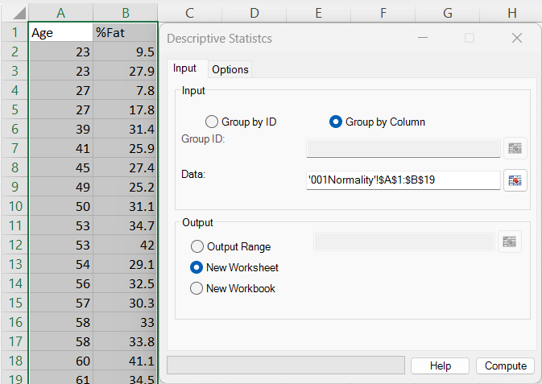
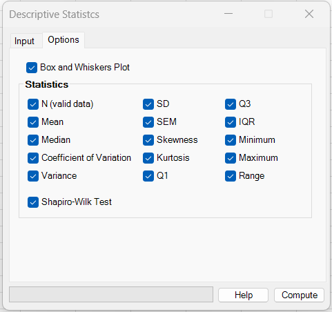
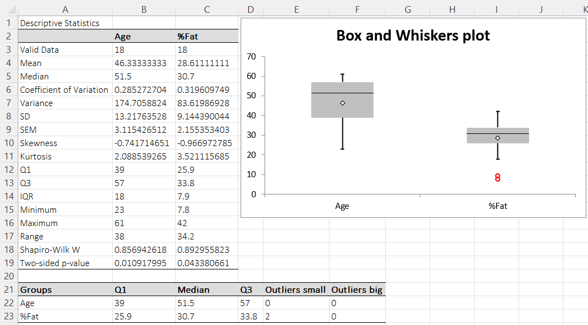

# Descriptive Statistics

**Includes:** n, mean, median, SD / variance, SEM, CV, skewness / kurtosis, Q1 / Q3, IQR, min / max / range, Shapiro–Wilk (optional).  
**Purpose:** Compute a compact set of summary statistics for one or multiple variables, optionally adding a normality check.

---

## Overview

The **Descriptive Statistics** tool summarizes each selected dataset (each column / group) with common measures of location, spread, and shape.

Typical use cases:

- Quick summary of multiple variables (mean, SD, quartiles, etc.)
- Comparing groups before running hypothesis tests
- Finding potential outliers via **box-and-whiskers** visualization
- Checking normality via **Shapiro–Wilk** (when enabled)

---

## Dialog: input and options

### Input tab

You can define datasets in two ways (same conventions as other Assumptions tools):

**A) Group by Column**

- Select a rectangular range where **each column is one variable**.
- The **first row is treated as a column name**.
- Non-numeric / empty cells are ignored per column.

**B) Group by ID**
Use this for a “long” format:

| GroupID | Value |
|---|---|
| A | 12.3 |
| A | 11.7 |
| B | 9.8 |
| ... | ... |

- **Group ID:** range containing group labels
- **Data:** numeric values
- Output is produced per group label.

---

### Options tab

You can select which statistics to output and whether to include:

- **Box and Whiskers Plot**
- **Shapiro–Wilk Test**

---

## What it does

For each dataset \(x_1, x_2, \dots, x_n\) (after cleaning), BESHStatNG computes the selected statistics below.

!!! note "Implementation"
    The calculations are implemented in `DescriptiveStat.compute()` and supporting routines in `src/BaseStat/StatFunc.vb`.

---

## Mathematical definitions

### Sample size

\[
n = \text{number of valid (numeric) observations}
\]

### Mean

\[
\bar{x} = \frac{1}{n}\sum_{i=1}^n x_i
\]

### Median

BESHStatNG uses the standard median of the sorted data:

- if \(n\) is odd: the middle value
- if \(n\) is even: the average of the two middle values

### Variance and standard deviation

BESHStatNG reports the **sample variance** and **sample standard deviation**:

\[
s^2 = \frac{1}{n-1}\sum_{i=1}^n (x_i-\bar{x})^2
\qquad
s = \sqrt{s^2}
\]

### Standard error of the mean (SEM)

\[
\mathrm{SEM} = \frac{s}{\sqrt{n}}
\]

### Coefficient of variation (CV)

\[
\mathrm{CV} = \frac{s}{\bar{x}}
\]

!!! warning "CV when mean is near zero"
    If \(\bar{x}\) is close to zero, CV can become very large or unstable. BESHStatNG does not compute CV when \(\bar{x}=0\).

### Minimum, maximum, range

\[
\min(x),\quad \max(x),\quad \mathrm{Range}=\max(x)-\min(x)
\]

---

## Quartiles and IQR

BESHStatNG computes quartiles using the **CDF method (SAS Method 5)**:

1. Sort the data \(x_{(1)} \le \dots \le x_{(n)}\).
2. For \(p \in \{0.25, 0.75\}\), compute the rank \(r = p\,n\).

If \(r\) is an integer, the quartile is the mean of the values at ranks \(r\) and \(r+1\):

\[
Q_p = \frac{x_{(r)} + x_{(r+1)}}{2}
\]

If \(r\) is not an integer, let \(k=\mathrm{ceil}(r)\) (the smallest integer \(\ge r\)), and take:

\[
Q_p = x_{(k)}
\]

Then:

\[
Q_1 = Q_{0.25},\quad Q_3 = Q_{0.75},\quad \mathrm{IQR} = Q_3 - Q_1
\]

!!! tip "R and SAS comparison for quartiles"
    BESHStatNG computes \(Q_1\) and \(Q_3\) using **SAS percentile definition 5** (often referred to as *CDF method / PCTLDEF=5*: empirical distribution function with averaging at discontinuities).
    This rule is equivalent to **R** `quantile(x, probs = c(0.25, 0.5, 0.75), type = 2)` (the *averaged inverse empirical CDF*).

    **Defaults differ:** R’s default is `type = 7` (linear interpolation with \(h = 1 + (n-1)p\)), so quartiles may not match unless you set `type = 2`.
    In **SAS**, many procedures (for example `PROC UNIVARIATE`) default to `PCTLDEF=5`, but you can change the definition via `PCTLDEF=` (or `QNTLDEF=` in procedures that use that option).

---

## Skewness and kurtosis

BESHStatNG uses the **moment (population) definitions** based on central moments divided by \(n\):

\[
m_2 = \frac{1}{n}\sum_{i=1}^n (x_i-\bar{x})^2,
\quad
m_3 = \frac{1}{n}\sum_{i=1}^n (x_i-\bar{x})^3,
\quad
m_4 = \frac{1}{n}\sum_{i=1}^n (x_i-\bar{x})^4
\]

### Skewness

\[
\mathrm{Skewness} = \frac{m_3}{m_2^{3/2}}
\]

### Kurtosis (Pearson kurtosis)

\[
\mathrm{Kurtosis} = \frac{m_4}{m_2^{2}}
\]

!!! note "Kurtosis scale"
    This is **Pearson kurtosis** (normal distribution has kurtosis \(=3\)). It is **not** “excess kurtosis” (which would be kurtosis \(-3\)).

---

## Shapiro–Wilk normality test (optional)

When enabled, BESHStatNG reports:

- **Shapiro–Wilk \(W\)** statistic
- **Two-sided p-value**

The test is run only when \(n>3\) and \(n<5000\) (see `DescriptiveStat.compute()`).

!!! note "R comparison"
    R provides `shapiro.test(x)` (valid for sample sizes up to 5000). BESHStatNG uses an internal implementation and reports the same outputs: \(W\) and a two-sided p-value.

---

## Box and Whiskers plot (optional)

When enabled, BESHStatNG generates a boxplot and an extra small summary table containing:

- \(Q_1\), median, \(Q_3\)
- number of **small outliers** and **big outliers**

Outliers are detected using **Tukey’s 1.5×IQR rule** (implemented in `src/Graphics/BoxPlot.vb`).

Lower threshold:

\[
Q_1 - 1.5\,\mathrm{IQR}
\]

Upper threshold:

\[
Q_3 + 1.5\,\mathrm{IQR}
\]

A value is counted as a **small outlier** (lower tail) if:

\[
x < Q_1 - 1.5\,\mathrm{IQR}
\]

A value is counted as a **big outlier** (upper tail) if:

\[
x > Q_3 + 1.5\,\mathrm{IQR}
\]

!!! note "Naming"
    In the output table, **Outliers s** means *small (lower)* outliers and **Outliers big** means *upper* outliers.

---

## Example (using `001Normality.csv`)

You can reproduce the screenshots using the example dataset:

- [001Normality.csv](../assets/data/001normality/001Normality.csv)

**Steps**

1. Open `001Normality.csv` in Excel.
2. Select the two columns **Age** and **%Fat** (including the header row).
3. Ribbon → **BESH Stat NG → Analyse → Assumptions → Descriptive Statistics**
4. Choose **Group by Column** and select the data range.
5. Enable:
   - the desired statistics
   - **Box and Whiskers Plot**
   - **Shapiro–Wilk Test**
6. Output to **New Worksheet** → **Compute**.

**Interpretation (based on the example output)**

- Both variables are summarized (mean, median, SD, quartiles, etc.).
- The boxplot highlights potential outliers in **%Fat** (two lower-tail outliers are flagged in the “Outliers s” column).
- Shapiro–Wilk p-values below 0.05 suggest evidence against normality for those variables in this small sample (interpret alongside plots and context).

---

## See also

- [Box and Whiskers](box-and-whiskers.md)
- [Normality Tests](normality-tests.md)
- [Symmetry](symmetry.md)
- [Home](../index.md)
