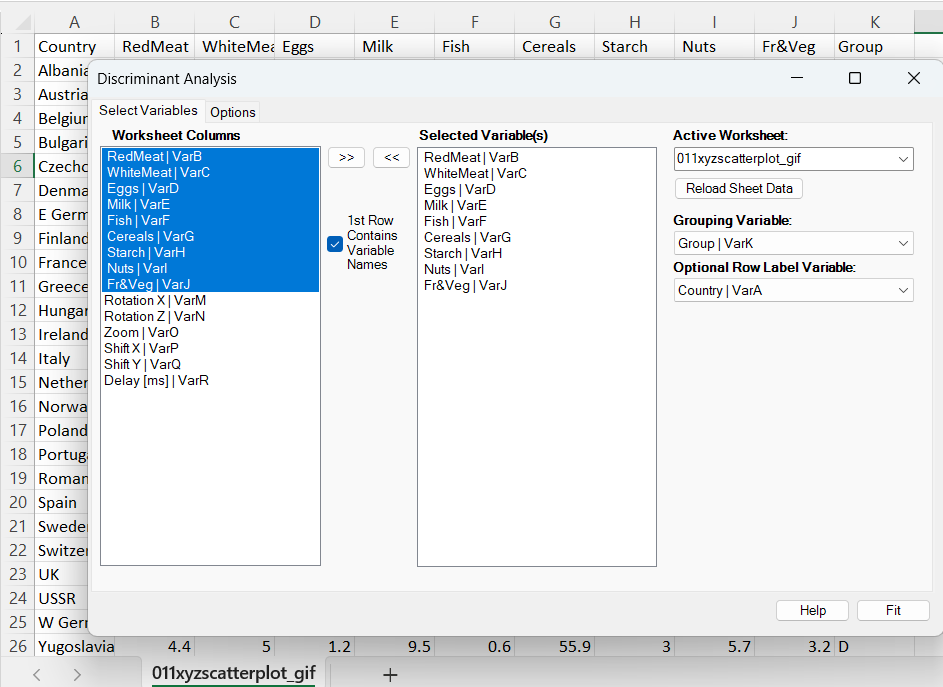
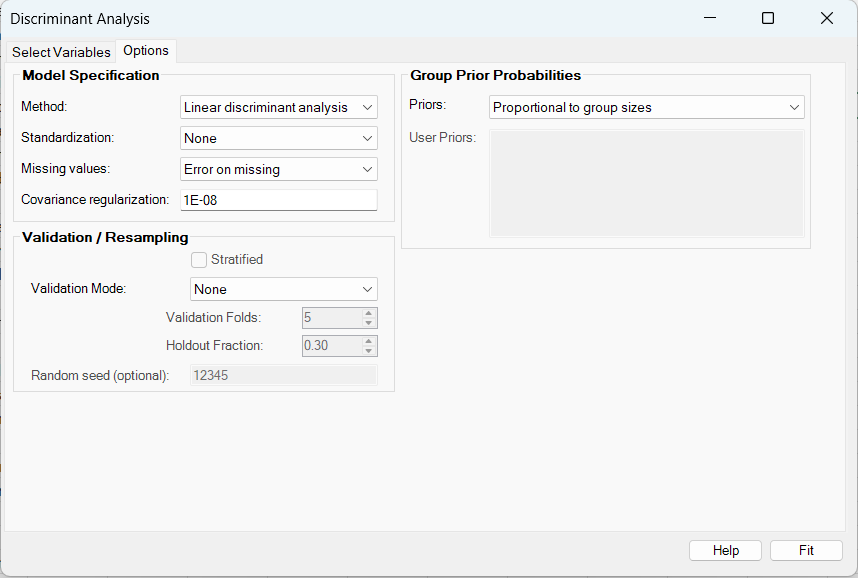
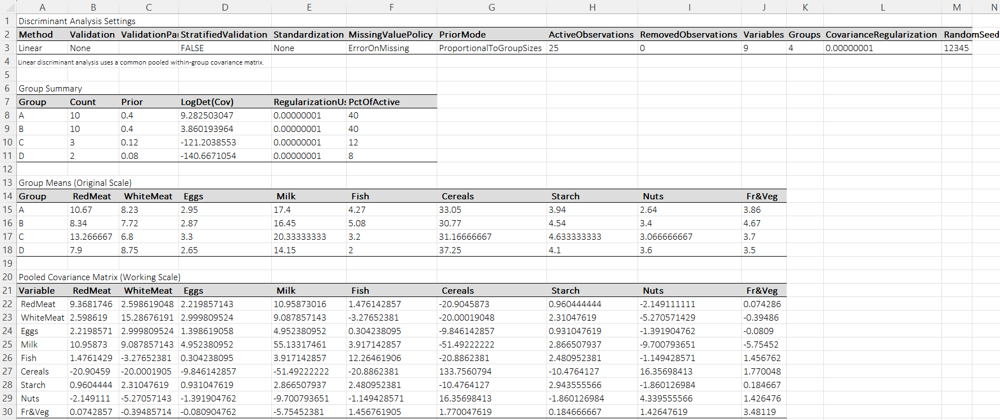
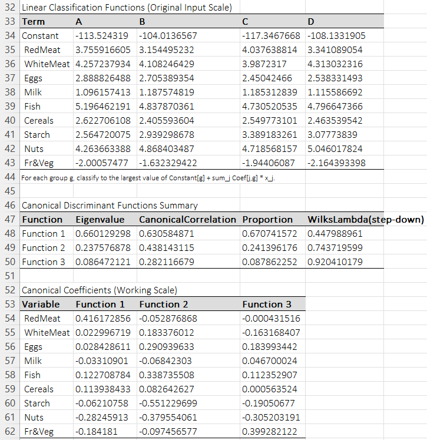
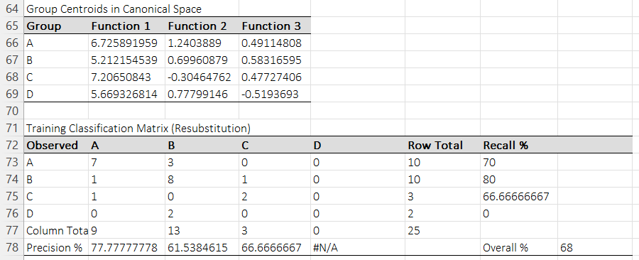
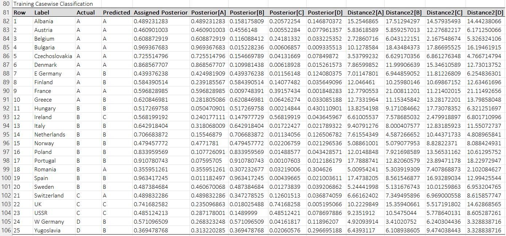

# Discriminant Analysis

**Includes:** Linear discriminant analysis (LDA), quadratic discriminant analysis (QDA), classification of training and new observations, posterior probabilities, squared Mahalanobis distances, proportional / equal / user-specified priors, optional preprocessing, missing-value handling, leave-one-out validation, k-fold validation, holdout validation, linear classification functions, and canonical discriminant functions for LDA.  
**Purpose:** Classify observations into known groups and understand which linear combinations of variables best separate those groups.

---

## Overview

Discriminant analysis is a **supervised multivariate classification method**.
Unlike clustering, the groups are already known in the training data. The goal is to learn decision rules that assign each observation to one of those groups using a set of numeric predictor variables.

In BESHStatNG, the grouping variable can be text or numeric, while the predictors must be numeric.
The procedure supports two classical model families:

- **Linear discriminant analysis (LDA)**: all groups share one common within-group covariance matrix,
- **Quadratic discriminant analysis (QDA)**: each group has its own covariance matrix.

The output is designed for both **prediction** and **interpretation**. Depending on the selected method and options, it can include:

- a **Data** sheet with the imported analysis data,
- a **Discriminant results** sheet with settings and group summaries,
- **group means** on the original scale,
- **preprocessing constants** and working-scale means when standardization is used,
- a **pooled covariance matrix** for LDA or **group-specific covariance matrices** for QDA,
- **linear classification functions** for LDA,
- **canonical discriminant functions** for LDA,
- a **training classification matrix**,
- **casewise classifications** with posterior probabilities and squared distances,
- and optional **validation classification matrices** and **validation casewise output**.

---

## Example dataset

This page uses the same **protein consumption by country** example used elsewhere in the multivariate help.

Download the data:

- [011xyzscatterplot_gif.csv](../assets/data/011xyzscatterplot/011xyzscatterplot_gif.csv)

For the screenshot example:

- **Predictors:** `RedMeat`, `WhiteMeat`, `Eggs`, `Milk`, `Fish`, `Cereals`, `Starch`, `Nuts`, `Fr&Veg`
- **Grouping variable:** `Group`
- **Optional row label variable:** `Country`

The `Group` column contains four known classes: **A**, **B**, **C**, and **D**.
The `Country` column is used only as a label in the casewise output and is not part of the discriminant model itself.

---

## Screenshots

### Select Variables tab



### Options tab



### Results sheet: settings, group summary, means, pooled covariance



### Results sheet: linear classification functions and canonical summary



### Results sheet: canonical group centroids and training classification matrix



### Results sheet: casewise training classification



---

## Brief interpretation of the example

The screenshot example uses:

- **Method:** Linear discriminant analysis
- **Standardization:** None
- **Missing values:** Error on missing
- **Priors:** Proportional to group sizes
- **Validation:** None
- **Covariance regularization:** \(10^{-8}\)

### What the group summary says

The example contains 25 active observations in 4 groups:

- **A:** 10
- **B:** 10
- **C:** 3
- **D:** 2

Because the priors are proportional to group sizes, the fitted prior probabilities are:

- \(\pi_A = 0.40\)
- \(\pi_B = 0.40\)
- \(\pi_C = 0.12\)
- \(\pi_D = 0.08\)

This means the classifier gives more prior weight to the larger groups A and B than to the much smaller groups C and D.

### What the canonical summary says

For 4 groups, LDA can produce at most

$$
\min(p, G-1)=\min(9,3)=3
$$

canonical discriminant functions.
In the screenshot, the first function explains about **67.1%** of the canonical discrimination, the second about **24.1%**, and the third about **8.8%**.
So most of the between-group separation is already captured by the first one or two functions.

### What the training classification says

The resubstitution confusion matrix shows an **overall training accuracy of 68%**.
Groups **A** and **B** are recovered moderately well, **C** is only partly recovered, and **D** is not recovered at all in the training classification shown.

That is not surprising, because:

- groups **C** and especially **D** are very small,
- the model is trying to separate 4 groups using 9 predictors,
- and the fitted priors favor the larger groups.

So the example is useful for illustrating the output, but it also shows an important practical lesson: **small classes are hard to estimate and hard to predict reliably**.

---

## When to use it

Use discriminant analysis when you want to:

- classify observations into **known groups**,
- understand which variables best separate those groups,
- compute **posterior class probabilities** and **classification tables**,
- compare a pooled-covariance classifier (LDA) with a group-specific-covariance classifier (QDA),
- reduce group separation to a small number of **canonical discriminant functions**.

It is especially useful when:

- the outcome is a small set of known classes,
- the predictors are continuous numeric variables,
- the sample is not so large that a more flexible machine-learning method is required,
- interpretability matters as much as predictive performance.

### When LDA is often preferred

LDA is often the first method to try when:

- group covariance patterns look broadly similar,
- the sample size is modest,
- some groups are small,
- you want stable estimates and interpretable canonical functions.

### When QDA is often preferred

QDA is often worth trying when:

- different groups clearly have different covariance structures,
- the class boundaries appear curved rather than roughly linear,
- every group has enough observations to estimate its own covariance matrix reliably.

### When discriminant analysis is a poor fit

Be cautious when:

- some groups have very few observations,
- the predictors are strongly non-Gaussian with many outliers,
- the number of predictors is large relative to the group sample sizes,
- the classes overlap heavily,
- the grouping variable is not a real supervised label but an exploratory construct.

In such cases, strong regularization, variable reduction, or another classifier may be more appropriate.

---

## Inputs in Excel

### Selecting variables

On the **Select Variables** tab:

- move the numeric predictor columns to **Selected Variable(s)**,
- choose the **Grouping Variable**,
- optionally choose a **Row Label Variable** for casewise output,
- use **Reload Sheet Data** if you switch worksheets.

The grouping variable must **not** also appear among the selected predictors.

### Grouping variable

The grouping variable can be text or numeric.
Internally, BESHStatNG treats the group labels as class identifiers and fits one mean vector per distinct group.

### Optional row labels

The optional row label variable is never used in the classification formulas.
It is only used to label rows in the casewise output.

### First row contains variable names

The standard workflow assumes that row 1 contains variable names.
Those names are used in the results tables.

### Missing values

The procedure supports two missing-data policies:

- **Error on missing**
- **Listwise deletion**

If listwise deletion is selected, incomplete rows are removed before fitting and are reported separately in the output.

---

## Options in BESHStatNG

## 1) Method

### Linear discriminant analysis

LDA assumes that all groups share one common within-group covariance matrix.
The group means may differ, but the covariance matrix is pooled across groups.

Use it when:

- you want the classical Fisher / pooled-covariance classifier,
- groups are small or moderately sized,
- covariance matrices do not appear radically different,
- you want canonical discriminant functions.

Why: pooling covariance information usually stabilizes estimation, especially when some groups are small.

### Quadratic discriminant analysis

QDA estimates a separate covariance matrix for every group.
This allows the class boundaries to curve.

Use it when:

- the within-group covariance structures are meaningfully different,
- you have enough data in each group,
- you care more about flexibility than about the simplest decision rule.

Why: when covariance matrices truly differ, QDA is the correct Gaussian discriminant rule and can fit more realistic boundaries.

Trade-off: it estimates many more parameters than LDA, so it is more sensitive to small sample sizes and near-singular covariance matrices.

---

## 2) Standardization

### None

Use **None** when:

- all predictors are already on comparable scales,
- the original measurement units are meaningful,
- you intentionally want high-variance variables to carry more weight.

### Z-scores

Each variable is centered by its sample mean and divided by its sample standard deviation.

Use z-scores when:

- predictors are measured in different units,
- scale differences are not substantively meaningful,
- you want each variable to contribute on a more comparable footing.

This is often the safest first choice when variables have very different magnitudes.

### Range 0 to 1

Each variable is transformed to the interval \([0,1]\) using its observed minimum and maximum.

Use this when:

- variables are naturally bounded,
- you want a common min–max scale,
- you want easy interpretability in terms of observed minima and maxima.

Trade-off: min–max scaling can be strongly affected by extreme values.

---

## 3) Missing values

### Error on missing

Choose this when:

- missingness indicates a likely data problem,
- you want to inspect the sheet before fitting,
- you do not want the active analysis sample to change silently.

### Listwise deletion

Choose this when:

- only a small fraction of rows are incomplete,
- complete-case analysis is acceptable,
- you want the model to proceed automatically after removing incomplete observations.

Be cautious when many rows would be removed or when missingness is related to group membership, because the fitted class summaries may then be biased.

---

## 4) Covariance regularization

The regularization setting adds a small ridge value to the diagonal of covariance matrices when needed:

$$
\Sigma_{\text{reg}} = \Sigma + \lambda I.
$$

In BESHStatNG, the supplied value is treated as a **base diagonal ridge**. If the matrix is still not numerically positive definite, the procedure increases the ridge further until inversion is stable.

Use a very small positive value such as \(10^{-8}\) when:

- you want numerical protection against nearly singular covariance matrices,
- the sample size is only slightly larger than the number of predictors,
- some predictors are highly collinear.

Increase it when:

- inversions are unstable,
- QDA covariance matrices become ill-conditioned,
- tiny groups make covariance estimation fragile.

Trade-off: larger regularization improves numerical stability but slightly shrinks the covariance structure toward a spherical form.

---

## 5) Group prior probabilities

### Proportional to group sizes

The priors are estimated from the active training sample:

$$
\pi_g = \frac{n_g}{n}.
$$

Use this when:

- the observed class frequencies are representative of the real population,
- you want the fitted classifier to reflect the empirical prevalence of the groups.

Why: this is often a reasonable default for descriptive classification.

### Equal

Every group gets the same prior:

$$
\pi_g = \frac{1}{G}.
$$

Use this when:

- class sizes are imbalanced but you do not want the majority class to dominate,
- the scientific question treats the groups symmetrically,
- the training sample frequencies are not representative of deployment frequencies.

Why: equal priors make the classifier more neutral across classes.

### User-specified

You can manually enter priors such as:

```text
A=0.25; B=0.25; C=0.25; D=0.25
```

or one definition per line.

Use this when:

- you know the target population prevalences,
- misclassification costs or deployment conditions imply a specific prior structure,
- you need to reproduce another software workflow exactly.

Why: the prior probabilities shift the decision rule by \(\log \pi_g\), so they can materially change the final class assignments.

!!! note
    User-specified priors should be positive and should sum to 1. BESHStatNG normalizes them if needed.

---

## 6) Validation / resampling

### None

No extra validation pass is run.
The output still contains the **training (resubstitution) classification matrix**, which evaluates the fitted model on the same data used to train it.

Use this when:

- you are mainly interested in the fitted discriminant functions,
- the analysis is descriptive rather than predictive,
- you plan to validate externally elsewhere.

### Leave-one-out

Each observation is left out once, the model is refit on the remaining observations, and the held-out case is classified.

Use this when:

- the sample is small,
- you want a deterministic nearly full-sample validation,
- you want something less optimistic than resubstitution accuracy.

Why: every case is tested out of sample while using almost all remaining data for training.

Trade-off: it can be computationally slower and somewhat high-variance in unstable problems.

### K-fold

The active data are split into \(K\) folds. Each fold is predicted by a model fitted on the other \(K-1\) folds.

Use this when:

- you want a more standard predictive-validation workflow,
- the sample is large enough to support several test folds,
- you want a compromise between computational cost and validation realism.

Practical defaults:

- **5-fold** is a good general default,
- **10-fold** is common when the sample is moderately large.

### Holdout

A single train/test split is created. The model is trained on the training subset and evaluated on the holdout subset.

Use this when:

- the dataset is large enough to sacrifice a test set,
- you want a simple one-shot external-style validation,
- speed matters more than repeated re-fitting.

Trade-off: one split can be noisy, especially in small samples.

---

## 7) Stratified validation

For **k-fold** and **holdout**, the split can be either stratified or unstratified.

### Stratified

Each group is split approximately in proportion to its own size.

Use this when:

- the classes are imbalanced,
- you want every fold or test split to contain representation from each class,
- you want more stable validation summaries.

This is usually the preferred setting.

### Unstratified

Rows are shuffled globally without preserving group proportions.

Use this only when:

- you explicitly want a purely random split,
- the classes are large enough that accidental imbalance is not a concern.

Be cautious when classes are rare, because some folds may then contain too few observations from a group.

---

## 8) Validation folds

This option is used only when **Validation Mode = K-fold**.

Use a smaller value such as 5 when:

- the dataset is small,
- class sizes are limited,
- you want larger training subsets in each split.

Use a larger value such as 10 when:

- the dataset is somewhat larger,
- every class still has enough observations per fold.

!!! note
    Stratified \(K\)-fold validation requires at least \(K\) complete observations in every group.

---

## 9) Holdout fraction

This option is used only when **Validation Mode = Holdout**.
It controls the fraction placed into the test set.

A value of **0.30** means roughly 30% test and 70% training.

Use smaller fractions when:

- some classes are small,
- training stability matters more than test size.

Use larger fractions when:

- the dataset is comfortably large,
- you want a more substantial test set.

The value must lie strictly between 0 and 1.

---

## 10) Random seed

The random seed controls the reproducibility of **k-fold** and **holdout** splits.

Use a fixed seed when:

- you want exact reproducibility,
- you need to compare methods on the same split,
- you are writing a report and want stable output.

Leave it empty only when you deliberately want a fresh random split each run.

---

## Choosing options: when to use which and why

### A practical default recipe

For many ordinary multivariate classification problems, a good first run is:

- **Method:** Linear discriminant analysis
- **Standardization:** Z-scores when predictors use different units
- **Missing values:** Error on missing for the first pass
- **Regularization:** \(10^{-8}\) or another very small positive value
- **Priors:** Proportional to group sizes unless there is a strong reason otherwise
- **Validation:** Leave-one-out for small samples, 5-fold stratified for moderate samples

This is a strong starting point because LDA is stable, interpretable, and usually adequate unless there is clear evidence that within-group covariance structures differ strongly.

### 1) LDA or QDA?

#### Prefer LDA when

- group sample sizes are small or uneven,
- predictors are numerous relative to group size,
- you need stable estimates,
- you want canonical discriminant functions.

Why: LDA estimates one pooled covariance matrix rather than one per group, so it uses the data more efficiently.

#### Prefer QDA when

- every group has a healthy sample size,
- covariance patterns differ materially between groups,
- classification boundaries are unlikely to be linear.

Why: QDA allows group-specific covariance geometry and therefore curved decision boundaries.

**General practical rule:** start with LDA, then move to QDA only if there is a substantive or empirical reason.

### 2) Priors: what do they change?

Priors do not change the group means or covariance estimates, but they **do change the classification rule**.
A larger prior raises the score of that group by \(\log \pi_g\).

So:

- choose **proportional priors** when prevalence matters,
- choose **equal priors** when fairness or balanced treatment matters,
- choose **user-specified priors** when the deployment population differs from the training sample.

### 3) Standardization: when does it matter most?

Standardization matters most when predictors are on different scales.
Without it, large-scale variables can dominate the covariance structure and therefore the classifier.

A good rule is:

- **same units, same scale, scale meaning matters** → None
- **different units or wildly different variances** → Z-scores
- **bounded indicators with natural minima/maxima** → Range 0 to 1

### 4) Validation mode: which one is best?

#### Small datasets

Prefer **Leave-one-out**.

Why: it uses nearly all available data for training on every refit.

#### Moderate datasets

Prefer **5-fold stratified** or **10-fold stratified**.

Why: it gives a more typical predictive assessment without the full cost of leave-one-out.

#### Large datasets

A **holdout** split can be perfectly reasonable.

Why: with enough data, a single train/test split is simple and easy to explain.

### 5) Regularization: when should you increase it?

Increase the ridge when:

- QDA is unstable,
- groups are very small,
- predictors are nearly collinear,
- covariance matrices are close to singular.

Keep it tiny when:

- the data are well behaved,
- the main goal is classical estimation with only minimal numerical protection.

---

## Output tables

### 1) Discriminant Analysis Settings

Includes:

- Method
- Validation
- ValidationParameter
- StratifiedValidation
- Standardization
- MissingValuePolicy
- PriorMode
- ActiveObservations
- RemovedObservations
- Variables
- Groups
- CovarianceRegularization
- RandomSeed

### 2) Group Summary

One row per group, including:

- Group
- Count
- Prior
- LogDet(Cov)
- RegularizationUsed
- PctOfActive

### 3) Group Means (Original Scale)

One row per group with the predictor means on the original input scale.

### 4) Group Means (Working Analysis Scale)

Reported only when standardization is used.
These are the group means after the selected preprocessing transformation.

### 5) Preprocessing Constants

Reported only when standardization is used.
Includes, per variable:

- Location
- Scale

For z-scores, these are the sample mean and sample standard deviation.
For range 0 to 1, they are the minimum and the observed range.

### 6) Pooled Covariance Matrix (Working Scale)

Reported for **LDA** only.
This is the pooled within-group covariance matrix used in the common-covariance discriminant rule.

### 7) Linear Classification Functions (Original Input Scale)

Reported for **LDA** only.
Gives one constant and one coefficient per predictor for each group.
A case is assigned to the group with the largest linear score.

### 8) Canonical Discriminant Functions Summary

Reported for **LDA** only when at least one positive canonical root is found.
Includes:

- Function
- Eigenvalue
- CanonicalCorrelation
- Proportion
- WilksLambda(step-down)

### 9) Canonical Coefficients (Working Scale)

Reported for **LDA** only.
These coefficients define the canonical discriminant variables on the working analysis scale.

### 10) Group Centroids in Canonical Space

Reported for **LDA** only.
These are the group means after projection into the canonical discriminant space.

### 11) Training Classification Matrix (Resubstitution)

Observed-versus-predicted table for the training sample, including:

- class counts,
- row totals,
- recall percentages,
- column totals,
- precision percentages,
- overall accuracy.

### 12) Training Casewise Classification

One row per active training observation, including:

- Original row number
- Optional row label
- Actual group
- Predicted group
- Assigned posterior probability
- Posterior probability for each group
- Squared distance to each group

### 13) Validation Classification Matrix

Reported when leave-one-out, k-fold, or holdout validation is requested.
The title reflects the chosen validation mode.

### 14) Validation Casewise Classification

Reported when validation is requested.
Contains the casewise held-out predictions and related diagnostics.

### 15) Rows Removed by Missing-Value Policy

Reported when listwise deletion removed one or more rows.
Includes the original row number and row label.

---

## Mathematical details

Let the active original predictor matrix be

$$
X = [x_i]_{i=1}^{n}, \qquad x_i \in \mathbb{R}^{p},
$$

with group labels

$$
g_i \in \{1,\dots,G\}.
$$

Let \(n_g\) be the number of active observations in group \(g\), so that

$$
\sum_{g=1}^{G} n_g = n.
$$

All formulas below are written on the **working analysis scale**, meaning after the selected standardization has been applied.

### A) Preprocessing

#### None

$$
x_i^{*} = x_i.
$$

#### Z-scores

For variable \(j\), let

$$
a_j = \bar{x}_{\cdot j}, \qquad s_j = \text{sd}(x_{\cdot j}).
$$

Then

$$
x_{ij}^{*} = \frac{x_{ij} - a_j}{s_j}.
$$

#### Range 0 to 1

For variable \(j\), let

$$
a_j = \min_i x_{ij}, \qquad r_j = \max_i x_{ij} - \min_i x_{ij}.
$$

Then

$$
x_{ij}^{*} = \frac{x_{ij} - a_j}{r_j}.
$$

The values \(a_j\) and \(s_j\) or \(r_j\) are reported in **Preprocessing Constants**.

### B) Group means and covariance matrices

For each group, the mean vector is

$$
\mu_g = \frac{1}{n_g}\sum_{i:g_i=g} x_i^{*}.
$$

The within-group covariance matrix for group \(g\) is

$$
S_g = \frac{1}{n_g-1}\sum_{i:g_i=g}(x_i^{*}-\mu_g)(x_i^{*}-\mu_g)^{\mathsf T}.
$$

With covariance regularization, the effective covariance becomes

$$
S_{g,\text{reg}} = S_g + \lambda I,
$$

possibly with additional diagonal inflation if needed to obtain a numerically positive-definite matrix.

### C) Prior probabilities

The prior for group \(g\) is denoted by \(\pi_g\), where

$$
\pi_g > 0, \qquad \sum_{g=1}^{G} \pi_g = 1.
$$

Available choices are:

- proportional priors: \(\pi_g = n_g / n\),
- equal priors: \(\pi_g = 1/G\),
- user-specified priors.

### D) Linear discriminant analysis (LDA)

LDA uses the pooled within-group covariance matrix

$$
S_p = \frac{1}{n-G}\sum_{g=1}^{G}(n_g-1)S_g.
$$

After regularization, BESHStatNG uses the corresponding stabilized inverse and log-determinant.

The classical discriminant score for group \(g\) is

$$
\delta_g(x) = x^{\mathsf T} S_p^{-1} \mu_g - \frac{1}{2}\mu_g^{\mathsf T}S_p^{-1}\mu_g + \log \pi_g.
$$

An observation is classified to the group with the largest score:

$$
\hat g(x)=\arg\max_g \delta_g(x).
$$

This can be written as a linear function in the original variables:

$$
\delta_g(x) = c_g + \sum_{j=1}^{p} b_{jg}x_j,
$$

which is exactly what the **Linear Classification Functions** table reports.

### E) Quadratic discriminant analysis (QDA)

QDA uses a separate covariance matrix for each group.
The discriminant score is

$$
\delta_g(x) = -\frac{1}{2}\log |S_{g,\text{reg}}| - \frac{1}{2}(x-\mu_g)^{\mathsf T}S_{g,\text{reg}}^{-1}(x-\mu_g) + \log \pi_g.
$$

Again, classification is by the largest score:

$$
\hat g(x)=\arg\max_g \delta_g(x).
$$

Because the quadratic form depends on \(g\), the resulting decision boundaries are generally curved.

### F) Squared distances

For interpretation, BESHStatNG also reports a squared Mahalanobis-type distance from each case to each group.

For LDA:

$$
d_g^2(x) = (x-\mu_g)^{\mathsf T} S_p^{-1}(x-\mu_g).
$$

For QDA:

$$
d_g^2(x) = (x-\mu_g)^{\mathsf T} S_{g,\text{reg}}^{-1}(x-\mu_g).
$$

These are not themselves the final classification rule when priors differ, but they are useful descriptive diagnostics.

### G) Posterior probabilities

Let the raw discriminant scores be \(\delta_1(x),\dots,\delta_G(x)\).
BESHStatNG converts them to posterior-like class probabilities using a softmax transform:

$$
P(g\mid x)=\frac{\exp\{\delta_g(x)\}}{\sum_{h=1}^{G} \exp\{\delta_h(x)\}}.
$$

The assigned posterior probability reported in the casewise table is

$$
\max_g P(g\mid x).
$$

### H) Canonical discriminant functions (LDA only)

Canonical discriminant analysis summarizes between-group separation in a smaller number of linear combinations.
It is available only for LDA, because it is built from the pooled within-group covariance structure.

Let

$$
\bar\mu = \frac{1}{n}\sum_{g=1}^{G} n_g\mu_g
$$

be the overall mean on the working scale, and let \(W\) denote the pooled within-group covariance matrix.
Define a between-group matrix of the form

$$
B = \sum_{g=1}^{G} w_g(\mu_g-\bar\mu)(\mu_g-\bar\mu)^{\mathsf T},
$$

where the implementation uses weights proportional to group size.

BESHStatNG solves the eigenproblem for the whitened matrix

$$
A = W^{-1/2}BW^{-1/2}.
$$

If \(\lambda_1,\dots,\lambda_m\) are the positive eigenvalues, where

$$
m \le \min(p,G-1),
$$

then the canonical correlations are

$$
\rho_k = \sqrt{\frac{\lambda_k}{1+\lambda_k}}, \qquad k=1,\dots,m.
$$

The reported **Proportion** values are

$$
\frac{\lambda_k}{\sum_{h=1}^{m}\lambda_h}.
$$

The reported step-down Wilks' lambda values are

$$
\Lambda_k = \prod_{h=k}^{m}\frac{1}{1+\lambda_h}.
$$

The canonical coefficient matrix defines transformed variables

$$
Z = X^{*}C,
$$

where the columns of \(C\) are the canonical coefficient vectors.
The **Group Centroids in Canonical Space** are simply the group means of these canonical scores.

!!! note
    Canonical functions are identifiable only up to sign. So a canonical axis may appear with the opposite sign in another package even when the underlying solution is the same.

### I) Validation procedures

#### Leave-one-out

For each \(i=1,\dots,n\):

1. remove observation \(i\),
2. refit the model on the remaining \(n-1\) observations,
3. classify the held-out observation.

This produces an out-of-sample prediction for every active case.

#### K-fold validation

The active observations are partitioned into \(K\) folds.
For each fold \(k\):

1. fit the model on all rows not in fold \(k\),
2. predict the rows in fold \(k\).

If stratification is requested, the fold assignment is balanced within each group as far as possible.

#### Holdout validation

A single test set of size approximately

$$
\text{round}(n\times f)
$$

is created, where \(f\) is the holdout fraction.
The model is fitted on the remaining rows and used to predict the test set.
If stratified holdout is selected, the split is performed within each group.

### J) Classification matrix metrics

For a confusion matrix with counts \(N_{gh}\), where observed group \(g\) is predicted as \(h\):

- **row total:** \(R_g = \sum_h N_{gh}\)
- **column total:** \(C_h = \sum_g N_{gh}\)
- **overall accuracy:**

$$
\text{Accuracy} = \frac{\sum_g N_{gg}}{\sum_{g,h} N_{gh}}
$$

- **recall for group \(g\):**

$$
\text{Recall}_g = \frac{N_{gg}}{R_g}
$$

- **precision for group \(g\):**

$$
\text{Precision}_g = \frac{N_{gg}}{C_g}.
$$

BESHStatNG reports recall and precision as percentages.

---

## R code (reference)

The following script reproduces the main fitted workflow from the screenshots using classical LDA with proportional priors. It is intended as a **reference comparison**, not as a promise of byte-for-byte identity.

```r
# Discriminant analysis reference for the protein-consumption example

library(MASS)

dat <- read.csv("011xyzscatterplot_gif.csv", check.names = FALSE)
dat$Group <- factor(dat$Group)

xvars <- c("RedMeat", "WhiteMeat", "Eggs", "Milk", "Fish",
           "Cereals", "Starch", "Nuts", "Fr&Veg")

# LDA comparable to the screenshot settings
fit_lda <- lda(Group ~ RedMeat + WhiteMeat + Eggs + Milk + Fish +
                     Cereals + Starch + Nuts + `Fr&Veg`,
               data = dat,
               prior = prop.table(table(dat$Group)))

pred_lda <- predict(fit_lda, dat)
table(Observed = dat$Group, Predicted = pred_lda$class)
pred_lda$posterior
pred_lda$x   # canonical discriminant scores

# QDA analogue
fit_qda <- qda(Group ~ RedMeat + WhiteMeat + Eggs + Milk + Fish +
                     Cereals + Starch + Nuts + `Fr&Veg`,
               data = dat,
               prior = prop.table(table(dat$Group)))

pred_qda <- predict(fit_qda, dat)
table(Observed = dat$Group, Predicted = pred_qda$class)
```

### Expected differences vs R, SPSS, SAS, or other software

- **Canonical axes can differ by sign.** Multiplying a canonical function by \(-1\) does not change the solution.
- **Regularization can change results slightly.** BESHStatNG adds a small covariance ridge for numerical stability.
- **Posterior probabilities depend on priors.** Matching another package requires matching the prior setting exactly.
- **Validation results depend on the split.** For k-fold and holdout validation, match both the random seed and the stratification rule.
- **QDA is especially sensitive to covariance handling.** Small numerical differences can become visible when group covariance matrices are nearly singular.

---

## References

1. Anderson, T. W. (2003). *An Introduction to Multivariate Statistical Analysis* (3rd ed.). Wiley.
2. Fisher, R. A. (1936). The Use of Multiple Measurements in Taxonomic Problems. *Annals of Eugenics*, 7(2), 179–188.
3. Hastie, T., Tibshirani, R., & Friedman, J. (2009). *The Elements of Statistical Learning* (2nd ed.). Springer.
4. Johnson, R. A., & Wichern, D. W. (2007). *Applied Multivariate Statistical Analysis* (6th ed.). Pearson.
5. Venables, W. N., & Ripley, B. D. (2002). *Modern Applied Statistics with S* (4th ed.). Springer.

## See also

- [Principal Component Analysis](principal-component-analysis.md)
- [Factor Analysis](factor-analysis.md)
- [K-Means Clustering](k-means-clustering.md)
- [Hierarchical Clustering](hierarchical-clustering.md)
- [Home](../index.md)
