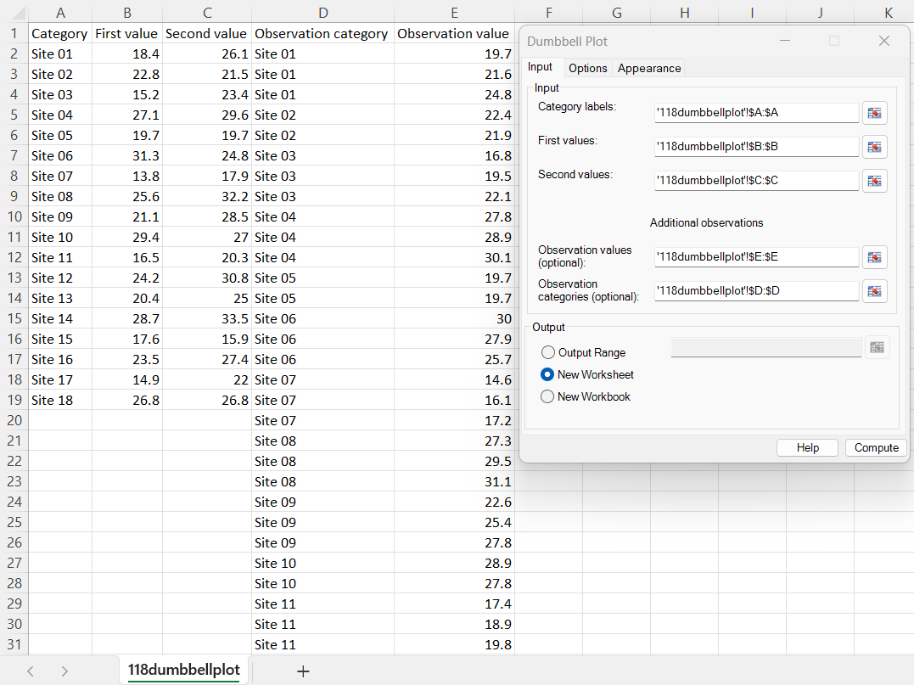
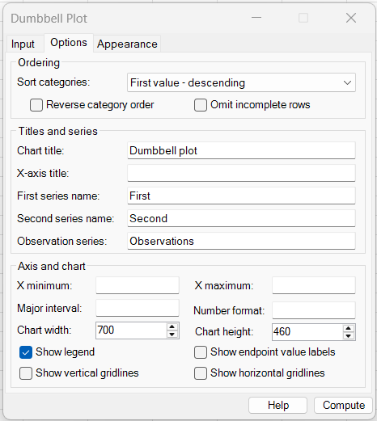
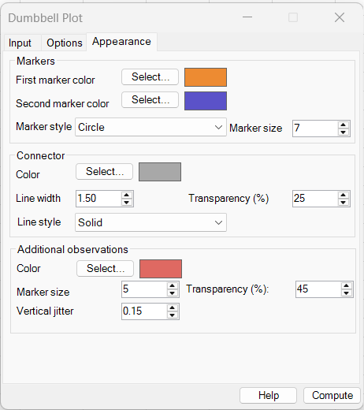
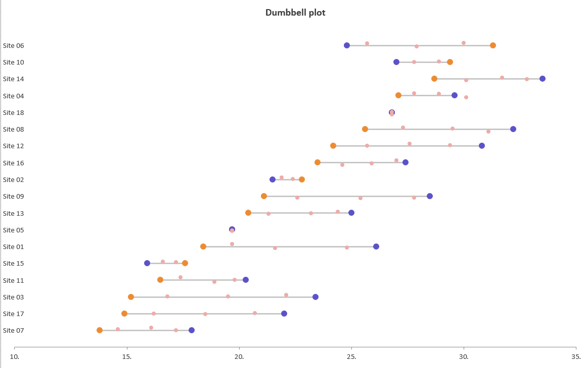

# Dumbbell Plot

**Includes:** Horizontal two-endpoint dumbbell charts, numeric or date/time X axes, optional repeated observations/events, configurable category ordering, signed and absolute change sorting, optional endpoint value labels, customizable markers and connectors, observation transparency and vertical jitter, automatic "nice" axis intervals, custom axis limits and number formats, gridline controls, and configurable chart size.  
**Purpose:** Compare two values for each category while showing both the direction and magnitude of the difference, with optional additional observations displayed along the same horizontal scale.

---

## Overview

A **dumbbell plot** compares two values for each category. The two values are shown as markers on a common horizontal axis and joined by a line:

```text
First value ●────────────● Second value
```

The position of the markers shows the actual values, while the distance between them shows the size of the difference.

Dumbbell plots are especially useful for paired comparisons such as:

- before versus after;
- baseline versus follow-up;
- two years or time points;
- two methods or treatments;
- minimum versus maximum;
- first versus last measurement;
- first event versus later event date.

BESHStatNG can also add a second set of **optional observations**. These are shown as independent points associated with the corresponding category. This makes it possible to create displays such as an interval between two important events together with repeated observations occurring between, before, or after the endpoints.

!!! note
    A Dumbbell Plot is primarily a descriptive visualization. The distance and direction between the two endpoints are shown graphically, but the chart does not itself perform a paired significance test or estimate a confidence interval.

---

## When to use it

Use a dumbbell plot when each category has **two values measured on the same scale** and the main question is how those values differ.

Typical applications include:

- comparing indicators between two years;
- baseline and follow-up values by country, centre, subgroup, or subject;
- pre-treatment and post-treatment summaries;
- comparing results from two measurement methods;
- planned versus observed values;
- start and end dates for projects or events;
- first reported event and first subsequent event by location;
- displaying a pair of endpoints together with individual events or observations.

A dumbbell plot is often clearer than two grouped bars because the connecting line emphasizes the **within-category difference** rather than the absolute height or area of bars.

Avoid a dumbbell plot when:

- there are more than two primary values per category and all of them are equally important;
- categories contain very different measurement scales;
- exact numerical values are more important than the visual comparison;
- there are so many categories that labels become unreadable;
- the two endpoints are not meaningfully paired within each category.

---

## Example dataset

The sample dataset used on this page is available here:

[118dumbbellplot.csv](../assets/data/118dumbbellplot/118dumbbellplot.csv)

The first three columns contain the primary dumbbell data:

| Category | First value | Second value |
|---|---:|---:|
| Site 01 | 18.4 | 26.1 |
| Site 02 | 22.8 | 21.5 |
| Site 03 | 15.2 | 23.4 |
| Site 04 | 27.1 | 29.6 |
| Site 05 | 19.7 | 19.7 |
| Site 06 | 31.3 | 24.8 |

The dataset deliberately contains:

- increases, such as Site 01;
- decreases, such as Site 02 and Site 06;
- equal endpoints, such as Site 05.

Columns D and E contain optional repeated observations:

| Observation category | Observation value |
|---|---:|
| Site 01 | 19.7 |
| Site 01 | 21.6 |
| Site 01 | 24.8 |
| Site 02 | 22.4 |
| Site 02 | 21.9 |
| Site 03 | 16.8 |

The observation category may occur repeatedly. Every usable observation category must correspond to one of the categories in the primary dumbbell table.

---

## Example: dumbbells with additional observations

### Input settings



For the example data, select:

| Setting | Value |
|---|---|
| Category labels | `A:A` |
| First values | `B:B` |
| Second values | `C:C` |
| Observation values (optional) | `E:E` |
| Observation categories (optional) | `D:D` |
| Output | New Worksheet |

Whole-column selections are supported. When the first selected row contains headings and the following row contains valid numeric or date values, BESHStatNG recognizes the leading row as a header and excludes it from the plotted data.

The optional observation ranges are independent of the three endpoint ranges. They can therefore contain many repeated observations for each category and do not need to have the same number of rows as the endpoint table.

### Options



The example uses **First value - descending** so the categories are ordered from the largest first endpoint at the top to the smallest at the bottom.

The chart title is **Dumbbell plot**, the series are named **First**, **Second**, and **Observations**, and the chart is created at 700 × 460 points.

The X-axis limits and major interval are left blank, allowing BESHStatNG to determine a suitable scale automatically.

### Appearance



The example uses:

| Setting | Value |
|---|---|
| First marker | Orange circle |
| Second marker | Blue/purple circle |
| Marker size | 7 |
| Connector colour | Grey |
| Connector width | 1.50 |
| Connector transparency | 25% |
| Connector line style | Solid |
| Additional-observation colour | Red |
| Additional-observation marker size | 5 |
| Additional-observation transparency | 45% |
| Vertical jitter | 0.15 |

### Output



The output shows one horizontal dumbbell for every site:

- orange markers represent the **First** values;
- blue/purple markers represent the **Second** values;
- grey horizontal connectors show the interval between the endpoints;
- pale red points represent the optional repeated **Observations**.

For Site 06, the first value is 31.3 and the second value is 24.8, so the second marker lies to the **left** of the first marker. The chart therefore shows direction naturally; a decrease does not require any special input arrangement.

Site 05 has equal first and second values. Both endpoint markers occupy the same X position and the connector has zero visible length.

The additional observations are independent points. They are not joined to one another.

---

## Required data layout

### Primary endpoint table

The primary input consists of three row-aligned single-column ranges:

| Category | First value | Second value |
|---|---:|---:|
| A | 10.2 | 14.8 |
| B | 17.4 | 15.9 |
| C | 12.1 | 18.0 |

The rules are:

- **Category labels**, **First values**, and **Second values** must contain the same number of selected rows;
- all three ranges must be on the same worksheet;
- each selected range must be a single continuous column;
- each retained category must be unique;
- the two endpoint values must be numeric or valid Excel date/time values;
- categories may be text or numeric.

A category is represented once in the primary table. If the same category occurs more than once, BESHStatNG cannot determine which endpoint pair represents that category and reports an error.

### Optional additional observations

Additional observations use a separate pair of row-aligned columns:

| Observation category | Observation value |
|---|---:|
| A | 11.0 |
| A | 12.3 |
| A | 13.8 |
| B | 16.7 |
| B | 16.2 |

The rules are:

- **Observation categories** and **Observation values** must contain the same number of selected rows;
- the two ranges must be on the same worksheet and start on the same row;
- repeated observation categories are allowed and expected;
- every usable observation category must match a retained primary category;
- blank observation rows are omitted;
- observation values use the same horizontal scale as the two endpoints.

The optional observation table does **not** need to have the same number of rows as the primary endpoint table.

!!! tip
    Leave both optional observation fields blank when you want a conventional two-point dumbbell chart.

---

## Numeric and date/time axes

The X axis can contain ordinary numeric values or Excel dates.

### Numeric values

For numeric data such as:

```text
18.4, 26.1, 31.3
```

the automatic axis uses a compact numeric format and chooses human-friendly major intervals.

### Date/time values

Excel dates are supported because they are represented internally on a continuous numerical scale.

For example:

| Region | First reported case | First reported death |
|---|---|---|
| Region A | 26-Feb-2020 | 02-Apr-2020 |
| Region B | 01-Mar-2020 | 28-Mar-2020 |

can be displayed as a date-based dumbbell plot.

When genuine Excel date values are detected, the automatic axis uses a day/month-style date format. You can override this with **Number format**, for example:

```text
dd-mmm
```

or:

```text
mmm dd
```

For a date axis, **Major interval** is entered in Excel date units, so a value of `7` corresponds to seven days.

!!! tip
    Keep the primary endpoints and optional observations on the same conceptual scale. Mixing arbitrary numeric values and dates in one chart is rarely meaningful.

---

## Dialog: Input tab

### Category labels

Select the categorical identifier for each dumbbell.

Each retained category must occur only once in the primary endpoint table.

### First values

Select the first numeric or date/time endpoint.

The first and second series names can later be changed on the **Options** tab, so this field can represent any first condition, year, method, event, or time point.

### Second values

Select the second numeric or date/time endpoint.

The second value may be larger than, smaller than, or equal to the first value.

### Observation values (optional)

Select the numeric or date/time values of additional observations to display as independent points.

Leave this field blank when additional observations are not required.

### Observation categories (optional)

Select the category corresponding to each optional observation.

Both optional fields must either be supplied together or left blank.

### Output

Choose one of:

- **Output Range** — places the chart with its upper-left corner at the selected worksheet cell;
- **New Worksheet** — creates a new worksheet in the input workbook and places the chart at its upper-left corner;
- **New Workbook** — creates a new workbook and places the chart on its first worksheet.

The default is **New Worksheet**.

---

## Dialog: Options tab

### Ordering

#### Sort categories

The category order can be controlled by the endpoints or their difference.

| Option | Behaviour |
|---|---|
| **Input order** | Keeps the usable categories in worksheet order |
| **First value - ascending** | Smallest first endpoint first |
| **First value - descending** | Largest first endpoint first |
| **Second value - ascending** | Smallest second endpoint first |
| **Second value - descending** | Largest second endpoint first |
| **Difference - ascending** | Orders by $\text{Second} - \text{First}$, smallest first |
| **Difference - descending** | Orders by $\text{Second} - \text{First}$, largest first |
| **Absolute difference - ascending** | Orders by $|\text{Second} - \text{First}|$, smallest first |
| **Absolute difference - descending** | Orders by $|\text{Second} - \text{First}|$, largest first |
| **Category - ascending** | Alphabetical/numeric category order |
| **Category - descending** | Reverse alphabetical/numeric category order |

Sorting by **Difference** emphasizes direction of change. Sorting by **Absolute difference** emphasizes the magnitude of change regardless of direction.

#### Reverse category order

Reverses the final top-to-bottom order after the selected sorting rule has been applied.

This is useful when the preferred order is correct but should be displayed from bottom to top rather than top to bottom.

#### Omit incomplete rows

Controls how missing values in the primary endpoint table are handled.

- cleared — a missing category, first endpoint, or second endpoint produces an input error;
- selected — incomplete primary rows are omitted.

Use this option carefully. A dumbbell requires both endpoints to represent a paired comparison, so an omitted endpoint row contains no complete dumbbell.

### Titles and series

#### Chart title

Sets the chart title. Leave it blank to omit the title.

#### X-axis title

Adds a title to the horizontal numeric/date axis.

Examples include:

- Score;
- Percentage;
- Rate;
- Year;
- Date.

#### First series name

Sets the legend name of the first endpoint series.

Examples: **2008**, **Baseline**, **Before**, **First reported case**.

#### Second series name

Sets the legend name of the second endpoint series.

Examples: **2018**, **Follow-up**, **After**, **First reported death**.

#### Observation series

Sets the legend name for the optional additional observations.

Examples: **Observations**, **Events**, **Genome sequences**, **Measurements**.

### Axis and chart

#### X minimum and X maximum

Leave these fields blank for automatic limits.

When automatic limits are used, BESHStatNG adds a small amount of padding around the complete data range, including optional observations, and rounds the bounds outward to convenient values.

Enter explicit values when several charts should use the same X scale or when a particular comparison range is required.

For date plots, valid date values can also be entered.

#### Major interval

Sets the spacing between major X-axis ticks and vertical gridlines.

Leave it blank for automatic spacing.

Automatic spacing uses a **1-2-5 sequence** such as:

```text
1, 2, 5, 10, 20, 50, 100, ...
```

scaled to the data range. This places ticks on readable values rather than arbitrary padded positions.

For example, data spanning approximately 14 to 34 may be displayed on:

```text
10, 15, 20, 25, 30, 35
```

rather than on awkward values such as 13.012, 18.012, and 23.012.

#### Number format

Controls the Excel number format used for the X-axis labels.

Examples:

```text
0
0.0
0.00
0%
dd-mmm
mmm yyyy
```

Leave the field blank to use the automatic format.

#### Chart width and Chart height

Set the embedded chart dimensions in points.

The default dimensions are:

- **Width:** 700;
- **Height:** 460.

Increase the height when many categories are displayed so category labels and dumbbells remain visually separated.

#### Show legend

Shows the First, Second, and optional Observation series in the chart legend.

This is selected by default.

#### Show endpoint value labels

Displays the actual endpoint values beside the First and Second markers.

This can be useful for small charts, but may become crowded when many categories are displayed.

#### Show vertical gridlines

Displays gridlines at the X-axis major tick positions.

Vertical gridlines are useful when comparing marker positions against exact scale values.

#### Show horizontal gridlines

Displays horizontal guide lines through the category rows.

These can help the eye track a category across a wide chart, particularly when there are many rows.

---

## Dialog: Appearance tab

### Markers

#### First marker color

Sets the colour of the first endpoint markers.

#### Second marker color

Sets the colour of the second endpoint markers.

Use clearly distinguishable colours because marker colour identifies which endpoint is First and which is Second.

#### Marker style

The same marker shape is used for both endpoint series.

Available styles are:

- Circle;
- Square;
- Triangle;
- Diamond;
- X;
- Plus;
- Star;
- Dash.

#### Marker size

Sets the size of both endpoint markers.

A larger marker can improve readability in presentations, while a smaller marker is useful when many categories are displayed.

### Connector

#### Color

Sets the colour of the horizontal line joining the two endpoint markers.

A neutral grey is usually effective because it keeps attention on the endpoint markers.

#### Line width

Controls connector thickness.

#### Transparency (%)

Controls connector transparency:

- `0` — fully opaque;
- larger values — increasingly transparent.

Higher transparency can reduce visual dominance when many dumbbells are close together.

#### Line style

Available connector styles are:

- Solid;
- Dash;
- Dot;
- Dash-dot;
- Dash-dot-dot.

### Additional observations

These controls affect only the optional repeated observation points.

#### Color

Sets the observation marker colour.

#### Marker size

Controls the size of each additional observation point.

#### Transparency (%)

Controls how strongly the observation points are displayed.

Higher transparency is useful when many observations overlap. The markers become visually lighter while remaining separate points.

#### Vertical jitter

Moves optional observations slightly above or below their category centre line to reduce overplotting.

The setting is expressed as a fraction of the distance between adjacent category rows:

- `0` — no jitter;
- `0.05` — very small displacement;
- `0.15` — moderate displacement;
- the current maximum is `0.45`.

The jitter changes only the vertical display position. It does **not** modify the X value.

The jitter is deterministic for the same data and settings, so the point layout remains stable when the chart is recreated.

!!! note
    Additional observations are plotted as independent markers. They are not connected to one another.

---

## Initial dialog selections

The current dialog opens with:

| Setting | Default |
|---|---|
| Output | New Worksheet |
| Sort categories | Input order |
| Reverse category order | Cleared |
| Omit incomplete rows | Cleared |
| Chart title | Dumbbell plot |
| X-axis title | Blank |
| First series name | First |
| Second series name | Second |
| Observation series | Observations |
| X minimum | Automatic |
| X maximum | Automatic |
| Major interval | Automatic |
| Number format | Automatic |
| Chart width | 700 |
| Chart height | 460 |
| Show legend | Selected |
| Show endpoint value labels | Cleared |
| Show vertical gridlines | Selected |
| Show horizontal gridlines | Selected |
| Endpoint marker style | Circle |
| Endpoint marker size | 5 |
| Connector line width | 1.50 |
| Connector transparency | 25% |
| Connector line style | Solid |
| Additional-observation marker size | 5 |
| Additional-observation transparency | 45% |
| Vertical jitter | 0.15 |

Marker and connector colours open with the default orange/blue endpoint colours, a neutral grey connector, and a contrasting red observation colour.

---

## Steps in the add-in

1. In Excel, select **BESH Stat NG → Analyse → Graphics → Dumbbell Plot**.
2. Select **Category labels**, **First values**, and **Second values**.
3. If required, select both **Observation values** and **Observation categories**.
4. Select the output destination.
5. Open the **Options** tab and choose the required category ordering.
6. Enter chart/series titles and any manual axis settings.
7. Choose whether to show the legend, endpoint values, and gridlines.
8. Open the **Appearance** tab and set marker, connector, and optional-observation appearance.
9. Click **Compute**.

For a standard dumbbell chart, leave the two optional observation fields blank.

---

## Output

BESHStatNG creates an embedded Excel chart containing:

- one marker for the First value of every retained category;
- one marker for the Second value of every retained category;
- one horizontal connector between the two endpoints;
- category labels on the left;
- optional repeated observation points;
- optional endpoint value labels;
- optional vertical and horizontal gridlines;
- an optional legend and chart title.

The X axis is positioned at the bottom of the plot.

The chart is graphical; no helper calculations are written into worksheet cells.

The chart can be moved, resized, copied, and exported like other BESHStatNG charts.

See [Export Chart](../export-chart.md) for image export.

---

## What the Dumbbell Plot calculation does

### 1. Validate the endpoint rows

For each primary row, BESHStatNG obtains:

$$
(\text{Category}_i,\; F_i,\; S_i),
$$

where $F_i$ is the First value and $S_i$ is the Second value.

Each retained row must have one category and two finite endpoint values unless **Omit incomplete rows** is selected.

Primary category identifiers must be unique.

### 2. Calculate the endpoint difference

The signed difference is:

$$
D_i=S_i-F_i.
$$

A positive value means the Second endpoint lies to the right of the First endpoint. A negative value means the Second endpoint lies to the left.

The absolute difference is:

$$
A_i=|S_i-F_i|.
$$

These quantities are used by the corresponding sorting options. They do not alter the plotted endpoint positions.

### 3. Apply the selected category order

The selected ordering rule is applied to the complete categories.

If **Reverse category order** is selected, the resulting order is reversed.

Each category is then assigned one evenly spaced horizontal row.

### 4. Draw the dumbbell interval

For each category, the connector spans:

$$
\min(F_i,S_i)
\quad\text{to}\quad
\max(F_i,S_i).
$$

This is why the chart works correctly whether the Second value is larger or smaller than the First value.

The marker colours continue to identify First and Second; the connector itself has no direction.

### 5. Match optional observations to categories

Each usable optional observation is represented by:

$$
(\text{Category},\; X).
$$

The category is matched to the corresponding primary dumbbell row.

Repeated category identifiers are allowed in this optional table, so one category may have any number of additional observations.

### 6. Apply optional vertical jitter

If vertical jitter is greater than zero, each additional observation is shifted by a small amount around the category centre line.

The X coordinate remains unchanged:

$$
X_{\text{display}}=X_{\text{observed}}.
$$

Only the display Y position changes. Jitter therefore reduces overlap without changing the measured value.

### 7. Resolve the X-axis scale

When manual axis settings are not supplied, BESHStatNG:

1. finds the minimum and maximum across both endpoint values and any optional observations;
2. adds a small amount of padding;
3. chooses a convenient 1-2-5 major interval;
4. rounds the axis limits outward to multiples of that interval.

This produces readable tick and gridline positions while ensuring that all plotted observations remain visible.

---

## Missing and invalid values

### Primary endpoint rows

By default:

- a missing category is an error;
- a missing First value is an error;
- a missing Second value is an error;
- a nonnumeric/non-date endpoint is an error;
- infinite endpoint values are rejected;
- duplicate endpoint categories are rejected.

When **Omit incomplete rows** is selected, rows with a missing category or missing endpoint are omitted instead of stopping the chart.

At least one complete category with two valid endpoints must remain.

### Optional observations

For optional observation rows:

- a missing observation category is omitted;
- a missing observation value is omitted;
- a nonnumeric/non-date observation value is rejected when it is otherwise present as data;
- repeated categories are allowed;
- a usable observation category that does not match a retained primary category is rejected.

Both optional ranges must either be selected together or omitted together.

### Headers and whole-column selections

Whole-column input selections such as `A:A`, `B:B`, and `C:C` are supported.

When the first endpoint row contains text headings and the next row contains valid numeric/date endpoint values, the first row is automatically treated as a header.

The optional observation pair performs the same leading-header detection independently.

---

## How to interpret a dumbbell plot

### Endpoint positions

The horizontal position of each marker represents its actual value.

Markers farther to the right represent larger numeric values or later dates.

### Connector length

The connector length represents the magnitude of the difference between the two endpoints:

$$
|S_i-F_i|.
$$

Long connectors indicate larger differences; short connectors indicate similar values.

### Direction

Use the endpoint colours and positions to determine direction:

- Second to the right of First → increase/later value;
- Second to the left of First → decrease/earlier value;
- overlapping endpoints → no difference on the plotted scale.

The connector itself is visually undirected; endpoint identity comes from the marker colours and legend.

### Additional observations

Optional observations provide context around the two endpoints.

They may show, for example:

- repeated measurements between baseline and follow-up;
- intermediate event dates;
- individual observations around summary endpoints;
- milestones occurring during an interval.

Their vertical jitter is only a display device and should not be interpreted as another variable.

!!! tip
    Read the endpoint positions first, then compare connector lengths. Use the optional observations to understand the distribution or timing of events around the primary pair.

---

## Dumbbell plot versus related displays

| Display | Main visual encoding | Typical purpose |
|---|---|---|
| **Dumbbell plot** | Two markers joined within each category | Compare paired endpoints and emphasize their difference |
| **Slope chart** | Two vertical axes joined by sloping lines | Compare rank or change between two time points |
| **Paired dot plot** | Two points per subject/category, sometimes connected | Show paired raw observations |
| **Grouped bar chart** | Side-by-side bar lengths | Compare discrete category totals or means |
| **Dot plot** | One or more points on a common scale | Compact comparison without emphasizing an interval |
| **Interval/range plot** | Line from lower to upper value | Show ranges, limits, or intervals rather than two named endpoints |
| **Timeline** | Events positioned along time | Show event timing when connecting two primary endpoints is not central |

Use a dumbbell plot when the **pairing and separation of two named values** are the main message.

---

## Practical guidance for readable plots

For clearer dumbbell charts:

- sort categories by First, Second, Difference, or Absolute difference when a meaningful ranking helps reveal the pattern;
- use **Input order** when the worksheet already contains a meaningful sequence;
- keep category labels reasonably short;
- increase chart height when many categories are displayed;
- use clearly distinct First and Second marker colours;
- keep connectors visually lighter than endpoint markers;
- use endpoint value labels mainly for small charts;
- enable vertical gridlines when exact X-axis comparison is important;
- enable horizontal gridlines when tracking across many category rows is difficult;
- use observation transparency when many optional points overlap;
- use a small amount of vertical jitter for repeated observations with similar values;
- keep the same X-axis limits when several dumbbell charts will be compared side by side;
- give the First and Second series descriptive names such as years or measurement occasions.

For additional observations, a jitter of approximately **0.05 to 0.15** is usually enough to reveal overlapping points without visually separating them too far from their category row.

---

## Implementation details and limitations

- The chart uses a continuous horizontal numeric axis.
- Excel date/time values are plotted on the same continuous axis using their date serial representation.
- Category labels are positioned independently of the X-axis scale so long labels do not alter the data values.
- Connectors span only the two primary endpoints; optional observations are always independent points.
- Automatic X-axis limits include optional observations as well as the two endpoint series.
- Automatic major intervals use a 1-2-5 step rule to produce readable tick positions.
- Primary categories must be unique; the tool does not aggregate duplicate endpoint rows.
- Optional observations may contain repeated categories.
- The same endpoint marker style and size are currently applied to both endpoint series, although their colours are independent.
- Optional observation markers use a circular style in the current dialog.
- The dialog exposes one optional observation series rather than several independently formatted auxiliary series.
- Vertical jitter affects only optional observations and has no statistical meaning.
- The chart does not calculate confidence intervals, hypothesis tests, effect sizes, or paired-test p-values.
- Very large numbers of categories can make category labels and endpoint markers difficult to read; increase chart height or reduce the number of displayed categories.
- The tool creates a chart through the ribbon; it is not a worksheet formula.

---

## Common mistakes

- Reversing **Observation values** and **Observation categories**. The category column contains labels such as `Site 01`; the value column contains the numeric/date observations.
- Selecting endpoint ranges with different row counts or different starting rows.
- Repeating the same category in the primary endpoint table. Each primary category must be unique.
- Supplying only one of the two optional observation ranges.
- Using an optional observation category that does not exist in the retained endpoint table.
- Assuming First must be smaller than Second. Decreases are valid and are shown automatically.
- Treating vertical jitter as measured variability. Jitter changes display position only.
- Using a very large jitter value so observations appear closer to neighbouring categories.
- Using highly opaque optional markers when many observations overlap.
- Turning on endpoint value labels for a very dense chart.
- Using different X-axis scales on several charts that are intended to be compared directly.
- Entering a zero or negative **Major interval**.
- Entering an X minimum greater than or equal to the X maximum.
- Assuming connector length alone identifies direction; use the endpoint colours and legend to determine which value is First and which is Second.

---

## See also

- [Categorical Histogram](categorical-histogram.md)
- [Violin Plot](violin-plot.md)
- [Kite Chart](kite-chart.md)
- [Convex Hull Plot](convex-hull-plot.md)
- [Sankey Plot](sankey-plot.md)
- [Export Chart](../export-chart.md)
- [Home](../index.md)
