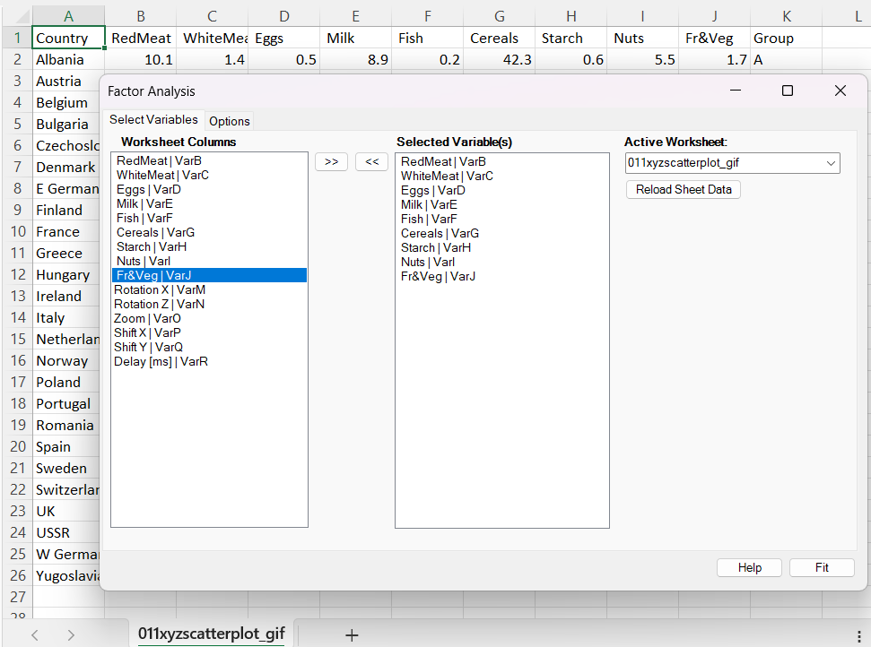
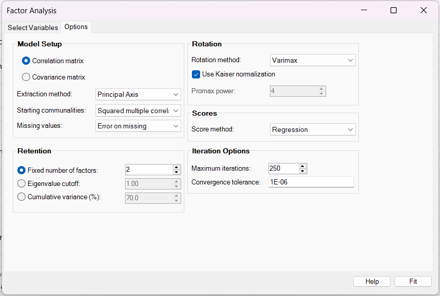
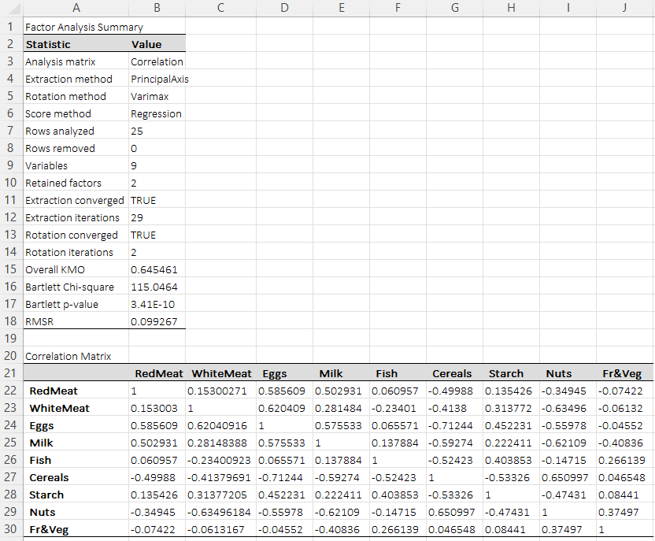
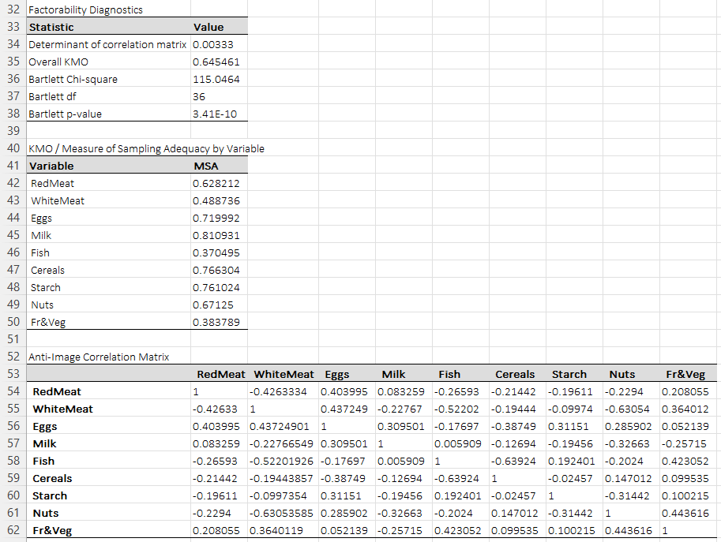
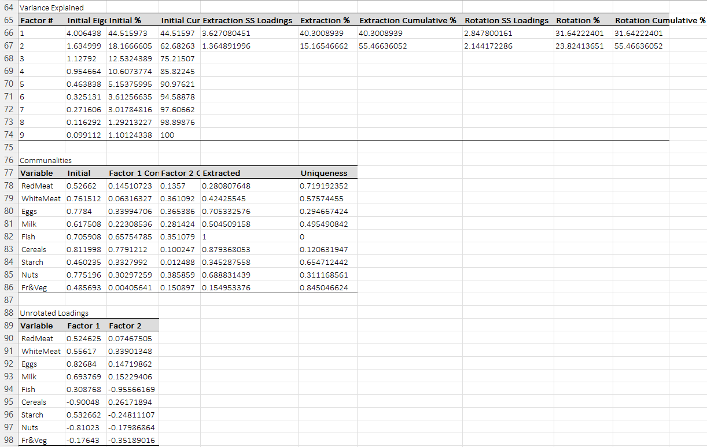
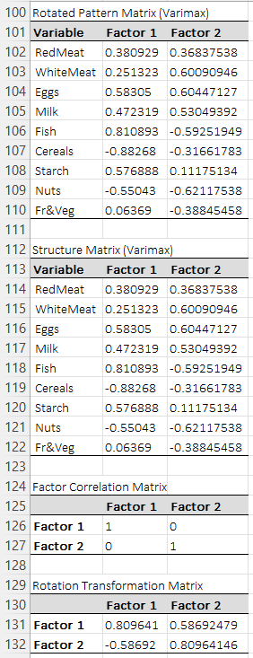
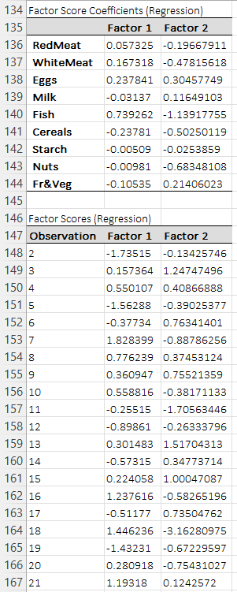
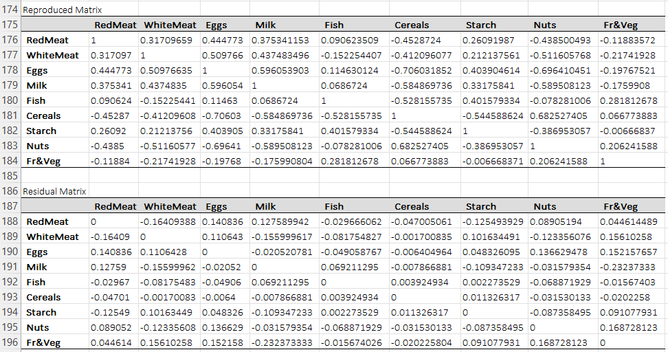
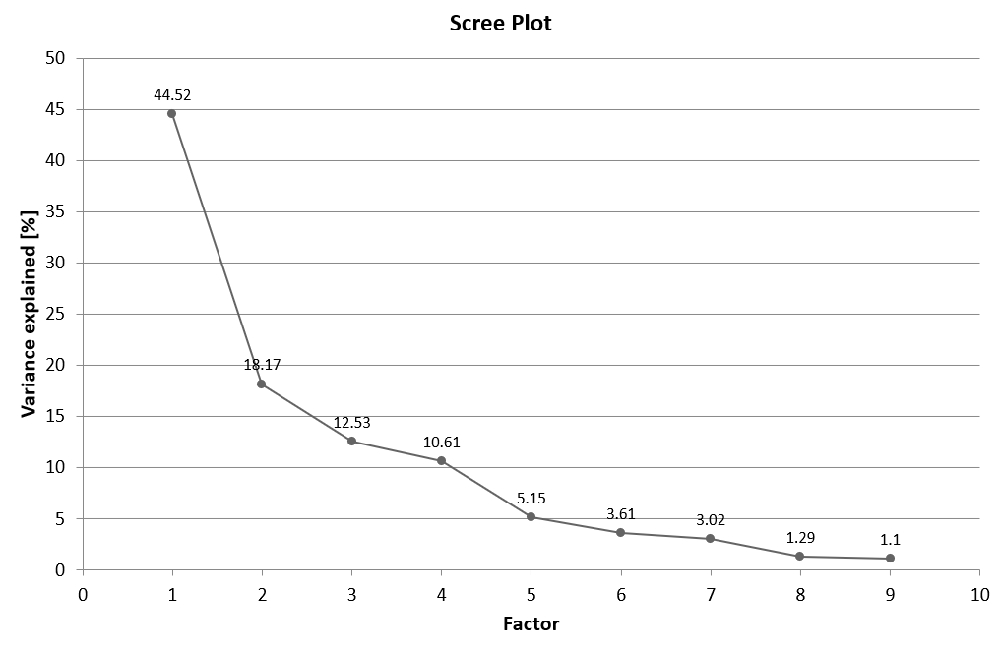
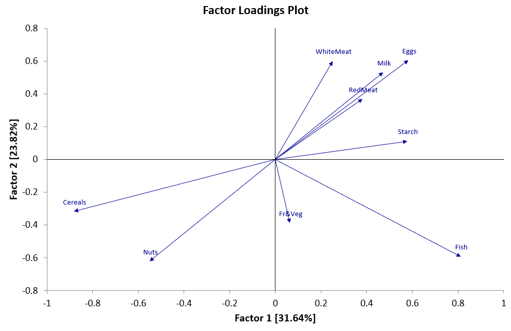

# Factor Analysis

**Includes:** Exploratory factor analysis on correlation or covariance matrix, extraction methods (principal axis, maximum likelihood, generalized least squares, image, alpha, and principal-components style extraction for comparison), retention by fixed count / eigenvalue cutoff / cumulative variance, rotations (none, varimax, quartimax, equamax, promax), regression or Bartlett scores, factorability diagnostics (KMO, per-variable MSA, Bartlett's test, anti-image matrix, determinant), residual diagnostics, scree plot, and 2D/3D loading plots.  
**Purpose:** Discover lower-dimensional latent structure behind correlated numeric variables and summarize the common variance they share.

---

## Overview

Exploratory factor analysis (EFA) starts from the idea that the observed variables are driven partly by a smaller number of latent factors and partly by variable-specific noise or uniqueness.

Instead of modeling each variable as fully distinct, factor analysis decomposes the observed covariance or correlation structure into:

- **common variance**, explained by one or more latent factors,
- **unique variance**, specific to each variable,
- and, in oblique solutions, **correlation among the factors themselves**.

In BESHStatNG, the analysis can be run on either:

- the **correlation matrix** (recommended when variables are on different scales), or
- the **covariance matrix** (recommended only when the variables are already on comparable scales and the original units matter).

The output includes:

- a **Factor Analysis Summary**,
- the analyzed **correlation or covariance matrix**,
- **factorability diagnostics**,
- **variance explained**,
- **communalities and uniquenesses**,
- **unrotated loadings**,
- **rotated pattern / structure / factor-correlation matrices** when rotation is requested,
- optional **factor-score coefficients** and **factor scores**,
- a **reproduced matrix** and **residual matrix**,
- and charts such as **scree plot** and **loading plots**.

---

## Example dataset

This page uses the classic **protein consumption by country** example also used elsewhere in the help.

Download the data:

- [011xyzscatterplot_gif.csv](../assets/data/011xyzscatterplot/011xyzscatterplot_gif.csv)

For the factor-analysis screenshots, the following 9 numeric variables were selected:

- RedMeat
- WhiteMeat
- Eggs
- Milk
- Fish
- Cereals
- Starch
- Nuts
- Fr&Veg

The **Country** column is useful as an identifier, but it is not included in the factor model.
The **Group** column is also not used in the fitting.

---

## Screenshots

### Select Variables tab


### Options tab


### Summary and analyzed matrix


### Diagnostics and anti-image matrix


### Variance explained, communalities, unrotated loadings


### Rotated pattern, structure, and factor-correlation matrices


### Score coefficients and factor scores


### Reproduced and residual matrices


### Scree plot


### 2D loading plot


---

## Brief interpretation of the example

The screenshot example uses:

- **Correlation matrix**
- **Principal Axis** extraction
- **2 retained factors**
- **Varimax** rotation
- **Regression** scores

### What the diagnostics say

From the screenshot output:

- **Overall KMO ≈ 0.65** suggests the data are usable for factor analysis, but not exceptionally strong.
- **Bartlett's test is highly significant** (
  \(p \ll 0.001\)), so the correlation matrix is clearly not close to the identity matrix.
- Some variables have noticeably weaker individual MSA values, especially **Fish** and **Fr&Veg**, so the factor structure is informative but not perfectly clean.

### What the two factors appear to represent

The rotated loading plot and rotated pattern matrix suggest a broad two-factor structure:

1. **Factor 1: animal-protein / staple contrast**  
   Fish, Eggs, Starch, Milk, and RedMeat load positively, while Cereals and Nuts load negatively.  
   This factor separates diets that lean more toward animal-protein and mixed staple consumption from diets dominated more strongly by cereals.

2. **Factor 2: dairy / white-meat / egg pattern**  
   WhiteMeat, Eggs, Milk, and RedMeat load positively, while Fish, Nuts, and Fr&Veg are negative.  
   This factor looks like a second dietary gradient that contrasts dairy / poultry / egg consumption with a more fish- and plant-oriented pattern.

### Communalities and model fit

- The first two factors explain about **55.5%** of the total standardized variance in the screenshot.
- **Fish** and **Cereals** show high extracted communalities in the example, meaning the retained factors capture much of their variance.
- **Fr&Veg** has a low communality, so it is not especially well represented by the two-factor solution.
- The residual matrix is not negligible, which is another sign that the two-factor solution is helpful but not exhaustive.

### Interpretation caution

Factor labels are always substantive interpretations, not mathematical truths.
A different rotation, a different extraction family, or a different retained factor count can change the emphasis of the solution.

---

## When to use it

Use factor analysis when you want to:

- identify a smaller number of latent dimensions behind a set of correlated variables,
- separate **shared** variance from **unique** variance,
- build or refine scales and subscales,
- summarize multicollinear variables before later modeling,
- inspect pattern, structure, and residual correlation matrices.

Factor analysis is especially useful when:

- the variables are conceptually related,
- the correlation matrix contains real structure,
- you care about latent constructs rather than only dimension reduction.

### When PCA may be more appropriate

Choose PCA instead when your main goal is **variance summarization or compression**, not a latent-variable model of common and unique variance.
A principal-components style extraction is available here mainly for compatibility and comparison, but common-factor methods are usually preferable when the interpretation is explicitly about latent constructs.

### When factor analysis is a poor fit

Be cautious when:

- variables are almost uncorrelated,
- the sample is too small for a stable correlation structure,
- most variables are extremely skewed, zero-inflated, or ordinal with few categories,
- a few variables dominate because of gross scale differences and a covariance solution is used,
- the problem is confirmatory rather than exploratory.

---

## Inputs in Excel

### Selecting variables

On the **Select Variables** tab:

- move the numeric columns of interest from **Worksheet Columns** to **Selected Variable(s)**,
- exclude identifiers and group labels from the analysis matrix,
- use **Reload Sheet Data** if you switch to another worksheet.

> Tip: Put variable names in row 1. They are used as output labels and in loading plots.

### Missing values

The procedure supports two missing-data policies:

- **Error on missing**
- **Listwise deletion**

Rows removed by listwise deletion are counted and reported in the summary.

---

## Options in BESHStatNG

## 1) Analysis matrix

### Correlation matrix

This standardizes variables to variance 1 before fitting the model.

Use it when:

- variables are in different units,
- the scales are not directly comparable,
- you want each variable to contribute equally to the analysis scale.

This is the **usual default and the recommended choice in most applied EFA work**.

### Covariance matrix

This keeps the original measurement units.

Use it when:

- all variables are already on a common scale,
- absolute variance carries substantive meaning,
- you explicitly want high-variance variables to have more influence.

Be careful: if one variable has much larger variance than the others, it can dominate the solution.

---

## 2) Extraction method

### Principal Axis

Iteratively estimates communalities and re-factors a reduced matrix.

Use it when:

- you want a strong general-purpose common-factor method,
- multivariate normality is uncertain,
- you want a robust exploratory solution.

**Practical recommendation:** this is the best general default for many real datasets.

### Maximum Likelihood

Fits the common-factor model by optimizing a normal-theory likelihood criterion.

Use it when:

- the data are reasonably close to multivariate normal,
- you want a classical likelihood-based factor solution,
- you want results comparable to standard ML implementations such as R's `factanal()`.

**Preferred when:** the model assumptions are plausible and inferential comparability matters.

**Be cautious when:** the data are strongly non-normal or the model is close to a Heywood case.

### Generalized Least Squares

Fits the factor model by minimizing a weighted residual criterion.

Use it when:

- you want a common-factor solution that emphasizes weighted residual fit,
- you want an alternative to ML that is still model-based,
- you want to compare a likelihood solution with a residual-weighted solution.

**Typical role:** useful as a comparison method rather than the default first fit.

### Image

Builds the solution from the image-correlation structure implied by the inverse correlation matrix.

Use it when:

- you specifically want an image-factor style exploratory solution,
- you are comparing classical psychometric extraction families,
- you are interested in partial-correlation-driven structure.

**Typical role:** a specialized exploratory method, not usually the first practical choice.

### Alpha

Finds factors that maximize generalizability in the reliability / coefficient-alpha sense.

Use it when:

- the problem is psychometric and reliability-oriented,
- you want to compare an alpha-factor solution with PAF or ML,
- you are studying item pools and broad common domains.

**Typical role:** a niche psychometric method rather than the default method for general multivariate science.

### Principal Components

This extracts component-style loadings from the full matrix.

Use it when:

- you want direct comparability with PCA-like workflows,
- you want a quick dimension-reduction benchmark,
- you want to compare component and common-factor solutions side by side.

**Important:** this is not a pure common-factor model, because it does not separate common and unique variance in the same way as the other extraction families.

---

## 3) Starting communalities

### Squared multiple correlations

Each variable starts from its squared multiple correlation with all the others.

Use it when:

- you want the usual starting point for principal-axis style methods,
- you want a conservative start based on shared variance,
- you want the most common default.

**Recommended default.**

### One

Each variable starts from full variance on the working analysis scale.

Use it when:

- you want a more aggressive start,
- you are comparing with software that uses unit diagonals initially,
- the SMC start appears too small for your data.

This option can change the iteration path and occasionally the final solution.

---

## 4) Retention rule

### Fixed number of factors

Use this when:

- theory or prior work suggests a known dimensionality,
- you are reproducing a published analysis,
- you want direct comparability across extraction methods.

### Eigenvalue cutoff

Retain all factors whose **initial** eigenvalue meets the threshold.
For correlation-matrix analyses, the common quick rule is cutoff = 1.

Use it when:

- you want a fast, simple heuristic,
- you need a first pass before deeper inspection.

**Caution:** the eigenvalue-greater-than-one rule is easy to use but often over- or under-retains factors. It is best treated as a heuristic, not a final decision rule.

### Cumulative variance (%)

Retain the smallest number of factors whose cumulative **initial** variance explained reaches the requested percentage.

Use it when:

- the goal is pragmatic data reduction,
- you need a compact summary that captures a chosen share of total variance,
- downstream modeling needs a rough variance threshold.

**Caution:** variance percentage alone is not usually a sufficient criterion for latent-structure interpretation.

### Practical recommendation for retention

A good workflow is:

1. inspect the **scree plot**,
2. compare a few nearby factor counts,
3. prefer the smallest interpretable solution with acceptable residuals,
4. when possible, supplement the built-in rules with **parallel analysis** outside the software.

---

## 5) Rotation

Rotation does not change the overall model fit of the common part; it redistributes loadings to make the solution easier to interpret.

### None

Use this when:

- you want the raw extraction output,
- only one factor is retained,
- you are comparing extraction families before interpretation.

### Varimax

Orthogonal rotation that simplifies the **columns** of the loading matrix.

Use it when:

- you want interpretable factors that are kept uncorrelated,
- the factors are expected to be roughly independent,
- you want the most common orthogonal rotation.

**Recommended default orthogonal rotation.**

### Quartimax

Orthogonal rotation that simplifies the **rows** of the loading matrix.

Use it when:

- you want each variable to load mainly on one factor,
- you are open to a stronger general-factor tendency.

### Equamax

Orthogonal compromise between varimax and quartimax.

Use it when:

- you want balance between variable simplicity and factor simplicity,
- varimax and quartimax give different but similarly plausible structures.

It is less common than varimax.

### Promax

Oblique rotation that starts from an orthogonal solution and then allows the factors to correlate.

Use it when:

- factors are plausibly correlated,
- you want simple structure but do not want to force orthogonality,
- substantive interpretation suggests related latent domains.

**Recommended when latent factors are expected to correlate.**

### Use Kaiser normalization

Kaiser normalization rescales rows during rotation so that variables with very different communality magnitudes do not dominate the rotation criterion.

Use it when:

- you want a standard rotation setup,
- communalities differ noticeably across variables.

**Usually leave this on.**

### Promax power

This controls how strongly the promax target emphasizes large loadings.

- lower values keep the target closer to the initial orthogonal solution,
- higher values force stronger simple structure but may be less stable.

A value around **4** is a common default.

---

## 6) Factor scores

### None

Choose this when you only need the loading structure and not observation-level factor values.

### Regression

Computes Thomson regression scores.

Use it when:

- you want scores for plots, clustering, or later regression,
- you want the most common prediction-oriented score estimate,
- you want the default practical choice.

**Recommended default for downstream use.**

### Bartlett

Computes Bartlett weighted least-squares scores.

Use it when:

- you want scores that minimize contamination from unique variance,
- you prefer score estimates more tightly tied to the common-factor model.

These scores are often a little more conservative than regression scores.

---

## 7) Missing values

### Error on missing

Use this when:

- you want full auditability,
- any missing value should block the fit,
- you want to clean the data first.

### Listwise deletion

Use this when:

- only a small number of rows contain missing values,
- a simple complete-case analysis is acceptable,
- you want the matrix calculations based on a single consistent sample.

This is simple and transparent, but it can reduce effective sample size.

---

## 8) Iteration controls

### Maximum iterations

Relevant mainly for iterative extraction and rotation procedures.
Increase it when:

- ML / GLS / image / alpha / PAF converges slowly,
- communalities are changing by tiny amounts near convergence,
- the solution is nearly stable but stops too early.

### Convergence tolerance

Smaller values are stricter.

Use a smaller tolerance when:

- you want a more stable final solution,
- you are comparing methods closely.

Use a larger tolerance when:

- you want a faster approximate solution,
- the current tolerance is unnecessarily strict for the task.

---

## Mathematical details

## 1) Common-factor model

Let \(x \in \mathbb{R}^p\) be the vector of observed variables.
The exploratory common-factor model writes:

$$
x = \mu + \Lambda f + \varepsilon
$$

where:

- \(\mu\) is the mean vector,
- \(\Lambda\) is the \(p \times m\) loading matrix,
- \(f\) is the \(m\)-vector of common factors,
- \(\varepsilon\) is the \(p\)-vector of unique components,
- \(m < p\) is the retained number of factors.

Assume:

$$
E(f)=0, \qquad E(\varepsilon)=0, \qquad \operatorname{Cov}(f,\varepsilon)=0.
$$

Then the reproduced covariance structure is:

$$
\Sigma = \Lambda \Phi \Lambda^\mathsf{T} + \Psi
$$

where:

- \(\Phi = \operatorname{Cov}(f)\) is the factor-correlation matrix,
- \(\Psi\) is diagonal and contains the uniquenesses.

For orthogonal rotations:

$$
\Phi = I_m
$$

and the model simplifies to:

$$
\Sigma = \Lambda \Lambda^\mathsf{T} + \Psi.
$$

---

## 2) Correlation vs covariance fitting

Let \(X\) be the \(n \times p\) data matrix.

### Covariance-matrix analysis

Center each variable and compute:

$$
S = \frac{1}{n-1} X_c^\mathsf{T} X_c.
$$

### Correlation-matrix analysis

Standardize each variable to sample variance 1 and compute:

$$
R = \frac{1}{n-1} Z^\mathsf{T} Z.
$$

In correlation-matrix analysis the diagonal of the working matrix equals 1, so the total variance is \(p\).

---

## 3) Communalities and uniquenesses

For variable \(i\), the extracted communality is the part of variance explained by the common factors.

### Orthogonal solution

$$
h_i^2 = \sum_{j=1}^{m} \lambda_{ij}^2
$$

and the uniqueness is:

$$
u_i = s_{ii} - h_i^2
$$

where \(s_{ii}\) is the diagonal element of the working covariance/correlation matrix.

### Oblique solution

With pattern matrix \(P\), structure matrix \(S\), and factor-correlation matrix \(\Phi\):

$$
S = P\Phi
$$

and the communality is:

$$
h_i^2 = p_i \Phi p_i^\mathsf{T} = \sum_{j=1}^{m} p_{ij} s_{ij}
$$

where \(p_i\) is row \(i\) of the pattern matrix.

This is why the communalities table can be shown by extracted factor:

$$
\text{Contribution of factor } j \text{ to variable } i = p_{ij} s_{ij}
$$

- for orthogonal rotations this reduces to squared loading,
- for oblique rotations the contributions still sum exactly to the extracted communality.

---

## 4) Reproduced and residual matrices

The fitted common-factor model reproduces the analyzed matrix as:

$$
\widehat{\Sigma} = \Lambda \Phi \Lambda^\mathsf{T} + \Psi
$$

or \(\widehat{R}\) on the correlation scale.

The residual matrix is:

$$
E = \Sigma - \widehat{\Sigma}
$$

and the **RMSR** reported in the output is the root mean square of the off-diagonal residuals:

$$
\operatorname{RMSR} = \sqrt{\frac{2}{p(p-1)}\sum_{i<j} e_{ij}^2 }.
$$

Smaller RMSR means the reproduced matrix follows the observed matrix more closely.

---

## 5) Factorability diagnostics

### Determinant of the correlation matrix

A very small determinant means the variables are strongly linearly related.
That may support factorability, but an extremely tiny determinant can also indicate near-singularity and unstable estimation.

### Bartlett's test of sphericity

This tests:

$$
H_0: R = I
$$

against the alternative that the variables are correlated.

The common large-sample statistic is:

$$
\chi^2 = -\left(n-1-\frac{2p+5}{6}\right) \ln |R|
$$

with degrees of freedom:

$$
\text{df} = \frac{p(p-1)}{2}.
$$

A small p-value supports the idea that the matrix contains factorable correlation structure.

### KMO and per-variable MSA

Let \(r_{ij}\) be the ordinary correlations and \(a_{ij}\) the partial correlations.
Then the overall KMO is:

$$
\operatorname{KMO} = \frac{\sum_{i<j} r_{ij}^2}{\sum_{i<j} r_{ij}^2 + \sum_{i<j} a_{ij}^2 }.
$$

The variable-specific MSA for variable \(i\) is:

$$
\operatorname{MSA}_i = \frac{\sum_{j\ne i} r_{ij}^2}{\sum_{j\ne i} r_{ij}^2 + \sum_{j\ne i} a_{ij}^2 }.
$$

Interpretation is gradual rather than rigid, but as a rough guide:

- below about 0.50: usually problematic,
- around 0.60: modest,
- around 0.70: acceptable,
- around 0.80 or more: strong.

### Anti-image correlation matrix

The anti-image matrix is derived from the inverse correlation matrix and reflects the partial-correlation structure after the linear effects of the other variables have been removed.
Large off-diagonal absolute values in the anti-image matrix are a warning sign for simple common-factor structure.

---

## Extraction methods in more detail

## 1) Principal Axis Factoring (PAF)

PAF repeatedly replaces the diagonal of the working matrix by current communality estimates and re-extracts the leading eigenvectors.

Starting from \(R^{(0)}\) with diagonal \(h_i^{2(0)}\), the algorithm iterates:

1. eigen-decompose the reduced matrix,
2. keep the first \(m\) factors,
3. update communalities from the retained loadings,
4. stop when the changes are below tolerance.

This is one of the standard robust exploratory methods because it does not rely as heavily on multivariate normality as ML.

---

## 2) Maximum Likelihood (ML)

ML estimates \(\Lambda\) and \(\Psi\) by minimizing the normal-theory discrepancy between the observed matrix and the common-factor model.
A standard form is:

$$
F_{ML}(\Sigma) = \log |\widehat{\Sigma}| + \operatorname{tr}(S\widehat{\Sigma}^{-1}) - \log |S| - p.
$$

ML is attractive because it is tied to the Gaussian likelihood and supports formal model comparisons in classical factor-analysis theory.

It is usually preferred when:

- the variables are approximately multivariate normal,
- the model is well behaved,
- inferential comparability is important.

It is more vulnerable than PAF to improper or borderline solutions when the data are weakly factorable.

---

## 3) Generalized Least Squares (GLS)

GLS minimizes a weighted discrepancy between the observed and reproduced matrices:

$$
F_{GLS} = \lVert W^{1/2}(S-\widehat{\Sigma})W^{1/2} \rVert_F^2
$$

for a matrix weight \(W\) related to the inverse covariance/correlation structure.

Compared with ordinary residual-based fitting, GLS places more emphasis on discrepancies in directions considered more important by the weighting matrix.

Use it mainly when you want a residual-weighted model-based alternative to PAF or ML.

---

## 4) Image factoring

Image factoring works with the **image covariance/correlation structure** implied by the inverse correlation matrix.
The method is tied to the distinction between each variable's predictable part (its image) and its unique residual part.

In practice, it is best viewed as a specialized exploratory option for classical psychometric comparison rather than the first default method in general applied work.

---

## 5) Alpha factoring

Alpha factoring is designed so that extracted factors maximize a generalizability / reliability criterion related to coefficient alpha.
It is historically important in psychometrics and can be informative when comparing scale-oriented solutions.

As a practical default for general-purpose EFA it is usually secondary to PAF or ML, but it is valuable when reliability-oriented interpretation is central.

---

## Rotations in more detail

## Orthogonal rotations

Orthogonal rotations keep the factors uncorrelated.
If \(T\) is an orthogonal transformation, then:

$$
\Lambda^* = \Lambda T, \qquad T^\mathsf{T}T = I.
$$

The communalities remain unchanged because the common variance stays the same after rotation.

- **Varimax** simplifies columns and is the usual default.
- **Quartimax** simplifies rows and may produce a stronger general factor.
- **Equamax** balances the two goals.

## Oblique rotation (Promax)

Promax begins from an orthogonal solution, constructs a powered target, and then allows the factors to correlate.
The output should be interpreted using:

- the **pattern matrix** for direct regression-style loadings,
- the **structure matrix** for variable–factor correlations,
- the **factor-correlation matrix** \(\Phi\) for inter-factor dependence.

When factors are substantively related, oblique rotation is usually more realistic than forcing orthogonality.

---

## Factor scores

Let \(z\) denote standardized observations in a correlation-matrix analysis.
Factor-score estimates take the form:

$$
\hat f = zW
$$

for a weight matrix \(W\).

### Regression scores

A standard regression form is:

$$
W_{reg} = R^{-1}\Lambda\Phi
$$

These scores are widely used for prediction and graphics.

### Bartlett scores

Bartlett scores weight variables by their uniquenesses:

$$
W_{Bartlett} = \Psi^{-1}\Lambda (\Lambda^\mathsf{T}\Psi^{-1}\Lambda)^{-1}
$$

They are often preferred when you want the score estimator to emphasize the common-factor part and downweight variables with large uniqueness.

Because factor scores are estimates, not directly observed quantities, different scoring methods will usually produce similar but not identical subject rankings.

---

## Output tables

## 1) Factor Analysis Summary

Includes the core run settings and fit summary, such as:

- analysis matrix,
- extraction method,
- rotation method,
- score method,
- rows analyzed / removed,
- retained factors,
- extraction and rotation convergence,
- KMO,
- Bartlett statistic and p-value,
- RMSR.

## 2) Correlation or Covariance Matrix

Shows the matrix actually analyzed.
This is the matrix to compare with the reproduced matrix later.

## 3) Factorability Diagnostics

Includes:

- determinant,
- overall KMO,
- Bartlett chi-square / df / p-value,
- MSA by variable,
- anti-image correlation matrix.

## 4) Variance Explained

Shows, by factor number:

- initial eigenvalue,
- initial percent,
- initial cumulative percent,
- extraction SS loadings,
- extraction percent and cumulative percent,
- rotated SS loadings and percentages when applicable.

### Interpreting the scree plot

The scree plot is built from the **initial** eigenvalue profile.
Look for the elbow where the curve flattens.
The steep early drop represents substantial factors; the tail represents smaller residual dimensions.

## 5) Communalities

This table reports:

- **Initial** communality,
- one column per retained factor showing that factor's contribution,
- **Extracted** communality,
- **Uniqueness**.

For orthogonal solutions, each factor-specific contribution equals the squared loading.
For oblique solutions, each contribution is computed from pattern × structure, so the column contributions still sum to the extracted communality.

## 6) Unrotated Loadings

Useful for:

- comparing extraction families,
- checking the raw factor structure before interpretation,
- seeing whether rotation materially improves simple structure.

## 7) Rotated Pattern / Structure / Phi / Transformation matrices

### Pattern matrix

Use this first when interpreting an oblique solution.
The entries reflect direct loading relationships conditional on the other factors.

### Structure matrix

Shows the variable–factor correlations.
In orthogonal rotations, pattern and structure are the same.
In oblique rotations, they differ.

### Factor-correlation matrix

Shows the correlations among factors after oblique rotation.

### Rotation transformation matrix

Useful mainly for technical inspection or validation.

## 8) Factor Score Coefficients and Factor Scores

Generated only when a score method is requested.
These are useful for:

- score plots,
- clustering observations in factor space,
- later regression using estimated factor scores.

## 9) Reproduced and Residual Matrices

These help judge how well the retained factors reconstruct the original analyzed matrix.
Large structured residuals suggest that the chosen factor count or rotation may be incomplete.

---

## Practical workflow and recommendations

## If you want a good general default

A strong general-purpose setup is:

- **Correlation matrix**
- **Principal Axis** extraction
- **Varimax** rotation if factors are expected to be nearly independent
- **Promax** rotation if correlated factors are plausible
- **SMC starting communalities**
- **Regression scores** if scores are needed

## If you want the most classical latent-variable solution

Use:

- **Correlation matrix**
- **Maximum Likelihood** extraction
- **Varimax** or **Promax** depending on whether factor correlations are plausible

This is especially useful when the data are reasonably well behaved and you want a solution close to standard textbook ML EFA.

## If you want psychometric comparison across extraction families

Fit the same retained factor count with:

- Principal Axis
- Maximum Likelihood
- GLS
- Alpha
- Image

Then compare:

- communalities,
- residuals,
- interpretability of the rotated solution,
- factor correlations under oblique rotation,
- stability of factor scores.

## If the solution is hard to interpret

Try:

- changing the factor count,
- switching from orthogonal to oblique rotation,
- inspecting low-MSA variables,
- removing variables with very low communality or poor conceptual fit,
- comparing PAF and ML.

---

## R code (reference)

The code below reproduces the main screenshot analysis approximately:

- protein consumption dataset,
- 9 analysis variables,
- correlation-matrix analysis,
- 2 retained factors,
- principal-axis extraction,
- varimax rotation,
- regression scores.

```r
# install.packages(c("psych", "GPArotation"))

library(psych)

# Use the R-friendly example file from this help page.
dat <- read.csv("protein-consumption-by-country.csv", check.names = FALSE)

x <- dat[, c("RedMeat", "WhiteMeat", "Eggs", "Milk", "Fish",
             "Cereals", "Starch", "Nuts", "FrVeg")]

# Correlation matrix and factorability diagnostics
R <- cor(x, use = "complete.obs")
R

a <- KMO(R)
a

b <- cortest.bartlett(R, n = nrow(x))
b

# Scree-style eigenvalue profile
initial_eigs <- eigen(R)$values
initial_eigs
plot(initial_eigs, type = "b", pch = 19,
     xlab = "Factor", ylab = "Initial eigenvalue",
     main = "Scree plot")

# Principal axis factoring, varimax rotation, regression scores
fa_pa <- fa(x,
            nfactors = 2,
            fm = "pa",
            rotate = "varimax",
            scores = "regression")

fa_pa
print(fa_pa$loadings, cutoff = 0.20)

# Main outputs comparable to the BESHStatNG results sheet
fa_pa$communality
fa_pa$uniquenesses
fa_pa$Vaccounted
fa_pa$rms
head(fa_pa$scores)
fa_pa$model     # reproduced matrix
fa_pa$residual  # residual matrix
```

### Maximum-likelihood comparison

```r
# Base R ML factor analysis (approximately comparable to ML extraction)
fa_ml <- factanal(x,
                  factors = 2,
                  rotation = "varimax",
                  scores = "regression")

fa_ml
print(fa_ml, digits = 3, cutoff = 0.20)
fa_ml$uniquenesses
head(fa_ml$scores)
```

### Alternative extraction-family comparisons with `psych`

```r
fa_gls   <- fa(x, nfactors = 2, fm = "gls",   rotate = "varimax")
fa_alpha <- fa(x, nfactors = 2, fm = "alpha", rotate = "varimax")

print(fa_gls$loadings, cutoff = 0.20)
print(fa_alpha$loadings, cutoff = 0.20)
```

### Expected differences vs R

- **Signs may flip.** A factor and all its loadings can change sign without changing the solution.
- **Factor order may swap.** Factor 1 and Factor 2 can be interchanged across packages.
- **Exact rotated values may differ slightly.** Rotation algorithms and normalization details vary across implementations.
- **Variance tables may use different conventions.** This is especially true for oblique solutions.
- **Image factoring is not a base-R standard workflow.** The reference code above focuses on the principal-axis / ML workflows that are most comparable across common R packages.

For validation, compare the **overall structure**: diagnostics, retained factor count, major loading pattern, communalities, and residual size.

---

## References

### Books

1. Brown, T. A. (2015). *Confirmatory Factor Analysis for Applied Research* (2nd ed.). Guilford Press.
2. Gorsuch, R. L. (1983). *Factor Analysis* (2nd ed.). Lawrence Erlbaum.
3. Harman, H. H. (1976). *Modern Factor Analysis* (3rd ed.). University of Chicago Press.
4. Lawley, D. N., & Maxwell, A. E. (1971). *Factor Analysis as a Statistical Method* (2nd ed.). Butterworths.
5. Thurstone, L. L. (1947). *Multiple-Factor Analysis*. University of Chicago Press.

### Foundational and influential articles

6. Bartlett, M. S. (1951). The effect of standardization on a \(\chi^2\) approximation in factor analysis. *Biometrika*, 38(3/4), 337-344.
7. Cattell, R. B. (1966). The scree test for the number of factors. *Multivariate Behavioral Research*, 1(2), 245-276.
8. Fabrigar, L. R., Wegener, D. T., MacCallum, R. C., & Strahan, E. J. (1999). Evaluating the use of exploratory factor analysis in psychological research. *Psychological Methods*, 4(3), 272-299.
9. Hendrickson, A. E., & White, P. O. (1964). PROMAX: A quick method for rotation to oblique simple structure. *British Journal of Statistical Psychology*, 17(1), 65-70.
10. Horn, J. L. (1965). A rationale and test for the number of factors in factor analysis. *Psychometrika*, 30(2), 179-185.
11. Jöreskog, K. G. (1967). Some contributions to maximum likelihood factor analysis. *Psychometrika*, 32(4), 443-482.
12. Kaiser, H. F. (1958). The varimax criterion for analytic rotation in factor analysis. *Psychometrika*, 23(3), 187-200.
13. Kaiser, H. F. (1965). A second generation little jiffy. In *Psychometrika Monograph Supplement*.
14. Kaiser, H. F., & Caffrey, J. (1965). Alpha factor analysis. *Psychometrika*, 30(1), 1-14.
15. Kaiser, H. F., & Cerny, B. A. (1979). Factor analysis of the image correlation matrix. *Educational and Psychological Measurement*, 39(4), 711-714.
16. Kaiser, H. F. (1974). An index of factorial simplicity. *Psychometrika*, 39(1), 31-36.
17. Costello, A. B., & Osborne, J. W. (2005). Best practices in exploratory factor analysis: Four recommendations for getting the most from your analysis. *Practical Assessment, Research & Evaluation*, 10(7), 1-9.

### Software references used for the R comparison

18. R Core Team. *stats::factanal* documentation.
19. Revelle, W. *psych* package documentation and factor-analysis vignette.

---

## See also

- [Principal Component Analysis](principal-component-analysis.md)
- [K-Means Clustering](k-means-clustering.md)
- [Hierarchical Clustering](hierarchical-clustering.md)
- [Home](../index.md)
