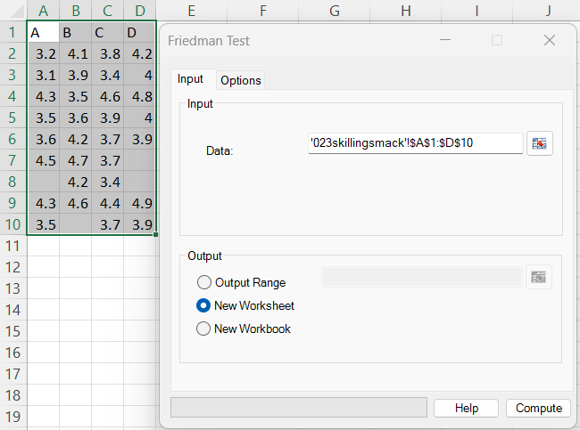
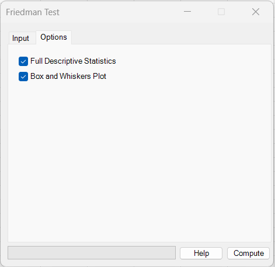
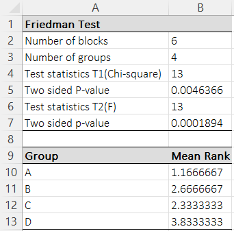
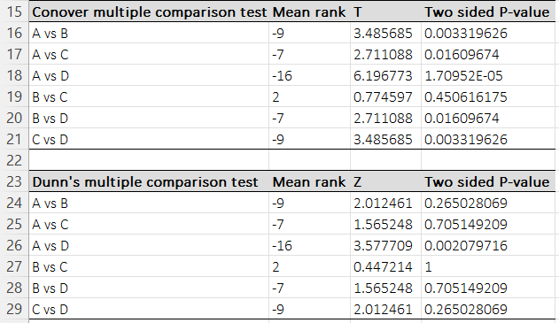
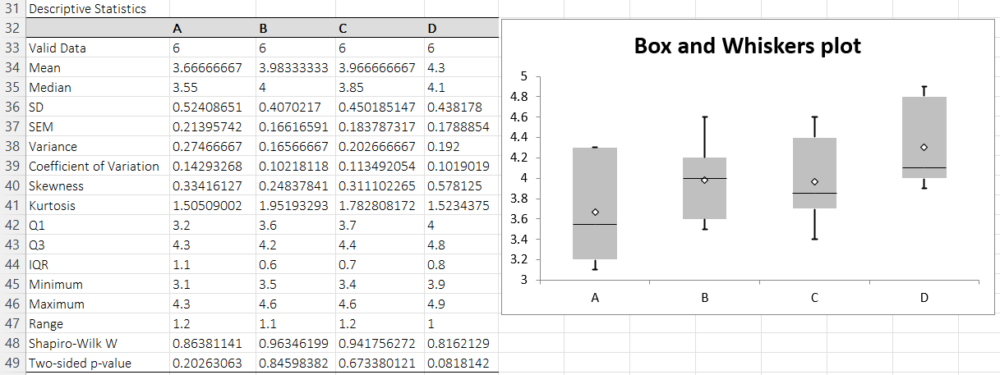

# Friedman Test

**Includes:** Friedman test (T1 chi-square, T2 Iman–Davenport F), Mean ranks table, Post-hoc multiple comparisons (Conover and Dunn), Descriptive stats (optional), Box and Whiskers plot (optional).  
**Purpose:** Nonparametric repeated-measures alternative to one-way repeated-measures ANOVA.

## Overview
The Friedman test compares **three or more related groups** (repeated measures / matched blocks) by converting the values
within each block (row) into ranks and testing whether the group rank sums differ more than expected under the null hypothesis
of equal distributions.

Typical use cases:
- Comparing 3+ treatments measured on the **same subjects**
- Multiple conditions measured on the **same experimental units**
- Repeated ratings of the same items

If some blocks have missing values, consider **Skillings–Mack** instead (it is designed for incomplete block designs).

## Example dataset
The screenshots use columns **A–D** from:

[`023skillingsmack.csv`](../assets/data/023skillingsmack/023skillingsmack.csv)

The dataset contains some missing values; the Friedman test uses **complete blocks only**, so only rows with all four values are analyzed.

## Screenshots

### Input


### Options


### Output


### Post-hoc comparisons


### Descriptive statistics and plot (optional)


## When to use it
Use the Friedman test when:

- You have **k ≥ 3** related groups (columns), measured on the same blocks/subjects (rows).
- The pairing is by **row** (row *i* across all columns is one block).
- You want to test whether the distributions across groups are identical (often interpreted as equal medians for similarly shaped distributions).

Main requirements:

- Blocks (subjects) are independent of each other.
- Data are at least ordinal (rankable).
- Missing values: the Friedman test assumes a **complete block design**.

## Inputs in Excel
- **Data:** Select a rectangular range containing all related groups (each column is a group; each row is a block).

### Missing values
Rows with missing / non-numeric values in **any** group are excluded.  
The output reports the remaining **Number of blocks**.

## Steps in the add-in
1. Open **Friedman Test**.
2. Select the **Data** range (all groups/columns).
3. (Optional) check **Full Descriptive Statistics** and/or **Box and Whiskers Plot**.
4. Choose an output location (new worksheet / workbook / range).
5. Click **Compute**.

## What it does (math and implementation details)

Let there be \(n\) blocks (rows) and \(k\) groups (columns). Let \(x_{ij}\) be the value for block \(i\) in group \(j\).

### Step 1: rank within each block
Within each block \(i\), rank the \(k\) values \(x_{i1},\dots,x_{ik}\) from smallest to largest.
Ties within a block receive the average rank.

Let \(r_{ij}\) be the rank of \(x_{ij}\) within block \(i\).

### Step 2: rank sums and mean ranks
For each group \(j\), compute the rank sum:

\[
R_j=\sum_{i=1}^{n} r_{ij}
\]

The output also shows the mean rank:

\[
\bar r_j = \frac{R_j}{n}
\]

### Test statistic T1 (chi-square approximation)
The Friedman chi-square statistic is:

\[
Q = \frac{12}{n\,k\,(k+1)}\sum_{j=1}^{k}R_j^2 - 3n(k+1)
\]

Under \(H_0\) (no differences between groups), \(Q\) is approximately \(\chi^2\) with \(k-1\) degrees of freedom.

This is reported as **Test statistics T1 (Chi-square)** and its two-sided p-value.

### Test statistic T2 (Iman–Davenport F approximation)
BESHStatNG also reports the Iman–Davenport correction:

\[
F = \frac{(n-1)\,Q}{n(k-1)-Q}
\]

which is approximately \(F_{k-1,\,(k-1)(n-1)}\).

This is reported as **Test statistics T2 (F)** and its p-value.

!!! note "Recommendation:"
    - Use **T2 (F)** as the primary p-value when you have a small/moderate number of blocks.  
    - Use **T1 (Chi-square)** mainly for comparison with textbooks/software that report only the classical statistic.

## Post-hoc multiple comparisons

When the omnibus Friedman test is significant, it is common to examine which pairs of groups differ.

BESHStatNG reports two post-hoc procedures:

### Dunn’s multiple comparison test (Z)
For each pair of groups \(a,b\), using rank sums \(R_a, R_b\):

\[
Z_{ab}=\frac{R_a-R_b}{\sqrt{\frac{n\,k\,(k+1)}{6}}}
\]

Two-sided p-values are computed from the standard normal distribution and then **Bonferroni-corrected**
for the number of pairwise comparisons \(m=\frac{k(k-1)}{2}\):

\[
p_{\text{adj}} = \min(1,\, m \cdot p)
\]

This matches the behavior in the example output (Dunn p-values are adjusted).

### Conover’s multiple comparison test (T)
Conover’s procedure uses a pooled variance estimate derived from \(Q\):

\[
s^2=\frac{n(k-1)-Q}{(n-1)(k-1)}
\]

and the test statistic:

\[
T_{ab}=\frac{R_a-R_b}{\sqrt{\left(\frac{n\,k\,(k+1)}{6}\right)s^2}}
\]

Two-sided p-values are computed using a t distribution with:

\[
df=(n-1)(k-1)
\]

**Note:** in BESHStatNG’s output, Conover p-values are shown **unadjusted** (pairwise). If you need multiplicity control,
apply a correction (Bonferroni/Holm/FDR) to the p-values.

## Output (what BESHStatNG writes)

### Friedman test table
- **Number of blocks** (\(n\))
- **Number of groups** (\(k\))
- **T1 (Chi-square)** and p-value
- **T2 (F)** and p-value
- **Mean Rank** per group

### Post-hoc tables
- **Conover multiple comparisons:** difference in rank sums (shown as “Mean ran” in the sheet), \(T\), and two-sided p-value
- **Dunn’s multiple comparisons:** difference in rank sums, \(Z\), and two-sided p-value (Bonferroni adjusted)

### Descriptive statistics and plot (optional)
If enabled, the add-in outputs descriptive statistics per group and a box-and-whiskers plot.

## How to interpret (quick guide)
- **Small p-values** for T1/T2 suggest at least one group tends to have systematically higher/lower values than others.
- **Mean ranks** indicate ordering: larger mean rank means larger values on average within blocks.
- **Post-hoc tests** help identify which pairs differ. Use the adjusted p-values (e.g., Dunn with Bonferroni) if you want
to control family-wise error across pairwise tests.

## Relationship to R (how to reproduce)
Below is an R snippet that reproduces the Friedman test, mean ranks, and (optionally) Conover/Dunn post-hoc comparisons.

```r
dat <- read.csv("023skillingsmack.csv")

# Use columns A–D and keep complete blocks only (matches add-in behavior)
X <- as.matrix(dat[, c("A","B","C","D")])
X <- X[complete.cases(X), ]

n <- nrow(X)
k <- ncol(X)

# Friedman chi-square (T1)
ft <- friedman.test(X)
ft

# Iman–Davenport F (T2) computed from the Friedman chi-square statistic
Q <- as.numeric(ft$statistic)
Fstat <- ((n - 1) * Q) / (n * (k - 1) - Q)
pF <- pf(Fstat, df1 = k - 1, df2 = (k - 1) * (n - 1), lower.tail = FALSE)
Fstat; pF

# Mean ranks (matches the "Mean Rank" table)
mean_ranks <- colMeans(t(apply(X, 1, rank)))
mean_ranks

# Optional: Conover and Dunn post-hoc tests
# (PMCMRplus provides these; set p.adjust to match add-in output)
if (requireNamespace("PMCMRplus", quietly = TRUE)) {
  PMCMRplus::frdAllPairsConoverTest(X, p.adjust.method = "none")         # unadjusted
  PMCMRplus::frdAllPairsDunnTest(X, p.adjust.method = "bonferroni")      # Bonferroni
}
```

### Why R may differ slightly from BESHStatNG
- Different post-hoc functions can use different (valid) conventions (e.g., whether p-values are adjusted by default).
  In the code above, `p.adjust.method` is set to match the add-in.
- If you do not drop incomplete blocks, R’s `friedman.test()` will error or behave differently; the add-in uses **complete cases**.

## Notes and limitations
- Friedman assumes a complete block design. If you have missing values within blocks, consider **Skillings–Mack**.
- Like all rank-based methods, the test is most interpretable when the group distributions have similar shapes.

## References

- Altman D.G. Practical Statistics for medical research. Chapman & Hall, 1991.
- Conover W.J. Practical Nonparametric Statistics (3rd ed.). Wiley 1999.
- Dunn O.J. Multiple Comparisons Using Rank Sums. Technometrics, Vol. 6, No. 3 (1964), 241-252.
- Friedman M. (1937). The use of ranks to avoid the assumption of normality implicit in the analysis of variance. Journal of the American Statistical Association, 32 (200): 675–701.
- Friedman M. (1939). A correction: The use of ranks to avoid the assumption of normality implicit in the analysis of variance. Journal of the American Statistical Association, 34 (205): 109.
- Iman R.L., Davenport J.M. Approximations to the critical region of the Friedman statistic. Communications in Statistics - Theory and Methods 1980; A9:571-595.

## See also
- [Skillings–Mack Test](skillings-mack-test.md)
- [Kruskal-Wallis Test](kruskal-wallis-test.md)
- [Wilcoxon Signed Rank Test](wilcoxon-signed-rank-test.md)
- [Box and Whiskers plot](box-and-whiskers.md)
- [Home](../index.md)
