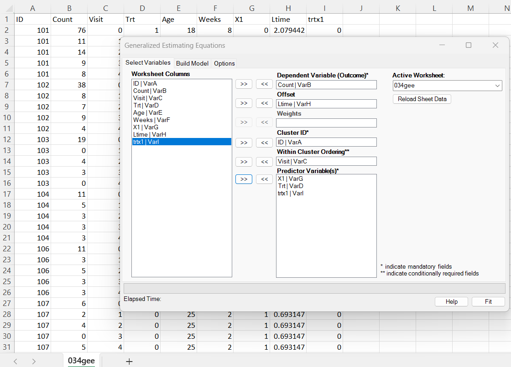
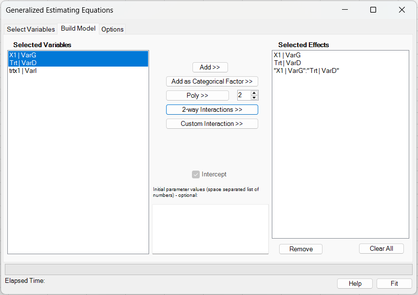
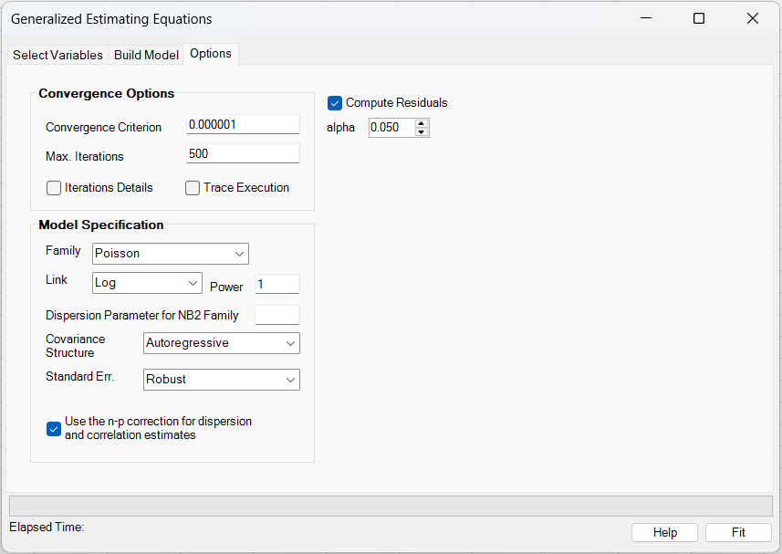
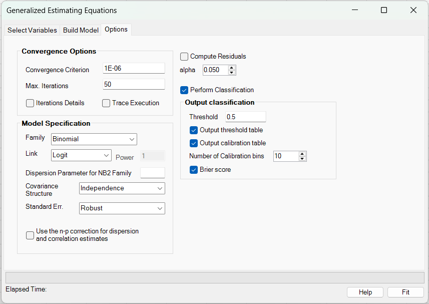
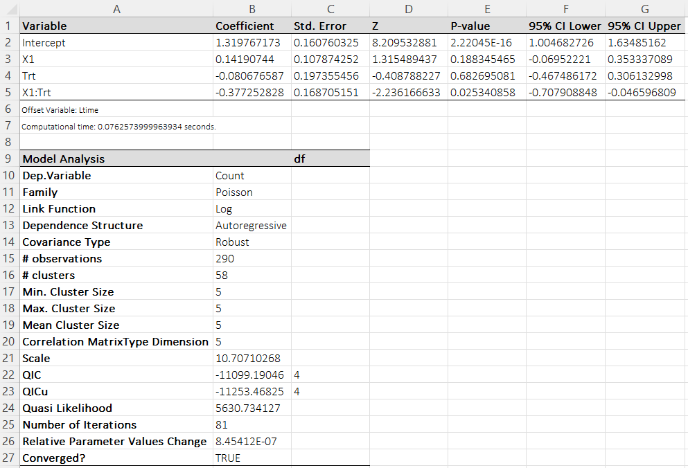
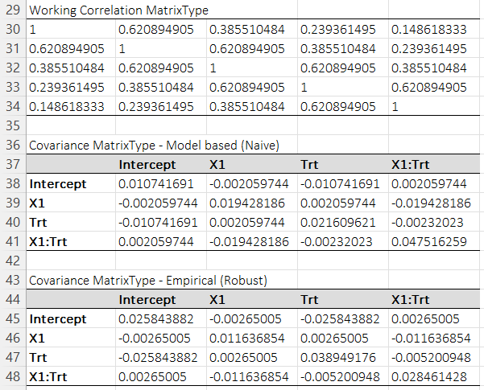

# Generalized Estimating Equations (GEE)

**Includes:** Families: Gaussian, Binomial, Poisson, Negative Binomial, Gamma, Covariance structures: Independence, Exchangeable, Autoregressive, Unstructured, SE types: Robust, Naive, Bias-reduced, categorical factors, polynomial terms, continuous-variable interactions, optional starting values, and—for Binomial models—optional classifier reporting (confusion matrix, threshold table, calibration table/plot, Brier score, ROC tables and ROC plot).  
**Purpose:** Fit marginal models for correlated/clustered data using GEE with selectable working correlation, including marginal-probability reporting for fitted binary Binomial models.

---

## Overview

Generalized Estimating Equations (GEE) extend generalized linear models to data where observations are **correlated within clusters** (subjects, sites, families, etc.). GEE focuses on the **marginal mean model** and uses a **working correlation matrix** to improve efficiency while retaining consistent regression estimates when the mean model is correctly specified.

Let cluster \(i=1,\dots,m\) have observations \(j=1,\dots,n_i\). Define:

- response \(y_{ij}\)
- covariate row vector \(\mathbf{x}_{ij}\in\mathbb{R}^p\) (including intercept if present)
- linear predictor \(\eta_{ij}=\mathbf{x}_{ij}^\top\bf \beta + o_{ij}\) (offset \(o_{ij}\) optional)
- mean \(\mu_{ij}=g^{-1}(\eta_{ij})\)

The working covariance for cluster \(i\) is

\[
\mathbf{V}_i = \phi\,\mathbf{A}_i^{1/2}\,\mathbf{R}(\bf \alpha)\,\mathbf{A}_i^{1/2},
\qquad
\mathbf{A}_i=\mathrm{diag}\{V(\mu_{i1}),\dots,V(\mu_{in_i})\},
\]

where:

- \(V(\mu)\) is the family variance function
- \(\phi\) is a scale/dispersion parameter
- \(\mathbf{R}(\bf \alpha)\) is a **working correlation** (Independence / Exchangeable / AR(1) / Unstructured)

All implemented families, links, and correlation-structure mathematics are documented separately in: **[GLM/GEE families, links, and working correlation structures](family-link-covmat.md)**

---

## User interface

### Select Variables



1. **Dependent Variable (Outcome)**: response \(y\).
2. **Offset** (optional): a known additive term \(o_{ij}\) in \(\eta_{ij}\).  
   For log-link count models this is typically \(\log(\text{exposure})\).
3. **Weights** (optional): accepted in the UI and echoed in the output header. *(Current implementation does not apply weights in the estimating equations.)*
4. **Cluster ID**: subject/cluster identifier.
5. **Within Cluster Ordering**: the visit/time/order variable. **Required** for AR(1) and Unstructured correlation. Used to determine the ordering of repeated measurements within each cluster.
6. **Predictor Variable(s)**: covariates in the linear predictor.

!!! note "Within-cluster ordering"
    The data are expected to be ordered by **Cluster ID** and then **Within Cluster Ordering**. The add-in also builds its internal time index from the ordering variable (or from row order if ordering is omitted).

### Build Model



- **Add >>** adds the selected variable(s) as continuous main effects.
- **Add as Categorical Factor >>** marks the selected variable(s) as categorical main effects. Internally, BESHStatNG expands each selected factor into reference-coded indicator columns.
- **Poly >>** creates polynomial terms for the selected variable(s). The degree is taken from the numeric box next to the button.
- **2-way Interactions >>** creates all pairwise interactions among the currently selected variables.
- **Custom Interaction >>** creates one multi-way interaction term spanning all currently selected variables.
- **Intercept** is always included.
- **Initial parameter values** (optional):
  - If provided, they are used as the starting \(\bf \beta^{(0)}\).
  - The number of supplied values must match the number of **expanded** GEE mean-model coefficients, including the intercept.
  - If omitted, starting values are obtained by fitting a **GLM under independence** (see *Estimation* below).

Current limitations:

- Polynomial terms are supported only for **continuous** predictors.
- Interaction terms are currently supported only for **continuous × continuous** combinations.
- Interactions involving categorical predictors are **not implemented yet**.

!!! note
    The **Selected Effects** list shows the authored terms, while the fitted coefficient table may contain more columns after expansion (for example, one coefficient per non-reference factor level).

### Options

For most families, the options page looks as follows:



When **Family = Binomial**, the page exposes the additional **Perform Classification** block:



**Convergence options**

- **Convergence Criterion** \(\varepsilon\): tolerance for the parameter-change convergence test.
- **Max. Iterations**: maximum number of GEE iterations.
- **Trace Execution**: writes per-iteration diagnostic information to the log.
- **Iterations Details**: outputs a per-iteration table of coefficients and the convergence statistic.
- **Compute Residuals**: exports GLM-style residuals (raw, Pearson, deviance, etc.) to a separate output file/sheet.
- **Alpha**: two-sided significance level used for Wald confidence intervals. Default: **0.05** (95% confidence interval).

**Model specification**

- **Family**, **Link**, and **Power** (for Power link)
- **Dispersion Parameter for NB2 Family**: the NB2 dispersion \(\alpha>0\) (see `family-link-covmat.md`).
- **Covariance Structure**: Independence / Exchangeable / AR(1) / Unstructured.
- **Standard Err.**:
  - **Robust** (empirical “sandwich”) — default and recommended.
  - **Naive** (model-based; uses the working correlation and estimated scale).
  - **Bias Reduced** (Mancl–DeRouen bias-corrected sandwich; see below).
- **Use the n-p correction for dispersion and correlation estimates**: applies small-sample corrections in the moment estimators used for \(\phi\) and \(\bf \alpha\).

---

## Example dataset

Download the example dataset used here: [034gee.csv](../assets/data/034gee/034gee.csv)

The dataset contains repeated counts by subject:

- `ID`: subject/cluster id
- `Visit`: within-subject visit order (0–4)
- `Count`: response (counts)
- `X1`, `Trt`, `trtx1`: predictors (`trtx1` is an interaction column kept in the example dataset for backward compatibility; the current UI can now author the interaction directly in the **Build Model** tab)
- `Ltime`: log-exposure offset
- (additional columns may be present but not used by the example model)

Residual export from the example: [034gee_residuals.csv](../assets/data/034gee/034gee_residuals.csv)

---

## Mean model

For observation \(j\) in cluster \(i\):

\[
\eta_{ij} = \mathbf{x}_{ij}^\top\bf \beta + o_{ij},\qquad
\mu_{ij} = g^{-1}(\eta_{ij}).
\]

Interpretation depends on the link:

- **Log link** (Poisson/NB2/Gamma typical): \(\mu_{ij} = \exp(\eta_{ij})\).  
  A one-unit increase in \(x_k\) multiplies the mean by \(\exp(\beta_k)\), holding other covariates and the offset fixed.
- **Logit/Probit** (Binomial): \(\beta_k\) is a marginal (population-averaged) effect on the transformed probability scale.

---

## Estimation

### Estimating equations

Define the cluster vectors:

\[
\mathbf{y}_i = (y_{i1},\dots,y_{in_i})^\top,\qquad
\bf \mu_i = (\mu_{i1},\dots,\mu_{in_i})^\top.
\]

Let \(\mathbf{X}_i\) be the \(n_i\times p\) design matrix for cluster \(i\), and define

\[
\mathbf{D}_i = \frac{\partial \bf \mu_i}{\partial \bf \beta^\top}
= \mathrm{diag}\!\left(\frac{d\mu_{i1}}{d\eta_{i1}},\dots,\frac{d\mu_{in_i}}{d\eta_{in_i}}\right)\mathbf{X}_i.
\]

The GEE score is

\[
\mathbf{U}(\bf \beta)=\sum_{i=1}^m \mathbf{D}_i^\top \mathbf{V}_i^{-1}\,(\mathbf{y}_i-\bf \mu_i),
\]

and the estimator solves \(\mathbf{U}(\hat{\bf \beta})=\mathbf{0}\).

### Iterative algorithm (Fisher scoring / Newton step)

BESH Stat NG uses the standard linearization update:

\[
\bf \beta^{(t+1)}
=
\bf \beta^{(t)}
+
\Bigg(\sum_{i=1}^m \mathbf{D}_i^\top \mathbf{V}_i^{-1}\mathbf{D}_i\Bigg)^{-1}
\Bigg(\sum_{i=1}^m \mathbf{D}_i^\top \mathbf{V}_i^{-1}(\mathbf{y}_i-\bf \mu_i)\Bigg).
\]

At each iteration:

1. Compute \(\bf \mu_i\) from the current \(\bf \beta^{(t)}\) (including any offset).
2. Update the dependence parameters \(\bf \alpha\) for the chosen working correlation using method-of-moments estimators (see [GLM/GEE families, links, and working correlation structures](family-link-covmat.md)).
3. Repeat until convergence.

### Starting values

If initial values are not supplied, the add-in obtains \(\bf \beta^{(0)}\) by fitting the **corresponding GLM under independence** (same family/link/offset) and uses that fit as the starting point for GEE.

### Convergence criterion (SAS-style parameter change)

Let \(\Delta_j^{(t)} = \big|\beta_j^{(t+1)}-\beta_j^{(t)}\big|\). For stability, the add-in uses a mixed absolute/relative rule:

\[
d_j^{(t)} =
\begin{cases}
\Delta_j^{(t)} / |\beta_j^{(t+1)}|, & |\beta_j^{(t+1)}| > 0.08,\\
\Delta_j^{(t)}, & \text{otherwise.}
\end{cases}
\qquad
d^{(t)} = \max_j d_j^{(t)}.
\]

Convergence is declared when \(d^{(t)} < \varepsilon\) for **two successive iterations**.

!!! note
    The “Relative Parameter Values Change” reported in the results table is the final \(d^{(t)}\).

---

## Scale (dispersion) and the n-p correction

After the final iteration the add-in estimates a Pearson-type scale:

\[
\hat\phi = \frac{\sum_{i,j} r_{ij}^2}{n}
\quad\text{or}\quad
\hat\phi = \frac{\sum_{i,j} r_{ij}^2}{n-p}\ \ (\text{if n-p correction is enabled}),
\]

where

\[
r_{ij}=\frac{y_{ij}-\mu_{ij}}{\sqrt{V(\mu_{ij})}}.
\]

This \(\hat\phi\) is shown as **Scale** in the Model Analysis table and is used to scale the **Naive** covariance matrix.

!!! important "Poisson/Binomial/NB2 scale vs residual scaling"
    Even when a scale estimate is reported, the exported **Std Pearson Resid.** and **Std Deviance Resid.** are scaled by \(\phi=1\) for Poisson/Binomial/NB2 when the internal scale-type setting is “none” (matching common GLM conventions). This is why standardized and unstandardized residual columns can be identical in Poisson examples.

---

## Covariance matrices and standard errors

Let

\[
\mathbf{B}=\sum_{i=1}^m \mathbf{D}_i^\top \mathbf{V}_i^{-1}\mathbf{D}_i,\qquad
\mathbf{S}_i=\mathbf{D}_i^\top \mathbf{V}_i^{-1}(\mathbf{y}_i-\bf \mu_i).
\]

### Naive (model-based)

\[
\widehat{\mathrm{Var}}_{\text{naive}}(\hat{\bf \beta})
=
\hat\phi\,\mathbf{B}^{-1}.
\]

This uses the specified working correlation and the estimated scale \(\hat\phi\).

### Robust (empirical sandwich)

\[
\widehat{\mathrm{Var}}_{\text{robust}}(\hat{\bf \beta})
=
\mathbf{B}^{-1}
\Big(\sum_{i=1}^m \mathbf{S}_i\mathbf{S}_i^\top\Big)
\mathbf{B}^{-1}.
\]

This is consistent even if the working correlation is misspecified (given correct mean model), and is the default **Standard Err.** option.

### Bias Reduced (Mancl–DeRouen)

For small numbers of clusters, the sandwich variance can be downward biased. If **Bias Reduced** is selected, the add-in computes a bias-corrected sandwich estimator following Mancl & DeRouen (2001), using leverage-adjusted residuals within each cluster:

- Compute a cluster “hat” matrix \(\mathbf{H}_i\) (leverage) based on \(\mathbf{B}^{-1}\) and \(\mathbf{D}_i^\top\mathbf{V}_i^{-1}\mathbf{D}_i\).
- Form adjusted residuals \(\tilde{\mathbf{r}}_i = (\mathbf{I}-\mathbf{H}_i)^{-1}\mathbf{r}_i\).
- Recompute score-like contributions using \(\tilde{\mathbf{r}}_i\), then plug into a sandwich form.

The results sheet includes an additional **Covariance Matrix – Bias Reduced** block when this option is used.

---

## Model diagnostics

### Wald coefficient tests

For each coefficient \(\beta_k\), the add-in reports:

- **Coefficient** \(\hat\beta_k\)
- **Std. Error** \(\widehat{\mathrm{SE}}(\hat\beta_k)\) from the selected SE type
- **Z** statistic:

\[
z_k = \frac{\hat\beta_k}{\widehat{\mathrm{SE}}(\hat\beta_k)}
\]

- **P-value**: two-sided normal approximation \(2\Phi(-|z_k|)\)
- **Confidence interval at level \(1-\alpha\)**:

\[
\hat\beta_k \pm z_{1-\alpha/2}\,\widehat{\mathrm{SE}}(\hat\beta_k).
\]

In the current production UI, **Alpha** is user-selectable. The default is \(\alpha=0.05\), which gives a 95% confidence interval.

### Quasi-likelihood and QIC

The add-in reports:

- **Quasi Likelihood**: \(Q=\sum_{i,j} Q(y_{ij},\mu_{ij})\) where \(Q(\cdot)\) is the family quasi-likelihood contribution (see [GLM/GEE families, links, and working correlation structures](family-link-covmat.md)).
- **QICu** (Pan, 2001):

\[
\mathrm{QICu} = -2Q + 2p.
\]

- **QIC**:

\[
\mathrm{QIC} = -2Q + 2\,\mathrm{tr}\big(\bf \Omega_I^{-1}\,\widehat{\mathrm{Var}}_{\text{robust}}(\hat{\bf \beta})\big),
\]

where \(\bf \Omega_I\) is the **independence** covariance from the initial GLM fit used for starting values.

!!! note "Using QIC/QICu"
    - QIC can be used to compare models that differ in **mean** and **working correlation**.
    - QICu is primarily for comparing **mean structures** (covariates) when correlation structures are fixed.

---

## Residuals (export)

If **Compute Residuals** is checked, the add-in exports a residual table containing the original data columns, fitted mean (**Prediction**), and the residual types below.

### Residual types

Let \(\hat\mu_{ij}\) be the fitted mean and \(\hat\eta_{ij}\) the fitted linear predictor.

**Raw residual:**

$$
r^{\text{raw}}_{ij} = y_{ij}-\hat\mu_{ij}.
$$

**Pearson residual:**

$$
r^{\text{P}}_{ij}=\frac{y_{ij}-\hat\mu_{ij}}{\sqrt{V(\hat\mu_{ij})}}.
$$

**Std Pearson residual:**

$$
r^{\text{P,std}}_{ij}=\frac{r^{\text{P}}_{ij}}{\sqrt{\phi_{\text{res}}}}.
$$

where \(\phi_{\text{res}}\) follows the rule described in the “Poisson/Binomial/NB2 scale vs residual scaling” note above.

**Deviance residual:**

$$
r^{\text{D}}_{ij}=\mathrm{sign}(y_{ij}-\hat\mu_{ij})\sqrt{D(y_{ij},\hat\mu_{ij})}.
$$

where \(D(\cdot)\) is the family deviance contribution (see [GLM/GEE families, links, and working correlation structures](family-link-covmat.md)).

**Std Deviance residual:** \(r^{\text{D}}_{ij}/\sqrt{\phi_{\text{res}}}\).

**Working residual:**

$$
r^{\text{work}}_{ij} = \frac{y_{ij}-\hat\mu_{ij}}{d\mu/d\eta\big|_{\eta=\hat\eta_{ij}}}.
$$

### Residual output file

The residual export produced for the example is provided here: [034gee_residuals.csv](../assets/data/034gee/034gee_residuals.csv)

---

## Output worksheets

### GEE (main results)



The main results sheet contains:

1. **Coefficient table** (Coefficient, SE, Z, P-value, confidence interval at the selected level).
2. **Model Analysis** block (family/link, dependence structure, SE type, counts of clusters/observations, scale, QIC/QICu/quasi-likelihood, iterations, convergence).
3. **Working Correlation Matrix** (dimension = number of unique within-cluster time values).
4. **Covariance matrices**:
   - Model-based (Naive)
   - Empirical (Robust)
   - Bias Reduced (if selected)

When **Family = Binomial** and **Perform Classification** is checked, the workbook also includes a separate **GEE Classification** sheet with:

- confusion matrix / classification summary at the chosen threshold
- optional threshold-performance table
- optional calibration table
- optional Brier score table
- ROC summary tables
- ROC plot
- calibration plot

### Classification reporting for binomial GEE

For a fitted Binomial GEE, the reported class probabilities are the fitted **marginal** probabilities \(\hat p_{ij}\). Given a user-selected threshold \(c\), the add-in defines the predicted class by

\[
\hat y_{ij} =
\begin{cases}
1, & \hat p_{ij} \ge c,\\
0, & \hat p_{ij} < c.
\end{cases}
\]

The classification sheet then summarizes:

- threshold-dependent confusion counts and derived measures
- calibration of fitted marginal probabilities
- threshold-free probability error through the **Brier score**
- discrimination through the **ROC** curve and AUC-related summaries

Because GEE targets the marginal mean, these classification summaries should be interpreted as **population-averaged** rather than subject-specific.

### Additional matrices



---

## Brief interpretation of the example output

For the example Poisson log-link model with offset `Ltime`:

- \(\exp(\hat\beta_{\text{Trt}})\) is the marginal multiplicative treatment effect when `X1=0`.
- The interaction `trtx1` modifies the treatment effect when `X1=1`.  
  With a log link, the treatment effect for `X1=1` becomes \(\exp(\hat\beta_{\text{Trt}}+\hat\beta_{\text{trtx1}})\).
- Robust SEs provide inference that is less sensitive to the working correlation assumption.

---

## R code reference (to reproduce results)

The closest drop-in equivalents are in `geepack`. Use the same **family**, **link**, **offset**, and **working correlation** to match BESH Stat NG as closely as possible.

### Fit the model (geepack)

```r
# install.packages("geepack")
library(geepack)

dat <- read.csv("034gee.csv")

# Example mean model (matches the add-in example):
# Count ~ X1 + Trt + trtx1 with log-link Poisson and offset Ltime
fit <- geeglm(
  Count ~ X1 + Trt + trtx1,
  id      = ID,
  waves   = Visit,          # within-cluster ordering (important for AR1 / unstructured)
  family  = poisson(link = "log"),
  offset  = Ltime,
  corstr  = "unstructured", # or "ar1", "exchangeable", "independence"
  data    = dat
)

summary(fit)
coef(fit)
confint(fit)

# Working correlation estimate
fit$geese$alpha   # structure-specific parameterization

# QIC (Pan 2001) is available in geepack
QIC(fit)
```

### Expected differences vs BESH Stat NG

- **Working-correlation parameter updates (especially AR(1) / Unstructured):** Different packages use different method-of-moments formulas, different normalization (sum vs mean), and different small-sample corrections for the correlation update. Small differences in \(\hat{\alpha}\) can propagate to small differences in \(\hat{\beta}\) and SEs when the working correlation is not independence. 
- **AR(1) “lag-1” definition:** Implementations differ in whether the lag-1 moment uses only *adjacent rows in the supplied order* (equal-spacing assumption) versus using actual time gaps (e.g., \(\rho^{\Delta t}\)) or skipping gaps differently. This mostly affects \(\hat\rho\) and the naive/model-based SEs under AR(1). 
- **Scale/dispersion handling (\(\phi\)) for Poisson/Binomial/NB2:** Some software fixes \(\phi=1\) (common GLM convention for Poisson/Binomial), while others estimate a Pearson-type scale and/or apply an \(n-p\) correction. BESH Stat NG’s outputs can therefore differ depending on whether \(\phi\) is fixed or estimated, and whether that \(\hat\phi\) is used to scale the **Naive** covariance. 
- **Finite-sample / bias-corrected SE options:** Not all R packages implement the same “bias-reduced” sandwich (e.g., Mancl–DeRouen) or apply it the same way. If you compare BESH “Bias Reduced” SEs to standard robust SEs in R, Z/P/CI differences can be noticeable with modest cluster counts. 
- **Convergence criteria and iteration schedule:** Defaults vary: absolute vs relative parameter change, “two successive iterations” rules, and how often correlation/scale are re-estimated. That can yield small numeric differences even with the same mean model and correlation structure. 
- **QIC/QICu conventions:** QIC depends on (i) the quasi-likelihood implementation and (ii) the specific “independence” covariance used in the trace term. Packages may implement the trace term with slightly different reference matrices, so QIC/QICu can differ even when coefficients match closely. 
- **Residual standardization and boundary conventions:** Residual columns (raw/Pearson/deviance/standardized) are broadly comparable, but differences arise from whether residuals are standardized by \(\sqrt{\hat\phi}\) for Poisson/Binomial and how deviance contributions behave at boundaries (e.g., \(y=0\) in Poisson). 

---

## References

- Nelder, J. A., & Wedderburn, R. W. M. (1972). *Generalized Linear Models*. Journal of the Royal Statistical Society: Series A (General), 135(3), 370–384.
- McCullagh, P., & Nelder, J. A. (1989). *Generalized Linear Models* (2nd ed.). Chapman & Hall/CRC.
- Liang, K.-Y., & Zeger, S. L. (1986). Longitudinal data analysis using generalized linear models. *Biometrika*, 73(1), 13–22. https://doi.org/10.1093/biomet/73.1.13
- Zeger, S. L., Liang, K.-Y., & Albert, P. S. (1988). Models for longitudinal data: A generalized estimating equation approach. *Biometrics*, 44(4), 1049–1060.
- Diggle, P. J., Heagerty, P. J., Liang, K.-Y., & Zeger, S. L. (2002). *Analysis of Longitudinal Data* (2nd ed.). Oxford University Press.
- Hardin, J. W., & Hilbe, J. M. (2012/2013). *Generalized Estimating Equations* (2nd ed.). Chapman & Hall/CRC.
- Pan, W. (2001). Akaike’s information criterion in generalized estimating equations. *Biometrics*, 57(1), 120–125. https://doi.org/10.1111/j.0006-341X.2001.00120.x
- Mancl, L. A., & DeRouen, T. A. (2001). A covariance estimator for GEE with improved small-sample properties. *Biometrics*, 57(1), 126–134. https://doi.org/10.1111/j.0006-341X.2001.00126.x

## See also
- [Family - Link](family-link-covmat.md)
- [Generalized Linear Models (GLM)](generalized-linear-models-glm.md)
- [Home](../index.md)
