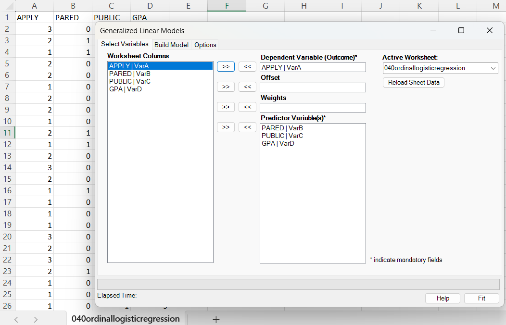
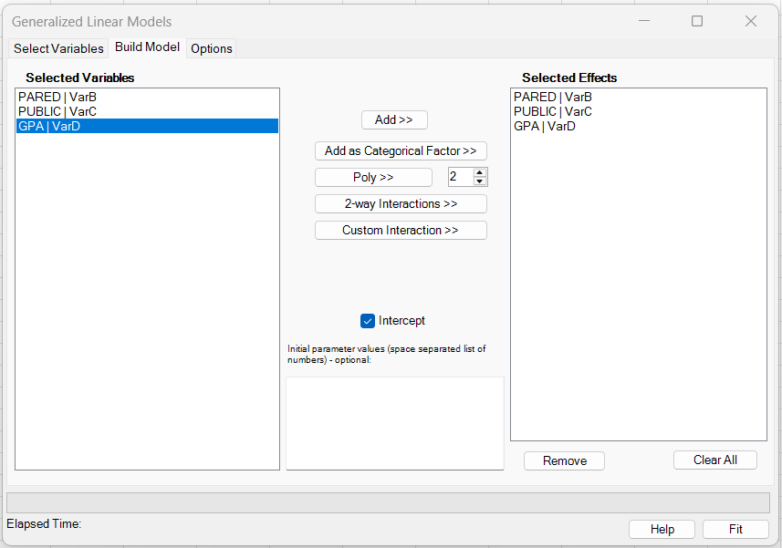
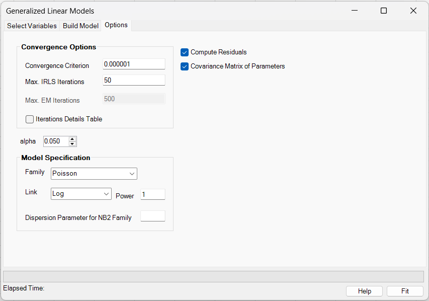
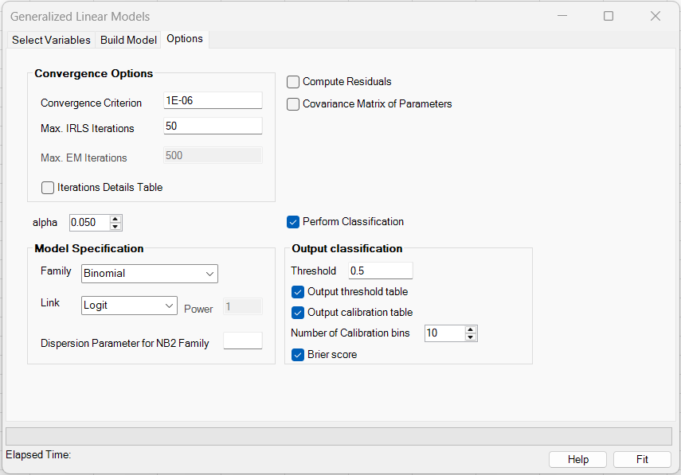
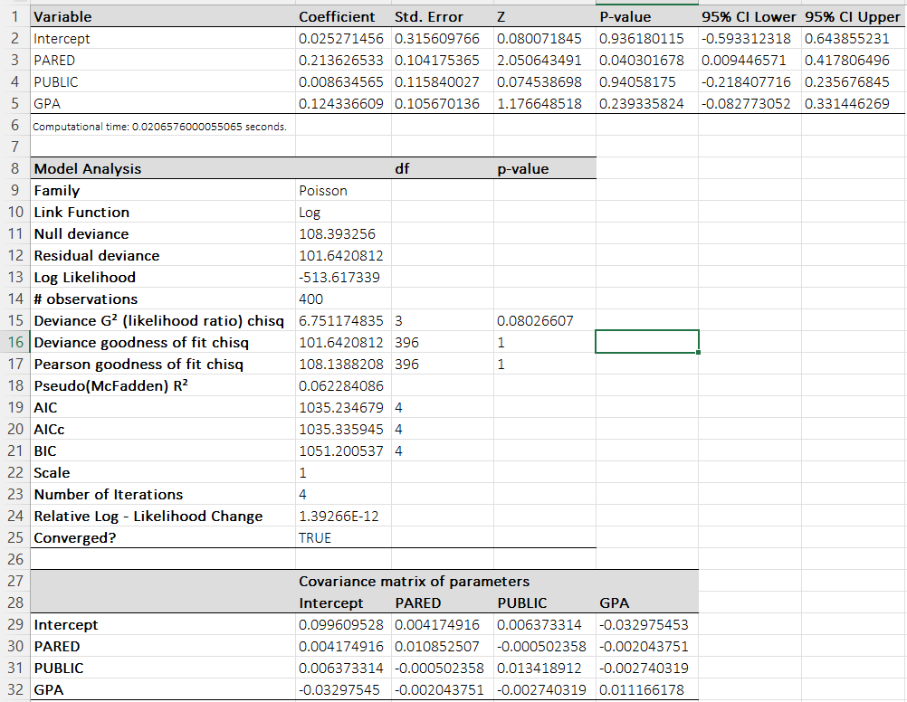

# Generalized Linear Models (GLM)

**Includes:** GLM families: Gaussian, Binomial, Poisson, Negative Binomial, Gamma, Links per family (selectable), categorical factors, polynomial terms, continuous-variable interactions, optional starting values, optional weights and offset, IRLS with user-set iterations/ε, optional covariance matrix and residuals, and—for Binomial models—optional classifier reporting (confusion matrix, threshold table, calibration table/plot, Brier score, ROC tables and ROC plot).  
**Purpose:** Fit generalized linear models to a wide range of outcome types with configurable link functions, including probability-model reporting for fitted binary Binomial models.

---

## Overview

A generalized linear model (GLM) relates the mean of a response \(Y\) to predictors \(x\) through:

- a **random component** (distribution family) with mean \(\mu=\mathbb{E}[Y]\) and variance \(V(\mu)\),
- a **systematic component** (linear predictor) \(\eta = \beta_0 + x^\top\beta\) (plus optional offset),
- a **link function** \(g(\cdot)\) such that \(g(\mu)=\eta\).

BESH Stat NG implements GLM fitting using **iteratively reweighted least squares (IRLS)** (Fisher scoring). See [GLM/GEE families, links, and working correlation structures](family-link-covmat.md) for the supported families and links and their mathematical definitions.

---

## User interface

In Excel ribbon: **BESH Stat NG → Analyse → Regression → Generalized Linear Models (GLM)**.

### Select variables

Provide:

- **Dependent variable (Outcome)** \(y\)
- **Predictor variable(s)** \(x_1,\dots,x_p\)
- **Offset** (optional)  
- **Weights** (optional)

!!! note "Offset and null deviance"
    The null deviance \(D_0\) is computed by fitting the **intercept-only** model using the same family/link and the **same offset in the linear predictor**:
    \(\eta_i=\beta_0+o_i\).
    This matches R’s `glm()` definition for null deviance when an offset is present.

### Build model

- **Add >>** adds the selected variable(s) as continuous main effects.
- **Add as Categorical Factor >>** marks the selected variable(s) as categorical main effects. Internally, BESHStatNG expands each selected factor into reference-coded indicator columns.
- **Poly >>** creates polynomial terms for the selected variable(s). The degree is taken from the numeric box next to the button.
- **2-way Interactions >>** creates all pairwise interactions among the currently selected variables.
- **Custom Interaction >>** creates one multi-way interaction term spanning all currently selected variables.
- **Initial parameter values** are optional. If supplied, they are used as the optimizer starting values, and the required count is based on the **expanded** design matrix.

Current limitations:

- Polynomial terms are supported only for **continuous** predictors.
- Interaction terms are currently supported only for **continuous × continuous** combinations.
- Interactions involving categorical predictors are **not implemented yet**.

### Options

**Convergence options**

- **Convergence Criterion** \(\varepsilon\): stops when the absolute change in deviance between iterations is below \(\varepsilon\).
- **Max. Iterations**: maximum IRLS iterations.
- **Iterations Details Table**: outputs per-iteration parameter values and deviance.
- **Trace Execution**: writes tracing to the application log (developer/diagnostic).
- **Alpha**: two-sided significance level used for Wald confidence intervals. Default: **0.05** (95% confidence interval).

**Model specification**

- **Family**, **Link** (and **Power** parameter for the power link).
- **Dispersion Parameter for NB2 Family**: NB2 variance uses \(V(\mu)=\mu+\alpha\mu^2\). If provided, \(\alpha\) is treated as fixed in GLM (contrast: `GLM_NB` estimates dispersion; see below).
- **Compute Residuals**: writes residual diagnostics to the output workbook.
- **Covariance Matrix of Parameters**: prints \(\widehat{\mathrm{Var}}(\hat\beta)\) (model-based / “naive”).

**Binomial-family classification reporting**

When **Family = Binomial**, the options page enables an additional **Perform Classification** block. This post-fit reporting is available for fitted binary probability models and writes a separate classification worksheet to the output workbook.

- **Perform Classification**: enables classifier-oriented reporting for the fitted Binomial GLM.
- **Threshold**: probability cutoff used for the main confusion-matrix report. Observations with fitted probability \(\hat p_i \ge c\) are classified as predicted positives.
- **Output threshold table**: adds a threshold sweep across candidate cutoffs with TP, FP, TN, FN, sensitivity, specificity, precision, recall, NPV, accuracy, balanced accuracy, Youden’s \(J\), and F1.
- **Output calibration table**: adds grouped calibration results with mean predicted probability, observed event rate, and confidence limits.
- **Number of calibration bins**: number of bins used for the calibration table and the calibration plot (default **10**).
- **Brier score**: adds the mean squared probability error for the fitted Binomial model.

In addition to the tables, the classification worksheet also includes:

- **ROC summary tables** and an **ROC plot** based on the fitted probabilities
- a **calibration plot** with the 45° reference line \(y=x\)

!!! note "Binomial models only"
    The classification block is shown only when **Family = Binomial**. It is disabled for Gaussian, Poisson, Negative Binomial, Gamma, and other non-binary outcome families.

---

## Example dataset (same as the GEE example)

Download: [034gee.csv](../assets/data/034gee/034gee.csv)

This example is adapted from the SAS GEE documentation (count outcome with repeated measures). We model seizure counts as a function of baseline seizure indicator and treatment, with a log-exposure offset:

- Outcome: `Count`
- Predictors: `X1`, `Trt`, and their interaction `X1:Trt` (which can be authored directly in the **Build model** tab)
- Offset: `Ltime` (log time)

Residual export for this example (produced by the add-in): [036glm_residuals.csv](../assets/data/036glm/036glm_residuals.csv)

## User interface

### Select variables



### Build model



### Options

For most families, the options page looks as follows:



When **Family = Binomial**, the page exposes the additional **Perform Classification** block:



---

## Model

For observation \(i\) (with predictors \(x_i\)):

\[
g(\mu_i)=\eta_i=\beta_0 + x_i^\top\beta + o_i,
\qquad
\mu_i = g^{-1}(\eta_i).
\]

The variance is specified by the family: \(\mathrm{Var}(Y_i)=\phi\,V(\mu_i)\), where \(\phi\) is a scale/dispersion parameter (see “Scale / dispersion” below).

---

## Estimation algorithm (IRLS)

BESH Stat NG fits GLMs by IRLS, solving a weighted least-squares problem at each iteration.

Let \(g(\mu)=\eta\). Define:

- derivative of the link with respect to the mean: \(g'(\mu)=\dfrac{d\eta}{d\mu}\),
- variance function \(V(\mu)\),
- (optional) user weights \(w_i^{(\text{user})}\) (default \(=1\)).

At iteration \(t\), with current \(\mu_i^{(t)}\) and \(\eta_i^{(t)}\), compute:

\[
W_i^{(t)}=\frac{w_i^{(\text{user})}}{\left[g'\!\left(\mu_i^{(t)}\right)\right]^2\,V\!\left(\mu_i^{(t)}\right)},
\]

\[
z_i^{(t)}=\eta_i^{(t)} + (y_i-\mu_i^{(t)})\,g'\!\left(\mu_i^{(t)}\right) - o_i.
\]

Then update \(\beta\) by weighted least squares:

\[
\hat\beta^{(t+1)}=\arg\min_{\beta}\sum_{i=1}^n W_i^{(t)}\left(z_i^{(t)}-x_i^\top\beta\right)^2.
\]

Finally update:

\[
\eta_i^{(t+1)} = x_i^\top\hat\beta^{(t+1)} + o_i,\qquad
\mu_i^{(t+1)} = g^{-1}\!\left(\eta_i^{(t+1)}\right).
\]

### Step-halving and safeguards

To improve numerical stability, the implementation applies step-halving in these situations:

- **Non-finite fitted means** (e.g., NaN/Inf), or (for Poisson/NB2) **negative \(\mu\)**: parameters are repeatedly averaged with the previous iterate until \(\mu\) is finite/in-range.
- **Binomial out-of-bounds**: if \(\mu\notin(0,1)\), parameters are step-halved until \(\mu\) returns to \((0,1)\).
- **Increasing deviance**: if deviance increases beyond a small tolerance, parameters are step-halved until deviance decreases.

For Binomial models, fitted probabilities are also clipped away from 0 and 1 (to avoid exploding weights).

### Convergence criterion

Let \(D^{(t)}\) be the model deviance at iteration \(t\). The algorithm stops when:

\[
\left|D^{(t)} - D^{(t-1)}\right| < \varepsilon,
\]

or when the maximum number of iterations is reached.

---

## Scale / dispersion (as reported)

BESH Stat NG reports:

- **Scale**: `Scale` in the model table.
- **Dispersion**: the Pearson-based estimate \(\hat\phi\) is computed for diagnostics.

As implemented:

- For **Poisson**, **Binomial**, and **Negative Binomial**, `Scale = 1` (canonical likelihood scale).
- For **Gaussian**, **Gamma** (and other non-Poisson/Binomial/NB2 families), `Scale` can be selected as:
  - Pearson chi-square: \(\hat\phi=\chi^2_P/\mathrm{df}\),
  - Deviance: \(\hat\phi=D/\mathrm{df}\),
  - (Maximum likelihood scale is not implemented).

The Pearson estimate used in the diagnostics is:

$$
\chi^2_P = \sum_{i=1}^n \frac{(y_i-\hat\mu_i)^2}{V(\hat\mu_i)}.
$$

$$
\hat\phi = \frac{\chi^2_P}{\mathrm{df}_{\mathrm{res}}}, \qquad \mathrm{df}_{\mathrm{res}} = n - p.
$$

where \(p\) is the number of fitted parameters (including intercept if present).

---

## Coefficient table

The add-in reports (per coefficient) the estimate, standard error, Wald \(Z\), p-value, and a two-sided \((1-\alpha)\) confidence interval:

$$
Z_j=\frac{\hat\beta_j}{\mathrm{SE}(\hat\beta_j)}, \qquad
p_j = 2\left[1-\Phi\!\left(|Z_j|\right)\right].
$$

$$
\hat\beta_j \pm z_{1-\alpha/2}\,\mathrm{SE}(\hat\beta_j).
$$

### Covariance matrix and standard errors (model-based)

Let \(W=\mathrm{diag}(W_i)\) be the final IRLS weights and \(X\) the design matrix (including the intercept column if used).

The reported covariance matrix (when enabled) is:

\[
\widehat{\mathrm{Var}}(\hat\beta)=(X^\top W X)^{-1}.
\]

Standard errors are the square-roots of the diagonal entries of this matrix (possibly multiplied by \(\sqrt{\text{Scale}}\) for families where `Scale` is not fixed to 1; see the previous section).

---

## Model diagnostics reported

The “Model Analysis” table includes (where applicable):

- **Null deviance** \(D_0\) (intercept-only model),
- **Residual deviance** \(D\) (fitted model),
- **Log Likelihood** \(\ell(\hat\beta)\),
- **Deviance G² (likelihood ratio)**:

$$
G^2 = D_0 - D, \qquad \mathrm{df} = p - p_0.
$$

  with a chi-square p-value,
  
- **Deviance GOF chi-square**: \(D\) on \(\mathrm{df}_{\text{res}}\),
- **Pearson GOF chi-square**: \(\chi^2_P\) on \(\mathrm{df}_{\text{res}}\),
- **Pseudo (McFadden) \(R^2\)**:

$$
  R^2_{\text{pseudo}} = 1 - \frac{D}{D_0}.
$$

- Information criteria: **AIC**, **AICc**, **BIC**:

  $$
  \mathrm{AIC} = -2\ell(\hat\beta) + 2p,\qquad
  \mathrm{BIC} = -2\ell(\hat\beta) + p\log n.
  $$

  $$
  \mathrm{AICc} = -2\ell(\hat\beta) + \frac{2pn}{n-p}.
  $$

!!! note "Offset and null deviance"
    The null deviance \(D_0\) is computed by fitting the **intercept-only** model using the same family/link and the **same offset in the linear predictor**:
    \(\eta_i=\beta_0+o_i\).
    This matches R’s `glm()` definition for null deviance when an offset is present.

---

## Residual diagnostics

When **Compute Residuals** is enabled, the output workbook includes the following per-row diagnostics.

Let \(\hat\mu_i\) be the fitted mean and let \(h_i\) denote leverage (diagonal of the hat matrix).

### Residual types

- **Raw residual**

  $$
  r^{\text{raw}}_i = y_i-\hat\mu_i.
  $$

- **Pearson residual**

  $$
  r^{\text{P}}_i=\frac{y_i-\hat\mu_i}{\sqrt{V(\hat\mu_i)}}.
  $$

- **Deviance residual**

  $$
  r^{\text{D}}_i=\operatorname{sign}(y_i-\hat\mu_i)\sqrt{D_i},
  $$
  
  where \(D_i\) is the family deviance contribution (see [GLM/GEE families, links, and working correlation structures](family-link-covmat.md)).

### Leverage (hat values)

Leverage is computed from the (final) weighted hat matrix:

\[
H = W^{1/2}X(X^\top W X)^{-1}X^\top W^{1/2},
\qquad
h_i = H_{ii}.
\]

### Standardized residuals

- **Std Pearson residual**

  $$
  r^{\text{P,std}}_i = \frac{r^{\text{P}}_i}{\sqrt{1-h_i}}.
  $$

- **Std Deviance residual**

  $$
  r^{\text{D,std}}_i = \frac{r^{\text{D}}_i}{\sqrt{1-h_i}}.
  $$

### Cook’s distance (influence measure)

Cook’s distance is computed using the standardized Pearson residual and leverage:

$$
D_i=\frac{1}{p}\left(\frac{h_i}{1-h_i}\right)\frac{\left(r^{\text{P,std}}_i\right)^2}{\text{Scale}},
$$

where \(p\) is the number of fitted parameters.

---

## Output structure (what the add-in writes)

The add-in creates a new workbook with (at least):

1. **Data** sheet
   - `Row ID`
   - the selected variables
   - optional `Offset` column and `Weights` column
   - `Prediction` (fitted mean \(\hat\mu_i\))
   - residual diagnostics columns (if enabled)

2. **GLM** sheet
   - coefficient table (Estimate, Std. Error, Z, p-value, CI)
   - model diagnostics table
   - optional covariance matrix table
   - optional iteration details table

3. **GLM Classification** sheet *(only when **Family = Binomial** and **Perform Classification** is checked)*
   - confusion matrix / classification summary at the chosen threshold
   - optional threshold-performance table
   - optional calibration table
   - optional Brier score table
   - ROC summary tables
   - ROC plot
   - calibration plot



### Classification reporting for binomial GLM

For a fitted Binomial GLM, the reported class probabilities are the fitted means \(\hat p_i = \hat\mu_i\). Given a user-selected threshold \(c\), the add-in defines the predicted class by

\[
\hat y_i =
\begin{cases}
1, & \hat p_i \ge c,\\
0, & \hat p_i < c.
\end{cases}
\]

The classification sheet then summarizes:

- threshold-dependent confusion counts and derived measures
- calibration of predicted probabilities
- threshold-free probability error through the **Brier score**
- discrimination through the **ROC** curve and AUC-related summaries

These outputs are intended for fitted **binary probability models** rather than for count, continuous, or multi-category GLM families.

---

## Interpretation and relation to GEE (using the example)

In the Poisson log-link example with offset `Ltime`:

\[
\log(\mu_i) = \beta_0 + \beta_1 X1_i + \beta_2 Trt_i + \beta_3 (Trt_i\cdot X1_i) + Ltime_i.
\]

Exponentiating coefficients yields **rate ratios** (multiplicative effects on the expected count per unit exposure).

- \(e^{\beta_1}\): multiplicative change when `X1` increases by 1 (holding other terms fixed).
- \(e^{\beta_2}\): treatment effect when `X1 = 0`.
- \(e^{\beta_3}\): interaction; how the treatment effect changes when `X1 = 1`.

### Why GLM and GEE can differ

- **GLM** assumes observations are independent. If the data are clustered/repeated-measures, the coefficient estimates are still often close to the marginal (population-averaged) effects, but **standard errors can be too small** because within-cluster correlation is ignored.
- **GEE** is designed for correlated data; it uses a working correlation and reports **robust (sandwich) standard errors**, which are typically larger when there is positive within-cluster correlation.

For this dataset, you should expect similar point estimates between GLM and GEE, but larger SEs (and hence larger p-values) under GEE robust SEs.

---

## R code (reference)

### GLM (Poisson, log link, log-exposure offset)

```r
dat <- read.csv("034gee.csv")

# Poisson log-link with offset (log exposure)
m_glm <- glm(
  Count ~ X1 + Trt + trtx1,
  family = poisson(link = "log"),
  offset = Ltime,
  data = dat
)

summary(m_glm)
confint.default(m_glm)  # Wald CI (matches add-in style)
```

### GEE (for comparison)

```r
# install.packages("geepack")
library(geepack)

m_gee <- geeglm(
  Count ~ X1 + Trt + trtx1,
  family = poisson(link = "log"),
  offset = Ltime,
  id = ID,
  corstr = "unstructured",   # or "ar1", "exchangeable", "independence"
  data = dat
)

summary(m_gee)
```

### Negative binomial (NB2)

BESH Stat NG supports NB2 in two ways:

- **GLM + Negative Binomial family**: treats the NB2 dispersion \(\alpha\) as fixed (entered in the UI).
- **GLM_NB** (separate analysis entry): estimates \(\alpha\) using an outer iteration similar to `MASS::glm.nb`.

R reference:

```r
# install.packages("MASS")
library(MASS)

m_nb <- glm.nb(
  Count ~ X1 + Trt + trtx1 + offset(Ltime),
  data = dat
)

summary(m_nb)
```

---

## Expected differences vs BESH Stat NG (when using R)

- **Standard errors for Poisson/Binomial/NB2:** BESH Stat NG reports model-based SEs with `Scale = 1` for these families (matching default `summary(glm(...))` in R, which also fixes dispersion to 1 for Poisson/Binomial). If you fit quasi-Poisson or manually apply an overdispersion correction in R, SEs will differ.
- **Step-halving / bounds handling:** Both R and BESH use step-halving-like safeguards, but the exact triggers and clipping thresholds for \(\mu\) (especially for Binomial) can differ slightly; this can cause small differences in the final iteration count and in edge cases (separation, extreme predictors).
- **Numerical tolerances:** Different convergence tolerances and starting values can lead to tiny differences (typically at the 1e-6 level or smaller) in coefficients and diagnostics.

!!! note "Separation diagnostics"
    In logistic-type fits, BESHStatNG applies internal heuristics to detect complete separation and quasi-separation during IRLS iterations.  
    These are implementation safeguards and are not user-configurable confidence-level settings.

---

## References

### Foundational GLM sources
- Nelder, J. A., & Wedderburn, R. W. M. (1972). *Generalized Linear Models*. Journal of the Royal Statistical Society: Series A (General), 135(3), 370–384. (Foundational GLM paper). 
- McCullagh, P., & Nelder, J. A. (1989). *Generalized Linear Models* (2nd ed.). Chapman & Hall/CRC. (Definitive reference for exponential family, links, variance functions, deviance, IRLS). 
- Dobson, A. J., & Barnett, A. G. (2018). *An Introduction to Generalized Linear Models* (4th ed.). Chapman & Hall/CRC. (Accessible GLM coverage of families/links + diagnostics). 
- Davison, A. C. (2003). *Statistical Models*. Cambridge University Press. (Likelihood, GLMs, deviance, inference framework). 
- Dunn, P. K., & Smyth, G. K. (2018). *Generalized Linear Models With Examples in R*. Springer. (Practical GLM + residuals/diagnostics in an applied workflow). 

### Discrete-response and count-model references (links + families in practice)
- Agresti, A. (2013). *Categorical Data Analysis* (3rd ed.). Wiley. (Logit/probit links, binomial models, interpretation and diagnostics). 
- Cameron, A. C., & Trivedi, P. K. (2013/2014). *Regression Analysis of Count Data* (2nd ed.). Cambridge University Press. (Poisson/NB2 variance, offsets, overdispersion, diagnostics). 
- Hardin, J. W., & Hilbe, J. M. (2007). *Generalized Linear Models and Extensions* (2nd ed.). Stata Press. (Applied GLM/diagnostics; includes NB and robust variance discussion). 

## See also

- [Generalized Estimating Equations (GEE)](generalized-estimating-equations-gee.md)
- [GLM/GEE families, links, and working correlation structures](family-link-covmat.md)
- [Home](../index.md)
