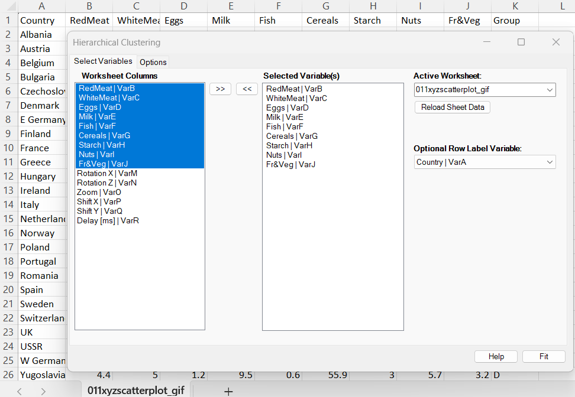
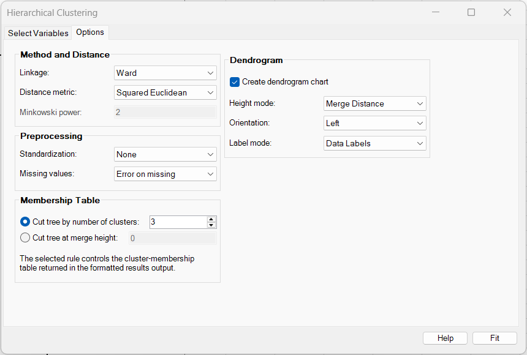
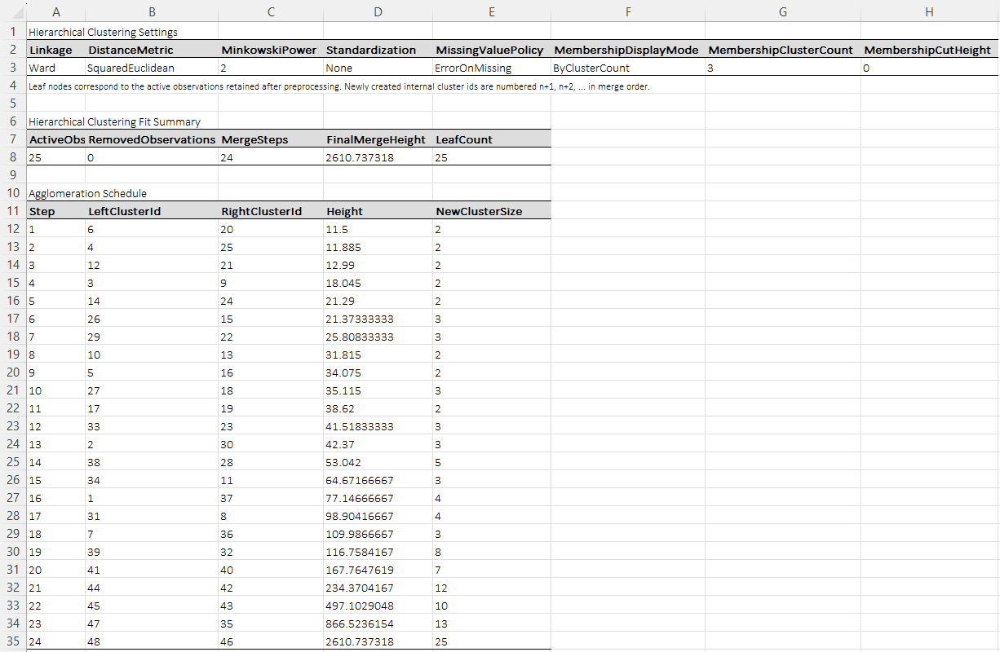
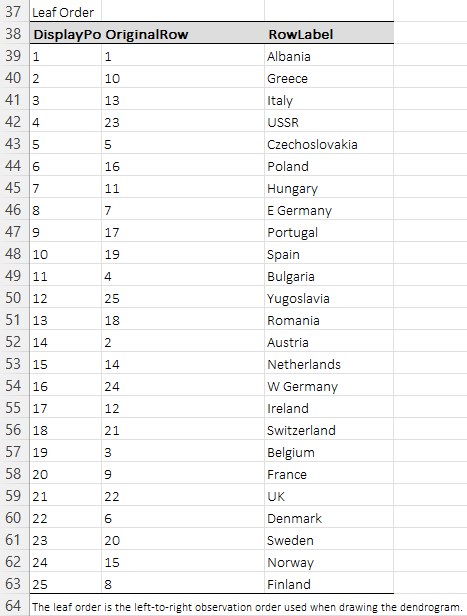
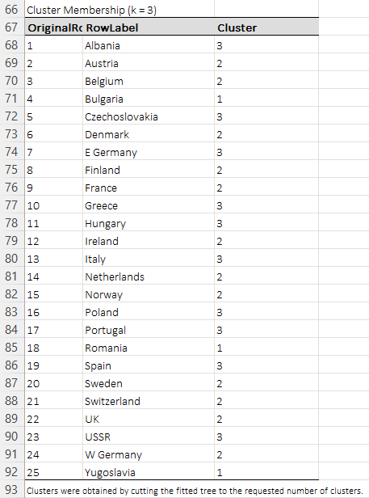
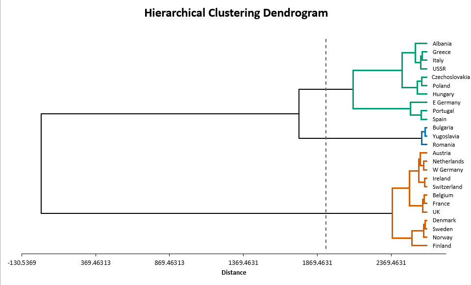

# Hierarchical Clustering

**Includes:** Agglomerative hierarchical clustering for numeric data, linkage methods (Ward, complete, average, weighted average, single, centroid, median), distance metrics (squared Euclidean, Euclidean, Manhattan, Chebyshev, Minkowski, cosine, correlation), optional z-score or 0–1 range standardization, missing-value handling, membership output by cluster count or cut height, and Excel dendrogram generation.  
**Purpose:** Build a full bottom-up clustering hierarchy and inspect it through merge tables, membership cuts, and a dendrogram.

---

## Overview

Hierarchical clustering does not require a pre-fixed partition during fitting.
Instead, it builds a **merge tree** (dendrogram) by repeatedly joining the two closest clusters until all observations belong to one final cluster.

BESHStatNG can then report membership in two ways:

- **By cluster count**: cut the tree to obtain a requested number of clusters,
- **By cut height**: apply all merges with height \(\le h\).

The output contains:

- a **Data** sheet,
- a **Hierarchical Clustering results** sheet with settings, agglomeration schedule, leaf order, and cluster membership,
- optionally a **Dendrogram** sheet containing a chart with a cut line and cluster-colored branches.

---

## Example dataset

This page uses the same **protein consumption by country** dataset as the k-means example.
The file is available here:

- [011xyzscatterplot_gif.csv](../assets/data/011xyzscatterplot/011xyzscatterplot_gif.csv)

The example uses the 9 food-group variables as the analysis matrix and the **Country** column as the optional row label. The **Group** column is not used in the clustering calculations.

---

## Screenshots

### Select Variables tab



### Options tab



### Results sheet: settings and agglomeration schedule



### Results sheet: leaf order



### Results sheet: cluster membership table



### Dendrogram



---

## Brief interpretation of the example

In the screenshot example, the settings are:

- **Linkage:** Ward
- **Distance metric:** Squared Euclidean
- **Standardization:** None
- **Membership rule:** Cut tree by number of clusters with \(k=3\)
- **Dendrogram height mode:** Merge Distance
- **Orientation:** Left

The resulting three-cluster cut separates the countries into:

1. **A small cereal-dominant cluster**  
   Bulgaria, Romania, and Yugoslavia.

2. **A western / northern higher-animal-protein cluster**  
   Austria, Belgium, Denmark, Finland, France, Ireland, Netherlands, Norway, Sweden, Switzerland, UK, and W Germany.

3. **A southern / eastern mixed-diet cluster**  
   Albania, Czechoslovakia, E Germany, Greece, Hungary, Italy, Poland, Portugal, Spain, and USSR.

The dendrogram shows that the three-country cluster (Bulgaria, Romania, Yugoslavia) is especially compact. The dashed cut line marks the chosen three-cluster solution, and the colored branches show which leaves belong to each cluster below that cut.

---

## When to use it

Use hierarchical clustering when you want to:

- inspect the **entire nested clustering structure**,
- delay the choice of final cluster count until after fitting,
- compare several linkage definitions,
- visualize cluster fusion through a dendrogram.

It is especially useful when:

- the number of clusters is not known in advance,
- you want to study merge heights and alternative cuts,
- you need a dendrogram as part of the output.

---

## Inputs in Excel

### Selecting variables

On the **Select Variables** tab:

- move the numeric analysis variables to **Selected Variable(s)**,
- optionally choose a **Row Label Variable** for reporting and dendrogram labels.

The row-label variable is not used in the distance calculations.

### Missing values

The hierarchical procedure applies one of two policies:

- **Error on missing**
- **Listwise deletion**

Rows removed by listwise deletion are recorded and reported separately.

---

## Options in BESHStatNG

### 1) Linkage method

BESHStatNG supports:

- **Ward**
- **Complete**
- **Average**
- **Weighted Average**
- **Single Linkage**
- **Centroid**
- **Median**

### 2) Distance metric

BESHStatNG supports:

- **Squared Euclidean**
- **Euclidean**
- **Manhattan**
- **Chebyshev**
- **Minkowski**
- **Cosine**
- **Correlation**

When **Minkowski** is selected, the **Minkowski power** parameter must also be provided.

!!! note
    **Ward**, **Centroid**, and **Median** linkage are available only with **Euclidean** or **Squared Euclidean** distance.

### 3) Preprocessing

- **Standardization**: None, Z-scores, Range 0 to 1
- **Missing values**: Error on missing, Listwise deletion

### 4) Membership reporting

The results sheet can display membership using either:

- **Cluster count** \(k\), or
- **Cut height** \(h\)

### 5) Dendrogram options

If dendrogram creation is enabled, the dialog also controls:

- **Height mode**: Merge Distance or Step Levels
- **Orientation**: Top, Bottom, Left, Right
- **Label mode**: Data Labels, Axis Title, None

The chart also draws:

- a **dashed cut line** corresponding to the selected membership cut,
- **cluster-colored branches** below that cut.

---


## Choosing options: when to use which and why

### A practical default recipe

For many general-purpose numeric datasets, a good first run is:

- **Linkage:** Ward
- **Distance metric:** Euclidean or Squared Euclidean
- **Standardization:** Z-scores when variables are on different scales
- **Membership display:** cut by a small range of cluster counts such as \(k=2\) to \(k=6\)
- **Dendrogram height mode:** Merge Distance
- **Label mode:** Data labels when row labels are short and interpretable

This is often the most informative starting point because Ward tends to produce compact, readable clusters and the dendrogram helps you decide how many clusters are reasonable.

### 1) Linkage method: which one to prefer

#### Ward

**Usually preferred for a first analysis of standardized numeric data.**

Choose Ward when:

- you want compact, roughly spherical clusters,
- you want a partition that is often close in spirit to k-means,
- you care about minimizing within-cluster heterogeneity.

Why: Ward tends to avoid chaining and often yields balanced, interpretable groups.

Best with: **Euclidean or Squared Euclidean** distance.

#### Complete linkage

Choose complete linkage when:

- you want tight clusters with small maximum within-cluster diameter,
- you want stronger separation between final groups,
- you want less chaining than single linkage.

Why: it focuses on the farthest pair across clusters, so it tends to form compact groups.

Trade-off: it can be sensitive to outliers because one extreme point can drive the merge distance.

#### Average linkage

**A strong general-purpose compromise.**

Choose average linkage when:

- you want a balanced method that is less aggressive than complete linkage,
- you want a method that often behaves sensibly across many distance choices,
- you do not want Ward's explicit compact-cluster bias.

Why: it averages pairwise distances, which often gives stable and interpretable trees.

#### Weighted average linkage

Choose weighted average when:

- you want each merged branch to contribute equally regardless of cluster size,
- you are comparing with software or literature that uses this update rule.

Why: unlike ordinary average linkage, it does not weight by cluster size after a merge.

Trade-off: it can give slightly more influence to small clusters than users expect.

#### Single linkage

Use single linkage when:

- you are explicitly looking for connectivity or chain structure,
- the scientific question is about nearest-neighbor linkage,
- you want to detect elongated connected components.

Why: it links clusters by their closest pair.

**Not usually preferred** for general segmentation because it is prone to the classic **chaining effect**, where long loose strings of observations merge early.

#### Centroid linkage

Use centroid linkage when:

- centroid-based cluster representatives are substantively natural,
- you want to compare a hierarchical centroid method with k-means-like thinking.

Trade-off: centroid methods can produce **reversals** (non-monotone dendrogram heights), which can make dendrogram interpretation less straightforward.

#### Median linkage

Use median linkage mainly when:

- you need this historical linkage rule for comparison,
- you are reproducing a legacy workflow.

It is generally **not the first preferred choice** for routine applied work because it can also produce reversals and is less commonly used in modern applied analyses.

**General preference order for many applications:** Ward first, average or complete next, single only for connectivity-style problems, centroid/median mainly for specialist or legacy comparisons.

### 2) Distance metric: when to use which

#### Euclidean

**Default choice for many continuous-variable problems.**

Choose Euclidean when:

- raw geometric distance is meaningful,
- you want a standard metric for compact clusters,
- you are using Ward, centroid, or median linkage.

#### Squared Euclidean

Choose squared Euclidean when:

- you want large coordinate differences to count more heavily,
- you want a distance scale closely aligned with sum-of-squares reasoning,
- you are using Ward and want a very direct variance-criterion flavor.

Trade-off: large separations are emphasized more strongly than under ordinary Euclidean distance.

#### Manhattan

Choose Manhattan when:

- you want a metric based on absolute rather than squared deviations,
- variables may contain occasional large coordinate differences,
- movement along separate coordinates is conceptually additive.

Why: Manhattan is often more robust to a few large deviations than Euclidean-type distances.

#### Chebyshev

Choose Chebyshev when:

- the important notion of dissimilarity is the **largest single-coordinate difference**,
- a large mismatch on any one variable should dominate similarity.

This is specialized and not usually the first exploratory choice.

#### Minkowski

Choose Minkowski when:

- you want a continuum between Manhattan and Euclidean behavior,
- you need to tune how strongly large coordinate differences are emphasized.

Guidance:

- power \(q=1\) gives Manhattan,
- power \(q=2\) gives Euclidean,
- larger \(q\) values increasingly emphasize larger coordinate differences.

Use this when there is a clear reason to tune the geometry; otherwise Euclidean or Manhattan is easier to justify.

#### Cosine

Choose cosine distance when:

- the **direction or profile shape** matters more than the overall magnitude,
- you are comparing composition-like or profile vectors,
- two observations with similar ratios should be considered similar even if their total level differs.

Typical applications include profile comparison, text-style vectors, and some high-dimensional feature settings.

#### Correlation

Choose correlation distance when:

- you want observations grouped by **shape of profile** rather than absolute level,
- two rows should be considered similar if they rise and fall together across variables,
- overall row mean and row scale are less important than the pattern across variables.

This is often useful for biological profiles, time-course shapes, or standardized response patterns.

**Important distinction:** correlation distance compares rows after a correlation-style shape adjustment, so it answers a different scientific question than Euclidean distance.

### 3) Standardization: none, z-scores, or range 0 to 1

#### None

Choose **None** when:

- all variables already share a meaningful common unit,
- raw scale differences are part of the clustering question,
- you intentionally want high-variance variables to have greater influence.

#### Z-scores

**Usually preferred when variables have different scales.**

Choose z-scores when:

- variables are measured in different units,
- variances differ strongly,
- you want each variable to contribute more evenly.

This is often the safest first setting with Euclidean-family metrics.

#### Range 0 to 1

Choose range standardization when:

- all variables should lie on a comparable bounded scale,
- you want easy interpretability in terms of minima and maxima,
- the data are naturally bounded and min–max comparability is meaningful.

Trade-off: this approach can be strongly influenced by extreme minimum or maximum values.

**General preference:** z-scores most often, none only when justified by substantive scale, range 0 to 1 for bounded-score applications.

### 4) Missing values: error or listwise deletion

#### Error on missing

Preferred when:

- missingness may indicate a data problem,
- you want to inspect and resolve missing values before clustering,
- losing rows would materially reduce the dataset.

#### Listwise deletion

Choose this when:

- only a small number of rows are incomplete,
- complete-case analysis is acceptable for the question at hand.

Be cautious when many rows would be removed or when missingness is systematic, because the dendrogram would then represent only a selective subset of the data.

### 5) Membership reporting: cluster count or cut height

#### By cluster count

**Usually preferred for reporting.**

Choose a cluster-count cut when:

- you need exactly \(k\) groups for interpretation or downstream analysis,
- you want easy comparison with k-means or external labels,
- your audience expects a fixed partition.

A practical workflow is to inspect the dendrogram first, then report a few plausible \(k\) values before settling on one.

#### By cut height

Choose a cut-height rule when:

- the dissimilarity threshold itself is scientifically meaningful,
- you want all merges below a chosen height treated as acceptable similarity,
- you want to compare results across different candidate thresholds.

This can be very useful when the question is framed in terms of a maximum acceptable dissimilarity rather than a pre-fixed number of clusters.

### 6) Dendrogram display options

#### Height mode

- **Merge Distance** is usually preferred because it preserves the fitted merge-height information.
- **Step Levels** is useful for teaching, quick structural inspection, or cases where the exact vertical scale is distracting rather than informative.

#### Orientation

Choose the orientation that best fits your label length and reporting space:

- **Left/Right** often works better for longer row labels,
- **Top/Bottom** often works better for shorter labels and wide layouts.

#### Label mode

- **Data Labels** is usually preferred when row labels are meaningful and not too long.
- **Axis Title** can be cleaner when there are many observations and full labels would clutter the plot.
- **None** is helpful for dense trees where the structure matters more than the individual leaf names.

### 7) When hierarchical clustering is preferred, and when it is not

Prefer hierarchical clustering when:

- the number of clusters is not known in advance,
- the dendrogram itself is analytically important,
- you want to compare several different cuts without re-fitting,
- the sample size is still moderate enough that the full hierarchy is interpretable.

Prefer k-means when:

- you want one final partition rather than a full tree,
- the data are large and centroid-based clusters are the main target,
- you want cluster centers and a repeated-start optimization strategy.


## Output tables

### 1) Hierarchical Clustering Settings

Includes:

- Linkage
- DistanceMetric
- MinkowskiPower
- Standardization
- MissingValuePolicy
- MembershipDisplayMode
- MembershipClusterCount
- MembershipCutHeight

### 2) Hierarchical Clustering Fit Summary

Includes:

- ActiveObs
- RemovedObservations
- MergeSteps
- FinalMergeHeight
- LeafCount

### 3) Agglomeration Schedule

One row per merge step, including:

- Step
- LeftClusterId
- RightClusterId
- Height
- NewClusterSize

### 4) Leaf Order

This table shows the left-to-right leaf order used in the dendrogram drawing. It includes:

- DisplayPosition
- OriginalRow
- Optional RowLabel

### 5) Cluster Membership

This table is reported either for:

- a requested number of clusters, or
- a cut height.

Each row includes:

- OriginalRow
- Optional RowLabel
- Cluster

---

## Mathematical details

Let the active working data matrix be

$$
X^{*} = [x_i^{*}]_{i=1}^{n}, \qquad x_i^{*} \in \mathbb{R}^{p}.
$$

As in k-means, optional standardization is applied first, and all formulas below use the **working analysis scale** unless noted otherwise.

### A) Base dissimilarities between observations

For two observations \(x_i^{*}\) and \(x_j^{*}\), the available metrics are:

#### Euclidean

$$
d(i,j) = \sqrt{\sum_{m=1}^{p} (x_{im}^{*} - x_{jm}^{*})^2}
$$

#### Squared Euclidean

$$
d(i,j) = \sum_{m=1}^{p} (x_{im}^{*} - x_{jm}^{*})^2
$$

#### Manhattan

$$
d(i,j) = \sum_{m=1}^{p} |x_{im}^{*} - x_{jm}^{*}|
$$

#### Chebyshev

$$
d(i,j) = \max_m |x_{im}^{*} - x_{jm}^{*}|
$$

#### Minkowski

For power \(q > 0\):

$$
d(i,j) = \left( \sum_{m=1}^{p} |x_{im}^{*} - x_{jm}^{*}|^q \right)^{1/q}
$$

#### Cosine distance

$$
d(i,j) = 1 - \frac{x_i^{*\mathsf T}x_j^{*}}{\|x_i^{*}\|\,\|x_j^{*}\|}
$$

If either norm is zero, the comparison is treated as zero distance.

#### Correlation distance

If \(r_{ij}\) denotes the ordinary Pearson correlation between the two row vectors, then

$$
d(i,j) = 1 - r_{ij}.
$$

### B) Agglomerative procedure

Initially, every observation forms its own cluster.
At each step, the algorithm identifies the two currently active clusters with the smallest linkage distance and merges them.

This produces:

- the two clusters joined at each step,
- the merge height,
- the size of the newly formed cluster.

### C) Linkage definitions

Let \(A\) and \(B\) be two clusters, with sizes \(|A|\) and \(|B|\).

#### Single linkage

$$
D(A,B) = \min_{i \in A,\, j \in B} d(i,j)
$$

and the update is

$$
D(A \cup B, K) = \min\{D(A,K), D(B,K)\}.
$$

#### Complete linkage

$$
D(A,B) = \max_{i \in A,\, j \in B} d(i,j)
$$

and the update is

$$
D(A \cup B, K) = \max\{D(A,K), D(B,K)\}.
$$

#### Average linkage

$$
D(A \cup B, K) = \frac{|A|D(A,K) + |B|D(B,K)}{|A| + |B|}.
$$

#### Weighted average linkage

$$
D(A \cup B, K) = \frac{D(A,K) + D(B,K)}{2}.
$$

#### Centroid linkage

Let \(\bar{x}_A\) and \(\bar{x}_B\) be the cluster centroids.
Then

$$
D(A,B) = d(\bar{x}_A, \bar{x}_B).
$$

#### Median linkage

The representative of a merged cluster is the midpoint of the two cluster representatives; distances are then computed between those representatives.

#### Ward linkage

Ward linkage uses the increase in within-cluster sum of squares:

$$
D(A,B) = \frac{|A|\,|B|}{|A|+|B|} \lVert \bar{x}_A - \bar{x}_B \rVert^2.
$$

This means the reported merge height for Ward is a **fusion criterion** rather than an ordinary Euclidean distance between centroids.

### D) Cutting the tree

#### By requested number of clusters

If \(k\) clusters are requested for \(n\) observations, the algorithm applies exactly

$$
n-k
$$

merges and returns the resulting membership labels.

#### By cut height

If a cut height \(h\) is requested, the algorithm applies all merges with

$$
\text{merge height} \le h.
$$

### E) Dendrogram display heights

The dendrogram can be drawn in two ways:

#### Merge Distance

Branch heights use the fitted merge heights from the clustering algorithm.

#### Step Levels

Branch heights are replaced by consecutive integers 1, 2, …, one per merge.
This is useful for teaching or when proportional merge heights are not required.

---

## R code (reference)

The script below reproduces the main partition from the screenshot example using Ward clustering and a three-cluster cut.

```r
# Hierarchical clustering reference for the protein-consumption example

dat <- read.csv("protein-consumption-by-country.csv", check.names = FALSE)
rownames(dat) <- dat$Country
x <- dat[, c("RedMeat", "WhiteMeat", "Eggs", "Milk", "Fish",
             "Cereals", "Starch", "Nuts", "FrVeg")]

# Closest standard R analogue to the screenshot settings.
# ward.D2 on Euclidean distances implements Ward's minimum-variance criterion.
fit <- hclust(dist(x), method = "ward.D2")

clusters_k3 <- cutree(fit, k = 3)
clusters_k3

table(clusters_k3)

plot(fit, hang = -1, main = "Protein consumption dendrogram")
rect.hclust(fit, k = 3, border = 2:4)
```

### Expected differences vs R or SAS

- **Cluster labels are arbitrary.** The same three-cluster solution may be numbered differently across software.
- **Leaf order is not unique.** Left-to-right order in a dendrogram can vary even when the clustering itself is identical.
- **Ward heights may differ in scale.** Different software packages use different but related conventions for reporting Ward merge heights. BESHStatNG reports a Ward fusion criterion on its own displayed height scale, whereas R's `hclust(..., method = "ward.D2")` uses the standard R convention.
- **The partition is the key comparison.** For practical validation, compare the cluster memberships after `cutree()` rather than expecting every merge height or axis tick label to be numerically identical.

---

## References

1. Everitt, B., Landau, S., Leese, M., & Stahl, D. (2011). *Cluster Analysis* (5th ed.). Wiley.
2. Kaufman, L., & Rousseeuw, P. J. (1990). *Finding Groups in Data: An Introduction to Cluster Analysis*. Wiley.
3. Lance, G. N., & Williams, W. T. (1967). A General Theory of Classificatory Sorting Strategies. 1. Hierarchical Systems. *The Computer Journal*, 9(4), 373–380.
4. Manly, B. F. J. (2004). *Multivariate Statistical Methods: A Primer* (3rd ed.). Chapman & Hall/CRC.
5. Murtagh, F., & Legendre, P. (2014). Ward's Hierarchical Agglomerative Clustering Method: Which Algorithms Implement Ward's Criterion? *Journal of Classification*, 31, 274–295.
6. Ward, J. H. Jr. (1963). Hierarchical Grouping to Optimize an Objective Function. *Journal of the American Statistical Association*, 58(301), 236–244.

## See also
- [K-Means Clustering](k-means-clustering.md)
- [Home](../index.md)