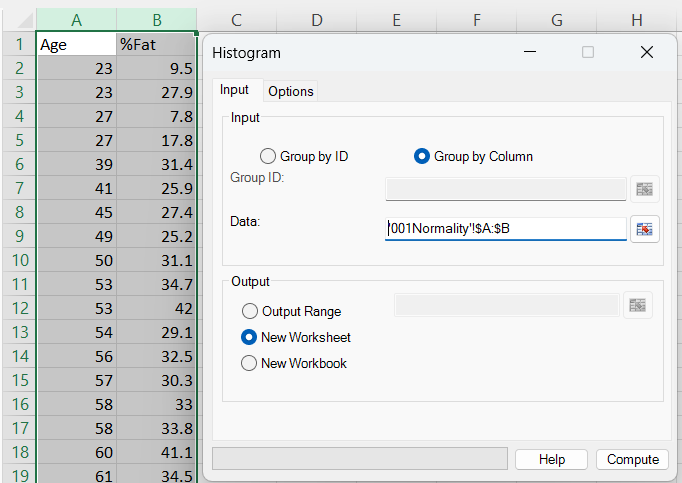
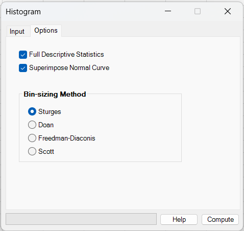
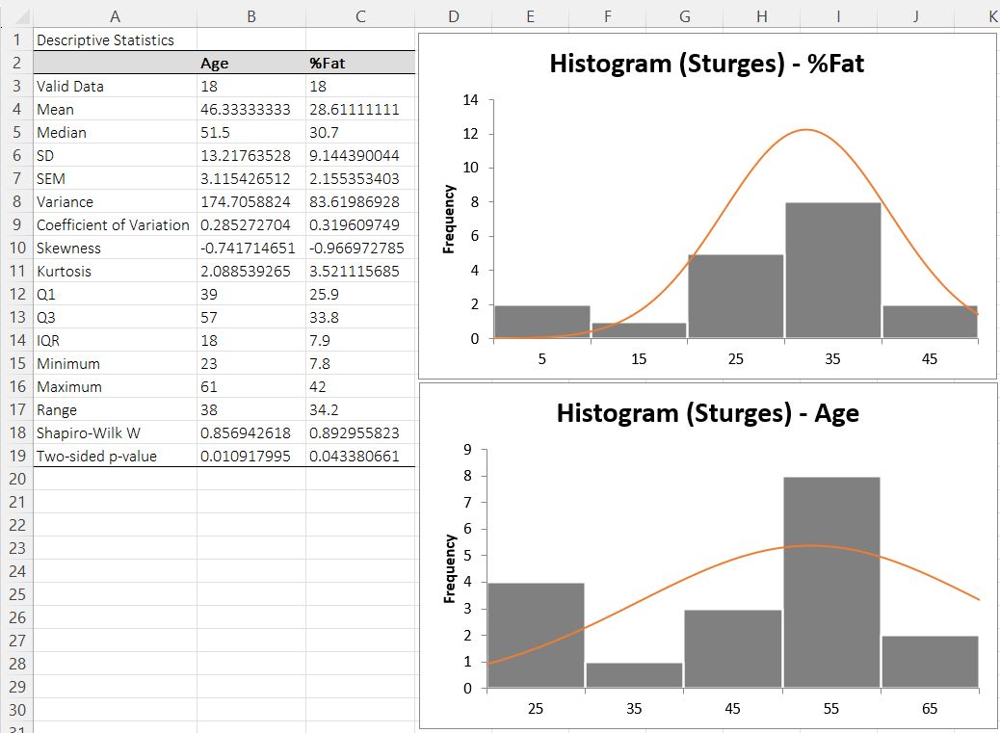

# Histogram

**Includes:** Automatic bin rules (Sturges, Doane, Scott, Freedman–Diaconis), Overlay multiple groups (optional).  
**Purpose:** Create publication-friendly histograms with sensible bin-width heuristics and optional overlays.

---

## Overview

The **Histogram** dialog creates one histogram chart per selected variable/group.  
You can optionally:

- output a **Full Descriptive Statistics** table (per group/variable), and
- **Superimpose a Normal Curve** on top of each histogram.

This tool is useful as a first-pass distribution check (shape, spread, skew, outliers) before selecting a statistical model or test.

---

## Example dataset (reproduce the screenshots)

Download the sample CSV used in the screenshots:

- [001Normality.csv](../assets/data/001normality/001Normality.csv)

The file contains two numeric columns:
- **Age**
- **%Fat**

In Excel, import/paste the CSV into a sheet and use **Group by Column** selecting both columns.

---

## Dialog screenshots

### Input tab (Group by Column)

### Options tab (descriptives + normal overlay + bin rule)

### Example output (descriptive table + charts)

---

## Dialog: inputs and options

### Input tab

You can define datasets in two ways:

#### A) Group by Column (rectangular range)
- Select a rectangular range where **each column is one variable**.
- The **first row is treated as a column name** (header). Empty headers receive a default name.
- Each column is cleaned independently (missing/non-numeric cells are removed per column).

#### B) Group by ID (grouping column + data column)
Use this “long format” when you have:

| GroupID | Value |
|---|---|
| A | 12.3 |
| A | 11.7 |
| B | 9.8 |
| ... | ... |

- **Group ID** → the group labels
- **Data** → the numeric values

Output destination:
- **Output Range** (write results where you specify)
- **New Worksheet** (recommended)
- **New Workbook**

---

### Options tab

- **Full Descriptive Statistics**  
  Writes a descriptive table for each variable/group (n, mean, median, SD, quartiles, skewness, kurtosis, …).  
  In BESHStatNG, this table also includes **Shapiro–Wilk W and its p-value** when the sample size allows it.  
  See: [Descriptive Statistics](descriptive-statistics.md) and [Normality Tests](normality-tests.md)

- **Superimpose Normal Curve**  
  Draws a smooth normal curve on top of the histogram bars, scaled to the **frequency** axis (so it overlays naturally).

- **Bin-sizing Method**  
  Choose one of four automatic bin rules (details below):
  - Sturges
  - Doane
  - Freedman–Diaconis
  - Scott

---

## What it does (math and implementation details)

For each selected variable/group, BESHStatNG:

1) computes histogram **bin edges** and **frequencies** (from your selected rule),  
2) creates an Excel **clustered column** chart (bars),  
3) optionally computes a normal-curve overlay and adds it as a smooth line,  
4) optionally writes a descriptive-statistics table.

### A) Bin-sizing rules

Let `n` be the number of observations, `min = min(x)` and `max = max(x)`.

#### 1) Sturges

Target number of bins:

$$
k = \operatorname{round}\!\bigl(1 + \log_2(n)\bigr)
$$

Raw bin width:

$$
h = \frac{\max(x) - \min(x)}{k}
$$

#### 2) Doane

The code computes:

$$
s = \sqrt{\frac{6(n-2)}{(n+1)(n+3)}}
$$

and then:

$$
k = \operatorname{round}\!\left(1 + \log_2(n) + \log_2\!\left(1 + \frac{\left|\operatorname{Skewness}(x)\right|}{s}\right)\right)
$$

$$
h = \frac{\max(x) - \min(x)}{k}
$$

> Implementation note: the R Doane rule uses **bias-corrected sample skewness**. The current BESHStatNG implementation uses `population Fisher’s moment coefficient of Skewness(x)`.

#### 3) Scott

Bin width:

$$
h = \frac{3.5\,s}{n^{1/3}}
$$

where \( s \) is the sample standard deviation (computed with \(n-1\) in the denominator).  
Then:

$$
k = \operatorname{round}\!\left(\frac{\max(x) - \min(x)}{h}\right)
$$

#### 4) Freedman–Diaconis

Uses the interquartile range \( IQR = Q_3 - Q_1 \):

$$
h = \frac{2\,IQR}{n^{1/3}}
$$

$$
k = \operatorname{round}\!\left(\frac{\max(x) - \min(x)}{h}\right)
$$

---

### B) “Pretty” breaks (R-style snapping)

After computing the target bin count `k`, BESHStatNG **snaps** the breaks to human-friendly numbers:

- step size is rounded to a **1–2–5–10 × 10^m** pattern,
- min/max are expanded outward to multiples of this step,
- the final number of bins may change slightly.

This is why the actual histogram can have a slightly different number of bins than the raw theoretical formula suggests.

---

### C) Frequency counting (edge behavior)

Let breaks be \(b_0, b_1, \dots, b_k\).  
Each data value \(x\) is assigned to a bin via:

- if \(x \ge b_k\) → last bin
- otherwise → \(\left\lfloor \frac{x - b_0}{h} \right\rfloor\), clamped to \([0, k-1]\)

So the **right-most edge is included** in the last bin.

Midpoints are:

$$
m_i = \frac{b_i + b_{i+1}}{2}
$$

where \(b_0, b_1, \dots, b_k\) are the bin edges. And they are rounded to a reasonable number of decimals based on the chosen step size.

---

### D) Normal-curve overlay

If **Superimpose Normal Curve** is checked, BESHStatNG computes a Gaussian curve using **quartile-based** estimates (robust to outliers):

$$
\mu \approx \frac{Q_1 + Q_3}{2}
$$

$$
\sigma \approx \frac{Q_3 - Q_1}{1.34898}
$$

where \(1.34898 \approx 2 \times 0.67449\), and for a normal distribution
\(Q_1 = \mu - 0.67449\sigma\) and \(Q_3 = \mu + 0.67449\sigma\).

It then evaluates 100 points across the data range:

$$
x_i = \min(x) + i\cdot\frac{\max(x)-\min(x)}{99},
\qquad i=0,\dots,99
$$

and computes the normal density:

$$
f(x_i) = \frac{1}{\sigma\sqrt{2\pi}}
\exp\!\left(-\frac{(x_i-\mu)^2}{2\sigma^2}\right)
$$

Finally, the curve is scaled to the histogram **frequency** scale (not density) using the final bin width \(h\):

$$
y_i = f(x_i)\cdot n \cdot h
$$

---

## Steps in the add-in (match screenshots)

1. In Excel ribbon: **BESH Stat NG → Analyse → Graphics → Histogram**
2. Choose **Group by Column**
3. Select data range (for the example CSV: `A:B`, including the header row)
4. Output: **New Worksheet**
5. Options:
   - ✅ **Full Descriptive Statistics**
   - ✅ **Superimpose Normal Curve**
   - Bin sizing: **Sturges**
6. Click **Compute**

---

## Output

The output consists of:

1) **Histogram chart(s)** — one per selected variable/group  
   - Bars = frequencies
   - X axis = bin midpoints (internally computed from snapped breaks)
   - Y axis = frequency
   - Optional smooth normal curve overlay

2) Optional **Descriptive Statistics** table (written to the output area)  
   Includes sample size, mean/median, SD/SEM, quartiles, skewness/kurtosis, and Shapiro–Wilk (when available).  
   See: [Descriptive Statistics](descriptive-statistics.md)

---

## How to interpret (mini-example)

Using the example dataset, the **Age** histogram is slightly left-skewed and the normal overlay does not perfectly track the tails; the descriptive table also reports a Shapiro–Wilk p-value around 0.01, suggesting evidence against perfect normality. For **%Fat**, the histogram appears more skewed with heavier upper tail; the normal overlay fits the center but diverges in the tails. Practically: use the histogram as a shape check, then confirm with a Q–Q plot and (if needed) consider transformations or robust/nonparametric methods.

---

## Notes

- **Missing/non-numeric values** are removed during import (per column/group).
- Final bin edges are “pretty-snapped”, so the exact bin count may differ from the theoretical rule.
- The normal overlay uses **quartile-based** \(\mu\) and \(\sigma\) (robust), not the plain sample mean/SD.

---

## See also
- [Descriptive Statistics](descriptive-statistics.md)
- [Normality Tests](normality-tests.md)
- [Normal Plot (Q–Q plot)](normal-plot.md)
- [Box and Whiskers](box-and-whiskers.md)
- [Home](../index.md)
