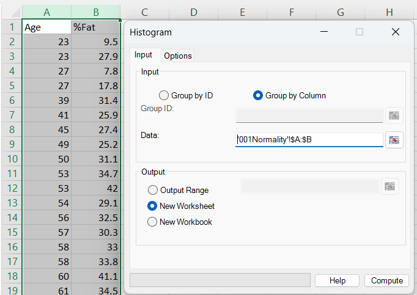
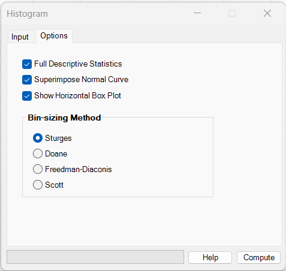
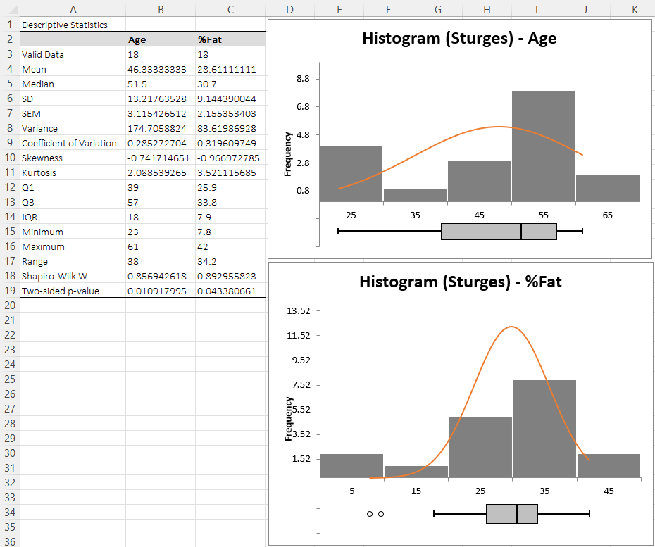

# Histogram

**Includes:** Automatic bin rules (Sturges, Doane, Scott, Freedman–Diaconis), optional robust normal-curve overlay, optional horizontal Tukey box plot, and optional descriptive statistics.  
**Purpose:** Explore the distribution of one or more continuous variables using a frequency histogram, with complementary information about location, spread, normal-shape agreement, and potential outliers.

---

## Overview

The **Histogram** dialog creates one histogram chart for each selected variable or group. The chart can optionally include:

- a **normal curve** superimposed on the histogram;
- a **horizontal Tukey box plot** directly below the histogram; and
- a **Full Descriptive Statistics** table in the output worksheet.

The histogram shows how observations are distributed across numeric intervals. The optional box plot adds a compact summary of the median, interquartile range, whiskers, and potential outliers on the **same horizontal measurement scale**. Used together, the two displays provide complementary views of the same data.

This tool is useful as an initial distribution check before selecting a statistical test or model. It can help reveal skewness, unusually long tails, gaps, multimodality, and possible outlying observations.

!!! note
    A histogram and box plot are descriptive tools. The appearance of the graph depends partly on the selected binning rule, and a normal-curve overlay is not itself a formal test of normality. When normality is important, also consider a [Normal Plot](normal-plot.md) and [Normality Tests](normality-tests.md).

---

## Example dataset

The screenshots on this page use:

- [001Normality.csv](../assets/data/001normality/001Normality.csv)

The file contains two numeric variables:

- **Age**
- **%Fat**

In Excel, import or paste the CSV into a worksheet and use **Group by Column** with both columns selected.

---

## Dialog screenshots

### Input tab

### Options tab

### Example output

---

## Dialog: inputs and options

### Input tab

Data can be supplied in two layouts.

#### Group by Column

Use **Group by Column** when each selected column represents one dataset or variable.

- Select a rectangular range containing one or more numeric columns.
- The **first row is treated as the variable name**.
- Each selected column produces its own histogram.
- Missing or non-numeric cells are removed during data import for the corresponding variable.

This is the most convenient layout when several variables are stored in separate worksheet columns.

#### Group by ID

Use **Group by ID** for long-format data consisting of a grouping variable and a numeric data variable, for example:

| Group ID | Value |
|---|---:|
| A | 12.3 |
| A | 11.7 |
| B | 9.8 |
| B | 10.4 |

Specify:

- **Group ID** — the group labels;
- **Data** — the numeric observations.

A separate histogram is created for each resulting group.

#### Output destination

Results can be sent to:

- **Output Range** — write output beginning at a selected worksheet cell;
- **New Worksheet** — create the output in a new worksheet;
- **New Workbook** — create the output in a new workbook.

---

### Options tab

#### Full Descriptive Statistics

When selected, BESHStatNG writes a descriptive-statistics table for the selected variables/groups. The table includes statistics such as:

- valid sample size;
- mean and median;
- standard deviation and standard error;
- variance and coefficient of variation;
- skewness and kurtosis;
- first and third quartiles and IQR;
- minimum, maximum, and range;
- Shapiro–Wilk statistic and two-sided p-value when the sample size permits the test.

See [Descriptive Statistics](descriptive-statistics.md) and [Normality Tests](normality-tests.md) for further details.

#### Superimpose Normal Curve

Adds a smooth Gaussian reference curve to each histogram. The curve is scaled to the histogram **frequency** scale so that its height can be compared directly with the bars.

The current implementation estimates the centre and spread of the curve from the first and third quartiles rather than from the ordinary sample mean and standard deviation. This makes the reference curve less sensitive to extreme observations. See [Normal-curve overlay](#normal-curve-overlay) below.

#### Show Horizontal Box Plot

Adds a horizontal Tukey box plot beneath each histogram. The box plot uses the same numeric horizontal scale as the histogram and displays:

- **Q1** — left edge of the box;
- **Median** — vertical line inside the box;
- **Q3** — right edge of the box;
- **Whiskers** — most extreme non-outlying observations under Tukey's 1.5 × IQR rule;
- **Outliers** — observations outside the whiskers, shown as open circles.

This option is useful when you want to see the detailed histogram shape and a compact robust summary in one chart.

#### Bin-sizing Method

Four automatic binning rules are available:

- **Sturges**
- **Doane**
- **Freedman–Diaconis**
- **Scott**

No single rule is optimal for every dataset. Sturges is a simple general-purpose choice; Doane adjusts for skewness; Scott uses the sample standard deviation; and Freedman–Diaconis uses the IQR and is therefore more robust to extreme observations.

---

## What BESHStatNG computes

For each selected variable or group, BESHStatNG:

1. determines an approximate number of histogram bins or a bin width using the selected rule;
2. converts the result to human-friendly equally spaced bin edges;
3. counts the observations in each bin;
4. creates an Excel frequency histogram;
5. optionally adds the normal-curve overlay;
6. optionally calculates and draws the horizontal Tukey box plot; and
7. optionally writes the descriptive-statistics table.

---

## Histogram binning

Let $n$ be the number of valid observations and let $x_{\min}$ and $x_{\max}$ be the sample minimum and maximum.

### Sturges

The target number of bins is

$$
k = \operatorname{round}\left(1 + \log_2 n\right).
$$

The corresponding initial bin width is

$$
h = \frac{x_{\max}-x_{\min}}{k}.
$$

Sturges' rule is simple and works well as a general starting point, particularly for modest sample sizes and approximately symmetric distributions.

### Doane

Doane's rule modifies Sturges' rule to account for skewness. BESHStatNG computes

$$
s_g = \sqrt{\frac{6(n-2)}{(n+1)(n+3)}}
$$

and then

$$
k = \operatorname{round}\left[
1 + \log_2 n +
\log_2\left(1 + \frac{|g_1|}{s_g}\right)
\right],
$$

where $g_1$ is the skewness returned by BESHStatNG's `Skewness()` routine. The initial bin width is

$$
h = \frac{x_{\max}-x_{\min}}{k}.
$$

!!! note "Implementation detail"
    BESHStatNG currently uses its population Fisher moment coefficient from `Skewness()` in this calculation. This differs from implementations that use a bias-corrected sample-skewness estimator.

### Scott

Scott's rule calculates the initial bin width as

$$
h = \frac{3.5s}{n^{1/3}},
$$

where $s$ is the sample standard deviation. The corresponding target bin count is

$$
k = \operatorname{round}\left(\frac{x_{\max}-x_{\min}}{h}\right).
$$

Because it depends on the standard deviation, Scott's rule can be influenced by extreme values.

### Freedman–Diaconis

The Freedman–Diaconis rule uses the interquartile range

$$
IQR = Q_3-Q_1
$$

and calculates

$$
h = \frac{2IQR}{n^{1/3}}.
$$

The corresponding target number of bins is

$$
k = \operatorname{round}\left(\frac{x_{\max}-x_{\min}}{h}\right).
$$

Because it uses the IQR rather than the standard deviation, this rule is generally less sensitive to extreme observations.

---

## Pretty bin edges

After the selected rule determines a target bin count, BESHStatNG snaps the histogram edges to simple, readable values.

The raw step is converted to a value following a **1–2–5–10 × 10^m** pattern, and the lower and upper limits are expanded outward to multiples of that step. Consequently, the final number of displayed bins can differ slightly from the theoretical bin count produced by the selected rule.

For example, a calculated target of approximately seven bins might ultimately produce equally spaced edges at clean integer or decimal values that are easier to read on the Excel axis.

---

## Frequency counting

Let the final bin edges be

$$
b_0,b_1,\ldots,b_k.
$$

For an observation $x$ below the final right edge, BESHStatNG assigns the bin index using

$$
\left\lfloor \frac{x-b_0}{h} \right\rfloor,
$$

with the result restricted to the available bin range. An observation equal to or above the final right edge is assigned to the last bin. This ensures that the right-most displayed edge is included in the final bin.

The displayed category values are the bin midpoints

$$
m_i = \frac{b_i+b_{i+1}}{2}.
$$

Because the bin edges are equally spaced, the histogram bars form contiguous intervals with zero gap width.

---

## Normal-curve overlay

If **Superimpose Normal Curve** is selected, BESHStatNG estimates the centre and standard deviation of the reference Gaussian distribution from the quartiles:

$$
\hat{\mu} = \frac{Q_1+Q_3}{2}
$$

and

$$
\hat{\sigma} = \frac{Q_3-Q_1}{1.34898}.
$$

For a normal distribution, the first and third quartiles occur approximately at

$$
\mu \pm 0.67449\sigma,
$$

so the normal-theory IQR is approximately $1.34898\sigma$.

BESHStatNG evaluates the normal curve at 100 points spanning the observed data range. For point $x_i$, the normal density is

$$
f(x_i) =
\frac{1}{\hat{\sigma}\sqrt{2\pi}}
\exp\left[-\frac{(x_i-\hat{\mu})^2}{2\hat{\sigma}^2}\right].
$$

The density is converted to the histogram frequency scale using the number of observations $n$ and final bin width $h$:

$$
y_i = f(x_i)\,n\,h.
$$

The histogram bars and the normal curve therefore use the same effective vertical frequency scale.

!!! tip
    The overlay is best interpreted as a visual reference. Substantial systematic differences between the bars and the curve can suggest skewness, heavy tails, multimodality, or other departures from a normal-shaped distribution. For formal assessment, use the normality tools as well.

---

## Horizontal Tukey box plot

If **Show Horizontal Box Plot** is selected, BESHStatNG places a box plot immediately below the histogram while retaining the same horizontal measurement scale.

### Quartiles and IQR

The box extends from $Q_1$ to $Q_3$, with the median shown as a vertical line. BESHStatNG uses its **CDF quartile method (SAS Method 5)**.

For a sorted sample $x_{(1)} \le \cdots \le x_{(n)}$ and $p \in \{0.25,0.75\}$, let

$$
r = pn.
$$

If $r$ is an integer,

$$
Q_p = \frac{x_{(r)}+x_{(r+1)}}{2}.
$$

Otherwise, with $k=\lceil r\rceil$,

$$
Q_p = x_{(k)}.
$$

The interquartile range is

$$
IQR = Q_3-Q_1.
$$

### Tukey fences and whiskers

Potential outliers are identified using the conventional 1.5 × IQR fences:

$$
L = Q_1-1.5IQR
$$

and

$$
U = Q_3+1.5IQR.
$$

The lower whisker ends at the smallest observed value satisfying $x \ge L$, and the upper whisker ends at the largest observed value satisfying $x \le U$.

Observations below the lower whisker or above the upper whisker are displayed individually as open circles.

!!! note
    The whiskers end at observed data values, not at the numerical fence values themselves. This is the conventional Tukey box-plot definition.

For additional detail, see [Box and Whiskers](box-and-whiskers.md).

---

## Combined chart implementation

The histogram bars are created as an Excel clustered-column series with zero gap width. When requested, the Gaussian curve is added as a smooth XY series whose horizontal scale is aligned with the **outer histogram bin edges** and whose vertical scale is aligned with histogram frequencies.

The horizontal box plot is drawn inside the same Excel chart using chart-contained rectangle, line, and marker shapes. Its position is calculated from the numeric data scale, so $Q_1$, the median, $Q_3$, the whiskers, and outliers line up with the histogram's horizontal values.

The box-plot geometry is recalculated when the embedded Excel chart is resized. This keeps the box fill, median, whiskers, and outlier markers aligned after changing the chart width or height.

---

## Steps to reproduce the example

1. In the Excel ribbon, choose **BESH Stat NG → Analyse → Graphics → Histogram**.
2. On the **Input** tab, select **Group by Column**.
3. Select the two columns in `001Normality.csv`, including the header row.
4. Choose **New Worksheet** as the output destination.
5. On the **Options** tab select:
   - **Full Descriptive Statistics**;
   - **Superimpose Normal Curve**;
   - **Show Horizontal Box Plot**;
   - **Sturges** as the bin-sizing method.
6. Click **Compute**.

BESHStatNG creates one histogram for **Age** and one for **%Fat**, with the descriptive-statistics table placed alongside the charts.

---

## Output

For each selected variable/group, the chart contains:

- **grey bars** — observed frequency in each histogram bin;
- **horizontal axis** — bin midpoint values representing the underlying measurement scale;
- **vertical axis** — frequency;
- **optional smooth curve** — robust quartile-based Gaussian reference curve;
- **optional horizontal box plot** — $Q_1$, median, $Q_3$, Tukey whiskers, and outliers.

When **Full Descriptive Statistics** is selected, the worksheet also contains the descriptive-statistics table for the analysed variables/groups.

When several variables are selected, BESHStatNG creates a separate chart for each variable and stacks the charts vertically in the output worksheet.

---

## Interpreting the example

The example illustrates why the histogram and box plot are useful together.

### Age

For **Age**, the descriptive output gives $Q_1=39$, median $=51.5$, and $Q_3=57$. The Tukey fences are sufficiently wide that no observations are classified as outliers, so the whiskers extend to the observed minimum and maximum, 23 and 61.

The distribution is negatively skewed, and the normal reference curve does not reproduce the observed bar pattern perfectly. The reported Shapiro–Wilk p-value is approximately 0.011, providing evidence against normality at the 0.05 level.

### %Fat

For **%Fat**, $Q_1=25.9$, median $=30.7$, $Q_3=33.8$, and $IQR=7.9$. The lower Tukey fence is

$$
25.9-1.5(7.9)=14.05.
$$

Therefore the observations **7.8** and **9.5** are displayed as lower outliers. The lower whisker ends at 17.8 and the upper whisker at 42.

The histogram and skewness statistic indicate a pronounced lower tail, while the two open circles in the box plot make the unusually low observations immediately visible. The Shapiro–Wilk p-value is approximately 0.043, again indicating evidence against normality at the 0.05 level.

The normality p-values should not be interpreted in isolation: the histogram, box plot, Q–Q plot, sample size, and intended statistical analysis should all be considered together.

---

## Choosing the display options

| Goal | Useful options |
|---|---|
| Inspect overall distribution shape | Histogram alone |
| Compare observed shape with a normal reference | **Superimpose Normal Curve** |
| See median, IQR, whiskers, and potential outliers | **Show Horizontal Box Plot** |
| Combine shape and robust summary in one figure | Normal curve + horizontal box plot |
| Review numerical summaries and Shapiro–Wilk results | **Full Descriptive Statistics** |

For small datasets, the box plot can provide useful context because the visual appearance of a histogram is especially sensitive to bin placement. Conversely, the histogram can reveal features such as multimodality that a box plot cannot show.

---

## Notes and limitations

- Missing and non-numeric observations are removed during data import for each variable/group.
- Histogram bins are equally spaced after the final pretty-break calculation.
- The final number of displayed bins may differ from the theoretical bin count because the edges are snapped to readable values.
- The normal overlay uses quartile-based estimates of centre and spread rather than the ordinary sample mean and standard deviation.
- The horizontal box plot uses the same quartile convention as the BESHStatNG descriptive-statistics routines.
- Tukey outliers are observations beyond the whiskers; they are not automatically errors and should not be deleted merely because they are marked as outliers.
- A histogram can look materially different under different binning rules, especially in small samples. When the distribution shape is important, compare more than one sensible binning rule.

---

## See also

- [Descriptive Statistics](descriptive-statistics.md)
- [Normality Tests](normality-tests.md)
- [Normal Plot (Q–Q plot)](normal-plot.md)
- [Box and Whiskers](box-and-whiskers.md)
- [Histogram - Categorical](categorical-histogram.md)
- [Univariate Outliers](univariate-outliers.md)
- [Home](../index.md)
