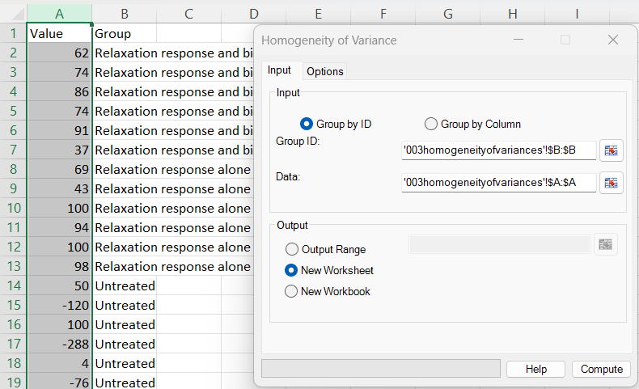
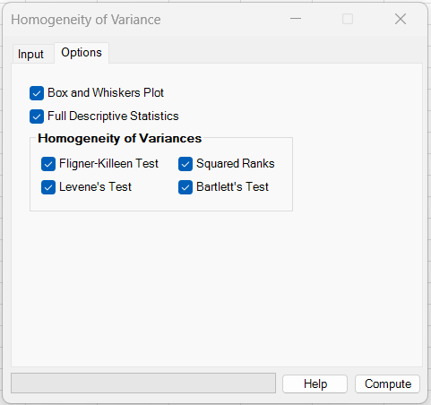
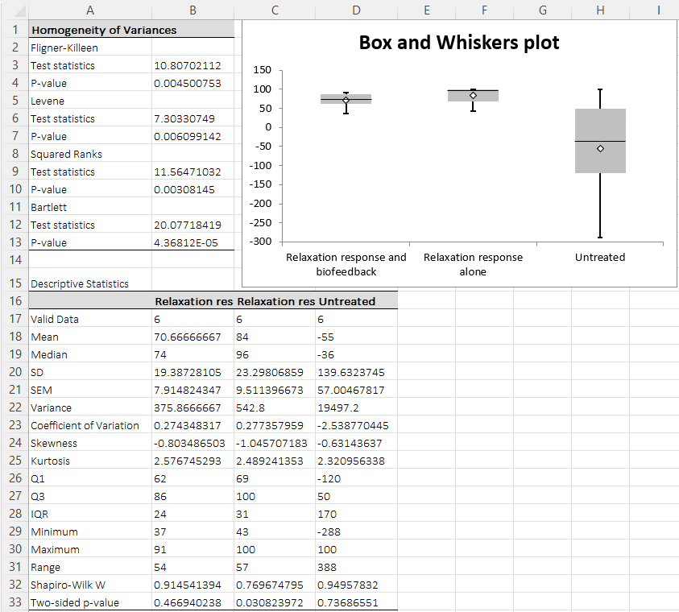

# Homogeneity of Variance

**Includes:** Fligner–Killeen, Levene (Brown–Forsythe/median), Squared Ranks, Bartlett.  
**Purpose:** Test whether multiple groups have similar variances — a key assumption for many parametric comparisons (t‑tests, ANOVA).

---

## Overview

The **Homogeneity of Variance** dialog tests whether the spread (variance) is comparable across **two or more groups**.

Why this matters:

- If group variances differ strongly, **standard t‑tests/ANOVA can misbehave** (p-values and confidence intervals may be off).
- Some procedures have variance‑robust alternatives (e.g., **Welch** variants), but it’s still useful to diagnose variance differences.

This dialog can compute up to **four variance-homogeneity tests** in one run (you can tick any subset):

- **Fligner–Killeen** (rank-based, robust to non-normality)
- **Levene** (Brown–Forsythe / median version; robust)
- **Squared Ranks** (nonparametric)
- **Bartlett** (powerful under normality, sensitive to non-normality)

---

## Example dataset (reproduce the screenshots)

Download the sample CSV used below:

- [003homogeneityofvariances.csv](../assets/data/003homogeneity_of_variances/003homogeneityofvariances.csv)

The file contains two columns:

- **Value** (numeric)
- **Group** (text labels)

In Excel, paste/import the CSV into a sheet and use **Group by ID**:

- **Group ID** → the *Group* column
- **Data** → the *Value* column

---

## Dialog screenshots

### Input tab (Group by ID)

### Options tab (choose tests + optional outputs)

### Example output (tests + descriptives + boxplot)

---

## Dialog: inputs and options

### Input tab

You can define datasets in two ways:

#### A) Group by Column (rectangular range)
- Select a **rectangular range** where **each column is one group** (numeric).
- The **first row is treated as a column name** (header). Empty headers get a default name.
- Each column is imported and cleaned independently (missing / non-numeric cells removed per column).

#### B) Group by ID (grouping column + data column)
Use this when your data are stored in “long format”:

| Value | Group |
|---:|---|
| 62 | Relaxation response and biofeedback |
| 74 | Relaxation response and biofeedback |
| … | … |

- **Group ID:** the range containing group labels (text or numbers).
- **Data:** the numeric values.
- The tests run separately on each group defined by unique Group IDs.

Output location:

- **Output Range** (write results where you specify)
- **New Worksheet** (recommended)
- **New Workbook**

---

### Options tab

Optional outputs:

- **Full Descriptive Statistics** — adds a descriptive table per group (n, mean, median, SD, IQR, etc.).
  See: [Descriptive Statistics](descriptive-statistics.md)
- **Box and Whiskers Plot** — generates a Tukey boxplot to visualize spread and outliers by group.
  See: [Box and Whiskers](box-and-whiskers.md)

Tests (tick any subset):

- **Fligner–Killeen**
- **Levene’s Test** *(median-centered / Brown–Forsythe style in BESHStatNG)*
- **Squared Ranks**
- **Bartlett’s Test**

---

## What it does

All tests evaluate the same null hypothesis:

> **H₀:** all groups have the same variance  
> **H₁:** at least one group differs in variance

The output table reports, for each selected test:

- a **test statistic**
- a **p-value**

Interpretation:

- **Small p-value** (e.g. < 0.05) → evidence that variances differ across groups.
- **Large p-value** → no strong evidence of unequal variances (does not prove equality).

## Fligner–Killeen (robust, rank-based)

A nonparametric test based on ranks of absolute deviations; often recommended when data are not perfectly normal.

**Implementation in BESHStatNG:** `FlignerKilleenTEST(arDataColumn)` in `src/StatTests/Assumptions.vb`.

For each group \(j=1,\dots,k\), compute the group median \(m_j\) and absolute deviations

\[
d_{ij} = \lvert x_{ij} - m_j \rvert .
\]

Pool all deviations across groups (\(N=\sum_j n_j\)) and compute their **midranks** \(r_{ij}\) (ties get the average rank; see code path that subtracts \(0.5\) on ties). Convert ranks to **half-normal scores** using the standard normal quantile:

\[
z_{ij} = \Phi^{-1}\!\left(0.5 + \frac{r_{ij}}{2(N+1)}\right).
\]

which is exactly what the code does via `NormSInv(0.5 + Poradie/(2*(n+1)))`.

Let \(\bar z_j\) be the mean score within group \(j\), \(\bar z\) the overall mean of all \(z_{ij}\), and let \(V^2\) be the variance of all scores (computed in code as `variance(Ranks)`). The test statistic is

\[
X^2 = \frac{\sum_{j=1}^k n_j(\bar z - \bar z_j)^2}{V^2}.
\]

BESHStatNG reports \(X^2\) and computes the p-value as a right-tail chi-square probability with \(k-1\) degrees of freedom:

\[
p = 1 - F_{\chi^2(k-1)}(X^2).
\]

**R comparison:** this is the same structure used by R’s `fligner.test` (median-centered absolute deviations, pooled ranks, normal-score transform, \(\chi^2\) approximation).

### Levene (Brown–Forsythe / median version)

Levene’s idea is to test whether group means of absolute deviations differ. Using **median-centered deviations** (Brown–Forsythe) improves robustness to non-normality and outliers.

**Implementation in BESHStatNG:** `LeveneTEST(arDataColumn, bW50:=True)` in `src/StatTests/Assumptions.vb`, called from `ComputeVarianceHomogeneity` in `src/UI/UibyID.vb` as `LeveneTEST(data.X, True)`.

For each group \(j\), compute the group median \(m_j\) and form absolute deviations

\[
Z_{ij} = \lvert x_{ij} - m_j \rvert .
\]

Then perform a one-way ANOVA on \(Z_{ij}\) across groups. Let \(\bar Z_j\) be the mean of \(Z_{ij}\) within group \(j\), and \(\bar Z\) the grand mean across all observations. The Brown–Forsythe (Levene) statistic reported by the add-in is

\[
W = \frac{(N-k)\sum_{j=1}^k n_j(\bar Z_j-\bar Z)^2}{(k-1)\sum_{j=1}^k\sum_{i=1}^{n_j}(Z_{ij}-\bar Z_j)^2}.
\]

BESHStatNG reports \(W\) and computes the p-value as a right-tail F probability:

\[
p = 1 - F_{F(k-1,\;N-k)}(W),
\]

using the internal `F_RT` function (right-tail).

**R comparison:** this matches the Brown–Forsythe version commonly used in R (e.g., median-centered Levene implementations in popular R packages).

### Squared Ranks (nonparametric; chi-square approximation)

Another robust alternative that works on transformed deviations and ranks; useful when normality is questionable.

**Implementation in BESHStatNG:** `SquaredRanksTestVARIANCE(arDataColumn)` in `src/StatTests/Assumptions.vb`.

For each group \(j\), compute the group mean \(\bar x_j\) and absolute deviations

\[
d_{ij} = \lvert x_{ij} - \bar x_j \rvert .
\]

Pool all \(d_{ij}\) values and compute **midranks** \(r_{ij}\) across the pooled deviations (BESHStatNG uses `ComputeAvgRanks`, i.e., average ranks for ties). Define squared ranks

\[
u_{ij} = r_{ij}^2.
\]

For each group, compute the group sum \(S_j=\sum_i u_{ij}\). Let

\[
\bar u = \frac{1}{N}\sum_{j=1}^k\sum_{i=1}^{n_j} u_{ij}.
\]

and

\[
d = \frac{1}{N-1}\left(\sum u_{ij}^2 - N\bar u^2\right),
\]

where \(u_{ij}^2 = r_{ij}^4\) (this corresponds exactly to the `sum2 += Ranks^4` term in the code).

The test statistic reported by the add-in is

\[
X^2 = \frac{\sum_{j=1}^k \frac{S_j^2}{n_j} - N\bar u^2}{d},
\]

and the p-value is computed using a right-tail chi-square approximation with \(k-1\) degrees of freedom:

\[
p = 1 - F_{\chi^2(k-1)}(X^2).
\]

**R comparison:** this is a standard nonparametric “rank-based scale” approach; exact naming/packaging varies in R, but the underlying idea (ranks of absolute deviations) matches rank-based variance-homogeneity tests.

### Bartlett (powerful under normality)

Very sensitive when data are normal, but **can produce small p-values just because the data are non-normal**. Use Bartlett mainly when normality is plausible (or after checking normality per group).

**Implementation in BESHStatNG:** `BartlettTEST(arDataColumn)` in `src/StatTests/Assumptions.vb`.

Let group \(j\) have sample variance \(s_j^2\) and size \(n_j\), and let \(N=\sum_j n_j\). BESHStatNG computes the pooled variance

\[
s_p^2 = \frac{\sum_{j=1}^k (n_j-1)s_j^2}{N-k}.
\]

The (corrected) Bartlett statistic reported by the add-in is

\[
X^2 =
\frac{(N-k)\ln(s_p^2) - \sum_{j=1}^k (n_j-1)\ln(s_j^2)}
{1 + \frac{1}{3(k-1)}\left(\sum_{j=1}^k\frac{1}{n_j-1} - \frac{1}{N-k}\right)}.
\]

BESHStatNG computes the p-value as a right-tail chi-square probability with \(k-1\) degrees of freedom:

\[
p = 1 - F_{\chi^2(k-1)}(X^2).
\]

**R comparison:** this matches the standard corrected Bartlett test used by R’s `bartlett.test` (same pooled variance and correction factor).

---

## Steps in the add-in

1. Excel ribbon: **BESH Stat NG → Analyse → Assumptions → Homogeneity of Variance**
2. On **Input**:
   - Choose **Group by Column** *or* **Group by ID**
   - Select ranges (use the range picker buttons)
   - Choose output destination (**New Worksheet** recommended)
3. On **Options**:
   - Tick the variance tests you want
   - (Optional) enable **Full Descriptive Statistics** and/or **Box and Whiskers Plot**
4. Click **Compute**

---

## Output

The output typically contains:

1) **Homogeneity test results** (one block listing each selected test with statistic + p-value)

2) (Optional) **Full Descriptive Statistics** table by group

3) (Optional) **Box and Whiskers plot** comparing group spreads visually

---

## Notes and practical guidance

- **Two groups vs many groups:** these tests work for 2+ groups; with 2 groups, unequal variances often suggest using Welch’s t-test.
- **Sensitivity to non-normality:** Bartlett is the most sensitive to departures from normality; prefer Fligner–Killeen or Levene (median) if normality is doubtful.
- **Unequal variances are common:** especially when means differ strongly or data are skewed. Consider transformations or robust methods where appropriate.

---

## References

- Bartlett M.S. (1937) Properties of sufficiency and statistical tests. Proc. R. Soc. A 160, 268-282.
- Brown M.B., Forsythe A.B. (1974) Robust tests for the equality of variances. Journal of the American Statistical Association 69:364-7.
- Conover W.J., and Iman R.L. (1978) Some Exact Tables for the Squared Ranks Test. Comm. Statist. B-Simulation Comput., 7,491-513.
- Conover W.J., Johnson M.E., and Johnson M.M. (1981) A Comparative Study of Tests for Homogeneity of Variances, with Applications to the Outer Continental Shelf Bidding Data. Technometrics, 23(4):351-361.
- Fligner M.A. and Killeen T.J. (1976) Distribution Free Two-Sample Tests for Scale. Journal of the American Statistical Association, 71:210-213.
- Levene H. Robust Tests for Equality of Variances in I. Olkin, ed., Contributions to Probability and Statistics: Essays in Honor of Harold Hotelling, Palo Alto, Calif.: Stanford University Press, 1960, 278 – 92.

## See also
- [Normality Tests](normality-tests.md)
- [Unpaired Two Sample T Tests](unpaired-two-sample-t-tests.md)
- [One-way ANOVA](one-way-anova.md)
- [Descriptive Statistics](descriptive-statistics.md)
- [Box and Whiskers](box-and-whiskers.md)
- [Home](../index.md)
