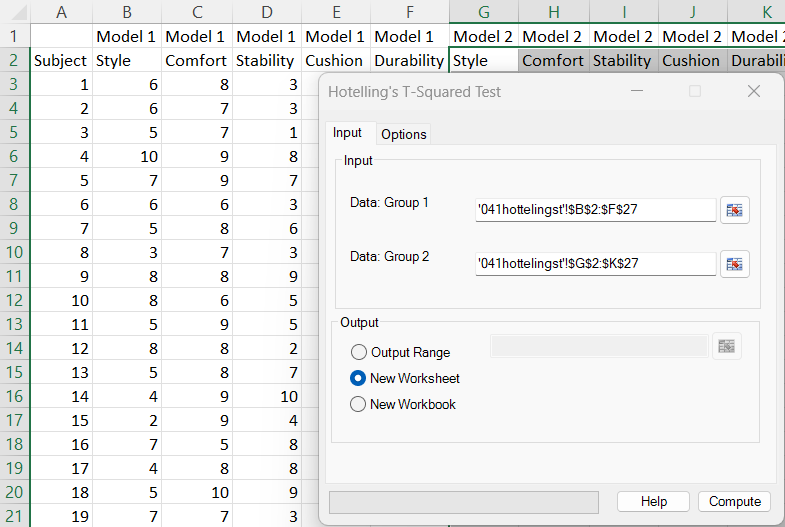
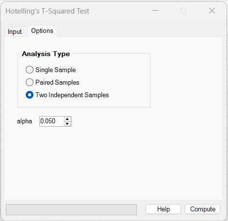
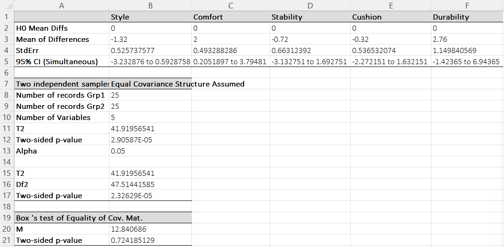
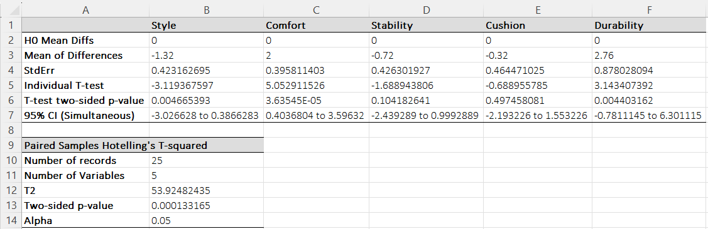

# Hotelling's T-Squared Test

**Includes:** One-sample Hotelling’s T², Two-sample (independent) Hotelling’s T², Paired Hotelling’s T², Simultaneous confidence intervals.  
**Purpose:** Multivariate extension of the t-test for comparing mean vectors (one-sample, two-sample, or paired).

---

## Overview

Hotelling’s T² is the multivariate analogue of a t-test. Instead of testing a single mean, it tests a **vector of means** across \(p\) variables in one step:

- **Single sample:** does the sample mean vector differ from a user-supplied null vector?
- **Paired samples:** do the within-row differences (Group 1 − Group 2) have mean vector 0?
- **Two independent samples:** do the two groups have the same mean vector?

The output also includes per-variable summaries (mean differences and standard errors) and a set of **simultaneous confidence intervals**.

---

## Example dataset

The example used in the screenshots compares two shoe models rated on five attributes.

Download:

- [041hottelingst.csv](../assets/data/041hotellingst/041hottelingst.csv)

Dataset layout (as shown in Excel):

- **Model 1:** Style, Comfort, Stability, Cushion, Durability
- **Model 2:** Style, Comfort, Stability, Cushion, Durability

The same dataset can be used as either:

- **Paired samples** (each row is one subject who rated both models), or
- **Two independent samples** (treat Model 1 ratings and Model 2 ratings as independent groups).

---

## Screenshots (BESHStatNG)

### Input tab


### Options tab


### Results (two independent samples)


### Results (paired samples)


---

## When to use it

Use Hotelling’s T² when:

- you have **multiple numeric outcomes** measured on the same observation (\(p\) variables), and
- you want to test a **single overall hypothesis** about the mean vector.

Typical scenarios:

- Product comparisons scored across multiple criteria (as in the example)
- Pre/post studies with multiple measurements per subject
- Multivariate lab panels (several markers) compared between groups

Key assumptions (classical Hotelling tests):

- Observations are independent within each group (and between groups for independent samples)
- The multivariate data are approximately normal (Hotelling’s test is often reasonably robust for moderate *n*)
- For the **equal-covariance** two-sample test, the two groups have the same covariance matrix

BESHStatNG reports **Box’s M** test in the independent-samples analysis to help assess covariance equality.

---

## Inputs in Excel

### Analysis types

The **Options** tab selects one of:

- **Single Sample**
- **Paired Samples**
- **Two Independent Samples**

### Input ranges

The meaning of the two input ranges depends on the selected analysis type:

#### A) Two Independent Samples

- **Data: Group 1**: an \(n_1\times p\) range (rows are observations, columns are variables)
- **Data: Group 2**: an \(n_2\times p\) range

Both ranges must have the **same number of columns** (same \(p\) variables, same order).

#### B) Paired Samples

- **Data: Group 1**: an \(n\times p\) range
- **Data: Group 2**: an \(n\times p\) range

Pairs are matched by **Excel row ID**. If the two selected ranges do not cover exactly the same rows, the add-in uses only the **intersection of row IDs** (complete pairs).

#### C) Single Sample

- **Data: Group 1**: an \(n\times p\) range (the sample)
- **Data: Group 2**: a *1 × p* range (the null mean vector H0)

For Single Sample, the second input must contain **exactly one row**.

### Missing values

Rows with missing or non-numeric cells are excluded.

- Independent samples: rows are dropped within each group separately
- Paired: only complete pairs (rows present in both groups with numeric values) are used

### Output destination

- Output range (current sheet)
- New worksheet
- New workbook

---

## Options

- **Alpha (α)**: significance level (default 0.05)
- **Analysis type**: Single / Paired / Two Independent

---

## Steps in the add-in

1. Ribbon: **BESH Stat NG → Analyse → Multivariate Analysis → Hotelling’s T-Squared Test**
2. Select the **analysis type** and **alpha** on the **Options** tab.
3. On the **Input** tab, select the required ranges (see above).
4. Choose output destination and click **Compute**.

---

## What it does (math and implementation details)

Let \(p\) be the number of variables.

---

## What it does (math and implementation details)

Let \(p\) be the number of variables.

### 1) Two independent samples (equal covariance)

Let Group 1 be \(\mathbf{X}\) (\(n_1\times p\)) and Group 2 be \(\mathbf{Y}\) (\(n_2\times p\)).

- Mean vectors: \(\bar{\mathbf{x}}\) and \(\bar{\mathbf{y}}\)
- Sample covariance matrices: \(\mathbf{S}_1\) and \(\mathbf{S}_2\)
- Pooled covariance:

$$
\mathbf{S}_p = \frac{(n_1-1)\mathbf{S}_1 + (n_2-1)\mathbf{S}_2}{n_1+n_2-2}
$$

Hotelling’s pooled two-sample statistic (as implemented) is:

$$
T^2 = (\bar{\mathbf{x}}-\bar{\mathbf{y}})^\top
\left[\,\mathbf{S}_p\left(\frac{1}{n_1}+\frac{1}{n_2}\right)\right]^{-1}
(\bar{\mathbf{x}}-\bar{\mathbf{y}})
$$

Converted to an \(F\) statistic:

$$
F = \frac{n_1+n_2-1-p}{p\,(n_1+n_2-2)}\,T^2
\;\sim\; F_{p,\;n_1+n_2-1-p}
$$

### 2) Two independent samples (unequal covariance)

BESHStatNG also reports a generalized (unequal-covariance) version:

$$
\mathbf{V} = \frac{\mathbf{S}_1}{n_1}+\frac{\mathbf{S}_2}{n_2},
\qquad
T^2_{\text{uneq}} = (\bar{\mathbf{x}}-\bar{\mathbf{y}})^\top\,\mathbf{V}^{-1}\,(\bar{\mathbf{x}}-\bar{\mathbf{y}})
$$

The add-in uses an adjusted denominator degrees of freedom (a Nel–Van der Merwe style approximation), reported as **Df2** in the output. The conversion to \(F\) uses the same scaling as above, but compares against \(F_{p,\;\text{Df2}}\).

### 3) Single sample

Let \(\mathbf{X}\) be \(n\times p\), with mean \(\bar{\mathbf{x}}\) and covariance \(\mathbf{S}\).
Let \(\vec{\mu}_0\) be the null mean vector (from the *1 × p* range).

$$
T^2 = n\,(\bar{\mathbf{x}}-\vec{\mu}_0)^\top\,\mathbf{S}^{-1}\,(\bar{\mathbf{x}}-\vec{\mu}_0)
$$

$$
F = \frac{n-p}{p\,(n-1)}\,T^2
\;\sim\; F_{p,\;n-p}
$$

The output also reports per-variable univariate t-tests:

$$
t_j = \frac{\bar{x}_j-\mu_{0j}}{\mathrm{SE}_j},
\qquad
\mathrm{SE}_j = \frac{s_j}{\sqrt{n}},
\qquad
\mathrm{df}=n-1
$$

### 4) Paired samples

Paired Hotelling’s T² is a single-sample test applied to the row-wise differences:

$$
\mathbf{D} = \mathbf{X}-\mathbf{Y}\quad (n\times p),
\qquad
H_0: \;\mathbb{E}[\mathbf{D}] = \mathbf{0}
$$

So the paired test is mathematically identical to the single-sample test on \(\mathbf{D}\) with \(\vec{\mu}_0=\mathbf{0}\).

### 5) Simultaneous confidence intervals

BESHStatNG reports a single critical value \(T_{\mathrm{crit}}\) and then uses:

$$
\mathrm{CI}_j = d_j \pm T_{\mathrm{crit}}\,\mathrm{SE}_j
$$

where \(d_j\) is the mean difference for variable \(j\).

- **Single / Paired:**

$$
T_{\mathrm{crit}} = \sqrt{\frac{p\,(n-1)}{n-p}\,F^{-1}_{p,\;n-p}(1-\alpha)}
\qquad
\mathrm{SE}_j = \frac{s_j}{\sqrt{n}}
$$

- **Independent samples (pooled covariance):**

$$
T_{\mathrm{crit}} = \sqrt{\frac{p\,(n_1+n_2-2)}{n_1+n_2-1-p}\,F^{-1}_{p,\;n_1+n_2-1-p}(1-\alpha)}
\qquad
\mathrm{SE}_j = \sqrt{\big(\mathbf{S}_p\big)_{jj}\left(\frac{1}{n_1}+\frac{1}{n_2}\right)}
$$

This uses the **right-tail** critical value (\(1-\alpha\)), matching standard Hotelling simultaneous intervals and common R implementations.

---

## Output (how to read it)

### Per-variable summary table

Top table columns are your \(p\) variables. Rows include:

- **H0 Mean Diffs**: null values (0 for paired, user-supplied for single sample)
- **Mean of Differences**: estimated mean difference for each variable
- **StdErr**: standard error of each mean difference
- **Simultaneous CI**: the reported simultaneous CI at the selected \(1-\alpha\) level

For **single** and **paired**, the table also includes:

- **Individual T-test**: per-variable t statistic
- **T-test two-sided p-value**: univariate two-sided p-values

### Overall Hotelling test table

- **T2**: Hotelling’s T² statistic
- **Two-sided p-value**: p-value from the \(F\) conversion
- **Df2** (independent unequal-covariance row): adjusted denominator df used for the generalized test

### Box’s M table (independent only)

Box’s M tests equality of covariance matrices across groups.

- A **large p-value** (e.g., > 0.05) suggests covariance matrices are not detectably different (supports equal-covariance assumption).
- A **small p-value** suggests unequal covariance; consider emphasizing the unequal-covariance row and/or additional robust methods.

---

## R code (reference)

Below are R examples that reproduce the same statistics using common packages. Install packages if needed:

```r
install.packages(c("Hotelling", "biotools"))
```

### Read the example CSV

The CSV has two header rows (group labels then variable names), so skip the first line:

```r
dat <- read.csv("041hottelingst.csv", skip = 1, check.names = FALSE)
vars <- c("Style","Comfort","Stability","Cushion","Durability")

# Rename columns to avoid duplicates
names(dat) <- c(
  "Subject",
  paste0("M1_", vars),
  paste0("M2_", vars)
)

X <- as.matrix(dat[, paste0("M1_", vars)])
Y <- as.matrix(dat[, paste0("M2_", vars)])
```

### A) Two independent samples (equal covariance)

```r
library(Hotelling)
res_eq <- hotelling.test(X, Y)   # pooled-covariance two-sample T2
res_eq$statistic   # T2
res_eq$pval        # p-value
```

Expected (this dataset):

- T² ≈ 41.9196
- two-sided p-value ≈ 2.9059e-05

### B) Paired samples (equivalent to single-sample on differences)

```r
res_paired <- hotelling.test(X, Y, paired = TRUE)
res_paired$statistic
res_paired$pval

# Equivalent single-sample on differences
D <- X - Y
res_diff <- hotelling.test(D, mu = rep(0, ncol(D)))
```

Expected (this dataset):

- T² ≈ 53.9248
- p-value ≈ 1.33165e-04

### C) Box’s M (independent covariance equality)

```r
library(biotools)
boxM(rbind(X, Y),
     grouping = rep(c("Grp1","Grp2"), c(nrow(X), nrow(Y))))
```

Expected (this dataset, add-in):

- M ≈ 12.840686
- p-value ≈ 0.724185

Different implementations of Box’s M can vary slightly due to approximation details.

### D) Reproducing the add-in’s simultaneous CIs

#### Single / Paired (standard Hotelling simultaneous CIs)

```r
alpha <- 0.05
D <- X - Y
n <- nrow(D)
p <- ncol(D)

# Mean differences and covariance of differences
dbar <- colMeans(D)
S <- cov(D)

# Per-variable standard errors
se <- sqrt(diag(S) / n)

# Hotelling critical value (right-tail F)
Tcrit <- sqrt(p * (n - 1) / (n - p) * qf(1 - alpha, p, n - p))

ci <- cbind(lower = dbar - Tcrit * se,
            upper = dbar + Tcrit * se)
ci
```

#### Two independent samples (pooled covariance)

```r
alpha <- 0.05
n1 <- nrow(X)
n2 <- nrow(Y)
p  <- ncol(X)

S1 <- cov(X)
S2 <- cov(Y)
Sp <- ((n1 - 1) * S1 + (n2 - 1) * S2) / (n1 + n2 - 2)

diff <- colMeans(X) - colMeans(Y)
se <- sqrt(diag(Sp) * (1 / n1 + 1 / n2))

df2 <- n1 + n2 - 1 - p

# Add-in / textbook Hotelling simultaneous CI uses right-tail F
Tcrit <- sqrt(p * (n1 + n2 - 2) / df2 * qf(1 - alpha, p, df2))

ci <- cbind(lower = diff - Tcrit * se,
            upper = diff + Tcrit * se)
ci
```

---

## Notes on differences vs R defaults

- **Unequal-covariance two-sample p-value:** many R packages report only the classical pooled-covariance Hotelling test. BESHStatNG also reports a generalized unequal-covariance variant with an adjusted denominator df; you may need a custom implementation to match it exactly.

---

## References

- Hotelling H (1931) The generalization of Student’s ratio. Ann Math Stat. 2(3):360–378.
- https://www.ncss.com/wp-content/themes/ncss/pdf/Procedures/NCSS/Hotellings_One-Sample_T2.pdf
- https://www.ncss.com/wp-content/themes/ncss/pdf/Procedures/NCSS/Hotellings_Two-Sample_T2.pdf

## See also

- [Principal Component Analysis](principal-component-analysis.md)
- [Paired T-tests](paired-t-tests.md)
- [Unpaired (two sample) T tests](unpaired-two-sample-t-tests.md)
- [Home](../index.md)
