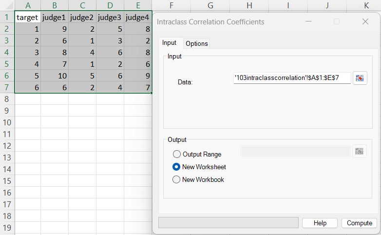
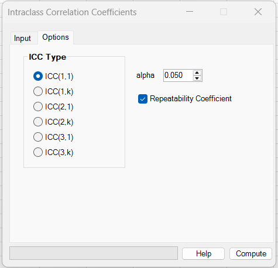
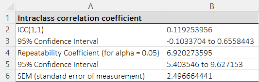

# Intraclass Correlation Coefficients

**Includes:** ICC(1,1), ICC(1,k), ICC(2,1), ICC(2,k), ICC(3,1), ICC(3,k) with confidence intervals; optional *Repeatability Coefficient* and *SEM*.  
**Purpose:** Quantify reliability/agreement of measurements across raters/replicates using the standard Shrout–Fleiss ICC family.

---

## Overview

The **intraclass correlation coefficient (ICC)** measures how strongly measurements of the **same targets/subjects** resemble each other relative to the total variability. ICC is commonly used for:

- inter-rater reliability (multiple judges rating the same targets)
- test–retest reliability (repeated measurements)
- agreement across measurement methods (when values are in the same units)

This add-in follows the Shrout & Fleiss (1979) naming convention:

- **ICC(1,·)**: one-way random effects (raters/replicates treated as exchangeable)
- **ICC(2,·)**: two-way random effects, **absolute agreement**
- **ICC(3,·)**: two-way mixed effects (raters fixed), **consistency**

The second index denotes:

- **(·,1)**: single measurement / single rater
- **(·,k)**: mean of *k* measurements/raters (average-measures ICC)

> Note: In the add-in, for ICC(2,k) and ICC(3,k), **k is the number of columns** (raters) in your selected data range.

---

## Example dataset

Download the example dataset used here: [103intraclasscorrelation.csv](../assets/data/103intraclasscorrelation/103intraclasscorrelation.csv)

This dataset is from Shrout & Fleiss (1979). Use the **judges** columns as the input data range (e.g., `judge1`–`judge4`).

---

## Screenshots

### Input screen



### Options



### Results



---

## When to use it

Use ICC when:

- multiple raters/replicates measure the same targets, and you want a **single reliability index**
- you need either:

  - **absolute agreement** (raters should give the same numerical values), or
  - **consistency** (raters can differ by a constant shift but preserve ranking)

Choose the ICC family based on your design and inference goal:

- **ICC(1,·)** (one-way random): raters/replicates are exchangeable; you do *not* model systematic rater effects.
- **ICC(2,·)** (two-way random, agreement): targets and raters are both random; you want to generalize to other raters and require agreement.
- **ICC(3,·)** (two-way mixed, consistency): raters are fixed (only these raters matter); you care about consistency rather than absolute agreement.

---

## Inputs in Excel

### Data

Select a **rectangular numeric range** where:

- rows = targets/subjects
- columns = raters/judges/replicates

### Missing values

- ICC(1,1) and ICC(1,k): missing values are allowed (unbalanced targets) — the add-in uses an effective group size \(n_0\) (see below).
- ICC(2,·) and ICC(3,·): the design must be **complete** (no missing values), because these ICCs are based on a two-way ANOVA without replication.

---

## Steps in the add-in

1. Ribbon: **BESH Stat NG → Analyse → Agreement → Intraclass Correlation Coefficients**
2. In **Input**, select the data range (raters in columns)
3. Choose output destination (range / new worksheet / new workbook)
4. In **Options**:
   - Select ICC type (ICC(1,1), ICC(1,k), ICC(2,1), ICC(2,k), ICC(3,1), ICC(3,k))
   - Set **Alpha**
   - (Optional) check **Repeatability Coefficient**
5. Click **Compute**

---

## What it does (math and implementation details)

### ANOVA mean squares used

All ICC types are computed using **ANOVA mean squares**.

Let:

- \(n\) = number of targets (rows)
- \(k\) = number of raters/replicates (columns)

For two-way designs (ICC(2,·), ICC(3,·)), the add-in uses a two-way ANOVA without replication (implemented via a repeated-measures one-way ANOVA table) to obtain:

- \(MSR\): mean square for **rows** (targets)
- \(MSC\): mean square for **columns** (raters)
- \(MSE\): residual mean square (interaction + error)

For one-way designs (ICC(1,·)), the add-in uses a one-way ANOVA on the per-target groups to obtain:

- \(MSB\): mean square **between** targets
- \(MSW\): mean square **within** targets (error)

---

### ICC(1,1): one-way random effects, single measurement

Model (one-way random):

$$
y_{ij} = \mu + u_i + e_{ij}
$$

Point estimate (balanced case):

$$
ICC(1,1) = \frac{MSB - MSW}{MSB + (k-1)MSW}
$$

**Unbalanced targets (missing values):** the add-in uses an effective group size \(n_0\):

$$
n_0 = \frac{n_{tot} - \sum_i n_i^2 / n_{tot}}{g-1}
$$

where \(g\) is the number of targets, \(n_i\) is the number of measurements for target \(i\), and \(n_{tot} = \sum_i n_i\).

Then:

$$
ICC(1,1) = \frac{F-1}{F + (n_0-1)}, \quad F = \frac{MSB}{MSW}
$$

#### Confidence interval (F-based)

Let \(F = MSB/MSW\) with \(df_1=g-1\), \(df_2=n_{tot}-g\) (the within df used by ANOVA).

Compute F bounds and transform back:

$$
F_L = \frac{F}{F_{1-\alpha/2}(df_1, df_2)}, \qquad
F_U = F\cdot F_{1-\alpha/2}(df_2, df_1)
$$

Then:

$$
ICC_L = \frac{F_L-1}{F_L + (n_0-1)}, \qquad
ICC_U = \frac{F_U-1}{F_U + (n_0-1)}
$$

#### Balanced vs unbalanced designs (exactness of the CI)

The F-based confidence interval above is **exact** under the classical **balanced** one-way random-effects design (all targets have the same number of ratings, \(n_i=k\), and errors are normal).

If the design is **unbalanced** (missing values / unequal \(n_i\)), the add-in uses the effective group size \(n_0\) in the F-to-ICC transformation. In that case, the resulting CI should be regarded as an **approximation**, although it is commonly used in practice for one-way ICC with unequal group sizes.

---

### ICC(1,k): one-way random effects, average of k measurements

Point estimate:

$$
ICC(1,k) = \frac{MSB - MSW}{MSB}
$$

The add-in obtains the CI by transforming the ICC(1,1) limits \(L_1,U_1\) to the average-measures scale using \(n_0\):

$$
ICC(1,k)_L = \frac{n_0 L_1}{1 + (n_0-1)L_1},\qquad
ICC(1,k)_U = \frac{n_0 U_1}{1 + (n_0-1)U_1}
$$

> **Note (unbalanced designs):** In balanced data \(n_0 \approx k\) and the ICC(1,k) CI is exact under the standard model assumptions. With missing values / unequal \(n_i\), the transformation uses \(n_0\), so the ICC(1,k) CI is an approximation.

---

### ICC(2,1): two-way random effects, absolute agreement, single measurement

Point estimate:

$$
ICC(2,1) =
\frac{MSR - MSE}{MSR + (k-1)MSE + \frac{k}{n}(MSC - MSE)}
$$

#### Confidence interval (F-based transformation)

Let:

$$
F = \frac{MSR}{MSE}, \qquad
c = \frac{k(MSC - MSE)}{n\,MSE}
$$

Then:

$$
ICC(2,1) = \frac{F - 1}{F + (k-1) + c}
$$

Compute \(F_L,F_U\) using \(df_R=n-1\), \(df_E=(n-1)(k-1)\):

$$
F_L = \frac{F}{F_{1-\alpha/2}(df_R,df_E)}, \qquad
F_U = F\cdot F_{1-\alpha/2}(df_E,df_R)
$$

Transform:

$$
ICC_L = \frac{F_L - 1}{F_L + (k-1) + c},\qquad
ICC_U = \frac{F_U - 1}{F_U + (k-1) + c}
$$

---

### ICC(2,k): two-way random effects, absolute agreement, average of k raters

Point estimate:

$$
ICC(2,k) =
\frac{MSR - MSE}{MSR + \frac{MSC - MSE}{n}}
$$

Write in terms of:

$$
F = \frac{MSR}{MSE}, \qquad c = \frac{MSC - MSE}{n\,MSE}
$$

Then:

$$
ICC(2,k) = \frac{F - 1}{F + c}
$$

CI is computed by placing bounds on \(F\) (same \(df_R,df_E\) as above) and transforming:

$$
ICC_L = \frac{F_L - 1}{F_L + c},\qquad
ICC_U = \frac{F_U - 1}{F_U + c}
$$

---

### ICC(3,1): two-way mixed effects, consistency, single measurement

Point estimate:

$$
ICC(3,1) =
\frac{MSR - MSE}{MSR + (k-1)MSE}
$$

CI is obtained by transforming F bounds with \(F = MSR/MSE\):

$$
ICC_L = \frac{F_L - 1}{F_L + (k-1)},\qquad
ICC_U = \frac{F_U - 1}{F_U + (k-1)}
$$

---

### ICC(3,k): two-way mixed effects, consistency, average of k raters

Point estimate:

$$
ICC(3,k) = \frac{MSR - MSE}{MSR} = 1 - \frac{1}{F},\quad F=\frac{MSR}{MSE}
$$

Thus the CI is obtained by transforming \(F_L,F_U\) directly:

$$
ICC_L = \frac{F_L - 1}{F_L},\qquad
ICC_U = \frac{F_U - 1}{F_U}
$$

---

### Repeatability Coefficient (optional)

If **Repeatability Coefficient** is selected, the add-in also reports:

- **SEM (standard error of measurement)** in the original measurement units
- **Repeatability Coefficient (RC)**, interpreted as a 95% repeatability limit for the absolute difference between **two** measurements on the same target under repeatability conditions.

Let \(z_{1-\alpha/2}\) be the standard normal quantile (for \(\alpha=0.05\), \(z_{0.975}\approx 1.96\)).

The add-in first computes a **measurement-error variance** (call it \(V\)) that is consistent with the **currently selected ICC type**, then:

\[
SEM = \sqrt{V}
\]

\[
RC = z_{1-\alpha/2}\,\sqrt{2}\,SEM \;\;\approx\;\; 2.77 \, SEM \quad \text{(for } \alpha=0.05\text{)}
\]

#### Variance \(V\) used (matches the selected ICC)

Let:

- \(n\) = number of targets (rows)
- \(k\) = number of raters/replicates (columns)
- \(MSW\) = one-way within-target mean square
- \(MSC\) = two-way columns (rater) mean square
- \(MSE\) = two-way residual mean square

**ICC(1,1)** (one-way, single):

\[
V = MSW
\]

**ICC(1,k)** (one-way, average-measures):

For unbalanced data, the add-in uses the effective group size \(n_0\) (same \(n_0\) as used in the ICC(1,·) CI transform):

\[
V = \frac{MSW}{n_0}
\]

> Note: in balanced data \(n_0 \approx k\), so this reduces to \(MSW/k\).

**ICC(2,1)** (two-way random, *absolute agreement*, single):

This ICC includes the effect of rater-to-rater variability in what counts as measurement error for agreement. The add-in uses:

\[
\sigma_R^2 = \max\!\left(0,\frac{MSC - MSE}{n}\right)
\]

\[
V = MSE + \sigma_R^2
\]

**ICC(2,k)** (two-way random, agreement, average-measures):

\[
V = \frac{MSE + \sigma_R^2}{k}
\]

**ICC(3,1)** (two-way mixed, *consistency*, single):

For consistency ICC, systematic rater differences are not treated as “error” for the ICC, so the add-in uses:

\[
V = MSE
\]

**ICC(3,k)** (two-way mixed, consistency, average-measures):

\[
V = \frac{MSE}{k}
\]

#### Confidence interval for RC

The add-in forms a chi-square CI for the variance \(V\), then transforms to RC.

- **For ICC(1,·)** (one-way): \(V\) is based on \(MSW\) with the one-way within df \(df_W\).
- **For ICC(2,·)** (two-way random agreement): when \(MSC > MSE\), \(V\) is a linear combination of \(MSE\) and \(MSC\), and an approximate Satterthwaite df is used:

$$
V = \left(1 - \frac{1}{n}\right) MSE + \left(\frac{1}{n}\right) MSC
$$

$$
df^* \approx \frac{V^2}{
\frac{\left(\left(1 - \frac{1}{n}\right) MSE\right)^2}{df_E}
+
\frac{\left(\left(\frac{1}{n}\right) MSC\right)^2}{df_C}
}
$$
  
  If \(MSC \le MSE\), the add-in sets \(\sigma_R^2=0\) so \(V=MSE\) and uses \(df_E\).
  
- **For ICC(3,·)** (two-way mixed consistency): \(V\) is based on \(MSE\) with df \(df_E\).

Given an effective df (call it \(df_V\)), the variance CI is:

\[
V_L = \frac{df_V\,V}{\chi^2_{1-\alpha/2,df_V}},\qquad
V_U = \frac{df_V\,V}{\chi^2_{\alpha/2,df_V}}
\]

Then:

\[
RC_L = z_{1-\alpha/2}\sqrt{2}\,\sqrt{V_L},\qquad
RC_U = z_{1-\alpha/2}\sqrt{2}\,\sqrt{V_U}
\]

---

## How to interpret (quick guide)

### ICC magnitude (rules of thumb)

Interpretation depends on context, but commonly used thresholds (Koo & Li, 2016) are:

- < 0.50: poor
- 0.50–0.75: moderate
- 0.75–0.90: good
- > 0.90: excellent

### What each ICC answers

| ICC type | Model | Agreement type | Generalizes to other raters? | Use when… |
|---|---|---|---|---|
| ICC(1,1) | one-way random | agreement | yes (exchangeable) | raters/replicates are exchangeable; no explicit rater effect |
| ICC(1,k) | one-way random | agreement | yes (exchangeable) | reliability of the mean of k measurements |
| ICC(2,1) | two-way random | **absolute** | yes | want agreement and generalize to other raters |
| ICC(2,k) | two-way random | **absolute** | yes | agreement for the mean of k raters |
| ICC(3,1) | two-way mixed | **consistency** | no (fixed raters) | only these raters matter; shifts are acceptable |
| ICC(3,k) | two-way mixed | **consistency** | no (fixed raters) | consistency for the mean of k fixed raters |

---

## Relationship to R (how to reproduce)

### Using the **irr** package

```r
library(irr)

d <- read.csv("103intraclasscorrelation.csv")
X <- as.matrix(d[, -1])  # drop target column

# ICC(1,1): one-way random, single
icc(X, model = "oneway", type = "consistency", unit = "single")

# ICC(1,k): one-way random, average of k
icc(X, model = "oneway", type = "consistency", unit = "average")

# ICC(2,1): two-way random, absolute agreement, single
icc(X, model = "twoway", type = "agreement", unit = "single")

# ICC(2,k): two-way random, absolute agreement, average
icc(X, model = "twoway", type = "agreement", unit = "average")

# ICC(3,1): two-way mixed, consistency, single
icc(X, model = "twoway", type = "consistency", unit = "single")

# ICC(3,k): two-way mixed, consistency, average
icc(X, model = "twoway", type = "consistency", unit = "average")
```

Most ICC packages (e.g., **irr**, **psych**) compute ICCs and CIs, but do not directly report the same Repeatability Coefficient/SEM definitions.

### Expected differences

- ICC values and ICC confidence intervals may differ slightly across R packages because of differences in CI construction (exact vs approximate, df conventions, and handling of missing data).
- For ICC(1,·) with missing values/unbalanced targets, some software uses the nominal \(k\), while this add-in uses the effective group size \(n_0\) in the ICC(1,k) transformation and RC/SEM scaling.
- RC/SEM are not standardized across software: some tools report SEM as \(SD\sqrt{1-ICC}\) (a different definition), while the add-in’s RC/SEM are ANOVA-variance based and aligned to the selected ICC model (agreement vs consistency).

---

## Notes and limitations

- ICC confidence intervals are based on **ANOVA assumptions** (approximately normal errors and appropriate variance decomposition). CIs can be asymmetric and may include negative values.
- ICC(2,·) and ICC(3,·) require **complete data** (no missing cells).
- “High ICC” does not automatically mean “small measurement differences”; consider also reporting the **Repeatability Coefficient** when measurement units matter.

---

## References

- Shrout, P. E., & Fleiss, J. L. (1979). Intraclass correlations: uses in assessing rater reliability. *Psychological Bulletin*, 86(2), 420–428.
- McGraw, K. O., & Wong, S. P. (1996). Forming inferences about some intraclass correlation coefficients. *Psychological Methods*, 1(1), 30–46.
- Koo, T. K., & Li, M. Y. (2016). A guideline of selecting and reporting intraclass correlation coefficients for reliability research. *Journal of Chiropractic Medicine*, 15(2), 155–163.

## See also
- [Deming Regression](deming-regression.md)
- [Passing–Bablok Regression](passing-bablok-regression.md)
- [Home](../index.md)
