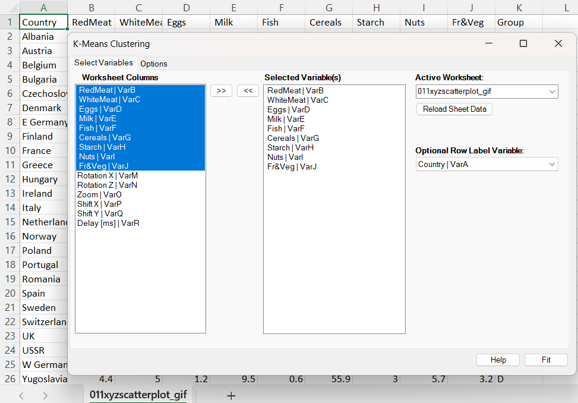
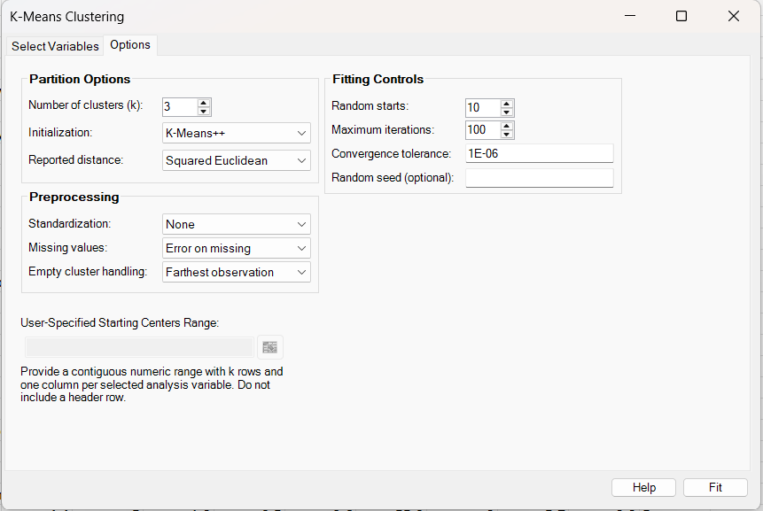
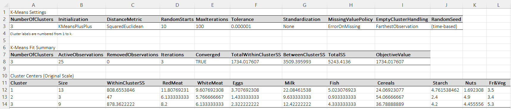
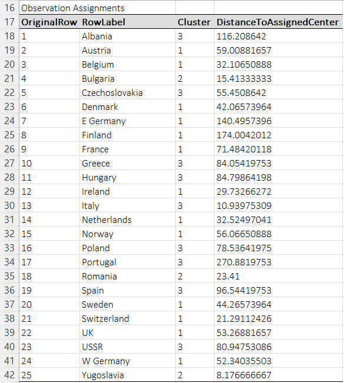

# K-Means Clustering

**Includes:** K-means clustering for numeric data, initialization by k-means++, Forgy, random partition, or user-specified centers, repeated random starts, optional z-score or 0–1 range standardization, explicit missing-value handling, empty-cluster strategies, optional row labels, and formatted result tables.  
**Purpose:** Partition observations into a requested number of compact clusters by minimizing the total within-cluster sum of squared Euclidean distances.

---

## Overview

K-means clustering partitions a numeric data matrix into a fixed number of clusters, denoted by \(k\).
Each cluster is represented by its **centroid** (cluster mean), and each observation is assigned to the nearest centroid.

The BESHStatNG workflow is:

1. import the selected numeric variables,
2. optionally import a text or numeric **row-label** column for reporting,
3. optionally standardize the data,
4. fit the clustering model using one or more starts,
5. select the best solution by the smallest total within-cluster sum of squares, and
6. write formatted results tables and a data sheet.

The output contains:

- a **Data** sheet containing the analyzed variables and optional row labels,
- a **K-Means results** sheet containing settings, fit summary, cluster centers, and observation assignments.

---

## Example dataset

This page uses the commonly used **protein consumption by country** dataset for 25 European countries.
It contains estimated protein consumption from 9 food groups:

- RedMeat
- WhiteMeat
- Eggs
- Milk
- Fish
- Cereals
- Starch
- Nuts
- FrVeg

The file used for the screenshots is available here:

- [011xyzscatterplot_gif.csv](../assets/data/011xyzscatterplot/011xyzscatterplot_gif.csv)

In the screenshots, the **Country** column is used only as an optional row label. The **Group** column is present in the dataset as an external grouping variable from the teaching example, but it is **not** used in the clustering calculations.

---

## Screenshots

### Select Variables tab



### Options tab



### Results sheet: settings, fit summary, and centers



### Results sheet: observation assignments



---

## Brief interpretation of the example

With \(k=3\), no standardization, squared Euclidean reporting, and k-means++ initialization, the screenshot example produced:

- **Cluster sizes:** 13, 3, and 9
- **TotalWithinClusterSS:** approximately 1734.02
- **BetweenClusterSS:** approximately 3509.40

A useful interpretation of the three fitted clusters is:

1. **Animal-protein / dairy dominant cluster**  
   Higher red meat, white meat, milk, and fish; lower cereals and nuts. This cluster contains countries such as Austria, Belgium, France, the Netherlands, the United Kingdom, and the Scandinavian countries.

2. **Very high-cereal / low-animal-protein cluster**  
   Very high cereals and lower milk, fish, and eggs. In the screenshot this is the small cluster containing **Bulgaria**, **Romania**, and **Yugoslavia**.

3. **Mixed southern/eastern dietary pattern**  
   Intermediate cereals, moderate meat and milk, and comparatively higher nuts and fruit/vegetable intake. In the screenshot this includes countries such as Albania, Greece, Italy, Portugal, Spain, and the USSR.

Because k-means cluster labels are arbitrary, another run or another software package may number the same three clusters differently.

---

## When to use it

Use k-means clustering when you want to:

- split numeric observations into a **pre-specified** number of groups,
- summarize each group by a centroid,
- compare within-cluster and between-cluster variability,
- create a stable partition by trying several random starts.

K-means is most appropriate when:

- all analysis variables are numeric,
- Euclidean geometry is meaningful for the problem,
- clusters are reasonably compact and centroid-based summaries make sense.

It is usually less appropriate when:

- variables are categorical,
- clusters are strongly non-spherical or chained,
- the number of clusters is completely unknown and must be inferred from a hierarchy rather than fixed in advance.

---

## Inputs in Excel

### Selecting variables

On the **Select Variables** tab:

- move the numeric analysis variables from **Worksheet Columns** to **Selected Variable(s)**,
- optionally select a **Row Label Variable**.

The optional row-label column is **not** used in the clustering calculations. It is only carried into the output tables so that cluster membership is easier to interpret.

### Optional row labels

If a row-label column is selected, BESHStatNG writes it into:

- the **Data** sheet,
- the **Observation Assignments** table.

If no row-label variable is selected, the output still identifies observations by row number.

### User-specified starting centers

When **Initialization = User-Specified Centers**, provide a contiguous Excel range containing:

- exactly **k rows**, and
- exactly **p columns**, where \(p\) is the number of selected analysis variables.

The range must contain numeric values only and must not include a header row.

---

## Options in BESHStatNG

### 1) Number of clusters

- **Number of clusters (k)**: the requested partition size.

The fitted model always returns exactly \(k\) cluster labels, numbered from 1 to \(k\).

### 2) Initialization

BESHStatNG supports four initialization modes:

- **K-Means++**
- **Forgy**
- **Random Partition**
- **User-Specified Centers**

#### K-means++
The first center is chosen at random. Each subsequent center is sampled with probability proportional to the current squared distance from the nearest chosen center.

#### Forgy
\(k\) observations are sampled and used directly as the initial centers.

#### Random partition
Observations are randomly partitioned into \(k\) provisional groups first, and the initial centers are the means of those provisional groups.

#### User-specified centers
The starting centers are imported from a worksheet range and transformed using the same preprocessing settings as the analysis data.

### 3) Distance display

BESHStatNG offers two reporting modes:

- **Squared Euclidean**
- **Euclidean**

!!! note
    The fitting criterion is always the total within-cluster **sum of squared Euclidean distances**.  
    Choosing **Euclidean** changes only the reported observation-to-center distances in the output table, not the optimization criterion.

### 4) Preprocessing

- **Standardization**: None, Z-scores, or Range 0 to 1
- **Missing values**: Error on missing, or Listwise deletion

### 5) Fitting controls

- **Random starts**
- **Maximum iterations**
- **Convergence tolerance**
- **Random seed** (optional)

### 6) Empty-cluster handling

If an iteration produces an empty cluster, BESHStatNG can:

- re-seed it with the **farthest observation**,
- re-seed it with a **random observation** from a cluster having size > 1,
- or **keep the previous center**.

---


## Choosing options: when to use which and why

### A practical default recipe

For many everyday numeric datasets, a good starting configuration is:

- **Standardization:** Z-scores when variables are on different scales
- **Initialization:** K-means++
- **Random starts:** at least 20; often 50 or more for noisier problems
- **Missing values:** Listwise deletion only if missingness is rare and acceptable; otherwise stop and clean the data first
- **Empty-cluster handling:** Farthest observation
- **Distance display:** Euclidean for reader-friendly output, knowing that fitting still minimizes squared Euclidean SS

This combination is usually the most robust first pass because it reduces scale dominance, improves seeding, and lowers the chance of a poor local minimum.

### 1) Number of clusters: how to choose \(k\)

K-means always needs a requested cluster count in advance.

**Use a smaller \(k\)** when:

- you want broad, interpretable segments,
- the sample size is modest,
- very small clusters would not be practically useful.

**Use a larger \(k\)** when:

- you expect real substructure inside broad groups,
- the sample is large enough to support finer segmentation,
- you plan to merge or profile clusters afterward.

**Preferred workflow:** try a short range such as \(k=2\) to \(k=6\), compare total within-cluster SS, cluster sizes, and interpretability, then keep the smallest \(k\) that still captures meaningful separation. A hierarchical run is often a useful precursor when \(k\) is uncertain.

### 2) Initialization: which one to prefer

#### K-means++

**Usually preferred.**

Choose this when:

- you want the best general default,
- you want better separated starting centers,
- you want fewer obviously bad local minima.

Why: k-means++ tends to spread the initial centers across the data cloud, which usually improves solution quality relative to naive random starts.

#### Forgy

Choose this when:

- you want a classic simple random-observation seeding rule,
- you are already using many repeated starts,
- you want a baseline comparison against k-means++.

Why: it is simple and fast, but it is more sensitive to unlucky starts than k-means++.

#### Random Partition

Use this mainly when:

- you want to compare against another legacy implementation,
- you are experimenting with initialization sensitivity.

Why: it can work, but it is usually less stable and less attractive as a default because the provisional random partition can create weak initial centers.

**Practical preference:** usually behind k-means++ and often behind Forgy.

#### User-Specified Centers

Preferred when:

- you need a reproducible analysis from known starting points,
- you want to refine a previous solution,
- you have substantive prototype centers from prior work,
- you are validating against another software package.

Why: it gives the strongest reproducibility and lets you treat k-means as a local refinement step rather than a fully random search.

### 3) Standardization: none, z-scores, or range 0 to 1

#### None

Choose **None** when:

- all variables are already in comparable units,
- raw magnitude differences are substantively meaningful,
- you intentionally want high-variance variables to influence the partition more strongly.

Risk: variables with larger scales or variances can dominate the clustering.

#### Z-scores

**Usually preferred when variables have different units or spreads.**

Choose z-scores when:

- one variable is in percentages and another in absolute counts,
- variables differ substantially in variance,
- you want every variable to contribute on a roughly equal footing.

Why: z-score scaling puts variables on a common variance scale without compressing all columns into the same finite range.

#### Range 0 to 1

Choose range standardization when:

- variables are naturally bounded,
- you want all columns to lie on the same [0, 1] scale,
- you want to reduce the impact of unit differences while keeping each variable within a fixed range.

Why: it can be useful for bounded scorecards or mixed measurement units, but it is more sensitive to extreme minima and maxima than z-scores.

**General preference:**

- use **Z-scores** most often,
- use **None** only when raw scale is meaningful and comparable,
- use **Range 0 to 1** when bounded-scale comparability is the main goal.

### 4) Missing values: error or listwise deletion

#### Error on missing

Preferred when:

- missing values signal a data-quality problem,
- the dataset is not large enough to lose rows safely,
- you want to force explicit data cleaning before clustering.

Why: k-means does not natively model missingness; silently dropping many rows can change the partition materially.

#### Listwise deletion

Choose this when:

- only a small proportion of rows are incomplete,
- the removed cases are not central to the question,
- you want a fast complete-case analysis.

Be cautious when missingness is common or systematic, because the final clusters may then describe only the complete-case subset.

### 5) Random starts, iterations, tolerance, and seed

#### Random starts

**One of the most important controls.**

- Use **1 start** only for deterministic user-specified centers or quick experimentation.
- Use **10 to 20 starts** for small, clean problems.
- Use **20 to 50+ starts** for noisier data, larger samples, or when cluster overlap is substantial.

Why: k-means optimizes a non-convex objective, so multiple starts materially reduce the chance of keeping a poor local minimum.

#### Maximum iterations

The default can usually remain moderate. Increase it when:

- the solution is not converging,
- you are using many variables,
- centers move slowly near convergence.

If convergence happens quickly, a higher cap has little downside other than negligible extra checking.

#### Convergence tolerance

Use a **smaller tolerance** when you want a tighter final solution and reproducible comparisons. Use a **larger tolerance** when speed matters more than tiny objective improvements.

In practice, the random-start setting usually matters more than fine-tuning tolerance.

#### Random seed

Set a seed when:

- you want fully reproducible runs,
- you are writing a report or teaching material,
- you want to compare results across software or parameter settings.

Leave it unset when you simply want a fresh random search each run.

### 6) Empty-cluster handling

#### Farthest observation

**Usually preferred.**

Choose this when:

- you want the empty cluster to restart in an underserved region of the data,
- you want a deterministic and often sensible recovery rule.

Why: reseeding with the farthest observation tends to place the center where the current partition is fitting worst.

#### Random observation from a cluster of size > 1

Choose this when:

- you prefer a simpler stochastic recovery rule,
- you are already relying on many starts.

Why: this is acceptable, but it is less targeted than the farthest-observation strategy.

#### Keep previous center

Choose this only when:

- you want to preserve the previous path for diagnostic reasons,
- you are examining algorithm behavior step by step.

Why: it may keep the algorithm numerically stable in some edge cases, but it can also leave a weak or effectively inactive cluster center in place.

**General preference:** farthest observation first, random observation second, keep previous center only for special cases.

### 7) Euclidean vs squared Euclidean reporting

This choice affects the **reported observation-to-center distances**, not the fitting objective.

#### Euclidean

Preferred when:

- results will be read by a broad audience,
- you want distances back on the familiar geometric scale.

#### Squared Euclidean

Preferred when:

- you want reporting that matches the optimization criterion directly,
- you are diagnosing large point-to-center discrepancies,
- you want consistency with within-cluster SS thinking.

### 8) When k-means is preferred, and when it is not

K-means is a strong first choice when:

- the goal is a **fixed partition** rather than a dendrogram,
- clusters are expected to be reasonably compact and centroid-like,
- the sample size is large enough that hierarchical clustering would be less convenient,
- you want cluster centers as easy-to-explain summaries.

Prefer hierarchical clustering first when:

- the number of clusters is unknown,
- you want to inspect nested structure,
- you suspect chaining or non-spherical structure,
- you want the dendrogram itself as part of the result.


## Output tables

### 1) K-Means Settings

Includes:

- NumberOfClusters
- Initialization
- DistanceMetric
- RandomStarts
- MaxIterations
- Tolerance
- Standardization
- MissingValuePolicy
- EmptyClusterHandling
- RandomSeed

### 2) K-Means Fit Summary

Includes:

- NumberOfClusters
- ActiveObservations
- RemovedObservations
- Iterations
- Converged
- TotalWithinClusterSS
- BetweenClusterSS
- TotalSS
- ObjectiveValue

### 3) Cluster Centers (Original Scale)

One row per cluster, including:

- Cluster label
- Cluster size
- Within-cluster SS
- One centroid value for each selected variable

If standardization is used, the output may also include **Cluster Centers (Working Analysis Scale)** and the standardization constants.

### 4) Observation Assignments

One row per active observation, including:

- Original row
- Optional row label
- Cluster
- DistanceToAssignedCenter

---

## Mathematical details

Let the active data matrix be

$$
X = [x_{ij}] \in \mathbb{R}^{n \times p},
$$

where:

- \(n\) = number of active observations,
- \(p\) = number of selected variables.

Rows removed by listwise deletion are excluded before the clustering criterion is evaluated.

### A) Optional preprocessing

#### No standardization

The working matrix is simply:

$$
X^{*} = X.
$$

#### Z-score standardization

For each variable \(j\), compute the sample mean and sample standard deviation:

$$
\bar{x}_j = \frac{1}{n}\sum_{i=1}^{n} x_{ij},
\qquad
s_j = \sqrt{\frac{1}{n-1}\sum_{i=1}^{n}(x_{ij}-\bar{x}_j)^2}.
$$

The working value is:

$$
z_{ij} = \frac{x_{ij} - \bar{x}_j}{s_j}.
$$

If \(s_j = 0\), the implementation substitutes scale 1.0 so that the transformed column remains finite.

#### Range 0 to 1 standardization

For each variable \(j\), let

$$
\min_j = \min_i x_{ij},
\qquad
\max_j = \max_i x_{ij},
\qquad
r_j = \max_j - \min_j.
$$

The working value is:

$$
u_{ij} = \frac{x_{ij} - \min_j}{r_j}.
$$

If \(r_j = 0\), the implementation again substitutes scale 1.0.

### B) Objective function

Let \(C_1, \dots, C_k\) be the fitted clusters and let \(\mu_c\) denote the centroid of cluster \(c\).
The objective minimized is

$$
W = \sum_{c=1}^{k} \sum_{i \in C_c} \lVert x_i^{*} - \mu_c \rVert^2,
$$

where \(x_i^{*}\) is the observation on the working analysis scale.

This quantity is reported as **TotalWithinClusterSS** and also as **ObjectiveValue**.

### C) Assignment step

At each iteration, observation \(i\) is assigned to the cluster whose current center is closest in squared Euclidean distance:

$$
\hat{c}(i) = \arg\min_{c \in \{1,\dots,k\}} \lVert x_i^{*} - \mu_c \rVert^2.
$$

### D) Update step

Once assignments are updated, each centroid becomes the mean of the observations currently assigned to that cluster:

$$
\mu_c = \frac{1}{|C_c|} \sum_{i \in C_c} x_i^{*}.
$$

The algorithm repeats the assignment and update steps until either:

- the assignment vector stops changing, or
- the center movement is below the requested tolerance, or
- the maximum number of iterations is reached.

### E) Total, within-, and between-cluster sums of squares

Let

$$
\bar{x}^{*} = \frac{1}{n}\sum_{i=1}^{n} x_i^{*}
$$

be the grand mean on the working scale.
Then the total sum of squares is

$$
T = \sum_{i=1}^{n} \lVert x_i^{*} - \bar{x}^{*} \rVert^2.
$$

The between-cluster sum of squares is

$$
B = \sum_{c=1}^{k} |C_c|\,\lVert \mu_c - \bar{x}^{*} \rVert^2.
$$

For Euclidean k-means,

$$
T = W + B.
$$

This identity explains the **TotalSS**, **TotalWithinClusterSS**, and **BetweenClusterSS** fields in the fit summary.

### F) Repeated starts

If random initialization is used and the number of starts is greater than 1, BESHStatNG fits multiple candidate solutions and keeps the one with the smallest final \(W\).

---

## R code (reference)

The script below reproduces the main results of the screenshot example by using the displayed cluster centers as fixed starting centers. This is equivalent to running the same partition from a deterministic starting point.

```r
# K-means reference for the protein-consumption example
# Reads the same CSV used in the documentation screenshots.

dat <- read.csv("protein-consumption-by-country.csv", check.names = FALSE)
rownames(dat) <- dat$Country
x <- dat[, c("RedMeat", "WhiteMeat", "Eggs", "Milk", "Fish",
             "Cereals", "Starch", "Nuts", "FrVeg")]

# Starting centers chosen to match the example shown in the documentation.
start_centers <- rbind(
  c(11.80769231, 9.607692308, 3.707692308, 22.08461538, 5.023076923,
    24.06923077, 4.761538462, 1.692307692, 3.5),
  c( 6.13333333, 5.766666667, 1.433333333,  9.63333333, 0.933333333,
    54.06666667, 2.4,         4.9,         3.4),
  c( 8.2,        6.133333333, 2.322222222, 12.42222222, 4.333333333,
    36.78888889, 4.2,         4.455555556, 5.3)
)

fit <- kmeans(x, centers = start_centers, algorithm = "Lloyd", iter.max = 100)

fit$size
fit$centers
fit$withinss
fit$tot.withinss
fit$betweenss
head(data.frame(Country = rownames(x), Cluster = fit$cluster))
```

### Expected differences vs R or SAS

- **Initialization matters.** If you use k-means++ in BESHStatNG and ordinary random starts in R or SAS, the exact partition may differ because k-means is not guaranteed to find the global optimum.
- **Cluster labels are arbitrary.** The same solution may be numbered differently across software.
- **Stopping rules may differ slightly.** Different software can stop at slightly different tolerances or may use different default update conventions.
- **Distance display versus optimization.** The fitting criterion is always squared Euclidean SS, even if observation-to-center distances are displayed as Euclidean distances.

For the most reproducible cross-software comparison, fix the starting centers explicitly in all environments.

---

## References

1. Arthur, D., & Vassilvitskii, S. (2007). *k-means++: The Advantages of Careful Seeding*. Proceedings of the Eighteenth Annual ACM-SIAM Symposium on Discrete Algorithms, 1027–1035.
2. Hartigan, J. A., & Wong, M. A. (1979). Algorithm AS 136: A K-Means Clustering Algorithm. *Journal of the Royal Statistical Society. Series C (Applied Statistics)*, 28(1), 100–108.
3. Kaufman, L., & Rousseeuw, P. J. (1990). *Finding Groups in Data: An Introduction to Cluster Analysis*. Wiley.
4. Lloyd, S. P. (1982). Least Squares Quantization in PCM. *IEEE Transactions on Information Theory*, 28(2), 129–137.
5. MacQueen, J. B. (1967). Some Methods for Classification and Analysis of Multivariate Observations. In *Proceedings of the Fifth Berkeley Symposium on Mathematical Statistics and Probability* (Vol. 1, pp. 281–297). University of California Press.
6. Manly, B. F. J. (2004). *Multivariate Statistical Methods: A Primer* (3rd ed.). Chapman & Hall/CRC.

## See also
- [Hierarchical Clustering](hierarchical-clustering.md)
- [Home](../index.md)
