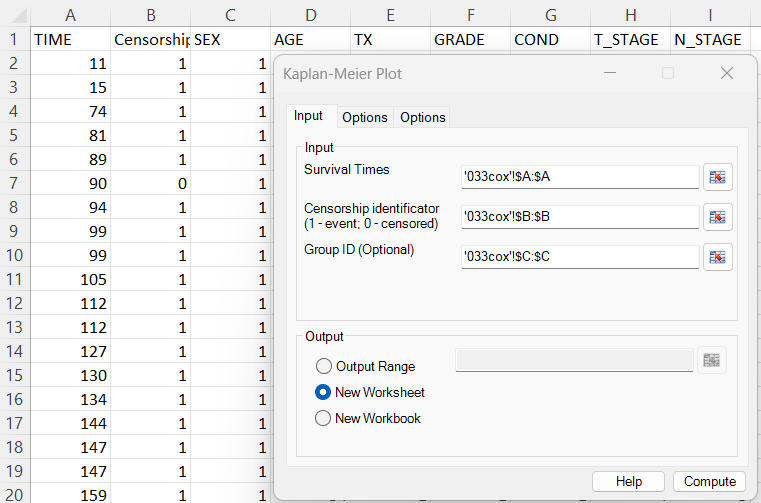
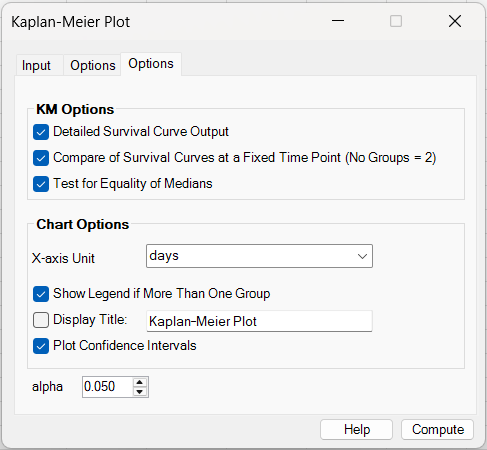
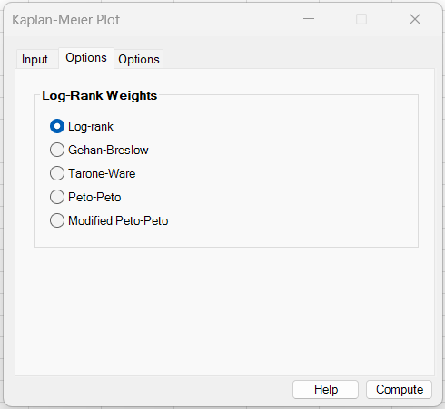
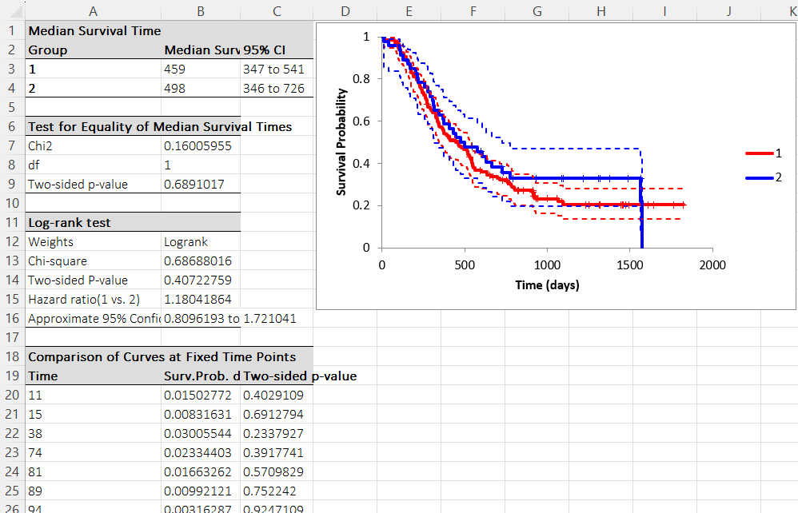
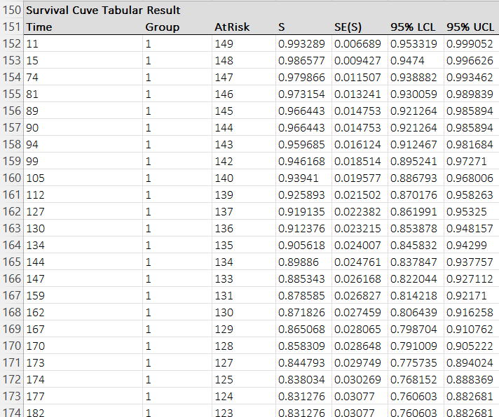

# Kaplan-Meier Plot

**Includes:** Kaplan–Meier survival estimate, optional confidence bands at a user-selected level (default 95%), optional detailed tabular curve output, weighted log-rank tests, hazard ratio (2 groups), Brookmeyer–Crowley median CI and median-equality test, fixed-time comparisons.  
**Purpose:** Plot survival over time and summarize survival probabilities (with censoring) for one or multiple groups.

---

## Overview

BESHStatNG implements Kaplan–Meier (KM) survival curves for one or multiple groups and can additionally compute:

- **Confidence bands at a user-selected level** using a transformation method (default 95%),
- **Log-rank / weighted log-rank tests** (logrank, Gehan–Breslow, Tarone–Ware, Peto–Peto, Modified Peto–Peto),
- **Median survival time** with a Brookmeyer–Crowley style confidence interval,
- **Test for equality of medians** (Brookmeyer–Crowley median test as implemented),
- **Comparison of curves at fixed time points** via a log(−log) transform test at each event time,
- **Tabular KM output** (time, at risk, S(t), SE, confidence limits) suitable for reporting.

---

## Example dataset

In the screenshots, the first 3 columns from this file were used:

- **TIME** (survival time)
- **Censorship** (1 = event, 0 = censored)
- **SEX** (group indicator)

Download:

- [033cox.csv](../assets/data/033cox/033cox.csv)

---

## Screenshots


### Input tab


### Options tab (KM + outputs)


### Options tab (log-rank weights)


### Results (summary tables + plot)


### Results (detailed KM table)


---

## When to use it

Use Kaplan–Meier when you have **time-to-event** data with possible **right censoring**, e.g.:

- time to death, relapse, failure, discharge,
- subjects that have not yet experienced the event by the end of follow-up.

Requirements:

- time values must be numeric and non-negative,
- censorship indicator must be **0/1** (BESHStatNG expects **1 = event**, **0 = censored**),
- group variable is optional, but required for curve comparisons.

---

## Inputs in Excel

### Survival times
A single column range with survival times:

- Example: `'033cox'!$A:$A`

### Censorship indicator
A single column range with 0/1:

- 1 = event occurred
- 0 = censored

Example: `'033cox'!$B:$B`

### Group ID (optional)
A single column range identifying groups (e.g., SEX = 1/2):

Example: `'033cox'!$C:$C`

If Group ID is omitted, BESHStatNG fits **one KM curve**.

### Output destination
- Output range (current sheet)
- New worksheet
- New workbook

---

## Steps in the add-in

1. Ribbon: **BESH Stat NG → Analyse → Graphics → Kaplan-Meier Plot**
2. In **Input**:
   - Select **Survival Times**
   - Select **Censorship indicator**
   - Optionally select **Group ID**
3. In **Options**:
   - Choose which outputs to compute
   - Set plot options (title, confidence bands, legend)
   - Set **Alpha** for confidence intervals and the 2-group hazard-ratio interval
4. In **Options (Log-Rank Weights)**:
   - Choose weighting scheme for the log-rank test
5. Click **Compute**

---

## What it does (math and implementation details)

### A) Kaplan–Meier estimator

Let event times be ordered: \( t_1 < t_2 < \dots \).  
At each event time \(t_j\):

- \(n_j\) = number **at risk just before** \(t_j\)
- \(d_j\) = number of **events** at \(t_j\)

Kaplan–Meier survival estimate:

$$
\hat{S}(t) = \prod_{t_j \le t}\left(1 - \frac{d_j}{n_j}\right)
$$

**Ties:** internally records are sorted by time; at tied times, **events are processed before censoring**.

---

### B) Greenwood standard error

Greenwood variance estimate:

$$
\mathrm{Var}\left[\hat{S}(t)\right]
=
\hat{S}(t)^2
\sum_{t_j \le t}
\frac{d_j}{n_j\,(n_j-d_j)}
$$

Standard error:

$$
\mathrm{SE}\left[\hat{S}(t)\right]
=
\sqrt{\mathrm{Var}\left[\hat{S}(t)\right]}
$$

BESHStatNG reports **SE(S)** and also uses it in multiple downstream computations.

---

### C) Confidence bands at level \(1-\alpha\)

BESHStatNG uses a **transformation method** based on a “log-SE” quantity computed cumulatively:

$$
\mathrm{logSE}(t)
=
\frac{
\sqrt{\sum_{t_j \le t}\frac{d_j}{n_j(n_j-d_j)}}
}{
-\sum_{t_j \le t}\log\!\left(\frac{n_j-d_j}{n_j}\right)
}
$$

Then the confidence limits are computed as:

$$
\mathrm{LCL}(t) = \hat{S}(t)^{\exp\left(z_{1-\alpha/2}\,\mathrm{logSE}(t)\right)}
$$

$$
\mathrm{UCL}(t) = \hat{S}(t)^{\exp\left(-z_{1-\alpha/2}\,\mathrm{logSE}(t)\right)}
$$

where \(z_{1-\alpha/2}\) is the two-sided standard normal critical value.

In the current dialog, **Alpha** is user-selectable. The default is \(\alpha=0.05\), which gives 95% confidence bands.

This matches the confidence-limit curves shown as dashed lines in the chart output.

---

### D) Median survival time and confidence interval

**Median survival time** is taken as the **first time** where:

$$
\hat{S}(t) \le 0.5
$$

BESHStatNG then uses the standardized quantity at event times:

$$
Z(t) = \frac{\hat{S}(t) - 0.5}{\mathrm{SE}(\hat{S}(t))}
$$

and uses threshold crossings at \(\pm z_{1-\alpha/2}\) to determine confidence-limit bounds.

In the current dialog, **Alpha** is user-selectable. The default is \(\alpha=0.05\), so the reported median interval is 95% by default.

If the curve never drops below 0.5, BESHStatNG reports **#N/A** (median not reached).

**Step-function reporting note:** KM curves are step functions. For the upper confidence limit, the “right-edge plateau” is used, so the reported CI time corresponds to the **largest time on the plateau** (same survival level). For the lower confidence limit, the left edge of the step is reported.

---

### E) Test for equality of medians (optional)

When enabled, BESHStatNG computes a multi-group test based on Brookmeyer–Crowley methodology using the pooled KM median and group-wise pseudo-count construction, returning a chi-square statistic and p-value.

(If you only need curve comparison, use the log-rank test: [Logrank Test](logrank-test.md).)

---

### F) Hazard ratio (2-group case)

When there are exactly **two groups**, BESHStatNG reports an **O/E log-rank style hazard ratio**, consistent with software that reports O/E-based HR.

See details and formulas here: **[Logrank Test](logrank-test.md)**

---

### G) Comparison of curves at fixed time points (2 groups)

BESHStatNG compares the two curves at each distinct event time \(t\) using a **log(−log)** transform:

Define:

$$
g(S) = \log\!\big(-\log(S)\big)
$$

Using Greenwood SE, define the relative variance term:

$$
R(S) = \left(\frac{\mathrm{SE}(S)}{S}\right)^2
$$

Delta-method variance for \(g(S)\) used in BESHStatNG:

$$
\mathrm{Var}\big(g(S)\big) \approx \frac{R(S)}{\left(\log(S)\right)^2}
$$

Then at each valid time \(t\) (where both groups have defined \(S(t)\) and SE):

$$
\chi^2(t) =
\frac{\left[g(S_1(t)) - g(S_2(t))\right]^2}
{
\mathrm{Var}(g(S_1(t))) + \mathrm{Var}(g(S_2(t)))
}
$$

with p-value from \(\chi^2\) distribution with 1 df:

$$
p(t) = 1 - F_{\chi^2(1)}(\chi^2(t))
$$

The output table also reports the raw difference:

$$
S_1(t) - S_2(t)
$$

**Note:** No multiple-testing correction is applied across time points (exploratory output).

---

## Options (what each checkbox does)

### KM Options
- **Detailed Survival Curve Output**  
  Writes a long table for each group containing time, at risk, \(S(t)\), SE, and confidence limits at the selected level.

- **Compare of Survival Curves at a Fixed Time Point (No Groups = 2)**  
  Produces the fixed-time comparison table described above.

- **Test for Equality of Medians**  
  Runs the Brookmeyer–Crowley median test and outputs Chi2/df/p-value.

- **Alpha**  
  Controls the two-sided confidence level used for Kaplan–Meier confidence bands, Brookmeyer–Crowley median intervals, and the 2-group hazard-ratio interval.  
  Default: **0.05** (95% confidence interval).

### Chart Options
- **X-axis Unit**  
  Only affects axis label (e.g., days).

- **Show Legend if More Than One Group**  
  Adds legend labels (group IDs).

- **Display Title** + title text  
  Adds chart title.

- **Plot Confidence Intervals**  
  Adds dashed confidence-limit curves computed from the transformation method at the selected alpha level.

### Log-Rank Weights
Select the weighting scheme used for the log-rank test output.

---

## Output (what BESHStatNG writes)

Depending on selected options, BESHStatNG can output:

### 1) Summary tables + plot (typical)
This includes:

- Median survival time (with confidence interval at the selected level)
- Test for equality of medians (Chi2, df, p)
- Log-rank test results (weight type, Chi-square, p)
- Hazard ratio (2 groups only) with approximate confidence interval at the selected level
- Fixed-time comparison table (if enabled)
- KM plot with optional confidence bands and censor markers

See:


### 2) Detailed KM curve table (optional)
For each group and each distinct time point retained:

- **Time**
- **Group**
- **AtRisk**
- **S** Survivor Function
- **SE(S)**
- **LCL / UCL at the selected level**  
  For example, **95% LCL / 95% UCL** when \(\alpha=0.05\), or **90% LCL / 90% UCL** when \(\alpha=0.10\).

See:


---

## How to interpret (quick guide)

- A **higher** curve means **better survival** (higher probability of not having the event yet).
- Big steps down occur where events happen.
- Censor markers indicate subjects that left follow-up before the event.
- If confidence bands for two groups overlap strongly, differences may be small (but use log-rank p-value for inference).
- Use different log-rank weights if you expect differences early vs late in follow-up:
  - Gehan–Breslow / Tarone–Ware emphasize earlier times (larger risk sets)
  - Peto-type weights emphasize earlier differences through survival-based weighting

---

## Relationship to R (how to reproduce)

### Kaplan–Meier curve and CI
In R (package `survival`):

```r
library(survival)

dat <- read.csv("033cox.csv")
# BESHStatNG uses: 1=event, 0=censored
fit <- survfit(Surv(TIME, Censorship) ~ factor(SEX), data = dat)

plot(fit, conf.int = TRUE, xlab = "Time (days)", ylab = "Survival probability")
summary(fit)$table   # includes median and CI (when median is reached)
```

R uses Greenwood variance for standard errors, and offers multiple CI types via `conf.type`
(e.g., `"plain"`, `"log"`, `"log-log"`). BESHStatNG’s CI curves use a transformation method based on a `“logSE”` quantity (see the CI formulas earlier on this page).

###Log-rank test

Classic log-rank in R:

```r
survdiff(Surv(TIME, Censorship) ~ factor(SEX), data = dat, rho = 0)
```

For Peto–Peto–style weighting, `survdiff` can be used with `rho = 1` (note: exact weighting conventions can differ by implementation):

```r
survdiff(Surv(TIME, Censorship) ~ factor(SEX), data = dat, rho = 1)
```

Other weighted log-rank variants (Gehan–Breslow, Tarone–Ware, modified Peto) are available in R through additional packages (e.g., `survMisc`, `coin`, or related survival testing utilities). BESHStatNG provides these weights directly in the UI.
For implementation details (weights, variance, HR), see:
- **[Logrank Test](logrank-test.md)**

###Fixed-time comparisons

R can extract survival probabilities at specified times using `summary(fit, times=...)`:

```r
# Example: survival estimates at chosen time points
summary(fit, times = c(100, 250, 500))
```

BESHStatNG additionally computes a per-time chi-square test on a log(−log) scale (exploratory; no multiplicity correction).

## Notes and limitations

- **If a group contains only censored observations (no events)**, the log-rank test is skipped (expected events are zero and variance becomes singular).
- Median survival time may be undefined if the KM curve never drops below 0.5 (BESHStatNG outputs `#N/A`).
- Fixed-time p-values are exploratory and not corrected for multiple testing across times.
- Interpretation depends on correct coding of censorship: **1 = event**, **0 = censored**.

---

## References

- Brookmeyer R., Crowley J. A confidence interval for the median survival time. Biometrics 1982;38:29-41.
- Brookmeyer R., Crowley J. A k-Sample Median Test for Censored Data. Journal of the American Statistical Association, Vol. 77, No. 378 (1982), 433-440.
- Greenwood M. The natural duration of cancer. Reports on Public Health and Medical Subjects. London: Her Majesty's Stationery Office 1926;33:1-26.
- Kalbfleisch J.D., Prentice R.L. Statistical Analysis of Failure Time Data. New York: Wiley 1980.
- Kaplan E.L., Meier P. Nonparametric estimation from incomplete observations. Journal of the American Statistical Association 1958;53:457-481.
- Klein J.P., Logan B., Harhoff M. and Andersen P.K. Analyzing survival curves at a fixed point in time. Statist. Med. 2007; 26:4505–4519.

## See also

- [Cox Proportional Hazards Model](cox-regression.md)
- [Logrank Test](logrank-test.md)
- [Home](../index.md)
