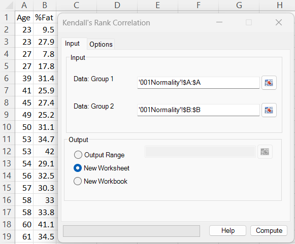
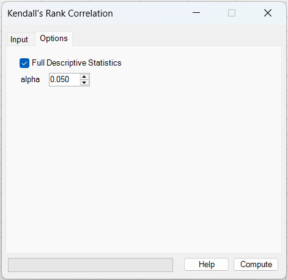
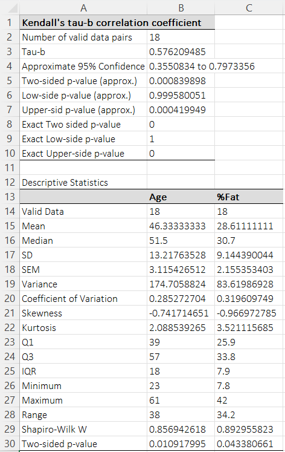

# Kendall's Rank Correlation

**Includes:** Kendall’s \(\tau_b\), p-value / CI where applicable.  
**Purpose:** Measure ordinal association between two variables, with good behavior under ties and small samples.

---

## Overview

Kendall’s rank correlation (\(\tau\)) measures the strength and direction of a **monotonic** relationship between two variables based on **pairwise order agreement**.

Compared to Spearman’s \(\rho\), Kendall’s \(\tau\) often has a more direct interpretation:

- \(\tau\) is proportional to the difference between the probability of concordance and discordance.

BESHStatNG reports **Kendall’s \(\tau_b\)**, which includes a tie adjustment.

---

## Example dataset

In the screenshots, the full dataset below was used (two columns):

- **Age**
- **%Fat**

Download:

- [001Normality.csv](../assets/data/001normality/001Normality.csv)

---

## Screenshots

### Input tab


### Options tab


### Results


---

## When to use it

Use Kendall’s \(\tau\) when:

- your data are ordinal or contain many ties,
- you want a rank-based measure with a clear probabilistic interpretation,
- sample sizes are small to moderate and you prefer a robust association test.

Notes:

- Kendall’s \(\tau_b\) explicitly adjusts for ties.
- Missing values are handled by **pairwise deletion** (rows with missing \(X\) or \(Y\) are excluded).

---

## Inputs in Excel

- **Data: Group 1** – first variable (single column).
- **Data: Group 2** – second variable (single column).

Output destination:

- Output range (current sheet)
- New worksheet
- New workbook

Options:

- **Full Descriptive Statistics** – adds a descriptive table for each variable (mean, median, SD, quartiles, Shapiro–Wilk, etc.).
- **Alpha** – two-sided significance level used for the approximate confidence interval.  
  Default: **0.05** (95% confidence interval)

---

## Steps in the add-in

1. Ribbon: **BESH Stat NG → Analyse → Nonparametric → Kendall's Rank Correlation**
2. In **Input**:
   - Select **Group 1** and **Group 2** data ranges.
   - Choose output destination.
3. In **Options** (optional):
   - Enable **Full Descriptive Statistics**
   - Set **Alpha** for the approximate confidence interval
4. Click **Compute**.

---

## Output

The results sheet reports:

- **Number of valid data pairs** (\(n\))
- **Tau-b** (Kendall’s \(\tau_b\))
- **Approximate CI at the selected level** (default \(\alpha=0.05\), i.e. 95%)
- **Approximate p-values** (two-sided, lower-side, upper-side)
- **Exact p-values** (two-sided, lower-side, upper-side) when available

Interpretation:

- \(\tau\) close to **+1**: strong increasing monotonic association
- \(\tau\) close to **−1**: strong decreasing monotonic association
- p-value assesses evidence against \(H_0: \tau = 0\)

---

## What it does (math and implementation details)

### A) Concordant and discordant pairs

For all pairs \((i, j)\) with \(i < j\):

- **Concordant** if \((x_i - x_j)(y_i - y_j) > 0\)
- **Discordant** if \((x_i - x_j)(y_i - y_j) < 0\)
- **Ties** occur when \(x_i = x_j\) or \(y_i = y_j\).

Let:

- \(C\) = number of concordant pairs
- \(D\) = number of discordant pairs
- \(T_x\) = number of pairs tied only in \(X\)
- \(T_y\) = number of pairs tied only in \(Y\)

### B) Kendall’s \(\tau_b\)

BESHStatNG reports \(\tau_b\):

$$
\tau_b = \frac{C - D}{\sqrt{(C + T_x)(C + T_y)}}
$$

This reduces to \(\tau\) without tie adjustment when there are no ties.

### C) Approximate p-values (normal approximation)

BESHStatNG computes an approximate z-statistic:

$$
Z = \frac{\tau_b}{\sqrt{\frac{4n + 10}{9n(n - 1)}}}
$$

Two-sided p-value:

$$
p = 2\,\big(1 - \Phi(|Z|)\big)
$$

where \(\Phi\) is the standard normal CDF.

### D) Exact p-values (tie-aware; computed by BESHStatNG)

BESHStatNG can also report an additional p-value in the “Exact … p-value” rows:

- for **\(n \le 10\)**, it enumerates permutations to obtain a permutation p-value;
- for **moderate \(n\)** without ties in the permuted variable, it uses a Best & Roberts (1975) / Algorithm AS 89 style approximation (This is a standard large-sample approximation for Kendall’s \(\tau\). Small differences versus other software can occur due to tie-handling details and two-sided p-value conventions.).

If the exact/AS89 computation is not available for the input, the table shows **NE**.

### E) Approximate confidence interval at level \(1-\alpha\) (normal approximation; tie-adjusted)

BESHStatNG computes a standard error for \(\tau\) using an asymptotic variance formula with tie adjustment, then forms the interval as

$$
\tau_{L,U} = \tau_b \pm z_{1-\alpha/2}\,\mathrm{SE}(\tau_b).
$$

In the current dialog, **Alpha** is user-selectable. The default is \(\alpha=0.05\), so the reported interval is an **approximate 95% CI** unless changed.

Small differences versus other software may occur because several equivalent (and valid) tie-adjusted variance conventions are used in practice.

!!! note "Why results may differ slightly across software"
    For Kendall’s \(\tau\), small differences between software can occur because there are multiple valid conventions:
    
    - different \(\tau\) variants (e.g. \(\tau_a\) vs tie-adjusted \(\tau_b\)),
    - different definitions of “exact” p-values when ties are present,
    - different two-sided p-value conventions for discrete statistics,
    - and different (but valid) asymptotic variance formulas used to form confidence intervals under ties.

---

## Relation to Spearman’s \(\rho\) and Theil–Sen regression

Spearman’s \(\rho\) and Kendall’s \(\tau\) are both rank-based association measures:

- **Kendall (\(\tau\))** is based on concordance and is often preferred when there are many ties or when interpretability matters.
- **Spearman (\(\rho\))** is the Pearson correlation of ranks and is sometimes slightly more sensitive to strong monotonic trends.

If you want a **robust slope estimate** (effect size in original units), consider **Theil–Sen simple regression**, which estimates the slope as the median of pairwise slopes.

Links:

- [Spearman Rank Correlation](spearman-rank-correlation.md)
- [Theil-Sen Simple Regression](theil-sen-simple-regression.md)

---

## R reference code

```r
# Kendall rank correlation (R)

d <- read.csv("001Normality.csv")

x <- d$Age
y <- d$`%Fat`

# Kendall tau (R reports tau; with ties, tau-b is typically used)
cor.test(x, y, method = "kendall")

# If you want tau-b explicitly (ties adjusted), many users rely on a package
# such as DescTools:
# DescTools::KendallTauB(x, y)

# The add-in's normal-approximation p-value uses a specific z approximation.
# If you want to match that calculation, you can compute tau-b and then:
# z <- tau_b / sqrt((4*n + 10)/(9*n*(n-1)))
# p <- 2*(1 - pnorm(abs(z)))
```

### Why R may differ slightly from BESHStatNG

- R’s `cor.test(..., method = "kendall")` may use a different variance approximation and can return a p-value that differs slightly from the add-in’s \(Z\) approximation.
- “Exact” p-values may not be provided by base R in the presence of ties; BESHStatNG reports a separate “Exact … p-value” line when its exact/permutation or AS89-style computation is available (as implemented).
- Confidence intervals can differ depending on method; the add-in uses an SE-based normal-approximation interval with tie adjustment. In the current dialog this is reported at the user-selected level; the default is an approximate 95% CI because \(\alpha=0.05\).

---

## Notes

- If either variable has zero variance (all equal), \(\tau_b\) is reported as 0.
- The descriptive statistics table follows the same conventions as [Descriptive Statistics](descriptive-statistics.md) (quartiles follow the project’s standard percentile definition).

---

## See also

- [Spearman Rank Correlation](spearman-rank-correlation.md)
- [Theil-Sen Simple Regression](theil-sen-simple-regression.md)
- [Home](../index.md)

