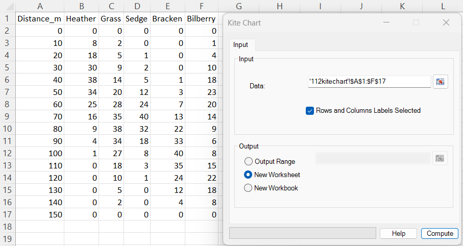
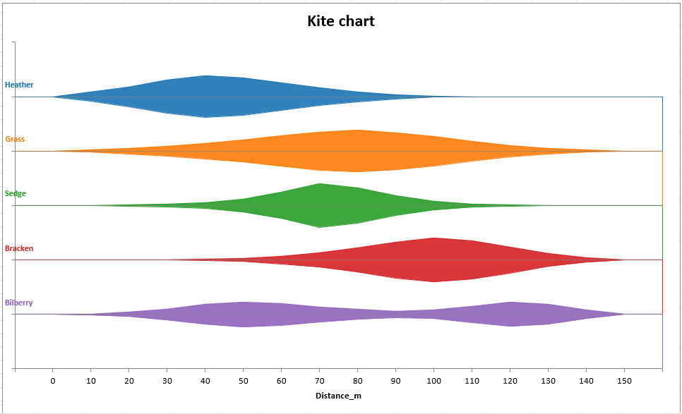

# Kite Chart

**Includes:** Symmetric multi-series kite diagrams, one-range data selection, optional row and column labels, common scaling across series, missing-value gaps, automatic zero-width endpoints, direct series labels, and selectable chart destination.  
**Purpose:** Compare how several nonnegative quantities change across an ordered sequence of positions, distances, depths, dates, or other categories.

---

## Overview

A **kite chart** (also called a **kite diagram**) displays each data series as a filled, symmetric band around its own horizontal centre line. At every horizontal position:

- the **horizontal location** identifies the ordered position or category;
- the **full vertical width** of the kite represents the observed value;
- a zero value narrows the kite to its centre line;
- larger values create a wider section of the kite.

BESHStatNG places the series in separate horizontal lanes and uses one common scale for all kite widths. Widths can therefore be compared both within a series and between different series.

Rows in the selected worksheet range represent ordered positions. Numeric data columns represent the separate kites. When labels are included, the first row supplies the series names and the first column supplies the horizontal-axis labels.

The chart is created directly as an embedded Excel area chart. BESHStatNG calculates the upper and lower symmetric boundaries internally, so no worksheet helper columns are required.

---

## When to use it

Use a kite chart when you want to compare several nonnegative profiles along the same ordered sequence, for example:

- species abundance or percentage cover along an ecological transect;
- pollen, sediment, or fossil counts across depth or stratigraphic layers;
- measurements taken at successive sampling locations;
- counts or intensities over ordered time points;
- composition profiles across distance, altitude, age, or dose;
- several related variables whose peaks and ranges should be compared visually.

A kite chart is especially useful for identifying:

- where each series first appears and disappears;
- the position and width of major peaks;
- overlap or separation between profiles;
- gradual transitions and abrupt changes;
- secondary peaks or multimodal patterns.

The horizontal order must be meaningful. Do not use a kite chart merely because the worksheet rows happen to be in an arbitrary order.

!!! note
    A kite chart is a visualization. It does not test differences between series, estimate uncertainty, smooth the values, or calculate areas under the profiles.

---

## Example dataset

Download the sample CSV used in the screenshots:

- [112kitechart.csv](../assets/data/112kitechart/112kitechart.csv)

The file contains 16 positions along a hypothetical 150-metre transect and five vegetation-abundance profiles:

| Column | Contents | Use in the dialog |
|---|---|---|
| **Distance_m** | Positions from 0 to 150 metres | Row labels and horizontal-axis title |
| **Heather** | Abundance profile with an early peak | Kite series |
| **Grass** | Broad middle-transect profile | Kite series |
| **Sedge** | Narrow peak around 70 m | Kite series |
| **Bracken** | Later peak around 100 m | Kite series |
| **Bilberry** | Two broader local peaks | Kite series |

The largest value in the complete table is 40. Because the current dialog uses common-maximum scaling, values of 40 receive the maximum kite width and every other width is proportional to its value relative to 40.

The principal profile maxima are:

| Series | Maximum | Position |
|---|---:|---:|
| Heather | 38 | 40 m |
| Grass | 38 | 80 m |
| Sedge | 40 | 70 m |
| Bracken | 40 | 100 m |
| Bilberry | 23 | 50 m |

Bilberry also has a second local peak of 22 at 120 m.

---

## Worked example

### Input and dialog settings

Open `112kitechart.csv` in Excel and select the complete range `A1:F17`.

Use these settings:

| Setting | Value |
|---|---|
| Data | `A1:F17` |
| Rows and Columns Labels Selected | Selected |
| Output | **New Worksheet** |

With the label option selected:

- `Distance_m` becomes the horizontal-axis title;
- the remaining cells in the first row become the five kite labels;
- values in the first column become the horizontal category labels;
- the numeric body `B2:F17` supplies the kite widths.

Click **Compute**.

### Output

The resulting plot shows a clear progression along the transect:

- Heather is concentrated near the beginning and reaches its maximum around 40 m.
- Grass increases more gradually and peaks around 80 m.
- Sedge has the narrowest and most pronounced central peak, around 70 m.
- Bracken becomes dominant later and reaches its maximum around 100 m.
- Bilberry has a broader two-peak pattern, with maxima around 50 m and 120 m.

Sedge and Bracken reach the common maximum of 40, so their widest sections have the same plotted width. Heather and Grass peak at 38 and are therefore slightly narrower. Bilberry's maximum is 23, so its profile remains visibly narrower under common scaling.

These observations describe the supplied example values only. They do not establish statistical differences or ecological associations.

---

## Required data layout

Select one continuous rectangular range. The same selection can include both labels and numeric data.

### Layout with row and column labels

When **Rows and Columns Labels Selected** is selected, use this structure:

| Position | Series A | Series B | Series C |
|---|---:|---:|---:|
| Position 1 | 4 | 8 | 2 |
| Position 2 | 7 | 3 | 6 |
| Position 3 | 2 | 9 | 5 |

The cells are interpreted as follows:

| Part of selection | Interpretation |
|---|---|
| Upper-left cell | Horizontal-axis title |
| Remaining cells in first row | Series names |
| Remaining cells in first column | Position or category labels |
| Numeric body | Nonnegative values used to calculate kite widths |

The selected range must contain at least:

- one heading row;
- one row-label column;
- two data rows;
- one numeric data series.

### Layout without labels

When **Rows and Columns Labels Selected** is cleared, every selected cell is treated as data:

| Series 1 | Series 2 | Series 3 |
|---:|---:|---:|
| 4 | 8 | 2 |
| 7 | 3 | 6 |
| 2 | 9 | 5 |

BESHStatNG then generates:

- series names `Series 1`, `Series 2`, and so on;
- horizontal labels `1`, `2`, `3`, and so on;
- the horizontal-axis title **Position**.

The selected data-only range must contain at least two rows and one column.

!!! important "The label setting is explicit"
    BESHStatNG does not automatically infer whether the first row or first column contains labels. Select the checkbox only when both a heading row and a row-label column are included.

### Value requirements

- Data values must be nonnegative.
- At least one positive value is required somewhere in the selected matrix.
- Zeros are valid and narrow the corresponding kite to its centre line.
- Blank or nonnumeric cells in the numeric body are treated as missing values and create gaps.
- Positive decimal values and counts are both supported.
- Negative and infinite values are rejected.

Rows retain their worksheet order. BESHStatNG does not sort the positions before drawing the chart.

!!! warning "Numeric position labels are category labels"
    The Excel area chart uses an equally spaced category axis. Numeric labels such as `0`, `10`, `20`, and `30` are displayed as labels, not as measured X coordinates. Unequally spaced values such as `0`, `1`, `10`, and `100` will still appear at equal horizontal distances.

---

## Dialog: inputs and output

### Data

Select the complete rectangular table using the RefEdit control. The range must be one continuous area.

The selection may be on any worksheet in the active workbook. All values, row labels, and column labels must come from the same selected rectangle.

### Rows and Columns Labels Selected

- **Selected** — interpret the first row as column headings and the first column as row labels.
- **Cleared** — interpret the entire range as numeric data and generate labels automatically.

The checkbox is selected by default for Kite Chart.

### Output Range

Creates the chart on the worksheet containing the selected output cell. The chart's upper-left corner is anchored at the first cell of the selected output range.

The output RefEdit becomes available only when **Output Range** is selected.

### New Worksheet

Creates a new worksheet in the source workbook and places the chart at cell `A1`. This is the default output option.

### New Workbook

Creates a new workbook and places the chart at cell `A1` on its active worksheet.

---

## Steps in the add-in

1. In the Excel ribbon, select **BESH Stat NG → Analyse → Graphics → Kite Chart**.
2. Select one continuous rectangular **Data** range.
3. Keep **Rows and Columns Labels Selected** selected when the first row and first column contain labels; otherwise clear it.
4. Choose **Output Range**, **New Worksheet**, or **New Workbook**.
5. When using **Output Range**, select the destination cell or range.
6. Click **Compute**.

---

## Output

BESHStatNG creates an embedded Excel area chart containing:

- one filled symmetric kite for each numeric data column;
- one horizontal centre line for each kite;
- an outline around each filled profile;
- a direct series label at the left of each lane;
- horizontal category labels obtained from the first column or generated automatically;
- a horizontal-axis title obtained from the upper-left heading or set to **Position**;
- automatic distinct colours for successive series.

The current chart title is **Kite chart**. The legend is hidden because the series names are written directly beside the kite lanes.

The chart is created at approximately 720 × 440 points. It is a standard Excel chart and can be moved, resized, formatted, copied, or exported after creation. See [Export Chart](../export-chart.md) for high-resolution image export.

---

## What it does: calculations and scaling

Let:

- \(x_{ij}\) be the nonnegative value at position \(i\) for series \(j\);
- \(m\) be the number of series;
- \(s\) be the distance between adjacent lane centre lines;
- \(f\) be the maximum full-width fraction of one lane.

The current ribbon dialog uses:

$$
s=1,
\qquad
f=0.8.
$$

### 1. Preserve the source order

Rows remain in their selected worksheet order. Each data column becomes one kite, and the column order determines the vertical order of the lanes:

- the first numeric column is displayed at the top;
- the final numeric column is displayed at the bottom.

### 2. Find the common maximum

The current dialog uses linear values and one common maximum across all series:

$$
M=\max_{i,j} x_{ij}.
$$

This makes widths comparable between different kites. A value that is half of the overall maximum receives half of the maximum plotted width, regardless of which series contains it.

### 3. Calculate the symmetric half-width

The largest permitted half-width is

$$
h_{\max}=\frac{sf}{2}.
$$

With the current defaults,

$$
h_{\max}=\frac{1\times0.8}{2}=0.4.
$$

For a finite observation, the plotted half-width is

$$
h_{ij}=h_{\max}\frac{x_{ij}}{M}.
$$

If the centre line for series \(j\) is \(c_j\), the two boundaries are

$$
y_{ij}^{\mathrm{upper}}=c_j+h_{ij},
\qquad
y_{ij}^{\mathrm{lower}}=c_j-h_{ij}.
$$

The full kite width is therefore \(2h_{ij}\) and is directly proportional to the source value.

### 4. Add zero-width endpoints

BESHStatNG adds one blank category before the first selected position and one after the last selected position. At both added categories, the upper and lower boundaries meet at the centre line.

This closes each filled area cleanly and causes a nonzero first or last observation to taper to zero just outside the displayed source range. The added endpoints do not change the source values or add visible horizontal-axis labels.

### 5. Render the filled band

For every series, the renderer creates:

1. a coloured area reaching the upper boundary;
2. a background-coloured masking area reaching the lower boundary;
3. an optional lower outline;
4. a dotted centre line;
5. a one-point helper series carrying the direct series label.

The visible region between the upper and lower boundaries forms the symmetric kite. These helper series exist only inside the Excel chart; no helper values are written to worksheet cells.

---

## Common scaling and alternative backend modes

The ribbon interface currently uses **common-maximum scaling**, which is recommended when absolute magnitudes should be compared between series.

The numerical backend also supports options that are not yet exposed in the Windows dialog:

| Backend option | Effect |
|---|---|
| Per-series maximum | Scales each kite to its own maximum, emphasizing shape but removing between-series magnitude comparison |
| Square-root transform | Reduces the visual dominance of moderately large counts |
| `Log(1 + value)` transform | Compresses strongly right-skewed values |
| Missing value as zero | Narrows a missing observation to zero instead of leaving a gap |
| Alternative lane spacing and maximum width | Changes the separation and relative thickness of the kites |
| Appearance overrides | Changes colours, transparency, outlines, centre lines, labels, gridlines, or legend settings |

!!! important
    A per-series maximum can make a series with small values appear as wide as a series with much larger values. Use common scaling when widths must retain direct between-series comparability.

---

## Missing, invalid, and special values

- A blank or nonnumeric data cell is treated as missing.
- Under the current **Gap** mode, missing observations are not plotted and produce a break in the affected kite.
- A zero is a valid observation and produces zero width without being treated as missing.
- Negative values are rejected because the current geometry represents magnitude by nonnegative width.
- Infinite values are rejected.
- At least two ordered positions and one numeric series are required.
- At least one finite positive observation is required across the complete matrix.
- Duplicate position labels are allowed but may make the horizontal axis ambiguous.
- Duplicate data values are allowed.
- Blank series headings receive automatic names such as `Series 1`.
- Blank row labels receive automatic labels such as `Position 1`.

!!! tip
    Use zero only when the measured quantity was observed to be absent. Leave the cell blank when the value is genuinely unknown or unmeasured; the chart will distinguish the two cases by showing zero width versus a gap.

---

## How to interpret the chart

Interpret the chart by reading width, position, and series together:

- **Wider sections** indicate larger source values.
- **Narrow sections** indicate smaller values.
- A section touching the **centre line** represents zero.
- A **gap** represents a missing value under the current settings.
- The **horizontal position** identifies the ordered source row.
- The **lane label and colour** identify the data column.

Patterns to examine include:

- the position of each maximum;
- the horizontal range over which a series remains nonzero;
- simultaneous peaks in multiple series;
- transitions where one series decreases while another increases;
- broad versus narrow peaks;
- secondary peaks and irregular profiles;
- unexpected isolated values or gaps that may require data checking.

Because one common scale is used, a wider kite section always represents a larger source value than a narrower section, even when the sections belong to different series.

The vertical lane position has no quantitative meaning. It only separates the profiles so they can be compared without overlap.

---

## Kite chart versus related graphics

| Graphic | Main encoding | Typical purpose |
|---|---|---|
| **Kite chart** | Symmetric width around separate centre lines | Compare several nonnegative profiles over the same ordered positions |
| **Line chart** | Vertical coordinate of one or more lines | Show trends and permit more direct reading against a numeric value axis |
| **Stacked area chart** | Cumulative filled areas | Show totals and part-to-whole composition over an ordered axis |
| **Violin plot** | Mirrored estimated distribution density | Compare distributions rather than values at ordered positions |
| **Radar chart** | Values on categorical radial spokes | Compare multivariable profiles around a circular layout |
| **Heat map** | Cell colour | Compare many series and positions compactly when exact profile shape is less important |

A kite chart resembles a series of horizontally oriented violin shapes, but it does not estimate a probability density. Every width comes directly from one source value at one ordered position.

Use a line chart when precise values and a conventional numeric Y axis are more important. Use a heat map when the table contains so many series that separate kite lanes become crowded.

---

## Implementation details and limitations

- Numerical geometry is calculated independently of Excel chart creation.
- Rows are positions and columns are kite series.
- The current ribbon route uses linear values, common-maximum scaling, missing-value gaps, and automatic zero-width endpoints.
- Series remain in worksheet column order and positions remain in worksheet row order.
- The Excel renderer uses an area chart with upper-boundary and masking series.
- Centre lines, outlines, and direct labels are separate helper series within the chart.
- No worksheet helper columns are created.
- The horizontal axis is an Excel category axis, so categories are equally spaced even when the labels are numeric.
- The current interface does not expose scaling, transformation, width, spacing, colour, transparency, gridline, legend, or label-format controls.
- The chart does not display a numeric width axis; read exact values from the source table.
- The vertical position of each lane is arbitrary and should not be interpreted as a measured value.
- The plotted areas are connected by straight category-to-category segments; no interpolation or smoothing model is fitted.
- Common scaling can make small profiles appear very narrow when one series contains much larger values.
- Large numbers of series reduce the vertical space available to each lane and increase the number of Excel chart series.
- Very long category labels can crowd the horizontal axis.
- Direct labels may require manual repositioning after extensive chart resizing or formatting.
- The method does not calculate confidence intervals, trends, smoothing, normalization by row totals, diversity indices, ordination, or hypothesis tests.
- The plot is created through the ribbon; it is not a worksheet UDF.

---

## Common mistakes

- Clearing the labels checkbox while the selected range still includes the heading row and first label column.
- Selecting the labels checkbox for a data-only numeric matrix.
- Selecting several separate ranges instead of one continuous rectangle.
- Placing series in rows and positions in columns; the required orientation is the opposite.
- Supplying negative values.
- Using blanks to mean zero or zeros to mean unknown measurements.
- Assuming unequal numeric position labels are plotted with unequal physical spacing.
- Interpreting the vertical lane order as a quantitative scale.
- Comparing exact values from visual width alone rather than consulting the source table.
- Interpreting the filled area as a probability distribution, confidence region, or cumulative total.
- Using arbitrary row order when the horizontal sequence has no substantive meaning.
- Applying common scaling to series with extremely different magnitudes without considering whether smaller profiles will remain readable.

---

## See also

- [Polar Plot](polar-plot.md)
- [Convex Hull Plot](convex-hull-plot.md)
- [Scatter Plot Matrix](scatter-plot-matrix.md)
- [Box and Whiskers](box-and-whiskers.md)
- [Export Chart](../export-chart.md)
- [Home](../index.md)
