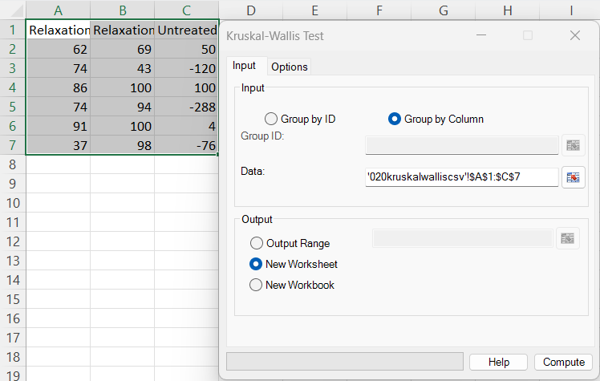
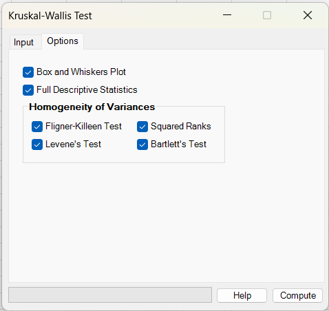
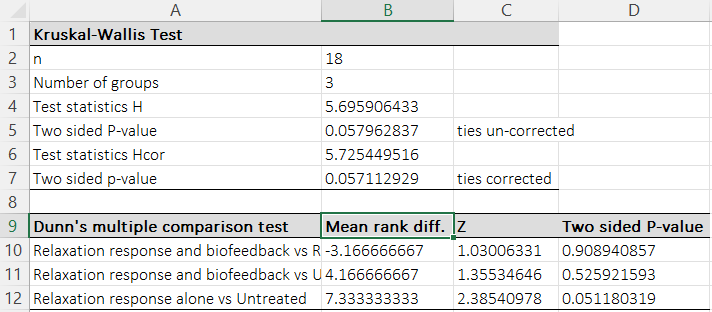
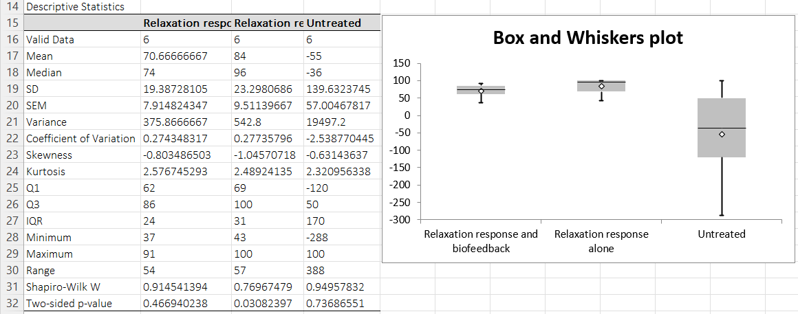
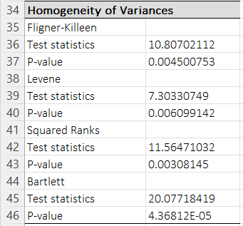

# Kruskal-Wallis Test

**Includes:** H statistic (uncorrected), H statistic (tie-corrected), Dunn’s post-hoc comparisons (Bonferroni), optional boxplot/descriptives, optional homogeneity-of-variance tests.  
**Purpose:** Nonparametric one-way ANOVA alternative for comparing **two or more independent groups**.

---

## Overview

The Kruskal–Wallis test compares **k independent groups** by ranking all observations together and asking whether the groups have systematically different **mean ranks**.

- Works for **continuous** or **ordinal** outcomes.
- Does **not** assume normality.
- With similarly-shaped group distributions, it is often interpreted as a difference in **location** (typical values); more generally, it is a test that at least one group tends to yield **larger/smaller values** than another.

BESHStatNG reports:

- **H** (standard Kruskal–Wallis statistic),
- **H<sub>cor</sub>** (tie-corrected H),
- corresponding **two-sided p-values** (chi-square approximation, df = k − 1),
- optional **Dunn’s multiple comparisons** (pairwise, Bonferroni-adjusted),
- optional **descriptive statistics**, **boxplot**, and **variance-homogeneity tests**.

---

## Example dataset

Download the CSV used in the screenshots:

- [020kruskalwalliscsv.csv](../assets/data/020kruskalwallis/020kruskalwalliscsv.csv)

In the screenshots, the dataset is arranged in **wide format** (each column is a group):

- *Relaxation response and biofeedback*
- *Relaxation response alone*
- *Untreated*

---

## Screenshots (BESHStatNG)

### Input tab


### Options tab


### Results (test + Dunn post-hoc)


### Results (descriptives + boxplot)


### Results (homogeneity of variances)


---

## When to use it

Use the Kruskal–Wallis test when:

- you have **k ≥ 2 independent groups** (different subjects in each group),
- the outcome is **numeric** or at least **ordinal**,
- you want a robust comparison when normality is questionable and/or outliers are present.

Key requirements / considerations:

- **Independence:** observations are independent within and between groups.
- **Similar distribution shapes:** if shapes/spreads differ strongly, interpret the test as “at least one group tends to produce larger values” rather than strictly a median shift.

---

## Inputs in Excel

BESHStatNG uses the shared “**Group by Column / Group by ID**” dialog.

### Option A: Group by Column (wide format)

- Select a **rectangular range** where **each column is one group**.
- If the first row contains text, it is treated as the **group name**.

This is the most common layout for Kruskal–Wallis in Excel.

### Option B: Group by ID (long format)

Use this when you have two columns:

- **Group ID** (labels: A/B/C… or 1/2/3…)
- **Data** (numeric values)

BESHStatNG splits the values by unique group IDs and runs the test.

### Output destination

- Output range (current sheet)
- New worksheet
- New workbook

---

## Options

On the **Options** tab you can add:

- **Full Descriptive Statistics** — summary statistics per group  
  See: [Descriptive Statistics](descriptive-statistics.md)
- **Box and Whiskers Plot** — Tukey boxplot per group  
  See: [Box and Whiskers](box-and-whiskers.md)

### Homogeneity of variances (optional)

You can also compute up to four variance-homogeneity tests:

- Fligner–Killeen
- Levene (median-centered / Brown–Forsythe style)
- Squared Ranks
- Bartlett

These are described in detail here:

- [Homogeneity of Variance](homogeneity-of-variance.md)

---

## Output and how to read it

### Main Kruskal–Wallis table

BESHStatNG writes a “Kruskal-Wallis Test” table containing:

- **n**: total sample size \(N\) across all groups
- **Number of groups**: \(k\)
- **Test statistics H** + **Two sided P-value** (ties un-corrected)
- **Test statistics Hcor** + **Two sided p-value** (ties corrected)

**Example interpretation (from the screenshots):**

- \(H=5.6959\), p = 0.0580 (uncorrected)
- \(H_{cor}=5.7254\), p = 0.0571 (tie-corrected)
- p is close to 0.05 but slightly above, so evidence for a group difference is **suggestive** but not strong at the 5% level.

### Dunn’s multiple comparison table (optional / shown in screenshots)

If post-hoc comparisons are produced, BESHStatNG adds:

- **Mean rank diff.**: difference in mean ranks between each pair of groups
- **Z**: normal approximation statistic for the pairwise comparison
- **Two sided P-value**: Bonferroni-adjusted two-sided p-value

Interpretation:
- A small adjusted p-value (e.g., < 0.05) suggests that **that pair of groups** differs in central tendency (in terms of ranks), controlling the family-wise error rate across all pairwise comparisons.

---

## What it does (math and implementation details)

Let there be \(k\) groups. Group \(j\) has \(n_j\) observations \(x_{j1},\dots,x_{jn_j}\). Let

\[
N=\sum_{j=1}^k n_j.
\]

### A) Ranking (midranks for ties)

Pool all observations and assign ranks \(1,\dots,N\).  
**Ties are given the average rank** (midranks).

Let \(R_j\) be the **sum of ranks** in group \(j\), and \(\bar R_j = R_j/n_j\) the **mean rank**.

### B) Kruskal–Wallis H statistic

\[
H = \frac{12}{N(N+1)} \sum_{j=1}^k \frac{R_j^2}{n_j} - 3(N+1).
\]

Under \(H_0\) (all groups have the same distribution), \(H\) is approximated by a chi-square distribution with \(k-1\) degrees of freedom:

\[
p = 1 - F_{\chi^2(k-1)}(H).
\]

### C) Tie correction

Let the pooled data contain tied groups of sizes \(t_1,t_2,\dots\). Define

\[
T=\sum_{m}(t_m^3-t_m).
\]

BESHStatNG reports the tie-corrected statistic:

\[
H_{cor} = \frac{H}{1-\frac{T}{N^3-N}}.
\]

The p-value is computed as:

\[
p_{cor} = 1 - F_{\chi^2(k-1)}(H_{cor}).
\]

### D) Dunn’s post-hoc comparisons (Bonferroni)

For each pair of groups \(i\) and \(j\), BESHStatNG computes the mean rank difference:

\[
\Delta_{ij} = \bar R_i - \bar R_j
\]

and the Z statistic:

\[
Z_{ij}=\frac{|\Delta_{ij}|}{\sqrt{a\left(\frac{1}{n_i}+\frac{1}{n_j}\right)}},
\]

where the tie-adjusted constant \(a\) is:

\[
a = \frac{N(N+1)}{12} - \frac{T}{12(N-1)}.
\]

Two-sided p-value (normal approximation):

\[
p_{ij} = 2\Phi(-|Z_{ij}|).
\]

BESHStatNG applies **Bonferroni correction** for the number of pairwise comparisons \(m=k(k-1)/2\):

\[
p^{adj}_{ij}=\min(1,\; m\cdot p_{ij}).
\]

---

## R code (reference using standard R functions)

R’s base `kruskal.test()` returns the **tie-corrected** Kruskal–Wallis statistic by default.  
To match BESHStatNG’s output exactly (both uncorrected and corrected H, plus Dunn + Bonferroni), you can compute the components explicitly.

```r
dat <- read.csv("020kruskalwalliscsv.csv")

# Wide format: each column is a group
vals <- c(dat[[1]], dat[[2]], dat[[3]])
grp  <- factor(rep(names(dat), each = nrow(dat)))

# Drop non-finite values (BESHStatNG ignores invalid cells)
ok <- is.finite(vals)
vals <- vals[ok]
grp  <- grp[ok]

k <- nlevels(grp)
N <- length(vals)

# --- Kruskal–Wallis (R default = tie-corrected) ---
kw <- kruskal.test(vals ~ grp)
kw$statistic   # ~= H_cor in BESHStatNG
kw$p.value

# --- Compute both H (uncorrected) and H_cor (tie-corrected) like BESHStatNG ---
r   <- rank(vals, ties.method = "average")
Rj  <- tapply(r,   grp, sum)
nj  <- tapply(vals, grp, length)

H <- (12/(N*(N+1))) * sum((Rj^2)/nj) - 3*(N+1)
p_unc <- pchisq(H, df = k-1, lower.tail = FALSE)

tab <- table(vals)
T <- sum((tab[tab > 1]^3 - tab[tab > 1]))
C <- 1 - T/(N^3 - N)

Hcor <- H / C
p_cor <- pchisq(Hcor, df = k-1, lower.tail = FALSE)

c(H_uncorrected = H, p_uncorrected = p_unc,
  H_corrected   = Hcor, p_corrected = p_cor)

# --- Dunn's multiple comparisons with Bonferroni ---
# Package option 1 (recommended):
# install.packages("FSA")
FSA::dunnTest(vals ~ grp, method = "bonferroni")

# Package option 2:
# install.packages("dunn.test")
dunn.test::dunn.test(vals, grp, method = "bonferroni", kw = FALSE, list = TRUE)

# --- Homogeneity of variances (matches the options panel) ---
fligner.test(vals ~ grp)
bartlett.test(vals ~ grp)

# Levene/Brown-Forsythe (median-centered):
# install.packages("car")
car::leveneTest(vals ~ grp, center = median)

# Squared Ranks test (BESHStatNG-style, implemented directly)
# (See also: BESHStatNG help page "Homogeneity of Variance")
dev <- abs(vals - ave(vals, grp, FUN = mean))
rk  <- rank(dev, ties.method = "average")
u   <- rk^2

Sj <- tapply(u, grp, sum)
ubar <- mean(u)
d <- (sum(u^2) - N * ubar^2) / (N - 1)

X2 <- (sum((Sj^2)/nj) - N * ubar^2) / d
p_sq <- pchisq(X2, df = k-1, lower.tail = FALSE)

c(SquaredRanks_X2 = X2, p_value = p_sq)
```

### Why R results may be slightly different from BESHStatNG

- **Kruskal–Wallis statistic:** `kruskal.test()` reports the **tie-corrected** statistic; BESHStatNG reports **both** uncorrected \(H\) and corrected \(H_{cor}\).  
- **Dunn’s test defaults:** different R packages may use different default p-value adjustments (Holm vs Bonferroni) and may differ slightly in rounding; set `method = "bonferroni"` to match the add-in.
- **Variance homogeneity tests:** implementations match standard definitions; small numeric differences are usually due to rounding and how missing values are removed.

!!! tip "Quartiles in R"
    BESHStatNG uses the **CDF method (SAS Method 5)** for quartiles.  
    To match its \(Q_1\), Median and \(Q_3\) in R, use `quantile(x, probs = c(0.25, 0.5, 0.75), type = 2)`.

---

## Notes

- **Invalid / missing cells:** empty cells, text, logical values, and Excel error values are ignored during data import (only numeric values are used).
- **Post-hoc testing:** Dunn’s test is typically interpreted after a significant (or near-significant) Kruskal–Wallis result, but you may still explore pairwise differences cautiously.
- **Multiple testing:** BESHStatNG uses Bonferroni adjustment for Dunn’s test (controls family-wise error rate; conservative when many groups).

---

## References

- Altman D.G. Practical Statistics for medical research. Chapman & Hall, 1991.
- Dunn O.J. Multiple Comparisons Using Rank Sums. Technometrics, Vol. 6, No. 3 (1964), 241-252.
- Kruskal W.H., Wallis W.A. (1952) Use of Ranks in One-Criterion Variance Analysis. Journal of the American Statistical Association, 47(260), 583-621.
- Kruskal W.H. (1952). A nonparametric test for the several sample problem. Annals of Mathematical Statistics, 23, 525-540.

## See also

- [Mann-Whitney Test](mann-whitney-test.md)
- [Homogeneity of Variance](homogeneity-of-variance.md)
- [Box and Whiskers](box-and-whiskers.md)
- [Descriptive Statistics](descriptive-statistics.md)
