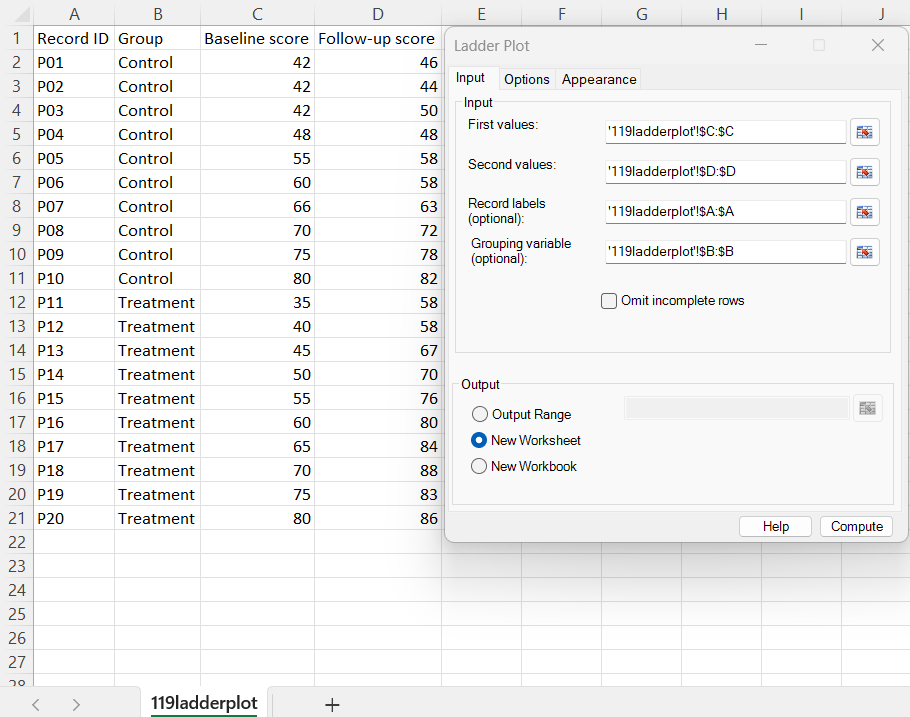
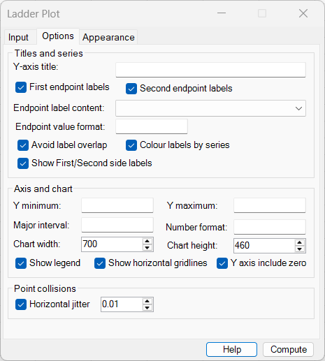
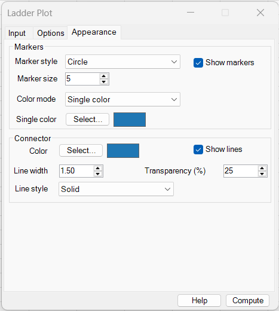
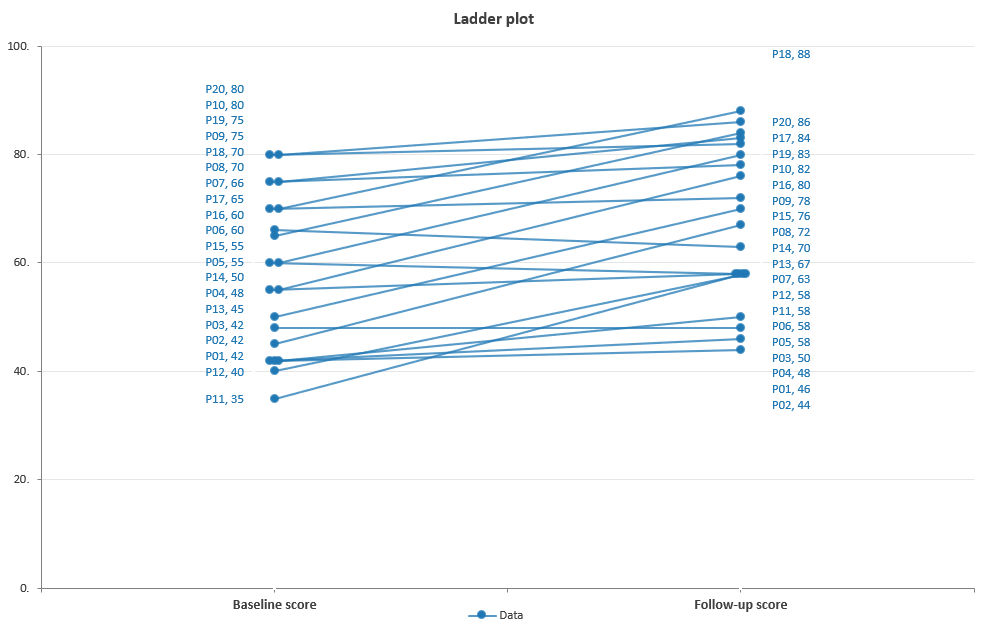
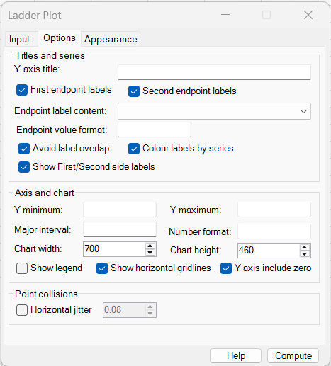
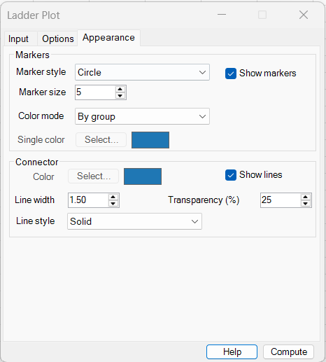
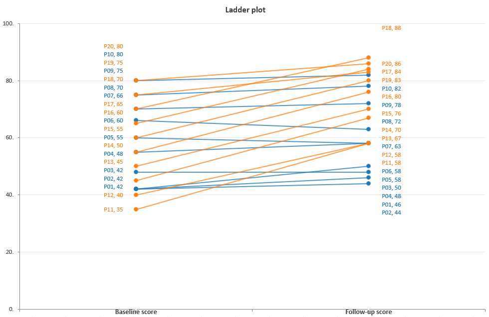
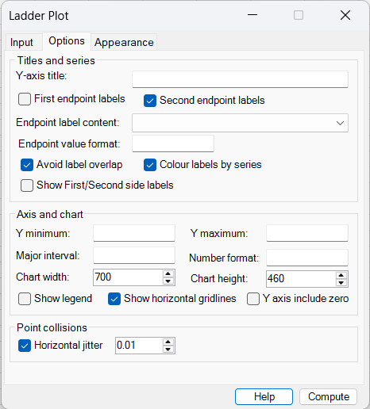
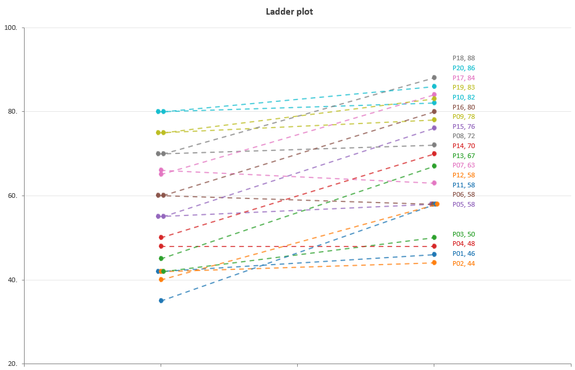

# Ladder Plot

**Includes:** Paired First/Second (for example, Before/After or Baseline/Follow-up) ladder plots, optional record labels, optional grouping, single-colour/by-observation/by-group colouring, connected markers, collision-aware horizontal jitter, independent endpoint labels, automatic label-overlap reduction, automatic "nice" Y-axis intervals, custom Y-axis limits and number formats, horizontal gridlines, and configurable chart size.  
**Purpose:** Show the direction and magnitude of change for paired observations while preserving each individual pair and, when required, distinguishing observations or groups by colour.

---

## Overview

A **ladder plot** displays two paired measurements for every observation. The First value is plotted on the left side of the chart, the Second value on the right, and a line joins the two values:

```text
First / Before                  Second / After
      ●────────────────────────────●
```

Because each row remains a separate connected pair, a ladder plot makes it easy to see:

- which observations increased;
- which observations decreased;
- which observations did not change;
- the magnitude of the within-observation change;
- whether changes follow a common pattern or vary substantially;
- whether different groups show different trajectories.

The two sides are automatically labelled from the selected variable names when column headings are available. For example, selecting columns headed **Baseline score** and **Follow-up score** produces those labels below the left and right sides of the chart.

A ladder plot is closely related to a **slope chart** and a **paired dot plot**. In BESHStatNG it is intended primarily for row-level paired data, such as repeated measurements on the same participants, sites, products, countries, or other observational units.

!!! note
    A Ladder Plot is a descriptive visualization. It shows paired changes but does not itself calculate a paired significance test, confidence interval, or effect size.

---

## When to use it

Use a ladder plot when every retained row contains **two measurements on the same numerical scale** and the pairing between those values is important.

Typical applications include:

- baseline versus follow-up measurements;
- before versus after intervention values;
- paired laboratory measurements;
- pre-test versus post-test scores;
- two visits or time points for the same participant;
- two methods applied to the same observational unit;
- two years for the same country, site, or indicator;
- matched observations where individual trajectories should remain visible;
- paired measurements split into groups such as Control and Treatment.

Compared with bars showing only group means, a ladder plot preserves the individual paired observations. This can reveal patterns that are hidden by summary statistics, such as heterogeneous responses or a small number of strong increases and decreases.

Avoid a ladder plot when:

- the two values are not genuinely paired row by row;
- the two sides use different measurement scales or units;
- there are many measurement occasions rather than only two primary values;
- the number of observations is so large that individual lines form an unreadable mass;
- the primary objective is to display a distribution rather than individual paired trajectories.

---

## Example dataset

The sample dataset used on this page is available here:

[119ladderplot.csv](../assets/data/119ladderplot/119ladderplot.csv)

The dataset contains 20 paired observations:

| Record ID | Group | Baseline score | Follow-up score |
|---|---|---:|---:|
| P01 | Control | 42 | 46 |
| P02 | Control | 42 | 44 |
| P03 | Control | 42 | 50 |
| P04 | Control | 48 | 48 |
| P05 | Control | 55 | 58 |
| P06 | Control | 60 | 58 |
| P07 | Control | 66 | 63 |
| P08 | Control | 70 | 72 |
| P09 | Control | 75 | 78 |
| P10 | Control | 80 | 82 |
| P11 | Treatment | 35 | 58 |
| P12 | Treatment | 40 | 58 |
| P13 | Treatment | 45 | 67 |
| P14 | Treatment | 50 | 70 |
| P15 | Treatment | 55 | 76 |
| P16 | Treatment | 60 | 80 |
| P17 | Treatment | 65 | 84 |
| P18 | Treatment | 70 | 88 |
| P19 | Treatment | 75 | 83 |
| P20 | Treatment | 80 | 86 |

The data were deliberately constructed to contain several useful plotting situations:

- increases and decreases;
- one unchanged pair (P04: 48 to 48);
- several identical Baseline values, including three observations at 42;
- several identical Follow-up values, including four observations at 58;
- two groups with visibly different patterns of change;
- sufficient overlap to demonstrate endpoint-label spreading and horizontal point jitter.

---

## Input settings used in the examples



For all three examples on this page, select:

| Setting | Value |
|---|---|
| First values | `C:C` |
| Second values | `D:D` |
| Record labels (optional) | `A:A` |
| Grouping variable (optional) | `B:B` |
| Omit incomplete rows | Cleared |
| Output | New Worksheet |

Whole-column selections are supported. In this example, the headings **Baseline score** and **Follow-up score** are recognized as variable names and are used for the two visible side labels when **Show First/Second side labels** is selected.

The Record ID column supplies labels such as `P01` and `P18`. The optional Group column supplies the **Control** and **Treatment** levels used by **By group** colouring.

---

## Example 1: single-colour labelled ladder plot

This example emphasizes the individual paired values while keeping the visual styling deliberately simple.

### Options



The example shows labels on both sides and uses automatic label-overlap reduction. The Y-axis limits, major interval, and number format are left blank so that the scale is chosen automatically.

| Setting | Value |
|---|---|
| First endpoint labels | Selected |
| Second endpoint labels | Selected |
| Endpoint label content | Record label + value |
| Endpoint value format | Automatic |
| Avoid label overlap | Selected |
| Colour labels by series | Selected |
| Show First/Second side labels | Selected |
| Y minimum / maximum | Automatic |
| Major interval | Automatic |
| Number format | Automatic |
| Chart width | 700 |
| Chart height | 460 |
| Show legend | Selected |
| Show horizontal gridlines | Selected |
| Y axis include zero | Selected |
| Horizontal jitter | Selected, `0.01` |

### Appearance



| Setting | Value |
|---|---|
| Marker style | Circle |
| Marker size | 5 |
| Show markers | Selected |
| Color mode | Single color |
| Show lines | Selected |
| Line width | 1.50 |
| Transparency | 25% |
| Line style | Solid |

### Output



The chart displays every participant as one connected pair. The labels contain the Record ID and the corresponding value, for example `P18, 88`.

The left and right sides are labelled **Baseline score** and **Follow-up score**, taken directly from the worksheet headings. The horizontal gridlines make it easier to judge values against the common Y scale.

Repeated values are especially visible in this dataset. Horizontal jitter is applied only where endpoint points actually collide, while the measured Y values remain unchanged.

---

## Example 2: colour by group

The second example uses the same paired data but assigns colours according to the Group variable.

### Options



Endpoint labels remain enabled on both sides, but the legend is hidden and horizontal jitter is turned off for this example.

### Appearance



The important setting is:

| Setting | Value |
|---|---|
| Color mode | By group |
| Marker style | Circle |
| Marker size | 5 |
| Show markers | Selected |
| Show lines | Selected |
| Line width | 1.50 |
| Transparency | 25% |
| Line style | Solid |

### Output



All observations belonging to the same group receive the same colour. In this example, Control and Treatment trajectories can therefore be distinguished immediately while each participant remains individually visible.

The endpoint labels inherit the series colour because **Colour labels by series** is selected.

!!! tip
    When the group colours need to be identified without reference to the source table, select **Show legend**. In **By group** mode, the group names are used to identify the colour groups.

---

## Example 3: colour by observation

The third example demonstrates a more compact slope-chart style in which every paired observation receives its own colour.

### Options



For this example:

- First endpoint labels are hidden;
- Second endpoint labels are shown;
- automatic label-overlap reduction remains selected;
- side labels are hidden;
- the legend is hidden;
- **Y axis include zero** is cleared;
- horizontal jitter is enabled at `0.01`.

Leaving **Y axis include zero** cleared allows the automatic Y scale to focus more tightly on the observed values.

### Appearance


| Setting | Value |
|---|---|
| Color mode | By observation |
| Marker style | Circle |
| Marker size | 5 |
| Show markers | Selected |
| Show lines | Selected |
| Line width | 1.50 |
| Transparency | 25% |
| Line style | Dash |

### Output



Each observation is assigned a colour independently, and the dashed connector links its two measurements. Only the Follow-up endpoint labels are shown, reducing text on the left side of the chart.

This style can be useful when individual trajectories rather than group membership are the main visual focus.

---

## Required data layout

The two required inputs are row-aligned single-column ranges:

| First value | Second value |
|---:|---:|
| 42 | 46 |
| 48 | 48 |
| 55 | 58 |
| 60 | 58 |

Each retained row represents one paired observation.

Optional Record labels and Grouping values can be supplied in additional row-aligned columns:

| Record ID | Group | First value | Second value |
|---|---|---:|---:|
| P01 | Control | 42 | 46 |
| P02 | Control | 42 | 44 |
| P03 | Control | 42 | 50 |
| P11 | Treatment | 35 | 58 |

The main rules are:

- **First values** and **Second values** are required;
- all selected input ranges must contain the same number of rows and be aligned to the same worksheet rows;
- each selected input must be a single continuous column;
- First and Second values must be finite numeric values;
- Record labels are optional and may be text or numeric;
- Grouping values are optional and may be text or numeric;
- **By group** colouring requires a Grouping variable;
- input order is preserved; rows are not sorted by the plotting tool.

---

## Dialog: Input tab

### First values

Select the first measurement for each paired observation.

Examples include:

- Before;
- Baseline;
- Visit 1;
- 2025;
- Method A.

When a usable column heading is available, it is used as the left-side label of the chart.

### Second values

Select the second measurement for each paired observation.

Examples include:

- After;
- Follow-up;
- Visit 2;
- 2026;
- Method B.

The second value may be greater than, smaller than, or equal to the first value.

When a usable column heading is available, it is used as the right-side label of the chart.

### Record labels (optional)

Select an identifier for each row, such as:

- participant ID;
- country;
- site;
- sample ID;
- product;
- indicator name.

Record labels are used when endpoint label content includes **Record label**.

If no Record label range is selected, BESHStatNG can still create the plot. Automatically generated row-based labels are available when record labels are required for display.

### Grouping variable (optional)

Select a categorical variable when observations should be coloured by group.

Examples include:

- Control / Treatment;
- Male / Female;
- Centre;
- Region;
- Study arm.

The grouping variable is required only when **Color mode = By group**.

Group levels are retained in their order of first appearance in the usable data.

### Omit incomplete rows

Controls how missing required values are handled.

- cleared — a missing First value, Second value, or supplied Grouping value produces an input error;
- selected — incomplete rows are omitted.

A missing optional Record label does not make the pair numerically incomplete; a row-based label can be used instead.

### Output

Choose one of:

- **Output Range** — places the chart with its upper-left corner at the selected worksheet cell;
- **New Worksheet** — creates a new worksheet in the input workbook and places the chart there;
- **New Workbook** — creates a new workbook and places the chart on its first worksheet.

The default is **New Worksheet**.

---

## Dialog: Options tab

### Titles and series

#### Y-axis title

Adds a title to the vertical measurement axis.

Examples include:

- Response;
- Score;
- Concentration;
- Percentage;
- Blood pressure.

Leave the field blank when the measurement is already clear from the chart context.

### Endpoint labels

#### First endpoint labels

Shows text beside the First/left endpoint of every retained observation.

#### Second endpoint labels

Shows text beside the Second/right endpoint of every retained observation.

The two sides can be controlled independently. For example, showing only Second endpoint labels can produce a cleaner chart when the final values are the main focus.

#### Endpoint label content

Controls what is displayed in endpoint labels. Supported choices are:

| Content | Example |
|---|---|
| **Value** | `88` |
| **Record label** | `P18` |
| **Record label + value** | `P18, 88` |

If the field is left blank, **Record label + value** is used.

#### Endpoint value format

Controls formatting of the numeric value inside endpoint labels.

For example:

```text
0
0.0
0.00
```

Leave the field blank for compact automatic formatting.

This setting affects endpoint label text, not the Y-axis tick labels.

#### Avoid label overlap

Attempts to spread endpoint labels vertically when several labels would otherwise overlap.

The label anchor positions may move slightly up or down for readability, but the actual plotted points and measured values are not changed.

First-side and Second-side labels are arranged independently.

!!! note
    Label-overlap reduction changes only the placement of the text. Always read the marker position, rather than a displaced label position, as the measured value.

#### Colour labels by series

Colours endpoint text using the colour assigned to its observation or group.

This is especially useful with **By group** and **By observation** colouring because the labels reinforce the colour mapping.

#### Show First/Second side labels

Displays the names beneath the two ladder sides.

When variable headings are available, the selected First and Second column names are used. In the example dataset these are **Baseline score** and **Follow-up score**.

If a variable name cannot be determined, generic First/Second labels are used.

### Axis and chart

#### Y minimum and Y maximum

Leave these fields blank for automatic limits.

When limits are determined automatically, BESHStatNG adds a small amount of padding and rounds the scale to readable values.

Enter explicit limits when multiple charts must use the same Y scale or when a specific display range is required.

#### Major interval

Sets the distance between major Y-axis ticks and horizontal gridlines.

Leave it blank for automatic spacing.

Automatic spacing uses convenient **1-2-5-style** increments such as:

```text
1, 2, 5, 10, 20, 50, 100, ...
```

scaled to the data range.

#### Number format

Controls the Excel number format used for Y-axis tick labels.

Examples include:

```text
0
0.0
0.00
0%
```

Leave the field blank for automatic compact formatting.

#### Chart width and Chart height

Set the chart dimensions in points.

The current dialog defaults are:

- **Width:** 700;
- **Height:** 460.

Increase the chart height when many endpoint labels are displayed and additional vertical space would improve readability.

#### Show legend

Controls display of the chart legend.

Its meaning depends on the selected colour mode:

- **Single color** — identifies the common data series;
- **By group** — identifies the grouping levels;
- **By observation** — individual observations are colour-coded; for many rows a legend can become crowded and is usually best left hidden.

#### Show horizontal gridlines

Displays horizontal reference lines at the major Y-axis tick positions.

These are useful for estimating values and comparing endpoints against a common scale.

#### Y axis include zero

When automatic Y-axis limits are used, this option forces zero to be included when all observed values lie on the same side of zero.

Select it when a zero baseline is substantively important or when you want the full magnitude of the measurements to remain visually apparent.

Clear it when a tighter scale is preferable for examining relatively small paired changes.

Manual Y minimum/maximum values take precedence over automatic zero inclusion.

### Point collisions

#### Horizontal jitter

Horizontally separates endpoint markers when two or more observations have the **same value on the same side** of the ladder.

The collision check is performed independently for the First and Second sides. Therefore:

- a collision on the First side can be jittered even if the corresponding Second values are all different;
- a collision on the Second side can be jittered even if the First values are all different;
- observations without a collision remain at the standard side position.

The setting is the maximum horizontal displacement expressed relative to the distance between the two ladder sides.

For example:

- `0.01` — very small separation;
- `0.05` — clearly visible but still modest separation;
- `0.08` — stronger separation for heavily overlapping points.

Only colliding points are moved. Their Y coordinates remain equal to the observed measurements.

!!! important
    Horizontal jitter is a display aid only. It must not be interpreted as a change in the measured value or as an additional variable.

Because jitter slightly changes the horizontal endpoint position, very large jitter values can also change the visual angle of the connecting lines. Use the smallest amount that makes overlapping markers distinguishable.

---

## Dialog: Appearance tab

### Markers

#### Marker style

Sets the endpoint marker shape.

Available styles are:

- Circle;
- Square;
- Triangle;
- Diamond;
- X;
- Plus;
- Star;
- Dash.

#### Marker size

Controls the size of endpoint markers.

Smaller markers help with dense charts; larger markers can improve visibility in presentations.

#### Show markers

Shows or hides the endpoint markers.

At least one of **Show markers** or **Show lines** must remain selected.

### Color mode

Controls how colours are assigned to paired observations.

| Mode | Behaviour | Typical use |
|---|---|---|
| **Single color** | All observations use one common colour | Clean paired/slope display |
| **By observation** | Observations cycle through distinct colours | Emphasize individual trajectories |
| **By group** | All observations in the same group share a colour | Compare Control/Treatment or other groups |

#### Single color

Available only in **Single color** mode.

Sets the common marker colour. The connector colour can also be selected separately in this mode.

In **By observation** and **By group** modes, marker and connector colours are assigned automatically from the plot colour sequence.

!!! note
    **By group** requires a Grouping variable on the Input tab.

### Connector

#### Color

In **Single color** mode, sets the colour of the line joining the First and Second measurements.

For **By observation** and **By group**, connector colours follow the corresponding observation/group colours.

#### Show lines

Shows or hides the lines connecting the paired values.

The line is the main visual cue that establishes the pairing, so it should normally remain selected.

#### Line width

Controls the thickness of the connecting lines.

#### Transparency (%)

Controls connector transparency:

- `0` — fully opaque;
- larger values — increasingly transparent.

Transparency is useful when many lines cross or overlap.

#### Line style

Available connector styles are:

- Solid;
- Dash;
- Dot;
- Dash-dot;
- Dash-dot-dot.

---

## Initial dialog selections

The current dialog opens with the following principal selections:

| Setting | Default |
|---|---|
| Output | New Worksheet |
| Omit incomplete rows | Cleared |
| Y-axis title | Blank |
| First endpoint labels | Selected |
| Second endpoint labels | Selected |
| Endpoint label content | Record label + value |
| Endpoint value format | Automatic |
| Avoid label overlap | Selected |
| Colour labels by series | Selected |
| Show First/Second side labels | Selected |
| Y minimum | Automatic |
| Y maximum | Automatic |
| Major interval | Automatic |
| Number format | Automatic |
| Chart width | 700 |
| Chart height | 460 |
| Show legend | Selected |
| Show horizontal gridlines | Selected |
| Y axis include zero | Selected |
| Horizontal jitter | Selected |
| Horizontal jitter amount | 0.08 |
| Marker style | Circle |
| Marker size | 5 |
| Show markers | Selected |
| Color mode | Single color |
| Show lines | Selected |
| Connector line width | 1.50 |
| Connector transparency | 25% |
| Connector line style | Solid |

The chart title is **Ladder plot**. In Single color mode, the initial marker and connector colours use the current common plot colour.

---

## Steps in the add-in

1. In Excel, select **BESH Stat NG → Analyse → Graphics → Ladder Plot**.
2. Select **First values** and **Second values**.
3. Optionally select **Record labels**.
4. Optionally select a **Grouping variable**, particularly when using **By group** colouring.
5. Choose the output destination.
6. On the **Options** tab, select the endpoint labels and label content required.
7. Choose automatic or manual Y-axis settings.
8. Decide whether zero, horizontal gridlines, the legend, and side labels should be displayed.
9. Enable a small amount of **Horizontal jitter** when coincident endpoints need to be separated.
10. On the **Appearance** tab, choose the colour mode, marker settings, and connector appearance.
11. Click **Compute**.

---

## Output

BESHStatNG creates an embedded Excel chart containing:

- one First/left point for every retained paired observation;
- one Second/right point for every retained paired observation;
- an optional line joining each pair;
- optional endpoint markers;
- optional labels on either or both sides;
- optional collision-aware horizontal jitter;
- optional automatic endpoint-label spreading;
- optional group- or observation-based colours;
- optional horizontal gridlines;
- optional side labels, Y-axis title, and legend.

No helper calculations are written into worksheet cells.

The chart can be moved, resized, copied, and exported like other BESHStatNG charts.

See [Export Chart](../export-chart.md) for image export.

---

## What the Ladder Plot calculation does

### 1. Validate the paired rows

For each retained observation $i$, the plot contains a First value $F_i$ and a Second value $S_i$:

$$
(F_i, S_i).
$$

Optional Record label and Group values remain associated with the same row.

### 2. Preserve the pairing

Every retained row is plotted as one connected observation. Input order is preserved.

The within-observation change is:

$$
D_i = S_i - F_i.
$$

Therefore:

- $D_i>0$ indicates an increase;
- $D_i<0$ indicates a decrease;
- $D_i=0$ indicates no change.

The magnitude of the change is:

$$
|D_i| = |S_i-F_i|.
$$

These quantities describe the plotted pair; the Ladder Plot does not perform a significance test on them.

### 3. Assign the two ladder sides

Without jitter, all First observations share the same horizontal side and all Second observations share the other side.

Conceptually, the points can be written as:

$$
(1,F_i)
\quad\text{and}\quad
(2,S_i).
$$

The connecting line joins those two points.

### 4. Detect point collisions

Point collisions are checked separately on the First and Second sides.

A collision occurs when two or more displayed endpoint values are equal on that side. With the current dialog, the collision check uses the actual numeric values; nearly equal but non-identical values are not treated as the same collision.

### 5. Apply optional horizontal jitter

When horizontal jitter is enabled, only members of a detected collision group receive a horizontal displacement:

$$
X_{1i}=1+\delta_{1i},
\qquad
X_{2i}=2+\delta_{2i}.
$$

For observations without a collision:

$$
\delta_{1i}=0
\quad\text{or}\quad
\delta_{2i}=0.
$$

Within a collision group, the points are spread symmetrically around the normal side position up to the selected jitter amount.

The measured values remain unchanged:

$$
Y_{1i}=F_i,
\qquad
Y_{2i}=S_i.
$$

### 6. Assign colours

Colour assignment depends on **Color mode**:

- **Single color** — every paired observation uses the selected common colour;
- **By observation** — successive observations receive colours from the plot colour sequence;
- **By group** — each distinct group level receives one colour, and all observations in that level share it.

### 7. Position endpoint labels

When endpoint labels are enabled, their text is generated from the selected content: value, Record label, or both.

If **Avoid label overlap** is selected, label positions can be moved vertically to improve separation. This adjustment is made independently on the two sides and affects text placement only.

### 8. Resolve the Y-axis scale

When manual limits are not supplied, BESHStatNG:

1. finds the minimum and maximum across both First and Second values;
2. optionally includes zero when requested;
3. adds a small amount of padding;
4. chooses a convenient major interval;
5. rounds automatic limits outward to readable values.

This produces stable, human-friendly tick positions while keeping all observations visible.

---

## Missing and invalid values

### Required paired values

By default:

- a missing First value is an error;
- a missing Second value is an error;
- nonnumeric First/Second values are rejected;
- infinite numeric values are rejected.

When **Omit incomplete rows** is selected, rows with missing required paired values are omitted.

At least one complete paired observation must remain.

### Record labels

Record labels are optional.

If the Record label range is supplied but a particular retained row has no usable label, a row-based display label is generated for that observation rather than dropping an otherwise valid pair.

### Grouping values

Grouping is optional unless **Color mode = By group**.

When a Grouping range is supplied:

- each retained row must have a usable group value unless **Omit incomplete rows** is selected;
- text and numeric group values are supported;
- repeated group values are expected and place multiple observations in the same colour group.

### Headers and whole-column selections

Whole-column selections such as `A:A`, `B:B`, `C:C`, and `D:D` are supported.

When the leading row contains column headings and the following rows contain usable data, the heading row is excluded from the observations. The First and Second headings are also used as the visible ladder-side labels when possible.

---

## How to interpret a ladder plot

### Vertical position

The Y coordinate is the observed measurement.

Higher points represent larger values, regardless of whether the point is on the First or Second side.

### Direction of a line

A line that rises from left to right indicates:

$$
S_i > F_i.
$$

A line that falls from left to right indicates:

$$
S_i < F_i.
$$

A horizontal line indicates equal First and Second values.

### Steepness and change

For the fixed two-side layout, a larger vertical separation between the endpoints represents a larger absolute change.

However, the visual slope is descriptive. When horizontal jitter is used, colliding points may move slightly left or right, so interpret the **Y-value difference**, not the exact geometric angle, as the quantity of interest.

### Group colours

With **By group** colouring, compare both:

- the overall direction of trajectories within each colour group;
- the amount of variation among observations within the same group.

A group in which most lines rise may suggest a different descriptive response pattern from a group with mainly flat or falling lines, but formal group comparisons require an appropriate statistical analysis.

### Endpoint labels

Endpoint labels are useful for identifying individual records and exact displayed values.

When automatic overlap reduction moves a label vertically, the label remains associated with its endpoint; its text position is not an additional measurement.

---

## Ladder plot versus related displays

| Display | Main visual encoding | Typical purpose |
|---|---|---|
| **Ladder plot** | Two Y values per observation joined across two sides | Show individual paired change |
| **Slope chart** | Lines between two vertical positions, commonly with labels | Emphasize change or rank between two conditions/time points |
| **Paired dot plot** | Two points per subject, often connected | Show paired raw observations |
| **Dumbbell plot** | Two X values joined horizontally within each category row | Compare two endpoints across named categories |
| **Grouped bar chart** | Side-by-side bars | Compare aggregated category values |
| **Box/violin plot** | Distribution summaries or densities | Compare distributions rather than individual pairs |
| **Profile plot** | Multiple connected measurements per observation | Display trajectories across more than two occasions |

The Ladder Plot and Dumbbell Plot contain similar paired information but use different geometry. A Ladder Plot places the two measurement occasions on the horizontal dimension and the measurement itself on the Y axis. A Dumbbell Plot places categories on separate rows and measures values along the X axis.

Use the Ladder Plot when **individual paired trajectories** are the main message. Use the Dumbbell Plot when **category-by-category endpoint comparison** and horizontal value reading are more natural.

---

## Practical guidance for readable plots

For clearer ladder plots:

- keep First and Second values on the same scale and in the same units;
- use concise Record labels when endpoint text is displayed;
- show labels on only one side when labels on both sides become crowded;
- keep **Avoid label overlap** selected for dense labelled plots;
- use **By group** colouring when group membership is substantively meaningful;
- use **By observation** colouring only when distinguishing individual trajectories is useful;
- hide the legend in By-observation plots with many records because one legend entry per observation can be overwhelming;
- keep connector lines relatively thin and partially transparent when many trajectories cross;
- use horizontal gridlines when exact Y-axis comparisons matter;
- include zero when it is substantively meaningful, not merely by habit;
- use a tighter non-zero Y scale when the scientific question concerns small within-observation differences, but remember that truncated axes visually magnify those differences;
- apply horizontal jitter only when coincident endpoint points need separation;
- use the smallest jitter amount that resolves the collision;
- increase chart dimensions when many labels are displayed.

For most plots, jitter around **0.01 to 0.08** is sufficient. Larger values should be used cautiously because they increase horizontal displacement from the two standard ladder sides.

---

## Implementation details and limitations

- The tool expects exactly two primary numerical measurements per retained observation.
- First and Second values are paired by worksheet row.
- The Y axis is continuous and numeric.
- The two ladder sides use fixed horizontal positions; the horizontal dimension does not represent another measured quantity.
- Optional horizontal jitter is applied only to endpoint points involved in exact same-side value collisions.
- First-side and Second-side collisions are handled independently.
- Horizontal jitter never changes the measured Y value.
- Endpoint label-overlap reduction changes label placement only, not marker position.
- Record labels are optional.
- Grouping is optional, but required for By-group colouring.
- Group colours are assigned according to the encountered group levels.
- By-observation colours repeat when the number of observations exceeds the available colour sequence.
- Lines and markers may be shown together or separately, but at least one must remain visible.
- The current plot is intended for two measurement occasions. Data with three or more occasions are better represented by a longitudinal/profile-style display.
- The chart does not calculate confidence intervals, paired-test p-values, group comparisons, or effect sizes.
- Very large datasets can become visually dense because every retained row is represented separately.
- The chart is created through the ribbon; it is not a worksheet formula.

---

## Common mistakes

- Selecting First and Second ranges with different row alignment.
- Using unpaired observations and assuming that BESHStatNG will match them by value or label. Pairing is by row.
- Selecting **By group** without supplying a Grouping variable.
- Supplying group values for only some rows while leaving **Omit incomplete rows** cleared.
- Interpreting horizontal jitter as measured horizontal information. The X displacement is only used to reveal collisions.
- Using excessive jitter so points appear too far from the First or Second side.
- Interpreting the displaced endpoint-label position as the measured Y value when **Avoid label overlap** is enabled.
- Showing labels on both sides when there are too many observations for the available chart height.
- Using By-observation colouring with a large visible legend.
- Hiding both lines and markers; at least one graphical element is required.
- Entering a zero or negative **Major interval**.
- Entering a Y minimum greater than or equal to the Y maximum.
- Using a truncated Y axis without considering how it changes the visual impression of the size of differences.
- Assuming the plot performs a paired statistical test. Use an appropriate inferential method separately when statistical testing is required.

---

## See also

- [Paired t-tests](paired-t-tests.md)
- [Wilcoxon Signed-Rank Test](wilcoxon-signed-rank-test.md)
- [Dumbbell Plot](dumbbell-plot.md)
- [Violin Plot](violin-plot.md)
- [Box and Whiskers](box-and-whiskers.md)
- [Export Chart](../export-chart.md)
- [Home](../index.md)
