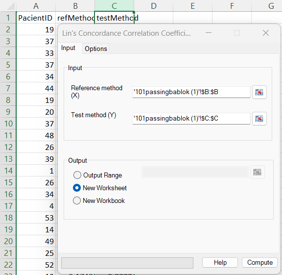
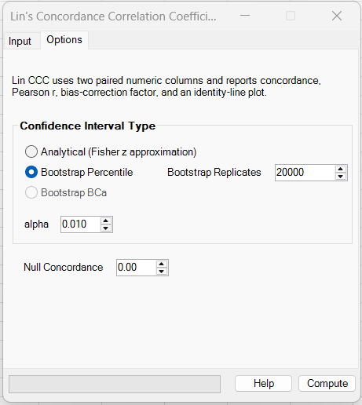
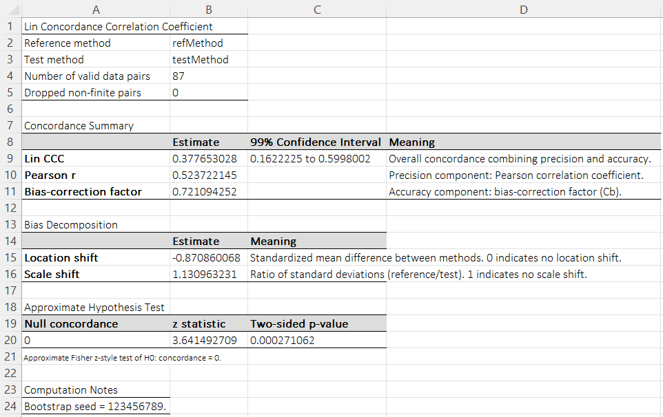
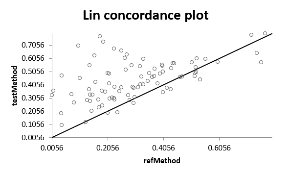

# Lin's Concordance Correlation Coefficient

**Includes:** Lin's Concordance Correlation Coefficient (CCC), Pearson correlation, bias-correction factor **Cb**, analytical CI via **Fisher z approximation**, **Bootstrap Percentile** or **Bootstrap BCa**, approximate hypothesis test for a selected **Null Concordance**, bias decomposition (**location shift** and **scale shift**), and concordance scatter plot with identity line.  
**Purpose:** Use when you want to quantify **agreement** between two paired numeric measurement methods and separate overall agreement into **precision** and **accuracy** components.

---

## Overview

Lin's Concordance Correlation Coefficient (CCC) is an agreement measure for **paired continuous measurements**. It combines:

- **precision**: how strongly the two methods are linearly associated
- **accuracy**: how close the paired measurements are to the line of identity \(y=x\)

Unlike ordinary Pearson correlation, CCC penalizes both:

- **location shift** (one method tends to read systematically higher or lower)
- **scale shift** (one method is more or less variable than the other)

In Lin's formulation,

$$
\rho_c = \rho \cdot C_b
$$

where:

- \(\rho\) is the Pearson correlation coefficient
- \(C_b\) is Lin's bias-correction factor

The equivalent moment form is:

$$
\rho_c = \frac{2s_{xy}}{s_x^2 + s_y^2 + (\bar x - \bar y)^2}
$$

where:

- \(\bar x, \bar y\) are the sample means
- \(s_x, s_y\) are the sample standard deviations
- \(s_{xy}\) is the sample covariance

### What CCC adds beyond Pearson correlation

A Pearson correlation close to 1 only tells you that the two methods move together linearly. Two methods can have:

- very high Pearson correlation
- but still poor agreement because one method is consistently higher, lower, or more variable

CCC corrects for that by shrinking Pearson's \(\rho\) with the factor \(C_b\).

---

## Input

### Reference method (X)
Select the range containing the reference method measurements.

### Test method (Y)
Select the range containing the test method measurements.

The add-in requires paired observations:

- both ranges must have the same length
- matching rows must correspond to the same subject / sample / item
- non-finite pairs are removed pairwise before fitting

This first implementation is designed for **two paired numeric columns**. Repeated-measures / clustered CCC is not part of the current GUI workflow.

---

## Options

### Confidence Interval Type

The current GUI provides three CI options.

#### 1) Analytical (Fisher z approximation)

This option applies a Fisher-z style approximation directly to the observed concordance coefficient:

$$
z = \operatorname{atanh}(\rho_c)
$$

with approximate standard error:

$$
SE(z) \approx \frac{1}{\sqrt{n-3}}
$$

A two-sided confidence interval is then computed as:

$$
z \pm z_{1-\alpha/2} SE(z)
$$

and transformed back using:

$$
\rho_c = \tanh(z)
$$

This is fast and convenient, and is usually a good first choice for moderate or large sample sizes.

#### 2) Bootstrap Percentile

This option resamples the **paired observations** with replacement and recomputes Lin's CCC on each bootstrap sample.

The confidence interval is then taken from the empirical percentiles of the bootstrap estimates:

$$
\left[Q_{\alpha/2},\;Q_{1-\alpha/2}\right]
$$

where \(Q_p\) is the bootstrap percentile at probability \(p\).

Use this when:

- you want a distribution-free interval
- sample size is not very large
- you want a check against the analytical approximation

#### 3) Bootstrap BCa

This option resamples the **paired observations** with replacement and computes a **bias-corrected and accelerated (BCa)** interval from the bootstrap distribution plus the jackknife acceleration term.

Use this when:

- you want a bootstrap interval that adjusts for both bias and skewness,
- the percentile interval looks asymmetric or sample size is modest,
- you want a more refined bootstrap CI than simple percentile limits.

### Which CI option should I prefer?

- **Analytical (Fisher z approximation)**  
  Best when you want a fast approximation and sample size is moderate to large.

- **Bootstrap Percentile**  
  Best when you want fewer distributional assumptions and can afford more computation time.

- **Bootstrap BCa**  
  Best when you want a bootstrap interval with bias correction and acceleration rather than a simple percentile interval.

---

### Bootstrap Replicates

Used for the bootstrap methods only.

Larger values give more stable bootstrap limits but take longer to compute.

Practical guidance:

- `2000` is usually a good default
- `10000` or more is reasonable for publication-quality bootstrap intervals
- very large values increase runtime substantially

### Bootstrap seed and reproducibility

In the Excel GUI, **Lin’s Concordance Correlation Coefficient** does not expose a dedicated seed input for bootstrap confidence intervals.

Therefore the bootstrap seed is resolved as follows:

1. use the **Global Settings → Default Random Seed**, if it has been set;
2. otherwise use a **time-based seed**.

When a bootstrap method is used, the computation notes report the actual seed that was used, for example:

- `Bootstrap seed = 123456789.`

This makes percentile-bootstrap intervals reproducible across runs when the same data and options are used.

!!! tip
    If reproducibility matters, set **Default Random Seed** in **Global Settings** before running bootstrap Lin CCC intervals.

---

### alpha

The two-sided significance level \(\alpha\) used for confidence intervals and the approximate null-concordance test.

Examples:

- `0.05` → 95% CI
- `0.01` → 99% CI

---

### Null Concordance

The add-in reports an approximate hypothesis test of:

$$
H_0: \rho_c = \rho_{c,0}
$$

where \(\rho_{c,0}\) is the **Null Concordance** entered in the options.

Most users will leave this at:

```text
0.00
```

which tests whether concordance is different from zero.

This is useful mainly when you want a formal test in addition to the confidence interval. For method-comparison work, the **confidence interval** is usually more informative than the p-value.

---

## Steps in the add-in

1. Ribbon: **BESH Stat NG → Analyse → Agreement → Lin's Concordance Correlation Coefficient**
2. In **Input**:
   - Select **Reference method (X)** and **Test method (Y)**
   - Choose output destination
3. In **Options**:
   - Select confidence interval method
   - Set **Bootstrap Replicates** if using bootstrap
   - Set **alpha**
   - Set **Null Concordance** if needed
4. Click **Compute**

---

## Screenshots

### Input screen



### Options



### Results





---

## Method and Mathematics

### Main coefficient

Lin's CCC can be written as:

$$
\rho_c = \frac{2s_{xy}}{s_x^2 + s_y^2 + (\bar x - \bar y)^2}
$$

It can also be decomposed into:

$$
\rho_c = \rho \cdot C_b
$$

where Pearson's correlation is:

$$
\rho = \frac{s_{xy}}{s_x s_y}
$$

and the bias-correction factor is:

$$
C_b = \frac{2}{v + 1/v + u^2}
$$

with:

$$
u = \frac{\bar x - \bar y}{\sqrt{s_x s_y}}
$$

and

$$
v = \frac{s_x}{s_y}
$$

In the current add-in output:

- **Location shift** is the standardized mean difference
  
  $$
  \text{location shift} = \frac{\bar x - \bar y}{\sqrt{s_x s_y}}
  $$

- **Scale shift** is the ratio of standard deviations
  
  $$
  \text{scale shift} = \frac{s_x}{s_y}
  $$

Here **X = reference method** and **Y = test method**, so the scale shift shown in the results is the **reference/test** standard-deviation ratio.

### Approximate hypothesis test

The implementation uses a Fisher-z style approximation for the null-concordance test.

For observed concordance \(\hat\rho_c\) and null value \(\rho_{c,0}\):

$$
z_{obs} = \operatorname{atanh}(\hat\rho_c)
$$

$$
z_0 = \operatorname{atanh}(\rho_{c,0})
$$

$$
Z = (z_{obs} - z_0)\sqrt{n-3}
$$

and the two-sided p-value is:

$$
p = 2\left[1 - \Phi(|Z|)\right]
$$

This is an approximation and should be interpreted accordingly.

---

## Output and Interpretation

The results worksheet contains:

- **Reference method** and **Test method**
- **Number of valid data pairs**
- **Dropped non-finite pairs**
- **Lin CCC** with confidence interval
- **Pearson r**
- **Bias-correction factor (Cb)**
- **Location shift**
- **Scale shift**
- **Approximate null-concordance test**
- **Computation notes** (for example bootstrap details and bootstrap seed)

### How to interpret the main quantities

| Quantity | Interpretation |
|---|---|
| CCC close to 1 | Strong overall agreement |
| CCC much lower than Pearson r | Association is strong, but agreement is penalized by bias and/or scale mismatch |
| Pearson r close to 1 | Strong linear association (precision) |
| Cb close to 1 | Good accuracy relative to the identity line |
| Location shift close to 0 | No important systematic mean shift |
| Scale shift close to 1 | Similar spread/variability in the two methods |

### Practical reading of results

- **High Pearson r + low Cb** → the methods track each other, but not along the identity line
- **Location shift far from 0** → one method tends to be systematically higher or lower
- **Scale shift far from 1** → one method is more dispersed than the other
- **CCC CI far below 1** → agreement is limited even if ordinary correlation looks good

---

## Example dataset

The Lin CCC example uses the same dataset as the Passing–Bablok and Deming documentation:

- ignore the first column (`PacientID`)
- use:
  - Reference method (X): `refMethod`
  - Test method (Y): `testMethod`

Download the example dataset used here: [101passingbablok.csv](../assets/data/101passingbablok/101passingbablok.csv)

---

## R Code for Reference

### Using the **DescTools** package

```r
library(DescTools)

d <- read.csv("101passingbablok.csv")

fit <- CCC(
  x = d$refMethod,
  y = d$testMethod,
  ci = "z-transform",
  conf.level = 0.99
)

fit$rho.c      # Lin CCC estimate + CI
fit$rho        # Pearson correlation
fit$C.b        # bias-correction factor
fit$s.shift    # scale shift
fit$l.shift    # location shift
```

### Bootstrap percentile CI in base R

```r
set.seed(123456789)

d <- read.csv("101passingbablok.csv")

lin_ccc <- function(x, y) {
  mx <- mean(x)
  my <- mean(y)
  sx <- sd(x)
  sy <- sd(y)
  sxy <- cov(x, y)
  rho_c <- (2 * sxy) / (sx^2 + sy^2 + (mx - my)^2)
  rho <- sxy / (sx * sy)
  cb <- rho_c / rho
  c(ccc = rho_c, pearson_r = rho, cb = cb,
    location_shift = (mx - my) / sqrt(sx * sy),
    scale_shift = sx / sy)
}

obs <- lin_ccc(d$refMethod, d$testMethod)
B <- 20000
boot_ccc <- numeric(B)

for (b in seq_len(B)) {
  idx <- sample.int(nrow(d), nrow(d), replace = TRUE)
  boot_ccc[b] <- lin_ccc(d$refMethod[idx], d$testMethod[idx])["ccc"]
}

quantile(boot_ccc, c(0.005, 0.995))  # 99% percentile CI
obs
```

### Notes on expected differences versus the add-in

- `DescTools::CCC()` and other packages may define **location shift** and **scale shift** in the opposite direction depending on whether they use test/reference or reference/test ordering.
- Some software reports only the concordance coefficient and not the full decomposition.
- Some software uses different asymptotic formulas or bootstrap defaults for confidence intervals.
- Bootstrap intervals may differ slightly across software because of random seed handling, percentile interpolation, and implementation-specific defaults.

---

## Limitations and expected discrepancies

- CCC is a measure of **agreement**, but it is still influenced by the range of the data. A very wide measurement range can make concordance look stronger than in a narrow-range study.
- The analytical CI and hypothesis test use a **Fisher-z style approximation**; for small samples these should be treated cautiously.
- Different software may differ because of:
  - sample vs population variance/covariance conventions
  - alternative asymptotic CI formulas
  - bootstrap configuration choices
  - different sign / direction conventions for location shift
  - different ratio conventions for scale shift

CCC should not be treated as a full replacement for all method-comparison tools:

- use **Bland–Altman** to assess bias and limits of agreement on the measurement scale
- use **Deming** or **Passing–Bablok** when you want an explicit regression-based method comparison
- use **ICC** when your goal is reliability across raters/replicates rather than two-method comparison only

---

## References

- Lin, L. I.-K. (1989). A concordance correlation coefficient to evaluate reproducibility. *Biometrics*, 45(1), 255–268.
- Lin, L. I.-K. (2000). A note on the concordance correlation coefficient. *Biometrics*, 56(1), 324–325.
- McBride, G. B. (2005). *A Proposal for Strength-of-Agreement Criteria for Lin's Concordance Correlation Coefficient*. NIWA Client Report.
- Barnhart, H. X., Haber, M. J., & Song, J. (2002). Overall concordance correlation coefficient for evaluating agreement among multiple observers. *Biometrics*, 58(4), 1020–1027.
- Nickerson, C. A. E. (1997). A note on “A concordance correlation coefficient to evaluate reproducibility”. *Biometrics*, 53(4), 1503–1507.

## See also

- [Bland–Altman Plot](bland-altman.md)
- [Deming Regression](deming-regression.md)
- [Passing–Bablok Regression](passing-bablok-regression.md)
- [Intraclass Correlation Coefficients](intraclass-correlation-coefficients.md)
- [Home](../index.md)
