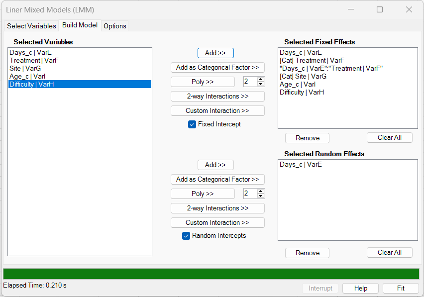
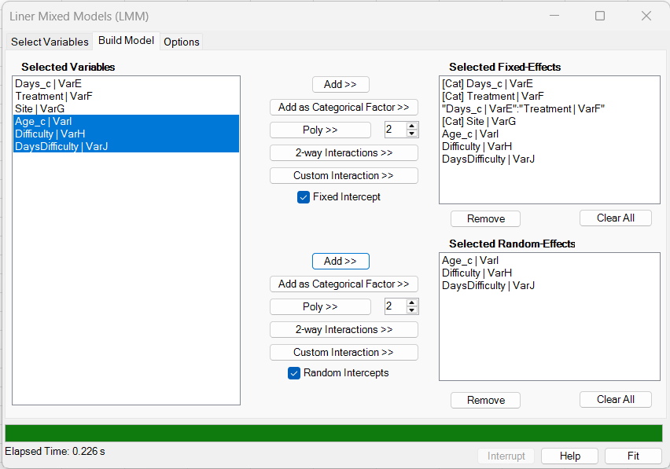
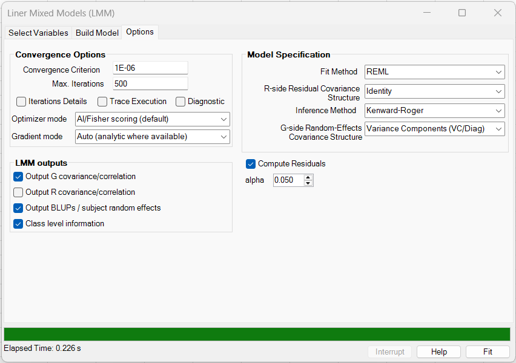
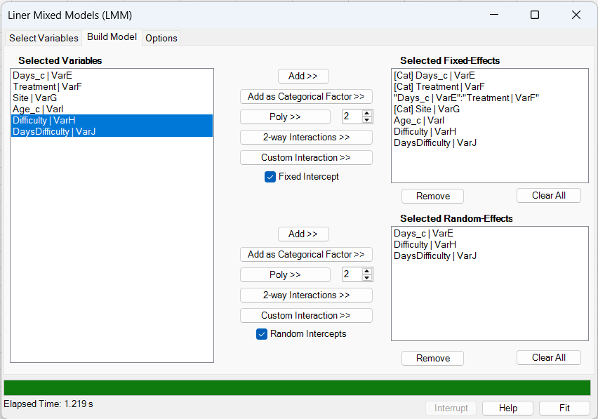
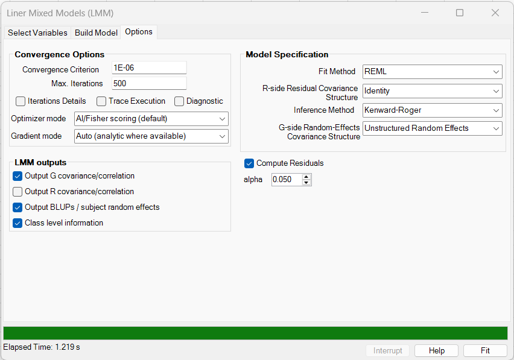

# LMM examples and interpretation

[← Back to LMM overview](../linear-mixed-models-lmm.md)

**Purpose of this page:** show practical BESH Stat NG Linear Mixed Models (LMM) workflows using the example dataset shipped with the documentation. The examples are intended to help users choose a model, recognize the output tables, and interpret common random-effect and residual-covariance specifications.

For the underlying model notation, see [Model and mathematics](model-and-mathematics.md). For covariance choices, see [Random effects and covariance structures](random-effects-and-covariance.md). For worksheet formulas, see [Worksheet functions](worksheet-functions.md). For external software comparisons, see [Comparison with other software](software-comparison.md).

---

## 1. Example data

The examples use the file:

[`docs/assets/data/200lmm/200lmm.csv`](../../assets/data/200lmm/200lmm.csv)

The data are in long format, with one row per subject and visit. There are 720 analysis rows: 72 subjects and 10 visits per subject.

| Column | Role in the examples |
|---|---|
| `Subject` | Text subject identifier. This is the grouping variable for random effects. |
| `Reaction` | Continuous response variable. |
| `Visit` | Visit/order variable, used for R-side residual covariance structures. |
| `Days` | Original time variable. |
| `Days_c` | Centered time variable, ranging from -4.5 to 4.5. |
| `Treatment` | Numeric-coded treatment group, used as a categorical fixed effect in the examples. |
| `Site` | Numeric-coded site, used as a categorical fixed effect. |
| `Difficulty` | Continuous time-varying covariate. |
| `Age_c` | Centered subject-level covariate. |
| `DaysDifficulty` | Precomputed `Days_c * Difficulty` interaction column. |
| `Subject_num` | Numeric subject identifier, included only as a fallback/check column. |

The screenshot below shows the common **Variables** tab setup. The subject identifier is the text column `Subject`.


!!! note "Text subject IDs are supported"
    `Subject` is a text column in these examples. BESH Stat NG uses the distinct subject labels to define subject/cluster blocks. The response, visit/order variable, and numeric predictors must still be usable as numeric analysis columns.

---

## 2. Common setup

For all seven examples:

- Response: `Reaction`
- Subject ID: `Subject`
- Visit / Time / Ordering: `Visit`
- Fit method: REML
- Inference method: usually Kenward-Roger, except where the saved result workbook shows large-sample Wald output
- Fixed intercept: selected
- Random intercept: selected unless stated otherwise
- Output: at least G covariance/correlation and class-level information

The screenshots and output workbooks are included with the documentation:

| Model | Build-model screenshot | Options screenshot | Result workbook |
|---:|---|---|---|
| 1 | [`200lmm_buildmodel.png`](../../assets/images/200lmm/200lmm_buildmodel.png) | [`200lmm_options.png`](../../assets/images/200lmm/200lmm_options.png) | [`200lmm_result_model1.xlsx`](../../assets/data/200lmm/200lmm_result_model1.xlsx) |
| 2 | [`200lmm_buildmodel2.png`](../../assets/images/200lmm/200lmm_buildmodel2.png) | [`200lmm_options2.png`](../../assets/images/200lmm/200lmm_options2.png) | [`200lmm_result_model2.xlsx`](../../assets/data/200lmm/200lmm_result_model2.xlsx) |
| 3 | [`200lmm_buildmodel3.png`](../../assets/images/200lmm/200lmm_buildmodel3.png) | [`200lmm_options3.png`](../../assets/images/200lmm/200lmm_options3.png) | [`200lmm_result_model3.xlsx`](../../assets/data/200lmm/200lmm_result_model3.xlsx) |
| 4 | [`200lmm_buildmodel4.png`](../../assets/images/200lmm/200lmm_buildmodel4.png) | [`200lmm_options4.png`](../../assets/images/200lmm/200lmm_options4.png) | [`200lmm_result_model4.xlsx`](../../assets/data/200lmm/200lmm_result_model4.xlsx) |
| 5 | [`200lmm_buildmodel5.png`](../../assets/images/200lmm/200lmm_buildmodel5.png) | [`200lmm_options5.png`](../../assets/images/200lmm/200lmm_options5.png) | [`200lmm_result_model5.xlsx`](../../assets/data/200lmm/200lmm_result_model5.xlsx) |
| 6 | [`200lmm_buildmodel6.png`](../../assets/images/200lmm/200lmm_buildmodel6.png) | [`200lmm_options6.png`](../../assets/images/200lmm/200lmm_options6.png) | [`200lmm_result_model6.xlsx`](../../assets/data/200lmm/200lmm_result_model6.xlsx) |
| 7 | [`200lmm_buildmodel7.png`](../../assets/images/200lmm/200lmm_buildmodel7.png) | [`200lmm_options7.png`](../../assets/images/200lmm/200lmm_options7.png) | [`200lmm_result_model7.xlsx`](../../assets/data/200lmm/200lmm_result_model7.xlsx) |

!!! important "The saved examples are deliberate workflows, not a single model-selection ladder"
    Models 1 to 3 use `Days_c` as a continuous time covariate. Models 4, 5, and 7 use `Days_c` as a categorical fixed effect, producing separate time-profile coefficients for the 10 observed `Days_c` levels. The updated Model 6 result workbook instead records a continuous `Days_c:Treatment` interaction and AR(1) R-side residual output. Always use the output **Data** sheet and **Class level information** table as the authoritative record of the fitted design.
 
---

## 3. Summary of the saved model results

The table below summarizes the saved result workbooks. Execution time is the time reported in the output workbook and should be interpreted as an example run, not as a formal benchmark.

| Model | Fixed-effect parameters | Random-effect columns | G-side structure | R-side structure | Log-likelihood | AIC | Execution time | Iterations | Converged |
|---:|---:|---:|---|---|---:|---:|---:|---:|---|
| 1 | 7 | 1 | Random Intercept | Identity | -3704.721 | 7413.443 | 0.210 s | 5 | Yes |
| 2 | 7 | 2 | Random Intercept + Slope | Identity | -3597.972 | 7203.944 | 0.210 s | 5 | Yes |
| 3 | 8 | 2 | Random Intercept + Slope | Identity | -3595.059 | 7198.118 | 0.226 s | 5 | Yes |
| 4 | 25 | 4 | Variance Components (VC/Diag) | Identity | -3633.372 | 7276.744 | 1.219 s | 10 | Yes |
| 5 | 25 | 4 | Unstructured Random Effects | Identity | -3512.207 | 7046.414 | 5.201 s | 38 | Yes |
| 6 | 7 | 2 | Random Intercept + Slope | AR(1) | -3595.477 | 7200.953 | 0.759 s | 13 | Yes |
| 7 | 24 | 2 | Random Intercept + Slope | Heterogeneous Toeplitz (TOEPH) | -3512.884 | 7069.768 | 14.855 s | 102 | Yes |

!!! warning "Do not over-interpret REML information criteria across different fixed effects"
    REML fit statistics are useful diagnostics, but REML likelihoods should not be used to compare models with different fixed-effect designs. Models 1 and 2 have the same fixed-effect design, so their REML likelihoods are more directly comparable. Models that change the fixed-effect design should be compared with ML if the purpose is fixed-effect model selection.

---

## 4. Example 1: Random-intercept model

This is the simplest subject-level mixed model in the example sequence. Each subject gets a random baseline shift, but all subjects share the same population-average time slope.

| Build Model | Options |
|---|---|
|  |  |

### 4.1 Model specification

Fixed effects:

```text
Intercept + Days_c + Treatment + Site + Age_c + Difficulty
```

Random effects:

```text
Random intercept by Subject
```

Covariance options:

| Option | Setting |
|---|---|
| G side | Random Intercept |
| R side | Identity |
| Inference | Kenward-Roger |

### 4.2 Selected output

| Fixed effect | Estimate | Std. Error | DF | p-value |
|---|---:|---:|---:|---:|
| `Days_c` | 12.791 | 0.478 | 646.203 | <0.001 |
| `Treatment[1]` | 0.845 | 17.368 | 67.002 | 0.961 |
| `Age_c` | 2.411 | 0.919 | 67.008 | 0.011 |
| `Difficulty` | 4.349 | 1.432 | 648.804 | 0.002 |

| Type III term | Num DF | Den DF | F | p-value |
|---|---:|---:|---:|---:|
| `Days_c` | 1 | 646.2 | 716.04 | <0.001 |
| `Treatment` | 1 | 67.0 | 0.00 | 0.961 |
| `Site` | 2 | 67.0 | 1.10 | 0.339 |
| `Age_c` | 1 | 67.0 | 6.89 | 0.011 |
| `Difficulty` | 1 | 648.8 | 9.22 | 0.002 |

The fitted G-side random-intercept variance is 5045.240. This model captures subject-to-subject baseline variation, but it assumes the time effect is the same for every subject.

### 4.3 Interpretation

`Days_c` has a strong positive fixed effect. On average, the response increases by about 12.8 units per one-unit increase in centered time, after adjusting for treatment, site, age, and difficulty. Treatment is not meaningfully different from the reference group in this model. `Age_c` and `Difficulty` are positive and statistically significant in the saved output.

---

## 5. Example 2: Random intercept plus random slope

This model adds a subject-specific slope for `Days_c`. It allows subjects to differ both in baseline response and in time trend.

| Build Model | Options |
|---|---|
|  |  |

### 5.1 Model specification

Fixed effects:

```text
Intercept + Days_c + Treatment + Site + Age_c + Difficulty
```

Random effects:

```text
Random intercept + random Days_c slope by Subject
```

Covariance options:

| Option | Setting |
|---|---|
| G side | Random Intercept + Slope |
| R side | Identity |
| Inference | Kenward-Roger |

### 5.2 Selected output

| Fixed effect | Estimate | Std. Error | DF | p-value |
|---|---:|---:|---:|---:|
| `Days_c` | 12.827 | 0.971 | 72.590 | <0.001 |
| `Treatment[1]` | 7.627 | 16.833 | 66.978 | 0.652 |
| `Age_c` | 1.857 | 0.890 | 67.024 | 0.041 |
| `Difficulty` | 3.956 | 1.148 | 596.619 | <0.001 |

| G covariance term | Estimate |
|---|---:|
| Variance, intercept | 5126.785 |
| Variance, `Days_c` slope | 58.206 |
| Correlation, intercept with `Days_c` slope | -0.332 |

Compared with Model 1, the `Days_c` standard error is larger because the model now recognizes subject-to-subject variability in time slopes. The fitted intercept-slope correlation is negative in this run.

### 5.3 Interpretation

The population-average time trend remains strongly positive, but the random-slope variance indicates that subjects do not all follow the same time trajectory. This is usually a better longitudinal starting model than a random-intercept-only model when individual trajectories visibly differ in slope.

---

## 6. Example 3: Fixed treatment-by-time interaction with random slope

This model keeps the random intercept and random time slope from Model 2, then adds a fixed `Days_c × Treatment` interaction.

| Build Model | Options |
|---|---|
|  |  |

### 6.1 Model specification

Fixed effects:

```text
Intercept + Days_c + Treatment + Days_c:Treatment + Site + Age_c + Difficulty
```

Random effects:

```text
Random intercept + random Days_c slope by Subject
```

Covariance options:

| Option | Setting |
|---|---|
| G side | Random Intercept + Slope |
| R side | Identity |
| Inference | Kenward-Roger |

### 6.2 Selected output

| Fixed effect | Estimate | Std. Error | DF | p-value |
|---|---:|---:|---:|---:|
| `Days_c` | 11.163 | 1.393 | 70.940 | <0.001 |
| `Treatment[1]` | -0.887 | 17.371 | 67.174 | 0.959 |
| `Days_c:Treatment` | 3.147 | 1.911 | 70.007 | 0.104 |
| `Age_c` | 1.857 | 0.890 | 67.024 | 0.041 |
| `Difficulty` | 3.981 | 1.148 | 596.834 | <0.001 |

| Type III term | Num DF | Den DF | F | p-value |
|---|---:|---:|---:|---:|
| `Days_c` | 1 | 70.9 | 64.25 | <0.001 |
| `Treatment` | 1 | 67.2 | 0.00 | 0.959 |
| `Days_c:Treatment` | 1 | 70.0 | 2.71 | 0.104 |
| `Site` | 2 | 67.0 | 1.89 | 0.159 |
| `Age_c` | 1 | 67.0 | 4.35 | 0.041 |
| `Difficulty` | 1 | 596.8 | 12.03 | <0.001 |

### 6.3 Interpretation

The fixed `Days_c:Treatment` interaction is positive but not statistically significant at the 0.05 level in the saved output. This suggests that the treatment group may have a steeper average time trend, but the evidence is not strong in this example. The random-slope component still describes subject-specific deviations around the population-average time trends.

---

## 7. Example 4: Categorical time profile with VC/Diag random effects

Model 4 is intentionally richer and illustrates two important points:

1. `Days_c` has been added as a **categorical fixed effect**, producing a separate coefficient for each non-reference time level.
2. The random-effect design contains multiple random-effect columns, but the G-side covariance is **Variance Components (VC/Diag)**, so each random effect has its own variance and all random-effect covariances are fixed to zero.

| Build Model | Options |
|---|---|
|  |  |

### 7.1 Model specification in the saved workbook

Fixed effects:

```text
Categorical Days_c + Treatment + Categorical Days_c:Treatment + Site + Age_c + Difficulty + DaysDifficulty
```

Random effects:

```text
Random intercept + random Age_c + random Difficulty + random DaysDifficulty by Subject
```

Covariance options:

| Option | Setting |
|---|---|
| G side | Variance Components (VC/Diag) |
| R side | Identity |
| Inference shown in workbook | Large-sample Wald normal approximation |

!!! note "Check the Class level information table"
    The output workbook confirms that `Days_c` was treated as a categorical fixed effect with 10 levels. This changes the interpretation from a single linear time slope to a visit/time-profile model.

### 7.2 Selected output

| Fixed effect | Estimate | Std. Error | z | p-value |
|---|---:|---:|---:|---:|
| `Treatment[1]` | -13.235 | 19.174 | -0.690 | 0.490 |
| `Age_c` | 2.374 | 0.922 | 2.575 | 0.010 |
| `Difficulty` | 4.818 | 1.437 | 3.354 | <0.001 |
| `DaysDifficulty` | -1.755 | 0.497 | -3.533 | <0.001 |
| `Days_c[4.5]` | 97.982 | 8.718 | 11.239 | <0.001 |
| `Days_c[4.5]:Treatment[1]` | 33.409 | 11.798 | 2.832 | 0.005 |

| G variance term | Estimate |
|---|---:|
| Intercept | 5086.630 |
| `Age_c` | 0.000132 |
| `Difficulty` | 0.000491 |
| `DaysDifficulty` | 0.000003 |

### 7.3 Interpretation

This model is useful as a diagnostic example. The very small random-effect variances for `Age_c`, `Difficulty`, and `DaysDifficulty` suggest that the random part of the model is probably over-specified for those columns under the VC/Diag structure. The fixed `DaysDifficulty` effect is clearly negative in the saved output, but the random-effect variance for that same term is essentially zero.

---

## 8. Example 5: Categorical time profile with unstructured multiple random effects

Model 5 uses the same categorical time-profile fixed-effect idea as Model 4, but changes the random-effect design and the G-side covariance. The random-effect columns are now intercept, `Days_c`, `Difficulty`, and `DaysDifficulty`, with an unstructured G matrix.

| Build Model | Options |
|---|---|
|  |  |

### 8.1 Model specification in the saved workbook

Fixed effects:

```text
Categorical Days_c + Treatment + Categorical Days_c:Treatment + Site + Age_c + Difficulty + DaysDifficulty
```

Random effects:

```text
Random intercept + random Days_c + random Difficulty + random DaysDifficulty by Subject
```

Covariance options:

| Option | Setting |
|---|---|
| G side | Unstructured Random Effects |
| R side | Identity |
| Inference | Kenward-Roger |

### 8.2 Selected output

| Type III term | Num DF | Den DF | F | p-value |
|---|---:|---:|---:|---:|
| `Days_c` | 9 | 512.0 | 6.55 | <0.001 |
| `Treatment` | 1 | 75.0 | 0.53 | 0.470 |
| `Days_c:Treatment` | 9 | 506.9 | 1.41 | 0.179 |
| `Site` | 2 | 65.3 | 1.72 | 0.188 |
| `Age_c` | 1 | 65.6 | 3.50 | 0.066 |
| `Difficulty` | 1 | 65.0 | 10.63 | 0.002 |
| `DaysDifficulty` | 1 | 120.2 | 27.81 | <0.001 |

| G covariance term | Estimate |
|---|---:|
| Variance, intercept | 5131.727 |
| Variance, `Days_c` | 59.608 |
| Variance, `Difficulty` | 36.105 |
| Variance, `DaysDifficulty` | 0.954 |
| Correlation, `Difficulty` with `DaysDifficulty` | 0.954 |

### 8.3 Interpretation

The unstructured G matrix is much more flexible than VC/Diag, but it is also more expensive. This model took 38 iterations and 5.201 seconds in the saved run, compared with 10 iterations and 1.219 seconds for Model 4. The high fitted correlation between the `Difficulty` and `DaysDifficulty` random effects is a warning sign to review scaling, identifiability, and whether both random effects are needed.

---

## 9. Example 6: Random slope with AR(1) residual covariance

Model 6 adds an R-side AR(1) residual covariance using `Visit` as the ordering variable. The saved workbook also writes the estimated R covariance and R correlation matrices, making it a useful example for checking residual serial-correlation output.

| Build Model | Options |
|---|---|
|  |  |

### 9.1 Model specification in the saved workbook

Fixed effects:

```text
Intercept + Treatment + Days_c:Treatment + Site + Age_c + Difficulty
```

Random effects:

```text
Random intercept + random Days_c slope by Subject
```

Covariance options:

| Option | Setting |
|---|---|
| G side | Random Intercept + Slope |
| R side | AR(1) |
| Visit/order variable | `Visit` |
| Inference | Kenward-Roger |

### 9.2 Selected output

| Fixed effect | Estimate | Std. Error | DF | p-value |
|---|---:|---:|---:|---:|
| `Treatment[1]` | -32.284 | 17.520 | 68.162 | 0.070 |
| `Days_c:Treatment` | 14.271 | 1.814 | 70.972 | <0.001 |
| `Site[2]` | -7.765 | 19.515 | 67.000 | 0.692 |
| `Site[3]` | -45.971 | 23.164 | 67.005 | 0.051 |
| `Difficulty` | 4.979 | 1.067 | 524.108 | <0.001 |
| `Age_c` | 1.839 | 0.898 | 67.032 | 0.045 |

| Type III term | Num DF | Den DF | F | p-value |
|---|---:|---:|---:|---:|
| `Treatment` | 1 | 68.2 | 3.40 | 0.070 |
| `Days_c:Treatment` | 1 | 71.0 | 61.89 | <0.001 |
| `Site` | 2 | 67.0 | 2.22 | 0.117 |
| `Difficulty` | 1 | 524.1 | 21.76 | <0.001 |
| `Age_c` | 1 | 67.0 | 4.19 | 0.045 |

| G covariance term | Estimate |
|---|---:|
| Variance, intercept | 5463.132 |
| Variance, `Days_c` slope | 106.732 |
| Correlation, intercept with `Days_c` slope | -0.458 |

The fitted AR(1) R-side residual variance is 935.569. The lag-one residual covariance is 363.259, corresponding to a lag-one residual correlation of 0.388. The correlations then decrease by visit lag, as expected for AR(1): lag 2 is 0.151, lag 3 is 0.059, and lag 9 is approximately 0.0002.

| R-side AR(1) quantity | Estimate |
|---|---:|
| Residual variance, each visit | 935.569 |
| Lag-1 residual correlation | 0.388 |
| Lag-2 residual correlation | 0.151 |
| Lag-3 residual correlation | 0.059 |
| Lag-9 residual correlation | 0.0002 |

### 9.3 Interpretation

This model tests whether residuals still need serial correlation after including a subject-specific time slope. In the saved output, the treatment-by-time interaction is strong: the `Days_c:Treatment` coefficient is positive and statistically significant. `Difficulty` and `Age_c` are also positive in this run, while the treatment main effect is only marginal after accounting for the interaction and covariance structure.

The R covariance and correlation tables show the residual AR(1) pattern directly. These matrices describe the residual part of the within-subject covariance after fixed effects and random effects have been included; the full marginal covariance also includes the G-side contribution from the random intercept and random slope.
 
---

## 10. Example 7: Heterogeneous Toeplitz residual covariance

Model 7 uses a categorical time-profile fixed-effect structure and changes the R-side covariance to heterogeneous Toeplitz. This gives each visit its own residual variance and gives each visit lag its own residual correlation. Compared with Model 6, this is a richer residual-covariance sensitivity model rather than only a one-option change.
 
| Build Model | Options |
|---|---|
|  |  |

### 10.1 Model specification in the saved workbook

Fixed effects:

```text
Categorical Days_c + Treatment + Categorical Days_c:Treatment + Site + Age_c + Difficulty
```

Random effects:

```text
Random intercept + random Days_c slope by Subject
```

Covariance options:

| Option | Setting |
|---|---|
| G side | Random Intercept + Slope |
| R side | Heterogeneous Toeplitz (TOEPH) |
| Visit/order variable | `Visit` |
| Inference shown in workbook | Large-sample Wald normal approximation |

### 10.2 Selected output

| Fixed effect | Estimate | Std. Error | z | p-value |
|---|---:|---:|---:|---:|
| `Age_c` | 1.646 | 0.838 | 1.965 | 0.049 |
| `Difficulty` | 5.348 | 1.072 | 4.988 | <0.001 |
| `Days_c[4.5]` | 101.888 | 12.106 | 8.416 | <0.001 |
| `Days_c[4.5]:Treatment[1]` | 27.141 | 16.585 | 1.636 | 0.102 |

| R-side quantity | Selected estimates |
|---|---|
| Visit-specific residual variances | Visit 1: 1383.7; Visit 5: 888.5; Visit 10: 2120.0 |
| First-row residual correlations | Lag 1: 0.531; lag 2: 0.334; lag 3: 0.223; lag 6: -0.042; lag 9: -0.177 |

The fitted G-side intercept-slope correlation is approximately -1.000 in the saved output, and the model required 102 iterations. The model converged, but this is a warning sign: a boundary-like random-effect correlation can indicate that the random-effect and residual-covariance structures are competing or that the model is close to over-parameterized.

### 10.3 Interpretation

Heterogeneous Toeplitz is useful when residual variances differ across visits and residual correlations follow a lag pattern that is not well described by simple AR(1). It is also more demanding than AR(1). In this example, the elapsed time increased to 14.855 seconds and the fitted G correlation became boundary-like, so this model should be treated as a sensitivity/stress-test model rather than automatically preferred.

---

## 11. Practical interpretation checklist

When reviewing an LMM output workbook, use the following order.

1. **Check retained rows and subject count.** All seven examples retained 720 observations and 72 subjects.
2. **Check the Class level information table.** Confirm whether a predictor was used as numeric or categorical. This is especially important for `Days_c` in Models 4, 5, and 7, and for confirming the continuous `Days_c:Treatment` term in Model 6.
3. **Check convergence.** All saved models converged, but Model 7 required many iterations and has a boundary-like G correlation.
4. **Check G-side covariance estimates.** Very small variances or extreme correlations can indicate over-specification.
5. **Check R-side covariance estimates when used.** Residual AR(1), Toeplitz, and heterogeneous Toeplitz structures use the `Visit` ordering variable.
6. **Review fixed-effect estimates before p-values.** Confirm the coefficient label, reference level, and interaction meaning.
7. **Use Type III tests for multi-column terms.** For categorical time and time-by-treatment terms, Type III tests are usually easier to interpret than individual level coefficients.
8. **Compare REML fits only when appropriate.** Use ML if comparing different fixed-effect designs.

---

## 12. Suggested model-building workflow

For similar longitudinal datasets, a practical sequence is:

1. Fit a random-intercept model with identity residual covariance.
2. Add a scientifically justified random slope, usually time.
3. Add fixed interactions such as treatment by time if they answer the main question.
4. Use VC/Diag for multiple random effects before trying an unstructured G matrix.
5. Add R-side residual covariance only if residual patterns or design considerations justify it.
6. Treat AR(1), Toeplitz, and heterogeneous Toeplitz residual models as sensitivity analyses unless they are part of the analysis plan.
7. Finalize the model based on design, convergence, covariance estimates, diagnostics, and interpretability, not only on a single p-value.

---

## 13. Worksheet-function equivalent pattern

The same dataset can also be analyzed with worksheet functions. A random-intercept-plus-slope model similar to Model 2 can be fit with a handle formula like:

```excel
=BESH.REGR.LMM_FIT(B2:B721,E2:I721,A2:A721,E2:E721,C2:C721,E1:I1,E1:E1,"ID","RI+S","REML","KR",TRUE,TRUE,"'Days_c' + factor('Treatment') + factor('Site') + 'Age_c' + 'Difficulty'","'Days_c'","names")
```

This uses `formulaAddressing = "names"`, so the variable names inside the formula are single-quoted. The `factor(...)` terms reproduce the categorical treatment and site handling used in the GUI examples.

Then extract tables from the returned handle, for example:

```excel
=BESH.REGR.LMM_COEF(handle_cell)
=BESH.REGR.LMM_TYPE3(handle_cell)
=BESH.REGR.LMM_G_COV(handle_cell)
=BESH.REGR.LMM_FITSTATS(handle_cell)
```

For categorical effects and interactions, use `fixedFormula`, `randomFormula`, and `formulaAddressing` as described in [Worksheet functions](worksheet-functions.md).

---

## 14. Common pitfalls shown by these examples

| Pitfall | Where it appears | How to handle it |
|---|---|---|
| Numeric predictor accidentally treated as categorical | Models 4, 5, and 7 use categorical `Days_c` intentionally; Model 6 uses a continuous `Days_c:Treatment` term in the saved workbook. | Check **Class level information** before interpreting coefficients. |
| Over-specified random effects | Model 4 has near-zero random variances for several columns. | Consider removing random effects with negligible variance unless required by design. |
| Expensive unstructured G matrix | Model 5 takes longer than the comparable VC/Diag model. | Use UN only when covariances among random effects are important and estimable. |
| Rich G and R structures competing | Model 7 has a boundary-like G correlation. | Simplify G or R structure, rescale predictors, or treat as sensitivity analysis. |
| Comparing REML models with different fixed effects | The seven examples do not all share the same fixed-effect design. | Use ML for fixed-effect model comparison. |
| Interpreting individual categorical-time coefficients as one slope | Models 4, 5, and 7 estimate separate level effects for `Days_c`. | Use Type III tests and profile plots for categorical time effects. |
