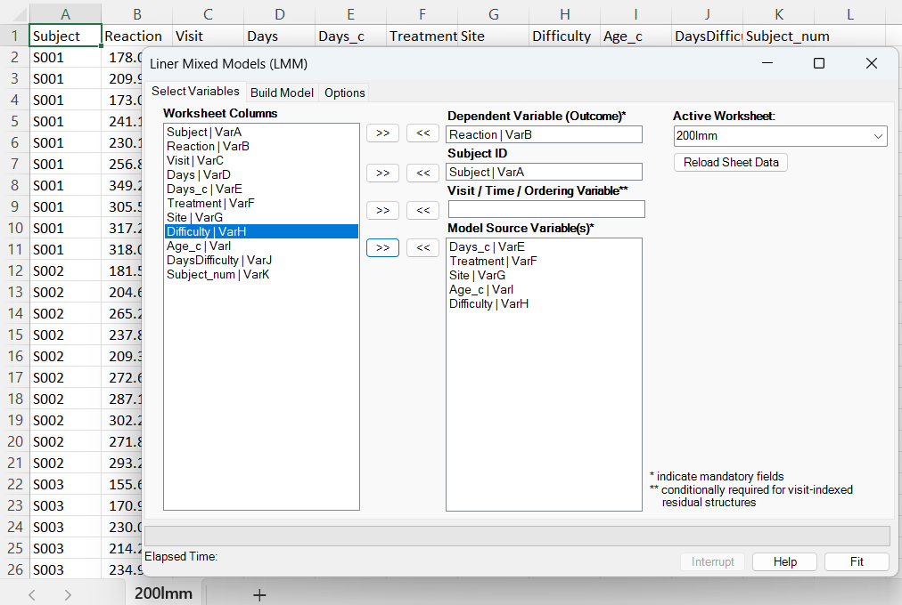
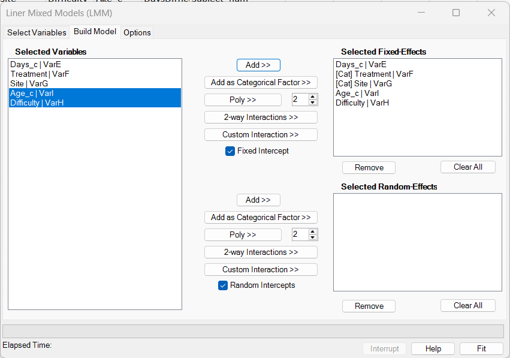
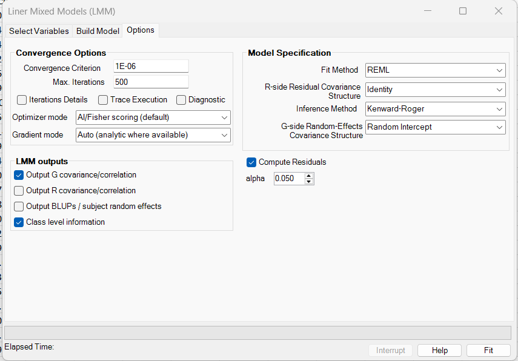
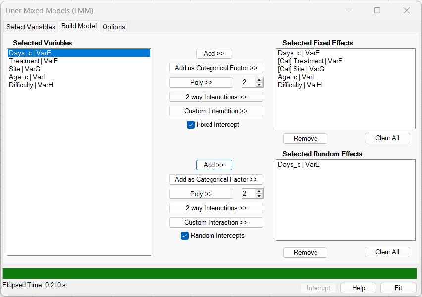
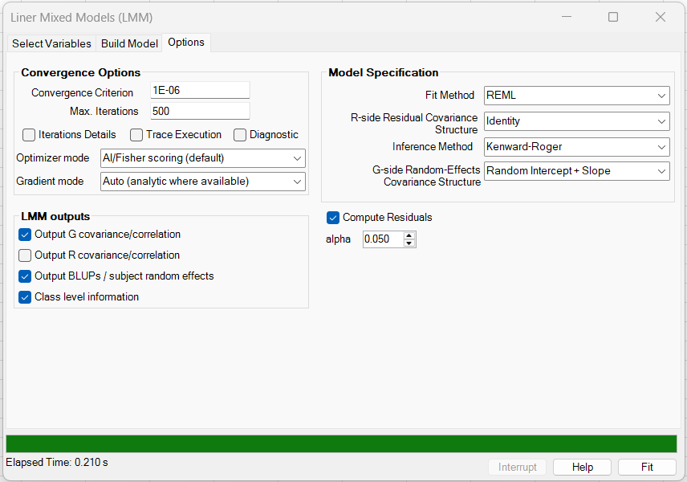
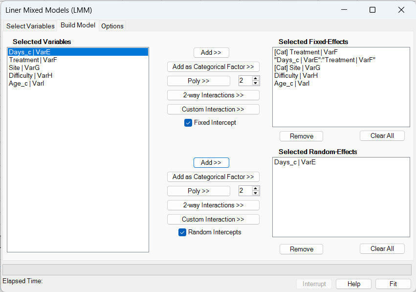
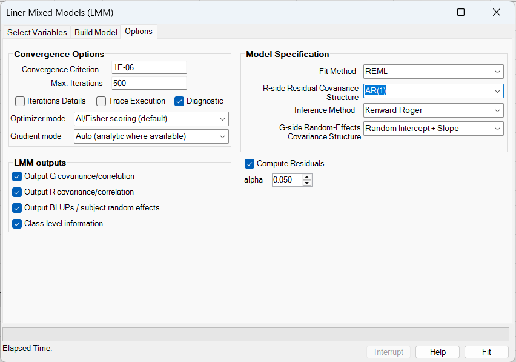
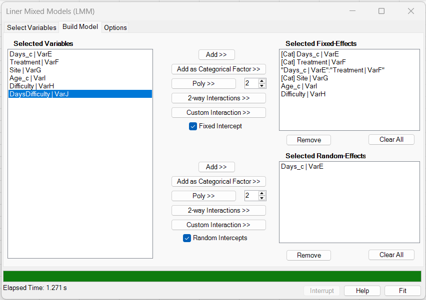
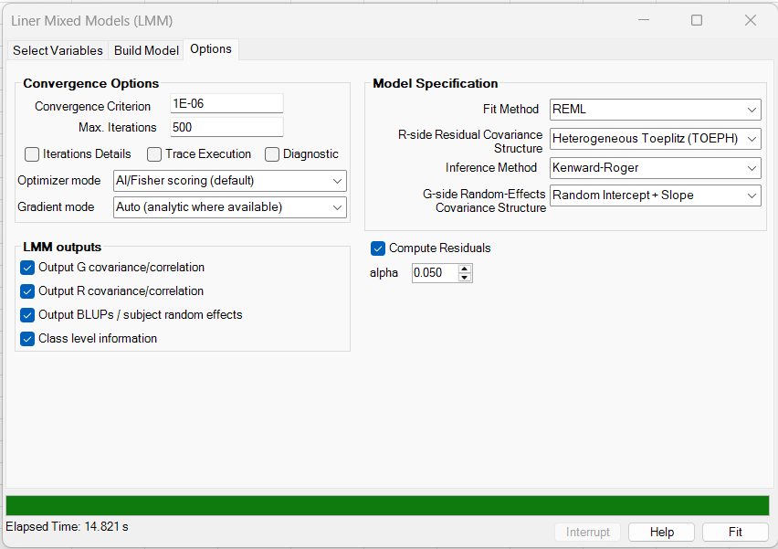

# LMM Excel ribbon workflow

[← Back to LMM overview](../linear-mixed-models-lmm.md)

**Purpose of this page:** show how to fit a Linear Mixed Model (LMM) from the Excel ribbon. The page uses the `200lmm` example data and screenshots included with this documentation and focuses on practical dialog use: selecting variables, building fixed and random effects, choosing G-side and R-side covariance structures, selecting output tables, fitting the model, and reviewing the result workbook. For a full option-by-option reference, see [Options and output reference](options-and-output.md). For the fitted example results, see [Examples and interpretation](examples.md).

---

## Example used on this page

The screenshots use the LMM example dataset included with this help project:

- [200lmm.csv](../../assets/data/200lmm/200lmm.csv)
- [Model 1 result workbook](../../assets/data/200lmm/200lmm_result_model1.xlsx)
- [Model 2 result workbook](../../assets/data/200lmm/200lmm_result_model2.xlsx)
- [Model 3 result workbook](../../assets/data/200lmm/200lmm_result_model3.xlsx)
- [Model 4 result workbook](../../assets/data/200lmm/200lmm_result_model4.xlsx)
- [Model 5 result workbook](../../assets/data/200lmm/200lmm_result_model5.xlsx)
- [Model 6 result workbook](../../assets/data/200lmm/200lmm_result_model6.xlsx)
- [Model 7 result workbook](../../assets/data/200lmm/200lmm_result_model7.xlsx)

The dataset is in long format: one row per subject and visit. It has 720 rows, 72 subjects, and 10 visits per subject.

| Column | Role in the screenshots |
|---|---|
| `Subject` | Text subject identifier used to define the random-effect grouping blocks. |
| `Reaction` | Continuous response variable. |
| `Visit` | Numeric visit/order variable used by R-side residual covariance structures. |
| `Days` | Original time variable. |
| `Days_c` | Centered time variable. |
| `Treatment` | Numeric-coded treatment group, used as a categorical fixed effect in the examples. |
| `Site` | Numeric-coded site, used as a categorical fixed effect. |
| `Difficulty` | Continuous time-varying covariate. |
| `Age_c` | Centered subject-level covariate. |
| `DaysDifficulty` | Precomputed `Days_c * Difficulty` interaction, used in richer random-effect examples. |
| `Subject_num` | Numeric subject identifier included as a fallback/check column. |

!!! note "Text subject IDs are supported"
    The example uses the text column `Subject` as the subject ID. BESH Stat NG can use text or numeric subject/cluster identifiers in the LMM ribbon workflow. Response variables, numeric predictors, and visit/order variables must still be numeric where required.

---

## Opening the method

Open the worksheet containing the analysis data, then choose:

**BESH Stat NG → Analyse → Regression → Linear Mixed Models (LMM)**

The dialog opens with three tabs:

1. **Select Variables** — choose the response, subject or cluster ID, optional visit/time/order variable, and candidate source variables.
2. **Build Model** — construct the fixed-effect and random-effect parts of the model.
3. **Options** — choose ML/REML, fixed-effect inference, G-side random-effects covariance, optional R-side residual covariance, optimizer settings, and output tables.

The **Fit** button runs the model and writes a new output workbook. The original worksheet is not overwritten.

---

## Step 1: Select Variables tab

Use the **Select Variables** tab to assign worksheet columns to analysis roles. Highlight one or more columns in **Worksheet Columns** and move them into the appropriate box with `>>`. Use `<<` to remove a column from a role.

### Required and optional selections

| Dialog field | Example selection | Required? | Meaning |
|---|---|---:|---|
| **Dependent Variable (Outcome)** | `Reaction` | Yes | Continuous numeric response. Exactly one response variable must be selected. |
| **Subject ID** | `Subject` | Yes | Groups rows belonging to the same subject, cluster, site, batch, or other random-effect unit. Exactly one subject ID must be selected. |
| **Visit / Time / Ordering Variable** | `Visit` | Conditional | Orders rows within subject for visit-indexed R-side residual covariance structures. |
| **Model Source Variable(s)** | `Days_c`, `Treatment`, `Site`, `Age_c`, `Difficulty` | Usually yes | Candidate variables used to build fixed effects and random effects on the **Build Model** tab. |

The screenshot selects `Visit` even for models with identity R-side residual covariance because later examples use AR(1) and heterogeneous Toeplitz residual structures. If the selected R-side covariance does not use visit order, the visit/order field is not central to the fit.

### Practical selection rules

- Use **long-format data**: one row per subject, cluster, visit, or repeated observation.
- Select exactly one response column and exactly one subject/cluster ID column.
- The subject/cluster ID may be text or numeric.
- Select a visit/time/order column when using R-side structures such as diagonal heterogeneous, heterogeneous CS, AR(1), heterogeneous AR(1), Toeplitz, heterogeneous Toeplitz, or unstructured residual covariance.
- Include every raw variable needed for the fixed-effect and random-effect model in **Model Source Variable(s)** before moving to the Build Model tab.
- Numeric-coded categorical predictors, such as `Treatment` and `Site`, can be expanded as categorical factors on the Build Model tab.
- Use **Reload Sheet Data** after changing the active sheet or editing headers so the dialog refreshes the available columns.

!!! tip "A column can play more than one role"
    A time variable can be used as a visit/order variable and also as a model source variable. For example, `Visit` can order residual covariance, while `Days_c` can be used as a continuous fixed effect or random slope.

---

## Step 2: Build Model tab

The **Build Model** tab has two model-building areas:

- **Selected Fixed-Effects** for the population-average mean model;
- **Selected Random-Effects** for subject- or cluster-specific deviations.

The same selected source variables can be used in either part of the model.

### Fixed-effect controls

Fixed effects answer population-average questions such as the average time slope, treatment difference, site effect, or covariate adjustment.

| Control | Use it for | Practical guidance |
|---|---|---|
| **Add >>** | Continuous fixed-effect main effects. | Use for numeric covariates where a one-unit slope is meaningful, such as `Days_c`, `Age_c`, or `Difficulty`. |
| **Add as Categorical Factor >>** | Numeric-coded categorical fixed effects. | Use for variables such as treatment group, site, visit category, or other coded factors. |
| **Poly >>** | Polynomial fixed effects. | Use for planned curvature in a continuous predictor. Center and scale predictors when possible. |
| **2-way Interactions >>** | All pairwise interactions among selected variables or factors. | Useful for planned effects such as time-by-treatment. |
| **Custom Interaction >>** | One selected interaction. | Use when only one specific interaction is needed. |
| **Fixed intercept** | Adds a fixed intercept to the mean model. | Usually selected for ordinary LMMs. Disable only for intentional no-intercept parameterizations. |
| **Remove / Clear All** | Edit the fixed-effect list. | Use before fitting if the selected effects do not match the analysis plan. |

The fixed-effect design columns appear in the output **Data** sheet. Categorical factors use reference coding and produce labels such as `Treatment[1]`, `Site[2]`, and `Site[3]`.

### Random-effect controls

Random effects answer grouping questions such as whether subjects differ in baseline level or in their time slopes.

| Control | Use it for | Practical guidance |
|---|---|---|
| **Random intercepts** | Subject/cluster-specific baseline shifts. | Usually selected for repeated or clustered observations. |
| **Add >>** | Random slopes for selected numeric variables. | Use when subjects or clusters may differ in the effect of time, dose, difficulty, or another predictor. |
| **Add as Categorical Factor >>** | Random effects for numeric-coded factor levels. | Use cautiously because this can add several random-effect columns. |
| **Poly >>** | Random polynomial effects. | Use only when subject-specific curvature is plausible and supported by the data. |
| **2-way Interactions >>** | Random slopes for interactions. | Use for subject-specific interaction patterns. These models are often more difficult to fit. |
| **Custom Interaction >>** | One selected random interaction. | Use when a targeted random interaction is scientifically justified. |
| **Remove / Clear All** | Edit the random-effect list. | Use to simplify the random-effect structure before fitting. |

The random intercept is controlled separately from the random-effect list. For example:

- random intercept only: keep **Random intercepts** selected and leave the random-effect list empty;
- random intercept plus slope: keep **Random intercepts** selected and add one random slope such as `Days_c`;
- multiple random effects: keep **Random intercepts** selected if a baseline random effect is needed, then add several random slopes or interaction terms.

!!! warning "Do not overfit the random-effect design"
    Every random-effect column adds information that must be estimated through the G-side covariance structure. Multiple random slopes, categorical random effects, and random interactions should be used only when there are enough grouping units and enough within-group information to support them.

---

## Example fixed/random model setups

The saved `200lmm` examples show several common Build Model patterns.

### Model 1: random-intercept baseline

| Build Model | Options |
|---|---|
|  |  |

Model 1 fits a random-intercept model. The fixed model includes continuous `Days_c`, categorical `Treatment`, categorical `Site`, `Age_c`, and `Difficulty`. The random-effect list is empty because the model uses only the selected random intercept.

This is a good first model because it checks between-subject baseline variation before adding random slopes or residual correlation.

### Model 2: random intercept plus random slope

| Build Model | Options |
|---|---|
|  |  |

Model 2 adds `Days_c` to the random-effect list and uses **Random Intercept + Slope** on the G side. This allows subjects to differ both in baseline reaction time and in their time trend.

### Model 6: random slope with AR(1) residual covariance

| Build Model | Options |
|---|---|
|  |  |

Model 6 uses a random intercept plus `Days_c` slope and adds an **AR(1)** R-side residual covariance using `Visit` as the ordering variable. The updated screenshot and result workbook write both G-side and R-side covariance/correlation output.

### Model 7: heterogeneous Toeplitz residual covariance

| Build Model | Options |
|---|---|
|  |  |

Model 7 demonstrates a richer residual covariance structure, **Heterogeneous Toeplitz (TOEPH)**. It is useful as a sensitivity example when residual variance changes by visit and residual correlations depend on visit lag.

For the fitted values, covariance estimates, Type III tests, and interpretation of all seven saved models, see [Examples and interpretation](examples.md).

---

## Step 3: Options tab

The **Options** tab controls estimation, covariance structures, inference, numerical behavior, and output tables.

### Model specification controls

| Control | Meaning | Practical guidance |
|---|---|---|
| **Fit Method** | Chooses REML or ML. | Use REML for most final LMM fits and finite-sample fixed-effect inference. Use ML when comparing fixed-effect models. |
| **R-side Residual Covariance Structure** | Chooses the residual covariance pattern after fixed and random effects. | Start with Identity. Add AR(1), Toeplitz, or other residual structures when residual serial correlation remains or is part of the analysis plan. |
| **Inference Method** | Chooses the fixed-effect test and confidence-interval method. | Kenward-Roger and Satterthwaite are common finite-sample choices. Large-sample normal is useful for quick or asymptotic checks. |
| **G-side Random-Effects Covariance Structure** | Chooses the covariance pattern among random effects. | Match the structure to the random-effect columns. Start simple and increase complexity only when supported. |
| **Alpha** | Sets the two-sided confidence-interval level. | `0.050` gives 95% confidence intervals. |

### G-side covariance choices

The G-side structure must be compatible with the random-effect design.

| G-side choice | Typical use |
|---|---|
| **Random Intercept** | Random intercept only. |
| **Random Intercept + Slope** | Random intercept plus exactly one random slope. |
| **Identity** | Multiple random effects share one common variance and have zero covariance. |
| **Variance Components (VC/Diag)** | Multiple random effects are independent but each has its own variance. This is often the safest default for several random effects. |
| **Compound Symmetry (CS)** | Random effects share one variance and one common correlation. |
| **Heterogeneous Compound Symmetry (CSH)** | Random effects have separate variances and one common correlation. |
| **Autoregressive (AR1)** | Ordered random-effect columns with common variance and AR(1)-style correlation. |
| **Heterogeneous Autoregressive (ARH1)** | Ordered random-effect columns with separate variances and AR(1)-style correlation. |
| **Toeplitz (TOEP)** | Ordered random-effect columns with common variance and lag-specific correlations. |
| **Heterogeneous Toeplitz (TOEPH)** | Ordered random-effect columns with separate variances and lag-specific correlations. |
| **Unstructured Random Effects** | Every random-effect variance and covariance is estimated. Use only when the data support the additional parameters. |

!!! important "G-side ordering is not the visit variable"
    G-side AR(1), ARH(1), Toeplitz, and heterogeneous Toeplitz use the order of the random-effect design columns. R-side AR(1), Toeplitz, and related structures use the selected visit/time/order variable.

### R-side residual covariance choices

| R-side choice | Typical use | Visit/order needed? |
|---|---|---:|
| **Identity** | Residuals are independent with common variance after random effects. | No |
| **Diagonal Heterogeneous** | Visit-specific residual variances with no residual covariance. | Yes |
| **Compound Symmetry** | Common residual covariance or correlation. | Usually no |
| **Heterogeneous CS** | Visit-specific residual variances with common residual correlation. | Yes |
| **AR(1)** | Residual correlation decreases by visit lag. | Yes |
| **Heterogeneous AR(1)** | Visit-specific residual variances with AR(1)-style correlation. | Yes |
| **Toeplitz (TOEP)** | Lag-specific residual correlations with common residual variance. | Yes |
| **Heterogeneous Toeplitz (TOEPH)** | Visit-specific residual variances and lag-specific residual correlations. | Yes |
| **Unstructured** | Every visit variance and covariance is estimated. | Yes |

When a visit-indexed R-side structure is selected, the Visit / Time / Ordering field on the Select Variables tab must identify the within-subject order.

---

## Convergence and diagnostic controls

| Control | Meaning | Practical guidance |
|---|---|---|
| **Convergence Criterion** | Numerical tolerance used by the covariance optimizer. | The default is appropriate for most analyses. Use a tighter value only for validation work. |
| **Max. Iterations** | Maximum covariance-optimizer iterations. | Increase for difficult models before concluding the model cannot fit. |
| **Iterations Details** | Writes detailed iteration information. | Useful for debugging, validation, or documentation of difficult fits. |
| **Trace Execution** | Writes optimizer trace output. | Helpful when reviewing convergence speed, step-halving, or boundary behavior. |
| **Diagnostic** | Writes additional diagnostic information where available. | Recommended when testing new covariance structures or complex random effects. |
| **Optimizer mode** | Selects the covariance-parameter optimization strategy. | The default AI/Fisher-scoring mode is the usual starting point. |
| **Gradient mode** | Selects automatic, analytic, numerical, or validation derivative behavior. | Use Auto for routine analyses. Use validation modes for development or troubleshooting. |
| **Interrupt** | Attempts to stop a long-running fit. | Use when an over-parameterized model is taking too long or clearly not stabilizing. |

The elapsed-time area and progress bar update during the fit. Some operations, especially Kenward-Roger calculations or rich covariance structures, may take longer after the main covariance optimization has finished.

---

## LMM output controls

The **LMM outputs** panel controls which optional tables are written to the result workbook.

| Output option | What it writes | Practical use |
|---|---|---|
| **Output G covariance/correlation** | Estimated random-effect covariance and correlation matrices. | Review random-intercept/random-slope variances and correlations. |
| **Output R covariance/correlation** | Estimated residual covariance and correlation matrices. | Review AR(1), Toeplitz, heterogeneous Toeplitz, unstructured, or other R-side residual patterns. |
| **Output BLUPs / subject random effects** | Subject- or cluster-level random-effect predictions. | Inspect subject-specific deviations. Leave off for very large analyses unless needed. |
| **Class level information** | Levels used by categorical fixed or random terms. | Confirm that numeric-coded predictors were treated as intended. |
| **Compute Residuals** | Fitted marginal values and residuals in the Data sheet. | Recommended for diagnostics and auditing. |

Not all optional tables are present in every saved result workbook. The table must be selected, and the fitted model must have the corresponding covariance matrix or random-effect output available.

---

## Running the fit

Before pressing **Fit**, check four things:

1. The response, subject/cluster ID, and any required visit/order variable are selected correctly.
2. The fixed-effect list matches the planned population-average model.
3. The random-effect list and G-side covariance structure are compatible.
4. The R-side covariance structure is not richer than the data can support.

After the fit starts, BESH Stat NG writes progress information in the dialog. When the fit finishes, a new workbook is created with the analysis output.

!!! warning "Use ML for fixed-effect model comparison"
    REML is usually preferred for final LMM covariance estimation and small-sample inference, but REML likelihoods are not appropriate for comparing models with different fixed-effect designs. Use ML when the purpose is fixed-effect model comparison.

---

## Reviewing the output workbook

A typical LMM output workbook includes:

| Sheet / table | What to check |
|---|---|
| **Data** sheet | Retained rows, expanded fixed-effect columns, expanded random-effect columns, subject labels, visit/order labels, fitted values, and residuals. |
| **Fixed effects** table | Estimates, standard errors, degrees of freedom when applicable, test statistics, p-values, and confidence intervals. |
| **Type III tests** table | Term-level fixed-effect tests. Useful for categorical factors and interactions. |
| **Class level information** table | How categorical variables were expanded. Check this before interpreting factor coefficients. |
| **Covariance parameters** table | Internal covariance-parameter estimates and convergence-related covariance output. |
| **G covariance / G correlation** tables | Random-effect variances and correlations. |
| **R covariance / R correlation** tables | Residual covariance and correlation by visit/order level, when requested and available. |
| **Random effects / BLUPs** table | Subject- or cluster-level random-effect predictions, when requested. |
| **Fit statistics** table | Log-likelihood, AIC, BIC, residual scale, parameter counts, and related fit summaries. |
| **Convergence** table | Convergence status, iteration count, optimizer mode, gradient mode, gradient norm, and diagnostic message. |
| **LMM Trace** sheet | Detailed optimizer trace, if trace or iteration details were requested. |

A practical review order is:

1. Confirm **Convergence** says the model converged and the iteration count is reasonable.
2. Check **Class level information** and the **Data** sheet to confirm the fitted design.
3. Review **G covariance/correlation** and **R covariance/correlation** for boundary-like variances or correlations.
4. Interpret **Fixed effects** and **Type III tests** only after the model structure and convergence look reasonable.
5. Use fitted values, residuals, and optional random-effect predictions for diagnostic review.

---

## Common validation messages and fixes

| Problem | Likely cause | Fix |
|---|---|---|
| No response or more than one response selected. | The dependent variable role is empty or has multiple columns. | Select exactly one numeric response column. |
| No subject ID selected. | The grouping variable was not assigned. | Select exactly one text or numeric subject/cluster ID column. |
| Visit/order required. | A visit-indexed R-side residual covariance structure was selected without a visit/order column. | Select a numeric visit/time/order column or use an R-side structure that does not require visit order. |
| No fixed effects after screening. | The selected fixed-effect design is empty or all rows were removed. | Add fixed effects or keep the fixed intercept; check missing/non-numeric data. |
| Random covariance not compatible. | The G-side structure does not match the random-effect design. | Use Random Intercept for intercept-only, Random Intercept + Slope for one slope plus intercept, or a general structure such as VC/Diag or Unstructured for multiple random effects. |
| Model is slow or does not converge. | G-side and/or R-side covariance structure may be too rich. | Simplify the random effects, use VC/Diag before Unstructured, simplify the R-side covariance, center/scale predictors, or increase iterations. |
| Factor levels look unexpected. | A numeric predictor was added as categorical, or a coded factor was added as continuous. | Check the Build Model list and the Class level information table. |

---

## Suggested screenshot/result workflow

For documentation, validation, or training material, the supplied `200lmm` screenshots and workbooks support this sequence:

| Model | Main UI lesson | Screenshot pair | Result workbook |
|---:|---|---|---|
| 1 | Random-intercept baseline with identity residual covariance. | [Build](../../assets/images/200lmm/200lmm_buildmodel.png), [Options](../../assets/images/200lmm/200lmm_options.png) | [Workbook](../../assets/data/200lmm/200lmm_result_model1.xlsx) |
| 2 | Add one random time slope and use Random Intercept + Slope G side. | [Build](../../assets/images/200lmm/200lmm_buildmodel2.png), [Options](../../assets/images/200lmm/200lmm_options2.png) | [Workbook](../../assets/data/200lmm/200lmm_result_model2.xlsx) |
| 3 | Add a fixed treatment-by-time interaction. | [Build](../../assets/images/200lmm/200lmm_buildmodel3.png), [Options](../../assets/images/200lmm/200lmm_options3.png) | [Workbook](../../assets/data/200lmm/200lmm_result_model3.xlsx) |
| 4 | Use multiple independent random effects with VC/Diag. | [Build](../../assets/images/200lmm/200lmm_buildmodel4.png), [Options](../../assets/images/200lmm/200lmm_options4.png) | [Workbook](../../assets/data/200lmm/200lmm_result_model4.xlsx) |
| 5 | Compare with an unstructured G-side covariance. | [Build](../../assets/images/200lmm/200lmm_buildmodel5.png), [Options](../../assets/images/200lmm/200lmm_options5.png) | [Workbook](../../assets/data/200lmm/200lmm_result_model5.xlsx) |
| 6 | Add AR(1) R-side residual covariance and write R matrices. | [Build](../../assets/images/200lmm/200lmm_buildmodel6.png), [Options](../../assets/images/200lmm/200lmm_options6.png) | [Workbook](../../assets/data/200lmm/200lmm_result_model6.xlsx) |
| 7 | Use heterogeneous Toeplitz R-side residual covariance. | [Build](../../assets/images/200lmm/200lmm_buildmodel7.png), [Options](../../assets/images/200lmm/200lmm_options7.png) | [Workbook](../../assets/data/200lmm/200lmm_result_model7.xlsx) |

These examples are not intended to imply that the most complex model is always best. They show how the UI controls map to common LMM features and how the output changes as random-effect and residual-covariance complexity increases.

---

## Related pages

- [Concepts and use cases](concepts-and-use-cases.md)
- [Model and mathematics](model-and-mathematics.md)
- [Options and output reference](options-and-output.md)
- [Random effects and covariance structures](random-effects-and-covariance.md)
- [Examples and interpretation](examples.md)
- [Worksheet functions](worksheet-functions.md)
