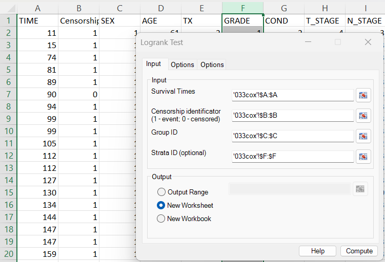
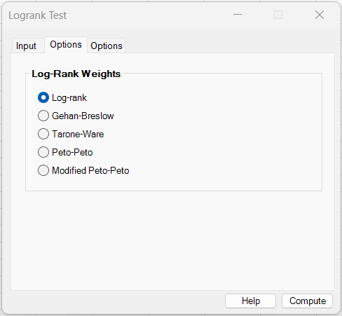
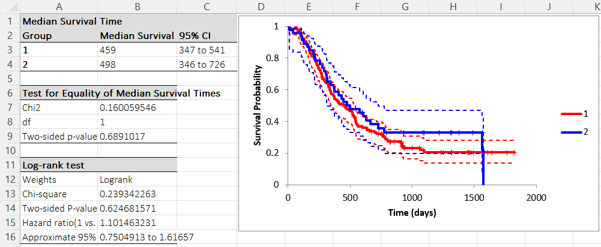
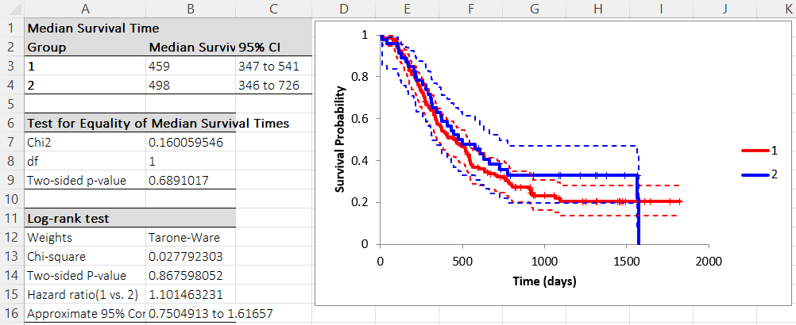

# Logrank Test

**Includes:** Logrank, Tarone–Ware, Gehan–Breslow, Peto, Modified Peto (Andersen).  
**Purpose:** Compare survival curves between groups using logrank-type tests (with several common weightings).

---

## Overview

The log-rank family compares survival curves under the null hypothesis:

**H₀:** all groups have the same survival function.

BESHStatNG implements a weighted log-rank statistic for \(G\) groups (and supports stratification).  
The standard log-rank is the special case \(w_j=1\) at each event time.

In addition to the hypothesis test, this dialog also reports:

- **Median survival time** with a Brookmeyer–Crowley style confidence interval,
- **Test for equality of medians** (Brookmeyer–Crowley median test),
- **Hazard ratio (2 groups)** using an O/E method (computed from the *unweighted* log-rank bookkeeping),
- A **Kaplan–Meier plot** with optional confidence bands at the selected level (same plotting engine as *Kaplan–Meier Plot*).

---

## Example dataset

This example uses the same dataset as the Kaplan–Meier help page, but adds a **strata** variable:

- **TIME** (survival time)
- **Censorship** (1 = event, 0 = censored)
- **SEX** (Group ID)
- **GRADE** (Strata ID)

Download:

- [033cox.csv](../assets/data/033cox/033cox.csv)

---

## Screenshots

> The screenshots below use the default `alpha = 0.05`, so confidence-limit labels appear as `95%` in the example output.

### Input tab


### Options tab (weights)


### Results (Logrank weights)


### Results (Tarone–Ware weights)


---

## When to use it

Use a log-rank-type test when you want to compare **time-to-event** distributions across **two or more groups** under **right censoring**.

Use **stratified** log-rank when you want to compare groups *after controlling for a categorical factor* (e.g., tumor grade, study center). In stratified log-rank, the observed–expected differences are computed within each stratum and then summed across strata.

---

## Inputs in Excel

Required:

- **Survival Times**: numeric survival time (e.g., `'033cox'!$A:$A`)
- **Censorship identifier**: 0/1 indicator (**1 = event**, **0 = censored**) (e.g., `'033cox'!$B:$B`)
- **Group ID**: group membership (e.g., `'033cox'!$C:$C`)

Optional:

- **Strata ID**: stratified log-rank (e.g., `'033cox'!$F:$F`)

Output destination:

- Output range (current sheet)
- New worksheet
- New workbook

---

## Steps in the add-in

1. Ribbon: **BESH Stat NG → Analyse → Survival Analysis → Logrank Test**
2. In **Input**:
   - Select **Survival Times**
   - Select **Censorship identifier**
   - Select **Group ID**
   - Optionally select **Strata ID**
3. In **Options**:
   - Select the weighting method (Logrank, Tarone–Ware, …)
   - Set **Alpha** for median intervals, Kaplan–Meier confidence bands, and the 2-group hazard-ratio interval
4. Click **Compute**

---

## Output

The worksheet output contains:

### A) Median survival time table
For each group:

- **Median Survival Time**: first time where \(\hat S(t) \le 0.5\)
- **Confidence interval at the selected level**: Brookmeyer–Crowley style bounds

(Details are the same as in [Kaplan–Meier Plot](kaplan-meier-plot.md).)

### B) Test for equality of median survival times
A chi-square test of the null hypothesis that all group medians are equal (Brookmeyer–Crowley median test as implemented).  
Reported as:

- **Chi2**
- **df = G − 1**
- **Two-sided p-value**

### C) Log-rank test table
For the selected weighting scheme:

- **Weights**: name of the selected method
- **Chi-square**: the weighted log-rank statistic
- **Two-sided p-value**: \(1 - F_{\chi^2}(\chi^2; \mathrm{df}=G-1)\)

If there are exactly **two groups**, BESHStatNG also reports:

- **Hazard ratio (1 vs. 2)** (O/E method)
- **Approximate confidence interval at the selected level**

**Implementation note:** the hazard ratio and CI are computed from the **unweighted** log-rank bookkeeping (expected events), and therefore can remain the same even when a different weight (e.g., Tarone–Ware) is chosen.

### D) Plot
A Kaplan–Meier plot of group survival curves, with censor marks and confidence bands at the selected level (if enabled in the UI).

---

## What it does (math and implementation details)

### A) Event-time bookkeeping

Let distinct event times be \(t_1 < t_2 < \dots\).  
At each event time \(t_j\):

- \(Y_{gj}\) = number at risk in group \(g\) just before \(t_j\)
- \(d_{gj}\) = number of events in group \(g\) at \(t_j\)
- \(Y_j = \sum_g Y_{gj}\)
- \(d_j = \sum_g d_{gj}\)

Expected events:

$$
E_{gj} = Y_{gj}\frac{d_j}{Y_j}
$$

---

### B) Weighted score vector

Choose a weight \(w_j\). The group-wise score is:

$$
Z_g = \sum_j w_j\,(d_{gj} - E_{gj})
$$

Let \(Z\) be the vector of length \(G\).

---

### C) Variance–covariance matrix

For each event time \(t_j\), define:

$$
c_j = \left(\frac{Y_j-d_j}{Y_j-1}\right)d_j
$$

Variance:

$$
\mathrm{Var}(Z_g)=\sum_j w_j^2
\left(\frac{Y_{gj}}{Y_j}\right)\left(1-\frac{Y_{gj}}{Y_j}\right)c_j
$$

Covariance:

$$
\mathrm{Cov}(Z_g,Z_h)=
-\sum_j w_j^2\left(\frac{Y_{gj}}{Y_j}\right)\left(\frac{Y_{hj}}{Y_j}\right)c_j
\qquad (g\ne h)
$$

---

### D) Test statistic

$$
\chi^2 = Z^{\mathsf{T}}\Sigma^{-1}Z
$$

Degrees of freedom:

$$
\mathrm{df}=G-1
$$

---

### E) Stratified log-rank

If strata \(s=1,\dots,S\) are present, BESHStatNG computes \(Z^{(s)}\) and \(\Sigma^{(s)}\) per stratum and sums them:

$$
Z = \sum_{s=1}^{S} Z^{(s)}
$$

$$
\Sigma = \sum_{s=1}^{S} \Sigma^{(s)}
$$

Then the same quadratic form is applied.

---

## Weighting schemes implemented in BESHStatNG

#### Logrank

$$
w_j = 1
$$

#### Gehan–Breslow (generalized Wilcoxon)

$$
w_j = Y_j
$$

#### Tarone–Ware

$$
w_j = \sqrt{Y_j}
$$

#### Peto–Peto / Prentice (R: `survdiff(rho = 1)`)

**Alternative names:** *Peto–Peto test*, *Peto & Peto modification of the Gehan–Wilcoxon test*, *Peto–Peto–Prentice (PPP)*, *Fleming–Harrington \(G^\rho\) with \(\rho=1\) (and \(\gamma=0\))*.

Let \(\hat S_{\text{pooled}}(t)\) be the **pooled Kaplan–Meier** estimate (computed on the combined sample within each stratum):

$$
\hat S_{\text{pooled}}(t_j) = \prod_{u \le j}\left(1-\frac{d_u}{Y_u}\right)
$$

BESHStatNG uses the **left‑continuous** pooled KM value (just before the events at \(t_j\)) as the weight:

$$
w_j = \hat S_{\text{pooled}}(t_j-) = \prod_{u < j}\left(1-\frac{d_u}{Y_u}\right)
$$

Equivalently, as a recurrence:

$$
S_0 = 1,\qquad
w_j = S_{j-1},\qquad
S_j = S_{j-1}\left(1-\frac{d_j}{Y_j}\right)
$$

#### Modified Peto–Peto (Andersen) / S2

**Alternative names:** *Andersen’s modified Peto–Peto*, *modified Peto–Peto (mPP)*, *S2 weights*.

First define the **Peto–Peto modified survival estimate** (often called **S1**) using a continuity correction:

$$
S_0^{*} = 1,\qquad
S_j^{*} = S_{j-1}^{*}\left(1-\frac{d_j}{Y_j+1}\right)
$$

The **Andersen modification** uses:

$$
w_j = S_j^{*}\,\frac{Y_j}{Y_j+1}
$$

---

## Hazard ratio output (2 groups)

When there are exactly two groups, BESHStatNG reports an **O/E log-rank style hazard ratio**.

Let (using the *unweighted* log-rank bookkeeping):

$$
E_{1} = \sum_j Y_{1j}\frac{d_j}{Y_j},
\qquad
E_{2} = \sum_j Y_{2j}\frac{d_j}{Y_j}
$$

and:

$$
O_1 = \sum_j d_{1j},
\qquad
O_2 = \sum_j d_{2j}
$$

Then:

$$
\widehat{HR} = \frac{O_1/E_1}{O_2/E_2}
$$

Approximate SE and confidence interval:

$$
\mathrm{SE}(\log \widehat{HR}) \approx \sqrt{\frac{1}{E_1}+\frac{1}{E_2}}
$$

$$
\log(\widehat{HR}) \pm z_{1-\alpha/2}\cdot \mathrm{SE}(\log \widehat{HR})
$$

Limits are reported on the HR scale via exponentiation.

In the current survival dialog, **Alpha** is user-selectable. The default is \(\alpha=0.05\), which gives a 95% interval.

---

## Output

BESHStatNG reports:

- weighting method
- \(\chi^2\) statistic
- df \(=G-1\)
- p-value
- for 2 groups: O/E hazard ratio + confidence interval at the selected level

---

## Relationship to R

### Standard (unweighted) log-rank, stratified (closest built-in)

```r
library(survival)

dat <- read.csv("033cox.csv")
dat$SEX   <- factor(dat$SEX)
dat$GRADE <- factor(dat$GRADE)

# Note: BESHStatNG uses 1=event, 0=censored.
fit_lr <- survdiff(Surv(TIME, Censorship) ~ SEX + strata(GRADE), data = dat, rho = 0)
fit_lr

# Peto–Peto / Prentice (R built-in): rho = 1
fit_peto <- survdiff(Surv(TIME, Censorship) ~ SEX + strata(GRADE), data = dat, rho = 1)
fit_peto

# Andersen modified Peto–Peto (S2) is not a survdiff() option.
# One way to reproduce the weights is via survminer (reports S1/S2 weights):
# install.packages("survminer")
library(survminer)
surv_pvalue(survfit(Surv(TIME, Censorship) ~ SEX, data = dat), data = dat, method = "survdiff", weights = "S2")
```

This reproduces the standard (unweighted) log-rank statistic. In R, `survdiff(rho = 1)` corresponds to the **Peto–Peto / Prentice** weights (pooled KM weights). Other weights shown above (Tarone–Ware, Gehan–Breslow, Andersen modified Peto) are not available as direct `survdiff()` options.

---

## Notes

- If any group contains **no events** (all censored), BESHStatNG skips the test (variance becomes singular).
- Correct interpretation depends on correct coding: **1 = event**, **0 = censored**.
- For Kaplan–Meier curve computation details, median CI, and median-equality test derivation, see: [Kaplan–Meier Plot](kaplan-meier-plot.md).

---

## References

- Andersen P.K., Borgan O., Gill R.D., and Keiding N. (1982). Linear nonparametric tests for comparison of counting processes with applications to censored survival data. International Statistical Review 50, 219-258.
- Armitage P., Berry G., Matthews J.N.S. Statistical Methods in Medical Research 4th ed. Wiley-Blackwell, 2002.
- Breslow N.E. (1970) A generalized Kruskal-Wallace test for comparing K samples subjects to unequal patterns of censorship. Biometrika, 57:579-594.
- Gehan E.A. (1965) A generalized Wilcoxon test for comparing arbitrarily singly-censored samples. Biometrics, 52: 203-223.
- Peto R., Peto J. (1972) Asymptotically Efficient Rank Invariant Test Procedures. Journal of the Royal Statistical Society. Series A (General), 135: 185–207.
- Tarone R.E., Ware J. (1977) On distribution free tests of the equality of survival distributions. Biometrika, 64: 156-160.

## See also
- [Kaplan–Meier Plot](kaplan-meier-plot.md)
- [Cox Proportional Hazards Model](cox-regression.md)
- [Home](../index.md)
