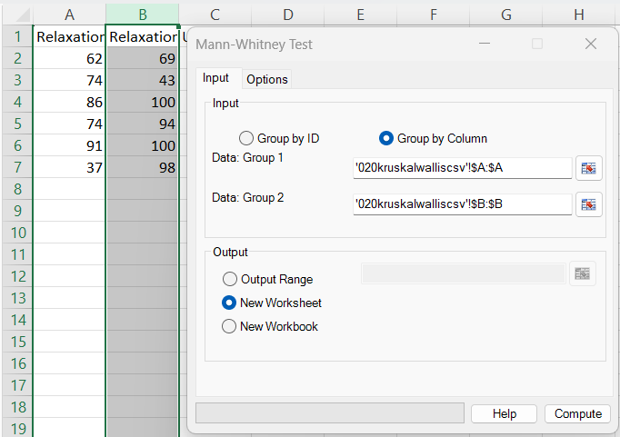
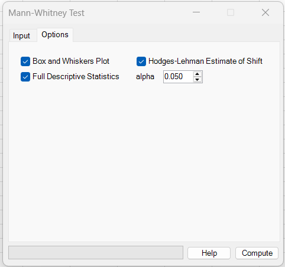
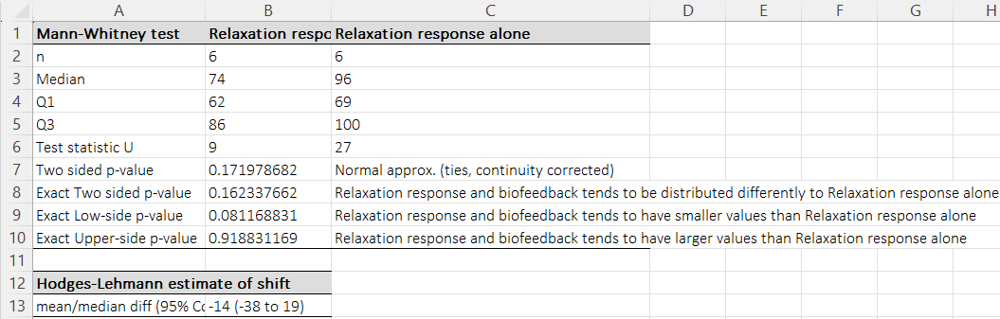

# Mann-Whitney Test

**Includes:** Exact p-values (n ≤ 50), Normal approximation (ties + continuity correction), Hodges–Lehmann estimate of shift + confidence interval at the selected level (optional).  
**Purpose:** Nonparametric alternative to the two-sample t-test for comparing **two independent groups**.

---

## Overview

The Mann–Whitney U test (also called the **Wilcoxon rank-sum test**) compares two independent samples by asking whether one group tends to produce **larger values** than the other.

- It works for **continuous** or **ordinal** outcomes.
- It does **not** assume normality.
- If the two distributions have a similar shape/spread, the result is often interpreted as a difference in **location** (median/shift).

BESHStatNG reports:

- **U statistics** (U₁ and U₂),
- a **two-sided p-value** based on a **normal approximation** (with ties + continuity correction),
- **exact p-values** when available (n ≤ 50),
- optional **Hodges–Lehmann shift estimate** with confidence interval at the selected level.

---

## Example dataset

In the screenshots, the **first two columns** from the dataset below are used as the two groups:

- Column 1: *Relaxation response and biofeedback*
- Column 2: *Relaxation response alone*

Download:

- [020kruskalwalliscsv.csv](../assets/data/020kruskalwallis/020kruskalwalliscsv.csv)

> Only the first two columns are used for this Mann–Whitney example. (The third column is ignored here.)

---

## Screenshots (BESHStatNG)

### Input tab


### Options tab


### Results


---

## When to use it

Use the Mann–Whitney test when:

- you have **two independent groups** (different subjects in each group),
- the outcome is **numeric** or at least **ordinal**,
- you want a robust comparison when normality is questionable and/or outliers are present.

Key requirements / considerations:

- **Independence:** observations are independent within and between groups.
- **Interpretation as “median difference”:** this is most defensible when group distributions have a similar shape/spread; otherwise the test is better described as a test of **stochastic dominance** (one group tends to yield larger values).

---

## Inputs in Excel

BESHStatNG uses the shared “**Group by Column / Group by ID**” dialog (also used for Unpaired t-test and ROC).

### Option A: Group by Column (two ranges)

- **Data: Group 1:** a single-column range for Group 1 values  
- **Data: Group 2:** a single-column range for Group 2 values

Example: two adjacent columns containing the two groups.

### Option B: Group by ID (two columns: group + values)

- **Group ID**: a column containing exactly two group labels (e.g., 1/2 or A/B)
- **Values**: a column containing the numeric measurement

BESHStatNG splits the values by the unique group IDs and runs the test.

### Output destination

- Output range (current sheet)
- New worksheet
- New workbook

---

## Options

On the **Options** tab you can add:

- **Full Descriptive Statistics** — summary statistics per group
- **Box and Whiskers Plot** — Tukey boxplot comparing the two groups
- **Hodges–Lehmann Estimate of Shift** — pseudo-median location shift and confidence interval at the selected level
- **Alpha** — two-sided significance level used for the Hodges–Lehmann confidence interval.  
  Default: **0.05** (95% confidence interval)

---

## Output and how to read it

### Main results table

BESHStatNG writes a “Mann-Whitney test” table containing:

- **n** (sample size per group)
- **Median, Q1, Q3** (quartiles used throughout BESHStatNG)
- **Test statistic U**: reports **U₁** (Group 1) and **U₂** (Group 2)
- **Two sided p-value**: normal approximation (ties + continuity corrected)
- **Exact p-values** (when available): two-sided, low-side (“Group 1 smaller”), upper-side (“Group 1 larger”)

**Example interpretation (from the screenshots):**

- U₁ = 9, U₂ = 27 (n₁ = n₂ = 6)
- Normal-approx two-sided p = 0.171979
- Exact two-sided p = 0.162338
- The direction suggests Group 1 tends to be **smaller**, but p > 0.05 means the evidence is not strong at the 5% level.

### Hodges–Lehmann shift table (optional)

When enabled, BESHStatNG adds a second table:

- **mean/median diff (CI at selected level)**

This is the Hodges–Lehmann estimate of the location shift (Group 1 − Group 2).  
In the example: −14 (−38 to 19), suggesting Group 1 is about 14 units lower, with a wide CI spanning 0.  
The screenshot uses the default `alpha = 0.05`, so the displayed interval is 95%.

---

## What it does (math and implementation details)

Let:

- Group 1 values: \(x_1,\dots,x_{n_1}\)
- Group 2 values: \(y_1,\dots,y_{n_2}\)
- \(n = n_1+n_2\)

### A) Rank-sum and U statistics

Combine all observations and assign ranks \(1,\dots,n\).  
**Ties are given the average rank** (midranks).

Let \(R_1\) be the sum of ranks for Group 1.

\[
U_1 = R_1 - \frac{n_1(n_1+1)}{2},
\qquad
U_2 = n_1n_2 - U_1
\]

BESHStatNG reports both \(U_1\) and \(U_2\), and uses:

\[
U_{\text{obs}} = \min(U_1, U_2)
\]

### Exact p-values (tie-aware; computed by the add-in)

The add-in can compute **exact** Mann–Whitney p-values **even when ties are present**.  
For total sample size **n = n₁ + n₂ ≤ 50**, it uses a **fast exact algorithm** to evaluate the null distribution of the test statistic (based on the exact distribution of the rank-sum / U statistic under all permissible allocations of ranks, including ties).

Because ties slightly change the set of possible rank-sum outcomes (and their probabilities), some software falls back to an asymptotic approximation when ties occur. In contrast, the add-in remains **exact (tie-aware)** within the above sample-size limit.

BESHStatNG reports:

- **Exact low-side p-value:** \(p_\text{low}=P(U \le U_{\text{obs}})\)
- **Exact upper-side p-value:** \(p_\text{up}=P(U > U_{\text{obs}})\)
- **Exact two-sided p-value:** \(p_{2\text{s}}=\min\{1, 2\min(p_\text{low},p_\text{up})\}\)

This matches the “low-side” and “upper-side” textual interpretations in the output table.

### Normal approximation (standard; tie- and continuity-corrected)

The add-in uses the **standard asymptotic normal approximation** for the Mann–Whitney (Wilcoxon rank-sum) statistic, including the **usual tie correction** in the variance and an optional **continuity correction**.  
Minor differences versus other software can occur due to different defaults for the continuity correction and slightly different two-sided p-value conventions.

BESHStatNG always reports an asymptotic (normal) p-value using:

- Mean under \(H_0\): \(\mu_U = \frac{n_1n_2}{2}\)

- Tie correction factor:

\[
C = \frac{\sum_k (t_k^3-t_k)}{n^3-n}
\]

where \(t_k\) are the sizes of tied groups in the *combined* sample.

- Variance:

\[
\sigma_U^2 = \frac{n_1n_2(n+1)}{12}\,(1-C)
\]

- Continuity-corrected Z (BESHStatNG uses \(U_{\text{obs}}\), so Z is negative):

\[
Z = \frac{U_{\text{obs}} - \mu_U + 0.5}{\sigma_U}
\]

Two-sided p-value:

\[
p = 2\,\Phi(-|Z|)
\]

### D) Hodges–Lehmann estimate of shift (optional)

Define all pairwise differences:

\[
d_{ij} = x_i - y_j,\qquad i=1,\dots,n_1,\; j=1,\dots,n_2
\]

The Hodges–Lehmann estimate (pseudo-median shift) is:

\[
\hat{\Delta} = \mathrm{median}\{d_{ij}\}
\]

#### Confidence interval at level \(1-\alpha\)

Let the sorted differences be:

\[
d_{(1)} \le d_{(2)} \le \dots \le d_{(n_1n_2)}
\]

For \(n_1 \le 20\) and \(n_2 \le 20\), BESHStatNG uses an **exact critical value** \(W^*\) from Conover (1999), Table A7 **only when \(\alpha = 0.05\)**, then converts it to:

\[
k = W^* - \frac{n_1(n_1+1)}{2}
\]

and reports:

\[
\text{CI}_{1-\alpha} = \big[d_{(k)},\; d_{(n_1n_2-k+1)}\big]
\]

For larger samples, or for other confidence levels, BESHStatNG uses a normal-approximation index based on \(z_{1-\alpha/2}\) and Excel-style percentiles for the bounds.

---

## R code (reference using standard R functions)

R’s built-in `stats::wilcox.test()` performs the same test (it reports the **rank-sum statistic W**, which can be converted to **U**).
It can also return the **Hodges–Lehmann location shift** and a confidence interval via `conf.int = TRUE`.

```r
# Mann–Whitney / Wilcoxon rank-sum example (using stats::wilcox.test)
dat <- read.csv("020kruskalwalliscsv.csv")

# Group 1 = column 1, Group 2 = column 2
x <- dat[[1]]
y <- dat[[2]]

# Drop missing/non-finite values (BESHStatNG ignores invalid cells)
x <- x[is.finite(x)]
y <- y[is.finite(y)]

n1 <- length(x); n2 <- length(y)

# --- Descriptive stats (quartiles matching BESHStatNG: type = 5) ---
q1 <- quantile(x, probs = c(0.25, 0.5, 0.75), type = 5, names = FALSE)
q2 <- quantile(y, probs = c(0.25, 0.5, 0.75), type = 5, names = FALSE)

# --- Normal approximation p-value (ties + continuity correction) ---
# (forces asymptotic calculation, even when an exact p-value is available)
wt_norm <- wilcox.test(x, y,
                       alternative = "two.sided",
                       exact = FALSE,     # force normal approximation
                       correct = TRUE)    # continuity correction
p_norm_2s <- wt_norm$p.value

# --- Exact p-values (when R can compute them) ---
# Note: R only computes an *exact* p-value when there are no ties.
wt_2s  <- wilcox.test(x, y, alternative = "two.sided", exact = TRUE, correct = TRUE)
wt_low <- wilcox.test(x, y, alternative = "less",      exact = TRUE, correct = TRUE)    # Group 1 smaller
wt_up  <- wilcox.test(x, y, alternative = "greater",   exact = TRUE, correct = TRUE)    # Group 1 larger

p_exact_2s <- wt_2s$p.value
p_low      <- wt_low$p.value
p_up       <- wt_up$p.value

# --- Convert W (rank-sum) to U to match BESHStatNG output ---
W  <- as.numeric(wt_2s$statistic)               # Wilcoxon rank-sum statistic (sum of ranks for Group 1)
U1 <- W - n1 * (n1 + 1) / 2
U2 <- n1 * n2 - U1

# --- Hodges–Lehmann shift estimate + CI (package method) ---
alpha <- 0.05   # current dialog default; use 0.10 for a 90% CI

wt_hl <- wilcox.test(x, y,
                     alternative = "two.sided",
                     exact = TRUE,
                     correct = TRUE,
                     conf.int = TRUE,
                     conf.level = 1 - alpha)
hl    <- unname(wt_hl$estimate)                 # HL (pseudo-median) shift (Group 1 - Group 2)
hl_ci <- unname(wt_hl$conf.int)                 # CI for HL shift
```

### Why R results may be slightly different from BESHStatNG

- **Exact p-values with ties:** `wilcox.test(..., exact = TRUE)` computes an exact p-value only when there are **no ties** in the pooled data.  
  If ties are present, R will typically issue a warning and return an **asymptotic** p-value instead, while BESHStatNG may still report its own “exact” result for small \(n\) (based on its internal algorithm).

- **Continuity correction details:** both use a continuity correction, but implementations can differ subtly (e.g., whether the correction is applied to \(W\) vs \(U\), and how the sign is chosen for two-sided tests).  
  These differences usually change p-values only in the **third or later decimal place**.

- **Hodges–Lehmann CI method:** BESHStatNG’s small-sample CI uses Conover’s tabulated critical values (and an internal index conversion), whereas R inverts the Wilcoxon distribution as implemented in `wilcox.test()`.  
  The HL **point estimate** is typically the same, but the **CI bounds** can differ by one step in the ordered pairwise differences.

!!! tip "Quartiles in R"
    BESHStatNG uses the **CDF method (SAS Method 5)** for quartiles.  
    To match its \(Q_1\), Median and \(Q_3\) in R, use `quantile(..., type = 5)` (as shown above).

---

## Notes

- **Invalid / missing cells:** empty cells, text, logical values, and Excel error values are ignored during data import (only numeric values are used).
- **Exact results availability:** BESHStatNG computes exact p-values when the total sample size \(n \le 50\). Otherwise it reports the normal approximation.
- **Effect size (optional reporting):** a simple “common language” effect size is \(U_1/(n_1n_2)\), interpretable as the estimated probability that a random Group 1 observation exceeds a random Group 2 observation (with midrank handling for ties).

---

## See also

- [Unpaired (two sample) T tests](unpaired-two-sample-t-tests.md)
- [Box and Whiskers](box-and-whiskers.md)
- [Descriptive Statistics](descriptive-statistics.md)

