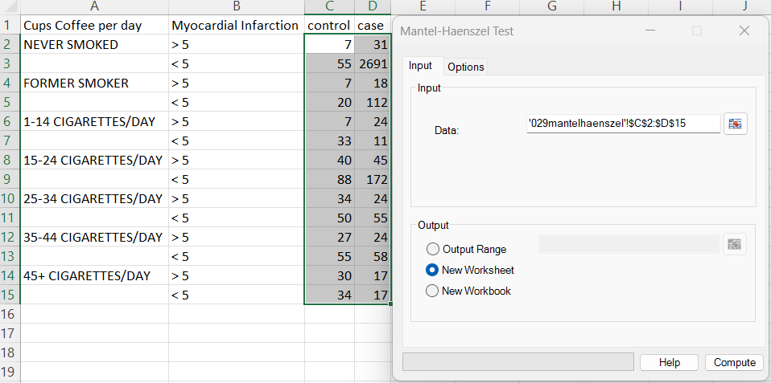
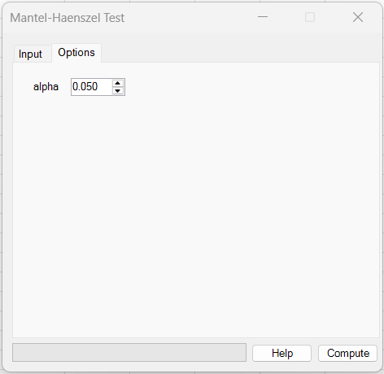
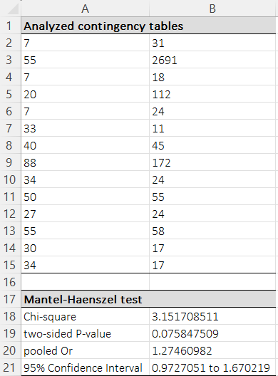

# Mantel-Haenszel Test

**Includes:** Mantel–Haenszel chi-square test (stratified 2×2), pooled odds ratio (common OR) + confidence interval at the selected level.  
**Purpose:** Combine multiple **stratified** 2×2 tables to estimate a pooled association while controlling for a stratification factor.

---

## Overview

The Mantel–Haenszel (MH) procedure is used when your data consist of **multiple 2×2 tables**, one per stratum (layer), and you want to:

- test whether there is an overall association between two binary variables **after adjusting for** the stratification variable, and
- estimate a **pooled (common) odds ratio** across strata.

Typical examples:

- Exposure vs outcome, stratified by age group / clinic / smoking category.
- Case–control association, stratified by a confounder.

BESHStatNG reports:

- the **Mantel–Haenszel chi-square** statistic (df = 1) and two-sided p-value
- the **pooled odds ratio** and its confidence interval at the selected level

---

## Example dataset

Download the dataset used in the screenshots:

- [029mantelhaenszel.csv](../assets/data/029mantelhaenszel/029mantelhaenszel.csv)

This example compares coffee consumption (>5 cups/day vs <5) between myocardial infarction **cases** and **controls**, stratified by smoking category.

---

## Screenshots (BESHStatNG)

### Input tab


### Options tab


### Results sheet


---

## When to use it

Use the Mantel–Haenszel test when:

- you have **K strata** (K ≥ 2) of a 2×2 table,
- each stratum represents a level of a confounder or blocking factor,
- you want a single overall association test and a pooled odds ratio.

Assumptions / notes:

- The MH pooled OR is most meaningful when the stratum-specific odds ratios are reasonably similar (no strong effect modification).
- For very sparse data or extreme imbalance, exact or model-based methods may be preferable.

---

## Inputs in Excel

### Data layout

BESHStatNG expects **multiple 2×2 tables stacked vertically** in a 2-column range:

- Each *pair of consecutive rows* is one 2×2 table (one stratum).
- There must be an **even** number of rows.
- The range must have **exactly two columns** (top-left cell counts, top-right cell counts).

For stratum \(k\), the add-in reads:

- Row 1: \([a_k,\; b_k]\)
- Row 2: \([c_k,\; d_k]\)

So the stratum table is:

\[
\begin{pmatrix}
a_k & b_k \\
c_k & d_k
\end{pmatrix}.
\]

> Tip: You can keep labels in adjacent columns (as in the screenshot). The selected **numeric range** should include only the two count columns.

### Steps in the add-in

1. In Excel ribbon: **BESH Stat NG → Analyse → Contingency Table Analysis → Mantel–Haenszel Test**
2. Select the **2-column** stacked table range.
3. On the **Options** tab, set **Alpha** for the pooled odds-ratio confidence interval.  
   Default: **0.05** (95% confidence interval).
4. Choose output location (new worksheet/workbook or output range).
5. Click **Compute**.

The only additional option for this method is **Alpha**, which controls the confidence level for the pooled odds-ratio interval.

---

## Output (how to read it)

BESHStatNG writes:

1) **Analyzed contingency tables**  
   The stacked counts are echoed back so you can verify the input.

2) **Mantel–Haenszel test**  
   - **Chi-square**: the MH test statistic (df = 1)  
   - **two-sided P-value**: \(P(\chi^2_1 \ge \chi^2_{\mathrm{MH}})\)

3) **Pooled OR** and confidence interval at the selected level  
   - **pooled Or**: the Mantel–Haenszel common odds ratio estimate  
   - **CI**: log-scale normal approximation interval, exponentiated back

For the example dataset:

- \(\chi^2_{\mathrm{MH}} \approx 3.1517085\), p ≈ 0.0758475  
- pooled OR ≈ 1.2746098  
- 95% CI ≈ 0.9727002 to 1.6702270 (default `alpha = 0.05` in the screenshot example)

---

## What it does (math and implementation details)

Let there be \(K\) strata. For stratum \(k\):

\[
\begin{pmatrix}
a_k & b_k \\
c_k & d_k
\end{pmatrix},
\qquad
n_k = a_k + b_k + c_k + d_k.
\]

### 1) Zero-cell correction (continuity correction)

If **any** cell in a stratum is zero, BESHStatNG applies a Haldane–Anscombe correction to that stratum to avoid infinite OR/undefined SE:

\[
a_k \leftarrow a_k + 0.5,\;
b_k \leftarrow b_k + 0.5,\;
c_k \leftarrow c_k + 0.5,\;
d_k \leftarrow d_k + 0.5.
\]

This avoids division-by-zero and infinite odds ratios.

### 2) Mantel–Haenszel chi-square test

Under the null hypothesis of no association within strata (conditional independence), the expected value of \(a_k\) given fixed margins is:

\[
E(a_k) = \frac{(a_k+b_k)(a_k+c_k)}{n_k}.
\]

The corresponding variance term used by the add-in is:

\[
\operatorname{Var}(a_k) =
\frac{(a_k+b_k)(c_k+d_k)(a_k+c_k)(b_k+d_k)}
     {n_k^2\,(n_k-1)}.
\]

BESHStatNG computes:

\[
S = \sum_{k=1}^{K}\left(a_k - E(a_k)\right),
\qquad
V = \sum_{k=1}^{K}\operatorname{Var}(a_k),
\]

and reports the (continuity-corrected) MH statistic:

\[
\chi^2_{\mathrm{MH}} =
\frac{\left(|S| - 0.5\right)^2}{V}.
\]

The p-value is computed from a chi-square distribution with 1 degree of freedom:

\[
p = 1 - F_{\chi^2_1}\left(\chi^2_{\mathrm{MH}}\right).
\]

### 3) Pooled (common) odds ratio

The Mantel–Haenszel pooled odds ratio estimate is:

\[
\widehat{\theta}_{\mathrm{MH}} =
\frac{\sum_{k=1}^{K}\frac{a_k d_k}{n_k}}
     {\sum_{k=1}^{K}\frac{b_k c_k}{n_k}}.
\]

### 4) Confidence interval for the pooled OR at level \(1-\alpha\) (Wald CI on the log scale)

Note: results may differ slightly from other software due to different variance formulas and zero-cell handling.

Define:

\[
R = \sum_{k=1}^{K}\frac{a_k d_k}{n_k},
\qquad
S = \sum_{k=1}^{K}\frac{b_k c_k}{n_k}.
\]

The add-in computes three auxiliary sums:

\[
s_1 = \sum_{k=1}^{K}\left(\frac{a_k+d_k}{n_k}\right)\left(\frac{a_k d_k}{n_k}\right),
\]

\[
s_2 = \sum_{k=1}^{K}\left[\left(\frac{a_k+d_k}{n_k}\right)\left(\frac{b_k c_k}{n_k}\right)
+\left(\frac{b_k+c_k}{n_k}\right)\left(\frac{a_k d_k}{n_k}\right)\right],
\]

\[
s_3 = \sum_{k=1}^{K}\left(\frac{b_k+c_k}{n_k}\right)\left(\frac{b_k c_k}{n_k}\right).
\]

Then the variance of \(\log(\widehat{\theta}_{\mathrm{MH}})\) is estimated as:

\[
\widehat{\operatorname{Var}}\left[\log(\widehat{\theta}_{\mathrm{MH}})\right]
=
\frac{1}{2}
\left(
\frac{s_1}{R^2} + \frac{s_2}{RS} + \frac{s_3}{S^2}
\right).
\]

Finally, BESHStatNG reports the confidence interval using the two-sided normal critical value \(z_{1-\alpha/2}\):

\[
\left[
\exp\left(\log\widehat{\theta}_{\mathrm{MH}} - z_{1-\alpha/2}\sqrt{\widehat{\operatorname{Var}}}\right),
;
\exp\left(\log\widehat{\theta}_{\mathrm{MH}} + z_{1-\alpha/2}\sqrt{\widehat{\operatorname{Var}}}\right)
\right].
\]

In the current production UI, **Alpha** is user-selectable. The screenshots shown here use the default \(\alpha=0.05\), so the example output shows a 95% CI.

---

## R code (reference implementation)

### A) Using `stats::mantelhaen.test`

This reproduces the MH chi-square, p-value, pooled OR and CI for the same stacked-table layout.

```r
# Read the CSV (contains labels + counts)
dat <- read.csv("029mantelhaenszel.csv")

# Extract the stacked 2-column count matrix (control, case)
counts <- as.matrix(dat[, c("control", "case")])

# Convert stacked rows into a 2x2xK array
K <- nrow(counts) / 2
x <- array(NA, dim = c(2, 2, K))
for (k in 1:K) {
  x[1, , k] <- counts[2*k - 1, ]  # row 1: a, b
  x[2, , k] <- counts[2*k, ]      # row 2: c, d
}

# Mantel–Haenszel test (with continuity correction to match BESHStatNG)
res <- stats::mantelhaen.test(x, correct = TRUE)
res
res$estimate      # common odds ratio
res$conf.int      # CI at the selected level (95% when alpha = 0.05)
```

### B) Matching BESHStatNG exactly (including zero-cell correction)

If any stratum contains a zero cell, BESHStatNG adds 0.5 to all four cells in that stratum before computing OR/CI. The code below applies the same rule:

```r
for (k in 1:K) {
  if (any(x[, , k] == 0)) x[, , k] <- x[, , k] + 0.5
}
stats::mantelhaen.test(x, correct = TRUE)
```

### Expected differences vs R

- **Continuity correction:** BESHStatNG uses the continuity-corrected statistic \((|S|-0.5)^2/V\).  
  In R, set `correct=TRUE` (default) to match; `correct=FALSE` will give a slightly different chi-square/p-value.
- **Zero cells:** if any stratum has a zero count, BESHStatNG applies a 0.5 correction to that whole stratum for OR/CI. Some R workflows do not do this automatically (or use different corrections), so OR/CI may differ in sparse tables.

---

## See also

- [2×2 Table](2x2-table.md)
- [Home](../index.md)
