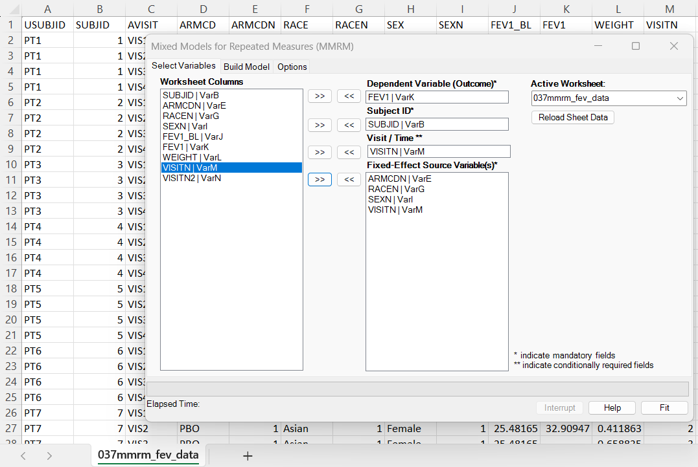

# Mixed Models for Repeated Measures (MMRM)

**Includes:** Gaussian marginal repeated-measures model, subject-level residual covariance structures, ML and REML fitting, large-sample / residual-DF / between-within / Satterthwaite / Kenward-Roger inference, LS-means, treatment contrasts, change from baseline, difference in change, fitted values, residuals, covariance matrices, convergence diagnostics, and worksheet functions.  
**Purpose:** Fit a modern marginal model for continuous longitudinal outcomes where the mean model is specified through fixed effects and the within-subject correlation is modeled directly.

---

## Overview

A **mixed model for repeated measures (MMRM)** is a likelihood-based model for continuous outcomes measured repeatedly on the same subject. It is widely used in clinical trials, biomedical studies, and other longitudinal analyses where the main questions are usually visit-specific adjusted means, treatment differences, changes from baseline, or differences in change from baseline.

MMRM has two main parts:

1. a **fixed-effect mean model**, which describes the expected response using variables such as treatment group, visit, baseline value, sex, race, region, stratification factors, and treatment-by-visit interaction;
2. a **within-subject covariance model**, which describes how repeated measurements from the same subject are correlated.

For subject \(i\), the model can be written as:

\[
y_i = X_i\beta + \varepsilon_i,
\qquad
\varepsilon_i \sim N\{0, R_i(\theta)\},
\]

where \(y_i\) is the vector of observed responses for that subject, \(X_i\) is the fixed-effect design matrix, \(\beta\) is the vector of fixed-effect coefficients, and \(R_i(\theta)\) is the selected within-subject covariance matrix.

The user-facing BESH Stat NG MMRM workflow does **not** require users to specify random effects. The method focuses on the repeated-measures marginal model and the covariance pattern among repeated observations.

!!! tip "Practical interpretation"
    Use MMRM when you want to compare adjusted group means over time while accounting for the fact that repeated measurements from the same subject are correlated and may be incomplete.

---

## Why MMRM is important

MMRM is one of the standard approaches for continuous longitudinal endpoints, especially in confirmatory clinical-trial settings. It is useful because it combines a familiar regression-style fixed-effect model with a realistic model for within-subject correlation.

Key practical advantages are:

- **uses all retained observed responses** instead of requiring every subject to have every visit;
- **models within-subject correlation directly**, avoiding the independence assumption of ordinary linear regression;
- **supports flexible visit-specific treatment effects** through treatment-by-visit interactions;
- **provides adjusted marginal estimates**, such as LS-means and treatment differences at each visit;
- **supports small-sample denominator degrees-of-freedom methods**, including Satterthwaite and Kenward-Roger;
- **matches common clinical-reporting workflows**, including change from baseline and difference in change from baseline.

MMRM is therefore more than a technical mixed-model option. It is a practical analysis framework for answering longitudinal questions such as:

- What is the adjusted mean response in each treatment group at each visit?
- What is the treatment difference at the primary visit?
- How much did each group change from baseline?
- Is the treatment effect consistent or different across visits?
- Are conclusions robust to the selected covariance structure?

---

## When to use MMRM

MMRM is usually appropriate when all of the following are true:

| Requirement | Meaning |
|---|---|
| Continuous outcome | The response is approximately continuous, such as FEV1, biomarker concentration, clinical score, or laboratory value. |
| Repeated measurements | Each subject can contribute multiple rows, usually one row per scheduled visit or time point. |
| Subject-level correlation | Measurements from the same subject are expected to be correlated. |
| Fixed-effect scientific question | The main targets are adjusted means, treatment differences, or visit-specific contrasts rather than subject-specific random-effect estimates. |
| Missing visits may occur | Some subjects may miss visits or discontinue, but retained observed responses should still contribute to the likelihood. |

MMRM is not limited to clinical trials, but the clinical-trial use case is the most common. The typical model includes treatment, visit, treatment-by-visit interaction, baseline value, and important stratification or prognostic factors.

!!! warning "Missing data assumption"
    Standard likelihood-based MMRM uses the observed data under assumptions commonly summarized as missing at random, conditional on the variables included in the model. This is an analysis assumption, not a guarantee created by the software. Sensitivity analyses may still be needed in regulated or high-stakes analyses.

---

## When not to use MMRM

MMRM is not the best choice for every repeated-measures problem.

Consider another method when:

- the outcome is binary, count, ordinal, or time-to-event rather than continuous;
- the scientific target is subject-specific random effects or individual trajectories;
- there are many irregular observation times and a parametric time trend or random-slope model is the main interest;
- the number of visits is large relative to the amount of data and an unstructured covariance matrix cannot be estimated reliably;
- the analysis requires a non-Gaussian marginal model, where [Generalized Estimating Equations (GEE)](generalized-estimating-equations-gee.md) or another generalized model may be more appropriate.

For normally distributed repeated outcomes, MMRM is often preferable to a simple repeated-measures ANOVA because it handles incomplete repeated measurements more naturally and allows more flexible covariance structures.

---

## BESH Stat NG workflow

In Excel ribbon:

**BESH Stat NG → Analyse → Regression → Mixed Models for Repeated Measures (MMRM)**

A typical ribbon analysis has this workflow:

1. Arrange the dataset in **long format**, with one row per subject and visit.
2. Select the continuous response variable.
3. Select the subject ID variable.
4. Select the visit or within-subject ordering variable.
5. Build the fixed-effect model using continuous predictors, categorical factors, and interactions.
6. Choose the covariance structure, estimation method, and inference method.
7. Request LS-means, contrasts, fitted values, residuals, and other output as needed.
8. Review convergence, covariance estimates, fixed effects, LS-means, contrasts, and residual diagnostics.

The full step-by-step guide is available in [Excel ribbon workflow](mmrm/user-interface.md).

---

## Example used throughout the MMRM documentation

The MMRM pages use the FEV1 example dataset included with this help project:

- [037mmrm_fev_data.csv](../assets/data/037mmrm/037mmrm_fev_data.csv)
- [037mmrm_fev_results.xlsx](../assets/data/037mmrm/037mmrm_fev_results.xlsx)

The dataset is in long format. The response is `FEV1`, the subject identifier is `USUBJID`, the scheduled visit is represented by `AVISIT` and `VISITN`, and the main grouping variable is `ARMCD`.

The example model is a treatment-by-visit MMRM with additional categorical factors:

\[
\text{FEV1} \sim \text{RACE} + \text{SEX} + \text{ARMCD} \times \text{AVISIT}.
\]

The repeated measurements are grouped by `USUBJID`, ordered by visit, and modeled with an **unstructured** within-subject covariance matrix in the supplied result workbook.

This example is used to illustrate data shape, dialog setup, model specification, LS-means, treatment contrasts, change-from-baseline summaries, covariance output, fit statistics, and reproducibility checks.

---

## Recommended starting settings

The best settings depend on the study protocol and analysis objective, but the following combination is a common starting point for a planned clinical-trial-style MMRM:

| Setting | Common starting choice | Why |
|---|---|---|
| Estimation method | REML | Standard choice for covariance estimation and small-sample fixed-effect inference. |
| Inference method | Kenward-Roger or Satterthwaite | Adjusts fixed-effect standard errors and/or denominator degrees of freedom. |
| Covariance structure | Unstructured | Most flexible when the number of visits and sample size support it. |
| Fixed effects | Treatment, visit, treatment × visit, baseline, important stratification factors | Directly supports visit-specific treatment comparisons. |
| Primary output | LS-means and contrasts by visit | Gives adjusted group means and treatment differences in an interpretable form. |

If the unstructured covariance does not converge or is not supported by the data, consider a simpler covariance structure such as heterogeneous compound symmetry, compound symmetry, heterogeneous AR(1), AR(1), Toeplitz, heterogeneous Toeplitz, or diagonal heterogeneous covariance. See [Options and output reference](mmrm/options-and-output.md) for details.

---

## Main outputs

The MMRM output workbook is designed to support both practical interpretation and statistical review.

| Output area | What it tells you |
|---|---|
| Model information | Which variables, estimation method, inference method, covariance structure, and data counts were used. |
| Fixed effects | Estimated model coefficients, standard errors, test statistics, confidence intervals, and p-values. |
| Type III tests | Term-level tests for fixed effects such as treatment, visit, and treatment-by-visit interaction. |
| Covariance parameters | Estimated variances, covariances, correlations, and covariance-structure parameters. |
| LS-means | Adjusted marginal means for selected visits and groups. |
| Contrasts | Group differences, visit-specific differences, change from baseline, and difference in change. |
| Fit statistics | Log-likelihood, information criteria, and related model-fit summaries. |
| Convergence diagnostics | Whether the optimizer reached a stable solution and whether warnings require attention. |
| Fitted values and residuals | Row-level predictions and residuals for diagnostics and export. |

For detailed interpretation of every output block, see [Options and output reference](mmrm/options-and-output.md). For estimand-focused interpretation, see [LS-means, contrasts, and estimands](mmrm/lsmeans-and-contrasts.md).

---

## Worksheet-function workflow

Users who prefer reproducible worksheet formulas can use the `BESH.REGR.MMRM_*` function family. The usual pattern is:

1. fit the model and return a reusable handle;
2. extract coefficient, Type III, covariance, fit-statistic, LS-mean, contrast, fitted-value, or residual tables from that handle;
3. optionally define custom linear estimates through the LS-mean estimate function.

The full method-oriented worksheet guide is in [Worksheet functions](mmrm/worksheet-functions.md). The generated syntax reference starts at [BESH.REGR.MMRM_FIT](../udf/regression-models.md#beshregrmmrm_fit).

---

## How this documentation is organized

The MMRM documentation is split into focused pages so that practical users can work through examples while expert users can inspect the model mathematics and implementation rationale.

| Page | Audience | Use it for |
|---|---|---|
| [Concepts and use cases](mmrm/concepts-and-use-cases.md) | All users | Understanding what MMRM is, when it is useful, and how the data should be arranged. |
| [Model and mathematics](mmrm/model-and-mathematics.md) | Statistical users | Formal model definition, likelihood, REML, covariance structures, hypothesis tests, and degrees-of-freedom methods. |
| [Excel ribbon workflow](mmrm/user-interface.md) | Practical users | Running MMRM from the dialog and understanding the main workflow. |
| [Options and output reference](mmrm/options-and-output.md) | All users | Choosing options and interpreting output tables, warnings, and diagnostics. |
| [LS-means, contrasts, and estimands](mmrm/lsmeans-and-contrasts.md) | Trial and applied users | Interpreting adjusted means, treatment differences, change from baseline, and custom estimands. |
| [Worksheet functions](mmrm/worksheet-functions.md) | Excel power users | Building reproducible MMRM analyses with worksheet formulas. |
| [Implementation details](mmrm/implementation-details.md) | Advanced users | Understanding numerical design choices, safeguards, and reproducibility logic. |
| [Comparison with other software](mmrm/software-comparison.md) | Validation users | Aligning BESH Stat NG output with SAS, R `mmrm`, and other software. |
| [Examples and interpretation](mmrm/examples.md) | Practical users | Worked examples and interpretation templates. |

Recommended reading paths:

- **New practical users:** start with [Concepts and use cases](mmrm/concepts-and-use-cases.md), then [Excel ribbon workflow](mmrm/user-interface.md), then [Examples and interpretation](mmrm/examples.md).
- **Statisticians and reviewers:** read [Model and mathematics](mmrm/model-and-mathematics.md), [Options and output reference](mmrm/options-and-output.md), and [LS-means, contrasts, and estimands](mmrm/lsmeans-and-contrasts.md).
- **Validation and reproducibility users:** read [Implementation details](mmrm/implementation-details.md) and [Comparison with other software](mmrm/software-comparison.md).
- **Worksheet users:** read [Worksheet functions](mmrm/worksheet-functions.md) and the generated [Regression Models UDF reference](../udf/regression-models.md#beshregrmmrm_fit).

---

## Relationship to related methods

| Method | Main target | How it differs from MMRM |
|---|---|---|
| Ordinary linear regression | Independent continuous outcomes | Does not model within-subject correlation. |
| Repeated-measures ANOVA | Balanced repeated continuous outcomes | Usually less flexible for missing visits and covariance structures. |
| [GEE](generalized-estimating-equations-gee.md) | Marginal mean models for correlated data | Handles several outcome families and uses working correlation; MMRM is likelihood-based Gaussian repeated-measures modeling. |
| [GLM](generalized-linear-models-glm.md) | Independent non-normal or normal outcomes | Does not handle subject-level repeated-measures correlation in the same way. |
| Random-effects LMM | Subject-specific random effects and trajectories | MMRM in this release exposes a marginal repeated-measures workflow without user-specified random effects. |

---

## Before reporting an MMRM result

Before using MMRM output in a report, check that:

- the data are in long format with a valid subject ID and visit variable;
- the response is continuous and measured on a comparable scale across visits;
- categorical variables have the intended reference levels;
- the fixed-effect model matches the study objective or analysis plan;
- the covariance structure converged and is appropriate for the number of visits and amount of data;
- the chosen denominator degrees-of-freedom method is appropriate for the analysis;
- LS-means and contrasts are defined in the intended direction;
- missing data assumptions and sensitivity analyses have been considered;
- warnings and convergence diagnostics have been reviewed.

---

## See also

- [Concepts and use cases](mmrm/concepts-and-use-cases.md)
- [Model and mathematics](mmrm/model-and-mathematics.md)
- [Excel ribbon workflow](mmrm/user-interface.md)
- [Options and output reference](mmrm/options-and-output.md)
- [LS-means, contrasts, and estimands](mmrm/lsmeans-and-contrasts.md)
- [Worksheet functions](mmrm/worksheet-functions.md)
- [Regression formula syntax](../udf/regression-formula-syntax.md)
- [Regression Models UDF reference](../udf/regression-models.md#beshregrmmrm_fit)
