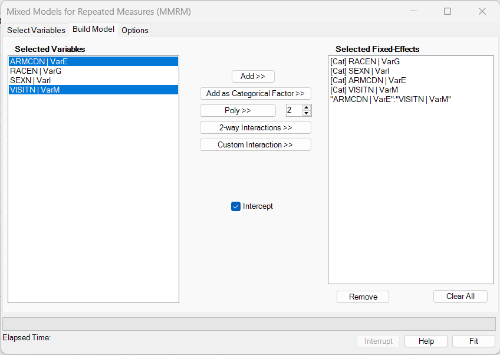
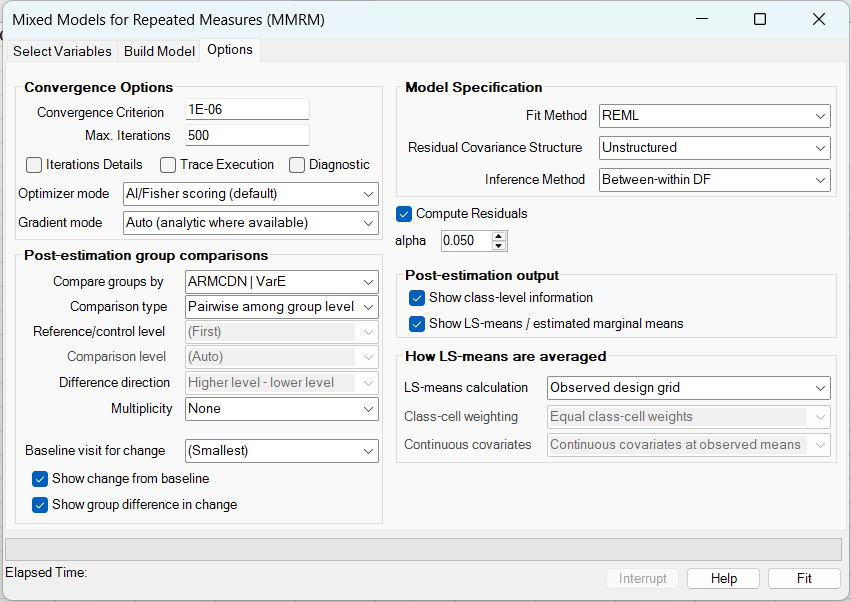
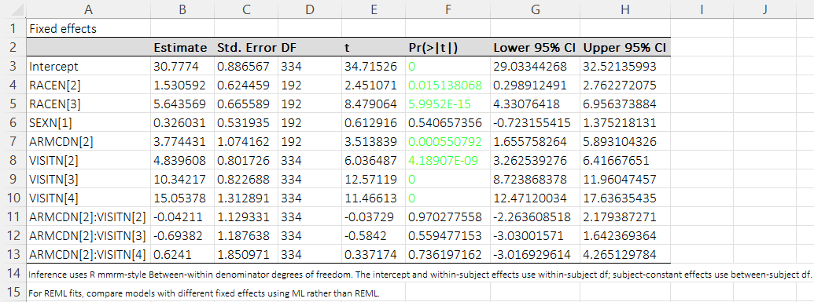
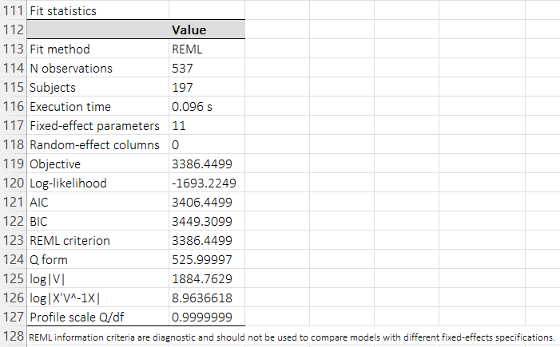
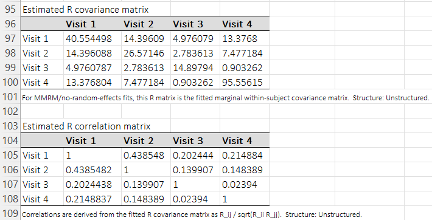

# MMRM examples and interpretation

[← Back to MMRM overview](../mixed-models-for-repeated-measures-mmrm.md)

**Purpose of this page:** provide complete worked examples for the BESH Stat NG MMRM workflow. The examples use the same FEV1 dataset and result workbooks that are distributed with this help project. They show how to fit the model, how to read the main output tables, how to interpret LS-means and contrasts, and how to extend the analysis with worksheet functions.

For background and mathematical details, see [MMRM concepts and use cases](concepts-and-use-cases.md), [Model and mathematics](model-and-mathematics.md), [Options and output](options-and-output.md), and [LS-means and contrasts](lsmeans-and-contrasts.md).

---

## Files used in these examples

The examples use the following files:

| File | Purpose |
|---|---|
| [037mmrm_fev_data.csv](../../assets/data/037mmrm/037mmrm_fev_data.csv) | Long-format FEV1 example dataset. |
| [037mmrm_fev_results.xlsx](../../assets/data/037mmrm/037mmrm_fev_results.xlsx) | BESH Stat NG output workbook from the ribbon analysis. |
| [037mmrm_fev_data_udfs.xlsx](../../assets/data/037mmrm/037mmrm_fev_data_udfs.xlsx) | Worksheet-function workbook that fits the same model and demonstrates a custom LS-mean estimate using `BESH.REGR.MMRM_LSMESTIMATE`. |

The dataset contains 800 source rows: 200 subjects measured over four scheduled visits. The response variable `FEV1` is missing for some subject-visit rows. The fitted model uses the 537 non-missing FEV1 observations from 197 subjects.

| Quantity | Value |
|---|---:|
| Source rows | 800 |
| Subjects in source dataset | 200 |
| Scheduled visits | 4 |
| Non-missing FEV1 observations used in fit | 537 |
| Subjects with at least one non-missing FEV1 value | 197 |
| Subjects complete at all four visits | 39 |

!!! note "Baseline in these examples"
    The examples use **Visit 1** as the baseline visit when computing change from baseline. The dataset also contains a column named `FEV1_BL`. That column is part of the example dataset, but the main model reproduced here follows the OpenPharma-style example formula and does not include `FEV1_BL` as a covariate.

---

## Example 1: fit the FEV1 repeated-measures model

### Goal

Fit an MMRM to estimate visit-specific adjusted means and treatment differences for FEV1 while accounting for correlation among repeated observations from the same subject.

The example model is:

\[
\operatorname{E}(\text{FEV1}) =
\text{RACE} + \text{SEX} + \text{ARMCD} + \text{VISIT} +
\text{ARMCD}\times\text{VISIT}.
\]

The within-subject covariance matrix is unstructured across the four visits.

### Data columns

| Role in model | Dataset column | Notes |
|---|---|---|
| Subject ID | `USUBJID` or `SUBJID` | Identifies repeated records from the same subject. The result workbook reports 197 subjects with usable response data. |
| Response | `FEV1` | Continuous repeated outcome. Missing values are allowed and are omitted from the likelihood contribution for that subject-visit row. |
| Visit / time | `VISITN` | Numeric visit order: 1, 2, 3, 4. |
| Visit factor | `AVISIT` or `VISITN` as factor | Used to estimate visit-specific means. |
| Treatment group | `ARMCD` or `ARMCDN` | `PBO` / `TRT`, or numeric-coded `1` / `2`. |
| Additional factors | `RACE`, `SEX` or coded equivalents | Included as adjustment factors. |

The observed non-missing FEV1 counts by visit and treatment group are:

| Visit | PBO observed | TRT observed | Total observed |
|---|---:|---:|---:|
| VIS1 | 68 | 66 | 134 |
| VIS2 | 69 | 71 | 140 |
| VIS3 | 71 | 58 | 129 |
| VIS4 | 67 | 67 | 134 |

### Ribbon workflow

Open the dialog from:

**BESH Stat NG → Analyse → Regression → Mixed Models for Repeated Measures (MMRM)**


Use the **Select Variables** tab to assign the response, subject ID, visit/order variable, and model variables. Then use **Build Model** to add the fixed effects and the treatment-by-visit interaction.



Use the following analysis options:

| Option | Setting used in example | Reason |
|---|---|---|
| Estimation method | REML | Standard choice for covariance estimation in this example. |
| Covariance structure | Unstructured | Allows each visit variance and each visit-pair covariance to be estimated separately. |
| Fixed-effect DF method | Between-within in the supplied ribbon result workbook | Matches the main result workbook used in this example. |
| Grouping factor for LS-means/contrasts | Treatment group (`ARMCDN`) | Produces visit-by-treatment LS-means and treatment differences at each visit. |
| Baseline visit for change tables | Visit 1 | Produces change from Visit 1 and difference in change from Visit 1. |



### Fit summary

The result workbook reports:

| Result item | Value |
|---|---:|
| Fit method | REML |
| Observations used | 537 |
| Subjects used | 197 |
| Fixed-effect parameters | 11 |
| Log-likelihood | -1693.225 |
| AIC | 3406.450 |
| BIC | 3449.310 |
| Convergence iterations | 7 |

The workbook also reports an execution time of 0.096 seconds for this specific run. Treat that as a run-specific diagnostic, not as a general benchmark; speed depends on hardware, Excel state, model size, covariance structure, and requested output.

### First interpretation

The fitted model describes the adjusted FEV1 mean as a function of race, sex, treatment group, visit, and the treatment-by-visit interaction. Because an unstructured covariance matrix is used, the model does not force the correlations to follow a simple pattern over time. Each subject contributes the observed visits available for that subject.

---

## Example 2: interpret LS-means by visit and treatment group

The **Estimated marginal means by visit and ARMCDN** table gives adjusted means for each visit-treatment combination. In this dataset, `ARMCDN=1` is placebo and `ARMCDN=2` is treatment.

| Visit and group | N | Estimate | Std. Error | DF | Lower 95% CI | Upper 95% CI |
|---|---:|---:|---:|---:|---:|---:|
| Visit 1, ARMCDN=1 | 68 | 32.570 | 0.750 | 192 | 31.091 | 34.049 |
| Visit 1, ARMCDN=2 | 66 | 36.979 | 0.763 | 192 | 35.475 | 38.483 |
| Visit 2, ARMCDN=1 | 69 | 37.588 | 0.606 | 192 | 36.393 | 38.783 |
| Visit 2, ARMCDN=2 | 71 | 41.717 | 0.601 | 192 | 40.532 | 42.903 |
| Visit 3, ARMCDN=1 | 71 | 43.102 | 0.456 | 192 | 42.204 | 44.001 |
| Visit 3, ARMCDN=2 | 58 | 46.783 | 0.503 | 192 | 45.790 | 47.776 |
| Visit 4, ARMCDN=1 | 67 | 47.861 | 1.186 | 192 | 45.522 | 50.201 |
| Visit 4, ARMCDN=2 | 67 | 52.868 | 1.188 | 192 | 50.525 | 55.210 |

These are model-based adjusted marginal means. They are not simply the raw arithmetic means within each group and visit. They come from the fitted fixed-effect model and the observed design grid used by the output.

### Practical wording

A suitable report sentence for Visit 4 is:

> At Visit 4, the adjusted mean FEV1 was 47.861 in the placebo group and 52.868 in the treatment group, based on the fitted MMRM with race, sex, treatment, visit, and treatment-by-visit interaction.

---

## Example 3: interpret treatment differences by visit

The **MMRM pairwise group differences by visit** table compares the treatment group with the placebo group at each visit. Because group levels are ordered numerically, the displayed contrast is `ARMCDN 2 - 1`, that is treatment minus placebo.

| Contrast | Estimate | Std. Error | DF | t | p-value | Lower 95% CI | Upper 95% CI |
|---|---:|---:|---:|---:|---:|---:|---:|
| Visit 1: ARMCDN 2 - 1 | 4.409 | 1.069 | 192 | 4.123 | 0.000056 | 2.300 | 6.518 |
| Visit 2: ARMCDN 2 - 1 | 4.129 | 0.853 | 192 | 4.838 | 0.000003 | 2.446 | 5.813 |
| Visit 3: ARMCDN 2 - 1 | 3.681 | 0.679 | 192 | 5.421 | 0.0000002 | 2.342 | 5.020 |
| Visit 4: ARMCDN 2 - 1 | 5.006 | 1.678 | 192 | 2.983 | 0.003227 | 1.696 | 8.317 |

### Practical wording

A suitable report sentence for the final visit is:

> At Visit 4, the adjusted treatment-minus-placebo difference in FEV1 was 5.006 units, with a 95% confidence interval from 1.696 to 8.317 and p = 0.0032.

The positive sign means that the adjusted mean is higher in the treatment group than in the placebo group, given the contrast direction used in the output.

!!! tip "Always state the contrast direction"
    A contrast estimate is only interpretable when the direction is clear. Report whether the estimate is treatment minus placebo, placebo minus treatment, high dose minus low dose, or another comparison.

---

## Example 4: change from baseline and difference in change

When the baseline visit is set to Visit 1, BESH Stat NG can report model-based changes from Visit 1 and differences in those changes between groups.

### Within-group change from Visit 1

| Group and change | Estimate | Std. Error | DF | p-value | Lower 95% CI | Upper 95% CI |
|---|---:|---:|---:|---:|---:|---:|
| ARMCDN=1: Visit 2 - Visit 1 | 5.018 | 0.802 | 192 | 0.000000003 | 3.436 | 6.600 |
| ARMCDN=1: Visit 3 - Visit 1 | 10.532 | 0.823 | 192 | <0.000001 | 8.910 | 12.155 |
| ARMCDN=1: Visit 4 - Visit 1 | 15.291 | 1.313 | 192 | <0.000001 | 12.701 | 17.881 |
| ARMCDN=2: Visit 2 - Visit 1 | 4.738 | 0.795 | 192 | 0.000000012 | 3.171 | 6.306 |
| ARMCDN=2: Visit 3 - Visit 1 | 9.804 | 0.856 | 192 | <0.000001 | 8.117 | 11.492 |
| ARMCDN=2: Visit 4 - Visit 1 | 15.888 | 1.305 | 192 | <0.000001 | 13.315 | 18.462 |

### Difference in change between treatment groups

The difference-in-change contrast is:

\[
(\text{Treatment follow-up} - \text{Treatment baseline})
-
(\text{Placebo follow-up} - \text{Placebo baseline}).
\]

| Contrast | Estimate | Std. Error | DF | t | p-value | Lower 95% CI | Upper 95% CI |
|---|---:|---:|---:|---:|---:|---:|---:|
| Visit 2 vs baseline 1: Δ(ARMCDN=2) - Δ(ARMCDN=1) | -0.280 | 1.129 | 192 | -0.248 | 0.8046 | -2.507 | 1.948 |
| Visit 3 vs baseline 1: Δ(ARMCDN=2) - Δ(ARMCDN=1) | -0.728 | 1.187 | 192 | -0.613 | 0.5403 | -3.069 | 1.613 |
| Visit 4 vs baseline 1: Δ(ARMCDN=2) - Δ(ARMCDN=1) | 0.597 | 1.851 | 192 | 0.323 | 0.7472 | -3.053 | 4.248 |

### Practical interpretation

The treatment group has higher adjusted FEV1 than placebo at each visit in this example. However, the difference-in-change table answers a different question: whether the treatment-placebo separation increased relative to Visit 1. In this fitted example, the difference in change from Visit 1 to Visit 4 is 0.597 and is not statistically significant. This illustrates why treatment differences at visits and differences in change from baseline should not be treated as interchangeable.

---

## Example 5: inspect covariance, convergence, and missing repeated measurements

### Missing repeated measurements

MMRM does not require every subject to have all four visits observed. The fitted likelihood uses each subject's observed response vector and the corresponding covariance submatrix.

In this dataset, observed FEV1 patterns vary across subjects:

| Pattern summary | Subjects |
|---|---:|
| All four visits observed | 39 |
| At least one visit observed | 197 |
| No non-missing FEV1 observations | 3 |

This is one reason MMRM is often preferred over workflows that require complete repeated-measures profiles.

### Fitted covariance matrix

The unstructured covariance fit estimates a separate variance for each visit and covariance for each visit pair:

|  | Visit 1 | Visit 2 | Visit 3 | Visit 4 |
|---|---:|---:|---:|---:|
| Visit 1 | 40.554 | 14.396 | 4.976 | 13.377 |
| Visit 2 | 14.396 | 26.571 | 2.784 | 7.477 |
| Visit 3 | 4.976 | 2.784 | 14.898 | 0.903 |
| Visit 4 | 13.377 | 7.477 | 0.903 | 95.556 |

The corresponding correlations are:

|  | Visit 1 | Visit 2 | Visit 3 | Visit 4 |
|---|---:|---:|---:|---:|
| Visit 1 | 1.000 | 0.439 | 0.202 | 0.215 |
| Visit 2 | 0.439 | 1.000 | 0.140 | 0.148 |
| Visit 3 | 0.202 | 0.140 | 1.000 | 0.024 |
| Visit 4 | 0.215 | 0.148 | 0.024 | 1.000 |

### Convergence check

The supplied workbook reports that the model converged in 7 iterations. Always review convergence before interpreting LS-means and contrasts. If the model does not converge, simplify the covariance structure, check sparse factor levels, check visit coding, and verify that the response/factor columns were assigned correctly.







---

## Example 6: use worksheet functions for a reproducible MMRM workbook

The ribbon workflow is the easiest way to fit a one-off model. Worksheet functions are better when you want a reproducible workbook, a sensitivity-analysis sheet, or custom linear estimates.

The example workbook [037mmrm_fev_data_udfs.xlsx](../../assets/data/037mmrm/037mmrm_fev_data_udfs.xlsx) fits the same FEV1 model and demonstrates a custom LS-mean estimate.

The key function calls are:

```excel
=BESH.REGR.MMRM_FIT(response_range, x_range, subject_range, visit_range, header_range, ...)
=BESH.REGR.MMRM_RESULTS(fit_handle)
=BESH.REGR.MMRM_LSMEANS(fit_handle, ...)
=BESH.REGR.MMRM_CONTRASTS(fit_handle, ...)
=BESH.REGR.MMRM_LSMESTIMATE(fit_handle, estimate_table)
```

A typical layout is:

1. put the long-format dataset on the left;
2. create a fit handle with `BESH.REGR.MMRM_FIT`;
3. place extractor functions nearby, each pointing to the same fit handle;
4. build a custom LS-estimate table if protocol-specific contrasts are needed;
5. use `BESH.REGR.MMRM_DROP` or `BESH.REGR.MMRM_CLEAR_ALL` when a large workbook no longer needs cached fit objects.


!!! tip "Use worksheet functions for audit-friendly analysis"
    A worksheet-function workflow keeps the model specification, input ranges, and requested output in visible worksheet formulas. This can be useful for validation, sensitivity analyses, and repeatable internal reporting.

---

## Example 7: custom LS-mean estimate with `BESH.REGR.MMRM_LSMESTIMATE`

Standard LS-means and pairwise contrasts cover many reporting needs, but protocol-specific estimands sometimes require a custom linear estimate. In that case, use `BESH.REGR.MMRM_LSMESTIMATE`.

The UDF workbook includes a custom table that compares a placebo female profile with a treatment male profile at each visit. The contrast rows define profile values and weights. Rows with the same label are combined into one linear estimate.

| Label | Estimate | Std. Error | DF | t | p-value | Lower 95% CI | Upper 95% CI |
|---|---:|---:|---:|---:|---:|---:|---:|
| PBO Female vs TRT Males At Vis1 | -4.187 | 1.198 | 188.111 | -3.496 | 0.000590 | -6.551 | -1.824 |
| PBO Female vs TRT Males At Vis2 | -4.092 | 1.024 | 207.665 | -3.996 | 0.000089 | -6.111 | -2.073 |
| PBO Female vs TRT Males At Vis3 | -3.354 | 0.893 | 174.719 | -3.757 | 0.000234 | -5.116 | -1.592 |
| PBO Female vs TRT Males At Vis4 | -4.187 | 1.198 | 188.111 | -3.496 | 0.000590 | -6.551 | -1.824 |

This example is intentionally different from the automatic treatment difference table. The automatic table compares treatment groups within the observed design grid. The custom table compares explicitly defined covariate profiles. Both are valid linear estimates, but they answer different questions.

### How to read the custom table

Each custom estimate is built from one or more profile rows. The `WEIGHT` column controls how rows are added or subtracted. For a simple two-profile contrast, use one row with weight `1` and another row with weight `-1`. For an average across several visits, use fractional weights such as `1/3` and `-1/3` across the relevant profile rows.

Use custom LS-estimates when you need one of the following:

- a profile-specific comparison not produced automatically by the ribbon output;
- an average treatment effect across selected visits;
- a protocol-defined estimand such as an average of several post-baseline visits;
- a nonstandard combination of LS-means.

For more detail, see [LS-means and contrasts](lsmeans-and-contrasts.md) and [Worksheet functions](worksheet-functions.md).

---

## Example 8: what to report

For a standard FEV1 repeated-measures analysis, a compact report should include:

| Reporting item | Example from this analysis |
|---|---|
| Model | MMRM with race, sex, treatment, visit, and treatment-by-visit interaction. |
| Subject covariance | Unstructured covariance across scheduled visits. |
| Estimation | REML. |
| Inference | State the selected denominator-DF method. The supplied ribbon workbook uses between-within; the UDF workbook demonstrates KR for custom LS-estimates. |
| Analysis population | 537 non-missing observations from 197 subjects. |
| Primary estimand | Usually the treatment contrast at the protocol-specified visit. |
| Contrast direction | Treatment minus placebo for the automatic group-difference table. |
| Missing data statement | Subjects contribute their observed visits; standard likelihood-based interpretation depends on the missing-data assumptions described in the analysis plan. |

A possible final-visit result sentence is:

> An MMRM with race, sex, treatment, visit, and treatment-by-visit interaction was fitted using REML and an unstructured within-subject covariance matrix. At Visit 4, the adjusted treatment-minus-placebo difference in FEV1 was 5.006 units, with a 95% confidence interval from 1.696 to 8.317 and p = 0.0032. The analysis used 537 non-missing observations from 197 subjects.

---

## Common mistakes in MMRM examples

| Mistake | Why it matters | Better practice |
|---|---|---|
| Treating repeated rows as independent | Standard errors are usually wrong when within-subject correlation is ignored. | Use MMRM or another repeated-measures method. |
| Not stating contrast direction | The sign of the estimate can be misinterpreted. | State treatment minus placebo, placebo minus treatment, or the exact comparison. |
| Interpreting difference in change as the same as visit treatment difference | They are different linear contrasts. | Report both only when both answer planned scientific questions. |
| Ignoring convergence warnings | Output from a failed fit may be unreliable. | Check the convergence block before interpreting estimates. |
| Overusing unstructured covariance in sparse data | Too many covariance parameters can make fitting unstable. | Consider simpler covariance structures as sensitivity analyses when data support is limited. |
| Comparing REML fit statistics across different fixed-effect models | REML likelihoods depend on the fixed-effect design. | Use ML for comparing models with different fixed effects, or use prespecified modeling choices. |
| Using custom contrasts without documenting the target profile | Readers cannot know what population or profile the contrast represents. | Document the profile rows, weights, and reference grid/observed-grid logic. |

---

## Next steps

After reproducing these examples, continue with:

- [Options and output](options-and-output.md) for detailed output interpretation;
- [LS-means and contrasts](lsmeans-and-contrasts.md) for the linear-estimate logic;
- [Worksheet functions](worksheet-functions.md) for formula-based workflows;
- [Software comparison](software-comparison.md) for mapping the BESH Stat NG workflow to R `mmrm`, SAS `PROC MIXED`, and related tools.
