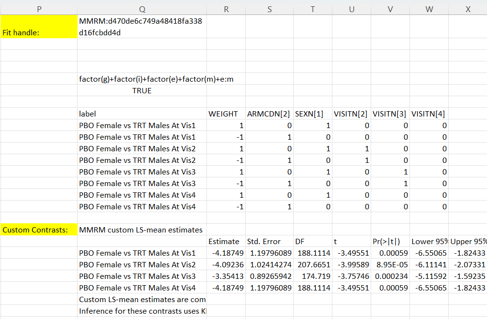

# MMRM LS-means, contrasts, and estimands

[← Back to MMRM overview](../mixed-models-for-repeated-measures-mmrm.md)

**Purpose of this page:** explain how model-based estimated means, treatment differences, change-from-baseline contrasts, and custom LS-mean estimates are defined and interpreted in BESH Stat NG **Mixed Models for Repeated Measures (MMRM)**. This page is for users who already understand the basic MMRM workflow and need to decide *which estimand to report*. For the full model likelihood and inference formulas, see [Model and mathematics](model-and-mathematics.md). For dialog options and output sheets, see [Options and output reference](options-and-output.md). For worksheet formulas, see [Worksheet functions](worksheet-functions.md).

---

## 1. Why LS-means and contrasts are central in MMRM

The fixed-effect coefficient table is useful for checking the fitted model, but it is rarely the final clinical or scientific result. Coefficients depend on the coding of categorical factors, the reference levels used in the design matrix, and the interaction parameterization. In a longitudinal treatment analysis, the questions are usually more direct:

- What is the adjusted mean response at each visit?
- What is the adjusted mean response in each treatment group at each visit?
- What is the treatment difference at a selected visit?
- What is the change from baseline within each group?
- What is the treatment difference in change from baseline?
- What custom treatment profile or subgroup contrast is needed for the analysis plan?

These quantities are **linear functions of the fitted fixed-effect coefficients**. BESH Stat NG reports them as LS-means, contrasts, change-from-baseline estimates, and custom LS-mean estimates.

!!! tip "Practical rule"
    Use the coefficient table to understand the parameterization of the model. Use LS-means and contrasts to report the scientific result.

---

## 2. Linear-estimand notation

Let \(\hat\beta\) be the fitted fixed-effect coefficient vector and let \(\widehat{\operatorname{Var}}(\hat\beta)\) be the coefficient covariance matrix used by the selected inference method.

A single estimated mean or linear estimate is defined by a row vector \(L\):

\[
\widehat{\eta}_L = L\hat\beta,
\qquad
\operatorname{SE}(\widehat{\eta}_L)=
\sqrt{L\widehat{\operatorname{Var}}(\hat\beta)L^\top}.
\]

A contrast is the difference between two or more such linear functions. For profiles \(a\) and \(b\),

\[
L_{a-b}=L_a-L_b,
\qquad
\widehat{\Delta}_{a-b}=(L_a-L_b)\hat\beta.
\]

For a more general custom estimate with profile rows \(j=1,\ldots,J\) and weights \(w_j\),

\[
L_{custom}=\sum_{j=1}^J w_j L_j,
\qquad
\widehat{\eta}_{custom}=L_{custom}\hat\beta.
\]

The selected inference method controls the denominator degrees of freedom, test statistic, p-value, and confidence interval. For example, a Kenward-Roger fit uses the Kenward-Roger-adjusted coefficient covariance and denominator degrees of freedom, whereas a between-within fit uses the between-within degrees-of-freedom approximation without the Kenward-Roger covariance adjustment.

---

## 3. What “LS-mean” means in this documentation

An LS-mean, also called an **estimated marginal mean**, is a fitted model mean evaluated at a defined profile or averaged over a defined set of fitted profiles. In MMRM it is not simply the arithmetic mean of the observed response values. It is based on the fitted fixed-effect model and the retained analysis rows.

### Observed-design-grid LS-means

The supplied MMRM FEV1 result workbook uses the **observed design grid**. For a requested set of retained analysis rows \(\mathcal{S}\), BESH Stat NG forms the average fixed-effect design row

\[
L_{\mathcal{S}} = \frac{1}{|\mathcal{S}|}\sum_{r\in\mathcal{S}}x_r^\top,
\]

where \(x_r^\top\) is the fixed-effect design row for retained row \(r\). The LS-mean is then

\[
\widehat{\mu}_{\mathcal{S}}=L_{\mathcal{S}}\hat\beta.
\]

For example:

- visit-only LS-means average retained fitted design rows within each visit;
- visit-by-treatment LS-means average retained fitted design rows within each visit and treatment profile;
- custom `LSMESTIMATE` rows match retained fitted design rows according to the supplied profile columns and then apply the requested weights.

### Reference-grid LS-means

A reference grid first defines target profiles and then evaluates the model at those profiles. This is the terminology commonly used by SAS `LSMEANS` and R `emmeans` workflows. Depending on the settings, a reference-grid result can average equally over categorical covariate levels, use observed cell weights, or hold continuous covariates at selected values.

The same linear-estimate formulas apply in both cases, but the definition of \(L\) changes because the averaging rule changes. With an observed design grid, the rows of \(L\) reflect the covariate and factor-pattern distribution that actually appears in the fitted data. With a prespecified reference grid, the rows of \(L\) reflect a user-defined target population or reporting convention. For example, suppose a model includes treatment, visit, sex, and a treatment-by-visit interaction. An observed-grid LS-mean for the treatment group at Visit 4 averages over the male/female distribution observed among treatment patients with usable data. If the treatment group is 60% male and 40% female, that sex distribution contributes to \(L\). A prespecified reference-grid LS-mean might instead average 50% male and 50% female, regardless of the observed sample composition. Both estimates are valid linear functions of the fitted model coefficients, but they answer slightly different questions. The observed-grid estimate describes the fitted mean for the study population represented in the analysis data, while the prespecified-grid estimate describes the fitted mean for an explicitly standardized population. Therefore, always state whether the reported means were based on an observed design grid or on a prespecified reference grid.

!!! warning "Do not mix LS-mean definitions"
    Observed-design-grid LS-means and reference-grid LS-means may answer different questions. Differences are most visible when covariates, subgroup factors, or missing visit patterns are unbalanced across treatment groups or visits.

---

## 4. Example used on this page

The examples on this page use the FEV1 dataset and result workbooks included with the documentation:

- [037mmrm_fev_data.csv](../../assets/data/037mmrm/037mmrm_fev_data.csv)
- [037mmrm_fev_results.xlsx](../../assets/data/037mmrm/037mmrm_fev_results.xlsx)
- [037mmrm_fev_data_udfs.xlsx](../../assets/data/037mmrm/037mmrm_fev_data_udfs.xlsx)

The ribbon result workbook fits a treatment-by-visit MMRM with:

| Model component | Value in the supplied ribbon result workbook |
|---|---|
| Response | `FEV1` |
| Subject ID | `SUBJID` |
| Visit/time variable | `VISITN` |
| Main fixed effects | `RACEN`, `SEXN`, `ARMCDN`, `VISITN` |
| Interaction | `ARMCDN:VISITN` |
| Estimation method | REML |
| Inference method in `037mmrm_fev_results.xlsx` | Between-within DF |
| Residual covariance | Unstructured |
| LS-means mode | Observed design grid |
| Grouping factor | `ARMCDN` |
| Direction for group differences | Higher coded level minus lower coded level, therefore `ARMCDN 2 - 1` |

The UDF workbook demonstrates a similar formula-based fit using Kenward-Roger inference and a custom `BESH.REGR.MMRM_LSMESTIMATE` specification.

---

## 5. Estimated marginal means by visit

The visit-only LS-mean answers:

> What is the model-estimated mean response at this visit after adjusting for the fixed-effect model?

In the supplied FEV1 result workbook, the observed-design-grid visit means are:

| Visit | N | Estimate | Std. Error | DF | t | p-value | Lower 95% CI | Upper 95% CI |
|---|---:|---:|---:|---:|---:|---:|---:|---:|
| Visit 1 | 134 | 34.7419 | 0.5347 | 192 | 64.9691 | 0.0000 | 33.6872 | 35.7966 |
| Visit 2 | 140 | 39.6823 | 0.4267 | 192 | 93.0055 | 0.0000 | 38.8408 | 40.5239 |
| Visit 3 | 129 | 44.7574 | 0.3378 | 192 | 132.4879 | 0.0000 | 44.0911 | 45.4237 |
| Visit 4 | 134 | 50.3644 | 0.8393 | 192 | 60.0104 | 0.0000 | 48.7091 | 52.0198 |

These are adjusted means, not raw arithmetic means of `FEV1`. They are computed as \(L\hat\beta\), where \(L\) is the average fitted design row among retained rows at the displayed visit.

### How to report

A concise report might say:

> The observed-design-grid estimated marginal mean FEV1 increased from 34.74 at Visit 1 to 50.36 at Visit 4. Confidence intervals and p-values use the between-within denominator degrees of freedom selected for this example fit.

For treatment comparisons, do not overinterpret the visit-only mean. Use the visit-by-group LS-means and group contrasts.

---

## 6. Estimated marginal means by visit and group

The visit-by-group LS-mean answers:

> What is the model-estimated mean response for each group at each visit?

In the FEV1 example, `ARMCDN=1` is placebo (`PBO`) and `ARMCDN=2` is treatment (`TRT`). The supplied result workbook gives:

| Visit and group | N | Estimate | Std. Error | DF | Lower 95% CI | Upper 95% CI |
|---|---:|---:|---:|---:|---:|---:|
| Visit 1, ARMCDN=1 | 68 | 32.5703 | 0.7499 | 192 | 31.0913 | 34.0493 |
| Visit 1, ARMCDN=2 | 66 | 36.9793 | 0.7626 | 192 | 35.4752 | 38.4834 |
| Visit 2, ARMCDN=1 | 69 | 37.5882 | 0.6060 | 192 | 36.3929 | 38.7835 |
| Visit 2, ARMCDN=2 | 71 | 41.7175 | 0.6009 | 192 | 40.5323 | 42.9026 |
| Visit 3, ARMCDN=1 | 71 | 43.1024 | 0.4556 | 192 | 42.2037 | 44.0010 |
| Visit 3, ARMCDN=2 | 58 | 46.7833 | 0.5034 | 192 | 45.7904 | 47.7763 |
| Visit 4, ARMCDN=1 | 67 | 47.8612 | 1.1862 | 192 | 45.5216 | 50.2008 |
| Visit 4, ARMCDN=2 | 67 | 52.8677 | 1.1876 | 192 | 50.5253 | 55.2100 |

These rows are useful for describing each group. However, the treatment effect is usually better reported from the contrast table because the contrast table gives the standard error, test statistic, p-value, and confidence interval for the difference directly.

---

## 7. Group contrasts by visit

A group contrast by visit answers:

> At this visit, what is the adjusted difference between groups?

In the supplied workbook, group levels are ordered numerically and the direction is **higher level minus lower level**. Therefore the row `ARMCDN 2 - 1` means `TRT - PBO`.

| Contrast | Estimate | Std. Error | DF | t | p-value | Lower 95% CI | Upper 95% CI |
|---|---:|---:|---:|---:|---:|---:|---:|
| Visit 1: ARMCDN 2 - 1 | 4.4090 | 1.0693 | 192 | 4.1231 | 0.000056 | 2.2998 | 6.5181 |
| Visit 2: ARMCDN 2 - 1 | 4.1293 | 0.8534 | 192 | 4.8384 | 0.000003 | 2.4459 | 5.8126 |
| Visit 3: ARMCDN 2 - 1 | 3.6810 | 0.6790 | 192 | 5.4215 | 0.000000 | 2.3418 | 5.0202 |
| Visit 4: ARMCDN 2 - 1 | 5.0064 | 1.6784 | 192 | 2.9828 | 0.003227 | 1.6959 | 8.3170 |

### Interpreting the sign

Because the direction is `ARMCDN 2 - 1`, positive estimates mean that the treatment group has a larger adjusted mean FEV1 than the placebo group at that visit. If the direction were reversed, the numeric estimates would have the opposite sign but the two-sided p-values would be unchanged.

### Reporting template

> At Visit 4, the estimated treatment-minus-placebo difference was 5.01 FEV1 units, with a 95% CI from 1.70 to 8.32 and p = 0.0032 using the selected between-within degrees-of-freedom method.

### Choosing the comparison mode

The dialog supports common comparison choices. The exact wording in the output depends on the selected options.

| Comparison choice | What it answers | Typical use |
|---|---|---|
| Pairwise among group levels | All pairwise group differences within each visit | Exploratory or multi-arm studies. |
| Each group vs control | Each non-control level minus or versus the selected control level | Treatment-control comparisons in multi-arm studies. |
| Selected comparison | One specified group comparison | Prespecified primary contrast or focused sensitivity analysis. |

Always document the control level, comparison level, and direction when reporting a contrast.

---

## 8. Change from baseline

A change-from-baseline contrast answers:

> How much did the model-estimated mean response change from the baseline visit to a later visit?

For group \(g\), visit \(t\), and baseline visit \(0\), the within-group change is

\[
\Delta_{g,t}=\mu_{g,t}-\mu_{g,0}.
\]

If no group is used, the same idea applies to the overall visit LS-means:

\[
\Delta_t=\mu_t-\mu_0.
\]

In the supplied FEV1 result workbook, the overall visit-level change from baseline is:

| Contrast | Estimate | Std. Error | DF | t | p-value | Lower 95% CI | Upper 95% CI |
|---|---:|---:|---:|---:|---:|---:|---:|
| Visit 2 - baseline visit 1 | 4.9404 | 0.5644 | 192 | 8.7530 | 0.0000 | 3.8272 | 6.0537 |
| Visit 3 - baseline visit 1 | 10.0155 | 0.5926 | 192 | 16.9001 | 0.0000 | 8.8466 | 11.1844 |
| Visit 4 - baseline visit 1 | 15.6226 | 0.9256 | 192 | 16.8776 | 0.0000 | 13.7968 | 17.4483 |

### Baseline visit selection

The baseline visit can be selected explicitly or taken as the smallest available visit value. In this example, baseline is visit 1. If the numeric visit variable is not coded in the intended order, or if baseline is not the smallest visit value, choose the baseline visit explicitly rather than relying on the default.

!!! warning "Change from baseline is still model-based"
    The change-from-baseline table is not a raw paired-change summary. It is a contrast of fitted LS-means from the MMRM model.

---

## 9. Difference in change from baseline

A difference-in-change contrast answers:

> Did one group change more from baseline than another group?

For active group \(A\), control group \(C\), visit \(t\), and baseline visit \(0\), the usual treatment difference in change is

\[
(\mu_{A,t}-\mu_{A,0})-(\mu_{C,t}-\mu_{C,0}).
\]

In the supplied FEV1 workbook, the displayed direction is

\[
\Delta(\text{ARMCDN}=2)-\Delta(\text{ARMCDN}=1),
\]

that is, treatment-group change minus placebo-group change.

| Contrast | Estimate | Std. Error | DF | t | p-value | Lower 95% CI | Upper 95% CI |
|---|---:|---:|---:|---:|---:|---:|---:|
| Visit 2 vs baseline 1: Δ(ARMCDN=2) - Δ(ARMCDN=1) | -0.2797 | 1.1292 | 192 | -0.2477 | 0.8046 | -2.5070 | 1.9476 |
| Visit 3 vs baseline 1: Δ(ARMCDN=2) - Δ(ARMCDN=1) | -0.7280 | 1.1868 | 192 | -0.6134 | 0.5403 | -3.0688 | 1.6128 |
| Visit 4 vs baseline 1: Δ(ARMCDN=2) - Δ(ARMCDN=1) | 0.5975 | 1.8509 | 192 | 0.3228 | 0.7472 | -3.0533 | 4.2482 |

### When this estimand is useful

Difference in change is especially useful when baseline is part of the repeated outcome profile and the scientific question is about improvement or deterioration from baseline. It is also common in clinical-trial reports where both absolute follow-up values and change from baseline are clinically meaningful.

### Reporting template

> At Visit 4, the estimated treatment-minus-placebo difference in change from baseline was 0.60, with a 95% CI from -3.05 to 4.25. This interval is compatible with both a small negative and a small positive difference in change for the treatment group relative to placebo.

---

## 10. Custom LS-mean estimates with `BESH.REGR.MMRM_LSMESTIMATE`

The standard ribbon output covers common visit means, group means, treatment differences, change from baseline, and difference in change. For a nonstandard estimand, use the worksheet function [`BESH.REGR.MMRM_LSMESTIMATE`](../../udf/regression-models.md#beshregrmmrm_lsmestimate).

Use `BESH.REGR.MMRM_LSMESTIMATE` when you need:

- a custom treatment difference at a specific covariate or subgroup profile;
- an average treatment effect across selected visits;
- a difference involving more than one factor, such as treatment-by-sex profiles;
- a custom difference in change from baseline;
- a contrast required by an analysis plan but not available from the dialog output;
- a reproducible worksheet-only analysis where the custom contrast should be visible and auditable.

The function is intentionally similar in spirit to an `LSMESTIMATE` statement in SAS `PROC MIXED`: the user supplies rows describing profile contributions and weights, and rows with the same label are accumulated into one final estimate.

### Required and optional specification columns

A custom specification range contains a header row and one or more data rows.

| Column type | Required? | Meaning |
|---|---:|---|
| `label` | Optional but strongly recommended | Rows with the same label are combined into the same final estimate. |
| `weight` | Required | Contribution weight. Use `1` and `-1` for simple differences, or fractions for averages. |
| `visit` | Optional | Visit/time value saved in the MMRM handle. |
| Fitted design-profile columns | Optional | Numeric design columns used to match retained fitted rows, such as treatment, sex, visit dummy variables, or other model-matrix columns. |
| `at` range | Optional separate argument | Common profile settings applied to all rows unless overridden in the specification range. |

### How rows are combined

Suppose the custom specification has several rows with the same label. For each row, BESH Stat NG finds the observed fitted design rows that match the requested profile settings and computes the corresponding profile vector \(L_j\). The final estimate is

\[
\sum_j w_j L_j\hat\beta.
\]

Rows with different labels produce separate output rows.

!!! important "Custom LS-estimates use the fitted design"
    The specification columns must refer to fitted design-profile columns saved in the MMRM handle. With dummy-coded categorical variables, the reference level is usually represented by all corresponding dummy columns equal to 0. For example, if visits 2, 3, and 4 are represented by `VISITN[2]`, `VISITN[3]`, and `VISITN[4]`, then visit 1 is represented by all three visit dummy columns set to 0. To evaluate a visit-4 profile, set `VISITN[4] = 1` unless the `visit` column or an `at` range is being used instead.

### UDF workbook example

The supplied workbook [037mmrm_fev_data_udfs.xlsx](../../assets/data/037mmrm/037mmrm_fev_data_udfs.xlsx) demonstrates the worksheet-function workflow. The screenshot below shows a custom `LSMESTIMATE` specification and the resulting dynamic-array output.



The fit handle is created by `BESH.REGR.MMRM_FIT`, and the custom estimates are returned by:

```excel
=BESH.REGR.MMRM_LSMESTIMATE(Q1,Q8:W16)
```

In this workbook, the fitted model uses Kenward-Roger inference. Therefore the custom LS-mean estimate output uses Kenward-Roger-adjusted standard errors and Kenward-Roger denominator degrees of freedom where available.

The custom output in the supplied workbook includes:

| Custom estimate | Estimate | Std. Error | DF | t | p-value | Lower 95% CI | Upper 95% CI |
|---|---:|---:|---:|---:|---:|---:|---:|
| PBO Female vs TRT Males At Vis1 | -4.1875 | 1.1980 | 188.1114 | -3.4955 | 0.000590 | -6.5507 | -1.8243 |
| PBO Female vs TRT Males At Vis2 | -4.0924 | 1.0241 | 207.6651 | -3.9959 | 0.000089 | -6.1114 | -2.0733 |
| PBO Female vs TRT Males At Vis3 | -3.3541 | 0.8927 | 174.7190 | -3.7575 | 0.000234 | -5.1159 | -1.5923 |
| PBO Female vs TRT Males At Vis4 | -4.1875 | 1.1980 | 188.1114 | -3.4955 | 0.000590 | -6.5507 | -1.8243 |

!!! note "Why the custom example has different DF from the ribbon result tables"
    The ribbon workbook `037mmrm_fev_results.xlsx` uses between-within DF for its displayed contrast tables. The UDF workbook demonstrates a Kenward-Roger fit. Different inference methods can give different standard errors, denominator degrees of freedom, p-values, and confidence intervals even when the fitted mean model is otherwise similar.

---

## 11. Constructing common custom estimands

### Final-visit treatment difference

For a treatment group \(A\), control group \(C\), and final visit \(T\):

\[
\mu_{A,T}-\mu_{C,T}.
\]

A two-row specification is enough: one row with weight `1` for the treatment profile at visit \(T\), and one row with weight `-1` for the control profile at visit \(T\).

```text
label                 weight   visit   treatment_indicator
Treatment-Control T    1        T       1
Treatment-Control T   -1        T       0
```

### Average treatment difference across post-baseline visits

For post-baseline visits \(t\in\mathcal{T}_{post}\):

\[
\frac{1}{|\mathcal{T}_{post}|}
\sum_{t\in\mathcal{T}_{post}}(\mu_{A,t}-\mu_{C,t}).
\]

Use one positive and one negative row per visit. If there are three visits, use weights `1/3` and `-1/3`.

```text
label             weight      visit   treatment_indicator
Average Post-BL    0.333333   2       1
Average Post-BL   -0.333333   2       0
Average Post-BL    0.333333   3       1
Average Post-BL   -0.333333   3       0
Average Post-BL    0.333333   4       1
Average Post-BL   -0.333333   4       0
```

### Final-visit difference in change from baseline

For final visit \(T\) and baseline visit \(0\):

\[
(\mu_{A,T}-\mu_{A,0})-(\mu_{C,T}-\mu_{C,0}).
\]

Use four rows:

```text
label                  weight   visit   treatment_indicator
Diff in Change Final    1        T       1
Diff in Change Final   -1        0       1
Diff in Change Final   -1        T       0
Diff in Change Final    1        0       0
```

This pattern is a useful way to audit the sign of the contrast. The active final-visit mean has positive weight; the active baseline mean has negative weight; the control final-visit mean has negative weight; the control baseline mean has positive weight.

### Subgroup-specific treatment difference

For a treatment contrast within a subgroup, add the subgroup profile column or supply it through the `at` range.

```text
label                    weight   visit   treatment_indicator   subgroup_indicator
Treatment-Control Female   1       4       1                     1
Treatment-Control Female  -1       4       0                     1
```

If several rows share the same subgroup setting, it is often clearer to place the subgroup setting in the `at` range and keep the main specification range focused on weights, visit, and treatment.

---

## 12. Multiplicity and alpha

The alpha level controls the confidence interval width. For example, alpha `0.05` gives a two-sided 95% confidence interval.

When many LS-means or contrasts are inspected, distinguish between:

- **planned primary contrasts**, which may be reported without adjustment if prespecified and multiplicity is handled by the analysis plan;
- **secondary or exploratory contrasts**, where adjusted p-values or a multiplicity strategy may be appropriate;
- **descriptive LS-means**, which are often reported with confidence intervals but not interpreted as separate hypothesis tests.

If a multiplicity adjustment is selected in the dialog, state the family of comparisons to which it applies. Do not combine p-values from different families or different contrast directions without documenting the choice.

---

## 13. Choosing the right estimand

| Scientific question | Recommended output | Notes |
|---|---|---|
| What is the adjusted mean at each visit? | Estimated marginal means by visit | Useful for overall longitudinal pattern; not a treatment effect. |
| What is the adjusted mean for each group at each visit? | Estimated marginal means by visit and group | Good for plots and descriptive tables. |
| What is the treatment effect at each visit? | Group contrasts by visit | Usually the main treatment-comparison table. |
| How much did each group change from baseline? | Change from baseline by visit and group | Describes within-group change; not by itself a between-group test. |
| Did treatment change more than control? | Difference in change from baseline | Common when baseline is a meaningful repeated outcome. |
| What is the average effect over several visits? | Custom `BESH.REGR.MMRM_LSMESTIMATE` | Use weights that represent the intended averaging scheme. |
| What is the effect in a specific subgroup/profile? | Custom `BESH.REGR.MMRM_LSMESTIMATE` or suitable grouping output | Define the subgroup and covariate profile explicitly. |

!!! tip "Prespecify the estimand"
    Before fitting the model, decide which contrast answers the primary question. Then verify that the output direction, baseline visit, group coding, and inference method match that decision.

---

## 14. Common interpretation mistakes

### Mistake 1: Reporting a coefficient as the treatment effect

A treatment coefficient may represent a treatment difference only at a reference visit and reference levels of other factors. In a model with treatment-by-visit interaction, the treatment effect varies by visit and is best reported from the contrast table.

### Mistake 2: Ignoring contrast direction

The same comparison can be shown as `TRT - PBO` or `PBO - TRT`. The estimate changes sign. Always report the direction.

### Mistake 3: Treating LS-means as raw observed means

LS-means are model-based adjusted means. They are affected by the fixed-effect model, retained analysis rows, covariance model, and inference method.

### Mistake 4: Confusing change from baseline with difference in change

Change from baseline is a within-profile contrast. Difference in change compares those changes between groups.

### Mistake 5: Building a custom contrast without checking dummy coding

When using design-matrix columns, reference levels are usually represented by zeros in all dummy columns for that factor. If a visit is represented by dummy columns, make sure the correct visit indicator is set to 1. Alternatively, use a `visit` column or an `at` range when available and clearer.

### Mistake 6: Comparing results from different inference methods without explanation

Between-within, Satterthwaite, and Kenward-Roger methods can give different denominator degrees of freedom and confidence intervals. State the method used in each table.

---

## 15. Suggested reporting language

### LS-mean by group and visit

> The observed-design-grid estimated marginal mean FEV1 at Visit 4 was 47.86 in the placebo group and 52.87 in the treatment group.

### Group contrast by visit

> The Visit 4 treatment-minus-placebo LS-mean difference was 5.01, with a 95% confidence interval from 1.70 to 8.32 and p = 0.0032 using the between-within degrees-of-freedom method.

### Difference in change

> The Visit 4 treatment-minus-placebo difference in change from baseline was 0.60, with a 95% confidence interval from -3.05 to 4.25.

### Custom LS-estimate

> A custom LS-mean estimate was evaluated using `BESH.REGR.MMRM_LSMESTIMATE`. The specification range defined the profile rows and weights; rows with the same label were combined into one linear estimate of the fitted fixed-effect coefficients.

---

## 16. Where to go next

| Task | Page |
|---|---|
| Choose model, covariance, inference, and output options | [Options and output reference](options-and-output.md) |
| Review the mathematical definition of fixed-effect inference | [Model and mathematics](model-and-mathematics.md) |
| Run the analysis from the Excel ribbon | [Excel ribbon workflow](user-interface.md) |
| Build reproducible worksheet formulas | [Worksheet functions](worksheet-functions.md) |
| Use exact generated UDF syntax | [Regression Models UDF reference](../../udf/regression-models.md#beshregrmmrm_lsmestimate) |

