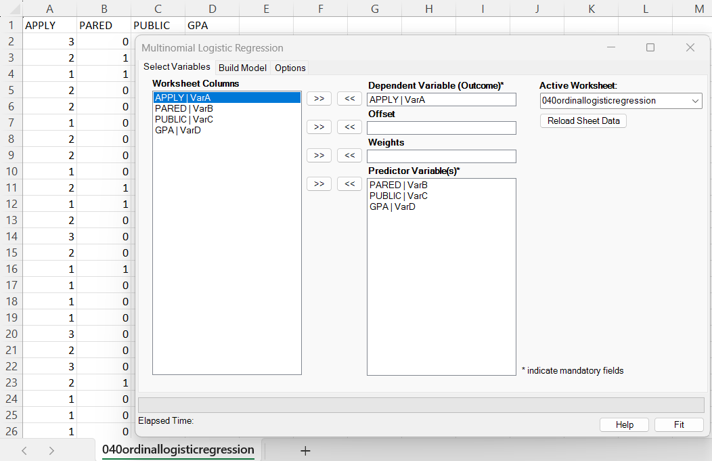
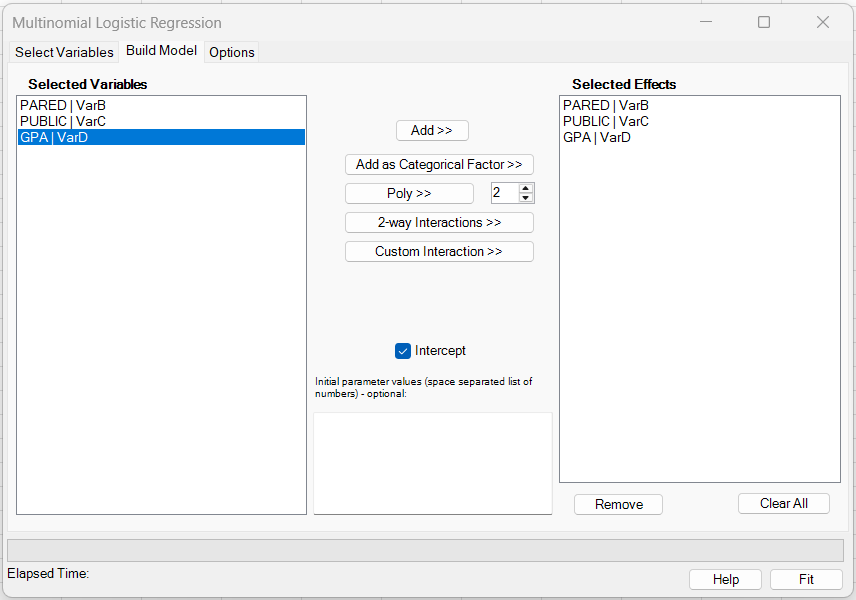
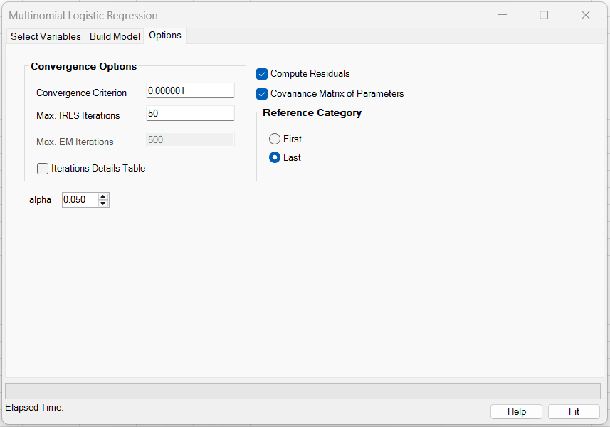
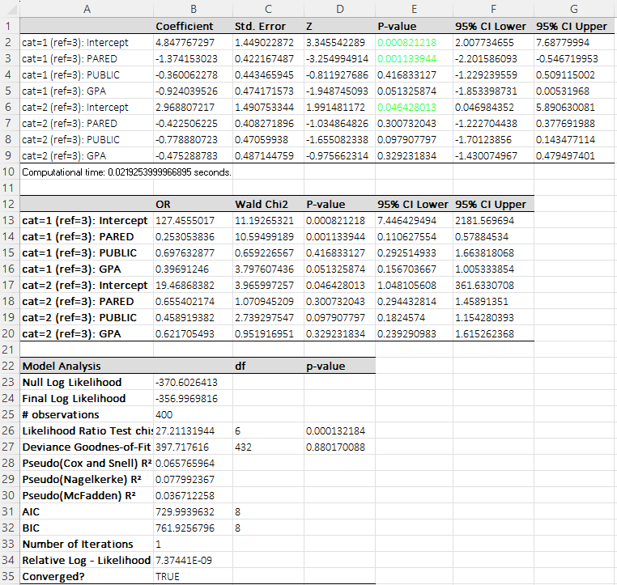
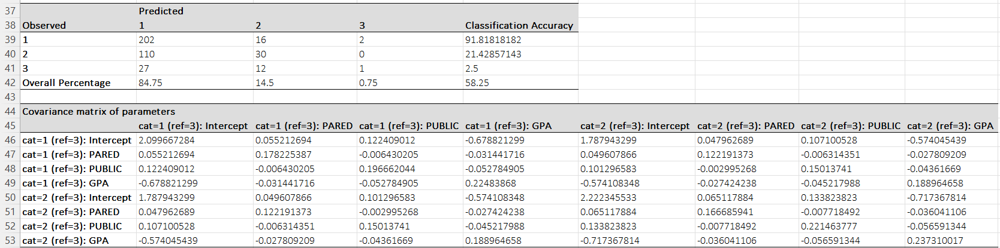

# Multinomial Logistic Regression

**Includes:** Multinomial logistic regression, Reference category selection (first/last), categorical factors, polynomial terms, continuous and categorical-factor interactions, optional starting values, optional offset/weights, covariance matrix, residuals.  
**Purpose:** Model nominal outcomes with more than two categories.

---

## Overview

Multinomial logistic regression is used when the outcome has **more than two unordered (nominal) categories** (for example `APPLY` taking values `1`, `2`, `3`) and you want to model how predictors shift the *relative* probability of each category. BESHStatNG fits a **baseline-category (reference-category) logit model**: one category is chosen as the reference, and the model estimates a separate set of coefficients for each non-reference category. Results are reported as coefficients, Wald tests, and **odds ratios** for each category-versus-reference comparison, along with model fit statistics, optional residual diagnostics, and a classification table.

---

## User interface

### Select variables



- **Dependent Variable (Outcome):** the nominal response with \(K\ge 3\) categories.
- **Predictor Variable(s):** one or more covariates.
- **Offset (optional):** a known term added to the linear predictor.
- **Weights (optional):** case weights / frequencies.
- **Active Worksheet / Reload Sheet Data:** refreshes the column list from the selected worksheet.

### Build model



- **Add >>** adds the selected variable(s) as continuous main effects.
- **Add as Categorical Factor >>** marks the selected variable(s) as categorical main effects. Internally, BESHStatNG expands each selected factor into reference-coded indicator columns; if the factor is used in an interaction, the interaction is built from those expanded columns.
- **Poly >>** creates polynomial terms for the selected variable(s). The degree is taken from the numeric box next to the button.
- **2-way Interactions >>** creates all pairwise interactions among the currently selected variables.
- **Custom Interaction >>** creates one multi-way interaction term spanning all currently selected variables.
- **Intercept:** if checked, the model includes an intercept for each non-reference category. If unchecked, the intercept terms are omitted.
- **Initial parameter values** are optional. If supplied, they are used as the optimizer starting values, and the required count is based on the **expanded** predictor matrix and the number of non-reference outcome categories.

Current limitations:

- Polynomial terms are supported only for **continuous** predictors.
- Interaction terms support **continuous × continuous**, **categorical × continuous**, and **categorical × categorical** combinations.
- Polynomial subterms inside interactions are not supported; create polynomial main effects separately when needed.

### Options



The screenshots on this page use the default `alpha = 0.05`, so the example output shows 95% CI labels.

**Convergence criterion:** tolerance used for both step size and log-likelihood change.
- **Max. IRLS iterations:** maximum Newton/IRLS iterations.
- **Compute residuals:** outputs fitted probabilities and residual diagnostics (can be large).
- **Covariance Matrix of Parameters:** outputs the estimated covariance matrix.
- **Alpha:** two-sided significance level used for Wald confidence intervals. Default: **0.05** (95% confidence interval).
- **Reference category:**
  - **Last (default):** uses the last category label as the reference.
  - **First:** uses the first category label as the reference.

---

## Example data

This help page uses the same example data as the ordinal logistic regression page:

- [040ordinallogisticregression.csv](../assets/data/040ordinallogisticregression/040ordinallogisticregression.csv)

Residual diagnostics produced by the multinomial model for this example dataset are provided as:

- [039multinomiallogisticregression_results.csv](../assets/data/039multinomiallogisticregression/039multinomiallogisticregression_results.csv)

---

## Model

Let \(Y_i \in \{c_1,\dots,c_K\}\) be a nominal outcome with \(K\) categories. Choose a **reference** category \(c_K\) (BESHStatNG chooses the first or last depending on the option).

Let \(\mathbf{x}_i\in\mathbb{R}^p\) be predictors for observation \(i\). For each non-reference category \(k=1,\dots,K-1\), define a linear predictor

$$
\eta_{ik} = \alpha_k + \mathbf{x}_i^\top \beta_k + \mathrm{offset}_i,
$$

where \(\alpha_k\) is an intercept (optional) and \(\beta_k\) is a vector of slopes specific to category \(k\) relative to the reference.

The multinomial logit probabilities are the **softmax**:

$$
P(Y_i=c_k) = \frac{\exp(\eta_{ik})}{1+\sum_{h=1}^{K-1}\exp(\eta_{ih})},
\qquad k=1,\dots,K-1,
$$

$$
P(Y_i=c_K) = \frac{1}{1+\sum_{h=1}^{K-1}\exp(\eta_{ih})}.
$$

Equivalently, the baseline-category logit form is

$$
\log\left(\frac{P(Y_i=c_k)}{P(Y_i=c_K)}\right) = \eta_{ik}, \qquad k=1,\dots,K-1.
$$

### Reference category option

- **Last (default):** the last label is the reference \(c_K\); output is labeled like `cat=1 (ref=3)` and `cat=2 (ref=3)` when \(K=3\).
- **First:** the first label is the reference; output is relabeled accordingly. Coefficients for a different reference are not identical, but models are equivalent (they induce the same fitted probabilities).

---

## Estimation and inference

### Log-likelihood

With optional case weights \(w_i\ge 0\), the (weighted) log-likelihood is

$$
\ell(\theta)=\sum_{i=1}^n w_i \log P(Y_i=c_{y_i}),
$$

where \(\theta\) stacks all parameters \(\{\alpha_k,\beta_k\}_{k=1}^{K-1}\).

### Optimization algorithm used in BESHStatNG

BESHStatNG maximizes \(\ell(\theta)\) using a **Newton-Raphson / IRLS** procedure for multinomial logit:

1. Initialize coefficients (and intercepts, if selected) to zeros (or user-provided starting values if supplied).
2. Iterate up to `Max. IRLS iterations`:
   - Compute fitted probabilities \(p_{ik}\).
   - Compute the gradient \(g\) and Hessian \(H\) of \(\ell\) with respect to \(\theta\).
   - Form a stabilized observed information matrix \(I=-H+\lambda I\) (a small ridge term on the diagonal improves numerical stability).
   - Take the Newton step \(\delta = I^{-1} g\).
   - **Backtracking line search:** update \(\theta_{\text{new}}=\theta+s\delta\), halving \(s\) until the log-likelihood increases.
3. Stop when either

$$
\max_j |s\delta_j| < \varepsilon
\quad\text{or}\quad
|\ell_{\text{new}}-\ell_{\text{old}}| < \varepsilon,
$$

where \(\varepsilon\) is the **Convergence criterion**.

### Standard errors, tests, and confidence intervals

Let \(\widehat{\theta}\) be the MLE and \(\widehat{\mathrm{Cov}}(\widehat{\theta})\approx I^{-1}\) the inverse observed information.

- **Standard error:** \(\mathrm{SE}(\widehat{\theta}_j)=\sqrt{\widehat{\mathrm{Cov}}_{jj}}\).
- **Wald Z:** \(Z_j=\widehat{\theta}_j/\mathrm{SE}(\widehat{\theta}_j)\).
- **Two-sided p-value:** \(p_j=2\big(1-\Phi(|Z_j|)\big)\), where \(\Phi\) is the standard normal CDF.
- **Wald CI (parameter scale):**

$$
\widehat{\theta}_j \pm z_{1-\alpha/2}\,\mathrm{SE}(\widehat{\theta}_j).
$$

- **Odds ratio:** for a slope coefficient in equation \(\log(P(Y=c_k)/P(Y=c_K))\), the reported OR is \(\exp(\beta_{kr})\) and its CI is obtained by exponentiating the Wald CI endpoints.

---

## Output (Excel worksheet)

BESHStatNG writes results to a new worksheet.



### 1) Coefficients table

For each non-reference category \(k\) and each parameter (intercept and slopes), the table reports:

- **Coefficient:** estimate on the log-odds scale for `cat=k (ref=K)`.
- **Std. Error:** from the covariance matrix diagonal.
- **Z** and **p-value:** Wald normal test.
- **CI Lower/Upper:** Wald confidence interval at the selected level.

Interpretation (for a slope term \(x_r\) in category \(k\)):

$$
\frac{P(Y=c_k \mid x_r+1)/P(Y=c_K \mid x_r+1)}{P(Y=c_k \mid x_r)/P(Y=c_K \mid x_r)} = \exp(\beta_{kr}).
$$

**Text interpretation.** For a one-unit increase in predictor \(x_r\) (holding all other predictors constant), the log-odds of being in category \(k\) rather than the reference category increase by \(\beta_{kr}\). Equivalently, the **odds ratio** for category \(k\) vs. the reference is \(\exp(\beta_{kr})\): if \(\exp(\beta_{kr})>1\), higher values of \(x_r\) make category \(k\) more likely relative to the reference; if \(\exp(\beta_{kr})<1\), higher values of \(x_r\) make category \(k\) less likely relative to the reference. This effect is **category-specific**: each non-reference category \(k\) has its own slope \(\beta_{kr}\) and therefore its own odds ratio.

Example (from this help page output) using **reference category = 3** (as selected in the Options tab):

- **Category 1 vs. reference 3, PARED (β = −1.3742, OR = 0.2531, 95% CI for OR: 0.1106 to 0.5788, p = 0.00113).**  
  Changing **PARED from 0 to 1** multiplies the odds of being in **category 1 rather than category 3** by **0.253** (i.e., the odds are reduced by about **74.7%**), holding PUBLIC and GPA constant. Equivalently, \( \exp(-1.3742) = 0.2531 \).

- **Category 2 vs. reference 3, PARED (β = −0.4225, OR = 0.6554, 95% CI for OR: 0.2944 to 1.4590, p = 0.3007).**  
  Changing **PARED from 0 to 1** multiplies the odds of being in **category 2 rather than category 3** by **0.655** (about a **34.5% decrease** in odds), but in this example the confidence interval includes 1 and the p-value is not significant.

### 2) OR / Wald Chi-square table

For each parameter, BESHStatNG also reports:

- **OR:** \(\exp(\widehat{\theta}_j)\)
- **Wald Chi2:** \(Z_j^2\) with 1 df
- **p-value:** \(1 - F_{\chi^2_1}(Z_j^2)\)
- **CI at selected level:** exponentiated Wald CI endpoints

### 3) Model analysis

The model summary includes:

- **Null Log Likelihood:** log-likelihood of the intercept-only model (and offset, if used).
- **Final Log Likelihood:** log-likelihood of the fitted model.
- **Likelihood Ratio Test (chisq):**

$$
G^2 = 2(\ell_{\text{full}} - \ell_{\text{null}}) \sim \chi^2_{df}.
$$

A common choice is \(df=(K-1)\times p_{\text{slopes}}\) (and plus \((K-1)\) if intercepts are included).

- **Deviance Goodness-of-Fit (chisq):** computed by grouping identical covariate patterns (and offset, if used). For \(G\) unique patterns,

$$
D = 2(\ell_{\text{sat}} - \ell_{\text{model}}), \qquad df = G(K-1) - q,
$$

where \(q\) is the total number of fitted parameters. A large p-value suggests no evidence of lack of fit at the pattern level.

- **Pseudo \(R^2\):**

$$
R^2_{CS}=1-\exp\Big(\frac{2}{n_{\text{obs}}}(\ell_{\text{null}}-\ell_{\text{full}})\Big),
$$

$$
R^2_{N} = \frac{R^2_{CS}}{1-\exp\Big(\frac{2}{n_{\text{obs}}}\ell_{\text{null}}\Big)},
\qquad
R^2_{McF}=1-\frac{\ell_{\text{full}}}{\ell_{\text{null}}}.
$$

- **AIC / BIC:**

$$
\mathrm{AIC}=-2\ell_{\text{full}}+2q, \qquad \mathrm{BIC}=-2\ell_{\text{full}}+\log(n_{\text{obs}})\,q.
$$

- **Number of iterations**, **relative log-likelihood change**, and **Converged?** indicate the solver status.



### 4) Classification table

BESHStatNG predicts the category with the largest fitted probability:

$$
\widehat{y}_i = \arg\max_k\;P(Y_i=c_k\mid \widehat{\theta}).
$$

It reports a confusion matrix (Observed x Predicted), per-row accuracy, and overall accuracy.

### 5) Covariance matrix of parameters (optional)

If selected, the add-in prints \(\widehat{\mathrm{Cov}}(\widehat{\theta})\) in the same parameter order as the coefficients table.

### 6) Residuals output (optional)

If **Compute residuals** is checked, BESHStatNG outputs fitted means/probabilities and residual diagnostics. For this example dataset, see:

- [039multinomiallogisticregression_results.csv](../assets/data/039multinomiallogisticregression/039multinomiallogisticregression_results.csv)

For each row \(i\) and category \(k\):

- Observed indicator (weighted): \(y_{ik}=w_i\) if observed category is \(k\), otherwise \(0\).
- Fitted probability: \(p_{ik}\).
- Fitted mean: \(\mu_{ik}=w_i p_{ik}\).
- Response residual: \(r_{ik}=y_{ik}-\mu_{ik}\).
- Pearson residual:

$$
R^{(P)}_{ik} = \frac{y_{ik}-\mu_{ik}}{\sqrt{ w_i p_{ik}(1-p_{ik})}}.
$$

Deviance contribution per observation (ignoring categories with \(y_{ik}=0\)):

$$
D_i = 2\sum_k y_{ik}\log\left(\frac{y_{ik}}{\mu_{ik}}\right).
$$

The reported deviance residual is \(\sqrt{\max(0,D_i)}\). For single-row (unweighted) data, this reduces to \(D_i=-2\log(p_{i,\mathrm{obs}})\).

**Leverage and standardized residuals (IRLS hat-value).** BESHStatNG reports leverage values based on the diagonal of the final IRLS working hat matrix (a GLM-standard analogue of OLS leverage). Standardized residuals use this leverage adjustment:

$$
h_i = \mathrm{tr}(I_i\,\widehat{\mathrm{Cov}}),
$$

where \(I_i\) is the per-observation observed-information contribution and \(\widehat{\mathrm{Cov}}\approx I^{-1}\). When \(0\le h_i<1\), standardized residuals are

$$
R^{(\mathrm{std})} = \frac{R}{\sqrt{1-h_i}}.
$$

When \(h_i\ge 1\) the standardized residuals are returned as missing.

---

## Reproducing results in R

BESHStatNG fits the standard baseline-category multinomial logit model. A close match in R is `nnet::multinom()`.

### R code (nnet::multinom)

```r
library(nnet)

df <- read.csv("040ordinallogisticregression.csv")

# Outcome is NOMINAL for multinomial regression
df$APPLY <- factor(df$APPLY)

# Match BESHStatNG default: Reference category = Last
# (for APPLY with levels 1,2,3, set reference to "3")
df$APPLY <- relevel(df$APPLY, ref = "3")

fit <- multinom(APPLY ~ PARED + PUBLIC + GPA, data = df, trace = FALSE)

# Coefficients per non-reference category (rows are categories vs ref)
coef_mat <- coef(fit)

# Standard errors (from Hessian)
summ <- summary(fit)
se_mat <- summ$standard.errors

# Wald Z and p-values
z_mat <- coef_mat / se_mat
p_mat <- 2 * (1 - pnorm(abs(z_mat)))

alpha <- 0.05
zcrit <- qnorm(1 - alpha/2)
ci_l <- coef_mat - zcrit * se_mat
ci_u <- coef_mat + zcrit * se_mat

# Odds ratios and OR CIs
or_mat <- exp(coef_mat)
or_l <- exp(ci_l)
or_u <- exp(ci_u)

# Predicted class and confusion matrix
pr <- fitted(fit)
pred <- colnames(pr)[max.col(pr, ties.method = "first")]
conf <- table(Observed = df$APPLY, Predicted = pred)
acc <- mean(df$APPLY == pred)

list(
  coef = coef_mat, se = se_mat, z = z_mat, p = p_mat,
  ci_lower = ci_l, ci_upper = ci_u,
  OR = or_mat, OR_lower = or_l, OR_upper = or_u,
  confusion = conf, accuracy = acc
)
```

### Matching the "Reference category = First" option

If you select **First** in BESHStatNG, set the reference to the first level in R:

```r
df$APPLY <- relevel(factor(df$APPLY), ref = "1")
fit_first <- multinom(APPLY ~ PARED + PUBLIC + GPA, data = df, trace = FALSE)
```

### Expected differences vs BESHStatNG

- Different optimizers and stabilizations (ridge/line search) can cause small last-digit differences.
- Ensure the **Intercept** option matches: `multinom` includes intercepts by default; remove them in R with `~ 0 + ...` if needed.
- Goodness-of-fit deviance based on grouped covariate patterns is not a default `multinom` output; diagnostics may differ by implementation.
- Confidence intervals: BESHStatNG reports **Wald** intervals; some R workflows prefer profile likelihood intervals.

---

## References

- Scott A. Czepiel. Maximum Likelihood Estimation of Logistic Regression Models: Theory and Implementation. https://czep.net/stat/mlelr.pdf
- Scott A. Czepiel. mlelr A Reference Implementation of Logistic Regression in C. https://czep.net/stat/mlelr_tour.pdf

## See also

- [Ordinal Logistic Regression](ordinal-logistic-regression.md)
- [Home](../index.md)
