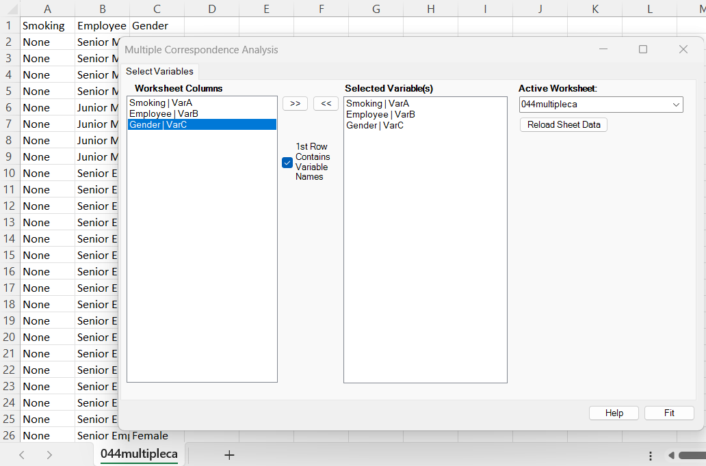
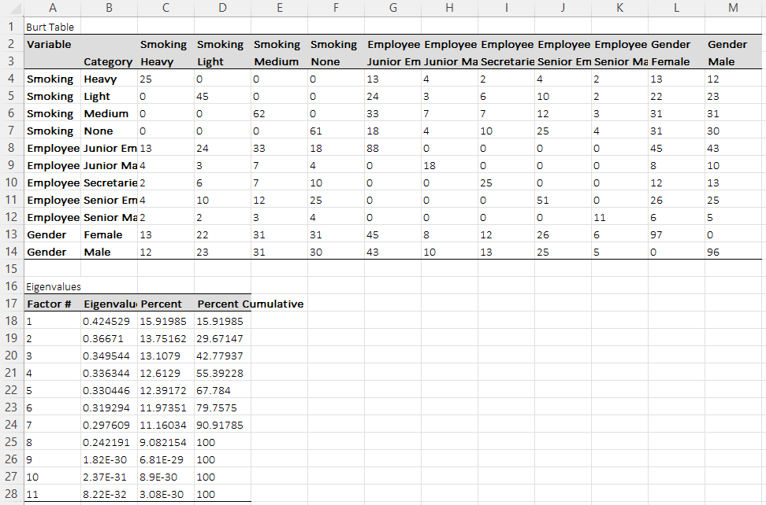
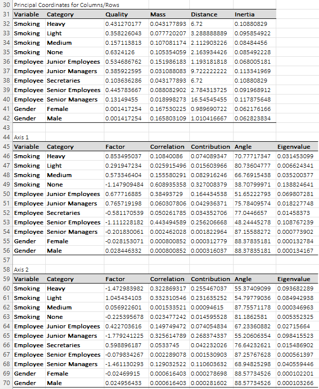
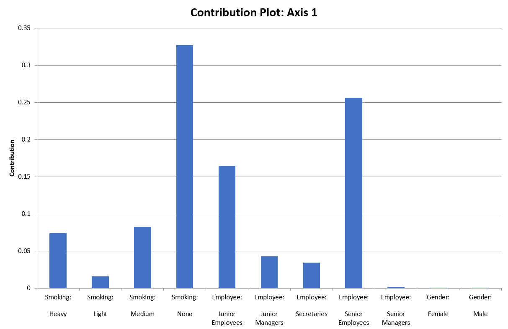
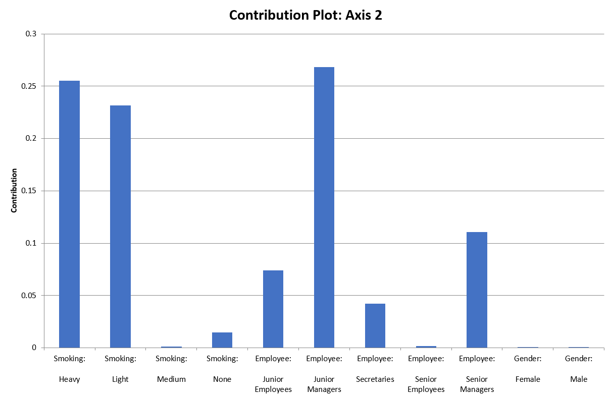
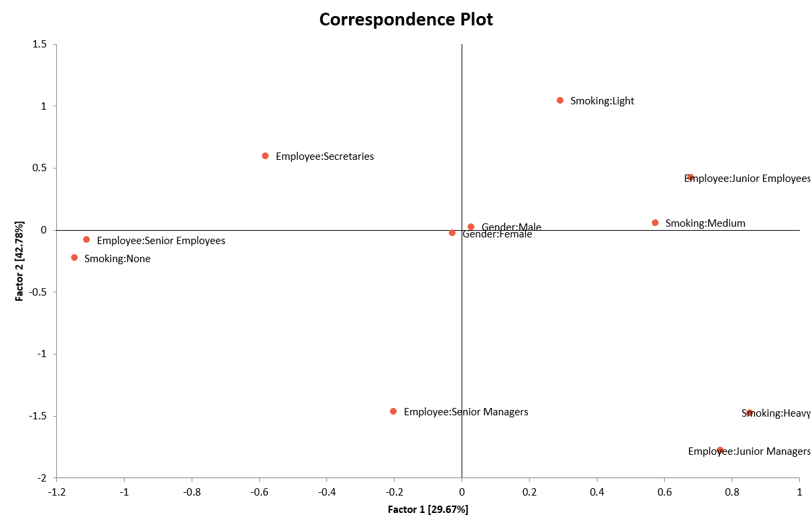

# Multiple Correspondence Analysis

**Includes:** Multiple correspondence analysis (MCA) via indicator/Burt matrix, Contribution plots, Biplot.  
**Purpose:** Extend correspondence analysis to **multiple categorical variables** (survey-style data) by mapping category levels into a low-dimensional space using the **chi-square** metric.

---

## Overview

Multiple Correspondence Analysis (MCA) generalizes **Correspondence Analysis (CA)** from a single `R x C` contingency table to a dataset with **several categorical variables** measured on the same individuals.

BESHStatNG implements MCA by:

1. Building an **indicator (design) matrix** `Z` (one-hot encoding of all category levels),
2. Building the **Burt table** `B = Z' Z` for reporting, and
3. Running **standard CA** on `Z` (chi-square metric + SVD) to obtain factor coordinates and diagnostics for the **category levels**.

The main outputs are:

- The **Burt table** (all pairwise cross-tabulations in one matrix),
- Eigenvalues (inertia) and percent explained,
- **Principal coordinates** (factor scores) and diagnostics for each category level,
- Axis-by-axis tables for all available axes (cos², contribution, angle, axis inertia contribution, etc.),
- Contribution plots for the leading axes (typically Axis 1 and Axis 2),
- A 2D correspondence plot of category levels (typically Factor 1 vs Factor 2).

!!! note "Relation to simple correspondence analysis"
    MCA reuses the same core CA mathematics (standardized residual matrix, SVD, principal coordinates, contributions, cos2, etc.).  
    For CA definitions and formulas, see **[Correspondence Analysis](correspondence-analysis.md)**, especially:

    - **[Mathematical details](correspondence-analysis.md#mathematical-details)**
    - **[Principal coordinates and diagnostics](correspondence-analysis.md#principal-coordinates)**

---

## Example dataset

This page uses the dataset shown in the screenshots:

- [044multipleca.csv](../assets/data/044multipleca/044multipleca.csv) (raw categorical data; first row contains variable names)
- [044multipleca_designmatrix.csv](../assets/data/044multipleca/044multipleca_designmatrix.csv) (design matrix output produced by the add-in)

In the example:

- **Smoking**: Heavy / Light / Medium / None  
- **Employee**: Junior Employees / Junior Managers / Secretaries / Senior Employees / Senior Managers  
- **Gender**: Female / Male

---

## Screenshots

### Input



### Output (Burt table and eigenvalues)



### Output (principal coordinates + axis tables)



### Output (contribution plots)





### Output (correspondence plot)



---

## Inputs in Excel

### Data range

Select one or more **categorical** columns (text) containing the variables to include in the MCA.

- If **1st Row Contains Variable Names** is checked, the first row of the selected range is used as variable names and excluded from the analysis.
- Otherwise, generic names are used.

!!! note "Category ordering"
    BESHStatNG orders category levels **alphabetically within each variable** when building the design matrix and Burt table. This affects the *display order* (not the underlying solution).

### Missing values

Values are trimmed. Empty cells are treated as an empty-string category (`""`).  
If you want an explicit missing category, recode missing values before running MCA (e.g., `"(Missing)"`).

---

## Steps in the add-in

1. In the Excel ribbon: **BESH Stat NG → Analyse → Multivariate Analysis → Multiple Correspondence Analysis**
2. Select the categorical columns to analyze.
3. (Optional) Check **1st Row Contains Variable Names**.
4. Click **Calculate**.

---

## Output and interpretation

BESHStatNG writes results to a **new workbook** with:

### 1) Data sheet

- The original categorical data (with Row ID).
- The **Design Matrix** `Z` (indicator matrix), shown with:
  - a header row of variable names (repeated across that variable’s category columns),
  - a second header row of category level names,
  - 0/1 indicator values.

This design matrix is also what is exported in `044multipleca_designmatrix.csv`.

### 2) MCA results sheet

#### Burt table

The **Burt table** `B = Z' Z` is a `K x K` block matrix (`K` = total number of category levels).

- Diagonal blocks: category frequencies for each variable,
- Off-diagonal blocks: cross-tabulations between pairs of variables.

Use the Burt table to see which category pairs co-occur often.

#### Eigenvalues (inertia)

The eigenvalues summarize how much association is captured by each axis.

- **Eigenvalue**: inertia of the axis
- **Percent**: eigenvalue divided by total inertia
- **Percent Cumulative**: cumulative percent across axes

Interpret the first few axes if they explain most of the inertia; in practice the first 1–2 axes are usually the most useful for plotting.

#### Principal coordinates for Columns/Rows (categories)

For each **category level**, BESHStatNG reports:

- **Mass**: marginal proportion (weight) of that category column
- **Distance**: squared distance from the origin in factor space
- **Inertia**: share of total inertia attributable to that category
- **Quality**: how well the available axes represent the category (sum of cos² across the stored axes)

Interpretation tips:

- Categories with **high Quality** are well represented on the 2D map.
- Categories with **high Inertia** are more influential in the overall association.

#### Axis tables (Axis 1, Axis 2, ...)

For each axis and each category, BESHStatNG reports:

- **Factor**: principal coordinate on that axis
- **Cos²**: squared cosine, proportion of the category’s distance explained by that axis
- **Contribution**: contribution of the category to that axis inertia
- **Angle**: angle (degrees) derived from cos²
- **Axis Inertia Contribution**: per-category share `mass × factor²`

Categories with large absolute **Factor** values are far from the origin on that axis; categories with large **Contribution** values define the axis; categories with high **Cos²** are well represented by that axis.

!!! note "Available axes"
    The full MCA solution can contain more than two axes.  
    BESHStatNG stores diagnostics by available axis, while the charts mainly emphasize the leading low-dimensional view (usually Axis 1 and Axis 2).

#### Charts

- **Contribution plots**: contributions by category for the leading plotted axes, usually Axis 1 and Axis 2.
- **Correspondence plot**: category points on Factor 1 vs Factor 2.

!!! note "Why only categories are plotted"
    In MCA, individual points (rows of `Z`) can be numerous and are often omitted to keep the plot readable.  
    BESHStatNG’s MCA plot displays the **category levels**; labels are shown as `Variable:Category`.

---

## Mathematical details specific to MCA

Let there be `N` individuals and `Q` categorical variables. Variable `q` has `K_q` category levels, and the total number of category levels is:

`K = sum_{q=1..Q} K_q`.

### Indicator (design) matrix

The indicator matrix `Z` is `N x K`, where `z_ik = 1` if individual `i` is in category `k`, otherwise `0`.

Each row has exactly `Q` ones (one active level per variable) when there are no missing values.

### Burt table

The Burt table is:

`B = Z' Z`,

a `K x K` matrix. Blocks of `B` correspond to all pairwise contingency tables among variables; diagonal blocks contain the category frequencies.

### CA step (reused mathematics)

BESHStatNG then applies **standard correspondence analysis** to `Z` using the same CA definitions as in:

- **[Correspondence Analysis → Mathematical details](correspondence-analysis.md#mathematical-details)**

Distances, principal coordinates, contributions, cos² and quality are computed with the same formulas as CA, applied to the contingency table `Z`.

---

## R code (reference)

The MCA solution can be reproduced in R using common packages such as `ca` or `FactoMineR`.  
Axis signs may differ (mirrored plots) because the solution is invariant to multiplying an axis by `-1`.

### Build the same design matrix and Burt table

```r
dat <- read.csv("044multipleca.csv", stringsAsFactors = TRUE)

# Match BESHStatNG's alphabetical level ordering
# (BESHStatNG sorts levels within each variable)
dat[] <- lapply(dat, function(x) factor(x, levels = sort(unique(x))))

# Indicator (design) matrix: one-hot, no intercept
Z <- model.matrix(~ 0 + ., data = dat)

# Burt table
B <- t(Z) %*% Z
```

### Using ca::mjca (closest to the add-in’s indicator-matrix MCA)

```r
library(ca)

dat <- read.csv("044multipleca.csv", stringsAsFactors = TRUE)
dat[] <- lapply(dat, function(x) factor(x, levels = sort(unique(x))))

res <- mjca(dat, lambda = "indicator")

# Eigenvalues (inertia) = sv^2
res$sv^2

# Category principal coordinates
res$colcoord

# Masses and distances (names may vary by package version)
res$colmass
res$coldist
```

### Using FactoMineR::MCA (widely used; may apply additional conventions)

```r
library(FactoMineR)
library(factoextra)

dat <- read.csv("044multipleca.csv", stringsAsFactors = TRUE)
dat[] <- lapply(dat, function(x) factor(x, levels = sort(unique(x))))

res <- MCA(dat, graph = FALSE)

# Eigenvalues table
res$eig

# Category coordinates, cos2 and contributions
res$var$coord
res$var$cos2
res$var$contrib / 100  # FactoMineR returns percent contributions

# Plot similar to the correspondence plot
fviz_mca_biplot(res, repel = TRUE)

# Contribution plots similar to BESHStatNG
fviz_contrib(res, choice = "var", axes = 1)
fviz_contrib(res, choice = "var", axes = 2)
```

### Expected differences vs BESHStatNG

- **Axis sign / mirroring:** coordinates can be multiplied by `-1` without changing the solution (plots may be mirrored).
- **Eigenvalue conventions:** some MCA implementations report alternative inertias (e.g., Burt vs indicator, Benzécri/Greenacre adjustments). BESHStatNG reports the **standard CA eigenvalues** from the centered residual matrix applied to `Z` (indicator-matrix route).
- **Contribution scale:** some R outputs report contributions in **percent**; BESHStatNG reports proportions (0–1).
- **Category ordering:** ensure factor level ordering matches (BESHStatNG uses alphabetical order).
- **Rounding/formatting:** small differences may occur due to rounding and display formatting.

---

## References

- Greenacre, M. (1984). *Theory and Applications of Correspondence Analysis*. Academic Press.  
- Greenacre, M. (2017). *Correspondence Analysis in Practice* (3rd ed.). CRC Press.  
- Benzécri, J.-P. (1973). *L'Analyse des Données, Vol. 2: L'Analyse des Correspondances*. Dunod.  
- Lebart, L., Morineau, A., & Piron, M. (1995). *Statistique Exploratoire Multidimensionnelle*. Dunod.

---

## See also

- [Correspondence Analysis](correspondence-analysis.md) (simple CA on one contingency table)  
- [Principal Component Analysis](principal-component-analysis.md)  
- [Home](../index.md)
