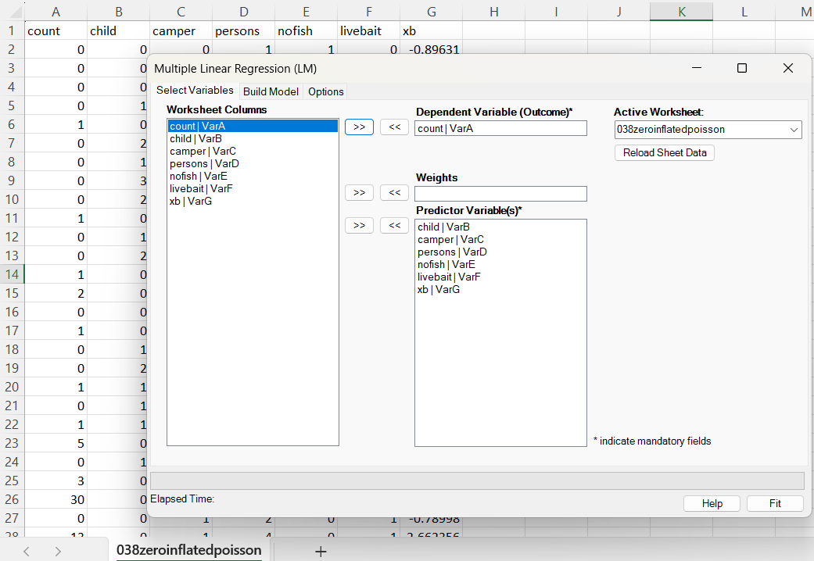
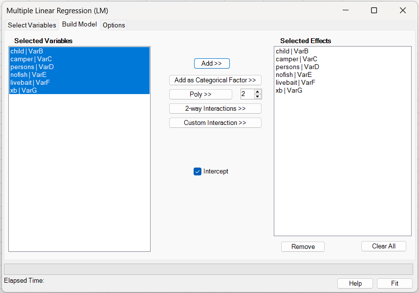
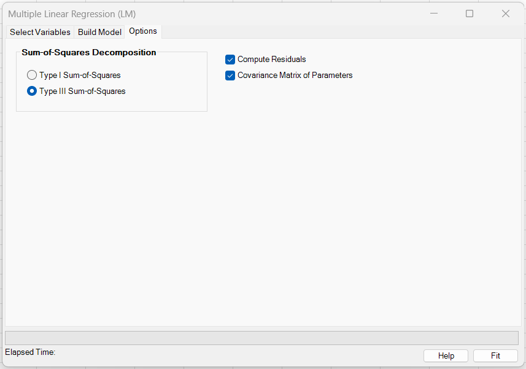
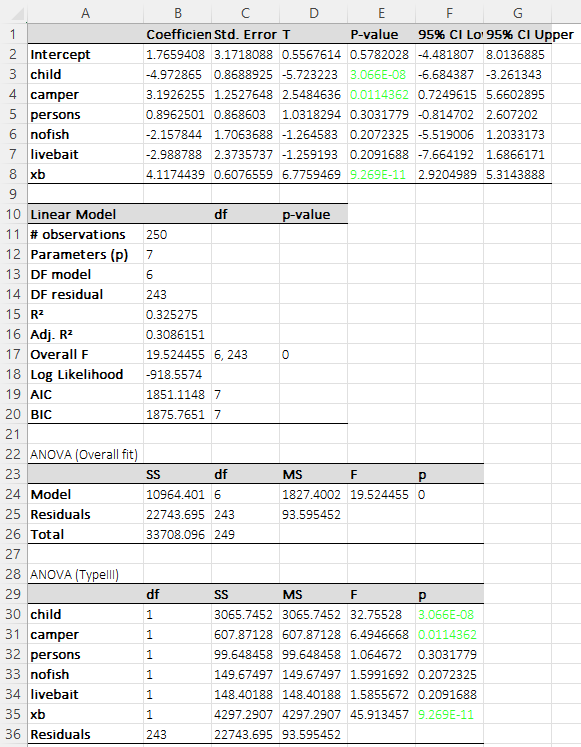
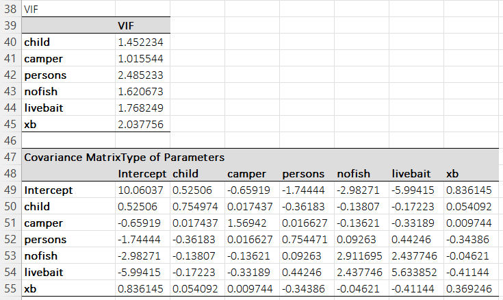

# Multiple Linear Regression (LM)

**Includes:** Ordinary least squares (OLS) / weighted least squares (WLS), optional intercept, Type I or Type III term sums-of-squares (ANOVA), coefficient covariance matrix, residual/influence diagnostics, VIF.  
**Purpose:** Fit a standard linear regression model, report coefficients and ANOVA-style term tests.

---

## Overview

Multiple linear regression models a continuous outcome \(y\) as a linear combination of predictors:

\[
y_i = \beta_0 + \beta_1 x_{i1} + \cdots + \beta_p x_{ip} + \varepsilon_i,\qquad i=1,\ldots,n,
\]

where \(\varepsilon_i\) are random errors (often assumed independent with mean 0 and constant variance). The fitted coefficients \(\hat\beta\) quantify the expected change in \(y\) for a one-unit change in a predictor, holding other predictors constant.

This add-in fits the model using **OLS** (all weights \(w_i=1\)) or **WLS** (user-specified positive weights), and reports:

- coefficient estimates, standard errors, t-tests, and confidence intervals,
- overall model fit (R², adjusted R², overall F-test),
- ANOVA decomposition and **Type I** (sequential) or **Type III** (partial) term tests,
- multicollinearity diagnostics (VIF),
- residual and influence diagnostics (optional).

---

## User interface

### Select Variables



1. **Dependent Variable (Outcome)**: numeric response \(y\).
2. **Predictor Variable(s)**: covariates used to build the design matrix \(X\).
3. **Weights** (optional): if supplied, the model is fit by **weighted** least squares with weights \(w_i>0\).

### Build Model



- Use **Add >>** to move selected variables into **Selected Effects** as **main effects**.

#### Adding categorical factors

- **Add as Categorical Factor >>**: marks the selected predictor(s) as categorical main effects in the linear model.
- Categorical predictors must be supplied as numeric-coded columns (for example `0/1`, `1/2/3`, etc.). Text/string factor columns are not supported in LM.
- In the current LM implementation, categorical support applies to main effects only.
- Polynomial terms and interaction terms involving categorical predictors are not implemented yet.

#### Adding polynomial and interaction terms

The LM dialog can also create derived terms directly from the selected variables:

- **Poly >>**: creates polynomial terms for the currently selected variables in **Selected Variables**.
  - Choose the degree using the spin control (e.g. `2` for squared terms).
  - A polynomial effect is shown in **Selected Effects** using the convention: `"Age | VarA"^2`
    - The quoted part (`"Age | VarA"`) is the underlying *raw* variable.
    - The coefficient/term label is reported as `Age^2` (based on the header portion of the variable name).

- **2-way Interactions >>**: creates *all pairwise* interactions among the currently selected variables in **Selected Variables**.
  - Interaction effects are shown using the convention: `"Age | VarA":"Sex | VarB"`
  - The coefficient/term label is reported as `Age:Sex`.

- **Custom Interaction >>**: (advanced) creates a single interaction term from the currently selected variables (e.g. a 3-way interaction).  
  Use this when you want one combined interaction term instead of all pairwise combinations.

**Important notes**

- Derived terms are supported for **Multiple Linear Regression (LM)**.
- **Type I sum-of-squares** depends on the **order** of terms in **Selected Effects**. If you use Type I SS, arrange the list (remove and re-add effects in the desired sequence) in the intended sequence (e.g., add main effects before interactions).
- For **term-wise ANOVA**, polynomial terms are grouped with their corresponding main effect (e.g., `Age` and `Age^2` are tested as a single term with multiple degrees of freedom).
- **Intercept**: include or exclude \(\beta_0\). When excluded, the total sum-of-squares and R² follow the **uncentered** convention.
- For a **categorical predictor with an intercept**, the model uses the smallest observed numeric level as the reference level.
- If the model is fit **without an intercept**, all observed levels are included and no reference level is omitted.

### Options



**Sum-of-squares decomposition**

- **Type I Sum-of-Squares**: sequential (depends on the order of effects in **Selected Effects**).
- **Type III Sum-of-Squares**: partial (tests each effect adjusting for all other effects).

**Model output / diagnostics**

- **Compute Residuals**: exports fitted values, residuals, leverage, standardized residuals, Cook’s distance, and jackknife/PRESS residuals to the **Data** sheet.
- **Covariance Matrix of Parameters**: prints \(\widehat{\mathrm{Var}}(\hat\beta)\) to the **LM** sheet.

---

## Example dataset

Download the example dataset used here: [038zeroinflatedpoisson.csv](../assets/data/038zeroinflatedpoisson/038zeroinflatedpoisson.csv)

The dataset contains:

- `count`: outcome \(y\) (numeric).
- Predictors: `child`, `camper`, `persons`, `nofish`, `livebait`, `xb`.

The residual output for the example is provided as: [032linearmodel_residuals.csv](../assets/data/032linearmodel/032linearmodel_residuals.csv)

---

## Model and estimation

### OLS / WLS objective

Let \(X\in\mathbb{R}^{n\times p}\) be the design matrix (including an intercept column if selected), \(y\in\mathbb{R}^n\) the response, and \(W=\mathrm{diag}(w_1,\ldots,w_n)\) a diagonal matrix of **positive** weights.

The fitted coefficients minimize the weighted sum of squares:

\[
\mathrm{SSE}(\beta) = \sum_{i=1}^n w_i (y_i - x_i^\top\beta)^2
= (y - X\beta)^\top W (y - X\beta),
\]

with solution (when \(X^\top W X\) is full rank):

\[
\hat\beta = (X^\top W X)^{-1} X^\top W y.
\]

### Implementation details

BESHStatNG computes WLS by the standard transformation:

\[
y_i^{*} = \sqrt{w_i}\,y_i,\qquad x_i^{*} = \sqrt{w_i}\,x_i,
\]

then solves an OLS problem on \((X^{*},y^{*})\).


Internally:

- the normal equations are formed via \(X^\top W X\) and \(X^\top W y\);
- coefficients are obtained by solving \((X^\top W X)\hat\beta = X^\top W y\) using a QR-based solver on \(X^\top W X\);
- \((X^\top W X)^{-1}\) for covariance/diagnostics is computed via a Cholesky-based matrix inverse.

---

## Inference and reported quantities

### Residual sums of squares and degrees of freedom

Let residuals be \(e = y - \hat y\) with \(\hat y = X\hat\beta\).

- Weighted residual sum of squares:

\[
\mathrm{SSE}=\sum_{i=1}^n w_i e_i^2.
\]

- Mean squared error:

\[
\mathrm{MSE}=\frac{\mathrm{SSE}}{n-p},
\qquad \text{with } df_{\mathrm{resid}} = n-p.
\]

- Total sum of squares:
  - if an intercept is included:

\[
\mathrm{SST}=\sum_{i=1}^n w_i (y_i-\bar y_w)^2,\quad
\bar y_w=\frac{\sum_i w_i y_i}{\sum_i w_i},
\]

  - if no intercept, the **uncentered** convention is used:

\[
\mathrm{SST}=\sum_{i=1}^n w_i y_i^2.
\]

- Regression sum of squares: \(\mathrm{SSR}=\mathrm{SST}-\mathrm{SSE}\).

Degrees of freedom:

- \(df_{\mathrm{model}} = p-1\) with intercept, else \(df_{\mathrm{model}}=p\),
- \(df_{\mathrm{total}} = n-1\) with intercept, else \(df_{\mathrm{total}}=n\).

For a categorical predictor with K observed levels:

- with intercept: the term contributes K-1 degrees of freedom
- without intercept: the term contributes K degrees of freedom

In the ANOVA table, all dummy columns for a categorical predictor are tested together as a single term.

### R² and adjusted R²

\[
R^2 = 1-\frac{\mathrm{SSE}}{\mathrm{SST}},\qquad
\bar R^2 = 1-(1-R^2)\frac{df_{\mathrm{total}}}{df_{\mathrm{resid}}}.
\]

### Coefficient covariance, t-tests, and confidence intervals

The (model-based) coefficient covariance is

\[
\widehat{\mathrm{Var}}(\hat\beta)=\mathrm{MSE}\,(X^\top W X)^{-1}.
\]

Standard errors: \(\mathrm{SE}_j = \sqrt{\widehat{\mathrm{Var}}(\hat\beta)_{jj}}\).

t-statistics and two-sided p-values:

\[
t_j = \frac{\hat\beta_j}{\mathrm{SE}_j},\qquad
p_j = 2\left[1 - F_t\left(|t_j|; df_{\mathrm{resid}}\right)\right].
\]

Two-sided \(100(1-\alpha)\%\) confidence intervals:

\[
\hat\beta_j \pm t_{1-\alpha/2,\,df_{\mathrm{resid}}}\,\mathrm{SE}_j.
\]

### Overall model F-test

\[
\mathrm{MSR}=\frac{\mathrm{SSR}}{df_{\mathrm{model}}},\qquad
F=\frac{\mathrm{MSR}}{\mathrm{MSE}},
\]

with p-value \(1-F_F(F; df_{\mathrm{model}}, df_{\mathrm{resid}})\).  
(For an intercept-only model, \(df_{\mathrm{model}}=0\) and the overall F-test is undefined.)

### AIC, BIC, and log-likelihood

BESHStatNG reports the Gaussian log-likelihood using the **ML** variance estimator \(\hat\sigma^2 = \mathrm{SSE}/n\):

\[
\log L = -\frac{n}{2}\left[\log(2\pi\hat\sigma^2)+1\right],
\]

\[
\mathrm{AIC} = -2\log L + 2p,\qquad
\mathrm{BIC} = -2\log L + \log(n)\,p.
\]

!!! note "Constant-offset conventions"
    Some software reports \(n\log(\mathrm{SSE}/n)+2p\), which differs from the expression above by an additive constant \(n(\log(2\pi)+1)\). Model comparisons on the same data are unaffected by this constant offset.

---

## Term tests: Type I vs Type III sums of squares

BESHStatNG can compute an ANOVA-style table by **refitting reduced models** and comparing SSE.

### Type I (sequential) SS

Terms are added in the order shown in **Selected Effects**. For term \(k\),

\[
\mathrm{SS}_k^{(I)} = \mathrm{SSE}(\text{previous model}) - \mathrm{SSE}(\text{model with term }k\text{ added}),
\]

with \(df_k\) equal to the number of columns added for that term. The F-test uses

\[
F_k = \frac{\mathrm{SS}_k^{(I)}/df_k}{\mathrm{MSE}_{\text{full}}}.
\]

Type I results **depend on term order** when predictors are correlated.

### Type III (partial) SS

Each term is tested **adjusting for all other terms**. For term \(k\),

\[
\mathrm{SS}_k^{(III)} = \mathrm{SSE}(\text{reduced model without term }k) - \mathrm{SSE}(\text{full model}),
\]

with \(df_k\) equal to the number of columns dropped. The F-test uses

\[
F_k = \frac{\mathrm{SS}_k^{(III)}/df_k}{\mathrm{MSE}_{\text{full}}}.
\]

For single-degree-of-freedom terms, the Type III F statistic matches the squared t-test: \(F_k = t_k^2\).

---

## Residual and influence diagnostics

If **Compute Residuals** is enabled, the add-in exports a table (on the **Data** sheet) with:

- **Fitted**: \(\hat y_i\)
- **Residual**: \(e_i = y_i - \hat y_i\)
- **Leverage** (\(h_{ii}\)): diagonal of the WLS hat matrix

\[
h_{ii} = w_i\,x_i^\top (X^\top W X)^{-1} x_i
\]

- **Std. Residual** (internally studentized):

\[
r_i = \frac{\sqrt{w_i}\,e_i}{\sqrt{\mathrm{MSE}(1-h_{ii})}}
\]

- **Jackknife Residual** (deleted/PRESS residual):

\[
e_{(i)}=\frac{e_i}{1-h_{ii}}
\]

- **Cook’s D** (as implemented):

\[
D_i = \frac{w_i e_i^2}{p\,\mathrm{MSE}} \cdot \frac{h_{ii}}{(1-h_{ii})^2}.
\]

!!! note
    BESHStatNG reports the *internally* studentized residual and the PRESS residual. If you need externally studentized (deleted) residuals, you can compute them in R (`rstudent`) or from leave-one-out MSE.

---

## Multicollinearity: VIF

The add-in reports variance inflation factors (VIF) computed from the (weighted) predictor correlation matrix \(R\) (intercept excluded):

\[
\mathrm{VIF}_j = (R^{-1})_{jj}.
\]

Large VIF values indicate strong linear dependence among predictors and inflated standard errors.

---

## Output (worksheets)

### Data sheet

Contains:

1. **Row ID** (Excel row index of the retained observation),
2. the selected variables,
3. optional **Weights** column (if used),
4. optional residual diagnostics table (if enabled).

### LM sheet





The LM sheet includes:

- **Coefficient table**: estimate, SE, t, p-value, and confidence intervals.
- **Model summary**: \(n\), \(p\), df, \(R^2\), adjusted \(R^2\), overall F-test, logLik, AIC, BIC.
- **ANOVA (Overall fit)**: SSR/SSE/SST and overall F-test.
- **ANOVA (Type I or Type III)**: term tests based on selected SS type.
- **VIF** table.
- Optional **Covariance Matrix of Parameters**.

If categorical predictors are used, the **Coefficient table**, **ANOVA table(s)**, **VIF** table, and optional **Covariance Matrix** include footnotes identifying which predictors were treated as categorical and which reference levels were used. In coefficient-style tables, categorical predictors are expanded into indicator columns with labels such as `x1[2]`, `x1[3]`, etc., while ANOVA reports the grouped term using the base predictor name.

---

## R code to reproduce the example

This script reproduces the example output using base R plus `car` for Type III ANOVA and VIF.

```r
# Packages
library(car)      # Anova(type=3), vif()
# library(broom)  # optional for tidy output

dat <- read.csv("038zeroinflatedpoisson.csv")

# Fit OLS model (matches add-in example)
fit <- lm(count ~ child + camper + persons + nofish + livebait + xb, data = dat)

summary(fit)                 # coefficients with t-tests
confint(fit, level = 0.95)   # confidence intervals
vcov(fit)                    # covariance matrix of coefficients

# Overall ANOVA (model / residual / total)
anova(fit)                   # Type I (sequential) SS by default in base R

# Type III term tests (matches add-in when Type III selected)
Anova(fit, type = 3)         # partial SS/F tests

# VIF (matches add-in for OLS; WLS may differ by weighting convention)
vif(fit)

# Diagnostics to match residual export
h <- hatvalues(fit)                          # leverage
e <- resid(fit)                              # raw residual
r_std <- rstandard(fit)                      # internally studentized residual
cook <- cooks.distance(fit)                  # Cook's D
press <- e / (1 - h)                         # jackknife / PRESS residual
yhat <- fitted(fit)

diag_tbl <- data.frame(
  Fitted = yhat,
  Residual = e,
  Leverage = h,
  Std.Residual = r_std,
  CooksD = cook,
  Jackknife.Residual = press
)

head(diag_tbl)

# Information criteria
logLik(fit)
AIC(fit); BIC(fit)
```

### Expected differences vs R

- **Type I SS** depends on predictor order in both environments. Ensure the same order in the Excel **Selected Effects** list and in the R formula. (If you need a different order in BESHstatNG, remove and re-add effects in the desired sequence.)
- **Type III SS** in R (`car::Anova(type=3)`) matches BESHStatNG when the same term structure, factor coding, and reference levels are used.
- **VIF**: BESHStatNG uses a **weighted** predictor correlation matrix for WLS; some R functions compute VIFs from the (unweighted) model matrix by default. For OLS, results should match closely.
- **AIC/BIC**: constant-offset conventions differ across some software; R’s `AIC(lm)`/`BIC(lm)` should match BESHStatNG’s convention for OLS.
- **Categorical predictors**: BESHStatNG can now treat numeric-coded predictors as categorical main effects directly from the LM dialog.
- To reproduce the same result in R, convert the predictor to a factor and use the same reference level. With an intercept, BESHStatNG uses the smallest observed numeric value as the reference level.

```r 
dat$x1 <- factor(dat$x1)
dat$x1 <- relevel(dat$x1, ref = as.character(min(as.numeric(as.character(dat$x1)))))
fit <- lm(y ~ x + x1, data = dat)
car::Anova(fit, type = 3)
```

---

## Notes and assumptions

- Observations with missing values in any selected variable (and in the weights column, if used) are removed during import.
- Weights must be **finite and strictly positive**.
- Standard linear model assumptions (linearity, independent errors, constant variance, and approximate normality for t/F inference) should be assessed using residual plots and domain knowledge.

---

## References

- Draper, N. R., & Smith, H. (1998). *Applied Regression Analysis* (3rd ed.). Wiley.
- Montgomery, D. C., Peck, E. A., & Vining, G. G. (2012). *Introduction to Linear Regression Analysis* (5th ed.). Wiley.
- Kutner, M. H., Nachtsheim, C. J., Neter, J., & Li, W. (2005). *Applied Linear Statistical Models* (5th ed.). McGraw-Hill/Irwin.
- Fox, J., & Weisberg, S. (2019). *An R Companion to Applied Regression* (3rd ed.). Sage. *(Type I/III tests, ANOVA conventions, VIF discussion in an applied context.)*

## See also

- [Generalized Linear Models (GLM)](generalized-linear-models-glm.md)
- [Theil–Sen Simple Regression](theil-sen-simple-regression.md)
- [One-way ANOVA](one-way-anova.md)
