# Multivariate Control Charts

**Includes:** Hotelling T-squared charts for individual observations and rational subgroups, generalized-variance charts for subgroup dispersion, PCA T-squared and PCA Q charts, multivariate EWMA (MEWMA), Crosier multivariate CUSUM (MCUSUM), Phase I and Phase II stages, historical mean/covariance models, exclusions, covariance regularization, rank-deficiency handling, point diagnostics, variable contributions, chart data, signals, settings, and audit output.  
**Purpose:** Monitor several correlated process measurements jointly, detect changes in multivariate location or dispersion, and identify which variables or principal-component directions contribute to a signal.

---

## Overview

A multivariate control chart reduces several related measurements to a single monitoring statistic while retaining their covariance structure. This is useful when a process can move in a combination of variables even though no individual variable appears unusual on its own.

For example, temperature, pressure, and flow may each remain within their separate univariate limits while their joint relationship changes. A multivariate chart can detect that coordinated change because it evaluates the measurements together.

BESHStatNG supports two observation structures:

- **Individual observations:** every worksheet row is one ordered multivariate observation;
- **Rational subgroups:** several complete rows share a subgroup ID and are summarized as one chart point.

The analysis follows the same two-stage logic as the univariate [Control Charts](control-charts.md) procedure:

- **Phase I — establish the model:** estimate the in-control mean vector, covariance structure, PCA model, or dispersion model from eligible baseline observations;
- **Phase II — monitor the process:** compare later observations or subgroups with the Phase I model and its frozen limits.

!!! important "Joint monitoring complements univariate charts"
    A multivariate statistic can show that the joint process has changed, but it can hide changes that occur only in a low-variance direction or in a single variable. Use the diagnostics and contribution output to investigate signals, and retain suitable univariate charts when individual-variable behaviour must also be monitored.

---

## Choosing a multivariate chart

| Chart | Observation structure | What it monitors | Typical use |
|---|---|---|---|
| **Hotelling T-squared** | Individuals or rational subgroups | Overall multivariate location relative to the fitted mean and covariance | General-purpose detection of large joint mean shifts |
| **Generalized variance** | Rational subgroups only | Determinant of each subgroup covariance matrix, \(|S_i|\) | Detect changes in overall within-subgroup dispersion |
| **PCA T-squared** | Individuals only | Variation inside the retained principal-component model space | Monitor dominant correlated process directions while reducing dimension |
| **PCA Q** | Individuals only | Residual variation outside the retained PCA model | Detect new relationships or changes not explained by the retained components |
| **MEWMA** | Individuals only | Exponentially weighted multivariate location | Detect smaller sustained joint shifts |
| **MCUSUM (Crosier)** | Individuals only | Accumulated standardized multivariate deviation | Detect persistent joint mean shifts with a CUSUM design |

### Location and dispersion answer different questions

Hotelling T-squared, PCA T-squared, MEWMA, and MCUSUM primarily monitor **location**. A generalized-variance chart monitors **dispersion**. A process may change in one without changing the other.

For subgroup monitoring, consider using both:

- a subgroup Hotelling T-squared chart for changes in the vector of subgroup means;
- a generalized-variance chart for changes in within-subgroup covariance.

### PCA T-squared and PCA Q should be interpreted together

PCA separates each observation into:

- a **retained model-space component**, monitored by PCA T-squared;
- a **residual component**, monitored by PCA Q.

A point can therefore signal on one chart and not the other. PCA T-squared detects unusual scores along retained directions, whereas PCA Q detects observations that do not follow the relationships represented by the retained model.

---

## Example dataset

Download the data used in the screenshots and worked examples:

- [116multivariatecontrolcharts.csv](../assets/data/116multivariatecontrolcharts/116multivariatecontrolcharts.csv)

The file contains **150 complete observations**, three correlated measurement variables, and **30 subgroups of size 5**.

| Rows or points | Stage and phase | Purpose |
|---|---|---|
| Observations 1–100 | **Baseline**, Phase I | Estimate the individual-observation model |
| Observations 101–150 | **Monitoring**, Phase II | Monitor later individual observations |
| Subgroups 1–20 | **Baseline**, Phase I | Estimate subgroup models |
| Subgroups 21–30 | **Monitoring**, Phase II | Monitor later subgroups |
| Observations 36–40 / subgroup 8 | Explicitly excluded | Demonstrate a documented calibration-check exclusion |

Important columns are:

| Column | Contents | Role in the dialog |
|---|---|---|
| `Temperature_C` | Temperature measurement | Measurement variable |
| `Pressure_kPa` | Pressure measurement | Measurement variable |
| `Flow_L_min` | Flow measurement | Measurement variable |
| `ObservationOrder` | Individual-observation order | Sequence/date/time for individual charts |
| `ObservationLabel` | `Obs-001` to `Obs-150` | Sample label for individual charts |
| `SubgroupID` | `G01` to `G30` | Rational-subgroup identifier |
| `SubgroupSequence` | Subgroup order 1–30 | Sequence/date/time for subgroup charts |
| `SubgroupLabel` | `Subgroup 01` to `Subgroup 30` | Sample label for subgroup charts |
| `Stage`, `Phase` | Baseline/Monitoring and Phase I/II | Build stage definitions |
| `Excluded` | Yes/No indicator | Build exclusions |
| `ExclusionReason` | Calibration-check explanation | Preserve the reason in the audit output |

The supplied result workbooks are:

- [116multivariatecontrolcharts_hottelingsT_1.xlsx](../assets/data/116multivariatecontrolcharts/116multivariatecontrolcharts_hottelingsT_1.xlsx) — individual Hotelling T-squared
- [116multivariatecontrolcharts_PCATsquared_2.xlsx](../assets/data/116multivariatecontrolcharts/116multivariatecontrolcharts_PCATsquared_2.xlsx) — PCA T-squared
- [116multivariatecontrolcharts_PCAQ_3.xlsx](../assets/data/116multivariatecontrolcharts/116multivariatecontrolcharts_PCAQ_3.xlsx) — PCA Q
- [116multivariatecontrolcharts_MEWMA_4.xlsx](../assets/data/116multivariatecontrolcharts/116multivariatecontrolcharts_MEWMA_4.xlsx) — MEWMA
- [116multivariatecontrolcharts_MCUSUM_5.xlsx](../assets/data/116multivariatecontrolcharts/116multivariatecontrolcharts_MCUSUM_5.xlsx) — MCUSUM
- [116multivariatecontrolcharts_hottelingsT_subgroup1.xlsx](../assets/data/116multivariatecontrolcharts/116multivariatecontrolcharts_hottelingsT_subgroup1.xlsx) — subgroup Hotelling T-squared
- [116multivariatecontrolcharts_generalizedvariance_subgroup2.xlsx](../assets/data/116multivariatecontrolcharts/116multivariatecontrolcharts_generalizedvariance_subgroup2.xlsx) — generalized variance

!!! note "The example baseline contains intentional signals"
    The synthetic data demonstrate several types of multivariate change, including changes inside and outside a retained PCA model. Consequently, some Phase I points signal in the supplied results. In a real analysis, investigate those points and document any assignable causes before accepting the Phase I model for routine monitoring.

---

## Shared settings for the individual-observation examples

The five individual examples use the same three measurement variables and metadata assignments. Only **Chart type** and the chart-specific **Method Options** change.

### Model and Limits

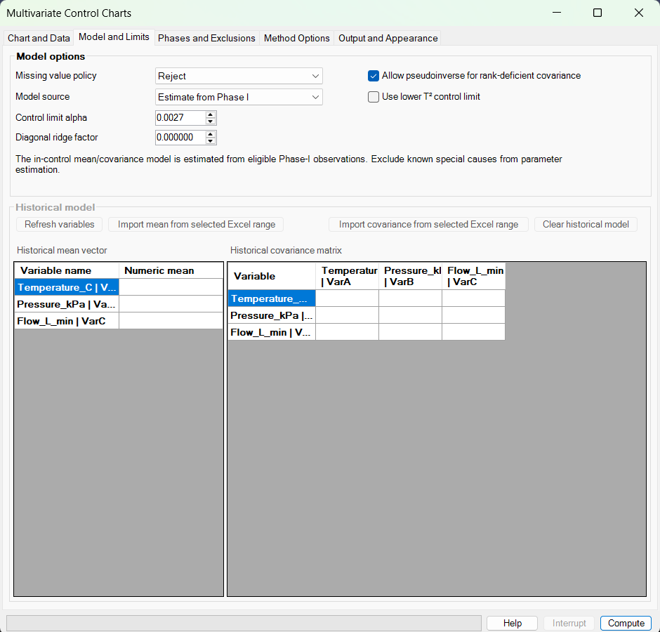

Use:

| Setting | Value |
|---|---|
| Missing value policy | **Reject** |
| Model source | **Estimate from Phase I** |
| Control limit alpha | `0.0027` |
| Diagonal ridge factor | `0.000000` |
| Allow pseudoinverse for rank-deficient covariance | **Selected for Hotelling T-squared** |
| Use lower T-squared control limit | **Not selected** |

The historical-model grids remain disabled because the model is estimated from Phase I.

### Phases and Exclusions

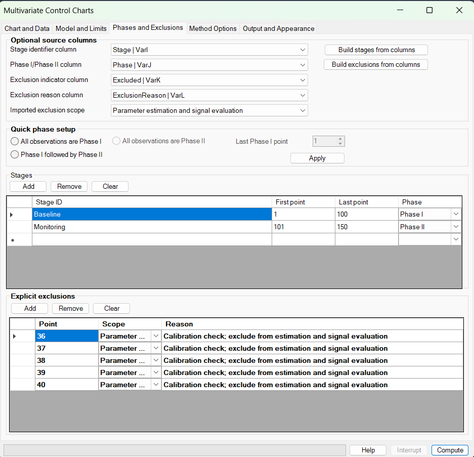

Build the stages from `Stage` and `Phase`, and the exclusions from `Excluded` and `ExclusionReason`:

| Stage | First point | Last point | Phase |
|---|---:|---:|---|
| Baseline | 1 | 100 | Phase I |
| Monitoring | 101 | 150 | Phase II |

Points 36–40 are excluded from both parameter estimation and signal evaluation with the reason **Calibration check: exclude from estimation and signal evaluation**. This leaves **95 eligible Phase I observations** for fitting the individual model.

### Output and Appearance

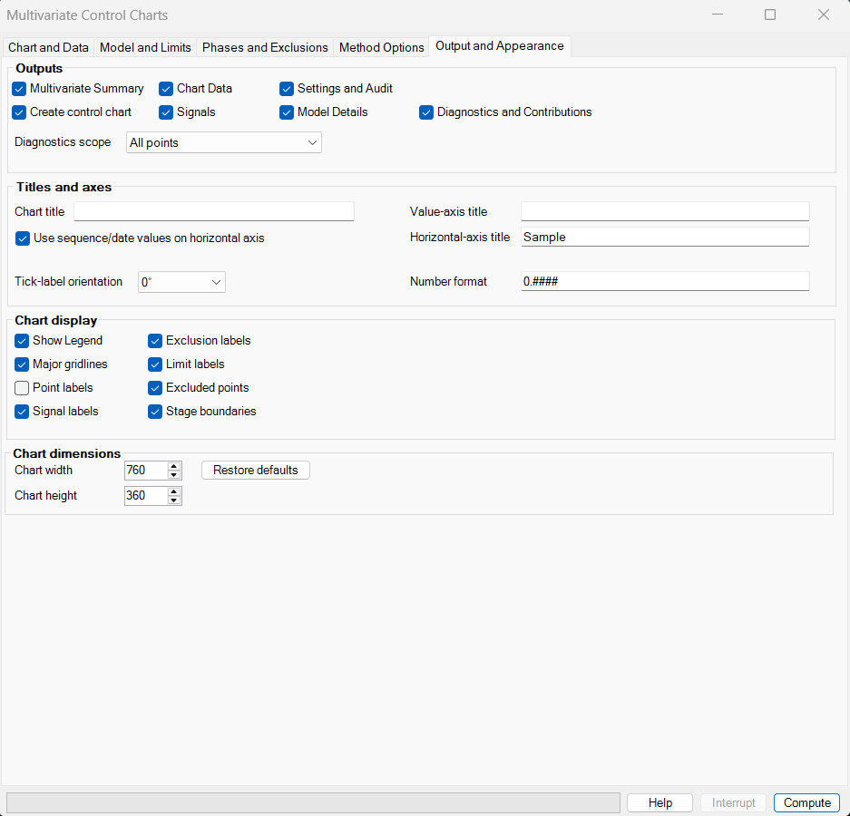

The examples request every output:

- Multivariate Summary;
- Multivariate Chart;
- Chart Data;
- Signals;
- Settings and Audit;
- Model Details;
- Diagnostics and Contributions for **All points**.

The charts use `ObservationOrder` on the horizontal axis, show signals, exclusions, limits, stage boundaries, and major gridlines, and use dimensions of 760 × 360 pixels.

---

## Worked example 1: individual Hotelling T-squared

Hotelling T-squared measures the squared covariance-adjusted distance between each observation vector and the Phase I process mean.

### Chart and Data

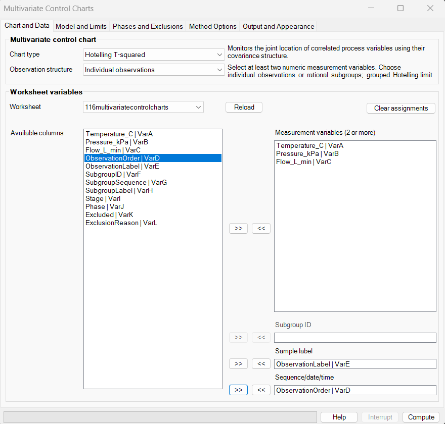

Use:

| Setting | Value |
|---|---|
| Chart type | **Hotelling T-squared** |
| Observation structure | **Individual observations** |
| Measurement variables | `Temperature_C`, `Pressure_kPa`, `Flow_L_min` |
| Sample label | `ObservationLabel` |
| Sequence/date/time | `ObservationOrder` |

### Method Options

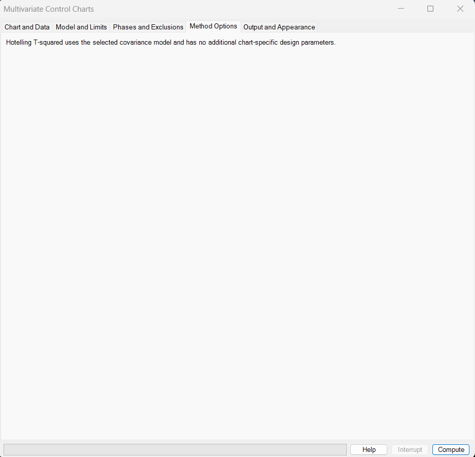

No additional chart-specific parameter is required. The chart uses the mean and covariance model defined on **Model and Limits**.

### Expected result

The supplied workbook reports:

| Result | Expected value |
|---|---|
| Eligible Phase I observations | 95 |
| Effective dimension | 3 |
| Pseudoinverse used | No |
| Phase I UCL | 14.6068 |
| Phase II UCL | 17.4888 |
| Signalled points | 132, 135–140 |
| Signal occurrences / signalled points | 7 / 7 |
| Calculation warnings | 0 |

The large joint departures at points 136–140 are clear Hotelling signals. Use the signed variable contributions in **Diagnostics** to examine how temperature, pressure, and flow combine to produce each T-squared value.

---

## Worked example 2: PCA T-squared

PCA T-squared monitors the part of each observation explained by the retained principal components.

### Chart and Data

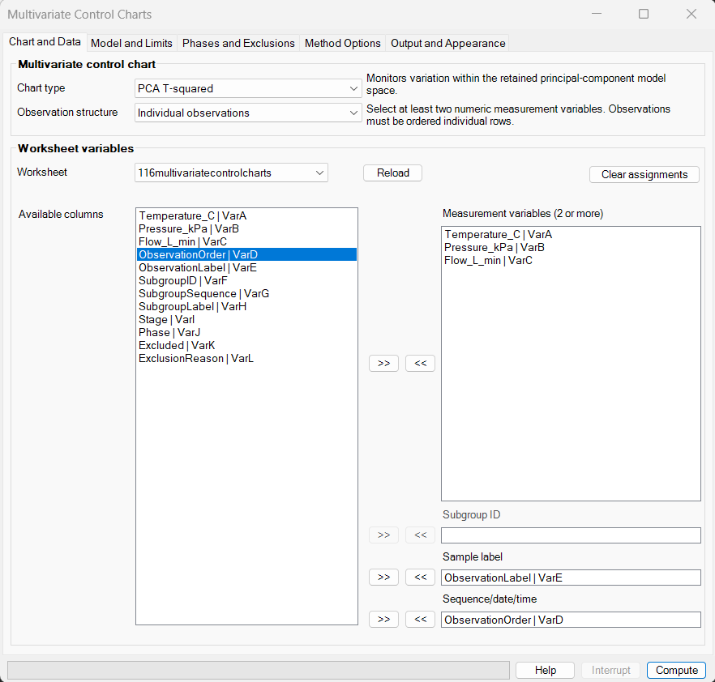

Use the same individual-observation variables, label, sequence, phases, and exclusions as in example 1, but choose **PCA T-squared**.

### Method Options

| Setting | Value |
|---|---|
| PCA matrix | **Covariance matrix** |
| Component selection | **Specify component count** |
| Component count | `2` |

Covariance PCA preserves the measurement scales. Choose correlation PCA instead when variables are on incomparable scales and equal standardized weighting is scientifically appropriate.

### Expected result

| Result | Expected value |
|---|---|
| Eligible Phase I observations | 95 |
| Retained components | 2 |
| Phase I UCL | 12.4452 |
| Phase II UCL | 14.5041 |
| Signalled points | 132 and 135 |
| Signal occurrences / signalled points | 2 / 2 |
| Calculation warnings | 0 |

These points are unusual within the dominant two-component model space. Compare them with the PCA Q result: a point may be extreme in score space without having a large residual.

---

## Worked example 3: PCA Q

The PCA Q statistic, also called the squared prediction error, monitors the residual variation not explained by the retained principal components.

### Chart and Data

Use the same individual assignments and choose **PCA Q**.

### Method Options

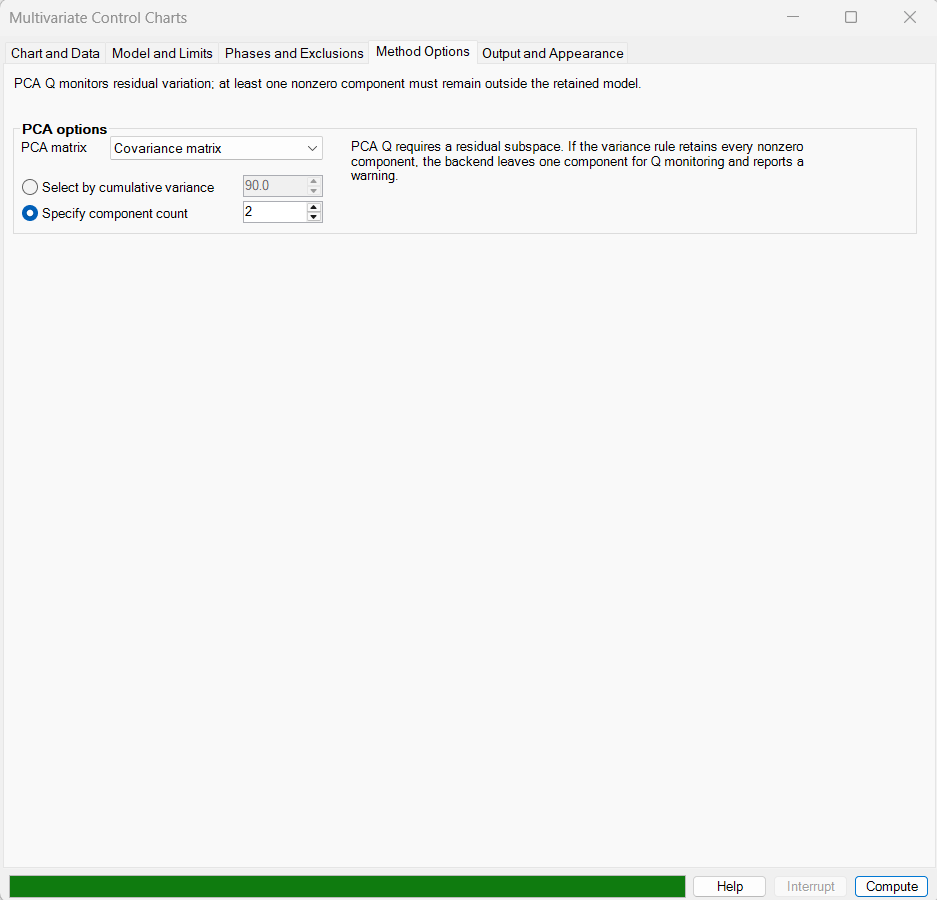

| Setting | Value |
|---|---|
| PCA matrix | **Covariance matrix** |
| Component selection | **Specify component count** |
| Component count | `2` |

At least one positive-eigenvalue component must remain outside the retained PCA model. If cumulative-variance selection would retain every nonzero component, BESHStatNG leaves one component in the residual subspace and reports a warning.

### Expected result

| Result | Expected value |
|---|---|
| Eligible Phase I observations | 95 |
| Retained components | 2 |
| Q centre line | 0.3615 |
| Q UCL | 3.2972 |
| Signalled points | 18 and 136–140 |
| Signal occurrences / signalled points | 6 / 6 |
| Calculation warnings | 0 |

Point 18 is a Phase I residual-space signal, while points 136–140 show a strong Phase II change outside the retained two-component relationship. The squared residual-variable contributions sum to Q and help identify which measurements no longer follow the fitted PCA structure.

---

## Worked example 4: MEWMA

MEWMA smooths the multivariate deviations from the fitted mean. It gives greater weight to recent observations and can detect sustained changes that are difficult to see with a pointwise Hotelling chart.

### Chart and Data

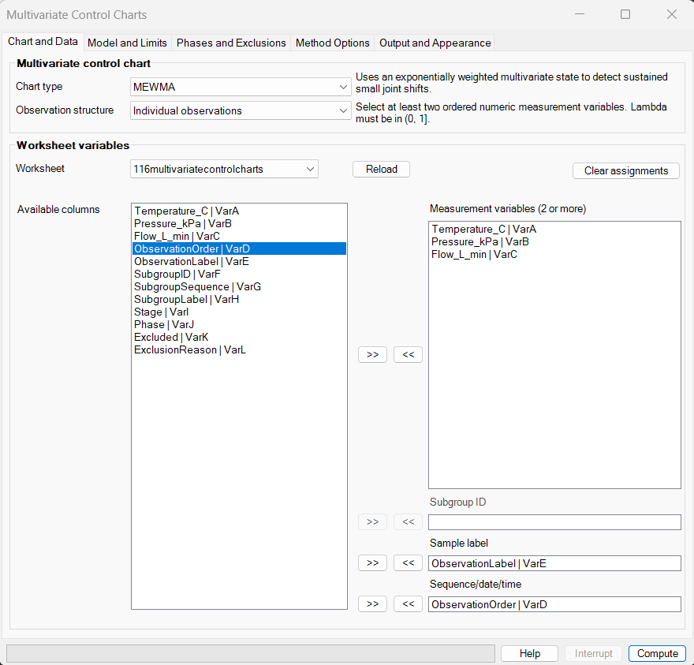

Use the common individual assignments and choose **MEWMA**.

### Method Options

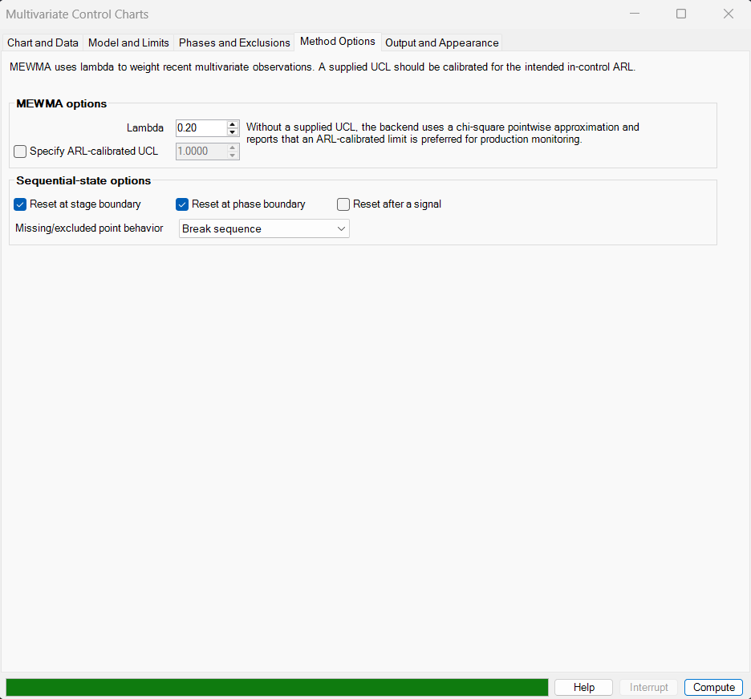

| Setting | Value |
|---|---|
| Lambda | `0.20` |
| Specify ARL-calibrated UCL | **Not selected** |
| Reset at stage boundary | **Selected** |
| Reset at phase boundary | **Selected** |
| Reset after a signal | **Not selected** |
| Missing/excluded point behaviour | **Break sequence** |

### Expected result

| Result | Expected value |
|---|---|
| Eligible Phase I observations | 95 |
| Lambda | 0.20 |
| Pointwise chi-square UCL | 14.1563 |
| Signalled points | 35, 132, and 136–150 |
| Signal occurrences / signalled points | 17 / 17 |
| Calculation warnings | 1 |

The warning explains that the automatic UCL is a chi-square **pointwise approximation**. For production monitoring, supply a MEWMA limit calibrated to the intended in-control average run length (ARL), dimension, lambda, covariance estimation method, and reset policy.

The state resets at the Phase I/Phase II boundary. Because **Reset after a signal** is off, a sustained change can continue to signal on later points.

---

## Worked example 5: MCUSUM (Crosier)

The Crosier MCUSUM accumulates covariance-standardized deviations and shrinks the accumulated vector toward zero by the reference value \(k\). It signals when the accumulated norm exceeds the decision interval \(h\).

### Chart and Data

Use the common individual assignments and choose **MCUSUM (Crosier)**.

### Method Options

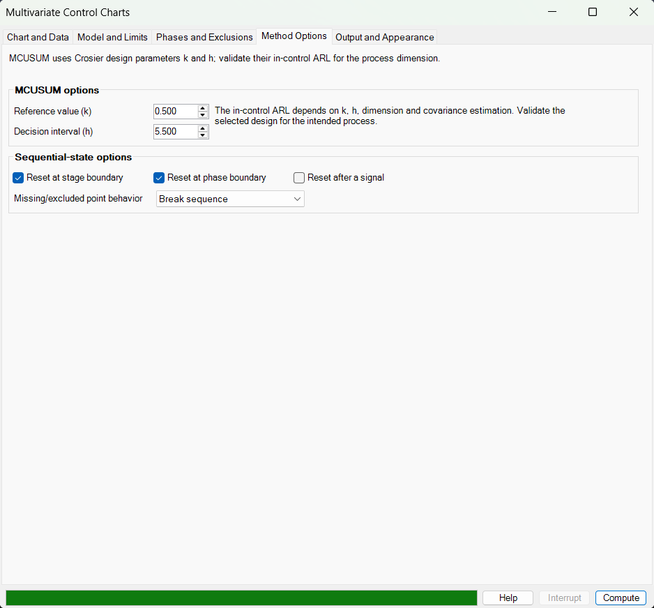

| Setting | Value |
|---|---|
| Reference value, \(k\) | `0.500` |
| Decision interval, \(h\) | `5.500` |
| Reset at stage boundary | **Selected** |
| Reset at phase boundary | **Selected** |
| Reset after a signal | **Not selected** |
| Missing/excluded point behaviour | **Break sequence** |

### Expected result

| Result | Expected value |
|---|---|
| Eligible Phase I observations | 95 |
| Reference value, \(k\) | 0.5 |
| Decision interval, \(h\) | 5.5 |
| Signalled points | 30–35, 119–134, and 136–150 |
| Signal occurrences / signalled points | 37 / 37 |
| Calculation warnings | 1 |

The Phase I signals at points 30–35 demonstrate that the supplied baseline is not uniformly in control under this MCUSUM design. The Phase II sequence shows how accumulated evidence can reveal persistent joint movement.

The warning is essential: the in-control ARL depends on \(k\), \(h\), process dimension, covariance estimation, and reset behaviour. Validate the design for the intended application rather than treating the example values as universal defaults.

---

## Shared settings for the rational-subgroup examples

The subgroup examples use the same three measurements but aggregate every five worksheet rows into one chart point.

### Chart and Data

For both subgroup examples assign:

| Setting | Value |
|---|---|
| Observation structure | **Rational subgroups** |
| Measurement variables | `Temperature_C`, `Pressure_kPa`, `Flow_L_min` |
| Subgroup ID | `SubgroupID` |
| Sample label | `SubgroupLabel` |
| Sequence/date/time | `SubgroupSequence` |

### Model and Limits

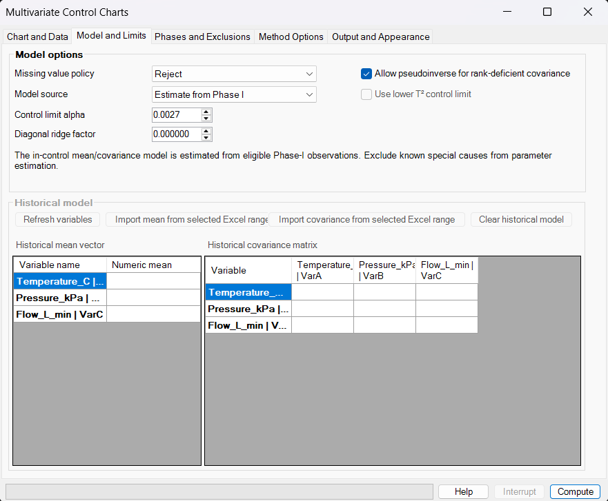

| Setting | Value |
|---|---|
| Missing value policy | **Reject** |
| Model source | **Estimate from Phase I** |
| Control limit alpha | `0.0027` |
| Diagonal ridge factor | `0.000000` |
| Allow pseudoinverse | **Selected for Hotelling T-squared** |
| Use lower T-squared control limit | **Not selected** |

Generalized variance requires a full-rank covariance matrix. The pseudoinverse option is therefore disabled while that chart type is selected.

### Phases and Exclusions

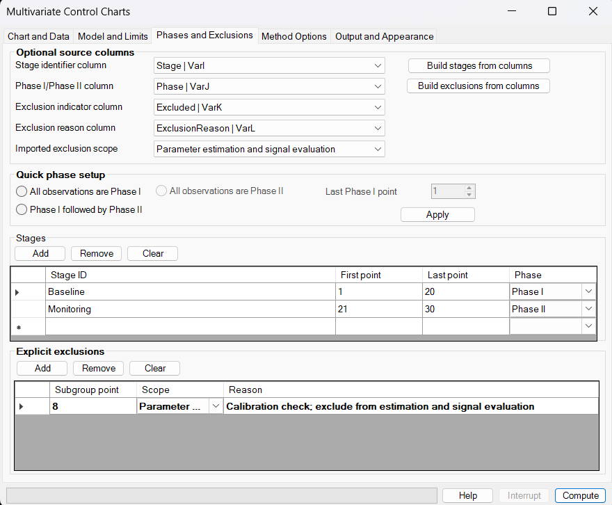

| Stage | First subgroup point | Last subgroup point | Phase |
|---|---:|---:|---|
| Baseline | 1 | 20 | Phase I |
| Monitoring | 21 | 30 | Phase II |

Subgroup 8 is excluded from parameter estimation and signal evaluation. The baseline therefore contains **19 eligible subgroups**, each with five complete observations.

### Output and Appearance

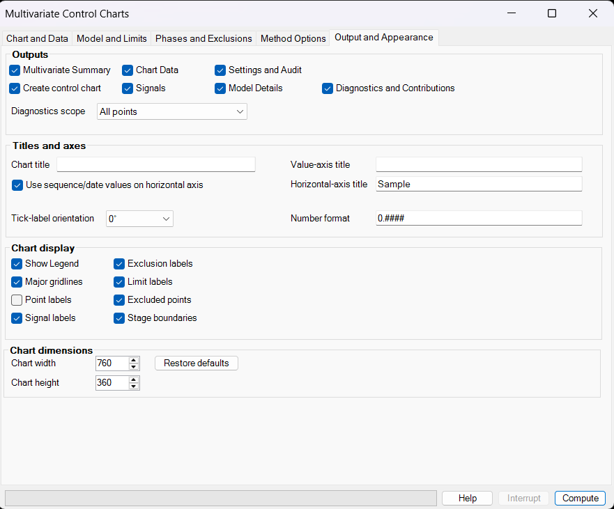

All outputs and diagnostics are selected, `SubgroupSequence` is used on the horizontal axis, and the chart display settings match the individual examples.

---

## Worked example 6: subgroup Hotelling T-squared

The subgroup version applies Hotelling T-squared to the subgroup mean vector and estimates the covariance from pooled within-subgroup variation.

### Chart and Data

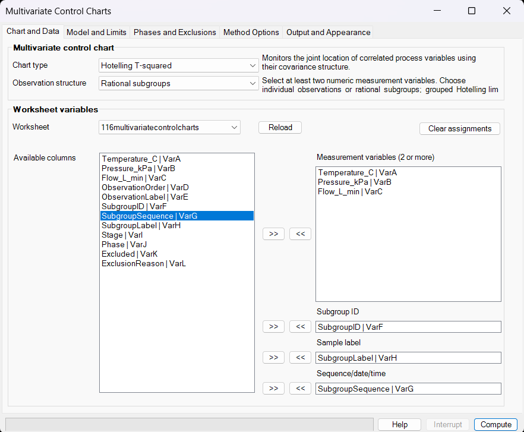

Choose **Hotelling T-squared** and **Rational subgroups**, then use the shared subgroup assignments.

### Method Options

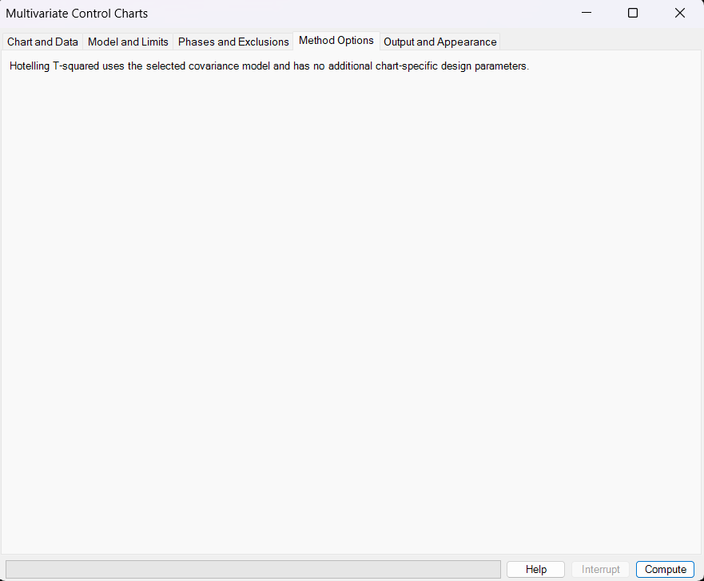

No additional chart-specific parameter is required. The lower T-squared limit option applies only to individual-observation Hotelling and PCA T-squared charts; it is not used for subgroup means.

### Expected result

| Result | Expected value |
|---|---|
| Eligible Phase I subgroups | 19 |
| Eligible Phase I observations | 95 |
| Pooled covariance degrees of freedom | 76 |
| Effective dimension | 3 |
| Phase I UCL | 12.4186 |
| Phase II UCL | 16.7442 |
| Signalled subgroups | 6, 27, 28, and 30 |
| Signal occurrences / signalled points | 4 / 4 |
| Calculation warnings | 0 |

Subgroup 6 is a Phase I signal and should be investigated before the baseline model is accepted. Subgroups 27, 28, and 30 signal during Phase II. The **Diagnostics** sheet includes signed variable contributions and the source worksheet rows belonging to each subgroup.

---

## Worked example 7: generalized variance

Generalized variance monitors the determinant of each subgroup covariance matrix. A larger determinant indicates greater overall multivariate spread, although the statistic also depends on measurement units.

### Chart and Data

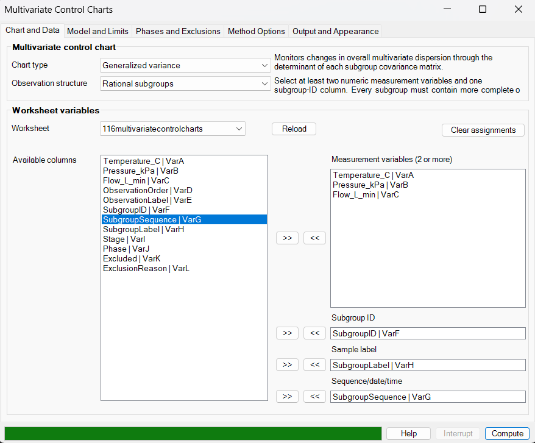

Choose **Generalized variance** and **Rational subgroups**, then use the shared subgroup assignments.

### Method Options

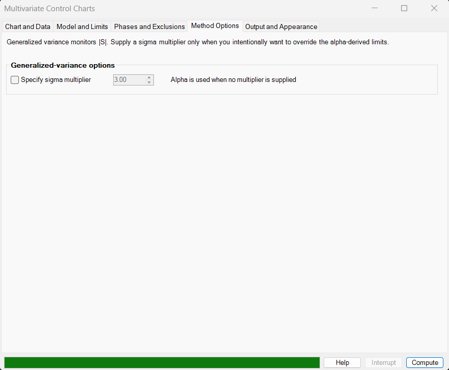

| Setting | Value |
|---|---|
| Specify sigma multiplier | **Not selected** |
| Limit source | Alpha-derived normal multiplier |

With alpha `0.0027`, the derived multiplier is approximately 3. Supplying an explicit multiplier intentionally overrides the alpha-derived limit calculation.

### Expected result

| Result | Expected value |
|---|---|
| Eligible Phase I subgroups | 19 |
| Effective dimension | 3 |
| Centre line | 0.2040 |
| UCL | 1.4278 |
| Signalled subgroup | 27 |
| Signal occurrences / signalled points | 1 / 1 |
| Calculation warnings | 2 |

The first warning states that the limits use the conventional normal moment approximation for \(|S|\), so the false-signal rate can differ from nominal alpha for small subgroups. The second notes that generalized variance changes when any variable is rescaled.

Subgroup 27 has \(|S|\approx12.2883\), well above the UCL. Review the subgroup covariance matrix in **Diagnostics** to understand how within-subgroup variability changed.

---

## Required data structures

### Individual observations

Use one worksheet row per ordered observation:

| Order | Variable 1 | Variable 2 | Variable 3 | Label |
|---:|---:|---:|---:|---|
| 1 | 51.425 | 99.753 | 18.755 | Obs-001 |
| 2 | 50.430 | 102.014 | 20.067 | Obs-002 |
| 3 | 50.098 | 99.790 | 20.564 | Obs-003 |

Requirements:

- select at least two numeric measurement columns;
- every retained row must have a complete measurement vector;
- observations must be in meaningful process order for MEWMA and MCUSUM;
- optional label and sequence columns must align with the measurement rows.

### Rational subgroups

Use long-format rows with a subgroup identifier:

| Subgroup ID | Variable 1 | Variable 2 | Variable 3 |
|---|---:|---:|---:|
| G01 | 51.425 | 99.753 | 18.755 |
| G01 | 50.430 | 102.014 | 20.067 |
| G01 | 50.098 | 99.790 | 20.564 |
| G02 | 48.846 | 101.343 | 21.211 |

Grouped Hotelling T-squared currently requires equal complete subgroup sizes. Every generalized-variance subgroup must contain more complete observations than variables; for three variables, each subgroup must contain at least four observations.

The subgroup ID determines membership. BESHStatNG normalizes the optional label and sequence metadata to one value per subgroup.

---

## Dialog reference

### Chart and Data

#### Chart type

Select one of:

- Hotelling T-squared;
- Generalized variance;
- PCA T-squared;
- PCA Q;
- MEWMA;
- MCUSUM (Crosier).

The available observation structures and method-specific controls update automatically.

#### Observation structure

- **Individual observations:** available for Hotelling T-squared, PCA T-squared, PCA Q, MEWMA, and MCUSUM;
- **Rational subgroups:** available for Hotelling T-squared and required for generalized variance.

#### Worksheet variables

- **Measurement variables:** two or more numeric columns;
- **Subgroup ID:** exactly one column for rational subgroups;
- **Sample label:** optional text or numeric label column;
- **Sequence/date/time:** optional numeric sequence column used for ordering metadata and, when selected, the chart horizontal axis.

### Model and Limits

#### Missing value policy

- **Reject:** stop if any measurement vector contains a missing value;
- **Omit incomplete observation:** remove the entire incomplete multivariate row.

Partially observed vectors are not analysed because no imputation model is fitted. For grouped charts, omissions can change subgroup size and may cause a validation error if the remaining subgroups no longer meet the chart requirements.

#### Model source

- **Estimate from Phase I:** estimate parameters from eligible Phase I observations or subgroups;
- **Use historical parameters:** supply a validated historical covariance matrix and, for location charts, a historical mean vector.

The ordering of the historical mean and covariance entries must match the order of the selected measurement variables. Generalized variance requires the covariance matrix but does not require a mean vector.

#### Control limit alpha

The default is `0.0027`, corresponding approximately to the combined tail probability associated with conventional three-sigma limits.

Its exact use depends on the chart:

- individual Hotelling and PCA T-squared limits use two tails; hiding the lower limit does not reallocate its probability to the upper tail;
- subgroup Hotelling, PCA Q, and the automatic MEWMA limit use an upper-tail probability;
- generalized variance converts alpha to a two-sided normal multiplier unless an explicit multiplier is supplied;
- MCUSUM uses \(k\) and \(h\), so alpha is disabled for its decision interval.

#### Diagonal ridge factor

A positive ridge adds a multiple of the average variance to the diagonal of the analysis covariance matrix. It can improve numerical stability when variables are nearly collinear, but it changes distances, determinants, limits, and contributions. Report and justify any nonzero value.

#### Allow pseudoinverse for rank-deficient covariance

When selected, location and sequential charts can use a Moore–Penrose pseudoinverse if the covariance matrix is numerically rank deficient. BESHStatNG reports the effective rank and whether a pseudoinverse was used.

Generalized variance requires a full-rank covariance matrix, so this option is disabled for that chart. If generalized variance is selected temporarily, the dialog restores the previous pseudoinverse choice after leaving that chart type.

#### Use lower T-squared control limit

Available only for individual-observation Hotelling and PCA T-squared charts. A lower-tail signal can indicate observations unusually close to the fitted mean, which may be relevant when over-stratification, data duplication, or artificially reduced variation is plausible. Most routine applications leave this option off.

### Phases and Exclusions

#### Optional source columns

Select worksheet columns for:

- stage identifier;
- Phase I/Phase II assignment;
- exclusion indicator;
- exclusion reason.

Then use **Build stages from columns** and **Build exclusions from columns** to populate the editable grids.

#### Quick phase setup

Choose:

- all observations as Phase I;
- all observations as Phase II;
- Phase I followed by Phase II, with the last Phase I point specified.

For subgroup analyses, point numbers refer to subgroup points rather than worksheet rows.

#### Exclusion scopes

- **Parameter estimation:** do not use the point to fit the model, but allow signal evaluation;
- **Signal evaluation:** retain it for estimation where otherwise eligible, but suppress signal evaluation;
- **Parameter estimation and signal evaluation:** exclude it from both.

Always record a scientifically or operationally meaningful reason.

### Method Options

#### PCA options

- **Covariance matrix:** retains original measurement units and gives more influence to variables with larger variance;
- **Correlation matrix:** standardizes variables and requires every baseline variable to have positive variance.

Select components by:

- **cumulative variance percentage**, default 90%; or
- **fixed component count**.

PCA Q requires at least one nonzero residual component.

#### Generalized-variance options

Leave **Specify sigma multiplier** off to derive the multiplier from alpha. Select it only when an externally justified multiplier should override alpha-derived limits.

#### MEWMA options

- **Lambda:** \(0<\lambda\le1\); smaller values smooth more heavily and emphasize persistent changes;
- **Specify ARL-calibrated UCL:** use a control limit established for the intended in-control ARL and design.

Without a supplied UCL, BESHStatNG uses a chi-square pointwise approximation and reports a warning.

#### MCUSUM options

- **Reference value \(k\):** controls the shift size to which accumulation is tuned;
- **Decision interval \(h\):** the signal threshold for the MCUSUM norm.

The values must be chosen together and validated for the process dimension and covariance-estimation setting.

#### Sequential-state options

MEWMA and MCUSUM can:

- reset at a stage boundary;
- reset at a Phase I/Phase II boundary;
- reset after a signal.

For a missing, omitted, or rule-excluded point:

- **Break sequence:** reset the recursive state;
- **Skip point and continue:** do not update the state for that point, but retain the prior state for the next eligible observation.

### Output and Appearance

#### Output sheets

Select any combination of:

- Multivariate Summary;
- Multivariate Chart;
- Chart Data;
- Signals;
- Settings and Audit;
- Model Details;
- Diagnostics and Contributions.

Diagnostics can be written for **All points** or **Signalled points only**.

#### Titles, axes, and chart display

Specify the chart title, axis titles, sequence values on the horizontal axis, tick-label orientation, number format, legend, gridlines, point/signal/exclusion labels, limit labels, excluded points, stage boundaries, and chart dimensions.

---

## Calculations

Let \(\mathbf{x}_i\) be a \(p\)-variable observation, \(\bar{\mathbf{x}}\) the Phase I mean vector, and \(S\) the fitted covariance matrix.

### Hotelling T-squared for individuals

For an individual observation:

$$
T_i^2=(\mathbf{x}_i-\bar{\mathbf{x}})'S^{-1}(\mathbf{x}_i-\bar{\mathbf{x}}).
$$

With historical parameters, the limits use a chi-square reference distribution. With an estimated Phase I model, BESHStatNG uses finite-sample Phase I beta limits and Phase II F limits. If the eligible baseline count is \(m\), the effective dimension is \(p\), and \(a=\alpha/2\), the upper limits are:

$$
UCL_I=\frac{(m-1)^2}{m}
B_{1-a}\left(\frac{p}{2},\frac{m-p-1}{2}\right),
$$

$$
UCL_{II}=\frac{p(m+1)(m-1)}{m(m-p)}
F_{1-a;p,m-p}.
$$

When requested, lower limits use the corresponding lower-tail quantiles. Otherwise the LCL is zero.

### Hotelling T-squared for subgroup means

For subgroup \(i\) of size \(n\):

$$
T_i^2=n(\bar{\mathbf{x}}_i-\bar{\mathbf{x}})'
S_p^{-1}(\bar{\mathbf{x}}_i-\bar{\mathbf{x}}),
$$

where \(S_p\) is the pooled within-subgroup covariance matrix. The implemented finite-sample F limits require equal complete subgroup sizes.

### Generalized variance

For subgroup covariance matrix \(S_i\), the plotted statistic is:

$$
GV_i=|S_i|.
$$

If \(\Sigma\) is the fitted within-process covariance matrix, BESHStatNG uses conventional determinant moments:

$$
CL=b_1|\Sigma|,
\qquad
SD(GV)=\sqrt{b_2}|\Sigma|,
$$

and:

$$
LCL=\max\{0,CL-zSD(GV)\},
\qquad
UCL=CL+zSD(GV),
$$

where \(z=\Phi^{-1}(1-\alpha/2)\) unless an explicit sigma multiplier is supplied.

### PCA T-squared

Let \(t_{ik}\) be the score of observation \(i\) on retained component \(k\), and \(\lambda_k\) its eigenvalue. For \(r\) retained components:

$$
T_{i,PCA}^2=\sum_{k=1}^{r}\frac{t_{ik}^2}{\lambda_k}.
$$

The control-limit dimension is the number of retained components.

### PCA Q

Let \(\mathbf{e}_i\) be the residual after reconstruction from the retained components:

$$
Q_i=\mathbf{e}_i'\mathbf{e}_i.
$$

BESHStatNG calculates the upper limit from the Jackson–Mudholkar residual-eigenvalue approximation. If its moments are numerically degenerate, an empirical Phase I quantile is used and a warning is reported.

### MEWMA

For smoothing constant \(\lambda\):

$$
\mathbf{z}_i=\lambda(\mathbf{x}_i-\bar{\mathbf{x}})
+(1-\lambda)\mathbf{z}_{i-1},
\qquad \mathbf{z}_0=\mathbf{0}.
$$

After \(r_i\) observations since the last reset, the covariance factor is:

$$
c_i=\frac{\lambda}{2-\lambda}
\left[1-(1-\lambda)^{2r_i}\right].
$$

The plotted statistic is:

$$
T_{i,MEWMA}^2=\frac{\mathbf{z}_i'S^{-1}\mathbf{z}_i}{c_i}.
$$

### Crosier MCUSUM

Let \(\mathbf{c}_{i-1}\) be the previous MCUSUM state and define:

$$
\mathbf{y}_i=\mathbf{c}_{i-1}+(\mathbf{x}_i-\bar{\mathbf{x}}),
\qquad
C_i=\sqrt{\mathbf{y}_i'S^{-1}\mathbf{y}_i}.
$$

The updated state is:

$$
\mathbf{c}_i=
\begin{cases}
\mathbf{0}, & C_i\le k,\\
\left(1-\frac{k}{C_i}\right)\mathbf{y}_i, & C_i>k.
\end{cases}
$$

The plotted norm is \(\sqrt{\mathbf{c}_i'S^{-1}\mathbf{c}_i}\), and a signal occurs when it exceeds \(h\).

---

## Understanding the output workbook

### Multivariate Summary

Reports the chart type, observation structure, input and chart-point counts, baseline observations and subgroups, covariance degrees of freedom, effective dimension, retained PCA components, pseudoinverse use, signal counts, process status, retained parameters, warnings, and execution time.

### Model Details

Reports the fitted model, including the process mean vector where applicable, covariance and analysis covariance matrices, inverse or pseudoinverse, effective rank, PCA scales, eigenvalues, eigenvectors/loadings, and retained-component information.

### Multivariate Chart

Contains a standard embedded Excel chart of the selected statistic with centre and control or decision limits. It can be moved, resized, formatted, copied, or exported; see [Export Chart](../export-chart.md).

### Chart Data

Provides one row per chart point with source worksheet rows, label, stage, phase, statistic, centre line, LCL, UCL, estimation and signal eligibility, exclusion scope and reason, signal status, and intrinsic signal number.

### Signals

Provides one row per intrinsic-limit signal, including the point, stage, phase, source rows, value, limits, exclusion status, and explanatory message.

### Diagnostics

Depending on the chart, reports the original observation vector, recursive state, PCA scores, residual vector, subgroup covariance matrix, effective subgroup size, and variable contributions.

- signed Hotelling, PCA T-squared, MEWMA, and MCUSUM contributions sum to the corresponding quadratic statistic or squared norm;
- squared PCA residual contributions sum to Q;
- generalized variance has no order-invariant additive variable decomposition, so inspect the subgroup covariance matrix instead.

Contributions are diagnostic aids, not independent hypothesis tests or proof of a physical cause.

### Settings and Audit

Records the complete request, stage definitions, exclusions and reasons, historical parameters, method-specific settings, output and appearance choices, source-row information, timestamps, execution time, and calculation warnings.

---

## Interpretation workflow

1. **Confirm the observation structure.** Decide whether each row is an individual multivariate observation or belongs to a rational subgroup.
2. **Check measurement comparability.** Review units, calibration, missingness, and whether correlation or covariance PCA is appropriate.
3. **Review Phase I before Phase II.** Investigate Phase I signals and documented exclusions before treating the fitted model as an in-control reference.
4. **Identify the type of change.** A location chart, PCA residual chart, and generalized-variance chart detect different departures.
5. **Open the Diagnostics sheet.** Review contributions, scores, residuals, state vectors, or subgroup covariance matrices for the signalled point.
6. **Return to process context.** Match the point and source worksheet rows to changes in materials, equipment, method, environment, measurement, or personnel.
7. **Check companion charts.** Compare PCA T-squared with PCA Q, and subgroup Hotelling with generalized variance. Consider suitable univariate charts for the original variables.
8. **Validate sequential designs.** For MEWMA and MCUSUM, select limits or \(k,h\) using the intended in-control ARL rather than relying only on example defaults.
9. **Document and rerun when justified.** Exclude a point from estimation only when there is a defensible assignable cause, and retain the reason in the audit trail.

!!! note
    A multivariate signal is evidence against the fitted in-control model. It does not by itself identify the causal variable, prove nonconformance, or establish practical importance.

---

## Assumptions and practical considerations

- Observations and subgroups must be in meaningful process order.
- The measurement system and variable definitions should remain stable.
- The Phase I sample should represent the process state intended for future monitoring.
- Classical Hotelling limits assume an appropriate multivariate-normal covariance model; nonnormality can change false-signal behaviour.
- Consecutive observations should be sufficiently independent unless the monitoring design explicitly models autocorrelation.
- The baseline count must be adequate relative to the number of variables and effective covariance rank.
- Near-collinearity can make covariance inversion unstable; a pseudoinverse or ridge changes the effective model and must be reported.
- Correlation PCA requires positive baseline variance for every variable.
- PCA component selection affects the division between model-space and residual-space signals.
- Generalized variance is scale dependent and requires more complete observations per subgroup than variables.
- The generalized-variance normal moment approximation can be inaccurate for small subgroups.
- MEWMA and MCUSUM performance is defined by average run length, not by pointwise alpha alone.
- Exclusions, omissions, stage changes, and sequence gaps can reset or interrupt sequential statistics.
- Contribution values can be sensitive to correlation and should be interpreted jointly rather than ranked mechanically.

---

## Steps in the add-in

1. In Excel, select **BESH Stat NG → Analyse → Statistical Process Control → Multivariate Control Charts**.
2. On **Chart and Data**, select the chart type and observation structure.
3. Assign at least two measurement variables and the required subgroup ID or optional metadata columns.
4. On **Model and Limits**, select the missing-value policy, model source, alpha, and covariance options.
5. On **Phases and Exclusions**, define the Phase I and Phase II stages and review exclusions.
6. On **Method Options**, set PCA, generalized-variance, MEWMA, or MCUSUM options as applicable.
7. On **Output and Appearance**, choose the output sheets, diagnostic scope, labels, axes, and chart display.
8. Click **Compute**. BESHStatNG creates a new workbook containing the selected outputs.

---

## References

- Montgomery, D. C. (2019). *Introduction to Statistical Quality Control* (8th ed.). Wiley.
- Mason, R. L., & Young, J. C. (2002). *Multivariate Statistical Process Control with Industrial Applications*. ASA–SIAM.
- Crosier, R. B. (1988). Multivariate generalizations of cumulative sum quality-control schemes. *Technometrics, 30*(3), 291–303. <https://doi.org/10.1080/00401706.1988.10488402>
- Jackson, J. E., & Mudholkar, G. S. (1979). Control procedures for residuals associated with principal component analysis. *Technometrics, 21*(3), 341–349. <https://doi.org/10.1080/00401706.1979.10489779>
- Lowry, C. A., Woodall, W. H., Champ, C. W., & Rigdon, S. E. (1992). A multivariate exponentially weighted moving average control chart. *Technometrics, 34*(1), 46–53. <https://doi.org/10.1080/00401706.1992.10485232>

---

## Related methods

- [Control Charts](control-charts.md) — monitor individual variables, counts, proportions, or univariate time-weighted statistics.
- [Principal Component Analysis](principal-component-analysis.md) — explore the component structure before defining a PCA monitoring model.
- [Hotelling's T-Squared Test](hotellings-t-squared-test.md) — compare multivariate means outside the sequential control-chart setting.
- [Export Chart](../export-chart.md) — export generated Excel charts as high-resolution images.
