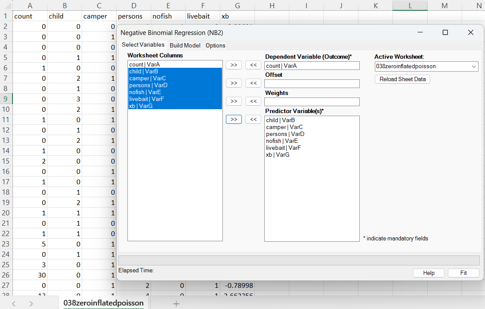
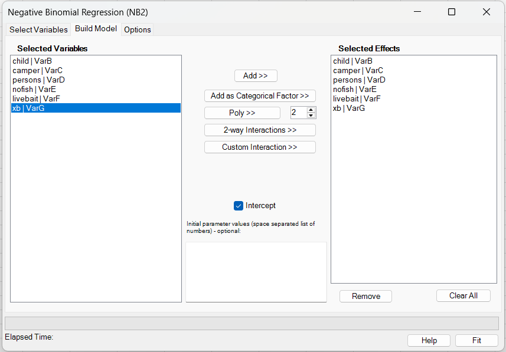
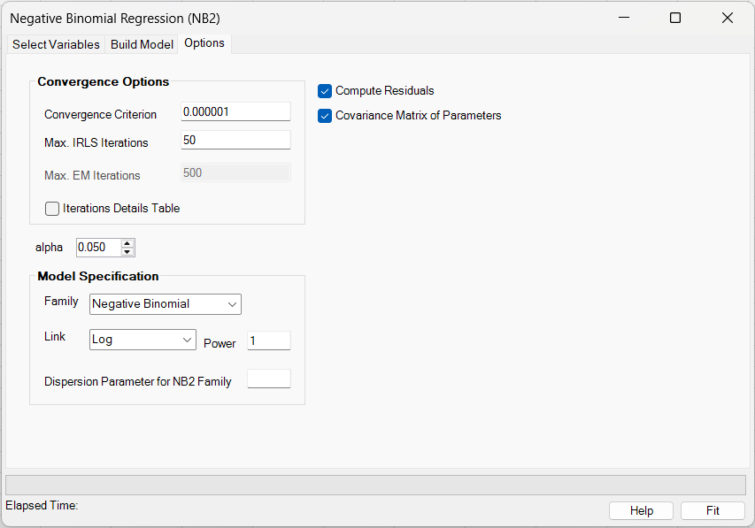
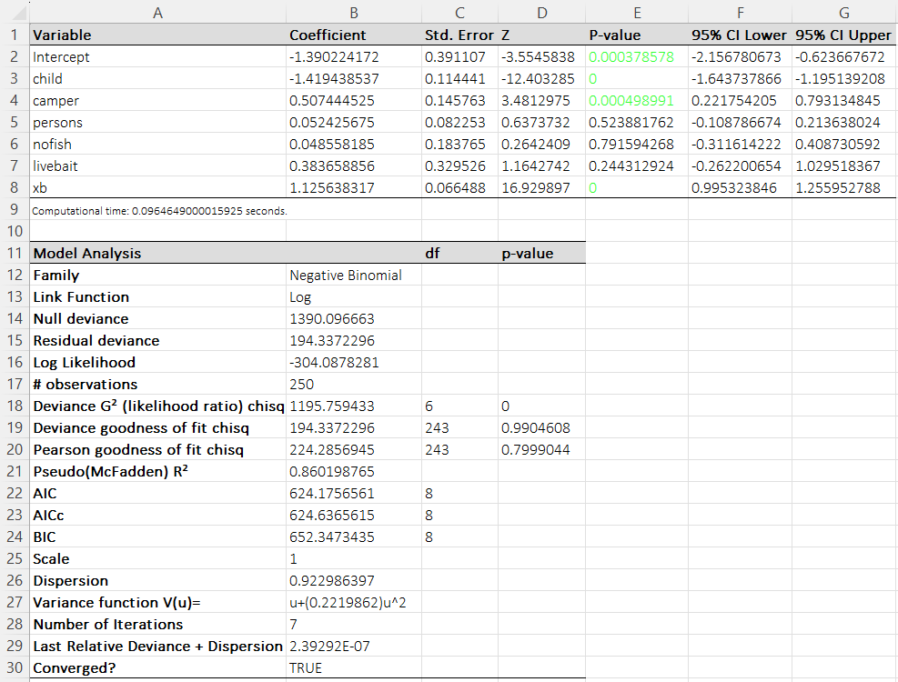
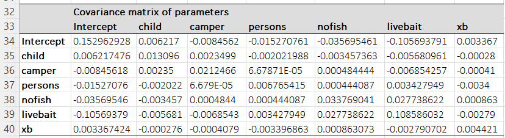

# Negative Binomial Regression (NB2)

**Includes:** Negative Binomial (NB2) regression, Overdispersion parameter (estimated), categorical factors, polynomial terms, continuous and categorical-factor interactions, optional starting values, optional offset/weights, covariance matrix, residuals.  
**Purpose:** Model overdispersed count outcomes using an NB2 variance function.

---

## Overview

Negative Binomial regression (NB2) is a count-data regression model used when the outcome is a non-negative integer (0, 1, 2, …) and the data show **overdispersion** (variance larger than the mean), which often violates the Poisson assumption. NB2 extends Poisson regression by introducing a dispersion parameter that allows the variance to increase quadratically with the mean:

\[
Y_i \sim \text{NB2}(\mu_i, \alpha), \qquad \mathrm{Var}(Y_i)=\mu_i+\alpha\mu_i^2,
\]

where \(\mu_i=\mathbb{E}[Y_i\mid x_i]\) and \(\alpha>0\) is the overdispersion parameter (\(\alpha = 1/\theta\), where \(\theta\) is sometimes called the “size” parameter).

With the default **log link**, the model is:

\[
\log(\mu_i)=\eta_i=\beta_0+\beta^\top x_i + \text{offset}_i,
\qquad \mu_i=\exp(\eta_i).
\]

**Interpretation (log link):** each coefficient \(\beta_j\) corresponds to an **incidence rate ratio (IRR)** of \(\exp(\beta_j)\). Holding other variables constant, a one-unit increase in \(x_j\) multiplies the expected count by \(\exp(\beta_j)\).

BESHStatNG’s **NB2 Regression** estimates both \(\beta\) and the dispersion parameter (\(\alpha\)) using an algorithm aligned with the approach used by R’s `MASS::glm.nb` (Poisson start + iterative updates of \(\beta\) via IRLS and \(\alpha\) via likelihood-based Newton updates). The output includes coefficient inference, goodness-of-fit measures (deviance and Pearson), information criteria (AIC/AICc/BIC), and optional residual/influence diagnostics.

**When to use NB2 vs Poisson vs ZIP (rule of thumb):**

- **Poisson**: mean \(\approx\) variance; little overdispersion.
- **NB2**: variance \(\gg\) mean due to unobserved heterogeneity (overdispersion) without a distinct “structural zero” mechanism.
- **Zero-Inflated Poisson (ZIP)**: excess zeros best explained by a separate “always-zero” process in addition to a count process.

If your main issue is **overdispersion** (variance > mean) without a clear structural-zero mechanism, **NB2 is typically preferred** over ZIP because it is simpler and often more stable.

## Screenshots

**Select variables**



**Build model**



- **Add >>** adds the selected variable(s) as continuous main effects.
- **Add as Categorical Factor >>** marks the selected variable(s) as categorical main effects. Internally, BESHStatNG expands each selected factor into reference-coded indicator columns; if the factor is used in an interaction, the interaction is built from those expanded columns.
- **Poly >>** creates polynomial terms for the selected variable(s). The degree is taken from the numeric box next to the button.
- **2-way Interactions >>** creates all pairwise interactions among the currently selected variables.
- **Custom Interaction >>** creates one multi-way interaction term spanning all currently selected variables.
- **Initial parameter values** are optional. If supplied, they are used as the optimizer starting values, and the required count is based on the **expanded** design matrix.

Current limitations:

- Polynomial terms are supported only for **continuous** predictors.
- Interaction terms support **continuous × continuous**, **categorical × continuous**, and **categorical × categorical** combinations.
- Polynomial subterms inside interactions are not supported; create polynomial main effects separately when needed.

**Options**



**Results (coefficients + model analysis)**



**Results (covariance matrix)**



## Example dataset

This example uses the same dataset as the ZIP regression example:

- Input data: [038zeroinflatedpoisson.csv](../assets/data/038zeroinflatedpoisson/038zeroinflatedpoisson.csv)
- Residual output example (from the add-in): [035negativebinomial_residuals.csv](../assets/data/035negativebinomial/035negativebinomial_residuals.csv)

## Model specification

Let \(Y_i\) be a count response with mean \(\mu_i = E(Y_i)\). The NB2 model used here assumes:

\[
Var(Y_i) = \mu_i + \alpha \mu_i^2, \qquad \alpha>0.
\]

The linear predictor is

\[
\eta_i = \beta_0 + \mathbf{x}_i^\top\beta + o_i,
\]

where \(o_i\) is an optional **offset** (commonly \(\log(\text{exposure})\)). The mean is linked to \(\eta\) by a link function \(g\):

\[
\eta_i = g(\mu_i), \qquad \mu_i = g^{-1}(\eta_i).
\]

### Links supported for NB2 in BESHStatNG

- **Log**: \(g(\mu)=\log\mu\), so \(\mu=\exp(\eta)\)
- **Identity**: \(g(\mu)=\mu\), so \(\mu=\eta\)
- **Power**: \(g(\mu)=\mu^p\), so \(\mu=\eta^{1/p}\) (user-specified exponent \(p\))

## Likelihood and parameterization

BESHStatNG uses the NB2 parameterization with dispersion \(\alpha = 1/\theta\) (where \(\theta\) is sometimes called the NB *size* parameter). The log-likelihood contribution for observation \(i\) can be written as:

\[
\ell_i(\beta,\alpha)= \log\Gamma\left(y_i+\tfrac{1}{\alpha}\right) - \log\Gamma\left(\tfrac{1}{\alpha}\right) - \log(y_i!)
+ y_i\log(\alpha\mu_i) - \left(y_i+\tfrac{1}{\alpha}\right)\log(1+\alpha\mu_i).
\]

The add-in reports the fitted variance function as `u + (alpha) u^2`.

## Estimation algorithm

BESHStatNG's NB2 implementation follows the approach of **R MASS::glm.nb**:

1. **Initialize** by fitting a Poisson GLM to obtain starting coefficients \(\beta^{(0)}\).
2. **Initial dispersion estimate**: compute a moment-like starting estimate for \(\theta\) (equivalently \(\alpha\)).
3. **Outer loop** (repeat until convergence or max iterations):
   - Fit an NB2 GLM with current \(\alpha\) using **IRLS** (iteratively reweighted least squares) to update \(\beta\).
   - Update \(\theta\) by **Newton iterations** on the profile likelihood using digamma/trigamma terms, then set \(\alpha=1/\theta\).

The stopping metric printed as **"Last Relative Deviance + Dispersion Change"** is:

\[
\frac{|LL_{new}-LL_{old}|}{d_1} + \frac{|\alpha_{new}-\alpha_{old}|}{d_2},\qquad
 d_1=\sqrt{2\max(1,df_{res})},\ d_2=1.
\]

## Options

- **Convergence criterion**: tolerance \(\varepsilon\) for the outer-loop stopping metric.
- **Max. IRLS iterations**: maximum outer-loop iterations.
- **Compute residuals**: exports a residual/influence table (see below).
- **Covariance matrix of parameters**: prints the covariance matrix \(\widehat{Var}(\hat\beta)\) on the results sheet.
- **Iteration details table**: prints stored iteration history (coefficients, \(\alpha\), log-likelihood, and convergence metric).
- **Alpha**: two-sided significance level used for Wald confidence intervals. Default: **0.05** (95% confidence interval).

## Output and interpretation

### Coefficient table

The results sheet reports for each coefficient:

- **Coefficient** \(\hat\beta_j\)
- **Std. Error** from the model-based covariance matrix
- **Z** statistic: \(z_j = \hat\beta_j / SE(\hat\beta_j)\)
- **P-value** (two-sided) from the standard normal approximation
- **Confidence interval at level \(1-\alpha\)**: \(\hat\beta_j \pm z_{1-\alpha/2}\,SE(\hat\beta_j)\)
  In the current production UI, **Alpha** is user-selectable. The default is \(\alpha=0.05\), which gives a 95% confidence interval.

With the **log link**, \(\exp(\hat\beta_j)\) is an **incidence rate ratio (IRR)**: multiplying \(x_j\) by 1 unit multiplies the mean count \(\mu\) by \(\exp(\hat\beta_j)\), holding other predictors fixed.

### Model analysis section

The model-analysis table includes:

- **Null deviance** and **Residual deviance**
- **Log likelihood**
- **Deviance G^2 (likelihood ratio)**: compares the fitted model to the intercept-only model
- **Deviance GOF** and **Pearson GOF** chi-square tests (approximate)
- **Pseudo(McFadden) R^2**: reported as \(1 - \text{ResidualDev}/\text{NullDev}\)
- **AIC**: \( \mathrm{AIC} = -2\,\ell(\hat\theta) + 2k \)
- **AICc** (small-sample correction): \( \mathrm{AICc} = \mathrm{AIC} + \frac{2k(k+1)}{n-k-1} \)
- **BIC** (Schwarz criterion): \( \mathrm{BIC} = -2\,\ell(\hat\theta) + k\log(n) \)

  where \(n\) is the sample size, \(k\) is the number of estimated parameters (including the dispersion parameter for NB2 when it is estimated), and \(\ell(\hat\theta)\) is the maximized log-likelihood.

- **Dispersion** \(\phi\) (Pearson chi-square / df)
- **Variance function** \(V(\mu)=\mu+\alpha\mu^2\)
- Iteration count and convergence status

## Deviance and goodness-of-fit (GOF) statistics

BESHStatNG reports three related model-fit measures for NB2 regression: **Deviance \(G^2\) (likelihood ratio)**, **Deviance GOF**, and **Pearson GOF**. They answer slightly different questions.

### 1) Deviance \(G^2\) (likelihood ratio)

**Purpose:** Tests whether the fitted model with predictors improves fit compared with the **null model** (intercept only).

Let \(\ell(\hat\theta)\) be the maximized log-likelihood for the fitted model and \(\ell(\hat\theta_0)\) for the null model (same distribution family, i.e., NB2). The LR deviance statistic is:

\[
G^2 = -2\left(\ell(\hat\theta_0) - \ell(\hat\theta)\right)
\]

Equivalently, since NB GLMs report *deviance* \(D\) as \(-2\) times the log-likelihood ratio against the saturated model, this is often presented as:

\[
G^2 = D_{\text{null}} - D_{\text{residual}}
\]

**Interpretation:**

- Large \(G^2\) indicates the predictors explain variation beyond the intercept-only model.
- Under standard regularity conditions, \(G^2\) is approximately \(\chi^2\) with \( \mathrm{df} = p \), where \(p\) is the number of regression coefficients added (excluding intercept). A small p-value suggests at least one predictor is associated with the outcome.

**Notes for NB2:** This is the standard global test reported in many GLM outputs (analogous to the Poisson/Logistic “LR test”).

---

### 2) Deviance GOF (residual deviance)

**Purpose:** Checks whether the fitted model is consistent with the data **as an absolute fit measure** (not a comparison to the null model).

The **residual deviance** is:

\[
D = 2\sum_{i=1}^n \left(\ell_i^{\text{sat}} - \ell_i(\hat\theta)\right)
\]

where \(\ell_i^{\text{sat}}\) is the log-likelihood contribution under the saturated model (perfect fit) and \(\ell_i(\hat\theta)\) is the fitted model contribution. In NB2, the deviance uses the NB2 deviance contribution implemented by the family (NB2 variance \(\mu+\alpha\mu^2\)).

**Approximate reference distribution:**

- If the model is correctly specified, \(D\) is often compared to a \(\chi^2\) distribution with \( \mathrm{df} = n - k \), where \(k\) is the number of estimated parameters (including the intercept; some software counts dispersion separately, but GOF df is typically \(n-k\)).

**Interpretation:**

- \(D \approx \text{df}\): the model fits “about as expected”.
- \(D \gg \text{df}\): lack of fit (missing predictors, wrong link, outliers, remaining structure).
- \(D \ll \text{df}\): may indicate overfitting or that the variance is larger than assumed (less common for NB than for Poisson).

**Important:** For count models, especially with small counts or strong heterogeneity, the \(\chi^2\) approximation can be rough. Use deviance GOF as a *diagnostic indicator*, not a strict decision rule.

---

### 3) Pearson GOF (Pearson chi-square)

**Purpose:** Another absolute-fit check based on Pearson residuals, often used alongside deviance.

Let \(y_i\) be the observed count and \(\hat\mu_i\) the fitted mean. For NB2, the variance function is:

\[
V(\hat\mu_i)=\hat\mu_i+\hat\alpha\,\hat\mu_i^2
\]

The Pearson residual is:

\[
r_{P,i}=\frac{y_i-\hat\mu_i}{\sqrt{V(\hat\mu_i)}}
\]

The Pearson GOF statistic is:

\[
X^2 = \sum_{i=1}^n r_{P,i}^2
\]

**Approximate reference distribution:**

- \(X^2\) is commonly compared to \(\chi^2\) with df \(=n-k\).

**Interpretation:**

- \(X^2 \approx \text{df}\): fit is broadly consistent with the assumed mean–variance relationship.
- \(X^2 \gg \text{df}\): suggests lack of fit, remaining dispersion, influential points, or misspecification.
- \(X^2/\text{df}\) is often reported as an over/under-dispersion diagnostic (sometimes called \(\hat\phi\)).

---

### Practical guidance

- Use **Deviance \(G^2\)** to answer: *Do the predictors improve fit vs. an intercept-only model?*
- Use **Deviance GOF** and **Pearson GOF** to answer: *Does the fitted model describe the data adequately in an absolute sense?*
- If GOF statistics are large relative to df, check:
  - functional form (missing nonlinear terms/interactions),
  - omitted predictors,
  - outliers/influential points (Cook distance, leverage),
  - whether a different model class is needed (e.g., ZIP for structural zeros, or alternative dispersion structure).

## Residuals and influence diagnostics

If **Compute residuals** is selected, the add-in outputs a residual table containing:

- **Prediction** \(\hat\mu_i\)
- **Raw residual**: \(r_i = y_i-\hat\mu_i\)
- **Pearson residual**:

  $$
  r_{P,i}=\frac{y_i-\hat\mu_i}{\sqrt{\hat\mu_i+\hat\alpha\,\hat\mu_i^2}}.
  $$

- **Deviance residual** \(r_{D,i}=\operatorname{sign}(y_i-\hat\mu_i)\sqrt{D_i}\), where \(D_i\) is the NB2 deviance contribution
- **Leverage** \(h_i\) (diagonal of the GLM hat matrix)
- **Standardized Pearson residual**: \(r_{P,i}/\sqrt{1-h_i}\)
- **Standardized deviance residual**: \(r_{D,i}/\sqrt{1-h_i}\)
- **Cook distance** (GLM influence): \( \mathrm{Cook}_i = \frac{1}{p}\,\frac{h_i}{1-h_i}\,r_{P,\mathrm{std},i}^2 \), where \(p\) is the number of regression coefficients.

A sample residual export is provided as [035negativebinomial_residuals.csv](../assets/data/035negativebinomial/035negativebinomial_residuals.csv).

!!! note Relation to the general GLM tool
    BESHStatNG also includes a general GLM procedure with the negative binomial family (see: [generalized-linear-models-glm](generalized-linear-models-glm.md)). The **NB2 Regression** tool is specialized for the NB2 model **with dispersion estimation**, meaning the overdispersion parameter \(\alpha\) (equivalently \(\theta=1/\alpha\)) is **estimated from the data**.
    In contrast, the **general GLM** tool’s negative binomial family treats the dispersion parameter as **fixed**: the value entered by the user (or the default value **1** if none is provided) is used as a constant in the variance function \(Var(Y)=\mu+\alpha\mu^2\) while estimating the regression coefficients \(\beta\). In other words, the general GLM negative binomial fit estimates \(\beta\) conditional on a fixed \(\alpha\), whereas the NB2 Regression tool estimates **both** \(\beta\) **and** \(\alpha\).

## R reference code (matching the add-in)

The NB2 procedure is designed to align closely with **MASS::glm.nb**.

```r
library(MASS)

dat <- read.csv("038zeroinflatedpoisson.csv")

# NB2 with log link (default in glm.nb)
fit <- glm.nb(count ~ child + camper + persons + nofish + livebait + xb, data = dat)
summary(fit)

# Add-in reports alpha = 1/theta
theta <- fit$theta
alpha <- 1/theta
alpha

# --- Residual table matching the add-in export ---
mu <- fitted(fit)
raw <- dat$count - mu
pearson <- raw / sqrt(mu + alpha * mu^2)
dev <- residuals(fit, type = "deviance")
h <- hatvalues(fit)

std_pearson <- pearson / sqrt(1 - h)
std_dev <- dev / sqrt(1 - h)

p <- length(coef(fit))
cook_addin <- (1/p) * (h/(1-h)) * std_pearson^2

out <- data.frame(
  RowID = seq_len(nrow(dat)) + 1,
  dat,
  Prediction = mu,
  RawResid = raw,
  DevianceResid = dev,
  PearsonResid = pearson,
  Leverage = h,
  StdDevianceResid = std_dev,
  StdPearsonResid = std_pearson,
  CookDistance = cook_addin
)

```

### Expected differences vs R

- Small numerical differences may occur due to convergence tolerances, iteration limits, and floating-point rounding.
- If you use a non-log link or a power link, ensure the same link definition is used (BESHStatNG uses \(g(\mu)=\mu^p\)).

## References

- Hilbe, J. M. *Negative Binomial Regression*. Cambridge University Press.
- McCullagh, P., Nelder, J. A. *Generalized Linear Models*. Chapman & Hall.
- Venables, W. N., Ripley, B. D. *Modern Applied Statistics with S* (MASS / glm.nb).

## See also

- [Generalized- Lnear Models (GLM)](generalized-linear-models-glm.md)
- [Zero-Inflated Poisson Regression](zero-inflated-poisson-regression.md)
- [Home](../index.md)
