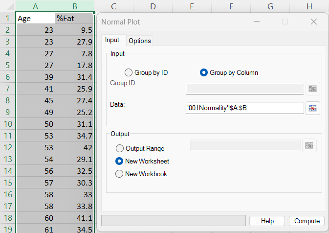
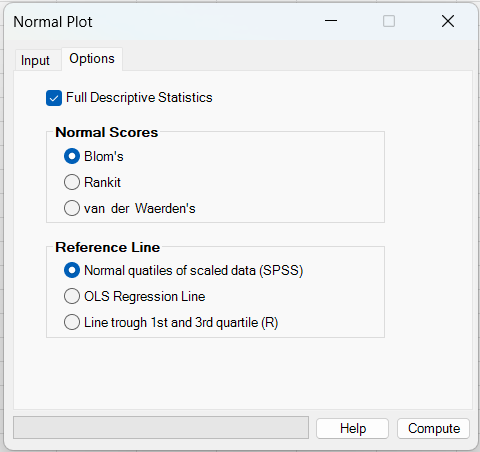
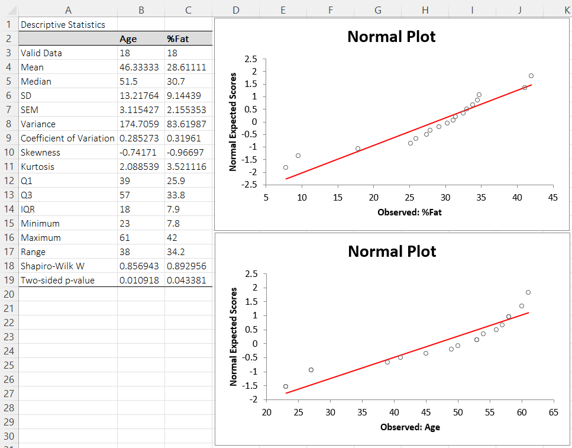

# Normal Plot

**Includes:** Rank methods: Blom, Rankit, Van der Waerden, Line fits: SPSS, OLS, R-style, Optional descriptive stats.  
**Purpose:** Create a normal probability plot to visually assess normality and identify deviations such as skewness or heavy tails.

---

## Overview

A **normal probability plot** (normal **Q–Q plot**) compares your **observed values** to the values expected under a normal distribution.  
If the data are approximately normal, the points fall close to a straight line. Common deviations:

- **S-shape**: heavy tails / light tails
- **Curvature**: skewness
- **Extreme points far from the line**: outliers

BESHStatNG draws the plot as:

- **X axis:** observed values \(x_{(i)}\) (sorted)
- **Y axis:** expected normal scores \(z_i\)

This orientation is the transpose of R’s default `qqnorm()` (which uses theoretical quantiles on the X axis). The same information is shown.

---

## Example dataset

Example used in the screenshots:

- [001Normality.csv](../assets/data/001normality/001Normality.csv)

---

## Screenshots

### Input tab


### Options tab


### Output


---

## When to use it

Use a normal plot when you want a quick visual check of normality for:

- parametric tests (t-tests, ANOVA, regression residuals),
- assumptions checking and outlier diagnostics.

For a formal hypothesis test, use **Normality Tests** (Shapiro–Wilk, D’Agostino–Pearson, …) in:

- `Analyse → Assumptions → Normality Tests` (see the separate help page).

---

## Inputs in Excel

### Group by Column
Select one or more numeric columns. Each column is plotted as a separate dataset.

### Group by ID
Use when your data are in long format: one column contains **group labels**, and another contains **values**.

### Output destination
- Output range (current sheet)
- New worksheet
- New workbook

---

## Options

### Normal Scores (expected normal scores)

BESHStatNG supports three standard plotting-position rules. Let \(r_i\) be the **midrank** (average rank for ties) for the \(i\)-th sorted value, and \(n\) the sample size.

For each point, BESHStatNG computes a plotting position \(p_i\) and then:

\[
z_i = \Phi^{-1}(p_i)
\]

where \(\Phi^{-1}\) is the standard normal quantile function.

**Blom**
\[
p_i = \frac{r_i - 3/8}{n + 1/4}
\]

**Rankit**
\[
p_i = \frac{r_i - 1/2}{n}
\]

**van der Waerden**
\[
p_i = \frac{r_i}{n + 1}
\]

### Reference Line

BESHStatNG can overlay one of three reference lines. In all cases the line is drawn in the \((x,z)\) plane:

\[
z = a + b x
\]

**Normal quantiles of scaled data (SPSS)**  
Uses the sample mean \(\bar x\) and sample standard deviation \(s\). It constructs two anchor points at the smallest and largest plotting positions, then fits a line through them.

Operationally, this corresponds to the familiar standardization relationship:

\[
z \approx \frac{x - \bar x}{s}
\]

**OLS Regression Line**  
Fits \(z\) on \(x\) by ordinary least squares using all points:

\[
b = \frac{\sum (x_i - \bar x)(z_i - \bar z)}{\sum (x_i - \bar x)^2},\qquad
a = \bar z - b\bar x
\]

**Line through 1st and 3rd quartile (R)**  
Matches the line to the sample quartiles \(Q_1\) and \(Q_3\) (computed by the add-in’s quartile routine), and their corresponding theoretical normal scores \(z_{0.25}, z_{0.75}\).

\[
b = \frac{z_{0.75} - z_{0.25}}{Q_3 - Q_1},\qquad
a = z_{0.25} - b Q_1
\]

Note: in BESHStatNG, \(z_{0.25}\) and \(z_{0.75}\) are computed using the same plotting-position rule you selected (Blom/Rankit/van der Waerden) applied to the “centered ranks” \(0.25(n+1)\) and \(0.75(n+1)\). This is very close to R’s `qqline()` idea (quartile matching), but may differ slightly from using exactly \(qnorm(0.25)\) and \(qnorm(0.75)\) for small \(n\).

### Full Descriptive Statistics
Adds a descriptive statistics table for each dataset (mean, SD, quartiles, etc.).

---

## Output

The output worksheet contains:

- (optional) a **Full Descriptive Statistics** table for each dataset
- one **Normal Plot** chart per dataset (scatter plot)
- a **Reference Line** overlaid on each plot (red line)


Example shown in screenshots:

- **Normal Scores:** Blom’s
- **Reference Line:** Normal quantiles of scaled data (SPSS)
- **Full Descriptive Statistics:** enabled

Steps:

1. Ribbon: **BESH Stat NG → Graphics → Normal Plot**
2. Input tab:
   - **Group by Column**
   - select: `001Normality!$A:$B` (or `001Normality!$A$1:$B$19`)
   - Output: **New Worksheet**
3. Options tab:
   - **Blom’s**
   - **Normal quantiles of scaled data (SPSS)**
   - enable **Full Descriptive Statistics**
4. Click **Compute**

---

### Brief interpretation (using this output)

To assess normality, combine:

- the **shape of the normal plot**, and
- **normality tests** (e.g., Shapiro–Wilk), and
- descriptive indicators (mean vs median, skewness, kurtosis, outliers).

From the example output:

- **Age**
  - Shapiro–Wilk p-value is below 0.05 → evidence against normality.
  - Skewness is negative and the mean is below the median → consistent with **left-skew**.
  - The normal plot shows tail deviations from the reference line rather than a tight straight-line pattern.

- **%Fat**
  - Shapiro–Wilk p-value is also below 0.05 → evidence against normality.
  - Skewness is more negative and the plot shows stronger deviation at the lower tail.
  - In combination with the boxplot view (see *Box and Whiskers*), the lower tail behaves like outliers / tail-heaviness.

**Rule of thumb:** minor deviations are common in small samples; focus on systematic curvature and tail behavior, and confirm with tests and context.

---

Interpretation tips:

- Points close to the line across the full range → normality is plausible.
- Systematic curvature → skewness.
- Ends bending away from the line → heavy/light tails.
- A few isolated points far from the line → potential outliers.

---

## R code (analogous results)

BESHStatNG plots **Observed** on the X axis and **Expected normal scores** on the Y axis.  
This snippet reproduces the same orientation and plotting positions.

```r
# x: numeric vector
x <- sort(x)
n <- length(x)

# midranks (average ranks for ties)
r <- rank(x, ties.method = "average")

# choose one plotting-position rule:
# Blom
p <- (r - 0.375) / (n + 0.25)
# Rankit: p <- (r - 0.5) / n
# van der Waerden: p <- r / (n + 1)

z <- qnorm(p)

plot(x, z, xlab = "Observed", ylab = "Normal expected scores", main = "Normal Plot")

# Reference lines:
# SPSS-like (standardization line)
abline(a = -mean(x)/sd(x), b = 1/sd(x))

# OLS (regress z on x)
# abline(lm(z ~ x))

# Quartile line (R-style)
# Q <- quantile(x, c(0.25, 0.75), type = 7)
# zQ <- qnorm(c(0.25, 0.75))
# b <- diff(zQ) / diff(Q); a <- zQ[1] - b * Q[1]
# abline(a = a, b = b)
```

---

## See also

- [Normality Tests](normality-tests.md)
- [Descriptive Statistics](descriptive-statistics.md)
- [Box and Whiskers](box-and-whiskers.md)
- [Symmetry](symmetry.md)
